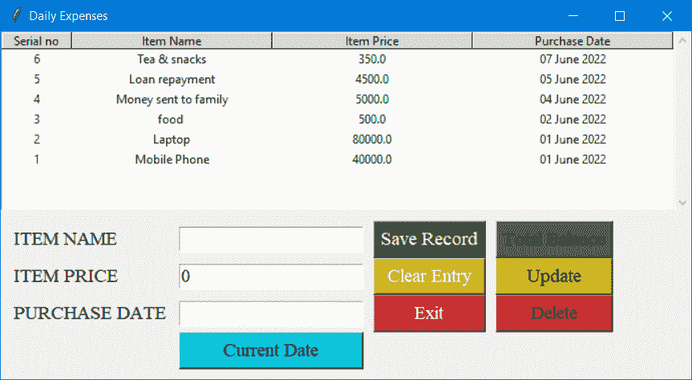
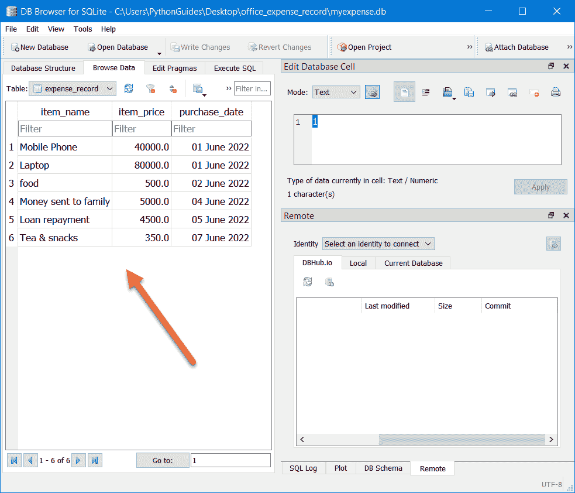

# 使用 Python Tkinter 的费用跟踪应用程序

> 原文：<https://pythonguides.com/expense-tracking-application-using-python-tkinter/>

[](https://sharepointsky.teachable.com/p/python-and-machine-learning-training-course)

最近，我们需要创建一个桌面应用程序来跟踪个人的支出。因此，我们使用带有 sqlite3 数据库的 [python tkinter](https://pythonguides.com/python-gui-programming/) 创建了这个费用跟踪应用程序。

***SQLite3*** 是 python 自带的免费数据库软件。以下命令显示了如何导入 SQLite3 模块:

```py
import sqlite3
```

目录

[](#)

*   [使用 Python 的费用跟踪应用程序](#Expense_Tracking_Application_Using_Python "Expense Tracking Application Using Python")
*   [应用程序的后端解释](#Backend_Explanation_of_the_Application "Backend Explanation of the Application")
*   [功能及其他操作说明](#Function_and_Other_Operations_Explanation "Function and Other Operations Explanation")
*   [main . py 的完整源代码](#Complete_Source_Code_for_mainpy "Complete Source Code for main.py")
*   [完整的源代码数据库 mydb.py](#Complete_Source_code_Database_mydbpy "Complete Source code Database mydb.py")

## 使用 Python 的费用跟踪应用程序

在本节中，我们解释了如何使用 python tkinter 创建应用程序的接口。整个代码分为 12 个部分，对于每个部分，我们都在粗体注释中提到了描述。

**1。导入模块**

创建应用程序的第一步是导入必要的模块。这里我们已经导入了 tkinter (*)中所有可用的模块。TTK 是 tkinter 家族的新成员，需要单独导入。最后我们导入了一个[消息框模块](https://pythonguides.com/python-tkinter-messagebox/)来显示提示。

**2。创建对象、标题和窗口大小**

下一步是为 tkinter 模块创建一个对象。在代码中， ***ws*** 是分配给对象的名称。使用这个对象名，我们进一步为 python tkinter 窗口分配了一个标题和大小。

了解更多关于 [Python Tkinter Title](https://pythonguides.com/python-tkinter-title/)

**3。无限循环**

代码最后一行中使用的主循环为用户保留屏幕。由于主循环，用户可以看到窗口并与之交互。在后台，一个窗口出现，然后在几微秒内消失。Mainloop 无限期重复该过程，因此会出现一个包含更新更改的新屏幕。

**4。全局变量**

我们将它们命名为全局变量，因为我们将在程序的不同部分使用这些变量。我们意识到在一个程序中为所有的部件放置相同的字体，这就是为什么字体名称和大小的值存储在一个简单的字母中。后来用这个字母给申请文本分配字体。

```py
amtvar = IntVar()
dopvar = StringVar()
```

这两个是文本变量，一个是整数数据类型，用于存储购买金额，另一个是字符串，用于记录购买日期。

**5。框架部件**

python tkinter 中的 frame 小部件用于存放其他小部件，通过移动容器小部件(frame ),可以方便地移动一组小部件。

创建了两个名为 ***、f1*** 和 ***f2*** 的帧，这两个帧都是使用 pack geometry manager 定位的。在 python tkinter 中， ***f1*** 框架包含除 Treeview 和 scrollbar 小部件之外的所有小部件。这两个小部件放置在 ***f2*** 框架上。

**6。标签小工具，7。入口小部件，8 个入口网格位置**

python tkinter 中的[标签小部件用于在应用程序窗口上显示文本。商品名称、商品价格和购买日期是该应用程序中使用的标签。](https://pythonguides.com/python-tkinter-label/)

python tkinter 中的[入口小部件允许用户通过在矩形框中键入来提供输入。我们已经使用网格几何管理器将所有小部件放置在 ***f1*** 框架小部件中。](https://pythonguides.com/python-tkinter-entry/)

**9。动作按钮，10 个按钮网格放置**

动作按钮用在应用程序窗口中，每次在应用程序窗口中单击它们时，都会执行或触发一个功能。到目前为止，我们已经在应用程序中创建了 6 种类型的按钮。

*   保存记录
*   清除输入
*   出口
*   总余额
*   更新
*   删除

**11。Treeview 查看记录**

Treeview 用于以有组织的表格格式显示记录的输出。树形视图的创建有三个部分。首先，我们创建了一个 Treeview，然后添加了一个标题或列，在使用样式后，我们改进了它的外观和感觉。

**12\. Scrollbar widget**

垂直滚动条被添加到 Treeview 小部件中，这样，如果数据超出了屏幕的大小，用户仍然可以通过上下滚动来查看数据。

```py
**#1 import modules**
from tkinter import *
from tkinter import ttk
from tkinter import messagebox

**#2 create object, title and window size**
ws = Tk()
ws.title('Office Expense')
# ws.geometry('600x400')

**#4 global variables**
f = ('Times new roman', 14)
amtvar = IntVar()
dopvar = StringVar()

**#5 frame** **widgets**
f2 = Frame(ws)
f2.pack() 

f1 = Frame(
    ws,
    padx=10,
    pady=10,
)
f1.pack(expand=True, fill=BOTH)

**#6 Label Widget**
Label(f1, text='ITEM NAME', font=f).grid(row=0, column=0, sticky=W)
Label(f1, text='ITEM PRICE', font=f).grid(row=1, column=0, sticky=W)
Label(f1, text='PURCHASE DATE', font=f).grid(row=2, column=0, sticky=W)

**#7 Entry Widgets** 
item_name = Entry(f1, font=f)
item_amt = Entry(f1, font=f, textvariable=amtvar)
transaction_date = Entry(f1, font=f, textvariable=dopvar)

**#8 Entry grid** **placement**
item_name.grid(row=0, column=1, sticky=EW, padx=(10, 0))
item_amt.grid(row=1, column=1, sticky=EW, padx=(10, 0))
transaction_date.grid(row=2, column=1, sticky=EW, padx=(10, 0))

**#9 Action buttons**
cur_date = Button(
    f1, 
    text='Current Date', 
    font=f, 
    bg='#04C4D9', 
    command=None,
    width=15
    )

submit_btn = Button(
    f1, 
    text='Save Record', 
    font=f, 
    command=None, 
    bg='#42602D', 
    fg='white'
    )

clr_btn = Button(
    f1, 
    text='Clear Entry', 
    font=f, 
    command=None, 
    bg='#D9B036', 
    fg='white'
    )

quit_btn = Button(
    f1, 
    text='Exit', 
    font=f, 
    command=None, 
    bg='#D33532', 
    fg='white'
    )

total_bal = Button(
    f1,
    text='Total Balance',
    font=f,
    command=None
)

total_bal = Button(
    f1,
    text='Total Balance',
    font=f,
    bg='#486966',
    fg='white',
    command=None
)

total_spent = Button(
    f1,
    text='Total Spent',
    font=f,
    fg='white',
    command=None
)

update_btn = Button(
    f1, 
    text='Update',
    bg='#C2BB00',
    command=None,
    fg='white',
    font=f
)

del_btn = Button(
    f1, 
    text='Delete',
    bg='#BD2A2E',
    fg='white',
    command=None,
    font=f
)

**#10 Button grid placement**
cur_date.grid(row=3, column=1, sticky=EW, padx=(10, 0))
submit_btn.grid(row=0, column=2, sticky=EW, padx=(10, 0))
clr_btn.grid(row=1, column=2, sticky=EW, padx=(10, 0))
quit_btn.grid(row=2, column=2, sticky=EW, padx=(10, 0))
total_bal.grid(row=0, column=3, sticky=EW, padx=(10, 0))
update_btn.grid(row=1, column=3, sticky=EW, padx=(10, 0))
del_btn.grid(row=2, column=3, sticky=EW, padx=(10, 0))

**#11 treeview to view the record**
tv = ttk.Treeview(f2, selectmode='browse', columns=(1, 2, 3, 4), show='headings', height=8, )
tv.pack(side="left")

tv.column(1, anchor=CENTER, stretch=NO, width=70)
tv.column(2, anchor=CENTER)
tv.column(3, anchor=CENTER)
tv.column(4, anchor=CENTER)
tv.heading(1, text="Serial no")
tv.heading(2, text="Item Name", )
tv.heading(3, text="Item Price")
tv.heading(4, text="Purchase Date")

style = ttk.Style()
style.theme_use("default")
style.map("Treeview")

**#12 scrollbar widget**
scrollbar = Scrollbar(f2, orient='vertical')
scrollbar.configure(command=tv.yview)
scrollbar.pack(side="right", fill="y")
tv.config(yscrollcommand=scrollbar.set)

**#3 infinite loop**
ws.mainloop() 
```

另外，查看: [Python Tkinter Canvas 教程](https://pythonguides.com/python-tkinter-canvas/)

## 应用程序的后端解释

在本节中，我们将向您解释与使用 python tkinter 和 sqlite3 数据库创建的 expense manager 应用程序中的数据库相关的所有源代码。

我们已经创建了一个具有必要方法的类来执行 CRUD 操作，稍后该类将在程序中使用 python tkinter 查看、插入、更新和删除 sqlite3 数据库中的数据。

**1 模块**

已经导入了 SQLite3 模块来执行与数据库相关的所有活动。

**2。类、构造函数和方法**

我们创建了一个名为 ***数据库*** 的类，这个类有执行 CRUD 操作的方法。`def __init__(self, db)`之后的代码是一个构造函数，它接受一个数据库名作为参数，如果还不存在，它还创建一个名为 ***expense_record*** 的表。

*   **fetchRecord()** 方法允许用户编写一个 SQL 查询来获取信息。
*   **insertRecord()** 方法在数据库中添加数据。
*   **removeRecord()** 方法从数据库中删除现有数据。
*   **updateRecord()** 方法允许更新数据库中的更改。

我们将它创建为一个单独的模块，名为 ***mydb.py*** ，这样用户就可以将这个模块导入到主程序中，如下一节所示。

```py
**#1 module**
import sqlite3

**#2 class, constructor and methods** 
class Database:
    def __init__(self, db):
        self.conn = sqlite3.connect(db)
        self.cur = self.conn.cursor()
        self.cur.execute(
            "CREATE TABLE IF NOT EXISTS expense_record (item_name text, item_price float, purchase_date date)")
        self.conn.commit()

    def fetchRecord(self, query):
        self.cur.execute(query)
        rows = self.cur.fetchall()
        return rows

    def insertRecord(self, item_name, item_price, purchase_date):
        self.cur.execute("INSERT INTO expense_record VALUES (?, ?, ?)",
                         (item_name, item_price, purchase_date))
        self.conn.commit()

    def removeRecord(self, rwid):
        self.cur.execute("DELETE FROM expense_record WHERE rowid=?", (rwid,))
        self.conn.commit()

    def updateRecord(self, item_name, item_price, purchase_date, rid):
        self.cur.execute("UPDATE expense_record SET item_name = ?, item_price = ?, purchase_date = ? WHERE rowid = ?",
                         (item_name, item_price, purchase_date, rid))
        self.conn.commit()

    def __del__(self):
        self.conn.close()
```

阅读: [Python Tkinter 进度条小工具](https://pythonguides.com/python-tkinter-progress-bar/)

## 功能及其他操作说明

在本节中，我们将讨论除 GUI 和数据库之外的源代码部分。我们将讨论以下事情:

**1。模块**

在上一节中，我们已经创建了一个名为 ***mydb.py*** 的模块，这里已经导入了那个模块及其所有的函数。使用其中的方法，我们可以在 python tkinter 中插入、更新、查看和删除数据库中的数据。

**2。数据库**的对象

我们为类数据库创建了一个对象，并将该对象命名为 ***数据*** 。此外，该对象接受一个参数，该参数将是数据库的名称。我们已经提供了 ***myexpense.db*** ，但是您提供的任何名称都带有扩展名 ***db*** 。

请注意，您通过在此处提供名称来加载现有数据库，但是该数据库必须具有相同的列。

**3。全局变量**

在函数内创建的变量只在该函数内有作用域。全局变量可以通过程序访问，它们的值会受到任何点上所做的更改的影响。

*   ***count=0*** 在程序稍后向树形视图中插入数据时使用。在这里，我们增加了计数的值，这样 iid 每次都可以有一个唯一的值。
*   SQLite3 的一个特性是自动维护名为 row id 的惟一行 id，在从数据库中获取数据时需要提到这个行 id

```py
select rowid, * from expense_record;
```

这个 rowid 在应用程序的 GUI 界面中显示为一个序列号。我们在全局变量 ***selected_rowid*** 中存储了用户在界面上选择的行的序号。

现在，由于我们有一个用户选择的行的*，我们已经把它放在更新和删除函数的 where 子句中。*

 ***4。功能**

让我们讨论一下这个应用程序中使用的函数。请注意，这些函数不是数据库类函数。这些主要集中在使用那些方法上。

**saveRecord()** 是使用数据库类的 ***insertRecord()*** 方法来存储数据库中的数据。我们已经传递了从入口小部件获取的所需参数。该功能由 python tkinter 中的 ***submit_btn*** 按钮触发。

*   **setDate()** 函数使用系统中的日期，并以日、月和年的格式将其设置在入口小部件上。
*   函数的作用是:清除所有的入口部件。它使用 delete 方法并提供开始和结束值来移除它。该功能由 **clr_btn** 按钮触发。
*   **fetch_records()** 函数使用数据库类中的 ***fetchRecord* ()** 方法从数据库中检索 rowid 和其他信息。获取数据后，它以表格格式在 Treeview 小部件上发布数据。
*   **select_record()** 函数与树形视图上的行选择相关。每当用户单击任何一行时，这个函数都会被触发，因为它是与鼠标单击绑定的。这个函数负责将 rowid 存储在全局变量中。
    这个方法在入口小部件上打印选中的行，这些小部件可以进一步更新。
*   **update_record()** 函数更新数据库中的现有信息。它使用数据库类中的 updaRecord()方法。
*   **total_balance()** 函数显示弹出消息，显示总消费金额和剩余金额。默认情况下，提供 5000 英镑作为基数，您可以根据自己的预算进行更改。
*   **refreshData()** 是另一个重要的方法，因为它允许用户实时查看更新。在插入、更新和删除数据时，我们必须在最后执行刷新操作，以便实时显示变化。
    如果我们不使用这个功能，我们每次都必须重启应用程序来查看更改。
*   **deleteRow()** 函数从数据库中删除选中的行，刷新函数立即显示更改。假设用户选择了一行，然后点击了删除按钮。
    该函数将从数据库中删除该条目，由于该条目已从数据库中删除，该行将在自动刷新后消失。

```py
**#1\. module**
from mydb import *

**#2\. object for database**
data = Database(db='myexpense.db')

**#3\. global variables**
count = 0
selected_rowid = 0

**#4\. functions**
def saveRecord():
    global data
    data.insertRecord(item_name=item_name.get(), item_price=item_amt.get(), purchase_date=transaction_date.get())

def setDate():
    date = dt.datetime.now()
    dopvar.set(f'{date:%d %B %Y}')

def clearEntries():
    item_name.delete(0, 'end')
    item_amt.delete(0, 'end')
    transaction_date.delete(0, 'end')

def fetch_records():
    f = data.fetchRecord('select rowid, * from expense_record')
    global count
    for rec in f:
        tv.insert(parent='', index='0', iid=count, values=(rec[0], rec[1], rec[2], rec[3]))
        count += 1
    tv.after(400, refreshData)

def select_record(event):
    global selected_rowid
    selected = tv.focus()    
    val = tv.item(selected, 'values')

    try:
        selected_rowid = val[0]
        d = val[3]
        namevar.set(val[1])
        amtvar.set(val[2])
        dopvar.set(str(d))
    except Exception as ep:
        pass

def update_record():
    global selected_rowid

    selected = tv.focus()
	# Update record
    try:
        data.updateRecord(namevar.get(), amtvar.get(), dopvar.get(), selected_rowid)
        tv.item(selected, text="", values=(namevar.get(), amtvar.get(), dopvar.get()))
    except Exception as ep:
        messagebox.showerror('Error',  ep)

	# Clear entry boxes
    item_name.delete(0, END)
    item_amt.delete(0, END)
    transaction_date.delete(0, END)
    tv.after(400, refreshData)

def totalBalance():
    f = data.fetchRecord(query="Select sum(item_price) from expense_record")
    for i in f:
        for j in i:
            messagebox.showinfo('Current Balance: ', f"Total Expense: ' {j} \nBalance Remaining: {5000 - j}")

def refreshData():
    for item in tv.get_children():
      tv.delete(item)
    fetch_records()

def deleteRow():
    global selected_rowid
    data.removeRecord(selected_rowid)
    refreshData()
```

阅读: [Python Tkinter 秒表](https://pythonguides.com/python-tkinter-stopwatch/)

## main . py 的完整源代码

下面的源代码是使用 python tkinter 创建的应用程序。以 main.py 的名称保存这个文件，并执行它来运行这个完整的应用程序。

```py
**# import modules** 
from tkinter import *
from tkinter import ttk
import datetime as dt
from mydb import *
from tkinter import messagebox

**# object for database**
data = Database(db='test.db')

**# global variables**
count = 0
selected_rowid = 0

**# functions**
def saveRecord():
    global data
    data.insertRecord(item_name=item_name.get(), item_price=item_amt.get(), purchase_date=transaction_date.get())

def setDate():
    date = dt.datetime.now()
    dopvar.set(f'{date:%d %B %Y}')

def clearEntries():
    item_name.delete(0, 'end')
    item_amt.delete(0, 'end')
    transaction_date.delete(0, 'end')

def fetch_records():
    f = data.fetchRecord('select rowid, * from expense_record')
    global count
    for rec in f:
        tv.insert(parent='', index='0', iid=count, values=(rec[0], rec[1], rec[2], rec[3]))
        count += 1
    tv.after(400, refreshData)

def select_record(event):
    global selected_rowid
    selected = tv.focus()    
    val = tv.item(selected, 'values')

    try:
        selected_rowid = val[0]
        d = val[3]
        namevar.set(val[1])
        amtvar.set(val[2])
        dopvar.set(str(d))
    except Exception as ep:
        pass

def update_record():
    global selected_rowid

    selected = tv.focus()
	# Update record
    try:
        data.updateRecord(namevar.get(), amtvar.get(), dopvar.get(), selected_rowid)
        tv.item(selected, text="", values=(namevar.get(), amtvar.get(), dopvar.get()))
    except Exception as ep:
        messagebox.showerror('Error',  ep)

	# Clear entry boxes
    item_name.delete(0, END)
    item_amt.delete(0, END)
    transaction_date.delete(0, END)
    tv.after(400, refreshData)

def totalBalance():
    f = data.fetchRecord(query="Select sum(item_price) from expense_record")
    for i in f:
        for j in i:
            messagebox.showinfo('Current Balance: ', f"Total Expense: ' {j} \nBalance Remaining: {5000 - j}")

def refreshData():
    for item in tv.get_children():
      tv.delete(item)
    fetch_records()

def deleteRow():
    global selected_rowid
    data.removeRecord(selected_rowid)
    refreshData()

**# create tkinter object**
ws = Tk()
ws.title('Daily Expenses')

**# variables**
f = ('Times new roman', 14)
namevar = StringVar()
amtvar = IntVar()
dopvar = StringVar()

**# Frame widget** f2 = Frame(ws)
f2.pack() 

f1 = Frame(
    ws,
    padx=10,
    pady=10,
)
f1.pack(expand=True, fill=BOTH)

**# Label widget** Label(f1, text='ITEM NAME', font=f).grid(row=0, column=0, sticky=W)
Label(f1, text='ITEM PRICE', font=f).grid(row=1, column=0, sticky=W)
Label(f1, text='PURCHASE DATE', font=f).grid(row=2, column=0, sticky=W)

**# Entry widgets** item_name = Entry(f1, font=f, textvariable=namevar)
item_amt = Entry(f1, font=f, textvariable=amtvar)
transaction_date = Entry(f1, font=f, textvariable=dopvar)

**# Entry grid placement** item_name.grid(row=0, column=1, sticky=EW, padx=(10, 0))
item_amt.grid(row=1, column=1, sticky=EW, padx=(10, 0))
transaction_date.grid(row=2, column=1, sticky=EW, padx=(10, 0))

**# Action buttons** cur_date = Button(
    f1, 
    text='Current Date', 
    font=f, 
    bg='#04C4D9', 
    command=setDate,
    width=15
    )

submit_btn = Button(
    f1, 
    text='Save Record', 
    font=f, 
    command=saveRecord, 
    bg='#42602D', 
    fg='white'
    )

clr_btn = Button(
    f1, 
    text='Clear Entry', 
    font=f, 
    command=clearEntries, 
    bg='#D9B036', 
    fg='white'
    )

quit_btn = Button(
    f1, 
    text='Exit', 
    font=f, 
    command=lambda:ws.destroy(), 
    bg='#D33532', 
    fg='white'
    )

total_bal = Button(
    f1,
    text='Total Balance',
    font=f,
    bg='#486966',
    command=totalBalance
)

total_spent = Button(
    f1,
    text='Total Spent',
    font=f,
    command=lambda:data.fetchRecord('select sum(ite)')
)

update_btn = Button(
    f1, 
    text='Update',
    bg='#C2BB00',
    command=update_record,
    font=f
)

del_btn = Button(
    f1, 
    text='Delete',
    bg='#BD2A2E',
    command=deleteRow,
    font=f
)

**# grid placement** cur_date.grid(row=3, column=1, sticky=EW, padx=(10, 0))
submit_btn.grid(row=0, column=2, sticky=EW, padx=(10, 0))
clr_btn.grid(row=1, column=2, sticky=EW, padx=(10, 0))
quit_btn.grid(row=2, column=2, sticky=EW, padx=(10, 0))
total_bal.grid(row=0, column=3, sticky=EW, padx=(10, 0))
update_btn.grid(row=1, column=3, sticky=EW, padx=(10, 0))
del_btn.grid(row=2, column=3, sticky=EW, padx=(10, 0))

**# Treeview widget**
tv = ttk.Treeview(f2, columns=(1, 2, 3, 4), show='headings', height=8)
tv.pack(side="left")

**# add heading to treeview** tv.column(1, anchor=CENTER, stretch=NO, width=70)
tv.column(2, anchor=CENTER)
tv.column(3, anchor=CENTER)
tv.column(4, anchor=CENTER)
tv.heading(1, text="Serial no")
tv.heading(2, text="Item Name", )
tv.heading(3, text="Item Price")
tv.heading(4, text="Purchase Date")

**# binding treeview** tv.bind("<ButtonRelease-1>", select_record)

**# style for treeview** style = ttk.Style()
style.theme_use("default")
style.map("Treeview")

**# Vertical scrollbar** scrollbar = Scrollbar(f2, orient='vertical')
scrollbar.configure(command=tv.yview)
scrollbar.pack(side="right", fill="y")
tv.config(yscrollcommand=scrollbar.set)

**# calling function** fetch_records()

**# infinite loop** ws.mainloop() 
```

下面的输出显示了费用管理应用程序的界面。您可以提供购买项目名称和项目价格，然后单击当前日期按钮获取当前日期。

如果需要，可以更改日期，然后单击保存记录按钮将数据存储在数据库中，相应的数据将显示在屏幕上的树形视图小部件中。

clear 按钮将清除入口小部件，exit 将关闭应用程序。总余额按钮将显示总花费金额和输入程序的剩余金额。

单击任意一行，数据将开始出现在相应的入口小部件中。在数据中进行更改，然后单击“更新”按钮，记录将相应更新。如果您要删除该行，请单击“删除”按钮。



Expense Tracking Application Using Python Tkinter Example

阅读:[如何用 Python 制作计算器](https://pythonguides.com/make-a-calculator-in-python/)

## 完整的源代码数据库 mydb.py

下面的源代码是使用 python tkinter 在 sqlite3 中创建一个数据库。将名为 mydb.py 的文件保存在保存主程序的同一目录中。

```py
import sqlite3

class Database:
    def __init__(self, db):
        self.conn = sqlite3.connect(db)
        self.cur = self.conn.cursor()
        self.cur.execute(
            "CREATE TABLE IF NOT EXISTS expense_record (item_name text, item_price float, purchase_date date)")
        self.conn.commit()

    def fetchRecord(self, query):
        self.cur.execute(query)
        rows = self.cur.fetchall()
        return rows

    def insertRecord(self, item_name, item_price, purchase_date):
        self.cur.execute("INSERT INTO expense_record VALUES (?, ?, ?)",
                         (item_name, item_price, purchase_date))
        self.conn.commit()

    def removeRecord(self, rwid):
        self.cur.execute("DELETE FROM expense_record WHERE rowid=?", (rwid,))
        self.conn.commit()

    def updateRecord(self, item_name, item_price, purchase_date, rid):
        self.cur.execute("UPDATE expense_record SET item_name = ?, item_price = ?, purchase_date = ? WHERE rowid = ?",
                         (item_name, item_price, purchase_date, rid))
        self.conn.commit()

    def __del__(self):
        self.conn.close()
```

下图显示了 SQLite3 数据库中的数据。我们正在使用[数据库浏览器(SQLite)](https://sqlitebrowser.org/) 软件查看这些数据。



Expense Tracking Application Using Python Tkinter

另外，看看更多的 Python Tkinter 教程。

*   [Python Tkinter 单选按钮](https://pythonguides.com/python-tkinter-radiobutton/)
*   [Python Tkinter Map()函数](https://pythonguides.com/python-tkinter-map-function/)
*   [Python Tkinter 退出程序](https://pythonguides.com/python-tkinter-exit-program/)
*   [Python Tkinter 文本框小工具](https://pythonguides.com/python-tkinter-text-box/)

因此，在这个 Python 教程中，我们了解了如何使用 Python Tkinter 构建一个**费用跟踪应用程序。在这里，我们借助 Python 中的一个例子来介绍每个步骤。**

[Bijay Kumar](https://pythonguides.com/author/fewlines4biju/)

Python 是美国最流行的语言之一。我从事 Python 工作已经有很长时间了，我在与 Tkinter、Pandas、NumPy、Turtle、Django、Matplotlib、Tensorflow、Scipy、Scikit-Learn 等各种库合作方面拥有专业知识。我有与美国、加拿大、英国、澳大利亚、新西兰等国家的各种客户合作的经验。查看我的个人资料。

[enjoysharepoint.com/](https://enjoysharepoint.com/)[](https://www.facebook.com/fewlines4biju "Facebook")[](https://www.linkedin.com/in/fewlines4biju/ "Linkedin")[](https://twitter.com/fewlines4biju "Twitter")*