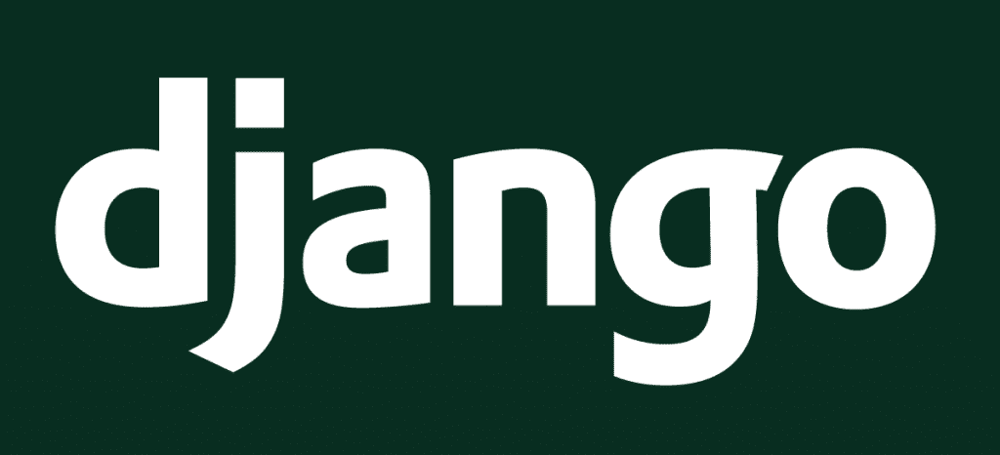
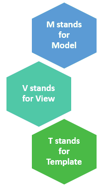

# Python Django 是什么，用来做什么

> 原文：<https://pythonguides.com/what-is-python-django/>

在本 [Python 教程](https://pythonguides.com/learn-python/)中，我们将学习**什么是 python Django，python Django 的各种特性，**并尝试了解**什么是 Python Django 用于**。下面给出了本文所涉及主题的详细列表。

*   姜戈是什么
*   姜戈的历史
*   python django 是用来做什么的
*   Django 的特点
*   姜戈建筑
*   使用 Django 的公司

目录

*   [什么是 Python Django](#What_is_Python_Django "What is Python Django ")
*   姜戈的历史
*   [python django 用来做什么](#What_is_python_django_used_for "What is python django used for ")
*   [姜戈的特征](#Features_of_Django "Features of Django")
*   [Django 建筑公司](#Django_Architecture "Django Architecture ")
*   [使用 Django 的公司](#Companies_using_Django "Companies using Django")

## 什么是 Python Django

*   Django 是一个流行的**基于 python 的框架**，它被用于 **web 开发**。它是一个高级 web 框架，允许快速构建安全且可维护的网站。
*   Django 是一个免费的开源框架，这意味着它可以免费使用。
*   Django 也遵循**模型-视图-控制器** (MVC)架构，这是现在 web 应用程序开发的标准。
*   它也有一个充满活力和积极的社区，优秀的文档，以及各种免费和付费的支持选项。

Official Django Logo

阅读 [Python Django 与 Flask 的主要区别](https://pythonguides.com/python-django-vs-flask/)

## 姜戈的历史

Django 是由《劳伦斯世界日报》的 Adrian Holovaty 和 Simon Willison 在 2003 年到 2005 年间创作的。它是作为《劳伦斯世界日报》的一个内部项目开始的。

有时，劳伦斯世界日报的 web 开发团队不得不在短时间内开发新功能，甚至完成应用程序。因此，Django 的创建是为了满足新闻网站的紧迫期限，同时仍然保持开发过程的整洁和可维护性。

到 2005 年，Django 已经发展到可以管理很多高地，所以开发者决定让它成为一个开源项目。所以，Django 在 2005 年被 BSD 许可释放。这个项目是以著名的爵士乐吉他手坦哥·雷恩哈特的名字命名的。

为了维护 Django，2008 年成立了一个名为 Django 软件基金会(DSF)的基金会。

从 2008 年 9 月的第一个版本(1.0)到最近的版本 3.1，Django 一直在发展和改进。

阅读: [Python while 循环多个条件](https://pythonguides.com/python-while-loop-multiple-conditions/)

## python django 用于T3 是什么

Django 最初是为一家报纸公司 Lawrence Journal-World 开发 web 应用程序的。因此，它非常适合处理包含大量文本内容、媒体文件和高流量的项目。然而，这个框架的使用并不仅限于出版业。

Django 的每个新版本都添加了新的特性，这使得构建任何类型的 web 应用程序都足够高效。我们可以使用 Django 开发任何类型的 web 应用程序，从社交媒体网站到电子商务商店。

以下是 Django 现在使用的一些领域。

*   具有 B2B CRM 系统、定制 CRM 系统的平台
*   具有数据分析、过滤等功能的平台。
*   创建管理仪表板
*   创建电子邮件系统
*   创建核查系统
*   创建基于算法的生成器
*   机器学习平台

阅读: [Python Tkinter 测验–完整教程](https://pythonguides.com/python-tkinter-quiz/)

## 姜戈的特征

到目前为止，我们已经了解了什么是 Django 框架，以及它的用途。现在，让我们来理解为什么 Django 是最流行的 web 开发框架之一。

Django 提供了各种各样的特性，使得开发过程变得干净而高效。它结合了许多功能，使其成为一个完整的框架。这里列出了 Django 提供的一些主要特性。

1.  **开源**–Django 是一个开源的 python 框架，这意味着我们可以免费下载和使用它。这有助于降低应用程序的总成本。
2.  **快速开发**–Django 的设计目标是创建一个框架，允许开发者在更短的时间内开发 web 应用程序。因此，Django 减少了项目实现，允许快速的 web 开发。
3.  **可扩展**–Django 本质上是可扩展的，这意味着我们可以轻松地从小规模应用程序迁移到大规模应用程序。
4.  **Secure**–Django 是一个安全的框架，因为它提供了帮助开发人员避免典型安全问题的工具。它还提供了一个身份验证系统来存储和管理用户帐户和密码。
5.  被广泛支持的库–Django 包含了大量的模块和库，可以用来管理不同的 web 开发任务。
6.  管理界面–Django 有一个内置的管理界面。所以，我们不需要从头开始构建它。另外，我们可以根据需要定制界面。
7.  **大型社区**–Django 是最流行的 web 开发框架之一。因此，它有一个大而友好的社区以及分享和联系的渠道。

阅读: [Python 字典初始化](https://pythonguides.com/python-dictionary-initialize/)

## 姜戈建筑

Django 遵循它自己的模型-视图-控制器(MVC)架构的惯例，命名为模型-视图模板(MVT)。MVT 是一种软件设计模式，主要由 3 个组件组成:模型、视图和模板。

Model-View-Template

MVT 体系结构中的模型是用于处理数据的数据访问层。模型在将整个架构连接到数据库方面起着至关重要的作用。每个模型都链接到一个数据库表，我们使用 models.py 文件。

MVT 体系结构中的视图用于定义数据流的整体逻辑。对于这个实现，我们使用 view.py 文件。此外，视图文件的目的是将响应发送给适当的用户。

MVT 体系结构中的模板是处理用户界面的表示层。

接下来，让我们了解 Django 使用 MVT 架构的工作流程。

Django Workflow

因此，每当用户请求某个资源时，Django 就充当控制器，在 urls.py 文件中寻找资源。如果 URL 映射，则调用与该 URL 关联的视图。在这之后，视图与模型和模板交互，并呈现模板。最后，Django 响应用户并返回模板作为响应。

更多细节还可以参考下面的[官方文档](https://docs.djangoproject.com/en/3.2/)。

Read: [ModuleNotFoundError:没有名为 Django 的模块](https://pythonguides.com/modulenotfounderror-no-module-named-django/)

## 公司使用 Django

因此，Django 简单易用，此外，它提供了如此多的东西，使它成为任何类型的 web 应用程序的完美框架。

Django 非常高效，一些大公司也在他们的 web 应用程序中使用它。以下是一些使用 Django 的公司。

1.  照片墙
2.  Spotify
3.  浏览器名
4.  国家地理
5.  拼趣
6.  Bitbucket
7.  Eventbrite

您可能也会喜欢以下文章:

*   [如何在 Python 中创建字符串](https://pythonguides.com/create-a-string-in-python/)
*   [Python 字典值列表](https://pythonguides.com/python-dictionary-values-to-list/)
*   [Python 字典更新示例](https://pythonguides.com/python-dictionary-update/)
*   [Python NumPy max 带示例](https://pythonguides.com/python-numpy-max-with-examples/)
*   [Python 字典长度](https://pythonguides.com/python-dictionary-length/)

所以在本教程中，我们已经了解了 Django 框架，它的特性，并且理解了 Django 的用途。在本文中，我们讨论了以下主题。

*   姜戈是什么
*   姜戈的历史
*   python django 是用来做什么的
*   Django 的特点
*   姜戈建筑
*   使用 Django 的公司

[Bijay Kumar](https://pythonguides.com/author/fewlines4biju/)

Python 是美国最流行的语言之一。我从事 Python 工作已经有很长时间了，我在与 Tkinter、Pandas、NumPy、Turtle、Django、Matplotlib、Tensorflow、Scipy、Scikit-Learn 等各种库合作方面拥有专业知识。我有与美国、加拿大、英国、澳大利亚、新西兰等国家的各种客户合作的经验。查看我的个人资料。

[enjoysharepoint.com/](https://enjoysharepoint.com/)