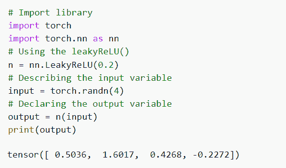
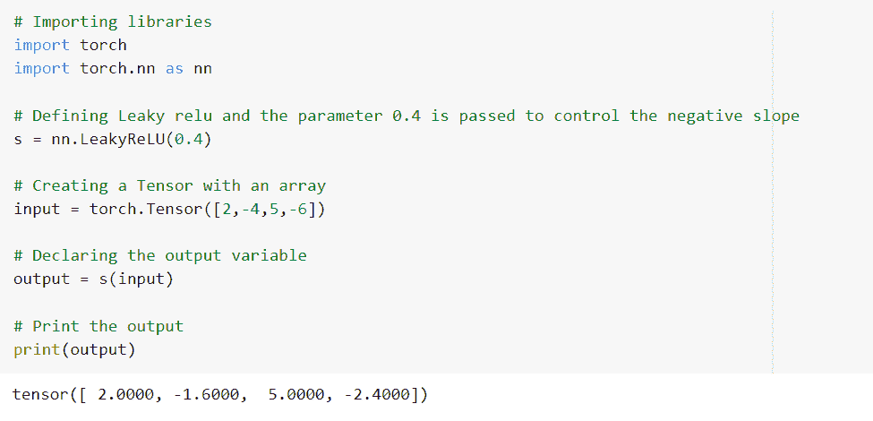
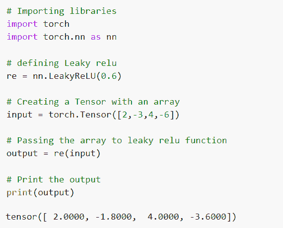
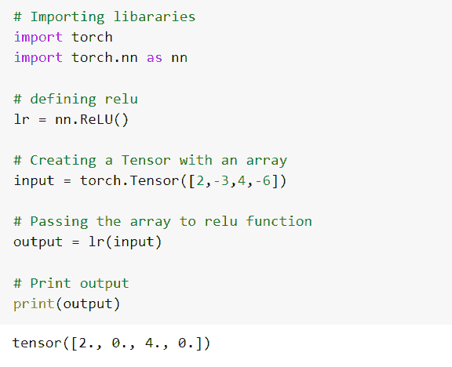

# PyTorch Leaky ReLU 有用的教程

> 原文：<https://pythonguides.com/pytorch-leaky-relu/>

[](https://sharepointsky.teachable.com/p/python-and-machine-learning-training-course)

在本 [Python 教程](https://pythonguides.com/learn-python/)中，我们将学习 **PyTorch leaky ReLU** 函数。这个函数是一个激活函数，用于解决神经元死亡的问题。此外，我们将涵盖与 **PyTorch 泄漏 ReLU** 相关的不同例子。也涵盖了这些主题。

*   皮托里奇注意到了
*   PyTorch 泄漏 relu 示例
*   pytorch leaky 在 inplace 站了起来
*   PyTorch 渗漏斜坡
*   PyTorch 泄漏 relu 功能
*   pytorch leaky relu vs relu

目录

[](#)

*   [pytorch league relu](#PyTorch_Leaky_Relu "PyTorch Leaky Relu")
*   [PyTorch 泄漏 relu 示例](#PyTorch_leaky_relu_example "PyTorch leaky relu example")
*   [pytorch leach 在 inlace](#PyTorch_leaky_relu_inplace "PyTorch leaky relu inplace")中指出
*   [PyTorch 泄漏 relu 斜率](#PyTorch_leaky_relu_slope "PyTorch leaky relu slope")
*   [PyTorch 泄漏 relu 功能](#PyTorch_leaky_relu_functional "PyTorch leaky relu functional")
*   [pytorch league relu vs relu](#PyTorch_leaky_relu_vs_relu "PyTorch leaky relu vs relu")

## pytorch league relu

在这一节中，我们将学习 python 中的 PyTorch Leaky Relu 是如何工作的。

PyTorch 泄漏 relu 是一个激活函数。如果输入是负的，函数的导数不为零，并且神经元的学习速率不停止，则它是有益的函数。这个函数用来解决神经元死亡的问题。

**语法:**

leaky relu 的语法是:

```py
torch.nn.LeakyReLU(negative_slope = 0.01, inplace = False)
```

**参数**

以下是在 **LeakyReLU()** 函数中使用的参数。

*   **负 _ 斜率:**用于控制负斜率的角度。负斜率的默认值为 1e-2。
*   **就地:**可以选择就地操作。inplace 的默认值为 False。如果 inplace 的值为 True，它将直接改变输入，而不分配任何额外的输出。

这样，我们理解了 PyTorch leaky relu 在 python 中是如何工作的。

阅读: [PyTorch 激活功能](https://pythonguides.com/pytorch-activation-function/)

## PyTorch 泄漏 relu 示例

在本节中，我们将借助 python 中的一个示例来了解 **PyTorch leaky relu。**

PyTorch 泄漏 relu 被定义为激活函数。如果输入是负的，函数的导数将是一个非常小的分数，并且永远不会为零。

这确保了神经元的学习速率在反向传播期间不会停止，从而避免了神经元死亡的问题。

**代码:**

在下面的代码中，首先我们将导入 torch 模块，然后我们将 torch.nn 作为 nn 导入。

*   **n = nn。LeakyReLU(0.2)** 这里我们使用的是 LeakyReLU()函数。
*   **input = torch.randn(4)** 这里我们用 torch.random()函数来描述输入变量。
*   **output = n(input)** 这里我们声明输出变量。
*   **print(output)** 用于通过 print()函数打印输出值。

```py
# Import library
import torch
import torch.nn as nn
# Using the leakyReLU()
n = nn.LeakyReLU(0.2)
# Describing the input variable
input = torch.randn(4)
# Declaring the output variable
output = n(input)
print(output)
```

**输出:**

运行上面的代码后，我们得到下面的输出，其中我们可以看到 PyTorch leaky relu 值被打印在屏幕上。



PyTorch leaky relu example

PyTorch 泄漏 relu 的实现就是这样完成的。

阅读: [PyTorch 全连接层](https://pythonguides.com/pytorch-fully-connected-layer/)

## pytorch leach 在 inlace中指出

在这一节中，我们将学习 PyThon 中的 **PyTorch leaky relu inplace** 。

PyTorch 泄漏 relu 在位被定义为激活函数，在这个函数中，我们使用在位的参数。

**语法:**

PyTorch leaky relu inplace 的语法:

```py
torch.nn.LeakyReLU(inplace=True)
```

**参数:**

以下是参数:

*   **inplace = True** 这意味着它将直接改变输入而不分配任何额外的输出，inplace 参数的默认值为 False。

这就是 Pytorch leaky relu 函数中 inplace 参数的工作方式。

阅读: [PyTorch 车型总结](https://pythonguides.com/pytorch-model-summary/)

## PyTorch 泄漏 relu 斜率

在这一节中，我们将了解 PyTorch leaky relu 如何在 python 中工作。

在前进之前，我们应该有一个关于斜率的知识。斜坡是一边比另一边高的表面。

PyTorch 泄漏 relu 斜率定义为当输入为负且函数的微分不为零时。

**语法:**

泄漏 relu 斜率的语法:

```py
torch.nn.LeakyReLU(negative_slope = 0.01)
```

**参数:**

以下是泄漏 relu 的参数:

**负 _ 斜率:**用于控制负斜率的角度。负斜率的默认值为 1e-2。

**代码:**

在下面的代码中，首先我们将导入 torch 模块，然后我们将 torch.nn 作为 nn 导入。

*   s = nn。LeakyReLU(0.4) 用于定义 LeakyReLU()函数，在该函数中，我们使用参数 0.4 来控制负斜率。
*   **输入=火炬。张量([2，-4，5，-6])** 用于创建一个带数组的张量。
*   **output = s(input)** 这里我们声明输出变量。
*   **print(output)** 用于借助 print()函数打印输出值。

```py
# Importing libraries
import torch
import torch.nn as nn

# Defining Leaky relu and the parameter 0.4 is passed to control the negative slope 
s = nn.LeakyReLU(0.4)

# Creating a Tensor with an array
input = torch.Tensor([2,-4,5,-6])

# Declaring the output variable
output = s(input)

# Print the output
print(output)
```

**输出:**

运行上述代码后，我们得到以下输出，其中我们可以看到 PyTorch leaky relu slope 值打印在屏幕上。



PyTorch leaky relu slope

因此，有了这个，我们理解了 PyTorch 渗漏的 relu 斜坡是如何工作的。

阅读: [PyTorch 逻辑回归](https://pythonguides.com/pytorch-logistic-regression/)

## PyTorch 泄漏 relu 功能

在这一节中，我们将学习 python 中的 **PyTorch leaky relu 函数**。

PyTorch leaky relu 泛函被定义为用于解决神经元死亡问题的过程。

这个功能非常有用。如果输入值为负，则函数的导数不为零。

**语法:**

PyTorch leaky relu 函数的语法:

```py
torch.nn.functional.leaky_relu(input,negative_slope = 0.01, inplace = False)
```

**参数:**

以下是泄漏 relu 功能中使用的参数:

*   **负 _ 斜率:**用于控制负斜率的角度。负斜率的默认值为 1e-2。
*   **就地:**可以选择就地操作。inplace 的默认值为 False。如果 inplace 的值是 T，它将直接改变输入，而不分配任何额外的输出。

Pytorch 泄漏 relu 函数就是这样工作的。

阅读: [PyTorch 模型评估+示例](https://pythonguides.com/pytorch-model-eval/)

## pytorch league relu vs relu

在这一节中，我们将了解 PyTorch leaky relu 和 python 中的 relu 之间的**区别。**

**pytorch league relu:**

漏 relu 函数非常有用。在 leaky relu 中，如果输入值为负，导数不为零。

泄漏的 relu 还解决了神经元死亡的问题，并且神经元的学习速率不会停止。

**举例:**

在下面的代码中，首先我们将导入所有必要的库，如 import torch 和 import torch.nn as nn。

re = nn。LeakyReLU(0.6): 这里我们定义的是 LeakyReLU()函数。

**输入=火炬。张量([2，-3，4，-6])** 用于创建一个带数组的张量。

**output = re(input)** 用于将数组传递给 leaky relu 函数。

**打印(输出)**用于使用 print()函数打印输出。

```py
# Importing libraries
import torch
import torch.nn as nn

# defining Leaky relu
re = nn.LeakyReLU(0.6)

# Creating a Tensor with an array
input = torch.Tensor([2,-3,4,-6])

# Passing the array to leaky relu function
output = re(input)

# Print the output
print(output)
```

**输出:**

运行上面的例子后，我们得到下面的输出，我们可以看到 PyTorch leaky relu 值打印在屏幕上。



PyTorch leaky relu

**PyTorch relu:**

relu 函数是非线性且可微分的函数。在 relu 中，如果输入是负的，导数变为零，这导致神经元死亡和神经元的学习速率停止。

**举例:**

在下面的代码中，首先我们将导入所有必要的库，如 import torch 和 import torch.nn as nn。

*   **lr = nn。ReLU():** 这里我们定义 ReLU()函数。
*   **输入=火炬。张量([2，-3，4，-6])** 用于创建一个带数组的张量。
*   **output = lr(input)** 用于将数组传递给 relu 函数。
*   **打印(输出)**用于借助 print()函数进行打印。

```py
# Importing libararies
import torch
import torch.nn as nn

# defining relu
lr = nn.ReLU()

# Creating a Tensor with an array
input = torch.Tensor([2,-3,4,-6])

# Passing the array to relu function
output = lr(input)

# Print output
print(output)
```

**输出:**

在下面的输出中，您可以看到 PyTorch relu 值打印在屏幕上。



PyTorch relu

这样，我们就理解了 PyTorch 泄漏 relu 和 relu 函数之间的区别。

另外，再看看一些 PyTorch 教程。

*   [PyTorch nn Conv2d](https://pythonguides.com/pytorch-nn-conv2d/)
*   [PyTorch 提前停止+示例](https://pythonguides.com/pytorch-early-stopping/)
*   [py torch ms loss–详细指南](https://pythonguides.com/pytorch-mseloss/)
*   [PyTorch 批量归一化](https://pythonguides.com/pytorch-batch-normalization/)
*   [PyTorch 负载模型+示例](https://pythonguides.com/pytorch-load-model/)

因此，在本教程中，我们讨论了 **PyTorch Leaky ReLU** 并涵盖了与其实现相关的不同示例。这是我们已经讨论过的例子列表。

*   皮托里奇注意到了
*   PyTorch 泄漏 relu 示例
*   pytorch leaky 在 inplace 站了起来
*   PyTorch 渗漏斜坡
*   PyTorch 泄漏 relu 功能
*   pytorch leaky relu vs relu

[Bijay Kumar](https://pythonguides.com/author/fewlines4biju/)

Python 是美国最流行的语言之一。我从事 Python 工作已经有很长时间了，我在与 Tkinter、Pandas、NumPy、Turtle、Django、Matplotlib、Tensorflow、Scipy、Scikit-Learn 等各种库合作方面拥有专业知识。我有与美国、加拿大、英国、澳大利亚、新西兰等国家的各种客户合作的经验。查看我的个人资料。

[enjoysharepoint.com/](https://enjoysharepoint.com/)[](https://www.facebook.com/fewlines4biju "Facebook")[](https://www.linkedin.com/in/fewlines4biju/ "Linkedin")[](https://twitter.com/fewlines4biju "Twitter")