# PyTorch Numpy 到张量[有 11 个例子]

> 原文：<https://pythonguides.com/pytorch-numpy-to-tensor/>

[](https://sharepointsky.teachable.com/p/python-and-machine-learning-training-course)

在本 [Python 教程](https://pythonguides.com/learn-python/)中，我们将学习 **PyTorch Numpy to Tensor** 。PyTorch Numpy to Tensor 定义为从 Numpy . NDA array 创建张量的过程。此外，我们还将介绍与 PyTorch NumPy to tensor 相关的不同示例。也涵盖了这些主题。

*   numpy 的喇叭是张量
*   PyTorch 数值到张量浮点 64
*   Pytorch numpy to tensor GPU
*   numpy 张量是 dtype 张量
*   PyTorch numpy.ndarray 到张量
*   PyTorch 将 numpy 转换为张量
*   numpy 的喇叭是 int 的张量
*   Pytorch numpy 到张量 CPU
*   PyTorch numpy 到 CUDA 张量
*   PyTorch numpy 到张量列表
*   PyTorch 数字图像到张量

目录

[](#)

*   【numpy 指针为张量
*   [py torch numpy to tensor float 64](#PyTorch_numpy_to_tensor_float64 "PyTorch numpy to tensor float64")
*   [Pytorch numpy 到张量 GPU](#Pytorch_numpy_to_tensor_GPU "Pytorch numpy to tensor GPU")
*   [py torch numpy to tensor dtype](#Pytorch_numpy_to_tensor_dtype "Pytorch numpy to tensor dtype")
*   [PyTorch numpy.ndarray 到张量](#PyTorch_numpyndarray_to_tensor "PyTorch numpy.ndarray to tensor")
*   [PyTorch 将 numpy 转换为张量](#PyTorch_transforms_numpy_to_tensor "PyTorch transforms numpy to tensor")
*   【numpy 指针是 int 的张量
*   【numpy 指针是 CPU 张量
*   [PyTorch numpy 到 CUDA 张量](#PyTorch_numpy_to_CUDA_tensor "PyTorch numpy to CUDA tensor")
*   [PyTorch numpy to 张量列表](#PyTorch_numpy_to_tensor_list "PyTorch numpy to tensor list")
*   [PyTorch numpy 图像到张量](#PyTorch_numpy_image_to_tensor "PyTorch numpy image to tensor")

## 【numpy 指针为张量

在这一节中，我们将学习 python 中的 **PyTorch NumPy to tensor** 。

张量是一种特定的数据结构，非常接近于数组和矩阵。在 Pytorch 中，我们使用张量来加密模型的输入和输出。

***torch . from _ numpy()***函数支持将 numpy 数组转换为张量。

**代码:**

在下面的代码中，首先我们将导入所有必要的库，如 import torch，并将 numpy 作为 np 导入。

*   **数据= [[2，4]，[4，8]]** 用作数据。
*   **n _ data = torch . tensor(data)**用作可以直接从数据中创建的张量。
*   **print(n_data)** 用于通过 print()函数打印 n_data。
*   **t _ num = torch . from _ numpy(num _ array)**这里张量可以从 numpy 数组中创建。
*   **print(t_num)** 用于通过 print()函数打印 t_num。

```
# Importing libraries
import torch
import numpy as np

# Tensor can created directly from numdata
num_data = [[2, 4], [4, 8]]
n_data = torch.tensor(num_data)
print(n_data)

# Tensor can be created from numpy array
num_array = np.array(num_data)
t_num = torch.from_numpy(num_array)
print(t_num)
```

**输出:**

运行上面的代码后，我们得到下面的输出，其中我们可以看到 numpy 数组被转换为张量，结果被打印在屏幕上。

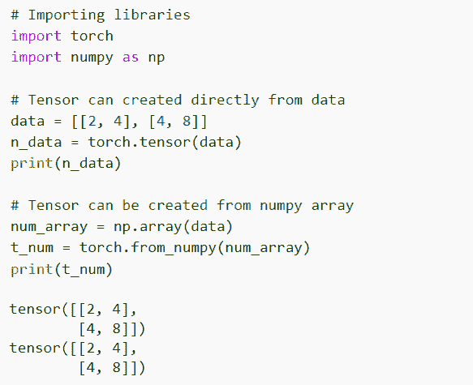

PyTorch numpy to tensor

有了这个，我们明白了如何把 NumPy 转换成张量。

阅读:[py torch RNN-详细指南](https://pythonguides.com/pytorch-rnn/)

## py torch numpy to tensor float 64

在这一节中，我们将学习如何在 python 中将 **PyTorch numpy 转换为 tensor float 64** 。

在前进之前，我们应该有一些关于浮动的知识。Float 是一种数据类型，包括以十进制格式表示的分数。

PyTorch numpy to tensor float64 用于将 numpy 数组转换为 tensor float64 数组。

**代码:**

在下面的代码中，首先我们将导入所有必要的库，如 import torch，并将 numpy 作为 np 导入。

*   **数据= [[2。，4]，[4，8]，[5，10]]** 用作数据。
    **n_data = torch.tensor(数据)**用作张量可以直接从数据中创建。
*   **print(n_data)** 用于通过 print()函数打印 n_data。
    **t _ num = torch . from _ numpy(num _ array)**这里张量可以从 numpy 数组中创建。
    **print(t_num)** 用于通过 print()函数打印 t_num。
*   **print(t_num)** 用于打印张量数组。
*   **print(t_num.shape)** 用于打印张量数组形状。
*   **print(t_num.dtype)** 用于打印张量数组数据类型。

```
# Importing libraries
# Importing libraries
import torch
import numpy as np

# Tensor can created directly from numpy data
data = [[2., 4], [4, 8], [5,10]]
n_data = torch.tensor(data)
print(n_data)

# Tensor can be created from numpy array
num_array = np.array(data)
t_num = torch.from_numpy(num_array)
# Print output
print(t_num)
print(t_num.shape)
print(t_num.dtype)
```

**输出:**

在下面的输出中，您可以看到 PyTorch numpy 数组被转换为张量 float64。

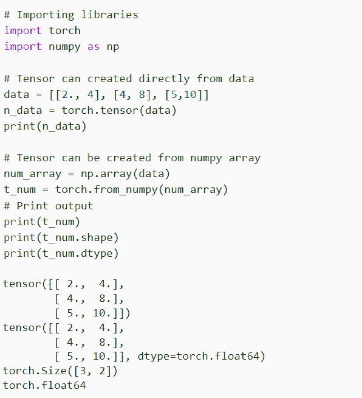

PyTorch numpy to tensor float64

这就是我们如何通过使用 torch.from_numpy()函数将 numpy 数组转换为张量浮点数。

阅读: [PyTorch MNIST 教程](https://pythonguides.com/pytorch-mnist/)

## Pytorch numpy 到张量 GPU

在这一节中，我们将学习如何在 python 中将 **PyTorch numpy 转换为 tensor GPU** 。

PyTorch 张量与 numpy ndarrays 相同，只是张量可以在 GPU 上运行。它只是一个 n 维数组，使用任意数值计算。

PyTorch numpy 转张量 GPU 是一个将 numpy 转换为张量 GPU 的过程。张量存储在 GPU 上，共享同一个内存。

**代码:**

在下面的代码中，首先我们将导入所有必要的库，如 import torch，并将 numpy 作为 np 导入。

*   **x = np.eye(4)** 用作内置函数，用于返回矩阵。
*   **torch.from_numpy(x)。to("cuda")** 用于将 numpy 转换为张量 GPU。

```
# Importing linraries
import torch
import numpy as np

# Using np.eye() function
x = np.eye(4)

# Converting numpy to tensor GPU
torch.from_numpy(x).to("cuda")
```

**输出:**

运行上面的代码后，我们得到下面的输出，其中我们可以看到 numpy 到 tensor GPU 的转换打印在屏幕上。

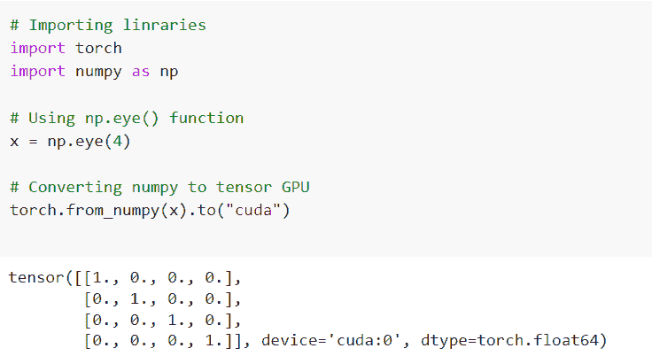

PyTorch numpy to tensor GPU

因此，通过这个，我们了解了如何将 numpy 转换为张量 GPU。

阅读: [PyTorch 全连接层](https://pythonguides.com/pytorch-fully-connected-layer/)

## py torch numpy to tensor dtype

在本节中，我们将学习如何在 python 中将 **PyTorch numpy 转换为张量 dtype** 。

在继续之前，我们应该了解一些关于 dtype 的知识。

dtype 是一种数据类型，它描述了固定大小的内存块与数组保持联系的字节数。数据类型的类型有整型、浮点型等。

PyTorch numpy to tensor dtype 定义为将 numpy 转换为 tensor dtype 数组的过程。

**代码:**

在下面的代码中，首先我们将导入所有必要的库，如 import torch，并将 numpy 作为 np 导入。

*   **array = numpy.array([2.0，-0.4，4.4，-3.1，0.1])** 用作大小为五的 numpy 数组。
*   **print(array)** 用于通过 print()函数打印数组。
*   **tensor = torch . from_numpy(array)**用于应用 from _ numpy()函数，并将结果张量存储在“tensor”中。
*   **print(tensor)** 用于通过使用print()函数来打印张量。

```
# Importing the PyTorch library
import torch
import numpy

# A numpy array of size 5
array = numpy.array([2.0, -0.4, 4.4, -3.1, 0.1])
print(array)

# Applying the from_numpy function and
# storing the resulting tensor in 'tensor'
tensor = torch.from_numpy(array)
print(tensor)
```

**输出:**

运行上面的代码后，我们得到下面的输出，其中我们可以看到 PyTorch numpy to tensor dtype 打印在屏幕上。

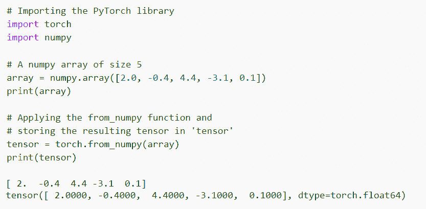

PyTorch numpy to tensor dtype

这就是我们如何将 numpy 数组转换成张量数据类型，并获得张量数组的数据类型。

阅读: [PyTorch 双星交叉熵](https://pythonguides.com/pytorch-binary-cross-entropy/)

## PyTorch numpy.ndarray 到张量

在本节中，我们将学习如何在 python 中将 **PyTorch numpy.ndarray 转换为张量**。

PyTorch 张量与 NumPy ndarrays 相同，只是张量可以在 GPU 上运行。它只是一个 n 维数组，使用任意数值计算。

**代码:**

在下面的代码中，首先我们将导入所有必要的库，如 import torch，并将 numpy 作为 np 导入。

*   **b = np.array([[2，4，6]，[3，1，2]，[3，4，5]，[6，7，5]])** 用于创建一个 numpy.ndarray b
*   **print("b:\n "，b)** 用于通过 print()函数打印 b 值。
*   **print("Type of b :\n "，type(b))** 用于打印 b 的类型。
*   **ten = torch.from_numpy(b)** 用于将 numpy.ndarray 转换为张量。
*   **print("tensor:\n "，ten)** 用于通过 print()函数打印张量。
*   **打印("转换后类型:\n "，类型(十))**用于打印转换后的类型。

```
# import the libraries
import torch
import numpy as np

# Create a numpy.ndarray "b"
b = np.array([[2,4,6],[3,1,2],[3,4,5],[6,7,5]])
print("b:\n", b)

print("Type of b :\n", type(b))
# Convert the numpy.ndarray to tensor
ten = torch.from_numpy(b)
print("tensor:\n", ten)
print("Type after conversion:\n", type(ten))
```

**输出:**

在下面的输出中，可以看到屏幕上打印出了 ***PyTorch numpy.ndarray 到张量*** 的值。

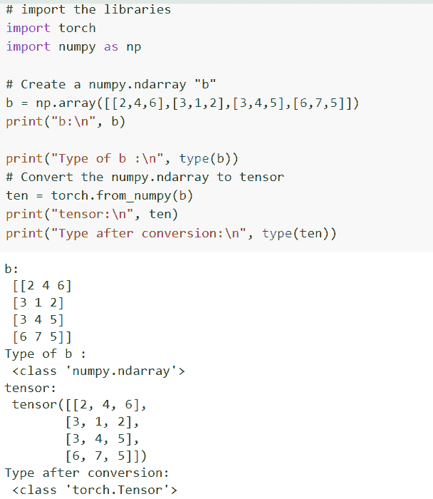

PyTorch numpy.ndarray to tensor

这样，我们就明白了如何将 numpy.ndarray 转换成张量。

阅读: [PyTorch 逻辑回归](https://pythonguides.com/pytorch-logistic-regression/)

## PyTorch 将 numpy 转换为张量

在这一节中，我们将学习如何用 python 将 PyTorch numpy 转换成张量。

PyTorch 张量类似于 numpy.ndarray，这里我们将借助 **torch.from_numpy()** 函数将 numpy 数组转换为张量。

**代码:**

在下面的代码中，首先我们将导入所有必要的库，如 import torch，并将 numpy 作为 np 导入。

*   **array = np.array([2，4，6，8，10，12])** 通过使用 **np.array()** 函数来描述变量。
*   **tensor _ x = torch . from _ numpy(array)**用于将 numpy 数组转换为张量。
*   **print(tensor_x)** 用于打印张量 x 值。
*   **print(tensor_y)** 用于打印张量 y 值。
*   **print(tensor_z)** 用于打印张量 y 值。

```
# Importing Libraries
import torch
import numpy as np

# Describing an array
array = np.array([2, 4, 6, 8, 10, 12])

# Convert Numpy array to torch.Tensor
tensor_x = torch.from_numpy(array)
tensor_y = torch.Tensor(array)
tensor_z = torch.tensor(array)
# Print outputs
print(tensor_x)
print(tensor_y)
print(tensor_z)
```

**输出:**

运行上面的代码后，我们得到下面的输出，其中我们可以看到 PyTorch 将 numpy 转换为张量数组打印在屏幕上。

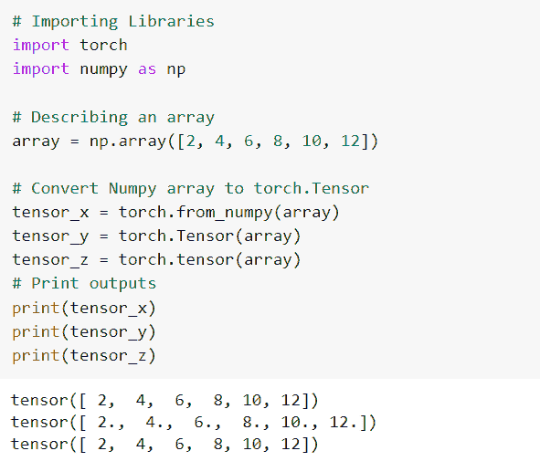

PyTorch transforms numpy to tensor

这就是我们如何将 numpy 数组转换成张量数据类型，并获得张量数组的数据类型。

阅读: [PyTorch 提前停止+示例](https://pythonguides.com/pytorch-early-stopping/)

## 【numpy 指针是 int 的张量

在本节中，我们将学习如何在 python 中将 **PyTorch numpy 转换为 tensor int** 。

PyTorch numpy to tensor 是我们借助 torch.from_numpy()函数将 numpy 数组转换为 tensor int 的过程。

**代码:**

在下面的代码中，首先我们将导入所有必要的库，如 import torch，并将 numpy 作为 np 导入。

*   **n_data = np.array([[2，4]，[6，8]，[10，12]])** 定义为 numpy 数组。
*   **numdata = torch.tensor(n_data)**这里张量可以通过使用 torch . tensor()直接从 n _ data 创建。
*   **t _ num = torch.from_numpy(num _ array)**用于借助 torch . from _ numpy()函数将 numpy 转换为张量。
*   **print(t_num)** 用于通过 print()函数打印 t_num。
*   **print(t_num.shape)** 用于打印 t_num 的形状。
*   **print(t_num.dtype)** 用于打印 t_num 的数据类型。

```
# Importing libraries
import torch
import numpy as np

# Tensor can created directly from n_data
n_data = [[2, 4], [6, 8], [10,12]]
numdata = torch.tensor(n_data)
print(numdata)

# Tensor can be created from numpy array
num_array = np.array(n_data)
t_num = torch.from_numpy(num_array)
# Print output
print(t_num)
print(t_num.shape)
print(t_num.dtype)
```

**输出:**

在下面的输出中，您可以看到 PyTorch numpy 到 tensor int 的转换打印在屏幕上。

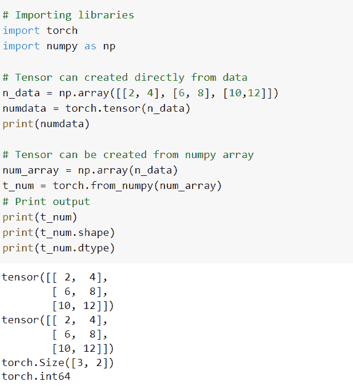

PyTorch numpy to tensor int

有了这个，我们知道了如何将 PyTorch numpy 转换成张量 int。

阅读:[py torch ms loss–详细指南](https://pythonguides.com/pytorch-mseloss/)

## 【numpy 指针是 CPU 张量

在本节中，我们将学习如何在 python 中将 **PyTorch numpy 转换为张量 CPU** 。

PyTorch numpy 到张量 CPU 是一个将 numpy 转换为张量 CPU 的过程。NumPy 数组存储在 CPU 上，并共享相同的内存。

**代码:**

在下面的代码中，首先我们将导入所有必要的库，如 import torch，并将 numpy 作为 np 导入。

*   **numpy_array = np.array([[3，6，9]，[4，8，16]，[5，10，25]])** 用于使用 np.array()函数创建一个 numpy 数组。
*   **print(numpy_array)** 用于借助 print()函数打印 numpy 数组。
*   **tensor _ arr = torch . from _ numpy(numpy _ array)**用于借助 torch.from_tensor()函数将 numpy 数组转换为张量 CPU。

```
# Importing libraries
import torch
import numpy
# Create a numpy array
numpy_array = np.array([[3,6,9],[4,8,16],[5,10,25]])
print(numpy_array)
# Comversion of numpy to tensor CPU
tensor_arr = torch.from_numpy(numpy_array)
tensor_arr
```

**输出:**

运行上面的代码后，我们得到下面的输出，其中我们可以看到 PyTorch numpy 到 tensor CPU 的转换打印在屏幕上。

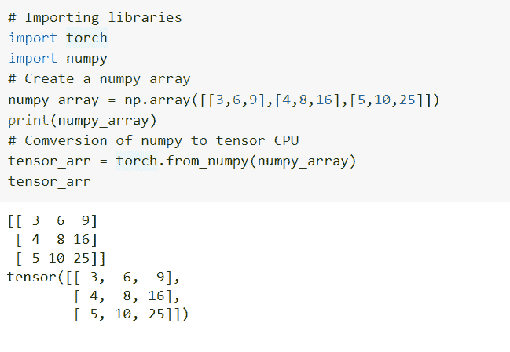

PyTorch numpy to tensor CPU

这就是我们如何将 PyTorch numpy 数组转换成张量 CPU。

阅读: [PyTorch 张量到 Numpy](https://pythonguides.com/pytorch-tensor-to-numpy/)

## PyTorch numpy 到 CUDA 张量

在本节中，我们将学习如何在 python 中将 **PyTorch numpy 转换成 CUDA 张量**。

在继续之前，我们应该了解一些关于 CUDA 的知识。

CUDA 代表计算统一设备架构，这是一个应用程序编程接口，允许软件使用特定类型的 GPU。

PyTorch numpy 到 CUDA 张量被定义为将 PyTorch numpy 转换为 CUDA 张量的过程。

**代码:**

在下面的代码中，首先我们将导入所有必要的库，如 import torch，并将 numpy 作为 np 导入。

*   **numpy_array = np.array([[3，6，9]，[4，8，16]，[5，10，25]])** 用于创建一个 numpy 数组。
*   **print(numpy_array)** 用于通过 print()函数打印 numpy 数组。
*   **device = torch . device(" cuda:0 " if torch . CUDA . is _ available()else " CPU ")**这里我们声明设备并检查 CUDA 是否可用。
*   **tensor _ GPU = torch . from _ numpy(numpy _ array)。【T1 到(device)】用于将 numpy 转换为 CUDA 张量。**
*   **print(tensor_gpu)** 用于打印 CUDA 张量。

```
# Importing libraries
import torch
import numpy
# Create a numpy array
numpy_array = np.array([[3,6,9],[4,8,16],[5,10,25]])
print(numpy_array)
# Declaring the device
# check Cuda is available or not
device = torch.device("cuda:0" if torch.cuda.is_available() else "cpu")
# Converting numpy to CUDA tensor
tensor_gpu=torch.from_numpy(numpy_array).to(device)
print(tensor_gpu)
```

**输出:**

在下面的输出中，您可以看到 PyTorch numpy 到 CUDA 张量的转换打印在屏幕上。

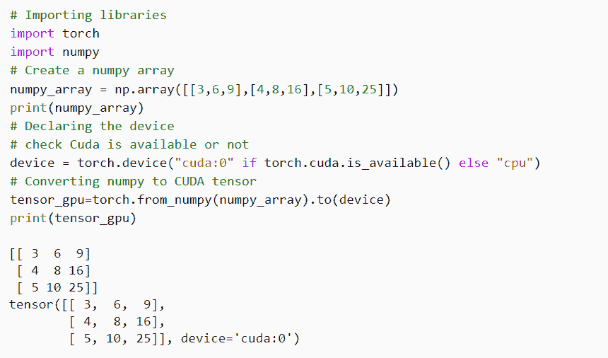

PyTorch numpy to CUDA tensor

这样，我们就明白了如何将 PyTorch numpy 转换成 CUDA 张量。

Read: [Keras Vs PyTorch](https://pythonguides.com/keras-vs-pytorch/)

## PyTorch numpy to 张量列表

在这一节中，我们将学习如何在 python 中将 **PyTorch numpy 转换成张量列表**。

PyTorch numpy 转张量表定义为借助 tensor.from_numpy()函数将 PyTorch numpy 转换为张量表的过程。

**代码:**

在下面的代码中，首先我们将导入所有必要的库，如 import torch，并将 numpy 作为 np 导入。

*   **array = np.array([[3，9，15]，[4，12，20]，[5，15，30])**用于创建一个 numpy 数组。
*   **print(array)** 用于使用 print()函数打印 numpy 数组。
*   **list _ of _ tensor = torch.from_numpy(numpy _ array)**用于使用 torch . from _ numpy()函数将 numpy 数组转换为张量列表。
*   **print(list_of_tensor)** 用于打印张量列表。

```
# Importing libraries
import torch
import numpy
# Create a numpy array
array = np.array([[3,9,15],[4,12,20],[5,15,30]])
print(array)
# Comversion of numpy to tensor CPU
list_of_tensor = torch.from_numpy(numpy_array)
print(list_of_tensor)
```

**输出:**

运行上面的代码后，我们得到下面的输出，其中我们可以看到 PyTorch numpy 到张量列表的转换打印在屏幕上。

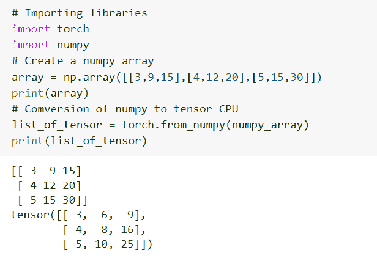

Pytorch numpy to tensor list

这就是我们如何将 PyTorch numpy 转换成张量列表。

阅读: [PyTorch 负载模型+示例](https://pythonguides.com/pytorch-load-model/)

## PyTorch numpy 图像到张量

在本节中，我们将学习如何在 python 中将 **PyTorch numpy 图像转换为张量**。

PyTorch numpy 图像到张量定义为使用 tensor.from_numpy()函数将 PyTorch numpy 图像转换为张量的过程。

**代码:**

在下面的代码中，首先我们将导入所有必要的库，如 import torch，并从 skimage 导入 io。

*   **img = io . im read(' input . png ')**用于读取图像。
*   **device = torch . device(" cuda:0 " if torch . cuda . is _ available()else " CPU ")**用作本次转换中使用的设备。
*   **img = torch.from_numpy(img)。float()** 用于将 PyTorch numpy 图像转换为张量。
*   **print(img.device)** 用于借助 print()函数打印 image.device。

```
# Importing libraries
import torch
from skimage import io

# Reading an image
img = io.imread('input.png')

# Using the devide
device = torch.device("cuda:0" if torch.cuda.is_available() else "cpu")
print(device)

# Converting numpy image to tensor
img = torch.from_numpy(img).float()
print(img.device)
```

**输出:**

在下面的输出中，你可以看到 numpy 图像到张量的转换打印在屏幕上。

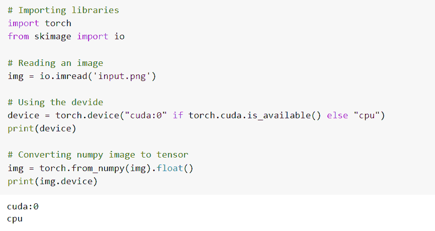

PyTorch numpy image to tensor

你可能也喜欢阅读下面的 PyTorch 教程。

*   [PyTorch nn 线性+示例](https://pythonguides.com/pytorch-nn-linear/)
*   [交叉熵损失 PyTorch](https://pythonguides.com/cross-entropy-loss-pytorch/)
*   [PyTorch 激活功能](https://pythonguides.com/pytorch-activation-function/)
*   [亚当优化器 PyTorch](https://pythonguides.com/adam-optimizer-pytorch/)
*   [PyTorch 整形张量](https://pythonguides.com/pytorch-reshape-tensor/)

因此，在本教程中，我们讨论了 **PyTorch numpy to tensor** ，并且我们还讨论了与其实现相关的不同示例。这是我们已经讨论过的例子列表。

*   numpy 的喇叭是张量
*   PyTorch 数值到张量浮点 64
*   Pytorch numpy to tensor GPU
*   numpy 张量是 dtype 张量
*   PyTorch numpy.ndarray 到张量
*   PyTorch 将 numpy 转换为张量
*   numpy 的喇叭是 int 的张量
*   PyTorch numpy 到张量 CPU
*   PyTorch numpy 到 CUDA 张量
*   PyTorch numpy 到张量列表
*   PyTorch 数字图像到张量

[Bijay Kumar](https://pythonguides.com/author/fewlines4biju/)

Python 是美国最流行的语言之一。我从事 Python 工作已经有很长时间了，我在与 Tkinter、Pandas、NumPy、Turtle、Django、Matplotlib、Tensorflow、Scipy、Scikit-Learn 等各种库合作方面拥有专业知识。我有与美国、加拿大、英国、澳大利亚、新西兰等国家的各种客户合作的经验。查看我的个人资料。

[enjoysharepoint.com/](https://enjoysharepoint.com/)[](https://www.facebook.com/fewlines4biju "Facebook")[](https://www.linkedin.com/in/fewlines4biju/ "Linkedin")[](https://twitter.com/fewlines4biju "Twitter")