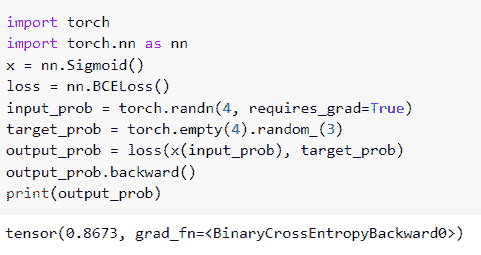
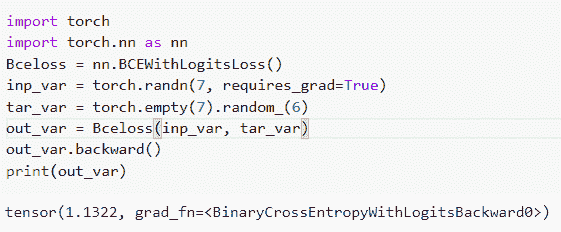
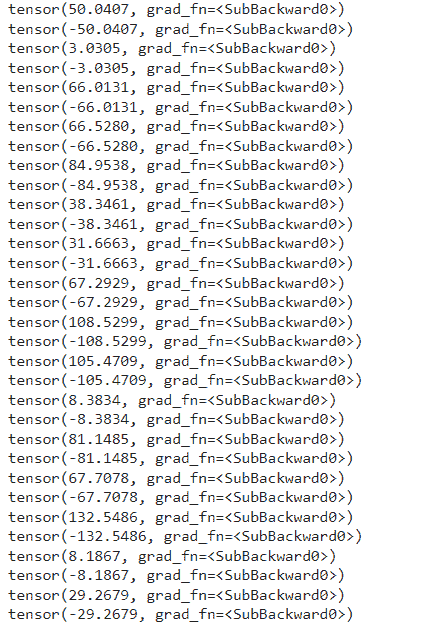
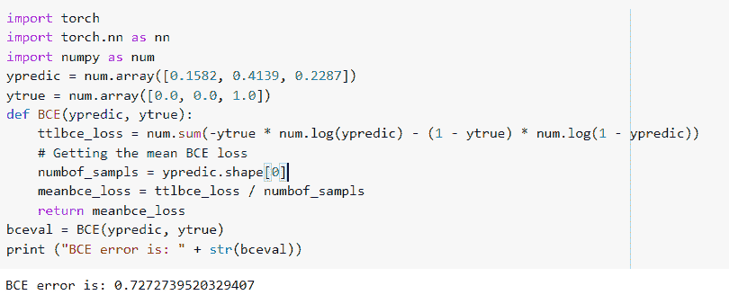
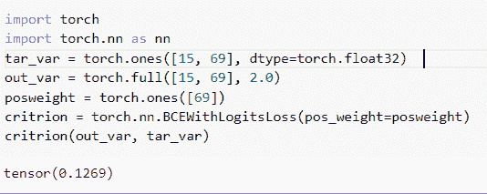
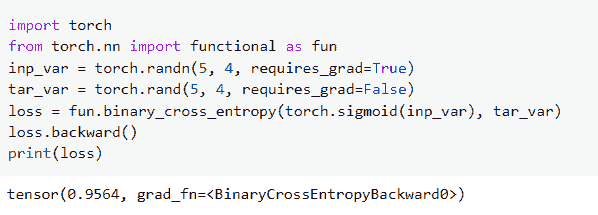

# PyTorch 二元交叉熵

> 原文：<https://pythonguides.com/pytorch-binary-cross-entropy/>

[](https://sharepointsky.teachable.com/p/python-and-machine-learning-training-course)

在这个 [Python 教程](https://pythonguides.com/learn-python/)中，我们将学习 Python 中的 **PyTorch 二元交叉熵**，我们还将涵盖与**二元交叉熵**相关的不同例子。此外，我们将涵盖这些主题。

*   PyTorch 二元交叉熵
*   PyTorch 二元交叉熵示例
*   具有对数的 PyTorch 二元交叉熵
*   PyTorch 二元交叉熵权
*   PyTorch 二元交叉熵损失函数
*   PyTorch 二元交叉熵 pos_weight
*   PyTorch 二元交叉熵 sigmoid

目录

[](#)

*   [PyTorch 二元交叉熵](#PyTorch_Binary_cross_entropy "PyTorch Binary cross entropy")
*   [PyTorch 二元交叉熵示例](#PyTorch_Binary_cross_entropy_example "PyTorch Binary cross entropy example")
*   [PyTorch 二元交叉熵与逻辑](#PyTorch_Binary_cross_entropy_with_logits "PyTorch Binary cross entropy with logits")
*   [PyTorch 二元交叉熵权](#PyTorch_Binary_cross_entropy_weight "PyTorch Binary cross entropy weight")
*   [PyTorch 二元交叉熵损失函数](#PyTorch_Binary_cross_entropy_loss_function "PyTorch Binary cross entropy loss function")
*   [PyTorch 二元交叉熵 pos_weight](#PyTorch_Binary_cross_entropy_pos_weight "PyTorch Binary cross entropy pos_weight")
*   [PyTorch 双星交叉熵 sigmoid](#PyTorch_Binary_cross_entropy_sigmoid "PyTorch Binary cross entropy sigmoid")

## PyTorch 二元交叉熵

本节我们将学习 python 中的****[【py torch】](https://pythonguides.com/what-is-pytorch/)**二进制交叉熵**。

它创建了一个计算目标概率和输入概率之间的二元交叉熵的规范。

**语法:**

PyTorch 中二元交叉熵的语法如下:

```
torch.nn.BCELoss(weight=None,size_average=None,reduce=None,reduction='mean)
```

**参数:**

1.  **权重**给每个元素的损失重新计算权重。
2.  **size_average** 损失在批次中的每个损失元素上平均。
3.  **减少**损失是每个迷你批次的平均观察值，取决于 size_average。
4.  **缩减**说明应用于输出的缩减:“无”、“平均值”、“总和”。
    *   **‘无’**定义为不应用任何缩减。
    *   **‘mean’**定义为将输出的总和除以输出中的元素数。
    *   **‘sum’**定义为给定输出将被求和。

阅读 [PyTorch 型号总结](https://pythonguides.com/pytorch-model-summary/)

## PyTorch 二元交叉熵示例

在这一节中，我们将借助 PyTorch 中的一个例子来了解**如何实现二元交叉熵**。

创建范数来计算目标概率和输入概率之间的二元交叉熵。它还用于计算重建误差。

**代码:**

在下面的代码中，我们将导入 torch 模块，从中我们可以计算二进制交叉熵。

*   **x = nn。Sigmoid()** 用于保证单元的输出在 0 和 1 之间。
*   **损失= nn。BCELoss()** 用于计算二元交叉熵损失。
*   **input_prob = torch.randn(4，requires_grad=True)** 用于计算输入概率。
*   **target_prob = torch.empty(4)。random_(3)** 用于计算目标概率。
*   **output _ prob = loss(x(input _ prob)，target_prob)** 用于得到输出概率。
*   **print(output_prob)** 用于在屏幕上打印输出概率。

```
import torch
import torch.nn as nn
x = nn.Sigmoid()
loss = nn.BCELoss()
input_prob = torch.randn(4, requires_grad=True)
target_prob = torch.empty(4).random_(3)
output_prob = loss(x(input_prob), target_prob)
output_prob.backward()
print(output_prob)
```

**输出:**

运行上面的代码后，我们得到下面的输出，可以看到二进制交叉熵值打印在屏幕上。



PyTorch binary cross entropy example

阅读:[Keras Vs py torch–主要区别](https://pythonguides.com/keras-vs-pytorch/)

## PyTorch 二元交叉熵与逻辑

在这一节中，我们将学习 python 中带有 logits 的 **PyTorch 二元交叉熵。**

二元交叉熵将每个预测概率与实际输出(可能是 0 或 1)进行对比。

它还根据与期望值的距离计算处理概率的分数。

**代码:**

在下面的代码中，我们将导入 torch 模块，从中我们可以用 logits 计算二进制交叉熵。

*   **Bceloss = nn。BCEWithLogitsLoss()** 用于计算二元交叉熵 logit 损失。
*   **inp_var = torch.randn(7，requires_grad=True)** 作为输入变量。
*   **tar_var = torch.empty(7)。random_(6)** 作为目标变量。
*   **out_var = Bceloss(inp_var，tar_var)** 用于计算输出变量。
*   **print(out_var)** 用于打印输出变量。

```
import torch
import torch.nn as nn
Bceloss = nn.BCEWithLogitsLoss()
inp_var = torch.randn(7, requires_grad=True)
tar_var = torch.empty(7).random_(6)
out_var = Bceloss(inp_var, tar_var)
out_var.backward()
print(out_var)
```

**输出:**

在下面的输出中，我们可以看到带有 logits 值的 PyTorch 二元交叉熵被打印在屏幕上。



PyTorch binary cross entropy with logits

阅读:[py torch ms loss–详细指南](https://pythonguides.com/pytorch-mseloss/)

## PyTorch 二元交叉熵权

在本节中，我们将学习 python 中的 **PyTorch 二进制交叉熵权**。

它创建了度量输入和目标概率之间的二元交叉熵的标准。二元交叉熵中的权重是迭代可调的

**代码:**

在下面的代码中，我们将导入 torch 模块，从中我们可以计算二进制交叉熵权重。

*   critrion = nn。BCEWithLogitsLoss(pos _ weight = poswight)用于计算二元交叉熵。
*   **loss = critrion(a，b)** 用于计算损失。
*   **weight = torch . ones _ like(loss rw)**用于生成权重。
*   critrionrw_sig = nn。BCELoss(reduction='none') 用于创建标准原始 s 形线。
*   **loss rw _ SIG = critrion rw _ SIG(torch . sigmoid(a)，b)** 用于计算原始 sigmoid 的损耗。
*   **print(loss–loss rw)**用于在屏幕上打印损耗值。

```
import torch
import torch.nn as nn
for x in range(70):
    poswight = torch.randint(1, 100, (1,)).float()

    critrion = nn.BCEWithLogitsLoss(pos_weight=poswight)
    a = torch.randn(15, 3, requires_grad=True)
    b = torch.randint(0, 4, (15, 3)).float()

    loss = critrion(a, b)

    critrionrw = nn.BCEWithLogitsLoss(reduction='none')
    lossrw = critrionrw(a, b)
    weight = torch.ones_like(lossrw)
    weight[b==1.] = poswight
    lossrw = (lossrw * weight).mean()

    critrionrw_sig = nn.BCELoss(reduction='none')
    lossrw_sig = critrionrw_sig(torch.sigmoid(a), b)
    lossrw_sig = ((lossrw_sig) * weight).mean()

    print(loss - lossrw)    
    print(lossrw_sig - loss)
```

**输出:**

运行上面的代码后，我们得到下面的输出，其中我们可以看到 PyTorch 二进制交叉熵权值被打印在屏幕上。



PyTorch binary cross entropy weight

阅读: [PyTorch 批量标准化](https://pythonguides.com/pytorch-batch-normalization/)

## PyTorch 二元交叉熵损失函数

在本节中，我们将学习 python 中的 **PyTorch 交叉熵损失函数**。

二进制交叉熵是一个损失函数，它将每个预测概率与实际输出进行比较，实际输出可以是 0 或 1。

**代码:**

在下面的代码中，我们将导入 torch 模块，从中我们可以计算二进制交叉熵损失函数。

*   **ypredic = num.array([0.1582，0.4139，0.2287])** 用于预测 y 值。
*   **TTL BCE _ loss = num . sum(-y true * num . log(ypredic)–( 1–y true)* num . log(1–ypredic))**用于计算总的二元交叉熵损失值。
*   **numb of _ sampls = ypredic . shape[0]**用于获取样本数。
*   **mean BCE _ loss = TTL BCE _ loss/numb of _ sampls**用于计算平均值。
*   **print(" BCE error is:"+str(BC eval))**用于打印二进制交叉熵误差。

```
import torch
import torch.nn as nn
import numpy as num
ypredic = num.array([0.1582, 0.4139, 0.2287])
ytrue = num.array([0.0, 0.0, 1.0]) 
def BCE(ypredic, ytrue):
    ttlbce_loss = num.sum(-ytrue * num.log(ypredic) - (1 - ytrue) * num.log(1 - ypredic))
    # Getting the mean BCE loss
    numbof_sampls = ypredic.shape[0]
    meanbce_loss = ttlbce_loss / numbof_sampls
    return meanbce_loss
bceval = BCE(ypredic, ytrue)
print ("BCE error is: " + str(bceval))
```

**输出:**

运行上面的代码后，我们得到下面的输出，可以看到二进制交叉熵损失值打印在屏幕上。



PyTorch binary cross entropy loss function

阅读: [PyTorch 负载模型+示例](https://pythonguides.com/pytorch-load-model/)

## PyTorch 二元交叉熵 pos_weight

在本节中，我们将学习 python 中的 **PyTorch 交叉熵 pos_weight** 。

pos_weight 被定义为正例的权重。它必须是一个向量，长度等于几个类。

**代码:**

在下面的代码中，我们将导入一些模块，从中我们可以计算正例的权重。

*   **tar_var = torch.ones([15，69]，dtype=torch.float32)** 用于计算批量为 15 和 69 类的目标值。
*   **out_var = torch.full([15，69]，2.0)** 用作预测 logit。
*   **pos weight = torch . ones([69])**作为正例的权重，所有权重等于 1。
*   **critrion(out_var，tar_var)** 用于创建度量二进制交叉熵的标准。

```
import torch
import torch.nn as nn
tar_var = torch.ones([15, 69], dtype=torch.float32)  
out_var = torch.full([15, 69], 2.0)  
posweight = torch.ones([69])  
critrion = torch.nn.BCEWithLogitsLoss(pos_weight=posweight)
critrion(out_var, tar_var) 
```

**输出:**

在下面的输出中，我们可以看到所有权重都等于 1 的 PyTorch 交叉熵 pos_weight 值被打印在屏幕上。



PyTorch binary cross entropy pos_weight

阅读: [PyTorch nn 线性+例题](https://pythonguides.com/pytorch-nn-linear/)

## PyTorch 双星交叉熵 sigmoid

在本节中，我们将学习 python 中的 **PyTorch 二元交叉熵 sigmoid** 。

sigmoid 函数是一个实函数，它定义了所有的输入值，并且在每个点都有一个非负导数。

**代码:**

在下面的代码中，我们将导入 torch 模块，从中我们可以计算二进制交叉熵 sigmoid。

*   **inp_var = torch.randn(5，4，requires_grad=True)** 用于生成输入变量。
*   **tar_var = torch.rand(5，4，requires_grad=False)** 用于生成目标变量。
*   **loss = fun . binary _ cross _ entropy(torch . sigmoid(InP _ var)，tar_var)** 用于计算二元交叉熵 sigmoid 函数。
*   **print(loss)** 用于在屏幕上打印损耗值。

```
import torch
from torch.nn import functional as fun
inp_var = torch.randn(5, 4, requires_grad=True)
tar_var = torch.rand(5, 4, requires_grad=False)
loss = fun.binary_cross_entropy(torch.sigmoid(inp_var), tar_var)
loss.backward()
print(loss)
```

**输出:**

运行上面的代码后，我们得到下面的输出，其中我们可以看到 PyTorch 二进制交叉熵 sigmoid 值打印在屏幕上。



PyTorch binary cross entropy sigmoid

您可能也喜欢阅读以下 Python 教程。

*   [亚当优化器 PyTorch](https://pythonguides.com/adam-optimizer-pytorch/)
*   [PyTorch 激活功能](https://pythonguides.com/pytorch-activation-function/)
*   [交叉熵损失 PyTorch](https://pythonguides.com/cross-entropy-loss-pytorch/)
*   [指针为 Numpy](https://pythonguides.com/pytorch-tensor-to-numpy/)
*   [Jax Vs PyTorch【主要区别】](https://pythonguides.com/jax-vs-pytorch/)
*   [指针保存模型](https://pythonguides.com/pytorch-save-model/)

因此，在本教程中，我们讨论了 **PyTorch 二进制交叉熵**，我们还涵盖了与其实现相关的不同示例。这是我们已经讨论过的例子列表。

*   PyTorch 二元交叉熵
*   PyTorch 二元交叉熵示例
*   具有对数的 PyTorch 二元交叉熵
*   PyTorch 二元交叉熵权
*   PyTorch 二元交叉熵损失函数
*   PyTorch 二元交叉熵 pos_weight
*   PyTorch 二元交叉熵 sigmoid

[Bijay Kumar](https://pythonguides.com/author/fewlines4biju/)

Python 是美国最流行的语言之一。我从事 Python 工作已经有很长时间了，我在与 Tkinter、Pandas、NumPy、Turtle、Django、Matplotlib、Tensorflow、Scipy、Scikit-Learn 等各种库合作方面拥有专业知识。我有与美国、加拿大、英国、澳大利亚、新西兰等国家的各种客户合作的经验。查看我的个人资料。

[enjoysharepoint.com/](https://enjoysharepoint.com/)[](https://www.facebook.com/fewlines4biju "Facebook")[](https://www.linkedin.com/in/fewlines4biju/ "Linkedin")[](https://twitter.com/fewlines4biju "Twitter")