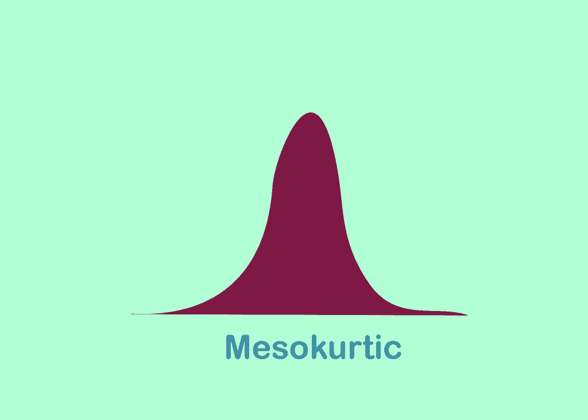
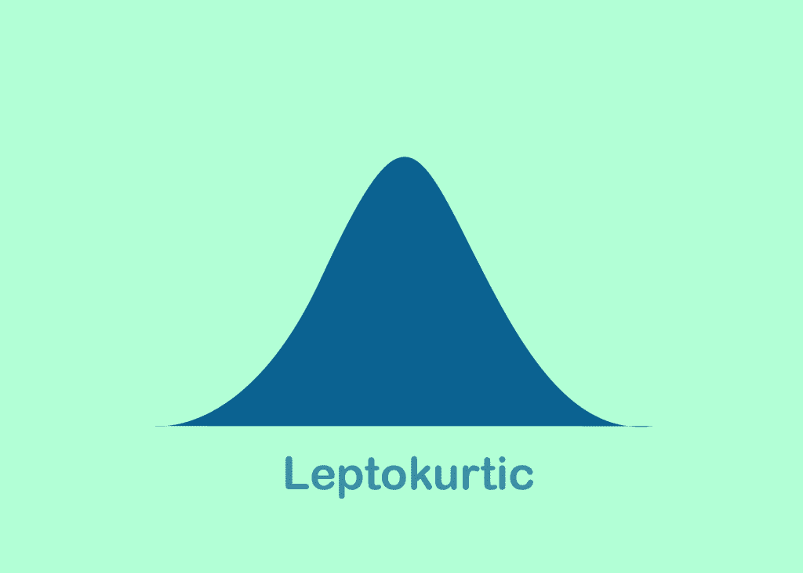
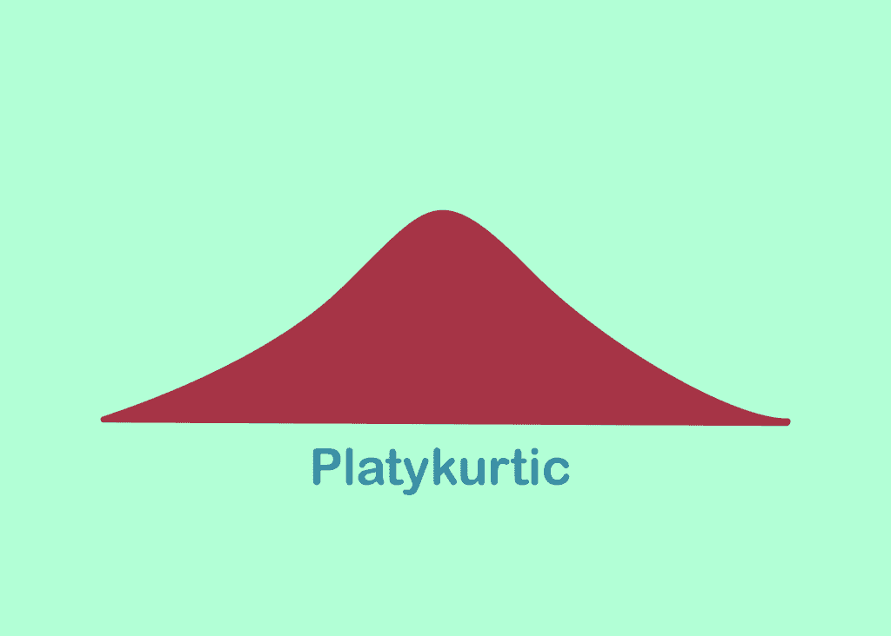
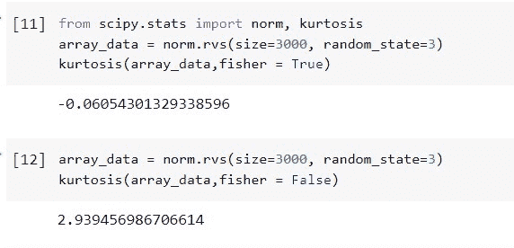
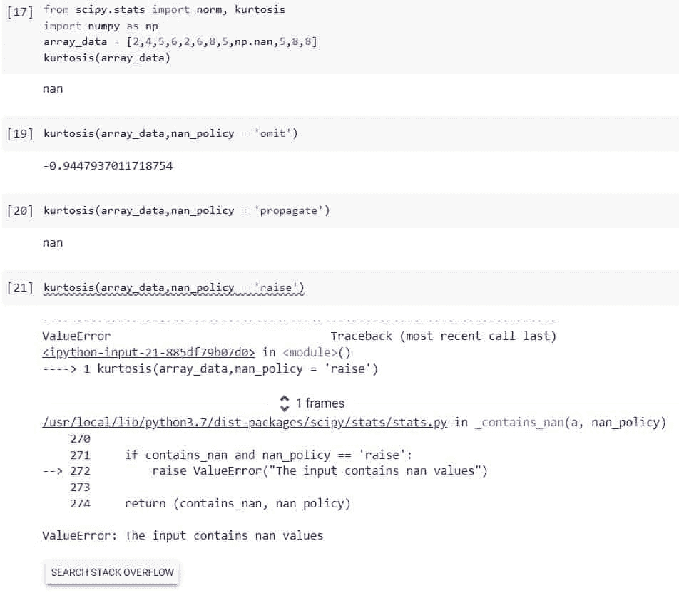

# python Scipy Stats Kurt osis–有用的指南

> 原文：<https://pythonguides.com/python-scipy-stats-kurtosis/>

[](https://sharepointsky.teachable.com/p/python-and-machine-learning-training-course)

峰度是一个统计指标，我们可以在 Python 中借助“***scipy . stats . Kurt osis***”来利用它。所以，在这个 [Python 教程](https://pythonguides.com/learn-python/)中，我们将借助多个例子来学习“***Python Scipy Stats Kurt osis***”。此外，我们将涵盖以下主题。

*   什么是峰度
*   Python Scipy 统计峰度
*   Python Scipy Stats 峰度测试
*   Python Scipy Stats 峰度 Fisher
*   Python Scipy Stats 峰度 Nan_policy

此外，查看 Python SciPy 上最近的帖子: [Python Scipy 统计模式示例](https://pythonguides.com/python-scipy-stats-mode/)

目录

[](#)

*   [什么是峰度](#What_is_kurtosis "What is kurtosis")
*   [Python Scipy Stats 峰度](#Python_Scipy_Stats_Kurtosis "Python Scipy Stats Kurtosis")
*   [Python Scipy Stats 峰度测试](#Python_Scipy_Stats_Kurtosis_test "Python Scipy Stats Kurtosis test")
*   [Python Scipy Stats 峰度 Fisher](#Python_Scipy_Stats_Kurtosis_Fisher "Python Scipy Stats Kurtosis Fisher")
*   [Python Scipy Stats 峭度 Nan_policy](#Python_Scipy_Stats_Kurtosis_Nan_policy "Python Scipy Stats Kurtosis Nan_policy")

## 什么是峰度

峰度是一种统计指标，用于描述在频率分布的尾部或峰值有多少数据聚集。尾部是分布的端点，而峰值是最高点。

*   峰度可分为中峰、细峰或宽峰。

峰度的概念和每个峰度的样子在下面给出。

1.  ***中层:*** 分布有中等峰高和中等宽度的曲线。



Python Scipy Stats Kurtosis

***2。*** 在均值附近的值多，分布尾部的值多。



Scipy Stats Kurtosis in Python

***3。Platykurtic:*** 均值附近值少，尾部值少。



How to work with Scipy Stats Kurtosis in Python

阅读:[科学统计-完整指南](https://pythonguides.com/scipy-stats/)

## Python Scipy Stats 峰度

峰度是一个事实性的度量，它描述了分布的尾部与正态分布的尾部的对比程度。

Scipy 有一个计算给定数据集峰度的方法`***kurtosis()***`。当除以方差的平方时，第四个中心矩被称为峰度。

下面给出了语法。

```
scipy.stats.kurtosis(a, axis=0, fisher=True, bias=True, nan_policy='propagate')
```

其中参数为:

*   ***a(array_data):*** 是我们要计算其峰度的数组数据。
*   ***(int)轴:*** 它用来指定我们要沿着哪个轴计算峰度，默认情况下峰度是在整个数组上计算的。
*   ***费希尔(布尔):*** 如果为真，则使用费希尔概念，否则使用皮尔逊概念。
*   ***偏差(布尔):*** 如果为 False，则在进行计算时会考虑统计偏差。
*   ***nan_policy:*** 它用来处理 nan 值并接受三个值:

1.  ***省略:*** 表示忽略 nan 值计算`IQR`。
2.  ***propagate:*** 表示返回 nan 值。
3.  ***抛出:*** 表示为 nan 值抛出一个错误。

方法`***kurtosis()***`将峰度值作为数组返回。对于 fisher 概念，它返回的值是-3，对于 Pearson 概念，它返回的值是 0。

让我们以下面的步骤为例:

导入所需的库。

```
from scipy import stats
array_data = stats.norm.rvs(size=2000, random_state=2)
stats.kurtosis(array_data)
```


Scipy Stats Kurtosis

正如我们在上面的输出中看到的，峰度的值接近于零。

阅读:[科学统计-完整指南](https://pythonguides.com/scipy-stats/)

## Python Scipy Stats 峰度测试

在 Scipy 中，方法`***kurtosistest()***`用于检查给定数据集是否具有正常峰度。

下面给出了语法。

```
scipy.stats.kurtosistest(a, axis=0, nan_policy='propagate', alternative='two-sided')
```

其中参数为:

*   ***a(array_data):*** 是我们要计算其峰度的数组数据。
*   ***(int)轴:*** 它用来指定我们要沿着哪个轴计算峰度，默认情况下峰度是在整个数组上计算的。
*   ***nan_policy:*** 它用来处理 nan 值并接受三个值:

1.  ***省略:*** 表示忽略 nan 值计算`IQR`。
2.  ***propagate:*** 表示返回 nan 值。
3.  ***抛出:*** 表示为 nan 值抛出一个错误。

方法`kurtosistest()`返回两个值 statistics 和 float 类型的 p 值。

让我们以下面的代码为例。

```
from scipy.stats import kurtosistest
kurtosistest(list(range(30)))
```


Scipy Stats Kurtosis test

从输出中，我们可以断定给定的数据是否是正态峰度。

阅读: [Scipy 旋转图像+示例](https://pythonguides.com/scipy-rotate-image/)

## Python Scipy Stats 峰度 Fisher

我们已经了解了 [Python Scipy](https://pythonguides.com/what-is-scipy-in-python/) 的方法`***kurtosis()***`，它有一个来自几个参数的布尔类型的参数`***fisher***`。费希尔峰度衡量一个分布相对于正态分布的尾部重型。

正的 Fisher 峰度表示分布中存在大量异常值。如果费希尔峰度为负，则概率密度分布比正态分布更加均匀。

*   中峰度分布是那些费希尔峰度为零或非常接近零的分布。这一类别包括正态分布。
*   扁平分布是那些具有负的费希尔峰度并且是平顶的或均匀的分布。例如均匀分布。
*   高正态分布尖峰分布指的是费希尔峰度。根据用例，轻子分布具有可能需要处理或加工的异常值。它们是“重尾分布”例子包括利维分布和拉普拉斯分布。

因此，这里我们将通过一个示例来调整方法`**kurtosis()**`的参数`***fisher***`，以查看结果的变化。

使用下面的 python 代码导入所需的库。

```
from scipy import stats
```

使用方法`***norm.rvs()***`生成包含 3000 个值的数据数组，并使用等于`***True***`的参数`***fisher***`计算峰度。

```
array_data = stats.norm.rvs(size=3000, random_state=3)
stats.kurtosis(array_data,fisher = True)
```

现在再次计算相同数据的峰度，参数`***fisher***`等于`***False***`。

```
array_data = norm.rvs(size=3000, random_state=3)
stats.kurtosis(array_data,fisher = False)
```



Scipy Stats Kurtosis Fisher

当我们设置`***fisher***`等于`***True***`时，那么数据的峰度是-0.060，对于`***False***`费希尔值，结果是 2.93。当`***fisher***`等于`***False***`时，则计算皮尔逊峰度。这就是结果存在差异的原因。

阅读: [Scipy 优化–实用指南](https://pythonguides.com/scipy-optimize/)

## Python Scipy Stats 峭度 Nan_policy

Python Scipy 的方法`***kurtosis()***`接受一个参数 ***`nan_policy`*** 来处理数组内的 nan 值。如果我们计算包含 nan 值的数组的峰度，那么方法`***kurtosis()***`默认返回 nan 作为结果。

为了在数组中处理这些 nan 值，我们将为方法`***kurtosis()***`的参数`***nan_policy***`使用不同的值。nan_polciy 参数接受三个值来处理 nan 值:

***省略:*** 表示忽略 nan 值计算`IQR`。
***propagate:*** 表示返回 nan 值，也是默认值。
***raise:*** 表示为 nan 值抛出一个错误。

让我们通过下面的步骤来了解一个示例:

使用下面的 python 代码导入所需的库。

```
from scipy.stats import kurtosis
import numpy as np
```

创建一个包含 nan 值的数组，为了在数组中包含 nan 值，我们使用了 Numpy 的`***np.nan***`,代码如下。

```
array_data = [2,4,5,6,2,6,8,5,np.nan,5,8,8]
```

使用下面的代码计算上面创建的没有参数`***nan_policy***`的数组的峰度。

```
kurtosis(array_data)
```

现在，使用下面的代码将参数`***nan_policy***` 指定为等于`***omit***`的值。

```
kurtosis(array_data,nan_policy = 'omit')
```

使用以下代码再次将参数`***nan_policy***` 更改为等于`***propagate***`的值。

```
kurtosis(array_data,nan_policy = 'propagate')
```

最后，使用下面的代码将参数`***nan_policy***` 更改为等于`***raise***`的值。

```
kurtosis(array_data,nan_policy = 'propagate')
```



Python Scipy Stats Kurtosis Nan_policy

参考每个参数的概念，查看输出以及如何处理 nan 值。

您可能也喜欢阅读下面的 Python SciPy 教程。

*   [Python Scipy 特殊模块](https://pythonguides.com/python-scipy-special/)
*   [Python Scipy 特征值](https://pythonguides.com/python-scipy-eigenvalues/)
*   [python scipy tttest _ in】的缩写](https://pythonguides.com/python-scipy-ttest_ind/)
*   [Python Scipy Stats Poisson](https://pythonguides.com/python-scipy-stats-poisson/)
*   [Python Scipy 距离矩阵](https://pythonguides.com/scipy-distance-matrix/)
*   [Scipy 常量–多个示例](https://pythonguides.com/scipy-constants/)
*   [Python Scipy Stats multivarial _ Normal](https://pythonguides.com/python-scipy-stats-multivariate_normal/)

因此，在本教程中，我们已经了解了“***Python Scipy Stats Kurt osis***”并涵盖了以下主题。

*   什么是峰度
*   Python Scipy 统计峰度
*   Python Scipy Stats 峰度测试
*   Python Scipy Stats 峰度 Fisher
*   Python Scipy Stats 峰度 Nan_policy

[Bijay Kumar](https://pythonguides.com/author/fewlines4biju/)

Python 是美国最流行的语言之一。我从事 Python 工作已经有很长时间了，我在与 Tkinter、Pandas、NumPy、Turtle、Django、Matplotlib、Tensorflow、Scipy、Scikit-Learn 等各种库合作方面拥有专业知识。我有与美国、加拿大、英国、澳大利亚、新西兰等国家的各种客户合作的经验。查看我的个人资料。

[enjoysharepoint.com/](https://enjoysharepoint.com/)[](https://www.facebook.com/fewlines4biju "Facebook")[](https://www.linkedin.com/in/fewlines4biju/ "Linkedin")[](https://twitter.com/fewlines4biju "Twitter")