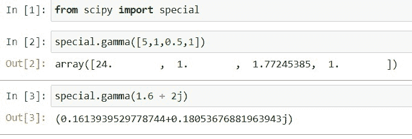
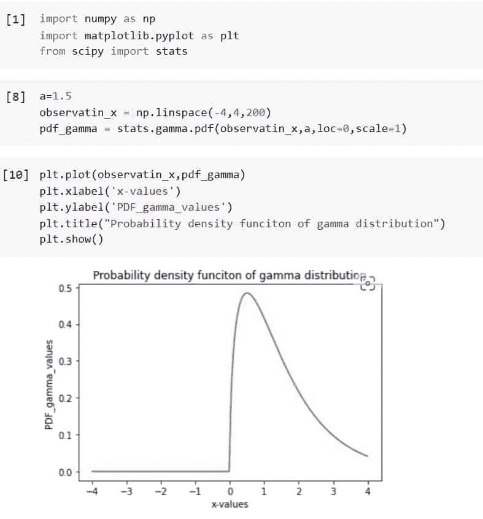
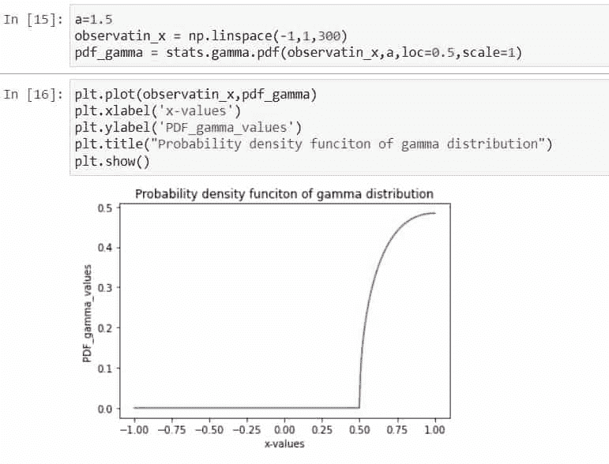
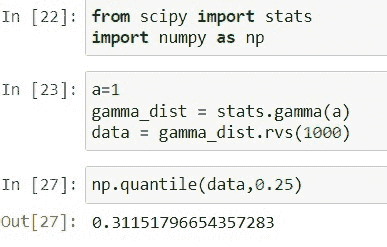
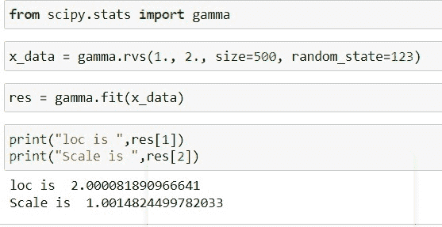
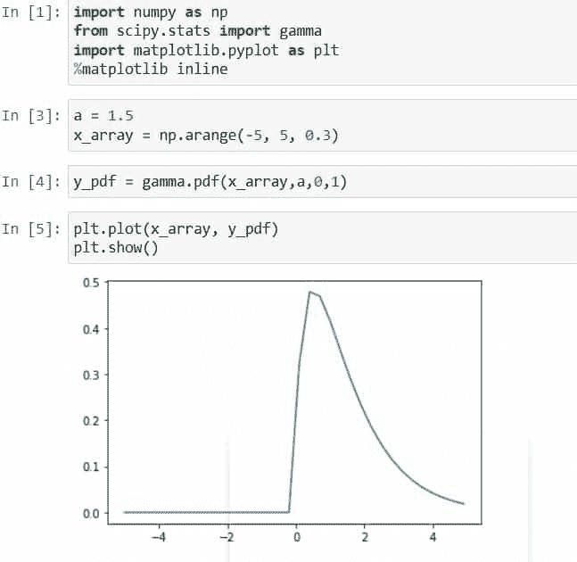
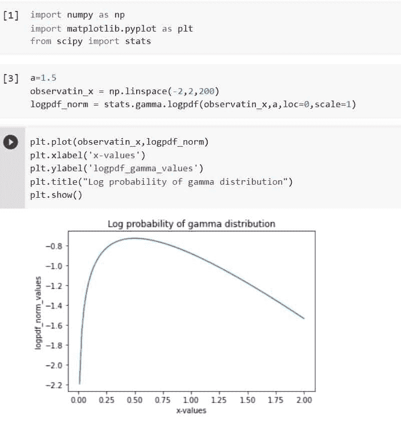
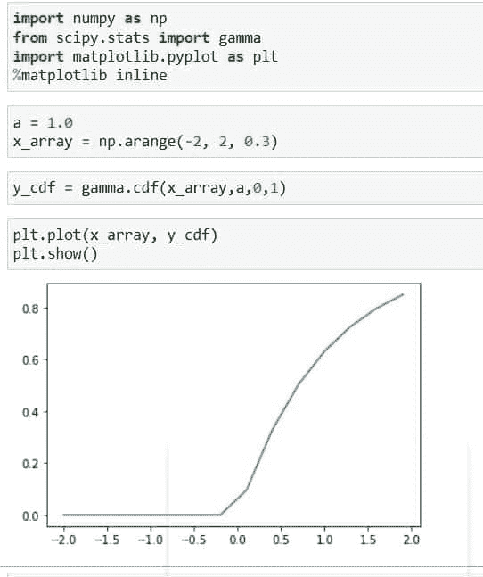

# Python Scipy Gamma [10 个有用的例子]

> 原文：<https://pythonguides.com/python-scipy-gamma/>

[](https://sharepointsky.teachable.com/p/python-and-machine-learning-training-course)

在本 [Python 教程](https://pythonguides.com/learn-python/)中，我们将学习“ ***Python Scipy Gamma*** ”。除了学习如何生成和使用伽玛分布，我们还将涉及以下主题。

*   什么是伽玛
*   Python Scipy 伽马分布
*   Python Scipy Gamma
*   Python Scipy Gamma Ppf
*   Python Scipy Gamma Loc
*   Python Scipy 伽马分位数
*   Python Scipy 伽玛示例
*   Python Scipy Gamma 日志 pdf
*   Python Scipy Gamma Cdf
*   Python Scipy 伽马拟合
*   Python Scipy Gamma Pdf

目录

[](#)

*   [什么是伽马](#What_is_Gamma "What is Gamma")
*   [Python Scipy 伽马分布](#Python_Scipy_Gamma_Distribution "Python Scipy Gamma Distribution")
*   [Python Scipy Gamma](#Python_Scipy_Gamma "Python Scipy Gamma")
*   [Python Scipy 伽马 Ppf](#Python_Scipy_Gamma_Ppf "Python Scipy Gamma Ppf")
*   [Python Scipy Gamma Loc](#Python_Scipy_Gamma_Loc "Python Scipy Gamma Loc")
*   [Python Scipy Gamma 分位数](#Python_Scipy_Gamma_Quantile "Python Scipy Gamma Quantile")
*   [Python Scipy Gamma 样本](#Python_Scipy_Gamma_Sample "Python Scipy Gamma Sample")
*   [Python Scipy Gamma Cdf](#Python_Scipy_Gamma_Cdf "Python Scipy Gamma Cdf")
*   [Python Scipy Gamma Fit](#Python_Scipy_Gamma_Fit "Python Scipy Gamma Fit")
*   [Python Scipy Gamma Pdf](#Python_Scipy_Gamma_Pdf "Python Scipy Gamma Pdf")
*   [Python Scipy Gamma Logpdf](#Python_Scipy_Gamma_Logpdf "Python Scipy Gamma Logpdf")
*   [Python Scipy Gamma Logcdf](#Python_Scipy_Gamma_Logcdf "Python Scipy Gamma Logcdf")

## 什么是伽马

商业、科学和工程领域中经常使用的分布之一是伽玛分布，它用于描述应该具有正偏分布的连续变量。

贝塔分布与伽玛分布相关，伽玛分布是一种统计分布。这种分布是自发形成的，在这种分布中，泊松分布事件之间的等待间隔对彼此都是重要的。

最常见的短语“ ***”伽马分布*** ”是指具有连续概率分布和两个参数的分布:形状参数和反比例参数。它与 Erlang 分布、卡方分布、指数分布和正态分布有关。“γ”代表伽马函数。

Alpha(α)和 beta(β)是伽玛分布中的两个自由参数，其中:

*   Alpha(α):是形状参数。
*   β=它是速率参数。

另外，检查: [Python Scipy Stats Norm](https://pythonguides.com/python-scipy-stats-norm/)

## Python Scipy 伽马分布

Python Scipy 在模块`***scipy.special***`中有一个方法`***gamma()***`,用于计算给定数组的伽玛。广义阶乘函数就是伽马函数。

下面给出了语法。

```py
scipy.special.gamma(z)
```

其中参数`***z***`是数组类型的实值或复值参数。

方法`***gamma()***`返回 ndarray 或 scalar 类型的伽马函数的值。

让我们以下面的步骤为例:

使用下面的 python 代码导入库。

```py
from scipy import special
```

创建一个数据数组，并将该数组传递给一个方法`***gamma()***`，如代码下面所示。

```py
special.gamma([5,1,0.5,1])
```

定义一个复数，并使用下面的代码计算该数的伽玛。

```py
special.gamma(1.6 + 2j)
```



Python Scipy Gamma Distribution

正如我们在上面的输出中看到的，我们已经计算了数组和复数的 gamma 值。

这就是如何使用 Python SciPy 的方法`***gamma()***`计算给定数组或复数的 gamma 值。

Read: [Python Scipy Mann Whitneyu](https://pythonguides.com/python-scipy-mann-whitneyu/)

## Python Scipy Gamma

`***scipy.stats.gamma***`代表连续的随机变量γ。它有不同种类的正态分布函数，如 CDF，PDF，中位数等。

它有两个重要的参数`loc`用于表示平均值和`scale`用于表示标准差，因为我们知道我们使用这些参数来控制分布的形状和位置。

下面给出了语法。

```py
scipy.stats.gamma.method_name(data,loc,size,moments,scale)
```

其中参数为:

*   **数据:**是以数组数据的形式表示均匀采样数据的一组点或值。
*   **a:** 是伽玛的形状参数。
*   **loc:** 用于指定平均值，默认为 0。
*   **矩:**用于计算标准差、峰度、均值等统计量。
*   **刻度:**用于指定标准差，默认为 1。

以上参数是对象`***scipy.stats.gamma()***`中所有方法的公共参数。下面给出了方法。

*   ***scipy . statsγCDF():***它用于累积分布函数。
*   ***scipy . statsγpdf():***它用于概率密度函数。
*   ***scipy . statsγRVs():***得到随机变量。
*   ****。stats():**** *用于得到标准差、均值、峰度、偏斜度。*
*   *****。logpdf():**** *用于获取与概率密度函数相关的对数。**
*   ******。logcdf():**** *用于查找与累积分布函数相关的日志。***
*   ******。sf():**** *用来获取生存函数的值。***
*   ******。isf():**** *它用来得到逆生存函数的值。***
*   ******。logsf():**** *用于查找生存函数相关的日志。***
*   ******。mean():**** *用于求正态分布相关的均值。***
*   ******。median():**** *用于求正态分布相关的中位数。***
*   ******。var():**** *用于求与分布相关的方差。***
*   ******。std():**** *用于求与分布相关的标准差***

 **让我们通过使用上面提到的方法之一来举一个例子，以了解如何使用带参数的方法。

使用下面的代码导入所需的库。

```py
import numpy as np
import matplotlib.pyplot as plt
from scipy import stats
```

创建观察数据值，并用`***mean = 0***`和`***standard deviation = 1***`从这些数据值中计算出`***probability density function***`。

```py
a=1.5
observatin_x = np.linspace(-4,4,200)
pdf_gamma = stats.gamma.pdf(observatin_x,a,loc=0,scale=1)
```

使用下面的代码绘制创建的分布图。

```py
plt.plot(observatin_x,pdf_gamma)
plt.xlabel('x-values')
plt.ylabel('PDF_gamma_values')
plt.title("Probability density funciton of gamma distribution")
plt.show()
```



Python Scipy Gamma

这就是如何使用 Python Scipy 的方法`gamma()`生成伽马分布。

阅读: [Python Scipy 统计偏差](https://pythonguides.com/python-scipy-stats-skew/)

## Python Scipy 伽马 Ppf

对象 ***`gamma()`*** 有一个方法`***ppf()***`计算伽马的百分位数函数。换句话说，方法`***norm.ppf()***`接受一个百分比，并返回该百分比所在值的标准差乘数。

下面给出了语法。

```py
scipy.stats.gamma.ppf(q,loc,size,scale)
```

其中参数为:

*   **问:**是百分比。
*   **a:** 形状参数
*   **loc:** 用于指定平均值，默认为 0。
*   **刻度:**用于指定标准差，默认为 1。

让我们通过下面的代码来理解一个例子。

```py
from scipy.stats import gamma
gamma.ppf(0.99, 1.5, loc=0, scale=1)
```


Python Scipy Gamma Ppf

上面的代码给出了伽玛分布的 99%置信区间的单尾测试结果。

阅读: [Python Scipy Kdtree](https://pythonguides.com/python-scipy-kdtree/)

## Python Scipy Gamma Loc

Python Scipy 方法`***gamma()***`接受参数`***loc***`，这是分布的平均值。使用方法`***gamma()***`的`***loc***`，我们可以改变分布。

让我们看一个例子，按照下面的步骤在不同的位置移动分布:

使用下面的 python 代码导入所需的库或方法。

```py
import numpy as np
import matplotlib.pyplot as plt
from scipy import stats
```

创建观察数据值，并用`***loc***`或`***mean = 0***`和`***standard deviation = 1***`从这些数据值中计算出`***probability density function***`。

```py
a=1.5
observatin_x = np.linspace(-1,1,300)
pdf_gamma = stats.gamma.pdf(observatin_x,a,loc=0,scale=1)
```

使用下面的代码绘制创建的分布图。

```py
plt.plot(observatin_x,pdf_gamma)
plt.xlabel('x-values')
plt.ylabel('PDF_gamma_values')
plt.title("Probability density funciton of gamma distribution")
plt.show()
```

现在使用 blow 代码将平均值或 loc 值更改为不同的值或等于 0.5。

```py
a=1.5
observatin_x = np.linspace(-1,1,300)
pdf_gamma = stats.gamma.pdf(observatin_x,a,loc=1,scale=1)
```

使用下面的代码，在上面的代码中再次绘制均值或 loc 等于 0.5 的分布，以查看分布位置的变化。

```py
plt.plot(observatin_x,pdf_gamma)
plt.xlabel('x-values')
plt.ylabel('PDF_gamma_values')
plt.title("Probability density funciton of gamma distribution")
plt.show()
```



Python Scipy Gamma Loc

从输出中，我们可以看到，当我们使用等于 0.5 的参数 loc 时，分布向右侧偏移。

阅读: [Python Scipy 特征值](https://pythonguides.com/python-scipy-eigenvalues/)

## Python Scipy Gamma 分位数

称为分位数的值或点的集合用于将数据集划分为大小相等的组。在本节中，我们将从 gamma dist 生成一个样本，并将该样本传递给方法`***numpy.quantile()***`来计算样本的分位数。

使用下面的 python 代码导入所需的方法或库。

```py
from scipy import stats
import numpy as np
```

使用下面的代码从 gamma dist 生成数据。

```py
a=0.5
gamma_dist = stats.gamma(a)
data = gamma_dist.rvs(1000)
```

现在使用下面的代码计算上述数据的分位数。

```py
np.quantile(data,0.25)
```

上述代码返回样本或数据的第一个四分位数。



Python Scipy Gamma Quantile

这就是如何计算 gamma dist 中数据的分位数。

阅读: [Python Scipy 统计模式](https://pythonguides.com/python-scipy-stats-mode/)

## Python Scipy Gamma 样本

对象`***gamma***`的 Python Scipy 的方法 ***`rvs()`*** 是从伽玛分布生成随机数或样本的随机变量。

语法如下所示

```py
scipy.stats.gamma.rvs(loc=0, scale=1, size=1, random_state=None)
```

其中参数为:

*   **loc:** 是个意思。
*   **标度:**协方差的分布矩阵。
*   **size(int):** 是样本大小。
*   **random_state(int):** 如果种子为 None，则使用 NumPy.random 方法(或 np.random)。它使用 RandomState 的单个实例。如果种子是整数，则使用该种子创建一个新的 RandomState 对象。如果种子已经有一个生成器或 RandomState 实例，则使用该实例。

让我们按照以下步骤从多元正态分布中抽取一个随机样本:

使用下面的 python 代码导入所需的库。

```py
from scipy import stats
```

使用下面的代码创建一个伽玛分布。

```py
a=0.5
gamma_dist = stats.gamma(a)
```

使用下面的代码生成正态分布的随机数。

```py
samp_size = 100000
gamma_dist.rvs(samp_size)
```


Python Scipy Gamma Sample

这就是如何使用 Python Scipy 的方法`***gamma.rvs()***`生成样本。

Read: [Python Scipy Freqz](https://pythonguides.com/python-scipy-freqz/)

## Python Scipy Gamma Cdf

对象`***gamma***`的 Python Scipy 的方法`***pdf()***`计算伽玛的累积分布。

下面给出了语法。

```py
scipy.stats.gamma(x, a, loc, scale)
```

其中参数为:

*   **x:** 它是以数组数据的形式表示均匀采样数据的一组点或值。
*   **a:** 是分布的形状参数。
*   **loc:** 用于指定平均值，默认为 0。
*   **刻度:**用于指定标准差，默认为 1。

使用下面的 python 代码导入所需的库。

```py
import numpy as np
from scipy.stats import gamma
import matplotlib.pyplot as plt
%matplotlib inline
```

使用下面的代码创建一个数组，包含-2 到 2 之间的值，差值为 0.3，形状参数= 1.5。

```py
a = 1.0
x_array = np.arange(-2, 2, 0.3)
```

使用以下代码，通过将创建的数据数组提供给参数值为 loc = 0 且 scale = 1 的方法`gamma.cdf()`来计算 pdf。

```py
y_cdf = gamma.cdf(x_array,a,0,1)
```

现在使用下面的代码绘制分布图。

```py
plt.plot(x_array, y_cdf) 
plt.show()
```


Python Scipy Gamma Cdf

这就是如何使用 Python Scipy 的 ***`gamma.cdf()`*** 方法来计算伽玛的累积分布。

阅读:[Python Scipy Stats multivarial _ Normal](https://pythonguides.com/python-scipy-stats-multivariate_normal/)

## Python Scipy Gamma Fit

对象`gamma`的 Python Scipy 的方法`***fit()***`,提供近似的比例和位置。

下面给出了语法。

```py
scipy.stats.gamma.fit(data)
```

其中参数**数据**是我们需要位置和比例的数据。

让我们通过以下步骤来了解一个示例:

使用下面的代码导入所需的库或方法。

```py
from scipy.stats import gamma
```

使用`gamma.rvs()`方法生成随机数。

```py
x_data = gamma.rvs(1., 2., size=500, random_state=123)
```

现在用下面的代码拟合上面的数据。

```py
loc_, scale_ = gamma.fit(x_data)
```

使用以下代码检查估计的参数值。

```py
print("loc is ",res[1])
print("Scale is ",res[2])
```



Python Scipy Gamma Fit

这就是如何使用 Python Scipy 的方法`***gamma.fit()***`获得参数位置和比例的近似值。

阅读: [Python Scipy 最小化](https://pythonguides.com/python-scipy-minimize/)

## Python Scipy Gamma Pdf

正如我们在上面的 Python Scipy 小节中了解到的，对象`gamma`有许多方法，如 CDF、PDF、ISF 等，来生成不同种类的伽马分布。这里我们将使用`***scipy.stats.gamma.pdf()***`中的一种方法来计算给定分布的 ***`Probability Density Funtion`*** 。

语法如下所示。

```py
scipy.stats.gamma.pdf(x,a,loc,scale)
```

其中参数为:

*   **x:** 它是以数组数据的形式表示采样数据的一组点或值。
*   **a:** 是伽玛分布的形状参数。
*   **loc:** 用于指定平均值，默认为 0。
*   **刻度:**用于指定标准差，默认为 1。

让我们通过以下步骤来举例说明如何计算给定分布的 pdf:

使用下面的 python 代码导入所需的库。

```py
import numpy as np
from scipy.stats import gamma
import matplotlib.pyplot as plt
%matplotlib inline
```

使用下面的代码创建一个数组，包含-5 到 5 之间的值，差值为 0.3，形状参数= 1.5。

```py
a = 1.5
x_array = np.arange(-5, 5, 0.3)
```

使用以下代码，通过将创建的数据数组提供给参数值为 loc = 0 且 scale = 1 的方法`gamma.pdf()`来计算 pdf。

```py
y_pdf = gamma.pdf(x_array,a,0,1)
```

现在使用下面的代码绘制分布图。

```py
plt.plot(x_array, y_pdf) 
plt.show()
```



Python Scipy Gamma Pdf

这就是如何使用 Python Scipy 的方法`***gamma.pdf()***`计算伽马分布的 pdf。

阅读: [Python Scipy 卡方测试](https://pythonguides.com/python-scipy-chi-square-test/)

## Python Scipy Gamma Logpdf

对象 ***`gamm()`*** 有一个方法`***logpdf()***`计算伽玛的对数概率密度。

下面给出了语法。

```py
scipy.stats.gamma.logpdf(x,a,loc,scale)
```

其中参数为:

*   **x:** 它是以数组数据的形式表示均匀采样数据的一组点或值。
*   **a:** 是伽玛的形状参数。
*   **loc:** 用于指定平均值，默认为 0。
*   **刻度:**用于确定标准差，默认为 1。

以上参数是对象`***scipy.stats.gamma()***`中所有方法的标准参数。下面给出了方法。

让我们通过使用上面提到的方法之一来举一个例子，以了解如何使用带参数的方法。

使用下面的代码导入所需的库。

```py
import numpy as np
import matplotlib.pyplot as plt
from scipy import stats
```

创建观察数据值，并用`***mean = 0***`和`***standard deviation = 1***`从这些数据值计算对数概率。

```py
a=1.5
observatin_x = np.linspace(-2,2,200)
logpdf_norm = stats.gamma.logpdf(observatin_x,a,loc=0,scale=1)
```

使用下面的代码绘制创建的分布图。

```py
plt.plot(observatin_x,logpdf_norm)
plt.xlabel('x-values')
plt.ylabel('logpdf_gamma_values')
plt.title("Log probability of gamma distribution")
plt.show()
```



Python Scipy Gamma Logpdf

这就是如何使用 Python Scipy 的方法`***gamma.logpdf()***`计算伽马分布的 logpdf。

阅读: [Python Scipy Matrix +示例](https://pythonguides.com/python-scipy-matrix/)

## Python Scipy Gamma Logcdf

对象 ***`gamm()`*** 有一个计算伽玛累积分布的方法`***logcdf()***`。

下面给出了语法。

```py
scipy.stats.gamma.logcdf(x,a,loc,scale)
```

其中参数为:

*   **x:** 它是以数组数据的形式表示均匀采样数据的一组点或值。
*   **a:** 是伽玛的形状参数。
*   **loc:** 用于指定平均值，默认为 0。
*   **刻度:**用于确定标准差，默认为 1。

以上参数是对象`***scipy.stats.gamma()***`中所有方法的标准参数。下面给出了方法。

让我们通过使用上面提到的方法之一来举一个例子，以了解如何使用带参数的方法。

使用下面的代码导入所需的库。

```py
import numpy as np
import matplotlib.pyplot as plt
from scipy import stats
```

用`***mean = 0***`和`***standard deviation = 1***`创建观察数据值，并根据这些数据值计算累计对数。

```py
a=1.5
observatin_x = np.linspace(-10,10,200)
logcdf_norm = stats.gamma.logcdf(observatin_x,a,loc=0,scale=1)
```

使用下面的代码绘制创建的分布图。

```py
plt.plot(observatin_x,logcdf_norm)
plt.xlabel('x-values')
plt.ylabel('logcdf_gamm_values')
plt.title("Log cumulative of gamma distribution")
plt.show()
```



Python Scipy Gamma logCdf

这就是如何使用 Python Scipy 的方法`*gamma.logcdf()*`计算伽马分布的 logcdf。

另外，看看更多的 Python SciPy 教程。

*   [Scipy 正态分布](https://pythonguides.com/scipy-normal-distribution/)
*   [敏感信号——有用教程](https://pythonguides.com/scipy-signal/)
*   [Scipy Integrate +示例](https://pythonguides.com/scipy-integrate/)
*   [Scipy 常量–多个示例](https://pythonguides.com/scipy-constants/)
*   [python scipy tttest _ in】的缩写](https://pythonguides.com/python-scipy-ttest_ind/)

因此，在本教程中，我们已经了解了“***Python Scipy Stats Gamma***”并涵盖了以下主题。

*   什么是伽玛
*   Python Scipy 伽马分布
*   Python Scipy Gamma
*   Python Scipy Gamma Ppf
*   Python Scipy Gamma Loc
*   Python Scipy 伽马分位数
*   Python Scipy 伽玛示例
*   Python Scipy Gamma 日志 pdf
*   Python Scipy Gamma Cdf
*   Python Scipy 伽马拟合
*   Python Scipy Gamma Pdf

[Bijay Kumar](https://pythonguides.com/author/fewlines4biju/)

Python 是美国最流行的语言之一。我从事 Python 工作已经有很长时间了，我在与 Tkinter、Pandas、NumPy、Turtle、Django、Matplotlib、Tensorflow、Scipy、Scikit-Learn 等各种库合作方面拥有专业知识。我有与美国、加拿大、英国、澳大利亚、新西兰等国家的各种客户合作的经验。查看我的个人资料。

[enjoysharepoint.com/](https://enjoysharepoint.com/)[](https://www.facebook.com/fewlines4biju "Facebook")[](https://www.linkedin.com/in/fewlines4biju/ "Linkedin")[](https://twitter.com/fewlines4biju "Twitter")**