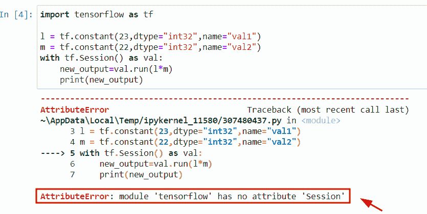
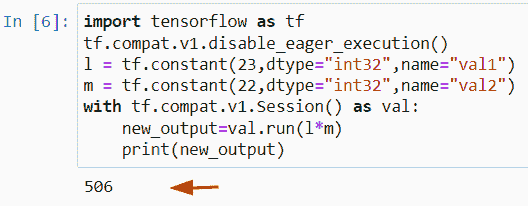
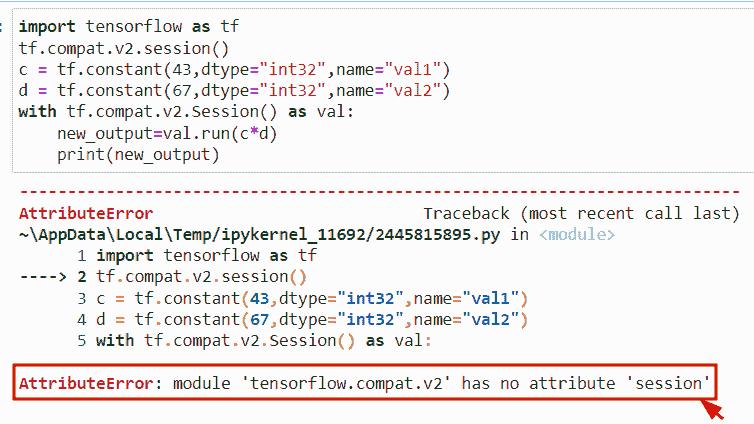
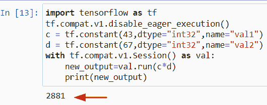
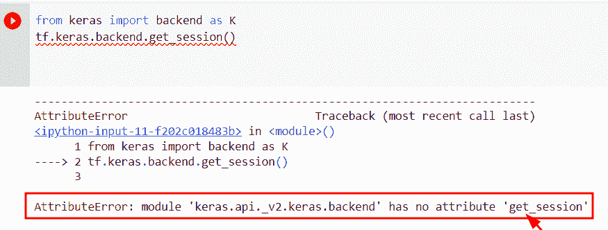

# 模块“TensorFlow”没有属性“session”

> 原文：<https://pythonguides.com/module-tensorflow-has-no-attribute-session/>

[](https://sharepointsky.teachable.com/p/python-and-machine-learning-training-course)

在本 [Python 教程](https://pythonguides.com/learn-python/)中，我们将讨论错误“**模块‘tensor flow’没有属性‘session’**”。我们还将讨论以下主题:

*   attributeerror 模块“tensorflow.keras.backend”没有属性“get_session”
*   attributeerror 模块“tensorflow.compat.v2”没有属性“session”

目录

[](#)

*   [AttributeError "模块' Tensorflow '没有属性' session'"](#AttributeError_module_Tensorflow_has_no_attribute_session " AttributeError “module ‘Tensorflow’ has no attribute ‘session'”")
*   [Attributeerror 模块' tensorflow.compat.v2 '没有属性' session'](#Attributeerror_module_tensorflowcompatv2_has_no_attribute_session "Attributeerror module ‘tensorflow.compat.v2’ has no attribute ‘session’")
*   [Attributeerror 模块' tensorflow.keras.backend '没有属性' get_session'](#Attributeerror_module_tensorflowkerasbackend_has_no_attribute_get_session "Attributeerror module ‘tensorflow.keras.backend’ has no attribute ‘get_session’")

## AttributeError "模块' Tensorflow '没有属性' session'"

*   在本节中，我们将讨论错误 **AttributeError:“模块‘tensor flow’在 Python 中没有属性‘session’**。
*   为了完成这项任务，我们将首先导入带有 tf 别名的 TensorFlow 库，其中 tf 表示 [TensorFlow](https://pythonguides.com/tensorflow/) ，它用于数值计算问题。接下来，我们将创建一个张量形式的变量，并分配一个 **tf.constant()** 函数。在 Python 中，这个函数接受一个常量值，该常量值表示不修改的值，它还初始化一个对象，如数组或列表。
*   在给定的例子中，我们已经指定了 scaler 值和数据类型作为参数。现在我们将把给定的两个变量相乘，分别命名为**‘l’**和**‘m’**。为了完成这个任务，我们首先学习 **tf.session()** 的概念。在 Python 中，该函数用于在图形中执行一些操作。它将检查图的节点，在本例中，我们将创建类似于 **tf.session()** 的会话，并使用 **tf.session()** 作为 Val 启动会话，其中 Val 是会话名称。
*   这里我们将在节点 **new_output** 应用数学运算**(乘法)**。为了运行这个会话，我们将使用 **val.run()** 语法。在这个参数中，我们将使用乘法运算。

**举例:**

```
import tensorflow as tf

l = tf.constant(23,dtype="int32",name="val1")
m = tf.constant(22,dtype="int32",name="val2")
with tf.Session() as val:
    new_output=val.run(l*m)
    print(new_output)
```

下面是以下代码的截图



AttributeError module Tensorflow has no attribute session

正如您在屏幕截图中看到的，输出显示错误 **AttributeError:模块“tensor flow”**没有属性“session”。

**原因:**此错误的可能原因是 Tensorflow 的最新版本(TensorFlow2.0)中没有 tf.session()属性。

现在让我们来看看这个问题的解决方案

**解决方案:**

```
import tensorflow as tf
tf.compat.v1.disable_eager_execution()
l = tf.constant(23,dtype="int32",name="val1")
m = tf.constant(22,dtype="int32",name="val2")
with tf.compat.v1.Session() as val:
    new_output=val.run(l*m)
    print(new_output)
```

在上面的程序中，我们使用了 TF . compat . v1 . disable _ eager _ execution()函数，它用于困难的程序，可以在 TensorFlow2.0 中代替 tf.session()函数使用。

在最新版本 2.0 中，tf.session()已被删除，如果您使用的是旧版本的 TensorFlow，则它可以在复杂程序中工作。

现在 eager_execution()函数在 Tensorflow2.0 中工作，而不是 session。与进程相比，此函数很简单，因为它在不创建图形的情况下执行操作。

下面是以下给定代码的实现



Solution of AttributeError module Tensorflow has no attribute session

同样，检查:[张量流得到形状](https://pythonguides.com/tensorflow-get-shape/)

## Attributeerror 模块' tensorflow.compat.v2 '没有属性' session'

*   在本节中，我们将讨论错误属性错误模块 tensorflow compat v2 没有属性会话。
*   在本例中，我们将使用 **tf.compat.v2.session()** 函数。该功能在 TensorFlow **1.x** 版本中提供，用于检查 Api 的兼容性。

**举例:**

```
import tensorflow as tf
tf.compat.v2.session()
c = tf.constant(43,dtype="int32",name="val1")
d = tf.constant(67,dtype="int32",name="val2")
with tf.compat.v2.Session() as val:
    new_output=val.run(c*d)
    print(new_output)
```

下面是以下给定代码的执行过程



attributeerror module TensorFlow compat v2 has no attribute session

正如您在屏幕截图中看到的，输出显示属性错误模块 TensorFlow compat v2 没有属性会话

**原因:**在 TensorFlow 2.0 版本中，compact v2 不可用，因此您必须使用 compact v1 . disable _ eager _ execution()函数。

以下是此错误的解决方案

**代码:**

```
import tensorflow as tf
tf.compat.v1.disable_eager_execution()
c = tf.constant(43,dtype="int32",name="val1")
d = tf.constant(67,dtype="int32",name="val2")
with tf.compat.v1.Session() as val:
    new_output=val.run(c*d)
    print(new_output)
```

在上面的例子中，我们使用了**TF . compat . v1 . disable _ eager _ execution()函数，**,这个函数与会话相比很简单，因为它实现了操作而没有创建图形。该方法在 Tensorflow **2.0 版本**中可用。

你可以参考下面的截图



Solution of attributeerror module TensorFlow compat v2 has no attribute session

另外，请查看:[Python 中的熊猫](https://pythonguides.com/pandas-in-python/)

## Attributeerror 模块' tensorflow.keras.backend '没有属性' get_session'

*   这里我们要讨论的是错误 **Attributeerror 模块' tensorflow.keras.backend '没有属性** **'get_session'** 。
*   为了执行这个特定的任务，我们首先要导入 Keras 后端库。在 Python 中，它用于生成模型，而且每当我们在开发产品时面临低级计算问题时，Keras 模块都会提供后端引擎。
*   接下来，我们将导入 TensorFlow 库，然后为**TF . keras . back end . get _ session**创建一个会话。正如你在截图中看到的，输出显示 attributeerror 模块**tensor flow。“Keras.backend”没有属性“get_session”。**

**来源** **代号:**

```
from keras import backend as K
import tensorflow as tf
tf.keras.backend.get_session() 
```



attributeerror module TensorFlow Keras backend has no attribute get_session

**原因:**此错误的原因是 session()函数在最新版本的 TensorFlow 中不可用。

此错误代码的解决方案

```
from keras import backend as K
import tensorflow as tf
tf.compat.v1.keras.backend.get_session()
```

在这个例子中，我们使用了 TF . compat . v1 . keras . back end . get _ session()函数。此函数在 TensorFlow 2.0 版本中可用，它将始终返回 tf。可以在后端使用的会话。


Solution of attributeerror module TensorFlow Keras backend has no attribute get_session

你可能也喜欢阅读下面的教程。

*   [Python 中的 NumPy 是什么](https://pythonguides.com/numpy/)
*   [Scikit-learn Vs Tensorflow](https://pythonguides.com/scikit-learn-vs-tensorflow/)
*   [Python 中的 Matplotlib 是什么](https://pythonguides.com/what-is-matplotlib/)
*   [导入错误没有名为 TensorFlow 的模块](https://pythonguides.com/import-error-no-module-named-tensorflow/)
*   [TensorFlow Tensor to numpy](https://pythonguides.com/tensorflow-tensor-to-numpy/)

在本 Python 教程中，我们讨论了错误“**模块‘tensor flow’没有属性‘session’**”。我们还讨论了以下主题:

*   attributeerror 模块“tensorflow.keras.backend”没有属性“get_session”
*   attributeerror 模块“tensorflow.compat.v2”没有属性“session”

[Bijay Kumar](https://pythonguides.com/author/fewlines4biju/)

Python 是美国最流行的语言之一。我从事 Python 工作已经有很长时间了，我在与 Tkinter、Pandas、NumPy、Turtle、Django、Matplotlib、Tensorflow、Scipy、Scikit-Learn 等各种库合作方面拥有专业知识。我有与美国、加拿大、英国、澳大利亚、新西兰等国家的各种客户合作的经验。查看我的个人资料。

[enjoysharepoint.com/](https://enjoysharepoint.com/)[](https://www.facebook.com/fewlines4biju "Facebook")[](https://www.linkedin.com/in/fewlines4biju/ "Linkedin")[](https://twitter.com/fewlines4biju "Twitter")