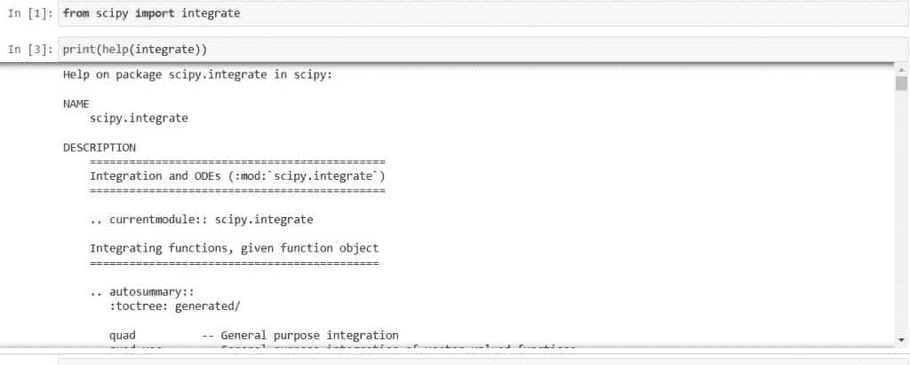
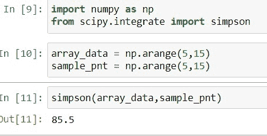
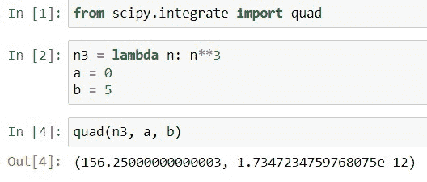
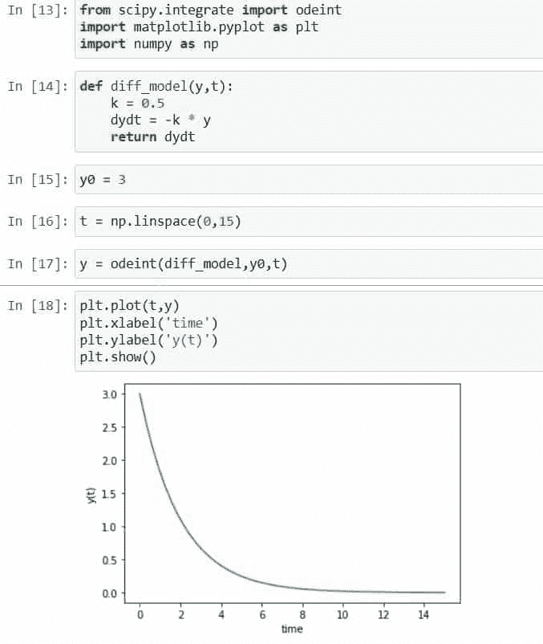
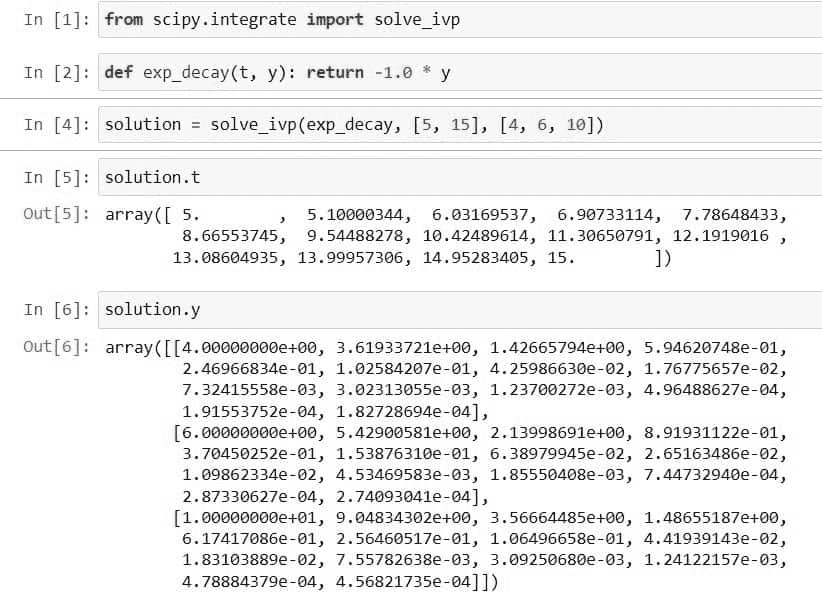
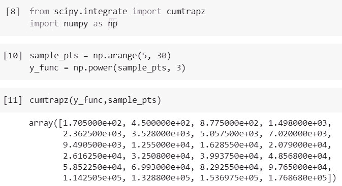

# Scipy Integrate +示例

> 原文：<https://pythonguides.com/scipy-integrate/>

[](https://sharepointsky.teachable.com/p/python-and-machine-learning-training-course)

在这个 [Python 教程](https://pythonguides.com/learn-python/)中，我们将学习“ **Scipy Integrate** ”，在这里我们将学习如何使用集成方法来解决集成问题。此外，我们还将讨论以下主题。

*   Scipy 集成
*   科学整合辛普森
*   立体整体梯形
*   Scipy 集成四路
*   Scipy 集成 Odeint
*   Scipy 集成求解 _Ivp
*   积体积体芯片

目录

[](#)

*   [科学整合](#Scipy_Integrate "Scipy Integrate")
*   [Scipy integrated trap zoid](#Scipy_Integrate_Trapzoid "Scipy Integrate Trapzoid")
*   [科学整合辛普森](#Scipy_Integrate_Simpson "Scipy Integrate Simpson")
*   [Scipy 集成四通道](#Scipy_Integrate_Quad "Scipy Integrate Quad")
*   [Scipy Integrate Odeint](#Scipy_Integrate_Odeint "Scipy Integrate Odeint")
*   [Scipy Integrate Solve_Ivp](#Scipy_Integrate_Solve_Ivp "Scipy Integrate Solve_Ivp")
*   [Scipy 积分累计](#Scipy_Integrate_CumTrapz "Scipy Integrate CumTrapz")

## 科学整合

Scipy 子模块`***scipy.integrate***`包含了许多解决 Python 中积分或微分方程相关问题的方法。它有一个预定义的函数和方法来解决积分或微分方程数学问题。

要了解这个子模块中可用的集成技术，请使用下面的代码。

```py
from scipy import integrate
print(help(integrate))
```



Scipy integrate

在上面的输出中，当我们滚动浏览时，它显示了本模块中所有的积分或微分技术、方法和函数。

阅读:[科学统计-完整指南](https://pythonguides.com/scipy-stats/)

## Scipy integrated trap zoid

`***TrapeZoid***`规则是一种积分技术，通过将总面积分成一个更小的梯形来计算曲线下的面积。它基于指定的轴集成给定的函数`***y(x)***`。

下面给出了在 Python 中使用它的语法。

```py
scipy.integrate.trapezoid(y, x=None, dx=1.0, axis=- 1)
```

其中参数为:

*   ***y(array_data):*** 表示我们要积分作为输入的数组。
*   ***x(array_data):*** 用于指定与 y 值相关的采样点。
*   ***dx(标量):*** 用于指定不使用`***x***`时采样点之间的间距。
*   ***轴(int):*** 它定义了我们要在哪个轴上执行积分。

方法`***trapezoid()***`返回 float 类型的值`***trapz***`，该值是近似的整数值。

让我们以 Python 中的以下步骤为例:

导入所需的库。

```py
from scipy.integrate import trapezoid
```

创建代表`***y***`数据的数组值，并将其传递给方法。

```py
trapezoid([5,8,10])
```


Scipy Integrate Trapzoid

通过应用梯形法则，输出显示积分值`***15.5***` 。

阅读: [Scipy Misc + Examples](https://pythonguides.com/scipy-misc/)

## 科学整合辛普森

Scipy 有一个计算积分近似值的方法`***simpson()***`。此方法存在于子模块`***scipy.integrate***`中。

下面给出了在 Python 中使用它的语法。

```py
scipy.integrate.simpson(y, x=None, dx=1.0, axis=- 1, even='avg')
```

其中参数为:

*   ***y(array_data):*** 表示我们要积分作为输入的数组。
*   ***x(array_data):*** 用于指定与 y 值相关的采样点。
*   ***dx(标量):*** 用于指定不使用`***x***`时采样点之间的间距。
*   ***轴(int):*** 它定义了我们要在哪个轴上执行积分。
*   ***偶数(字符串):*** 用于指定两个结果平均值的梯形法则，第一个和最后一个区间。

让我们以下面的步骤为例:

导入所需的模块，如以下代码所示。

```py
import numpy as np
from scipy.integrate import simpson
```

使用下面的代码创建一个数据和样本点的数组。

```py
array_data = np.arange(5,15)
sample_pnt = np.arange(5,15)
```

使用下面的 Python 代码，通过方法`***simpson()***`计算积分。

```py
simpson(array_data,sample_pnt)
```



Scipy Integrate Simpson

输出显示数组的积分值，给定的采样点为***85.5*T3。**

阅读: [Scipy 旋转图像+示例](https://pythonguides.com/scipy-rotate-image/)

## Scipy 集成四通道

Scipy 在子模块`***scipy.integrate***`中有一个方法`***quad()***`，它计算 Python 中从无限区间 a 到 b 的给定函数的定积分。

下面给出了语法。

```py
scipy.integrate.quad(func, a, b, args=(), full_output=0)
```

其中参数为:

*   ***func(函数):*** 用于指定用于积分计算的函数。该函数可以是下列形式之一。

1.  双功能(双 y)
2.  double func(double y，void *user_data)
3.  double func(int m，double *yy)
4.  double func(int m，double *yy，void *user_data)

*   ***(浮点):*** 用于指定积分的下限。
*   ***b(浮点):*** 用于指定积分的上限。
*   ***args(tuple):*** 如果我们想给一个函数传递额外的参数，那么就使用这个参数。
*   ***full _ output(int):***非零值用于获取集成信息的字典。

该方法返回三个重要结果`***y***`整数值，`***abserr***`绝对误差的估计值，`infodict`包含附加信息的字典。

让我们以下面的步骤为例:

使用下面的 Python 代码导入所需的库。

```py
from scipy.integrate import quad
```

使用 lambda 函数创建一个函数，并定义间隔，如下面的代码所示。

```py
n3 = lambda n: n**3
a = 0
b = 5
```

现在使用下面的代码计算函数的积分。

```py
quad(n3, a, b)
```



Scipy Integrate Quad

输出显示函数***n³***(n 的 3 次方)的定积分值为`***156.25000***`。

阅读:[Scipy Sparse–有用的教程](https://pythonguides.com/scipy-sparse/)

## Scipy Integrate Odeint

Scipy 子模块`***scipy.integrate***`包含了整合常微分方程的方法`***odeint()***`。

下面给出了在 Python 中使用它的语法。

```py
scipy.integrate.odeint(func, y0, t, args=(), Dfun=None, col_deriv=0, full_output=0, printmessg=0)
```

其中参数为:

*   ***func:*** 它计算函数 y 在 t 的导数
*   ***y0(数组):*** 用于为 y 提供初始条件
*   ***t(数组):*** 它是一系列时间点
*   ***args:*** 用来给函数 y 提供额外的参数
*   ***Dfun:*** 用于一个函数的梯度。
*   ***col _ deriv(boolean):***对于真值`***Dfun***`定义导数向下到列，否则为假时跨越到行。
*   ***print messg(boolean):***用于打印汇聚报文。

该函数包含许多参数，但上面我们只解释了常见的参数。

方法`***odient()***`返回两个值`y`,它们是包含每个时间 t 的 y 值的数组，以及用于附加输出信息的`***infodict***`。

让我们以下面的步骤为例:

导入所需的库。

```py
from scipy.integrate import odeint
import matplotlib.pyplot as plt
import numpy as np
```

使用下面的代码定义等式。

```py
def diff_model(y,t):
    k = 0.5
    dydt = -k * y
    return dydt
```

使用下面的代码创建一个初始条件。

```py
y0 = 3
```

使用下面的代码创建一系列时间点。

```py
t = np.linspace(0,15)
```

通过使用下面的代码提供参数来求解创建的方程。

```py
y = odeint(diff_model,y0,t)
```

现在用下面的代码画出解决方案。

```py
plt.plot(t,y)
plt.xlabel('time')
plt.ylabel('y(t)')
plt.show()
```



Scipy Integrate Odeint

这就是如何积分常微分方程。

阅读:[科学常数](https://pythonguides.com/scipy-constants/)

## Scipy Integrate Solve_Ivp

[Scipy](https://pythonguides.com/what-is-scipy-in-python/) 有一个方法`***solve_ivp()***`，它根据提供的初始值整合一个常微分方程系统。

下面给出了在 Python 中使用它的语法。

```py
scipy.integrate.solve_ivp(fun, t_span, y0, method='BDF', t_eval=None, dense_output=False, events=None, vectorized=True, args=None)
```

其中参数为:

*   ***fun(可调用):*** 它在系统的右手边。调用函数的签名是 fun(x，z ),其中 x 表示标量，z 是以两种方式表示形状的数组。
*   ***t_span(二元组浮点):*** 表示从 T0 到 T1 积分的区间。
*   ***y0(array _ data like shape(n)):***用于指定初始状态。
*   ***方法(string 或 odsolver):*** 用于指定使用哪种积分方法，如 RK45、Radau、RK23、DOP853、BDF、LSODA。
*   ***t _ eval(array _ data):***用于指定存储计算出的解的时间。
*   ***dense _ output(boolean):***用于指定我们是否要计算连续解。
*   ***事件(可调用):*** 用于跟踪事件。
*   ***矢量化(布尔):*** 用于指定我们是否要以矢量化的方式实现函数。
*   ***args(tuple):*** 传递多余的参数。

该函数返回包含许多值的 bunch 对象，但它有两个重要的值，即 y 和 t。

让我们以下面的步骤为例:

使用下面的 python 代码导入所需的库。

```py
from scipy.integrate import solve_ivp
```

使用下面的代码创建一个指数衰减函数。

```py
def exp_decay(t, y): return -1.0 * y
```

现在使用下面的代码对指数衰减函数应用方法`***solve_ivp()***`。

```py
solution = solve_ivp(exp_decay, [5, 15], [4, 6, 10])
```

检查存储在解决方案中的`***t***`值。

```py
solution.t
```

检查存储在解决方案中的`***y***`值。

```py
solution.y
```



Scipy Integrate Solve_Ivp

这就是如何根据提供的初值积分一个常微分方程组。

阅读: [Scipy 优化–实用指南](https://pythonguides.com/scipy-optimize/)

## Scipy 积分累计

`***cumtrapez***`该规则是一种积分技术，借助梯形规则对给定函数 y(x)进行累积积分。

下面给出了语法。

```py
scipy.integrate.cumtrapz(y, x=None, dx=1.0, axis=- 1, intial=None)
```

其中参数为:

*   ***y(array_data):*** 表示我们要积分作为输入的数组。
*   ***x(array_data):*** 用于指定与 y 值相关的采样点。
*   ***dx(标量):*** 用于指定不使用`***x***`时采样点之间的间距。
*   ***轴(int):*** 它定义了我们要在哪个轴上执行积分。
*   ***初始值(标量):*** 用来给函数提供初始值。

方法`***trapezoid()***`返回 ndarray 类型的值`***res***`。

让我们以下面的步骤为例:

使用下面的 python 代码导入所需的库。

```py
from scipy.integrate import cumtrapz
import numpy as np
```

使用下面的代码创建变量***【sample _ pts】***作为样本点，创建变量 ***y ³*** 用于积分。

```py
sample_pts = np.arange(5, 30)
y_func = np.power(sample_pts, 3)
```

使用下面的代码对函数使用方法`***cumtrapz()***`。

```py
cumtrapz(y_func,sample_pts)
```



Scipy Integrate CumTrapz

这就是如何用方法`***cumtrapz()***`积分给定函数。

另外，看看更多的 SciPy 教程。

*   [Python Scipy 特辑](https://pythonguides.com/python-scipy-special/)
*   [敏感信号——有用教程](https://pythonguides.com/scipy-signal/)
*   [Scipy Ndimage Rotate](https://pythonguides.com/scipy-ndimage-rotate/)
*   [Python Scipy Stats 峰度](https://pythonguides.com/python-scipy-stats-kurtosis/)
*   [Python Scipy 卡方检验](https://pythonguides.com/python-scipy-chi-square-test/)
*   [Python Scipy Stats multivarial _ Normal](https://pythonguides.com/python-scipy-stats-multivariate_normal/)
*   [Scipy 正态分布](https://pythonguides.com/scipy-normal-distribution/)

在本教程中，我们已经了解了" **Scipy Integrate** "并且我们还讨论了以下主题。

*   Scipy 集成
*   科学整合辛普森
*   立体整体梯形
*   Scipy 集成四路
*   Scipy 集成 Odeint
*   Scipy 集成求解 _Ivp
*   积体积体芯片

[Bijay Kumar](https://pythonguides.com/author/fewlines4biju/)

Python 是美国最流行的语言之一。我从事 Python 工作已经有很长时间了，我在与 Tkinter、Pandas、NumPy、Turtle、Django、Matplotlib、Tensorflow、Scipy、Scikit-Learn 等各种库合作方面拥有专业知识。我有与美国、加拿大、英国、澳大利亚、新西兰等国家的各种客户合作的经验。查看我的个人资料。

[enjoysharepoint.com/](https://enjoysharepoint.com/)[](https://www.facebook.com/fewlines4biju "Facebook")[](https://www.linkedin.com/in/fewlines4biju/ "Linkedin")[](https://twitter.com/fewlines4biju "Twitter")