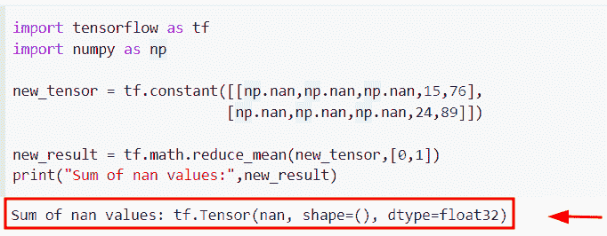
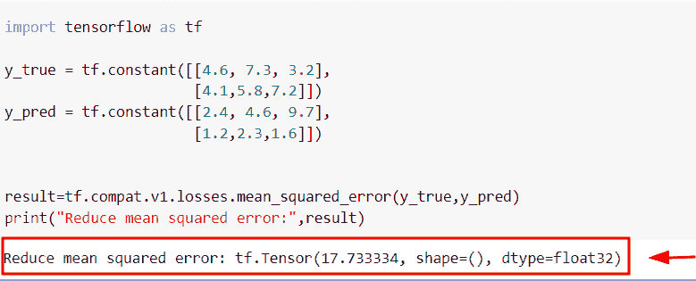
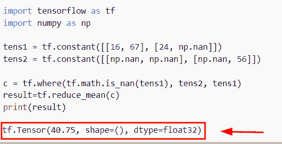

# Python 张量流 reduce_mean

> 原文：<https://pythonguides.com/python-tensorflow-reduce_mean/>

[](https://sharepointsky.teachable.com/p/python-and-machine-learning-training-course)

在本 [Python 教程](https://pythonguides.com/learn-python/)中，我们将学习**如何在 Python** 中使用 TensorFlow reduce_mean()。此外，我们将涵盖以下主题。

*   带遮罩的张量流减少平均值
*   张量流减少 _ 平均 nan
*   张量流减少均方误差
*   张量流减少意味着忽略零
*   张量流减少 _ 平均数量
*   张量流减少 _ 平均减少 _ 指数
*   张量流减少意味着忽略 nan
*   张量流 reduce_mean keepdims

目录

[](#)

*   [Python tensor flow reduce _ mean](#Python_TensorFlow_reduce_mean "Python TensorFlow reduce_mean")
*   [带遮罩的张量流减少 _ 平均](#TensorFlow_reduce_mean_with_mask "TensorFlow reduce_mean with mask")
*   [张量流减少 _ 平均 nan](#TensorFlow_reduce_mean_nan "TensorFlow reduce_mean nan")
*   [张量流减少均方误差](#TensorFlow_reduce_mean_squared_error "TensorFlow reduce mean squared error")
*   [张量流减少意味着忽略零](#TensorFlow_reduce_mean_ignore_zero "TensorFlow reduce mean ignore zero")
*   [张量流减少 _ 平均数值](#TensorFlow_reduce_mean_numpy "TensorFlow reduce_mean numpy")
*   [张量流减少 _ 平均减少 _ 指数](#TensorFlow_reduce_mean_reduction_indices "TensorFlow reduce_mean reduction_indices")
*   [张量流减少意味着忽略 nan](#TensorFlow_reduce_mean_ignore_nan "TensorFlow reduce mean ignore nan")
*   [tensor flow reduce _ mean keepdims](#TensorFlow_reduce_mean_keepdims "TensorFlow reduce_mean keepdims")

## Python tensor flow reduce _ mean

*   在本节中，我们将学习如何在 [TensorFlow Python](https://pythonguides.com/tensorflow/) 中使用 **tf.reduce_mean()** 函数。
*   为了执行这个特定的任务，我们将使用 **tf.math.reduce_mean()** 函数，这个函数在 TensorFlow 版本 **2.x** 中可用。
*   在 Python TensorFlow 中， **tf.math.reduce_mean()** 函数用于计算输入张量各维值的平均值。

**语法:**

我们先来看看语法，了解一下 **tf.math.reduce_mean()** 函数的工作原理。

```
tf.math.reduce_mean
                   (
                    input_tensor,
                    axis=None,
                    keepdims=False,
                    name=None
                   )
```

*   它由几个参数组成
    *   **input_tensor:** 该参数表示我们想要减少的张量，它应该始终是一个数字类型。
    *   **轴:**默认情况下，它不取值，一旦您在函数中使用它，默认情况下所有维度都将减少。
    *   **keepdims:** 该参数将检查条件，如果为真，则减少秩张量的长度。默认情况下，它采用假值。
    *   **名称:**可选参数，表示操作的名称。

**举例:**

让我们举一个例子，检查如何得到输入张量的平均值。

```
import tensorflow as tf

new_tensor = tf.constant([[13,69,55],
                         [245,78,94]])

new_result = tf.math.reduce_mean(new_tensor,1)
print("Sum of nan values:",new_result)
```

在上面的代码中，我们导入了 TensorFlow 库，然后使用 **tf.constant()** 函数创建了一个张量。之后，我们使用了 **tf.math.reduce_mean()** 函数，在这个函数中，我们指定了张量和**轴=1** 作为参数。

下面是下面给出的代码的截图。


Python TensorFlow reduce_mean

正如你在截图中看到的，输出显示了张量的平均值。

另外，检查: [TensorFlow Tensor to numpy](https://pythonguides.com/tensorflow-tensor-to-numpy/)

## 带遮罩的张量流减少 _ 平均

*   在本节中，我们将讨论如何在 **reduce_mean()** 函数中使用 mast。
*   为了完成这项任务，我们将使用 **tf.boolean_mask()** 函数，它用于计算张量的布尔掩码。该方法在 TensorFlow 包中可用。
*   在这种方法中，遮罩形状必须与张量形状的第一个 K 维相匹配。

**语法:**

让我们看一下语法，理解一下 **tf.boolean_mask()** 函数的工作原理。

```
tf.boolean_mask
               (
                tensor,
                mask,
                axis=None,
                name='boolean_mask',
               )
```

*   它由几个参数组成
    *   **张量:**该参数表示输入张量，可以是一个 **n 维**张量。
    *   **mask:** 它是一个 **K-D** 布尔张量，它会设置条件 **K < =N** ，其中 K 必须静态表示。
    *   **轴:**默认情况下，它采用 none 值，并指定要屏蔽的张量轴。

**举例:**

```
import tensorflow as tf
import numpy as np

tens=[14,67,89,25]
new_mask=np.array([True,False,False,True])
result=tf.boolean_mask(tens, new_mask)
print("mask value:",result)
new_output=tf.math.reduce_mean(result)
print("Mean value of mask:",new_output)
```

*   在上面的代码中，我们通过使用 **np.array()** 函数创建了一个掩码，并分配了布尔值。之后，我们使用了 **tf.boolean_mask()** 函数，在这个函数中，我们传递了张量和掩码作为参数。
*   一旦执行了这个函数，输出将显示真实值以及相关的张量值。
*   之后，我们使用了 **tf.math.reduce_mean()** 函数，并将**‘结果’**作为参数传递，它将返回掩码的平均值。

下面是以下给定代码的执行过程


Python TensorFlow reduce_mean with mask

阅读:[张量流得到形状](https://pythonguides.com/tensorflow-get-shape/)

## 张量流减少 _ 平均 nan

*   这里我们将讨论如何在 TensorFlow Python 中使用 reduce_mean()函数来减少 nan 值。
*   在这个例子中，我们将得到 nan 值的平均值。为了完成这项任务，我们首先将为 **np.nan** 值导入 numpy 库，然后我们将使用 **tf.constant()** 函数创建张量，在这个函数中，我们已经设置了 nan 值。在 Python 中，nan 代表**‘不是数字’**。
*   接下来，我们将声明一个变量**‘new _ result’**并指定 **tf.math.reduce_mean()** 函数，在此函数中，我们将输入张量和轴设置为参数。

**举例:**

```
 import tensorflow as tf
import numpy as np

new_tensor = tf.constant([[np.nan,np.nan,np.nan,15,76],
                         [np.nan,np.nan,np.nan,24,89]])

new_result = tf.math.reduce_mean(new_tensor,[0,1])
print("Sum of nan values:",new_result)
```

下面是以下给定代码的执行过程



Python TensorFlow reduce_mean nan

正如您在屏幕截图中看到的，输出显示了 nan 值的平均值。

阅读: [Python TensorFlow 随机均匀](https://pythonguides.com/tensorflow-random-uniform/)

## 张量流减少均方误差

*   在本节中，我们将讨论如何在 TensorFlow Python 中使用均方误差函数。
*   为了执行这个特定的任务，我们将使用**TF . compat . v1 . losses . mean _ squared _ error()**函数，该函数在 Tensorflow 包中可用。

**语法:**

下面是**TF . compat . v1 . losses . mean _ squared _ error()**函数的语法

```
tf.compat.v1.losses.mean_squared_error
                                      (
                                       labels,
                                       prediction,
                                       weights=1.0,
                                       scope=None,
                                      )
```

*   它由几个参数组成
    *   **标签:**此参数表示函数内部的参数。
    *   **预测:**预测参数用于**调用()**方法。

**举例:**

```
import tensorflow as tf

y_true = tf.constant([[4.6, 7.3, 3.2],
                      [4.1,5.8,7.2]])
y_pred = tf.constant([[2.4, 4.6, 9.7],
                      [1.2,2.3,1.6]])

result=tf.compat.v1.losses.mean_squared_error(y_true,y_pred)
print("Reduce mean squared error:",result)
```

在下面给出的代码中，我们通过使用 **tf.constant()** 函数创建了一个张量，然后我们使用了**TF . compat . v1 . losses . mean _ squared _ error()**函数，在这个函数中，我们将标签和预测作为一个参数进行分配。

下面是以下给定代码的实现。



TensorFlow reduce mean squared error in Python

阅读:[模块“张量流”没有属性“会话”](https://pythonguides.com/module-tensorflow-has-no-attribute-session/)

## 张量流减少意味着忽略零

*   在本节中，我们将学习如何通过使用 Python 中的 **reduce_mean()** 函数来忽略张量中的零值。
*   为了完成这项任务，我们将使用 **tf.cast()** 函数，该函数用于将输入张量转换为新类型。在该函数中，我们将设置条件 **new_tensor！=0** 以及数据类型。
*   接下来，我们将使用 **tf.reduce_sum()** 函数，并将其除以张量，它将忽略张量中的零值。

**语法:**

下面是 **tf.cast()** 函数的语法。

```
tf.cast
       (
        x,
        dtype,
        name=None
       )
```

*   它由几个参数组成
    *   **x:** 该参数表示输入张量。
    *   **name:** 这是一个可选参数，默认情况下不取值。

**举例:**

```
 import tensorflow as tf

new_tensor= tf.constant([[2,0,3],[12,34,0],[0,23,31]])
m = tf.cast(new_tensor != 0,tf.int32)
z = tf.reduce_sum(new_tensor, -1) / tf.reduce_sum(m, -1)
print(z)
```

下面是以下代码的截图


TensorFlow reduce mean ignore zero in Python

阅读:[导入错误没有名为 TensorFlow](https://pythonguides.com/import-error-no-module-named-tensorflow/) 的模块

## 张量流减少 _ 平均数值

*   在这个程序中，我们将学习如何在 **tf.reduce_mean()** 函数中实现 numpy 兼容性。
*   为了执行这个特定的任务，我们将使用 **tf.reduce_mean()** 函数，在这个函数中，我们将张量指定为一个参数。
*   它用于指定输出类型，默认情况下，它采用 **float32** 。

**举例:**

```
import tensorflow as tf

tensor = tf.constant([12, 13.5, 1, 1.5])
tf.reduce_mean(tensor)
```

下面是以下给定代码的执行。


Python TensorFlow reduce_mean numpy

正如您在屏幕截图中看到的，输出以 NumPy 为单位显示平均值。

阅读: [Python TensorFlow one_hot](https://pythonguides.com/tensorflow-one_hot/)

## 张量流减少 _ 平均减少 _ 指数

*   在本节中，我们将讨论如何在 **tf.reduce_mean()** 函数中使用 reduction _ indices 参数。
*   为了执行这个特定的任务，我们将使用**TF . compat . v1 . reduce _ mean()**函数，这个方法将帮助用户计算输入张量的各个维度的平均值。

**语法:**

我们先来看看语法，了解一下**TF . compat . v1 . reduce _ mean()**函数的工作原理。

```
tf.compat.v1.reduce_mean
                        (
                         input_tensor,
                         axis=None,
                         keepdims=None,
                         name=None,
                         reduction_indices=None,
                         keep_dims=None
                        )
```

**举例:**

```
import tensorflow as tf

tensor = tf.constant([14, 15.5, 12, 17.5])
z=tf.compat.v1.reduce_mean(tensor, reduction_indices=[0])
print(z)
```

在上面的代码中，我们导入了 TensorFlow 库，然后使用 **tf.constant()** 函数创建了张量。

之后，我们使用了**TF . compat . v1 . reduce _ mean()**函数，并在该函数中使用了**reduction _ indexes[0]**参数。

你可以参考下面的截图


Python TensorFlow reduce_mean reduction_indices

阅读: [Python TensorFlow 占位符](https://pythonguides.com/tensorflow-placeholder/)

## 张量流减少意味着忽略 nan

*   在本节中，我们将讨论如何在 Python TensorFlow 中使用 **reduce_mean()** 函数来忽略 nan 值。
*   为了完成这个任务，我们将使用 tf.where 函数和 **tf.math.is_nan()** ，这个函数将帮助用户从张量中删除 nan 值。
*   移除张量后，我们将使用 **tf.reduce_mean()** 函数来计算更新后的张量的平均值。

**语法:**

下面是 **tf.math.is_nan()** 函数的语法

```
tf.math.is_nan
              (
               x,
               name=None,
              )
```

**举例:**

我们举个例子，了解一下工作的 **tf.math.is_nan()** 函数。

**源代码:**

```
import tensorflow as tf
import numpy as np

tens1 = tf.constant([[16, 67], [24, np.nan]])
tens2 = tf.constant([[np.nan, np.nan], [np.nan, 56]])

c = tf.where(tf.math.is_nan(tens1), tens2, tens1)
result=tf.reduce_mean(c)
print(result)
```

下面是以下给定代码的执行过程



Python TensorFlow reduce mean ignore nan

阅读:[张量流自定义损失函数](https://pythonguides.com/tensorflow-custom-loss-function/)

## tensor flow reduce _ mean keepdims

*   在本期节目中，我们将讨论如何在 **reduce_mean()** 函数中使用 keepdims 参数。
*   在此函数中，keepdims 参数将检查条件，如果值为真，则输入张量的秩将减少 **1** ，默认情况下，它将取一个假值。

**语法:**

下面是 **tf.math.reduce_mean()** 函数的语法

```
tf.math.reduce_mean
                   (
                    input_tensor,
                    axis=None,
                    keepdims=False,
                    name=None
                   )
```

**举例:**

```
import tensorflow as tf

new_tensor = tf.constant([[67,145,267],
                         [18,29,31]])

new_result = tf.math.reduce_mean(new_tensor,1,keepdims=False)
print("Sum of nan values with keepdims axis:",new_result)
```

在下面给出的代码中，我们首先导入了 TensorFlow 库，然后为了创建张量，我们使用了 **tf.constant()** 函数。之后，我们使用了 **tf.math.reduce_mean()** 函数，并在函数中设置了张量、轴和 **keepdims=False** 作为参数。

下面是以下给定代码的实现


Python TensorFlow reduce_mean keepdims

您可能也喜欢阅读以下 Python TensorFlow 教程。

*   [TensorFlow Sparse Tensor](https://pythonguides.com/tensorflow-sparse-tensor/)
*   [TensorFlow next_batch](https://pythonguides.com/tensorflow-next_batch/)
*   [张量流 clip_by_value](https://pythonguides.com/tensorflow-clip_by_value/)
*   [张量低乘法](https://pythonguides.com/tensorflow-multiplication/)

所以，在这个 Python 教程中，我们学习了**如何在 Python** 中使用 TensorFlow reduce_mean()。此外，我们还讨论了以下主题。

*   TensorFlow reduce_mean pytorch
*   带遮罩的张量流减少平均值
*   张量流减少 _ 平均 nan
*   张量流减少均方误差
*   张量流减少平均层
*   张量流减少意味着忽略零
*   张量流减少 _ 平均数量
*   张量流减少 _ 平均减少 _ 指数
*   张量流减少意味着忽略 nan
*   张量流 reduce_mean keepdims

[Bijay Kumar](https://pythonguides.com/author/fewlines4biju/)

Python 是美国最流行的语言之一。我从事 Python 工作已经有很长时间了，我在与 Tkinter、Pandas、NumPy、Turtle、Django、Matplotlib、Tensorflow、Scipy、Scikit-Learn 等各种库合作方面拥有专业知识。我有与美国、加拿大、英国、澳大利亚、新西兰等国家的各种客户合作的经验。查看我的个人资料。

[enjoysharepoint.com/](https://enjoysharepoint.com/)[](https://www.facebook.com/fewlines4biju "Facebook")[](https://www.linkedin.com/in/fewlines4biju/ "Linkedin")[](https://twitter.com/fewlines4biju "Twitter")