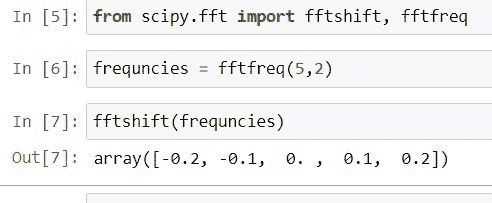
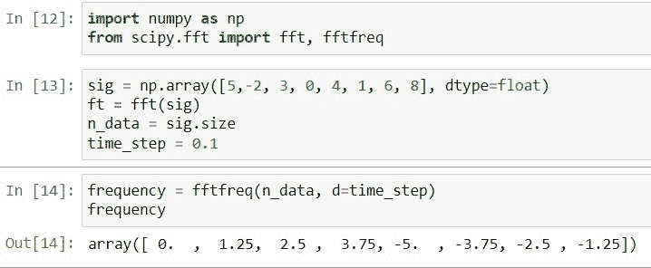
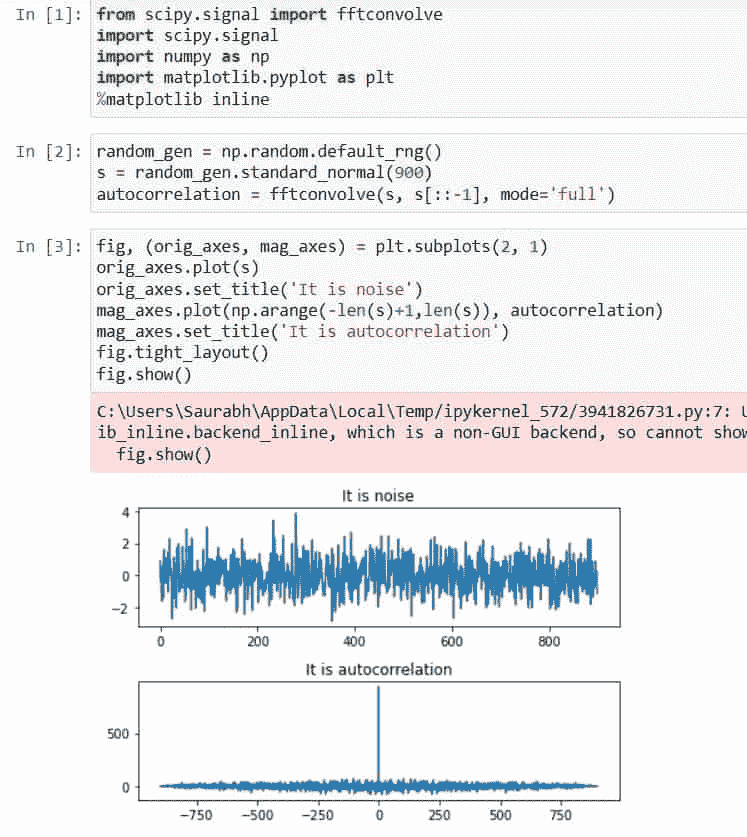
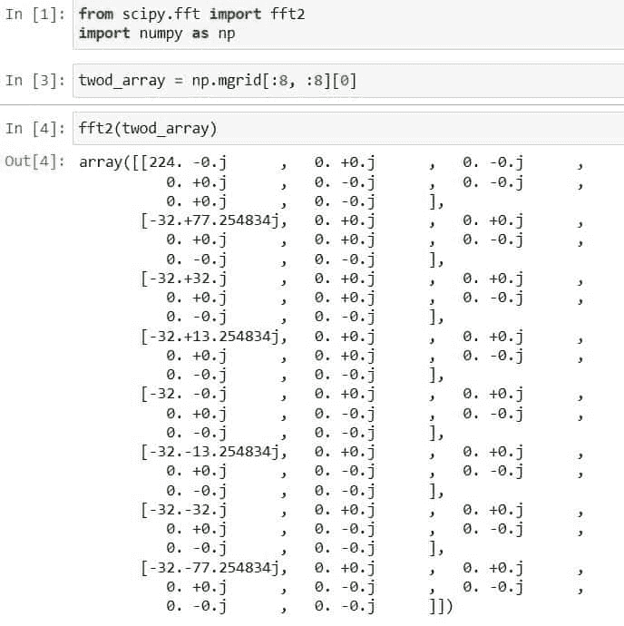
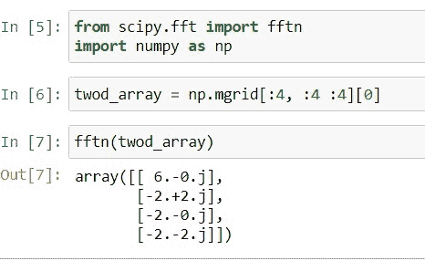
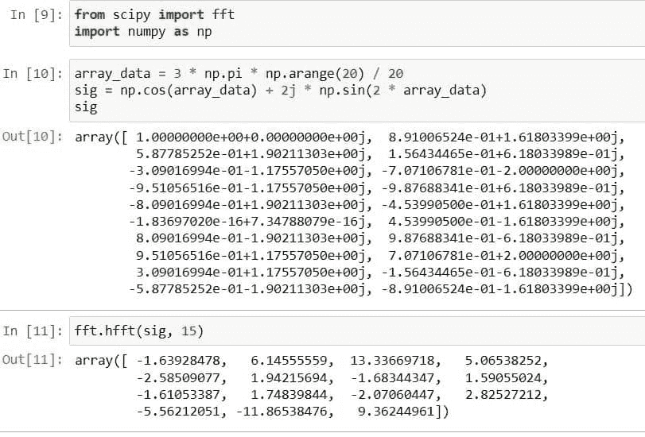
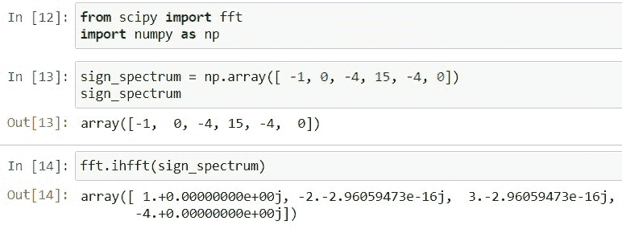

# Python Scipy FFT [11 个有用的例子]

> 原文：<https://pythonguides.com/python-scipy-fft/>

[](https://sharepointsky.teachable.com/p/python-and-machine-learning-training-course)

本 [Python 教程](https://pythonguides.com/learn-python/)将学习“ **Python Scipy FFT** ”，在这里我们将使用数学傅立叶变换来解决与信号等相关的问题。此外，涵盖以下主题。

*   Python Scipy FFT
*   Python Scipy FFT Rfft
*   Python Scipy FFT 移位
*   Python Scipy FFT Freq
*   Python Scipy FFT 卷积
*   Python Scipy FFT Fft
*   Python Scipy FFT Fft2
*   Python Scipy FFT Fftn
*   Python Scipy FFT Rfft2
*   Python Scipy FFT Hfft
*   Python Scipy FFT ihfft

目录

[](#)

*   [Python Scipy FFT](#Python_Scipy_FFT "Python Scipy FFT")
*   [Python Scipy FFT Rfft](#Python_Scipy_FFT_Rfft "Python Scipy FFT Rfft")
*   [Python Scipy FFT 移位](#Python_Scipy_FFT_Shift "Python Scipy FFT Shift")
*   [Python Scipy FFT Freq](#Python_Scipy_FFT_Freq "Python Scipy FFT Freq")
*   [Python Scipy FFT 卷积](#Python_Scipy_FFT_Convolve "Python Scipy FFT Convolve")
*   [Python Scipy FFT Fft](#Python_Scipy_FFT_Fft "Python Scipy FFT Fft")
*   [Python Scipy FFT FFT T2](#Python_Scipy_FFT_Fft2 "Python Scipy FFT Fft2")
*   [Python Scipy FFT Fftn](#Python_Scipy_FFT_Fftn "Python Scipy FFT Fftn")
*   [Python Scipy FFT Rfft2](#Python_Scipy_FFT_Rfft2 "Python Scipy FFT Rfft2")
*   [Python Scipy FFT Hfft](#Python_Scipy_FFT_Hfft "Python Scipy FFT Hfft")
*   [Python Scipy FFT ihfft](#Python_Scipy_FFT_ihfft "Python Scipy FFT ihfft")

## Python Scipy FFT

Python Scipy 模块`***scipy.fft***`处理傅立叶分析是一种将函数描述为周期分量之和并从这些分量中提取信号的技术。离散傅立叶变换是通过用离散化版本替换函数及其傅立叶变换来创建的。

快速傅立叶变换是一种执行 DFT 的非常快速的方法，帮助它成为数值计算的基石。让我们用简单的话来认识一下 ***【什么是傅立叶变换】*** 。

傅立叶变换是一种数学函数，它采用基于时间的序列，并确定图案的每个可能周期的总旋转速度、强度和周期偏移。波形是时间、空间或任何其他变量的基本函数，使用傅立叶变换对其进行变换。

通过傅立叶变换将波形分解成正弦波，这提供了另一种表达波形的方式。

在接下来的小节中，我们将学习最常用的傅立叶变换方法。

阅读:[科学统计-完整指南](https://pythonguides.com/scipy-stats/)

## Python Scipy FFT Rfft

Python SciPy 在模块`***sicpy.fft***`中有一个方法`***rfft()***`，用于计算给定实输入的一维离散傅立叶变换。

下面给出了语法。

```
scipy.fft.rfft2(x, axis=-1, n=None, overwrite_x=True, norm=None, plan=None, workers=None)
```

其中参数为:

*   ***X(array_data):*** 是作为输入提供的数组。
*   ***轴(int):*** 计算 FFT 的轴。
*   ***overwrite_x(布尔):***x 的内容如果为真可以销毁。默认情况下，它是假的。
*   ***norm:*** 像`ortho`、`forward`、`bakcward`用哪种归一化模式。
*   ***计划(对象):*** 此参数用于传递下游 FFT 供应商的预计算计划。
*   ***workers(int):*** 可用于并行处理的最大工作线程数。如果该值为负，则从`***os.cpu count ()***`开始循环。

方法`***rfft***`返回 ndarray 类型的`***out***`。已被截断或零填充并沿 axis 提供的轴转换的输入，如果未指定轴，则为最终输入。

让我们通过执行下面的 python 代码来举个例子。

```
from scipy.fft import rfft
rfft([1, 2, 4, 0])
```

在上面的代码中，我们从模块`***scipy.fft***`中导入了方法`***rfft***`，并将数组`***[1, 2, 4, 0]***`传递给了一个计算离散傅立叶变换的方法。


Scipy Python FFT Rfft

这就是如何使用 Python SciPy 的 ***`rfft()`*** 的方法。

阅读: [Scipy 优化–实用指南](https://pythonguides.com/scipy-optimize/)

## Python Scipy FFT 移位

Python Scipy 在模块`***scipy.fft***`中有一个方法`***fftshift()***`,将频谱的零频率分量移到中心。

下面给出了语法。

```
scipy.fft.fftshift(x, axes=None)
```

这些参数是:

*   ***x(array_data):*** 它是一个数组作为输入。
*   ***坐标轴(shape tuple，int):*** 移动坐标轴。默认情况下，无移动所有轴。

方法`***fftshift()***`返回 ndarray 类型的 ***`y`(被移位的数组)*** 。

让我们以下面的步骤为例:

使用下面的 python 代码导入所需的库

```
from scipy.fft import fftshift, fftfreq
```

使用下面的代码计算频率。

```
frequncies = fftfreq(5,2)
```

现在，使用下面的代码将`***frequencies***`传递给方法`***fftshift()***`。

```
fftshift(frequncies)
```



Python Scipy FFT Shift

这就是如何使用 Python SciPy 的方法`***fftshift()***`将频谱的零频率分量移动到给定频率的中心。

阅读:[科学常数](https://pythonguides.com/scipy-constants/)

## Python Scipy FFT Freq

Python SciPy 包含模块`***scipy.fft***`中的方法`***fftfreq()***`，该方法返回样本频率的傅立叶离散变化。以每单位样本间隔的周期为单位的频率仓中心被返回到浮点数组 f 中

下面给出了语法。

```
scipy.fftpack.fftfreq(n, d=2.0)
```

其中参数为:

*   ***n(int):*** 它是窗口的长度。
*   ***d(标量):*** 用于指定样本间距。

方法`***fftfreq()***`返回 ndarary 类型的 ***`f`(采样频率存储在长度为 n 的数组中)*** 。

让我们以下面的步骤为例:

使用下面的 python 代码导入所需的库。

```
import numpy as np
from scipy.fft import fft, fftfreq
```

创建一个信号，并使用傅立叶变换信号，如下所示代码。

```
sig = np.array([5,-2, 3, 0, 4, 1, 6, 8], dtype=float)
ft = fft(sig)
n_data = sig.size
time_step = 0.1
```

使用下面的代码计算采样频率。

```
frequency = fftfreq(n_data, d=time_step)
frequency
```



Python Scipy FFT Freq

这就是如何使用 Python SciPy 的方法`***fftfreq()***`。

阅读: [Python Scipy Matrix +示例](https://pythonguides.com/python-scipy-matrix/)

## Python Scipy FFT 卷积

Scipy 在模块`***scipy.signal***`中有一个方法`***fftconvolve()***`，它使用 **FFT** (快速傅立叶变换)的方法卷积 n 维数组。

下面给出了语法。

```
scipy.signal.fftconvolve(in1, in2, mode='full', method='auto')
```

其中参数为:

*   ***in1(array_data):*** 用于以数组的形式输入第一个信号。
*   ***in2(array_data):*** 用于以数组的形式输入第二个信号，维数必须与第一个输入数组相同。
*   ***模式:*** 用于指定决定输出大小的字符串。模式可以是`***same***`、`***full***`和`***valid***`。
*   ***方法:*** 用于指定计算卷积的方法。方法可以是`***auto***`、`***direct***`、`***fft***`。

让我们通过下面的步骤来了解一个示例:

使用下面的 python 代码导入所需的库。

```
from scipy.signal import fftconvolve
import scipy.signal
import numpy as np
import matplotlib.pyplot as plt
%matplotlib inline
```

生成随机噪声信号，并使用以下代码应用方法`***fftconvolveI()***`。

```
random_gen = np.random.default_rng()
s = random_gen.standard_normal(800)
autocorrelation = fftconvolve(s, s[::-1], mode='full')
```

让我们用下面的代码画出上面卷积的信号。

```
fig, (orig_axes, mag_axes) = plt.subplots(2, 1)
orig_axes.plot(s)
orig_axes.set_title('It is noise')
mag_axes.plot(np.arange(-len(s)+1,len(s)), autocorrelation)
mag_axes.set_title('It is autocorrelation')
fig.tight_layout()
fig.show()
```



Python Scipy FFT Convolve

这就是如何使用 Python SciPy 的方法`***fftconvolve()***`来卷积一个 n 维数组。

阅读:[Scipy Linalg–实用指南](https://pythonguides.com/scipy-linalg/)

## Python Scipy FFT Fft

Python SciPy 在模块`***scipy.fft***`中有一个方法`***fft()***`，用于计算一维离散傅立叶变换。

下面给出了语法。

```
scipy.fft.fft(x, n=None, norm=None, axis=- 0, overwrite_x=True,plan=None, workers=None,)
```

其中参数为:

*   ***X(array_data):*** 是作为输入提供的数组。
*   ***n(int):*** 输出转换轴的尺寸。如果 n 小于输入的长度，则输入将被裁剪。如果输入大于零，则用零填充。如果省略 n，则使用由轴指示的输入沿轴的长度。
*   ***轴(int):*** 计算 FFT 的轴。
*   ***overwrite_x(布尔):***x 的内容如果为真可以销毁。默认情况下，它是假的。
*   ***norm:*** 像`ortho`、`forward`、`bakcward`用哪种归一化模式。
*   ***计划(对象):*** 此参数用于传递下游 FFT 供应商的预计算计划。
*   ***workers(int):*** 可用于并行处理的最大工作线程数。如果该值为负，则从`***os.cpu count ()***`开始循环。

方法`***fft()***`返回类型为 complex ndarray 的 ***`out`(已被截断或补零并沿 axis 提供的轴转换的输入，如果没有提供轴，则为最终输入)*** 。

让我们以下面的步骤为例:

```
from scipy import fft
import numpy as np
```

使用下面的 python 代码计算给定值的`fft`。

```
scipy.fft.fft(np.exp(1j * np.pi * np.arange(5) / 5))
```


Python Scipy FFT Fft

这是如何使用 Python SciPy 的方法`***fft()***`计算下面给定的 FFT。

阅读: [Scipy Ndimage Rotate](https://pythonguides.com/scipy-ndimage-rotate/)

## Python Scipy FFT FFT T2

Python SciPy 在模块`***scipy.fft***`中有一个方法`***fft2()***`，用于计算二维离散傅立叶变换。

下面给出了语法。

```
scipy.fft.fft(x, n=None, norm=None, axis=- 0, overwrite_x=True,plan=None, workers=None,)
```

其中参数为:

*   ***X(array_data):*** 是作为输入提供的数组。
*   ***n(int):*** 输出转换轴的尺寸。如果 n 小于输入的长度，则输入将被裁剪。如果输入大于零，则用零填充。如果省略 n，则使用由轴指示的输入沿轴的长度。
*   ***轴(int):*** 计算 FFT 的轴。
*   ***overwrite_x(布尔):***x 的内容如果为真可以销毁。默认情况下，它是假的。
*   ***norm:*** 像`ortho`、`forward`、`bakcward`用哪种归一化模式。
*   ***计划(对象):*** 此参数用于传递下游 FFT 供应商的预计算计划。
*   ***workers(int):*** 并行处理中使用的最大工人数。如果该值为负，则从`***os.cpu count ()***`开始循环。

方法`***fft2()***`返回类型为 complex ndarray 的 ***`out`(已被截断或补零并沿 axis 提供的轴转换的输入，如果没有提供轴，则为最终输入)*** 。

让我们以下面的步骤为例:

使用下面的 python 代码导入所需的库。

```
from scipy.fft import fft2
import numpy as np
```

使用下面代码所示的方法`***np.mgrid()***`创建一个二维数组。

```
twod_array = np.mgrid[:8, :8][0]
```

使用下面的代码对上面创建的二维数组执行 FFT2。

```
fft2(twod_array)
```



Python Scipy FFT Fft2

这就是如何使用 Python SciPy 的方法`fft2()`计算二维的离散傅里叶变换。

阅读: [Scipy 卷积-完整指南](https://pythonguides.com/scipy-convolve/)

## Python Scipy FFT Fftn

Python SciPy 在模块`***scipy.fft***`中包含了一个使用快速傅立叶变换的方法`***fftn()***`，这个函数计算任意数量轴上 M-D 数组中的 n 维离散傅立叶变换。

下面给出了语法。

```
scipy.fft.fftn(x, s=None, n=None, norm=None, axis=- 0, overwrite_x=True,plan=None, workers=None,)
```

其中参数为:

*   ***X(array_data):*** 是作为输入提供的数组。
*   ***s(依次为 int):***输出的形状(每个修改轴的长度)。
*   ***n(int):*** 输出转换轴的尺寸。如果 n 小于输入的长度，则输入将被裁剪。如果输入大于零，则用零填充。如果省略 n，则使用由轴指示的输入沿轴的长度。
*   ***轴(int):*** 计算 FFT 的轴。
*   ***overwrite_x(布尔):***x 的内容如果为真可以销毁。默认情况下，它是假的。
*   ***norm:*** 像`ortho`、`forward`、`bakcward`用哪种归一化模式。
*   ***计划(对象):*** 此参数用于传递下游 FFT 供应商的预计算计划。
*   ***workers(int):*** 并行处理中使用的最大工人数。如果该值为负，则从`***os.cpu count ()***`开始循环。

方法`***fftn()***`返回 ndarray 类型的 ***`out`(输入已被截断或补零，并已沿 axes 或 s 和 x 的混合给出的轴进行转换)*** 。

使用下面的 python 代码导入所需的库。

```
from scipy.fft import fftn
import numpy as np
```

使用下面代码所示的方法`***np.mgrid()***`创建一个二维数组。

```
twod_array = np.mgrid[:4, :4 :4][0]
```

使用下面的代码对上面创建的二维数组执行 FFTN。

```
fftn(twod_array)
```



Python Scipy FFT Fftn

这就是如何使用 Python SciPy 的方法`***fftn()***`来计算跨任意数量轴的 M-D 数组中的 n 维离散傅立叶变换。

阅读: [Scipy Misc + Examples](https://pythonguides.com/scipy-misc/)

## Python Scipy FFT Rfft2

Python SciPy 在模块`***sicpy.fft***`中有一个方法`***rfft2()***`，用于计算给定实输入的二维离散傅立叶变换。

下面给出了语法。

```
scipy.fft.rfft2(x, axis=-1, n=None, overwrite_x=True, norm=None, plan=None, workers=None)
```

其中参数为:

*   ***X(array_data):*** 是作为输入提供的数组。
*   ***s(依次为 int):***FFT 的形状。
*   ***轴(int):*** 计算 FFT 的轴。
*   ***overwrite_x(布尔):***x 的内容如果为真可以销毁。默认情况下，它是假的。
*   ***norm:*** 像`ortho`、`forward`、`bakcward`用哪种归一化模式。
*   ***计划(对象):*** 此参数用于传递下游 FFT 供应商的预计算计划。
*   ***workers(int):*** 可用于并行处理的最大工作线程数。如果该值为负，则从`***os.cpu count ()***`开始循环。

方法`***rfft2***`返回 ndarray 类型的`***out***`(实际的二维 FFT 结果)。

让我们通过执行下面的 python 代码来举个例子。

```
from scipy.fft import rfft2
rfft2([[1, 2, 4, 0],
      [3, 5, 4, 8]])
```


Python Scipy FFT Rfft2

这就是如何使用 Python SciPy 的方法`rrft2()`来计算给定实输入的二维离散傅里叶变换。

阅读: [Scipy 信号-有用教程](https://pythonguides.com/scipy-signal/)

## Python Scipy FFT Hfft

Python SciPy 在模块`***scipy.fft***`中包含一个方法`***hfft()***`，用于计算厄米对称信号的 FFT。

下面给出了语法。

```
scipy.fft.hfft(x, axis=-1, n=None, overwrite_x=True, norm=None, plan=None, workers=None)
```

其中参数为:

*   ***x(array_data):*** 是作为输入提供的数组。
*   ***n(int):*** 输出转换后的轴的长度。
*   ***轴(int):*** 计算 FFT 的轴。
*   ***overwrite_x(布尔):***x 的内容如果为真可以销毁。默认情况下，它是假的。
*   ***norm:*** 像`ortho`、`forward`、`bakcward`用哪种归一化模式。
*   ***计划(对象):*** 此参数用于传递下游 FFT 供应商的预计算计划。
*   ***workers(int):*** 并行处理中使用的最大工人数。如果该值为负，则从`***os.cpu count ()***`开始循环。

方法`***hfft()***`返回类型为 complex ndarray 的 ***`out`(已被截断或补零并沿 axis 提供的轴转换的输入，如果没有提供轴，则为最终输入)*** 。

让我们通过下面的步骤来了解一个示例:

使用下面的 python 代码导入所需的库。

```
from scipy import fft
import numpy as np
```

使用下面的代码创建一个信号。

```
array_data = 3 * np.pi * np.arange(20) / 20
sig = np.cos(array_data) + 2j * np.sin(2 * array_data)
sig
```

现在计算上面创建的信号的 HFFT。

```
fft.hfft(sig, 15)
```



Python Scipy FFT Hfft

这就是如何使用 Python SciPy 的方法`***hfft()***`计算厄米对称信号的 FFT。

阅读: [Python Scipy 特辑](https://pythonguides.com/python-scipy-special/)

## Python Scipy FFT ihfft

方法`***ihfft()***`计算厄米对称信号的逆 FFT。存在于模块`***scipy.fft***`中。

下面给出了语法。

```
scipy.fft.ihfft(x, axis=-1, n=None, overwrite_x=True, norm=None, plan=None, workers=None)
```

其中参数为:

*   ***x(array_data):*** 是作为输入提供的数组。
*   ***n(int):*** 输出转换后的轴的长度。
*   ***轴(int):*** 计算 FFT 的轴。
*   ***overwrite_x(布尔):***x 的内容如果为真可以销毁。默认情况下，它是假的。
*   ***norm:*** 像`ortho`、`forward`、`bakcward`用哪种归一化模式。
*   ***计划(对象):*** 此参数用于传递下游 FFT 供应商的预计算计划。
*   ***workers(int):*** 并行处理中使用的最大工人数。如果该值为负，则从`***os.cpu count ()***`开始循环。

方法`***ihfft()***`返回类型为 complex ndarray 的 ***`out`(已被截断或补零并沿 axis 提供的轴转换的输入，如果没有提供轴，则为最终输入)*** 。

让我们以下面的步骤为例:

使用下面的 python 代码导入所需的库。

```
from scipy import fft
import numpy as np
```

使用下面的代码创建一个信号频谱。

```
sign_spectrum = np.array([ -1, 0, -4, 15, -4, 0])
sign_spectrum
```

使用以下代码计算该信号的 hfft。

```
fft.ihfft(sign_spectrum)
```



Python Scipy FFT ihfft

这就是如何使用 Python SciPy 的方法`***ihfft()***`来计算厄米对称信号的逆 FFT。

你可能也喜欢阅读下面的 SciPy 教程。

*   [Scipy 正态分布](https://pythonguides.com/scipy-normal-distribution/)
*   [Python Scipy 置信区间](https://pythonguides.com/scipy-confidence-interval/)
*   [Scipy Stats Zscore +示例](https://pythonguides.com/scipy-stats-zscore/)

因此，在本教程中，我们已经了解了" **Python Scipy FFT** "并涵盖了以下主题。

*   Python Scipy FFT
*   Python Scipy FFT Rfft
*   Python Scipy FFT 移位
*   Python Scipy FFT Freq
*   Python Scipy FFT 卷积
*   Python Scipy FFT Fft
*   Python Scipy FFT Fft2
*   Python Scipy FFT Fftn
*   Python Scipy FFT Rfft2
*   Python Scipy FFT Hfft
*   Python Scipy FFT ihfft

[Bijay Kumar](https://pythonguides.com/author/fewlines4biju/)

Python 是美国最流行的语言之一。我从事 Python 工作已经有很长时间了，我在与 Tkinter、Pandas、NumPy、Turtle、Django、Matplotlib、Tensorflow、Scipy、Scikit-Learn 等各种库合作方面拥有专业知识。我有与美国、加拿大、英国、澳大利亚、新西兰等国家的各种客户合作的经验。查看我的个人资料。

[enjoysharepoint.com/](https://enjoysharepoint.com/)[](https://www.facebook.com/fewlines4biju "Facebook")[](https://www.linkedin.com/in/fewlines4biju/ "Linkedin")[](https://twitter.com/fewlines4biju "Twitter")