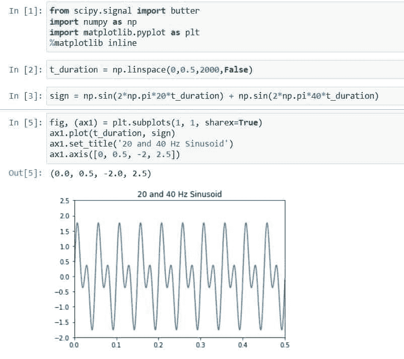
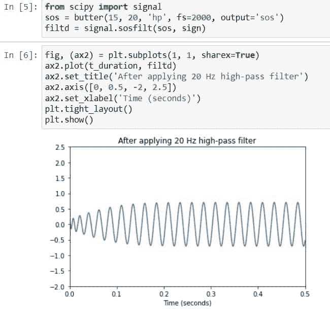
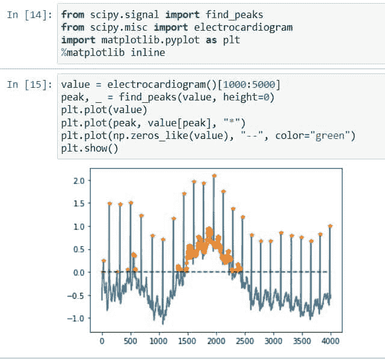
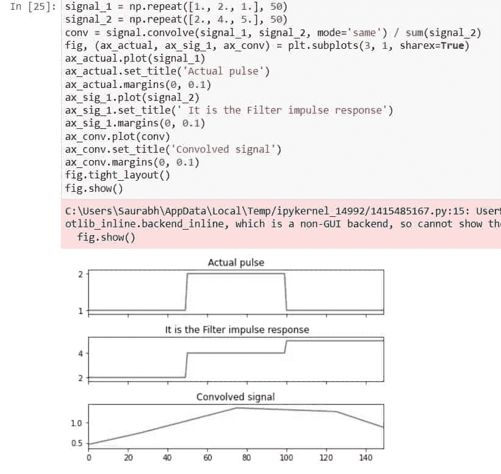
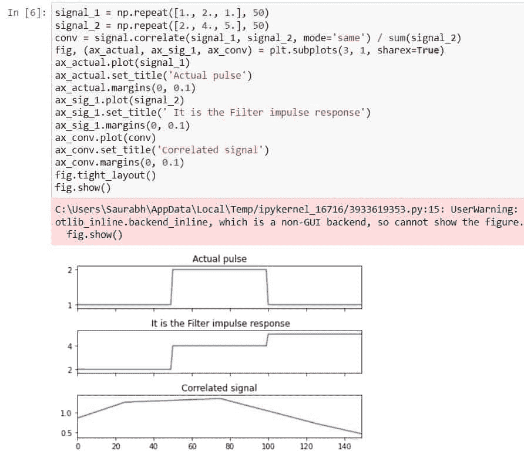
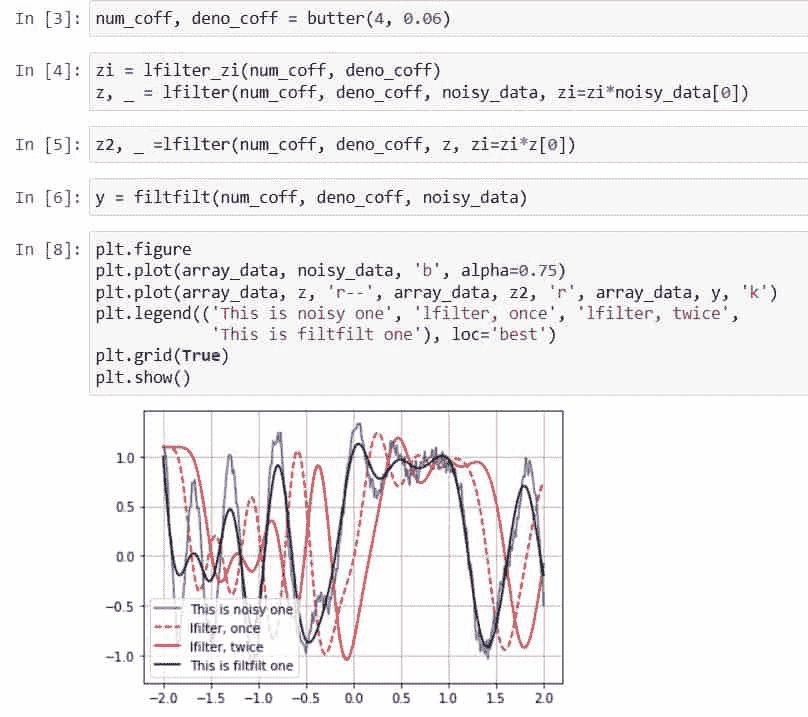
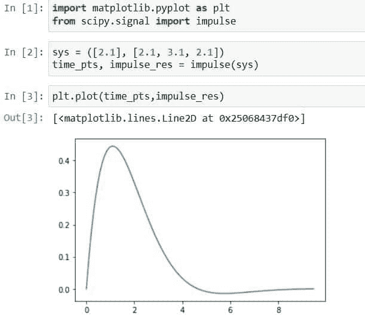
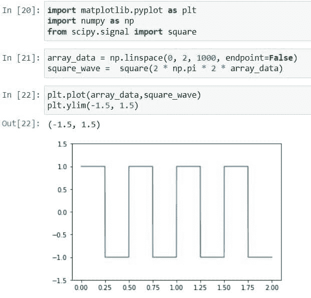
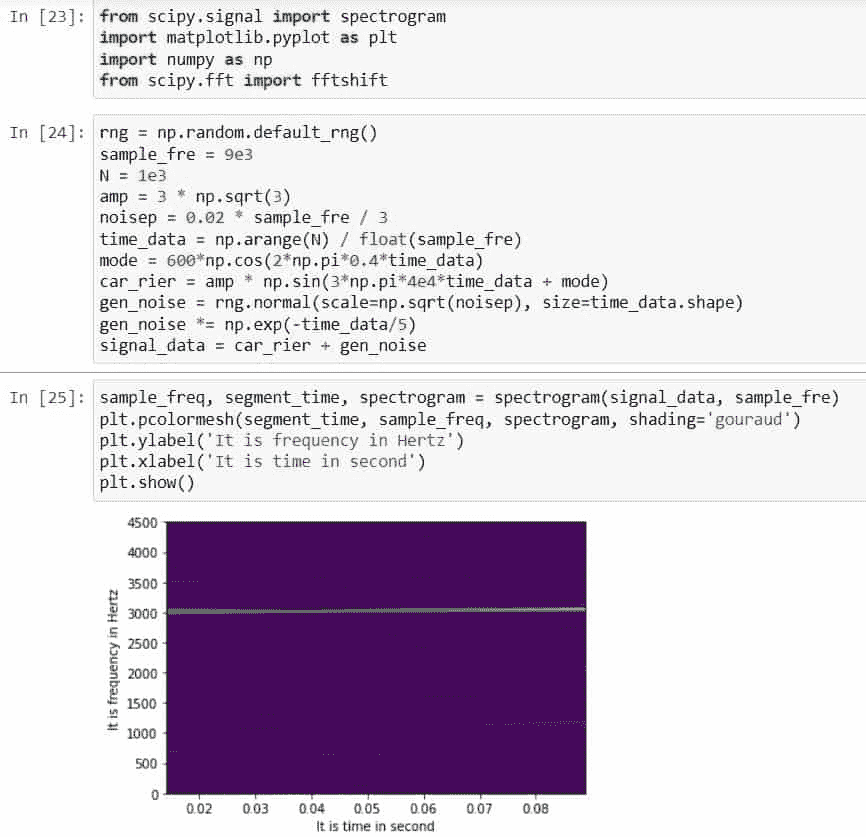

# Scipy 信号-有用的教程

> 原文：<https://pythonguides.com/scipy-signal/>

[](https://sharepointsky.teachable.com/p/python-and-machine-learning-training-course)

在本 [Python 教程](https://pythonguides.com/learn-python/)中，我们将了解“ **Scipy 信号**，并涵盖以下主题。

*   Scipy 信号
*   西皮信号黄油
*   科学信号处理
*   敏感信号找到峰值
*   信号卷积
*   信号相关
*   信号滤波器
*   突发信号脉冲
*   锋利的信号方块
*   信号频谱图

目录

[](#)

*   [Scipy 信号](#Scipy_Signal "Scipy Signal")
*   [Scipy 信号黄油](#Scipy_Signal_Butter "Scipy Signal Butter")
*   [Scipy 信号找到峰值](#Scipy_Signal_Find_peaks "Scipy Signal Find peaks")
*   [信号卷积](#Scipy_Signal_Convolve "Scipy Signal Convolve")
*   [Scipy 信号相关](#Scipy_Signal_Correlate "Scipy Signal Correlate")
*   [信号滤波器](#Scipy_Signal_Ifilter "Scipy Signal Ifilter")
*   [尖峰信号脉冲](#Scipy_Signal_Impulse "Scipy Signal Impulse")
*   [尖尖的信号方块](#Scipy_Signal_Square "Scipy Signal Square")
*   [尖峰信号频谱图](#Scipy_Signal_Spectrogram "Scipy Signal Spectrogram")

## Scipy 信号

[Scipy](https://pythonguides.com/what-is-scipy-in-python/) 有一个库`***scipy.signal***`，用于修改、分析和处理视频信号、音频信号等信号。

它有许多功能或方法来处理以下类别的不同种类的信号问题:

*   b 样条
*   卷积的
*   滤波器设计
*   过滤
*   连续时间线性系统
*   Matlab 风格的 IIR 滤波器设计
*   离散时间线性系统
*   窗口功能
*   LTI 交涉
*   波形
*   线性调频 z 变换和缩放 FFT
*   光谱分析
*   小波
*   峰值发现

每个类别包含很多函数，所以这里我们将介绍一些类别的常用方法。

阅读: [Scipy Misc + Examples](https://pythonguides.com/scipy-misc/)

## Scipy 信号黄油

Scipy 有一个方法`***butter()***`将巴特沃兹滤波器应用于信号。换句话说，我们可以设计 n 阶数字或模拟巴特沃兹滤波器来平坦化频率。

下面给出了语法。

```py
scipy.signal.butter(N, Wn, btype='low', analog=False, output='ba', fs=None)
```

其中参数为:

*   ***N(int):*** 用于指定过滤器的阶数。
*   ***Wn(array_data):*** 用于指定高通和低通滤波器的临界频率。
*   ***b 类型:*** 用于指定使用哪种滤波器，如带阻、高通、低通和带通。
*   ***模拟(布尔):*** 如果为真，则使用模拟滤波器，否则，在为假的情况下，使用数字滤波器。
*   output:用于指定输出类型，如 zpk ( ploe-zero)、sos(二阶部分)和 ba(向后兼容)。

让我们以下面的步骤为例:

使用下面的 python 代码导入所需的库。

```py
from scipy.signal import butter
import numpy as np
import matplotlib.pyplot as plt
%matplotlib inline 
```

使用下面的代码创建信号的持续时间。

```py
t_duration = np.linspace(0,0.5,2000,False)
```

使用以下代码生成一个频率为 ***20*** 和 ***40 赫兹*** 的信号。

```py
sign = np.sin(2*np.pi*20*t_duration) + np.sin(2*np.pi*40*t_duration)
```

使用下面的代码绘制创建的信号。

```py
fig, (ax1) = plt.subplots(1, 1, sharex=True)
ax1.plot(t_duration, sign)
ax1.set_title('20 and 40 Hz Sinusoid')
ax1.axis([0, 0.5, -2, 2.5])
```



Scipy Signal Butter example

创建一个 25 Hz 的巴特沃兹高通滤波器，并使用下面的代码将其应用于上面创建的信号。

```py
from scipy import signal
sos = butter(15, 20, 'hp', fs=2000, output='sos')
filtd = signal.sosfilt(sos, sign)
```

使用以下代码绘制应用滤波器后的信号。

```py
fig, (ax2) = plt.subplots(1, 1, sharex=True)
ax2.plot(t_duration, filtd)
ax2.set_title('After applying 20 Hz high-pass filter')
ax2.axis([0, 0.5, -2, 2.5])
ax2.set_xlabel('Time (seconds)')
plt.tight_layout()
plt.show()
```



Scipy Signal Butter

这就是如何在信号上应用巴特沃兹。

阅读: [Scipy Integrate +示例](https://pythonguides.com/scipy-integrate/)

## Scipy 信号找到峰值

Scipy 在模块`***scipy.signal***`中有一个方法`***find_peaks()***`，它根据给定的峰值属性返回所有的峰值。

下面给出了语法。

```py
scipy.signal.find_peaks(x, height=1, prominence=4,  distance=2, width=2, threshold=1, rel_height=0.5, wlen=1, )
```

其中参数为:

*   ***x(序列):*** 用于接受有峰值的信号。
*   ***高度(sequence，ndarray，number):*** 用于提供峰高。
*   ***阈值(sequence，ndarray，number):*** 用于提供峰值阈值。
*   ***距离(数字):*** 用于提供相邻山峰之间的最小水平距离。
*   ***日珥(sequence，ndarray，number):*** 用于提供峰值日珥。
*   ***宽度(sequence，ndarray，number):*** 用于提供峰值的宽度。
*   ***wlen(int):*** 它用于计算日珥峰值。
*   ***rel_height(int):*** 用于计算峰高。

让我们以下面的步骤为例:

使用下面的 python 代码导入所需的库。

```py
from scipy.signal import find_peaks
from scipy.misc import electrocardiogram
import matplotlib.pyplot as plt
%matplotlib inline
```

使用以下代码生成心电图。

```py
value = electrocardiogram()[1000:5000]
```

现在使用下面的代码。

```py
peak, _ = find_peaks(value, height=0)
plt.plot(value)
plt.plot(peak, value[peak], "*")
plt.plot(np.zeros_like(value), "--", color="green")
plt.show()
```



Scipy Signal Find peaks

这就是如何找到信号的所有峰值。

阅读:[科学统计-完整指南](https://pythonguides.com/scipy-stats/)

## 信号卷积

Scipy 在模块`***scipy.signal***`中有一个方法`***convolve()***`，通过组合两个信号返回第三个信号。

下面给出了语法。

```py
scipy.signal.convolve(in1, in2, mode='full', method='auto')
```

其中参数为:

*   ***in1(array_data):*** 用于以数组的形式输入第一个信号。
*   ***in2(array_data):*** 用于以数组的形式输入第二个信号，维数必须与第一个输入数组相同。
*   ***模式:*** 用于指定决定输出大小的字符串。模式可以是`***same***`、`***full***`和`***valid***`。
*   ***方法:*** 用于指定计算卷积的方法。方法可以是`***auto***`、`***direct***`、`***fft***`。

让我们通过下面的步骤来了解一个示例:

使用下面的 python 代码导入所需的库。

```py
from scipy.signal import convolve
import scipy.signal
import numpy as np
import matplotlib.pyplot as plt
%matplotlib inline
```

使用下面的代码创建两个不同的信号。

```py
signal_1 = np.repeat([1., 2., 1.], 50)
signal_2 = np.repeat([2., 4., 5.], 50)
```

现在，使用下面的代码将两个信号相加，创建第三个信号。

```py
conv = signal.convolve(signal_1, signal_2, mode='same') / sum(signal_2)
```

让我们用下面的代码画出上面的信号。

```py
fig, (ax_actual, ax_sig_1, ax_conv) = plt.subplots(3, 1, sharex=True)
ax_actual.plot(signal_1)
ax_actual.set_title('Actual pulse')
ax_actual.margins(0, 0.1)
ax_sig_1.plot(signal_2)
ax_sig_1.set_title(' It is the Filter impulse response')
ax_sig_1.margins(0, 0.1)
ax_conv.plot(conv)
ax_conv.set_title('Convolved signal')
ax_conv.margins(0, 0.1)
fig.tight_layout()
fig.show()
```



Scipy Signal Convolve

本指南通过合并两个不同的信号来生成第三个信号。

阅读: [Scipy 旋转图像+示例](https://pythonguides.com/scipy-rotate-image/)

## Scipy 信号相关

Scipy 在模块`***scipy.signal***`中有一个类似于方法`***scipy.signal.convolve()***`的方法`***correlate()***`。它还通过将两个信号相加产生第三个信号，所产生的信号被称为`***cross correlation***`。

下面给出了语法。

```py
scipy.signal.correlate(in1, in2, mode='full', method='auto')
```

其中参数为:

*   ***in1(array_data):*** 用于以数组的形式输入第一个信号。
*   ***in2(array_data):*** 用于以数组的形式输入第二个信号，维数必须与第一个输入数组相同。
*   ***模式:*** 用于指定决定输出大小的字符串。模式可以是`***same***`、`***full***`和`***valid***`。
*   ***方法:*** 用于指定计算卷积的方法。方法可以是`***auto***`、`***direct***`、`***fft***`。

让我们通过下面的步骤来了解一个示例:

使用下面的 python 代码导入所需的库。

```py
from scipy.signal import correlate
from scipy import signal
import numpy as np
import matplotlib.pyplot as plt
%matplotlib inline
```

使用下面的代码创建两个不同的信号。

```py
signal_1 = np.repeat([1., 2., 1.], 50)
signal_2 = np.repeat([2., 4., 5.], 50)
```

现在，使用下面的代码将两个信号相加，创建第三个信号。

```py
conv = signal.correlate(signal_1, signal_2, mode='same') / sum(signal_2)
```

让我们用下面的代码画出上面的信号。

```py
fig, (ax_actual, ax_sig_1, ax_conv) = plt.subplots(3, 1, sharex=True)
ax_actual.plot(signal_1)
ax_actual.set_title('Actual pulse')
ax_actual.margins(0, 0.1)
ax_sig_1.plot(signal_2)
ax_sig_1.set_title(' It is the Filter impulse response')
ax_sig_1.margins(0, 0.1)
ax_conv.plot(conv)
ax_conv.set_title('Correlated signal')
ax_conv.margins(0, 0.1)
fig.tight_layout()
fig.show()
```



Scipy Signal Correlate

这就是如何在 Python 中使用 Scipy 关联信号。

阅读: [Scipy 优化–实用指南](https://pythonguides.com/scipy-optimize/)

## 信号滤波器

Scipy 在模块`***scipy.signal***`中有一个方法`***ifilter()***`，它使用过滤器`***Finite Impulse Respose***` (FIR)或`**Infinite Impulse Response**`在一个维度上清理信号数据。

下面给出了语法。

```py
scipy.signal.lfilter(b, a, x, axis=- 1, zi=None)
```

其中参数为:

*   ***b(array_data):*** 是包含分子系数的一维向量序列。
*   ***a(array_data):*** 它是包含分母系数的一维向量序列。
*   ***x(array_data):*** 作为输入的是 ndarray。
*   ***axis(int):*** 是给定数组一的轴的名称，该数组应用了线性过滤器。
*   ***zi(array_data):*** 用于指定支持过滤器的初始条件。

上面的方法返回两个值`***y***`和`***zi***`。

让我们来看一个使用以下步骤的示例:

使用下面的 python 代码导入所需的库。

```py
from scipy.signal import lfilter,butter,filtfilt
import matplotlib.pyplot as plt
import numpy as np
```

创建一个噪声信号，我们将使用下面的代码过滤。

```py
rng = np.random.default_rng()
array_data = np.linspace(-2, 2, 302)
sin_data = (np.sin(2*np.pi*0.65*array_data*(1-array_data) + 1.1) +
     0.2*np.sin(2*np.pi*2.1*array_data + 1) +
     0.20*np.cos(2*np.pi*2.58*array_data))
noisy_data = sin_data + rng.standard_normal(len(array_data)) * 0.07
```


Scipy Signal Ifilter example

使用以下代码设计 4 阶低通巴特沃兹滤波器。

```py
num_coff, deno_coff = butter(4, 0.06)
```

让我们对有噪声的数据实施滤波。

```py
zi = lfilter_zi(num_coff, deno_coff)
z, _ = lfilter(num_coff, deno_coff, noisy_data, zi=zi*noisy_data[0])
```

再次实现过滤器。

```py
z2, _ =lfilter(num_coff, deno_coff, z, zi=zi*z[0])
```

现在实现 filtfilt 过滤器。

```py
y = filtfilt(num_coff, deno_coff, noisy_data)
```

使用以下代码绘制所有信号。

```py
plt.figure
plt.plot(array_data, noisy_data, 'b', alpha=0.75)
plt.plot(array_data, z, 'r--', array_data, z2, 'r', array_data, y, 'k')
plt.legend(('This is noisy one', 'lfilter, once', 'lfilter, twice',
            'This is filtfilt one'), loc='best')
plt.grid(True)
plt.show()
```



Scipy Signal Ifilter

这就是如何使用`***lfilter()***`方法过滤噪声信号。

阅读:[Scipy Sparse–有用的教程](https://pythonguides.com/scipy-sparse/)

## 尖峰信号脉冲

scipy 在 Scipy 模块`***scipy.signal***`中有一个方法`***impulse()***`，它是连续时间系统对外部变化的回应。

下面给出了语法。

```py
scipy.signal.impulse(system, X0=None, T=None, N=None)
```

其中参数为:

*   ***系统(数组 _ 数据元组):*** 用于定义系统。
*   ***X0(array_data):*** 它是初始状态的数组向量。
*   ***T(array_data):*** 是时间点。
*   ***N(int):*** 要计算时间点的个数，使用此参数。

该方法返回两个值`***T***`和`***yout***`。

让我们按照以下步骤来看一个例子:

使用下面的 python 代码导入所需的库。

```py
import matplotlib.pyplot as plt
from scipy.signal import impulse
```

使用下面的代码创建一个系统。

```py
sys = ([2.1], [2.1, 3.1, 2.1])
time_pts, impulse_res = signal.impulse(sys)
```

现在使用下面的代码绘制生成的脉冲。

```py
plt.plot(time_pts,impulse_res)
```



Scipy Signal Impulse

这就是如何使用模块`***scipy.signal***`的 impulse 方法。

阅读: [Scipy 常量–多个示例](https://pythonguides.com/scipy-constants/)

## 尖尖的信号方块

Scipy 模块`***scipy.signal***`包含一个生成方波波形的方法`***square()***`。

下面给出了语法。

```py
scipy.signal.square(t, duty=0.5)
```

其中参数为:

*   ***t(array_data):*** 输入的是数组数据。
*   ***duty(array _ data):***用于定义占空比，默认为 0.5。

该方法返回包含方波的 ndarray 类型的`y`。

让我们按照以下步骤生成一个方波:

使用下面的 python 代码导入所需的库。

```py
import matplotlib.pyplot as plt
import numpy as np
from scipy.signal import square
```

使用下面的代码创建一个数据和方波数据的数组。

```py
array_data = np.linspace(0, 2, 1000, endpoint=False)
square_wave =  square(2 * np.pi * 2 * array_data)
```

现在使用下面的代码绘制出创建的方波波形。

```py
plt.plot(array_data,square_wave)
plt.ylim(-1.5, 1.5)
```



Scipy Signal Square

这就是如何在 Python 程序中使用 Scipy 创建方波波形。

阅读: [Scipy 卷积-完整指南](https://pythonguides.com/scipy-convolve/)

## 尖峰信号频谱图

Scipy 在模块`***scipy.signal***`中有一个方法`***spectrogram()***`,它显示了特定波形的不同频率上的信号强度随时间的变化。

下面给出了语法。

```py
scipy.signal.spectrogram(x, fs=1.0, window=('tukey', 1), nperseg=None, noverlap=None, nfft=None, detrend='constant', return_onesided=False, axis=- 1, mode='psd')
```

其中参数为:

*   ***x(array_data):*** 是时间序列。
*   ***【fs】(浮点):*** 用于提供时序采样频率。
*   ***window(array_data， ***tuple****** ， ***string):*** 用来指定我们要实现什么样的窗口。
*   ***nperseg(int):*** 指定每一段的长度。
*   ***【nooverlap(int):***用于指定线段间重叠的点数。
*   ***nfft(int):*** 它是 fft 的大小。
*   ***detrend(False，string，function):*** 用于指定如何从每一段中去除趋势。
*   ***return _ one side(boolean):***获取身边的谱数据。如果为真，则返回单面，否则在为假的情况下返回双面。
*   ***(int)轴:*** 用于指定沿哪个轴计算谱图。
*   ***模式(字符串):*** 指定我们想要的预期值，如角度、幅度、相位、复数和 PSD。

该方法返回三个值`***f***`(频率为数组)`***t***`(分段次数为数组)`***sxx***`(声谱图)。

通过下面的步骤，让我们用一个例子来理解:

使用下面的 python 代码导入所需的库。

```py
from scipy.signal import spectrogram
import matplotlib.pyplot as plt
import numpy as np
from scipy.fft import fftshift
```

使用以下代码定义生成信号所需的参数值。

```py
rng = np.random.default_rng()
sample_fre = 9e3
n = 1e3
amp = 3 * np.sqrt(3)
noisep = 0.02 * sample_fre / 3
time_data = np.arange(n) / float(sample_fre)
mode = 600*np.cos(3*np.pi*0.4*time_data)
car_rier = amp * np.sin(3*np.pi*4e4*time_data + mode)
gen_noise = rng.normal(scale=np.sqrt(noisep), size=time_data.shape)
gen_noise *= np.exp(-time_data/5)
signal_data = car_rier + gen_noise
```

现在使用下面的代码计算并显示声谱图。

```py
sample_freq, segment_time, spectrogram = spectrogram(signal_data, sample_fre)
plt.pcolormesh(segment_time, sample_freq, spectrogram, shading='gouraud')
plt.ylabel('It is frequency in Hertz')
plt.xlabel('It is time in second')
plt.show()
```



Scipy Signal Spectrogram

这是如何使用 Python 中的 scipy 计算声谱图。

另外，看看更多的 Scipy 教程。

*   [Python Scipy Matrix +示例](https://pythonguides.com/python-scipy-matrix/)
*   [Scipy Find Peaks–实用教程](https://pythonguides.com/scipy-find-peaks/)

因此，在本教程中，我们已经了解了" **Scipy 信号**"并涵盖了以下主题。

*   Scipy 信号
*   西皮信号黄油
*   科学信号处理
*   敏感信号找到峰值
*   信号卷积
*   信号相关
*   信号滤波器
*   突发信号脉冲
*   锋利的信号方块
*   信号频谱图

[Bijay Kumar](https://pythonguides.com/author/fewlines4biju/)

Python 是美国最流行的语言之一。我从事 Python 工作已经有很长时间了，我在与 Tkinter、Pandas、NumPy、Turtle、Django、Matplotlib、Tensorflow、Scipy、Scikit-Learn 等各种库合作方面拥有专业知识。我有与美国、加拿大、英国、澳大利亚、新西兰等国家的各种客户合作的经验。查看我的个人资料。

[enjoysharepoint.com/](https://enjoysharepoint.com/)[](https://www.facebook.com/fewlines4biju "Facebook")[](https://www.linkedin.com/in/fewlines4biju/ "Linkedin")[](https://twitter.com/fewlines4biju "Twitter")