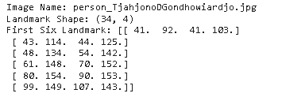
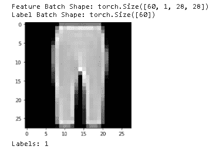
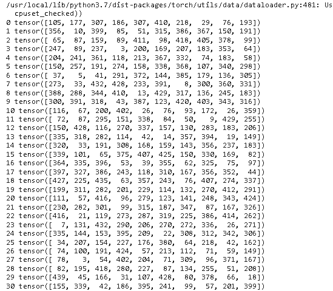
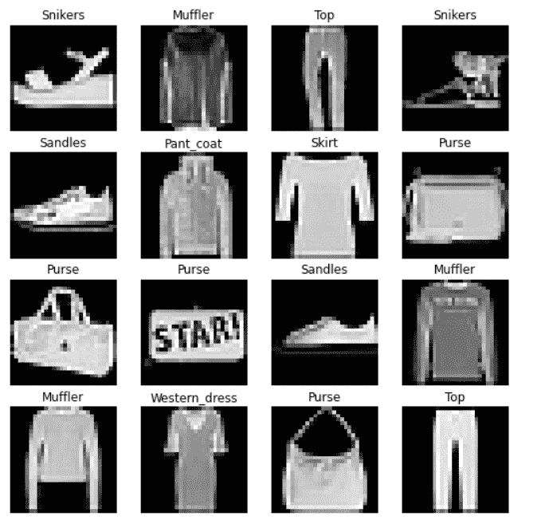
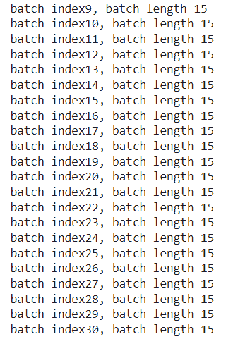
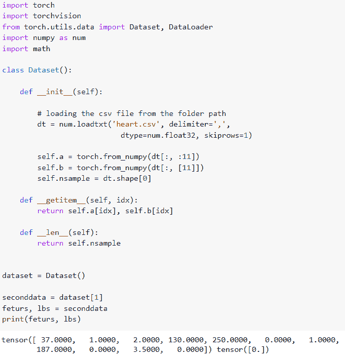
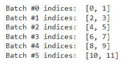

# 资料载入器+范例

> [https://python guides . com/pytor 资料载入器/](https://pythonguides.com/pytorch-dataloader/)

[](https://sharepointsky.teachable.com/p/python-and-machine-learning-training-course)

在本 [Python 教程](https://pythonguides.com/learn-python/)中，我们将学习 Python 中的 **PyTorch Dataloader** ，我们还将涵盖与 PyTorch Dataloader 相关的不同示例。此外，我们将涵盖这些主题。

*   资料载入器游标
*   PyTorch 数据加载器示例
*   来自目录的 PyTorch 数据加载器
*   PyTorch 数据加载器训练测试拆分
*   文本数据加载器
*   Cuda 数据加载器
*   PyTorch 数据加载器数量 _ 工作线程
*   pyzer 数据加载器添加尺寸
*   PyTorch 数据加载器访问数据集
*   批次大小资料载入器游标
*   PyTorch dataloader epoch
*   PyTorch dataloader enumerate
*   dataloader 资料框游标
*   批量取样器数据加载器

目录

[](#)

*   [数据加载器指针](#PyTorch_Dataloader "PyTorch Dataloader")
*   [PyTorch 数据加载器示例](#PyTorch_Dataloader_Example "PyTorch Dataloader Example")
*   [目录中的 PyTorch 数据加载器](#PyTorch_dataloader_from_the_directory "PyTorch dataloader from the directory")
*   [PyTorch 数据加载器列车测试分割](#PyTorch_dataloader_train_test_split "PyTorch dataloader train test split")
*   [文本数据加载器指针](#PyTorch_dataloader_for_text "PyTorch dataloader for text")
*   [数据加载器指针 Cuda](#PyTorch_dataloader_Cuda "PyTorch dataloader Cuda")
*   [py torch data loader num _ workers](#PyTorch_dataloader_num_workers "PyTorch dataloader num_workers")
*   [Pytorch dataloder 添加尺寸](#Pytorch_dataloder_add_dimension "Pytorch dataloder add dimension")
*   [PyTorch dataloader 访问数据集](#PyTorch_dataloader_access_dataset "PyTorch dataloader access dataset")
*   [数据加载器指针批量大小](#PyTorch_dataloader_batch_size "PyTorch dataloader batch size")
*   [PyTorch dataloader epoch](#PyTorch_dataloader_epoch "PyTorch dataloader epoch")
*   [PyTorch dataloader enumerate](#PyTorch_dataloader_enumerate "PyTorch dataloader enumerate")
*   [数据加载器数据帧指针](#PyTorch_dataloader_dataframe "PyTorch dataloader dataframe")
*   [数据加载器指针批量采样器](#PyTorch_dataloader_batch_sampler "PyTorch dataloader batch sampler")

## 数据加载器指针

在本节中，我们将了解 PyTorch 数据加载器如何在 python 中工作。

数据加载器被定义为组合数据集并提供给定数据集的迭代的过程。Dataloader 还用于导入或导出数据。

**语法:**

以下是在 PyTorch 中使用 Dataloader 的语法:

```
DataLoader(dataset,batch_size=1,shuffle=False,sampler=None,batch_sampler=None,num_workers=0,collate_fn=None,pin_memory=False,drop_last=False,timeout=0,worker_init_fn=None)
```

**参数:**

数据加载器语法中使用的参数:

*   **数据集:**data loader 类必须使用数据集进行构建。
*   **batch_size:** 每批的样本数。
*   **洗牌:**当我们要对数据进行洗牌时使用。
*   **取样器:**取样器定义回收样品的方案。
*   **Batch_sampler:** 与数据样本相同。
*   **num_workers:** 加载数据的进程数。
*   **collate_fn:** 将样本整理成批次。
*   **pin _ memory:**GPU 用于快速访问数据的位置。
*   **drop_last:** 最后一批中的元素数量少于 batch_size。
*   **超时:**用于设置从工人处领取批次时等待的时间。
*   **worker_init_fn:** 允许客户的套路。

此外，检查: [Keras 与 py torch–主要差异](https://pythonguides.com/keras-vs-pytorch/)

## PyTorch 数据加载器示例

在本节中，我们将借助 python 中的例子来了解**如何在** [**PyTorch**](https://pythonguides.com/what-is-pytorch/) 中实现 dataloader。

在这个 dataloader 示例中，我们可以导入数据，然后导出数据。数据加载器可以使数据加载变得非常容易。

**代码:**

在下面的代码中，我们将导入一些可以从中加载数据的库。

*   **warnings . filter warnings(' ignore ')**用于忽略警告。
*   **plot.ion()** 用于打开非活动模式。
*   **landmark frame = PDS . read _ csv(' face _ landmarks . CSV ')**用于读取 CSV 文件。
*   **landmarkFrame.iloc[x，0]** 用作基于整数位置的索引。
*   **num.asarray(landmark)** 用于将输入转换为数组。
*   **打印('图像名称:{} '。【T1 格式(imagename))】用于打印屏幕上的图像名称。**
*   **打印('地标形状:{} '。格式(landmark.shape))** 用于打印屏幕上的地标形状。
*   **打印('前六个地标:{} '。format(landmark[:6])**用于打印屏幕上的前六个地标。

```
from __future__ import print_function, division
import os
import torch
import pandas as pds
from skimage import io, transform
import numpy as num
import matplotlib.pyplot as plot
from torch.utils.data import Dataset, DataLoader
from torchvision import transforms, utils

import warnings
warnings.filterwarnings('ignore')

plot.ion() 
landmarkFrame = pds.read_csv('face_landmarks.csv')

x = 67
imagename = landmarkFrame.iloc[x, 0]
landmark = landmarkFrame.iloc[x, 1:]
landmark = num.asarray(landmark)
landmark = landmark.astype('float').reshape(-3, 4)

print('Image Name: {}'.format(imagename))
print('Landmark Shape: {}'.format(landmark.shape))
print('First Six Landmark: {}'.format(landmark[:6]))
```

**输出:**

运行上面的代码后，我们得到下面的输出，其中我们可以看到屏幕上打印出了 **ImageName** 、 **Landmark Shape** 和**前六个 Landmark** 。



PyTorch dataloader example

阅读: [PyTorch 保存模型](https://pythonguides.com/pytorch-save-model/)

## 目录中的 PyTorch 数据加载器

在本节中，我们将从 python 中的目录中了解到 **PyTorch 数据加载器。**

Dataloader 从目录中获取数据集。目录被定义为文件或子目录的集合。

**代码:**

在下面的代码中，我们将导入一些库，从中我们可以加载目录中的数据。

*   **训练数据=数据集。FashionMNIST()** 作为训练数据集。
*   测试数据=数据集。使用 FashionMNIST() 作为测试数据集。
*   **train dl = data loader(training data，batch_size=60，shuffle=True)** 用于加载训练数据。
*   **testdl = DataLoader(test_data，batch_size=60，shuffle=True)** 用于加载测试数据。
*   **print(f "特征批次造型:{ train Feature . size()} "**用于打印特征批次造型。
*   **print(f " Label Batch Shape:{ train Label . size()} "**用于打印标签批次特征。
*   **plot.imshow(imgdir，cmap="gray")** 用于在屏幕上绘制图像。
*   **print(f " Labels:{ Labels } "**用于在屏幕上打印标签。

```
import torch
from torch.utils.data import Dataset
from torchvision import datasets
from torchvision.transforms import ToTensor
import matplotlib.pyplot as plot

trainingdata = datasets.FashionMNIST(
    root="data",
    train=True,
    download=True,
    transform=ToTensor()
)

testdata = datasets.FashionMNIST(
    root="data",
    train=False,
    download=True,
    transform=ToTensor()
)
from torch.utils.data import DataLoader

traindl = DataLoader(trainingdata, batch_size=60, shuffle=True)
testdl = DataLoader(test_data, batch_size=60, shuffle=True)
# Display image and label.
trainfeature, trainlabel = next(iter(traindl))
print(f"Feature Batch Shape: {trainfeature.size()}")
print(f"Label Batch Shape: {trainlabel.size()}")
imgdir = trainfeature[0].squeeze()
labels = trainlabel[0]
plot.imshow(imgdir, cmap="gray")
plot.show()
print(f"Labels: {labels}")
```

**输出:**

在下面的输出中，我们可以看到数据加载器可以从目录中加载数据并将其打印在屏幕上。



PyTorch dataloader from the directory

阅读: [PyTorch 负载模型+示例](https://pythonguides.com/pytorch-load-model/)

## PyTorch 数据加载器列车测试分割

在这一节中，我们将了解数据加载器如何将数据分割成 train 并在 python 中测试。

训练测试分割是一个计算模型性能并查看我们的模型执行的准确性的过程。

**代码:**

在下面的代码中，我们将导入一些库，dataloader 可以从这些库中将数据分成 train 和 test。

*   **变换。Compose()** 用于声明将原始数据转换为张量的变换。
*   **traindata，test data = random _ split(train data，[50000，10000])** 用于将数据拆分成训练和测试。
*   **train _ loader = data loader(train data，batch_size=32)** 用于创建一个批量数据加载器。
*   **optimizer = torch . optim . SGD(models . parameters()、lr = 0.01)** 用于初始化优化器。
*   **print(f'Epoch {i+1} \t\t 训练数据:{ train loss/len(train _ loader)} \ t \ t 测试数据:{ Test loss/len(Test _ loader)} ')**用于打印训练和测试数据。
*   **torch . save(models . state _ dict()，' saved_model.pth')** 用于保存状态 dict。

```
import torch
from torch import nn
import torch.nn.functional as fun
from torchvision import datasets, transforms
from torch.utils.data import DataLoader, random_split
import numpy as num

transform = transforms.Compose([
                                 transforms.ToTensor()
])

traindata = datasets.MNIST('', train = True, transform = transform, download = True)
traindata,testdata = random_split(traindata,[50000,10000])

train_loader = DataLoader(traindata, batch_size=32)
test_loader = DataLoader(testdata, batch_size=32)

**# Building Our Mode**
class network(nn.Module):

    def __init__(self):
        super(network,self).__init__()
        self.fc = nn.Linear(28*28, 256)
        self.fc1 = nn.Linear(256, 128)
        self.fc2 = nn.Linear(128, 10)

    def forward(self, y):
        y = y.view(y.shape[0],-1)   
        y = fun.relu(self.fc(y))
        y = fun.relu(self.fc1(y))
        y = self.fc2(y)
        return y

models = network()
if torch.cuda.is_available():
    models = models.cuda()

criterions = nn.CrossEntropyLoss()
optimizers = torch.optim.SGD(models.parameters(), lr = 0.01)

epoch = 7
minvalid_loss = num.inf

for i in range(epoch):
    trainloss = 0.0
    models.train()     
    for data, label in train_loader:
        if torch.cuda.is_available():
            data, label = data.cuda(), label.cuda()

        optimizers.zero_grad()
        targets = models(data)
        loss = criterions(targets,label)
        loss.backward()
        optimizers.step()
        trainloss += loss.item()

    testloss = 0.0
    models.eval()    
    for data, label in test_loader:
        if torch.cuda.is_available():
            data, label = data.cuda(), label.cuda()

        targets = models(data)
        loss = criterions(targets,label)
        testloss = loss.item() * data.size(0)

    print(f'Epoch {i+1} \t\t Training data: {trainloss / len(train_loader)} \t\t Test data: {testloss / len(test_loader)}')
    if minvalid_loss > testloss:
        print(f'Test data Decreased({minvalid_loss:.6f}--->{testloss:.6f}) \t Saving The Model')
        minvalid_loss = testloss

        torch.save(models.state_dict(), 'saved_model.pth')
```

**输出:**

在下面的输出中，我们可以看到 PyTorch Dataloader spit train 测试数据被打印在屏幕上。


PyTorch dataloader train test split

阅读: [PyTorch nn 线性+例题](https://pythonguides.com/pytorch-nn-linear/)

## 文本数据加载器指针

在本节中，我们将了解 PyTorch 数据加载器如何为 python 中的文本工作。

Dataloader 组合数据集，并提供给定数据集的迭代。Dataset 存储所有数据，dataloader 用于转换数据。

**代码:**

在下面的代码中，我们将导入 torch 模块，以便从 dataloader 加载文本。

*   **train iteration = AG _ NEWS(split = ' train ')**用于将整个数据拆分成列车数据。
*   **打印(标签，线条)**用于打印标签和线条。
*   **data loaders = data loader(train iteration，batch_size=5，shuffle=False)** 用于加载数据。

```
from torchtext.datasets import AG_NEWS
trainiteration = AG_NEWS(split='train')
**# Iterate with for loop**
for (labels, lines) in trainiteration:
       print(labels, lines)
**# send to DataLoader**
from torch.utils.data import DataLoader
trainiteration = AG_NEWS(split='train')
dataloaders = DataLoader(trainiteration, batch_size=5, shuffle=False)
```

**输出:**

运行上面的代码后，我们得到下面的输出，其中我们可以看到文本数据的 PyTorch 数据加载器打印在屏幕上。


PyTorch dataloader for text

阅读: [Adam optimizer PyTorch 示例](https://pythonguides.com/adam-optimizer-pytorch/)

## 数据加载器指针 Cuda

在本节中，我们将学习 python 中的 **PyTorch 数据加载器 Cuda** 。

在继续之前，我们应该了解一些关于 Cuda 的知识。Cuda 是一个应用程序编程接口，允许软件使用特定类型的 GPU。

**代码:**

在下面的代码中，我们将导入一个 torch 模块，我们可以通过 dataloader 从该模块加载数据。

*   **traindata =数据集。MNIST()** 被用作训练数据集。
*   **trainloader = DataLoader()** 用于加载列车数据。
*   **train data . train _ data . to(torch . device(" cuda:0 "))**用于将数据全部放入 GPU。

```
import torch
from torch.utils.data import DataLoader
from torchvision import datasets
from torchvision import transforms
batchsize = 60
transforms = transforms.Compose([
    transforms.ToTensor(),
    transforms.Normalize((0.1304,), (0.3080,))
])
traindata = datasets.MNIST(
    root='./dataset/minst/',
    train=True,
    download=False,
    transform=transforms
)
trainloader = DataLoader(
    dataset=traindata,
    shuffle=True,
    batch_size=batchsize
)
traindata.train_data.to(torch.device("cuda:0"))  
traindata.train_labels.to(torch.device("cuda:0"))
```

**输出:**

运行上述代码后，我们得到以下输出，从中我们可以看到数据被放入 GPU，并在 dataloader 的帮助下加载到屏幕上。


PyTorch dataloader Cuda

阅读:[交叉熵损失 PyTorch](https://pythonguides.com/cross-entropy-loss-pytorch/)

## py torch data loader num _ workers

在本节中，我们将学习 python 中的 **PyTorch 数据加载器 num_workers** 。

num _ workersis 定义为提供创建批处理的进程数的进程。

**代码:**

在下面的代码中，我们将导入一些模块，dataloader num_workers 从这些模块创建 baches。

*   **变换。Compose()** 用于定义转换以规范化数据。
*   **train _ loader = torch.utils.data . data loader(train _ set，batch_size=60，shuffle=True)** 来自 torch . utils . data 导入数据集，用于加载训练数据。
*   **datasets=SampleDataset(2，440)** 用于创建样本数据集。
*   **dloader = DataLoader(datasets，batch_size=10，shuffle=True，num_workers=4 )** 用于加载批处理。
*   **print(x，batch)** 用于打印批次。

```
import torch
import matplotlib.pyplot as plot
from torchvision import datasets, transforms

transforms = transforms.Compose([transforms.ToTensor(),
                              transforms.Normalize((0.5,), (0.3,)),
                              ])

train_set = datasets.MNIST('~/.pytorch/MNIST_data/', download=True, train=True, transform=transforms)
train_loader = torch.utils.data.DataLoader(train_set, batch_size=60, shuffle=True)
from torch.utils.data import Dataset
import random

class SampleDataset(Dataset):
  def __init__(self,r,r1):
    random_list=[]
    for x in range(2,999):
      m = random.randint(r,r1)
      random_list.append(m)
    self.samples=random_list

  def __len__(self):
      return len(self.samples)

  def __getitem__(self,idx):
      return(self.samples[idx])

datasets=SampleDataset(2,440)
datasets[90:100]
from torch.utils.data import DataLoader
dloader = DataLoader(datasets,batch_size=10, shuffle=True, num_workers=4 )
for x, batch in enumerate(dloader):
        print(x, batch)
```

**输出:**

运行上面的代码后，我们得到下面的输出，其中我们可以看到 PyTorch 数据加载器 num_workers 数据被打印在屏幕上。



PyTorch dataloader num_worker

阅读: [PyTorch 张量到 Numpy](https://pythonguides.com/pytorch-tensor-to-numpy/)

## Pytorch dataloder 添加尺寸

在本节中，我们将了解到 **PyTorch dataloader 如何在 python 中添加维度**。

PyTorch 中的 dataloader 似乎在 batch 维度之后添加了一些额外的维度。

**代码:**

在下面的代码中，我们将导入 torch 模块，从中我们可以添加一个维度。

*   **mnisttrain_data = MNIST(root= '。/data '，train=True，download=True，transform =转换。撰写([转换。ToTensor()]))** 用于从 mnist 数据集加载数据。
*   **打印(y.shape)** 用于打印 y 的形状
*   **train loader _ data = torch . utils . data . data loader(mnist train _ data，batch_size=150)** 用于加载列车数据。
*   **batch_y，batch _ z = next(ITER(train loader _ data))**用于获取第一批。
*   **print(batch_y.shape)** 用于打印批量的形状。

```
import torch
from torchvision.datasets import MNIST
from torchvision import transforms

if __name__ == '__main__':
    mnisttrain_data = MNIST(root='./data', train=True, download=True, transform=transforms.Compose([transforms.ToTensor()]))
    y = mnisttrain_data.data[1]
    print(y.shape)  

    trainloader_data = torch.utils.data.DataLoader(mnisttrain_data, batch_size=150)
    batch_y, batch_z = next(iter(trainloader_data))  
    print(batch_y.shape)
```

**输出:**

运行上面的代码后，我们得到下面的输出，从中我们可以看到维度将被添加。


PyTorch dataloader add dimension

阅读: [PyTorch 批量标准化](https://pythonguides.com/pytorch-batch-normalization/)

## PyTorch dataloader 访问数据集

在本节中，我们将学习**如何在 python 中的**数据加载器**的帮助下访问数据集**。

数据集包含一个围绕数据集的 iterable，它授权访问样本。

**代码:**

在下面的代码中，我们将导入数据加载器可以从中访问数据集的 **torch** 模块。

*   **figure _ data = plot . figure(figsize =(9，9))** 用于绘制图形。
*   **sample _ index = torch . randint(len(train data)，size=(1，)。【T1 项()】用于生成随机样本项。**
*   **figure _ data . add _ subplot(rows，columns，x)** 用于添加一些支线剧情。
*   **plot . title(label map _ dt[labels])**用于在屏幕上绘制标题。
*   **plot.imshow(image.squeeze()、cmap="gray")** 用于显示屏幕上的图像。

```
import torch
from torch.utils.data import Dataset
from torchvision import datasets
from torchvision.transforms import ToTensor
import matplotlib.pyplot as plot

traindata = datasets.FashionMNIST(
    root="data",
    train=True,
    download=True,
    transform=ToTensor()
)

testdata = datasets.FashionMNIST(
    root="data",
    train=False,
    download=True,
    transform=ToTensor()
)
labelmap_dt = {
    0: "Skirt",
    1: "Top",
    2: "Muffler",
    3: "Western_dress",
    4: "Pant_coat",
    5: "Snikers",
    6: "T-shirt",
    7: "Sandles",
    8: "Purse",
    9: "Shoes",
}
figure_data = plot.figure(figsize=(9,9))
columns, rows = 4, 4
for x in range(1, columns * rows + 1):
    sample_index = torch.randint(len(traindata), size=(1,)).item()
    image, labels = traindata[sample_index]
    figure_data.add_subplot(rows, columns, x)
    plot.title(labelmap_dt[labels])
    plot.axis("off")
    plot.imshow(image.squeeze(), cmap="gray")
plot.show()
```

**输出:**

以下输出显示数据加载器可以访问数据集，并且图像和标签绘制在屏幕上。



PyTorch dataloader access dataset

阅读:[py torch ms loss–详细指南](https://pythonguides.com/pytorch-mseloss/)

## 数据加载器指针批量大小

在本节中，我们将学习**如何借助 python 中的 dataloader** 加载批量大小。

批量定义为模型更新前处理的样本数量。批量大小等于训练数据中的样本数。

**代码:**

在下面的代码中，我们将导入 torch 模块，在模型更新之前，我们可以从该模块处理样本数。

*   **datasets = imp dataset(1001)**作为数据集使用。
*   **data loader = data loader(datasets，batch_size=15)** 用于加载批量为 15 的数据。
*   **len(dataloader)** 用作 dataloader 的长度。
*   **打印('批次索引{}，批次长度{} '。**(batchindex，len(data))【格式】用于打印屏幕上的批次索引、批次长度。

```
import torch
from torch.utils.data import Dataset
from torchvision import datasets
from torchvision.transforms import ToTensor
from torch.utils.data import DataLoader
class impdataset(Dataset):
    def __init__(self, siz):
        self.y = torch.randn(siz, 1)

    def __getitem__(self, idx):
        return self.y[idx]

    def __len__(self):
        return len(self.y)

datasets = impdataset(1001)

dataloader = DataLoader(datasets,batch_size=15)

len(dataloader)

for batchindex, data in enumerate(dataloader):
    print('batch index{}, batch length {}'.format(batchindex, len(data)))
```

**输出:**

运行上面的代码后，我们得到下面的输出，其中我们可以看到 dataloader 批处理大小打印在屏幕上。



PyTorch dataloader batch size

阅读: [PyTorch MNIST 教程](https://pythonguides.com/pytorch-mnist/)

## PyTorch dataloader epoch

在本节中，我们将了解 PyTorch dataloader epoch 如何在 python 中工作。

在前进之前，我们应该有一个关于时代的知识。纪元被定义为时间开始的点。

**代码:**

在下面的代码中，我们将导入 torch 模块，从中我们可以加载 dataloader epoch 以开始工作。

*   traindt =数据集。MNIST("，train = True，transform = transform，download = True) 用作训练数据。
*   **train _ loader = data loader(train dt，batch_size=30)** 用作训练加载器。
*   **test _ loader = data loader(testdt，batch_size=30)** 用作测试加载器。
*   **optimizer = torch . optim . SGD(models . parameters()、lr = 0.01)** 用于初始化优化器。
*   **optimizer . zero _ grad()**用于优化零梯度。
*   **print(f'Epoch {x+1} \t\t 训练数据:{ train loss/len(train _ loader)} \ t \ t 测试数据:{ Test loss/len(Test _ loader)} ')**用于在屏幕上打印训练和测试数据。

```
import torch
from torch import nn
import torch.nn.functional as func
from torchvision import datasets, transforms
from torch.utils.data import DataLoader, random_split
import numpy as num

transform = transforms.Compose([
                                 transforms.ToTensor()
])

traindt = datasets.MNIST('', train = True, transform = transform, download = True)
traindt,testdt = random_split(traindt,[50000,10000])

train_loader = DataLoader(traindt, batch_size=30)
test_loader = DataLoader(testdt, batch_size=30)

class network(nn.Module):

    def __init__(self):
        super(network,self).__init__()
        self.fc = nn.Linear(28*28, 254)
        self.fc1 = nn.Linear(254, 126)
        self.fc2 = nn.Linear(126, 10)

    def forward(self, y):
        y = y.view(y.shape[0],-1)   
        y = func.relu(self.fc(y))
        y = func.relu(self.fc1(y))
        y = self.fc2(y)
        return y

models = network()
if torch.cuda.is_available():
    models = models.cuda()

criterions = nn.CrossEntropyLoss()
optimizers = torch.optim.SGD(models.parameters(), lr = 0.01)

epoch = 5
minvalid_loss = num.inf

for x in range(epoch):
    trainloss = 0.0
    models.train()     
    for data, label in train_loader:
        if torch.cuda.is_available():
            data, label = data.cuda(), label.cuda()

        optimizers.zero_grad()
        targets = models(data)
        loss = criterions(targets,label)
        loss.backward()
        optimizers.step()
        trainloss += loss.item()

    testloss = 0.0
    models.eval()    
    for data, label in test_loader:
        if torch.cuda.is_available():
            data, label = data.cuda(), label.cuda()

        targets = models(data)
        loss = criterions(targets,label)
        testloss = loss.item() * data.size(0)

    print(f'Epoch {x+1} \t\t Training data: {trainloss / len(train_loader)} \t\t Test data: {testloss / len(test_loader)}')
```

**输出:**

在下面的输出中，我们可以看到带有 epoch 的训练数据和测试数据被打印在屏幕上。


PyTorch dataloader epoch

阅读: [PyTorch 全连接层](https://pythonguides.com/pytorch-fully-connected-layer/)

## PyTorch dataloader enumerate

在本节中，我们将学习 python 中的**py torch data loader enumerate**。

数据加载器组合数据集，并在给定的数据集上提供迭代，枚举被定义为一个过程，一个一个地提到事物的数量。

**代码:**

在下面的代码中，我们将导入 torch 模块，从中我们可以枚举数据。

*   **num = list(范围(0，90，2))** 用于定义列表。
*   **data _ loader = DataLoader(dataset，batch_size=12，shuffle=True)** 用于在数据集上实现 data loader，并按批次打印。
*   **print(x，batch)** 用于逐个打印批次号。

```
import torch
from torch.utils.data import Dataset
from torch.utils.data import DataLoader

**# define the Dataset class**
class dataset(Dataset):
    def __init__(self):
        num = list(range(0, 90, 2))
        self.data = num

    def __len__(self):
        return len(self.data)

    def __getitem__(self, idx):
        return self.data[idx]

dataset = dataset()

data_loader = DataLoader(dataset, batch_size=12, shuffle=True)
for x, batch in enumerate(data_loader):
    print(x, batch)
```

**输出:**

在运行上面的代码之后，我们得到了下面的输出，其中我们可以看到批处理被一个接一个地打印在屏幕上。


PyTorch dataloader enumerate

阅读:[py torch RNN-详细指南](https://pythonguides.com/pytorch-rnn/)

## 数据加载器数据帧指针

在本节中，我们将学习如何使用 python 中的 dataframe 加载数据。

数据帧被定义为具有行和列的二维异构数据结构，数据加载器使用数据帧来加载数据。

**代码:**

在下面的代码中，我们将导入一些可以从中加载数据的库。

*   **dt = num.loadtxt('heart.csv '，delimiter= '，'，dtype=num.float32，skiprows=1)** 用于从 path 加载 csv 文件。
*   **self.a = torch.from_numpy(dt[:，:11])** 作为类标签作为 11 列使用。
*   **seconddata = dataset[1]** 用于获取第二个样本并解包。

```
 import torch
import torchvision
from torch.utils.data import Dataset, DataLoader
import numpy as num
import math

class Dataset():

    def __init__(self):

        dt = num.loadtxt('heart.csv', delimiter=',',
                           dtype=num.float32, skiprows=1)

        self.a = torch.from_numpy(dt[:, :11])
        self.b = torch.from_numpy(dt[:, [11]])
        self.nsample = dt.shape[0] 

    def __getitem__(self, idx):
        return self.a[idx], self.b[idx]

    **# we can call len(dataset) to return the size**
    def __len__(self):
        return self.nsample

dataset = Dataset()
seconddata = dataset[1]
feturs, lbs = seconddata
print(feturs, lbs)
```

**输出:**

运行上述代码后，我们得到以下输出，从中可以看到数据加载器可以使用数据框加载数据。



Pytorch dataloader dataframe

## 数据加载器指针批量采样器

在本节中，我们将学习 python 中的 **PyTorch dataloader 批处理采样器**。

数据加载器有一个内部使用的采样器，用于获取每个批次的索引。批次采样器在批次下定义。

代码:

*   在下面的代码中，我们将导入 torch 模块，从中我们可以获得每批的索引。
*   **data _ set = batchsamplerdataset(xdata，ydata)** 用于定义数据集。
*   **batches _ sampler = data loader(data _ set)。采样器**用于加载数据集。
*   **batchsize = 2** 用于获取顺序采样器的迭代。
*   **default batch _ sampler = data loader(data _ set，batch_size=batchsize)。batch_sampler** 用于加载批量采样器。
*   **print(f ' batch # { I } indexes:'，batch _ indexes)**用于打印批次和批次索引。

```
import torch
from torch.utils.data import Dataset
from torch.utils.data import DataLoader
xdata = list(range(12))
ydata = list(range(12,22))
class batchsamplerdataset:
    def __init__(self, xdata, ydata):
        self.xdata = xdata
        self.ydata = ydata

    def __getitem__(self, n):
        return self.xdata[n], self.ydata[n]

    def __len__(self):
        return len(self.xdata)
data_set = batchsamplerdataset(xdata, ydata)
data_set[2]
batches_sampler = DataLoader(data_set).sampler
for x in batches_sampler:

    batchsize = 2
defaultbatch_sampler = DataLoader(data_set, batch_size=batchsize).batch_sampler
for i, batch_indices in enumerate(defaultbatch_sampler):
    print(f'Batch #{i} indices: ', batch_indices)
```

**输出:**

在下面的输出中，我们可以看到 PyTorch dataloader 批处理取样器打印在屏幕上。



Pytorch dataloader batch sampler

因此，在本教程中，我们讨论了 **PyTorch dataloader** ，并且我们还涵盖了与其实现相关的不同示例。这是我们已经讨论过的例子列表。

*   资料载入器游标
*   PyTorch 数据加载器示例
*   来自目录的 PyTorch 数据加载器
*   PyTorch 数据加载器训练测试拆分
*   文本数据加载器
*   Cuda 数据加载器
*   PyTorch 数据加载器数量 _ 工作线程
*   PyTorch 数据加载器访问数据集
*   批次大小资料载入器游标
*   PyTorch dataloader epoch
*   PyTorch dataloader enumerate
*   dataloader 资料框游标
*   批量取样器数据加载器

[Bijay Kumar](https://pythonguides.com/author/fewlines4biju/)

Python 是美国最流行的语言之一。我从事 Python 工作已经有很长时间了，我在与 Tkinter、Pandas、NumPy、Turtle、Django、Matplotlib、Tensorflow、Scipy、Scikit-Learn 等各种库合作方面拥有专业知识。我有与美国、加拿大、英国、澳大利亚、新西兰等国家的各种客户合作的经验。查看我的个人资料。

[enjoysharepoint.com/](https://enjoysharepoint.com/)[](https://www.facebook.com/fewlines4biju "Facebook")[](https://www.linkedin.com/in/fewlines4biju/ "Linkedin")[](https://twitter.com/fewlines4biju "Twitter")