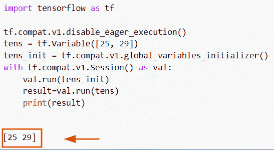
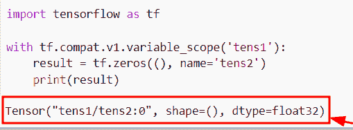
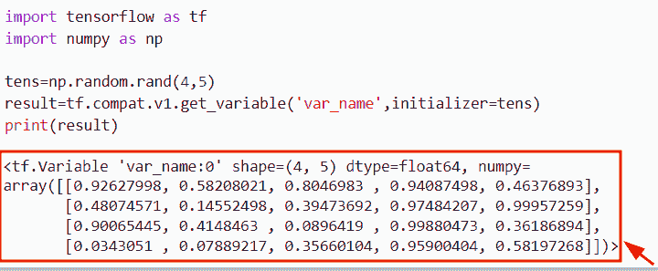

# TensorFlow 获取变量+示例

> 原文：<https://pythonguides.com/tensorflow-get-variable/>

[](https://sharepointsky.teachable.com/p/python-and-machine-learning-training-course)

在本 [Python 教程](https://pythonguides.com/learn-python/)中，我们将学习**如何获取 Python TensorFlow** 中的 **变量。此外，我们将涵盖以下主题。**

*   TensorFlow 通过名称获取变量
*   张量流获取变量值
*   TensorFlow 获取变量范围
*   TensorFlow 获取变量初始值
*   TensorFlow 获取变量列表

目录

[](#)

*   [张量流获取变量](#TensorFlow_get_variable "TensorFlow get variable")
*   [TensorFlow 按名称获取变量](#TensorFlow_get_variable_by_name "TensorFlow get variable by name")
*   [TensorFlow 获取变量值](#TensorFlow_get_variable_value "TensorFlow get variable value")
*   [TensorFlow 获取变量范围](#TensorFlow_get_variable_scope "TensorFlow get variable scope")
*   [TensorFlow 获取变量初始值](#TensorFlow_get_variable_initializer "TensorFlow get variable initializer")
*   [TensorFlow 获取变量列表](#TensorFlow_get_variable_list "TensorFlow get variable list")

## 张量流获取变量

*   在本节中，我们将讨论如何在 [Python TensorFlow](https://pythonguides.com/tensorflow/) 中获取变量。
*   为了执行这个特定的任务，我们将使用**TF . compat . v1 . get _ variable()**函数，这个函数用于获取带有这些参数的给定变量。
*   在这个例子中，我们将创建一个简单的变量 **'tens'** 并分配给**TF . compat . v1 . get _ variable()**函数，在这个函数中，我们将为它分配 **name** 和 **dtype** 参数。

**语法:**

我们来看一下语法，了解一下 Python TensorFlow 中**TF . compat . v1 . get _ variable()**函数的工作原理。

```py
tf.compat.v1.get_variable
                         (
                          name,
                          shape=None,
                          dtype=None,
                          initializer=None,
                          regularizer=None,
                          trainable=None,
                          collections=None,
                          caching_devices=None,
                          partitioner=None,
                          validate_shape=true,
                          use_resource=None,
                          custom_getter=None,
                          constraint=None,
                          synchronization=tf.variableSynchronization.AUTO,
                          aggregation=tf.compat.v1.variableAggregation.None
                         )
```

*   它由几个参数组成
    *   **名称:**该参数表示给定变量的名称。
    *   **形状:**该参数定义了给定或现有变量的形状。
    *   **dtype:** 默认取 **tf.float32()** 值，存在于给定变量中。
    *   默认情况下，它接受 none 值，并指定它是否可以是一个进程或初始化器。
    *   **正则化:**该参数用于正则化。
    *   **可训练:**默认情况下，它不取值，它将检查条件，如果为真，它将给定的变量添加到图形集合中。
    *   **集合:**它定义了图形集合的列表，默认情况下，它不取值。

**举例:**

我们举个例子，检查一下**如何在 Python TensorFlow** 中获取变量。

**源代码:**

```py
import tensorflow as tf
tens = tf.compat.v1.get_variable(name='tens',shape=[1],dtype=tf.int32)
print(tens)
```

在下面的代码中，我们导入了 TensorFlow 库，然后创建了一个变量，并在其中分配了函数**TF . compat . v1 . get _ variable()**。在这个函数中，我们传递了**名称、形状和数据类型**作为参数。一旦执行了这段代码，输出将显示变量的名称。

下面是下面给出的代码的截图。


TensorFlow get variable in Python

阅读: [TensorFlow Tensor to NumPy](https://pythonguides.com/tensorflow-tensor-to-numpy/)

## TensorFlow 按名称获取变量

*   在这个程序中，我们将讨论如何在 Python TensorFlow 中按名称获取变量。
*   为了完成这项任务，我们将使用**TF . compat . v1 . get _ variable()**函数，该函数将帮助用户获得带有该参数的给定或现有变量。在这个例子中，我们将只提到**名称**和**形状**参数。

**语法:**

下面是**TF . compat . v1 . get _ variable()**函数的语法

```py
tf.compat.v1.get_variable
                         (
                          name,
                          shape=None,
                          dtype=None,
                          initializer=None,
                          regularizer=None,
                          trainable=None,
                          collections=None,
                          caching_devices=None,
                          partitioner=None,
                          validate_shape=true,
                          use_resource=None,
                          custom_getter=None,
                          constraint=None,
                          synchronization=tf.variableSynchronization.AUTO,
                          aggregation=tf.compat.v1.variableAggregation.None
                         )
```

**举例:**

让我们举一个例子，检查如何在 Python TensorFlow 中通过名称获取变量。

**源代码:**

```py
import tensorflow as tf

with tf.compat.v1.variable_scope("tens1"):
    result = tf.compat.v1.get_variable("tens2", shape=[1])
    print(result)
```

在上面的代码中，我们已经导入了 TensorFlow 库，然后使用了**TF . compat . v1 . get _ variable()**函数，在这个函数中，我们分配了变量名和形状参数。

下面是以下给定代码的实现。


TensorFlow get variable by name

阅读:[张量流得到形状](https://pythonguides.com/tensorflow-get-shape/)

## TensorFlow 获取变量值

*   在本节中，我们将讨论如何在 Python TensorFlow 中从变量中获取值。
*   通过使用 **tf。Variable()** 函数，我们可以很容易地创建变量并给它赋值。接下来我们将使用**TF . compat . v1 . global _ variables _ initializer()**函数，这个方法用于初始化一个全局变量。
*   接下来，我们将创建类似于 **tf.compat.v1.session()** 的会话，并使用 **tf.session()** 作为 **Val** 启动会话，其中 **Val** 是会话名称。

**语法:**

让我们看一下语法，了解一下 Python TensorFlow 中的 **tf.variable()** 函数的工作原理。

```py
tf.variable
           (
            initial_value=None,
            trainable=None,
            validate_shape=True,
            caching_device=None,
            name=None,
            variable_def=None,
            dtype=None,
            import_scope=None,
            constraint=None,
            synchronization=tf.VariableSynchronization.AUTO,
            aggregation=tf.compat.v1.variableAggregation.NONE
           )
```

**举例:**

让我们举个例子，看看如何在 Python TensorFlow 中从变量中获取值。

**源代码:**

```py
import tensorflow as tf

tf.compat.v1.disable_eager_execution()
tens = tf.Variable([25, 29])
tens_init = tf.compat.v1.global_variables_initializer()
with tf.compat.v1.Session() as val:
    val.run(tens_init)
    result=val.run(tens)
    print(result)
```

下面是以下给定代码的执行。



TensorFlow get variable value in Python

正如您在屏幕截图中看到的，输出显示了给定变量的值。

阅读:[Python tensor flow reduce _ sum](https://pythonguides.com/python-tensorflow-reduce_sum/)

## TensorFlow 获取变量范围

*   在本期节目中，我们将讨论如何在 Python TensorFlow 中获取变量作用域。
*   通过使用**TF . compat . v1 . variable _ scope()**函数，我们可以很容易地得到变量的作用域。在 Python 中，这个函数用于定义声明变量**(层)**的操作。

**语法:**

让我们看一下语法，了解一下 Python TensorFlow 中**TF . compat . v1 . variable _ scope()**函数的工作原理。

```py
tf.compat.v1.variable_scope
                           (
                            name_or_scope,
                            default_name=None,
                            values=None,
                            intializer=None,
                            regularizer=None,
                            caching_device=None,
                            partitioner=None,
                            custom_getter=None,
                            reuse=None,
                            dtype=None,
                            use_resource=None,
                            constraint=None,
                            auxiliary_name_scope=True
                           )
```

**举例:**

我们举个例子，检查一下**如何在 Python TensorFlow** 中获取变量作用域。

**源代码:**

```py
import tensorflow as tf

with tf.compat.v1.variable_scope('tens1'):
    result = tf.zeros((), name='tens2')
    print(result)
```

下面是以下给定代码的输出。



TensorFlow get the variable scope in Python

阅读:[Python tensor flow reduce _ mean](https://pythonguides.com/python-tensorflow-reduce_mean/)

## TensorFlow 获取变量初始值

*   本节我们将讨论如何在**TF . compat . v1 . get _ variable()**函数中使用 initializer 参数。
*   为了完成这个任务，我们将使用**TF . compat . v1 . get _ variable()**函数，在这个函数中，我们将把初始化器设置为一个参数
*   这个初始化器指定了张量或对象，如果它是张量，那么给定的形状 **validate_shape** 将为假。

**语法:**

下面是 Python TensorFlow 中**TF . compat . v1 . get _ variable()**函数的语法。

```py
tf.compat.v1.get_variable
                         (
                          name,
                          shape=None,
                          dtype=None,
                          initializer=None,
                          regularizer=None,
                          trainable=None,
                          collections=None,
                          caching_devices=None,
                          partitioner=None,
                          validate_shape=true,
                          use_resource=None,
                          custom_getter=None,
                          constraint=None,
                          synchronization=tf.variableSynchronization.AUTO,
                          aggregation=tf.compat.v1.variableAggregation.None
                         )
```

**举例:**

我们举个例子，检查一下如何在**TF . compat . v1 . get _ variable()**函数中使用初始化器参数。

**源代码:**

```py
import tensorflow as tf
import numpy as np

tens=np.random.rand(4,5)
result=tf.compat.v1.get_variable('var_name',initializer=tens)
print(result)
```

下面是以下给定代码的实现



TensorFlow get variable initializer

阅读: [Python TensorFlow 随机均匀](https://pythonguides.com/tensorflow-random-uniform/)

## TensorFlow 获取变量列表

*   这里我们要讨论的是如何在 Python TensorFlow 中获取变量列表。
*   为了完成这项任务，我们将使用**TF . compat . v1 . get _ collection()**函数，该函数用于默认图形。

**语法:**

下面是**TF . compat . v1 . get _ collection()**函数的语法。

```py
tf.compat.v1.get_collection
                           (
                            key,
                            scope=None,
                           )
```

*   它由几个参数组成
    *   **Key:** 该参数表示集合的 Key。
    *   **scope:** 这是一个可选参数。结果列表被过滤以仅包括元素。

**举例:**

我们举个例子，检查一下**如何在 Python TensorFlow 中获取变量列表。**

**源代码:**

```py
import tensorflow as tf

with tf.compat.v1.variable_scope('my_scope'):
    tens = tf.Variable(0)

print (tf.compat.v1.get_collection(tf.compat.v1.GraphKeys.GLOBAL_VARIABLES, scope='my_scope'))
```

在上面的代码中，我们已经导入了 TensorFlow 库，然后使用了**TF . compat . v1 . variable _ scope()**函数 **('my_scope')** 。

下面是下面给出的代码的截图。


TensorFlow get a variable list

你可能也喜欢阅读下面的 TensorFlow 教程。

*   [Python TensorFlow one_hot](https://pythonguides.com/tensorflow-one_hot/)
*   [TensorFlow Graph](https://pythonguides.com/tensorflow-graph/)
*   [Tensorflow 获取静态值](https://pythonguides.com/tensorflow-get-static-value/)
*   [张量流 clip_by_value](https://pythonguides.com/tensorflow-clip_by_value/)
*   [TensorFlow Sparse Tensor](https://pythonguides.com/tensorflow-sparse-tensor/)
*   [Tensorflow 嵌入 _ 查找](https://pythonguides.com/tensorflow-embedding_lookup/)
*   [张量低乘法](https://pythonguides.com/tensorflow-multiplication/)

在本 Python 教程中，我们学习了**如何获取 Python TensorFlow** 中的 **变量。此外，我们还讨论了以下主题。**

*   TensorFlow 通过名称获取变量
*   张量流获取变量值
*   TensorFlow 获取变量范围
*   TensorFlow 获取变量初始值
*   TensorFlow 获取变量列表

[Bijay Kumar](https://pythonguides.com/author/fewlines4biju/)

Python 是美国最流行的语言之一。我从事 Python 工作已经有很长时间了，我在与 Tkinter、Pandas、NumPy、Turtle、Django、Matplotlib、Tensorflow、Scipy、Scikit-Learn 等各种库合作方面拥有专业知识。我有与美国、加拿大、英国、澳大利亚、新西兰等国家的各种客户合作的经验。查看我的个人资料。

[enjoysharepoint.com/](https://enjoysharepoint.com/)[](https://www.facebook.com/fewlines4biju "Facebook")[](https://www.linkedin.com/in/fewlines4biju/ "Linkedin")[](https://twitter.com/fewlines4biju "Twitter")