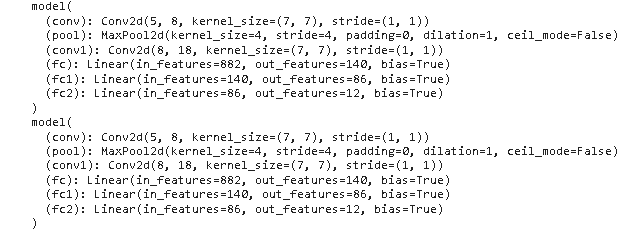
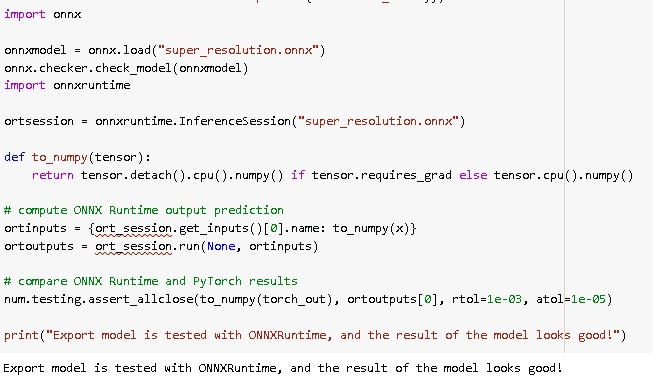

# PyTorch 保存模型–完整指南

> 原文：<https://pythonguides.com/pytorch-save-model/>

[](https://sharepointsky.teachable.com/p/python-and-machine-learning-training-course)

在这个 [Python 教程](https://pythonguides.com/learn-python/)中，我们将学习**如何在 Python 中保存 PyTorch 模型**，我们还将涵盖与保存模型相关的不同示例。此外，我们将涵盖这些主题。

*   PyTorch 保存模型
*   PyTorch 保存模型示例
*   PyTorch 保存模型检查点
*   PyTorch 保存模型架构
*   PyTorch 保存模型用于推理
*   PyTorch 在培训期间保存模型
*   PyTorch 将模型保存到 onnx

目录

[](#)

*   [指针保存模型](#PyTorch_save_model "PyTorch save model ")
*   [PyTorch 保存模型示例](#PyTorch_save_model_Example "PyTorch save model Example")
*   [PyTorch 保存模型检查点](#PyTorch_save_model_checkpoint "PyTorch save model checkpoint")
*   [PyTorch 保存模型架构](#PyTorch_save_model_architecture "PyTorch save model architecture")
*   [PyTorch 保存用于推理的模型](#PyTorch_save_the_model_for_inference "PyTorch save the model for inference")
*   [PyTorch 在训练期间保存模型](#PyTorch_save_the_model_during_training "PyTorch save the model during training")
*   [PyTorch 将模型保存到 onnx](#PyTorch_save_the_model_to_onnx "PyTorch save the model to onnx")

## 指针保存模型

在这一节中，我们将学习**如何在 Python 中保存 [PyTorch](https://pythonguides.com/what-is-pytorch/) 模型**。

*   **PyTorch 保存模型**用于保存多个组件，也用于在 **torch.save()** 函数的帮助下序列化字典中的组件。
*   保存功能用于检查模型的连续性，即保存后模型是如何保存的。

**代码:**

在使用 Pytorch 保存模型功能之前，我们想通过下面的命令安装 torch 模块。

```
pip install torch
```

安装完手电筒模块后，还需要在此命令的帮助下安装触摸视觉模块。

```
pip install torchvision
```


PyTorch save model torchversion module

安装好所有东西后，PyTorch saves 模型的代码就可以顺利运行了。

*   **torch model = model . vgg 16(pre trained = True)**用于建立模型。
*   **torch . save(torch model . state _ dict()，' torchmodel_weights.pth')** 用于保存 PyTorch 模型。
*   **state_dic()** 函数定义为 python 字典，将每一层映射到其参数张量。

```
import torch
import torchvision.models as model
torchmodel = model.vgg16(pretrained=True)
torch.save(torchmodel.state_dict(), 'torchmodel_weights.pth')
```


PyTorch save model path

另外，检查:[使用 Python 的机器学习](https://pythonguides.com/machine-learning-using-python/)

## PyTorch 保存模型示例

在这一节中，我们将学习**如何保存 PyTorch 模型，并借助 Python 中的示例**进行解释。

*   PyTorch 保存功能用于保存多个组件，并将所有组件排列到一个字典中。
*   **torch.save()** 函数用于将组件保存并排列到字典中。

**代码:**

在下面的代码中，我们将导入一些 torch 库，通过制作模型并在制作后保存它来训练分类器。

*   **model = TheModelClass()** 用于初始化模型。
*   优化器=优化。SGD(model.parameters()，lr=0.001，momentum=0.8) 用于初始化优化器。
*   **print("模型的 state_dict:")** 用于打印 state_dict。
*   **state_dict** 定义为 python 字典，将每一层映射到其参数张量。
*   **print("优化器的 state_dict:")** 用于打印优化器的 state_dict。
*   **torch.save(model.state_dict()，' model_weights.pth')** 用于保存模型。

```
import torch
import torch.nn as nn
import torch.optim as optimize 
**# Define model**
class TheModelClass(nn.Module):
    def __init__(self):
        super(TheModelClass, self).__init__()
        self.conv = nn.Conv2d(4, 7, 6)
        self.pool = nn.MaxPool2d(3, 3)
        self.conv1 = nn.Conv2d(7, 17, 6)
        self.fc1 = nn.Linear(17 * 5 * 5, 120)
        self.fc2 = nn.Linear(120, 84)
        self.fc3 = nn.Linear(84, 10)

    def forward(self, X):
        X = self.pool(F.relu(self.conv(X)))
        X = self.pool(F.relu(self.conv1(X)))
        X = X.view(-1, 17 * 5 * 5)
        X = F.relu(self.fc1(X))
        X = F.relu(self.fc2(X))
        X = self.fc3(X)
        return X_train_gray

model = TheModelClass()

optimizer = optimize.SGD(model.parameters(), lr=0.001, momentum=0.8)

print("Model's state_dict:")
for param_tensor in model.state_dict():
    print(param_tensor, "\t", model.state_dict()[param_tensor].size())

print("Optimizer's state_dict:")
for var_name in optimizer.state_dict():
    print(var_name, "\t", optimizer.state_dict()[var_name])
torch.save(model.state_dict(), 'model_weights.pth')
```

**输出:**

运行上述代码后，我们得到以下输出，从中可以看到我们可以训练一个分类器，并在训练后保存模型。


PyTorch save model

阅读: [PyTorch nn 线性+例题](https://pythonguides.com/pytorch-nn-linear/)

## PyTorch 保存模型检查点

在本节中，我们将学习如何在 Python 中保存 PyTorch 模型检查点。

*   PyTorch 保存模型检查点用于借助 torch.save()函数保存多个检查点。
*   torch.save()函数也用于定期设置字典。

**代码:**

在下面的代码中，我们将导入 torch 模块，从中我们可以保存模型检查点。

*   **nn。Conv2d()** 用于定义从输入产生输出的神经网络。
*   self.pool() 被定义为用于存储实例的类似字典的结构。
*   优化器=优化。SGD(net1.parameters()，lr=0.001，momentum=0.9) 用于初始化优化器。
*   **torch.save()** 用于保存 PyTorch 模型。

```
import torch
import torch.nn as nn
import torch.optim as optimize
class Net(nn.Module):
    def __init__(self):
        super(Net, self).__init__()
        self.conv = nn.Conv2d(5, 8, 7)
        self.pool = nn.MaxPool2d(4, 4)
        self.conv1 = nn.Conv2d(8, 18, 7)
        self.fc = nn.Linear(18 * 7 * 7, 140)
        self.fc1 = nn.Linear(140, 86)
        self.fc2 = nn.Linear(86, 12)

    def forward(self, X):
        X = self.pool(F.relu(self.conv(X)))
        X = self.pool(F.relu(self.conv1(X)))
        X = X.view(-1, 18 * 7 * 7)
        X = F.relu(self.fc(X))
        X = F.relu(self.fc1(X))
        X = self.fc2(x)
        return X

net1 = Net()
print(net1)
optimizer = optimize.SGD(net1.parameters(), lr=0.001, momentum=0.9)

EPOCH = 5
PATH = "model.pt"
LOSS = 0.4

torch.save({
            'epoch': EPOCH,
            'model_state_dict': net1.state_dict(),
            'optimizer_state_dict': optimizer.state_dict(),
            'loss': LOSS,
            }, PATH)
```

**输出:**

运行上述代码后，我们得到以下输出，其中我们可以看到，在使用 **save()** 函数保存检查点模型后，多个检查点被打印在屏幕上。


PyTorch save model checkpoint

阅读:[交叉熵损失 PyTorch](https://pythonguides.com/cross-entropy-loss-pytorch/)

## PyTorch 保存模型架构

在这一节中，我们将学习如何在 python 中保存 PyTorch 模型架构。

Pytorch 保存模型建筑被定义为设计一个结构在其他我们可以说是建造一个建筑。

**代码:**

在下面的代码中，我们将导入一些有助于运行代码和保存模型的库。

*   **use _ cuda = torch . cuda . is _ available()**用于 CUDA 张量类型， **available()** 函数用于确定 CUDA 是否支持我们的系统。
*   **torch.save(state，fpath)** 用于保存模型。
*   **shutil.copyfile(fpath，bestfpath)** 用于将文件复制到给定的最佳部分。

```
import matplotlib.pyplot as plot
import torch
import shutil
from torch import nn
from torch import optim
import torch.nn.functional as F
from torchvision import datasets, transforms
import numpy as num
use_cuda = torch.cuda.is_available()
def savemodel(state, is_best, checkpointpath, bestmodel_path):

    fpath = checkpointpath
    torch.save(state, fpath)
    **# if it is a best model, min validation loss**
    if is_best:
        bestfpath = bestmodel_path

        shutil.copyfile(fpath, bestfpath)
```

保存模型后，我们可以加载模型以检查最佳拟合模型。

*   **model check point = torch . load(check point fpath)**用于加载检查点。
*   **model . load _ state_dict(model check point[' state _ dict '])**用于初始化从检查点到模型的 state _ dict。
*   **optimizer . load _ state _ dict(model check point[' optimizer '])**用于初始化优化器。
*   **valid_loss_min = model check point[' valid _ loss _ min ']**用于从检查点初始化 valid _ loss _ min。
*   **返回模型，优化器，模型检查点['epoch']，valid_loss_min.item()** 用于返回模型。

```
def load_model(checkpointfpath, model, optimizer):

    modelcheckpoint = torch.load(checkpointfpath)

    model.load_state_dict(modelcheckpoint['state_dict'])

    optimizer.load_state_dict(modelcheckpoint['optimizer'])
    valid_loss_min = modelcheckpoint['valid_loss_min']

    return model, optimizer, modelcheckpoint['epoch'], valid_loss_min.item()
```

加载模型后，我们希望导入数据并创建数据加载器。

*   **转换数据=转换。撰写([转换。ToTensor()，转换。Normalize((0.5，0.5，0.5)，(0.5，0.5)，0.5))])** 用于定义一个转换来规范化数据。
*   **训练集=数据集。fashion mnist(' F _ MNIST _ 数据/'，download=True，train=True，transform=transformdata)** 用于下载加载训练数据。
*   **loaders = { ' train ':torch . utils . data . data loader(trainset，batch_size = 64，shuffle=True)，' test ':torch . utils . data . data loader(testset，batch_size = 64，shuffle=True)，}** 用于加载数据加载器。

```
 transformdata = transforms.Compose([transforms.ToTensor(),
                                transforms.Normalize((0.5, 0.5, 0.5), (0.5, 0.5, 0.5))])
# Download and load the training data
train_set = datasets.FashionMNIST('F_MNIST_data/', download=True, train=True, transform=transformdata)

test_set = datasets.FashionMNIST('F_MNIST_data/', download=True, train=False, transform=transformdata)

loaders = {
    'train' : torch.utils.data.DataLoader(trainset,batch_size = 64,shuffle=True),
    'test'  : torch.utils.data.DataLoader(testset,batch_size = 64,shuffle=True),
}
```

在下面的代码中，我们将定义函数并创建模型的架构。

*   **model = fashion _ Classifier()**用于创建网络和定义优化器。
*   **model.cuda()** 当 cuda 可以将模型移动到 GPU 时使用。

```
**# Define your network** 
class fashion_Classifier(nn.Module):
    def __init__(self):
        super().__init__()
        input_size = 784
        self.fc = nn.Linear(input_size, 514)
        self.fc1 = nn.Linear(514, 258)
        self.fc2 = nn.Linear(258, 130)
        self.fc3 = nn.Linear(130, 66)
        self.fc4 = nn.Linear(66,12)
        self.dropout = nn.Dropout(p=0.2)

    def forward(self, X):
        X = X.view(X.shape[0], -1)
        X = self.dropout(F.relu(self.fc1(X)))
        X = self.dropout(F.relu(self.fc2(X)))
        X = self.dropout(F.relu(self.fc3(X)))
        X = self.dropout(F.relu(self.fc4(X)))
        X = F.log_softmax(self.fc5(X), dim=1)
        return X_train_prepared

model = fashion_Classifier()

if use_cuda:
    model = model.cuda()

print(model)
```


PyTorch save model architecture

阅读: [Adam optimizer PyTorch 示例](https://pythonguides.com/adam-optimizer-pytorch/)

## PyTorch 保存用于推理的模型

在这一节中，我们将学习 python 中的 **PyTorch 保存推理模型**。

*   PyTorch 将推理模型定义为得出证据和推理的结论。
*   **火炬。Save()** 函数用于保存模型并在字典中排列组件。

**代码:**

在下面的代码中，我们将导入一些库，从中我们可以保存模型推理。

*   优化器=优化。SGD(net.parameters()，lr=0.001，momentum=0.9) 用于初始化优化器。
*   **PATH = " state _ dict _ model . pt "**用于指定路径。
*   **torch.save(net.state_dict()，PATH)** 用于保存模型。
*   **models . load _ state _ dict(torch . load(PATH))**用于加载模型。
*   **PATH = "entire_model.pt"** 用于指定路径。

```
import torch
import torch.nn as nn
import torch.optim as optimizer
import torch.nn.functional as f
class model(nn.Module):
    def __init__(self):
        super(model, self).__init__()
        self.conv = nn.Conv2d(5, 8, 7)
        self.pool = nn.MaxPool2d(4, 4)
        self.conv1 = nn.Conv2d(8, 18, 7)
        self.fc = nn.Linear(18 * 7 * 7, 140)
        self.fc1 = nn.Linear(140, 86)
        self.fc2 = nn.Linear(86, 12)

    def forward(self, X):
        X = self.pool(f.relu(self.conv(X)))
        X = self.pool(f.relu(self.conv1(X)))
        X = X.view(-3, 17 * 7 * 7)
        X = f.relu(self.fc(X))
        X = f.relu(self.fc1(X))
        X = self.fc2(X)
        return X

net = model()
print(net)
optimizer = optimize.SGD(net.parameters(), lr=0.001, momentum=0.9)
PATH = "state_dict_model.pt"
torch.save(net.state_dict(), PATH)

models = model()
models.load_state_dict(torch.load(PATH))
models.eval()
PATH = "entire_model.pt"
torch.save(net, PATH)
models = torch.load(PATH)
models.eval()
```

**输出:**

运行上面的代码后，我们得到了下面的输出，从中我们可以看到模型的推断。



PyTorch save the model for inference

阅读: [PyTorch 负载模型+示例](https://pythonguides.com/pytorch-load-model/)

## PyTorch 在训练期间保存模型

在本节中，我们将学习如何在 python 中训练期间保存 **PyTorch 模型。**

PyTorch 模型在训练期间借助 **torch.save()** 函数进行保存。保存函数后，我们可以加载模型并训练模型。

**代码:**

在下面的代码中，我们将导入一些用于训练模型的库。在训练过程中，我们可以保存模型。

*   **torch.save(Cnn，PATH)** 用于保存模型。
*   **bs，_，_，_ = X.shape** 用于获取批量。
*   **X = f.adaptive_avg_pool2d(X，1)。reshape(bs，-1)** 用于重塑模型。
*   **traindata =数据集。CIFAR10()** 用于训练模型。
*   valdata =数据集。CIFAR10() 用于验证数据。

```
import torch.nn as nn
import torch.nn.functional as f
**# model**
class Cnn(nn.Module):
    def __init__(self):
        super(Cnn, self).__init__()
        self.conv = nn.Conv2d(in_channels=5, out_channels=66, kernel_size=7, padding=1)
        self.conv1 = nn.Conv2d(in_channels=66, out_channels=66, kernel_size=7, padding=1)
        self.conv2 = nn.Conv2d(in_channels=66, out_channels=130, kernel_size=7, padding=1)
        self.pool = nn.MaxPool2d(5, 4)
        self.dropout = nn.Dropout2d(0.7)
        self.fc = nn.Linear(in_features=130, out_features=1000)
        self.fc1 = nn.Linear(in_features=1000, out_features=10)
    def forward(self, X):
        X = f.relu(self.conv1(X))
        X = self.dropout(X)
        X = self.pool(X)
        X = f.relu(self.conv2(X))
        x = self.pool(X)
        x = f.relu(self.conv3(X))
        x = self.pool(X)
        bs, _, _, _ = X.shape
        X = f.adaptive_avg_pool2d(X, 1).reshape(bs, -1)
        X = F.relu(self.fc1(X))
        X = self.dropout(X)
        out = self.fc2(X)
        return out
torch.save(Cnn,PATH)
from torchvision import datasets
from torchvision.transforms import transforms
**# define transforms**
transformtrain = transforms.Compose([
            transforms.RandomCrop(34, padding=6),
            transforms.RandomHorizontalFlip(),
            transforms.ToTensor(),
            transforms.Normalize((0.4916, 0.4824, 0.4467), 
                                 (0.2025, 0.1996, 0.2012)),
        ])
transformval = transforms.Compose([
    transforms.ToTensor(),
    transforms.Normalize((0.4916, 0.4824, 0.4467), 
                         (0.2025, 0.1996, 0.2012)),
])
**# train and validation data**
traindata = datasets.CIFAR10(
    root='../input/data',
    train=True,
    download=True,
    transform=transformtrain
)
valdata = datasets.CIFAR10(
    root='../input/data',
    train=False,
    download=True,
    transform=transformval
)
```

**输出:**

运行上面的代码后，我们得到下面的输出，我们可以看到屏幕上正在下载训练数据。


PyTorch save model during training

阅读: [PyTorch 预训练模型](https://pythonguides.com/pytorch-pretrained-model/)

## PyTorch 将模型保存到 onnx

在本节中，我们将了解 PyTorch 如何用 Python 将模型保存到 onnx 中。

*   ONNX 被定义为一个开放的神经网络交换，它也被称为神经网络交换的开放容器格式。
*   在这里，我们将模型转换成 ONNX 格式，并使用 ONNX 运行时运行该模型。

**代码:**

在下面的代码中，我们将导入一些库，从这些库中我们可以将模型保存到 onnx。

*   **torch _ model = SuperResolutionmodel(upscale _ factor = 3)**用于创建超分辨率模型。
*   **modelurl = ' https://S3 . amazonaws . com/py torch/test _ data/export/super RES _ epoch 100-44c 6958 e . PTH '**用于加载模型重量。
*   **torch _ model . load _ state _ dict(model zoo . load _ URL(model URL，map_location=maplocation))** 用于用相关权重初始化模型。
*   **torch_model.eval()** 用于设置模型。

```
 import io
import numpy as num

from torch import nn
import torch.utils.model_zoo as modelzoo
import torch.onnx

import torch.nn as nn
import torch.nn.init as init

class SuperResolutionmodel(nn.Module):
    def __init__(self, upscale_factor, inplace=False):
        super(SuperResolutionmodel, self).__init__()

        self.relu = nn.ReLU(inplace=inplace)
        self.conv1 = nn.Conv2d(1, 64, (5, 5), (1, 1), (2, 2))
        self.conv2 = nn.Conv2d(64, 64, (3, 3), (1, 1), (1, 1))
        self.conv3 = nn.Conv2d(64, 32, (3, 3), (1, 1), (1, 1))
        self.conv4 = nn.Conv2d(32, upscale_factor ** 2, (3, 3), (1, 1), (1, 1))
        self.pixel_shuffle = nn.PixelShuffle(upscale_factor)

        self._initialize_weights()

    def forward(self, X):
        X = self.relu(self.conv1(X))
        X = self.relu(self.conv2(X))
        X = self.relu(self.conv3(X))
        X = self.pixel_shuffle(self.conv4(X))
        return X

    def _initialize_weights(self):
        init.orthogonal_(self.conv1.weight, init.calculate_gain('relu'))
        init.orthogonal_(self.conv2.weight, init.calculate_gain('relu'))
        init.orthogonal_(self.conv3.weight, init.calculate_gain('relu'))
        init.orthogonal_(self.conv4.weight)

torch_model = SuperResolutionmodel(upscale_factor=3)

modelurl = 'https://s3.amazonaws.com/pytorch/test_data/export/superres_epoch100-44c6958e.pth'
batch_size = 1   

maplocation = lambda storage, loc: storage
if torch.cuda.is_available():
    map_location = None
torch_model.load_state_dict(modelzoo.load_url(modelurl, map_location=maplocation))

torch_model.eval()
```


PyTorch save the model to ONNX

*   **X = torch.randn(batch_size，1，224，224，requires_grad=True)** 用作模型的输入。
*   **torch.onnx.export()** 用于导出模型。
*   **ort inputs = { ort _ session . get _ inputs()[0]。name: to_numpy(x)}** 用于计算 onnx 运行时的输出预测。
*   **print("导出模型用 ONNXRuntime 测试，模型的结果看起来不错！")**用于打印模型结果。

```
X = torch.randn(batch_size, 1, 224, 224, requires_grad=True)
torch_out = torch_model(x)

torch.onnx.export(torch_model,               
                  x,                         
                  "super_resolution.onnx",  
                  export_params=True,    
                  opset_version=10,          
                  do_constant_folding=True,  
                  input_names = ['input'],  
                  output_names = ['output'], 
                  dynamic_axes={'input' : {0 : 'batch_size'},   
                                'output' : {0 : 'batch_size'}})
import onnx

onnxmodel = onnx.load("super_resolution.onnx")
onnx.checker.check_model(onnxmodel)
import onnxruntime

ortsession = onnxruntime.InferenceSession("super_resolution.onnx")

def to_numpy(tensor):
    return tensor.detach().cpu().numpy() if tensor.requires_grad else tensor.cpu().numpy()

ortinputs = {ort_session.get_inputs()[0].name: to_numpy(x)}
ortoutputs = ort_session.run(None, ortinputs)

**# compare ONNX Runtime and PyTorch results**
num.testing.assert_allclose(to_numpy(torch_out), ortoutputs[0], rtol=1e-03, atol=1e-05)

print("Export model is tested with ONNXRuntime, and the result of the model looks good!")
```



PyTorch save model tested with ONNX runtime

因此，在本教程中，我们讨论了 **PyTorch 保存模型**,我们还讨论了与其实现相关的不同示例。这是我们已经讨论过的例子列表。

*   PyTorch 保存模型
*   PyTorch 保存模型示例
*   PyTorch 保存模型检查点
*   PyTorch 保存模型架构
*   PyTorch 保存模型用于推理
*   PyTorch 在培训期间保存模型
*   PyTorch 将模型保存到 onnx

[Bijay Kumar](https://pythonguides.com/author/fewlines4biju/)

Python 是美国最流行的语言之一。我从事 Python 工作已经有很长时间了，我在与 Tkinter、Pandas、NumPy、Turtle、Django、Matplotlib、Tensorflow、Scipy、Scikit-Learn 等各种库合作方面拥有专业知识。我有与美国、加拿大、英国、澳大利亚、新西兰等国家的各种客户合作的经验。查看我的个人资料。

[enjoysharepoint.com/](https://enjoysharepoint.com/)[](https://www.facebook.com/fewlines4biju "Facebook")[](https://www.linkedin.com/in/fewlines4biju/ "Linkedin")[](https://twitter.com/fewlines4biju "Twitter")