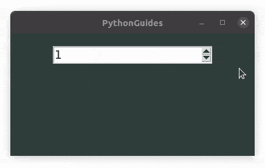
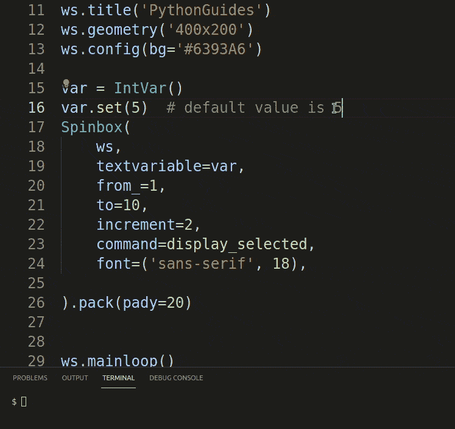
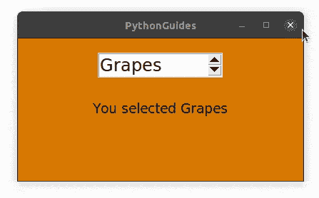
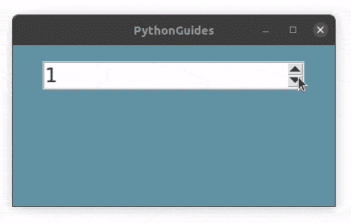
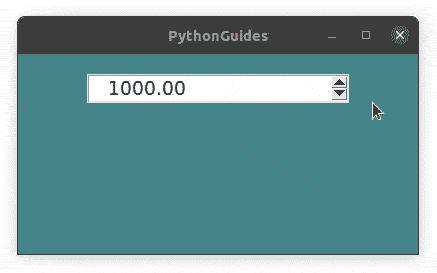
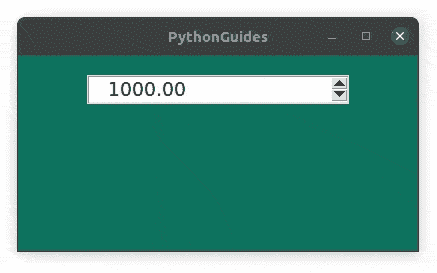
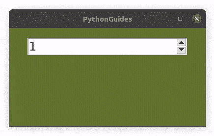
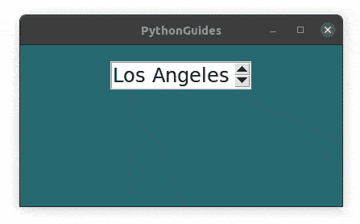

# python Tkinter spin box–如何使用

> 原文：<https://pythonguides.com/python-tkinter-spinbox/>

[](https://sharepointsky.teachable.com/p/python-and-machine-learning-training-course)

在这个 [Tkinter 教程](https://pythonguides.com/python-gui-programming/)中，我们将学习 **Python Tkinter Spinbox 小部件**。我们还涵盖了以下主题列表。

*   Python Tkinter Spinbox
*   Python Tkinter Spinbox 验证
*   python tkinter spinox set value(python tkinter spinox 设定值)
*   Python Tkinter Spinbox 命令
*   Python Tkinter Spinbox 获取值
*   Python Tkinter Spinbox 绑定
*   Python Tkinter Spinbox 事件
*   Python Tkinter Spinbox 格式
*   Python Tkinter Spinbox Increment
*   Python Tkinter Spinbox 文本变量

目录

[](#)

*   [Python Tkinter Spinbox](#Python_Tkinter_Spinbox "Python Tkinter Spinbox")
*   [Python Tkinter Spinbox 验证](#Python_Tkinter_Spinbox_Validate "Python Tkinter Spinbox Validate")
*   [python tkinter spinbox set valu](#Python_Tkinter_Spinbox_Set_Valu "Python Tkinter Spinbox Set Valu")
*   [Python Tkinter Spinbox 命令](#Python_Tkinter_Spinbox_Command "Python Tkinter Spinbox Command")
*   [Python Tkinter Spinbox 获取值](#Python_Tkinter_Spinbox_Get_Value "Python Tkinter Spinbox Get Value")
*   [Python Tkinter Spinbox 绑定](#Python_Tkinter_Spinbox_Bind "Python Tkinter Spinbox Bind")
*   [Python Tkinter Spinbox 事件](#Python_Tkinter_Spinbox_Event "Python Tkinter Spinbox Event")
*   [Python Tkinter Spinbox 格式](#Python_Tkinter_Spinbox_Format "Python Tkinter Spinbox Format")
*   [Python Tkinter Spinbox Increment](#Python_Tkinter_Spinbox_Increment "Python Tkinter Spinbox Increment")
*   [Python Tkinter Spinbox 文本变量](#Python_Tkinter_Spinbox_Textvariable "Python Tkinter Spinbox Textvariable")

## Python Tkinter Spinbox

Python Tkinter Spinbox 小部件是一种具有一些高级功能的入口小部件。在这一节中，我们将探索 Python Tkinter Spinbox 的所有潜力。

*   Python Tkinter Spinbox 是一种带有上下箭头的入口小部件。
*   数据范围可以放在微调框内，用户可以使用上下箭头导航。
*   此外，用户可以像我们在入口小部件中一样输入信息。

**源代码**:

在这段代码中，我们创建了一个简单的 Python Tkinter Spinbox 小部件。

*   Python Tkinter Spinbox 需要值的范围，以便能够显示信息。
*   **from_** 是号码范围的起点，**到**是号码范围的终点。
*   除了从 _ 和**到**的**之外，我们还可以为**值**选项传递信息列表或元组。**
*   示例:值= [1，2，3，4，5，6]

```py
from tkinter import *

ws = Tk()
ws.title('PythonGuides')
ws.geometry('400x200')
ws.config(bg='#31403C')

Spinbox(
    ws,
    from_=1,
    to=10,
    font=('sans-serif', 14), 

).pack(pady=20)

ws.mainloop() 
```

**输出:**

在本例中，将显示 Python Tkinter Spinbox 微件。里面的数据范围从 1 到 10。用户可以点击向上或向下按钮来浏览数据。



Python Tkinter Spinbox

阅读: [Python Tkinter 验证示例](https://pythonguides.com/python-tkinter-validation/)

## Python Tkinter Spinbox 验证

Python Tkinter Spinbox 验证选项允许验证用户输入并避免非标准值。

*   默认情况下，验证设置为无
*   validate 和 validatecommand 是密切相关的两件事。
*   validate 提供了验证的模式，而 validatecommands 触发了函数或者甚至是将要发生的函数。
*   验证模式支持以下选项:

| 集中 | 每当`Entry`小部件获得或失去焦点时进行验证 |
| 集中 | 每当小部件获得焦点时进行验证。 |
| 集中注意力 | 每当小部件失去焦点时进行验证。 |
| 键 | 每当任何击键改变小部件的内容时进行验证。 |
| 全部 | 在上述所有情况下进行验证。 |
| 没有人 | 这是关闭验证的默认选项值。请注意，这是字符串“none”，而不是特殊的 Python 值 None。 |

Validation Mode in Python Tkinter Spinbox

阅读: [Python Tkinter 测验](https://pythonguides.com/python-tkinter-quiz/)

## python tkinter spinbox set valu

在本节中，我们将学习 Python Tkinter Spinbox 集合值。我们将看到如何在 Python Tkinter Spinbox 中设置一个值。

*   Python Tkinter Spinbox 接受从 _ 、**到**或**列表**和**元组**形式的值范围。
*   如果提供了 from_ 则它成为默认值
*   在列表和元组的情况下，第 0 个索引的值成为 Python Tkinter Spinbox 中的第一个值。
*   **set()**Python 中的函数 Tkinter Spinbox 是用来自定义默认值的。
*   Set()函数应用于 textvariable 或用于存储 Python Tkinter Spinbox 的变量。
*   在我们的例子中，您会注意到 Python Tkinter Spinbox 将显示默认值。

**源代码:**

在本例中，我们使用 set()函数在 Python Tkinter Spinbox 中设置默认值。

*   set()函数应用于 textvariable。

```py
from tkinter import *

def display_selected():
    Label(
        text=f'You selected {var.get()}', 
        font=('sans-serif', 14),
        bg='#6393A6'
        ).pack()

ws = Tk()
ws.title('PythonGuides')
ws.geometry('400x200')
ws.config(bg='#6393A6')

var = IntVar()
var.set(7)  # default value is 5
Spinbox(
    ws,
    textvariable=var,
    from_=1,
    to=10,
    increment=2,
    command=display_selected,
    font=('sans-serif', 18), 

).pack(pady=20)

ws.mainloop() 
```

**输出:**

在这个例子中，我们演示了如何在 Python Tkinter 中设置默认值。您可以看到，首先，我们将默认值设置为 5，然后我们将其更改为 7。每次应用程序启动时，它都有分配的默认值。



Python Tkinter Spinbox Set Value

阅读: [Python tkinter 标签](https://pythonguides.com/python-tkinter-label/)

## Python Tkinter Spinbox 命令

在本节中，我们将学习 Python Tkinter Spinbox 命令。

*   使用 Python Tkinter Spinbox 时，当用户单击 Python Tkinter Spinbox 上的向上或向下键时，应该会发生一些事情。
*   函数保存活动的信息，这些函数使用 Python Tkinter Spinbox 命令中的选项“command”绑定。
*   在我们的例子中，我们将在用户每次点击 Python Tkinter Spinbox 的向上或向下键时显示所选择的值。

**源代码**:

在本例中，我们使用 Python Tkinter Spinbox 小部件创建了一个简单的应用程序。

*   该应用程序有一个水果列表，可以使用 Python Tkinter Spinbox 小部件访问每个水果的名称。
*   每当用户点击向上或向下的箭头，功能被触发。使用选项“命令”分配该功能。
*   在我们的例子中，我们创建了一个函数 display_selected()，并在命令选项中传递了这个名称。

```py
from tkinter import *

def display_selected():
    msg.config(
        text=f'You selected {var.get()}', 
        font=('sans-serif', 14),
        bg='#D97904'
        )

ws = Tk()
ws.title('PythonGuides')
ws.geometry('400x200')
ws.config(bg='#D97904')

var = StringVar()
Spinbox(
    ws,
    textvariable=var,
    value=['Grapes', 'Banana', 'Mango', 'Blueberries'],
    increment=2,
    width=10,
    command=display_selected,
    font=('sans-serif', 18), 

).pack(pady=20)

msg = Label(
    ws,
    text='',
    bg='#D97904'
)
msg.pack(pady=10)

ws.mainloop() 
```

**输出:**

在这个输出中，水果列表作为 Python Tkinter Spinbox 小部件中的一个值被传递。每次用户切换到新水果时，都会显示一条带有所选水果名称的消息。



Python Tkinter Spinbox command

阅读: [Python Tkinter 条目](https://pythonguides.com/python-tkinter-entry/)

## Python Tkinter Spinbox 获取值

在本节中，我们将了解 Python Tkinter Spinbox Get Value。

*   **Get()** 函数用于从用户提供的小部件中获取值。
*   默认情况下，获取的值是字符串类型，但可以转换为其他数据类型。
*   使用 **Get()** 函数，我们可以获取用户在 Python Tkinter Spinbox 中选择的值。
*   在我们的示例中，我们将获取用户选择的值，并使用 Python Tkinter 标签小部件显示它。

**源代码:**

```py
from tkinter import *

def display_selected():
    Label(
        text=f'You selected {var.get()}', 
        font=('sans-serif', 14),
        bg='#6393A6'
        ).pack()

ws = Tk()
ws.title('PythonGuides')
ws.geometry('400x200')
ws.config(bg='#6393A6')

var = IntVar()
Spinbox(
    ws,
    textvariable=var,
    from_=1,
    to=10,
    increment=2,
    command=display_selected,
    font=('sans-serif', 18), 

).pack(pady=20)

ws.mainloop() 
```

**输出:**

在本例中，我们使用了 **get()** 方法从 Python Tkinter Spinbox 小部件获取值，并使用 Python Tkinter Label 小部件显示所选值。



Python Tkinter Spinbox Get Value

阅读: [Python Tkinter 按钮](https://pythonguides.com/python-tkinter-button/)

## Python Tkinter Spinbox 绑定

Python Tkinter 支持“绑定”特性，该特性允许将事件与小部件绑定。在本节中，我们将学习 Python Tkinter Spinbox 绑定。

*   Bind 有三个组件:`Spinbox.bind(event_name, handler, add=None)`
    *   **event_name** 是将触发处理程序的活动。事件可以是按钮或任何其他外围设备的按压、释放、运动等。
    *   **处理程序**是与事件关联的函数。简而言之，当事件被调用时，处理程序拥有该做什么的信息。
    *   **添加**默认为无。您可以用“+”号代替 None。这将用当前的处理程序替换以前的处理程序。当前处理程序上提供了“+”号。
*   在下一节中，我们已经用一个例子解释了 Bind。

## Python Tkinter Spinbox 事件

事件是发生的任何活动。它可以是按钮点击、释放、动作等。在本节中，我们将了解 Python Tkinter Spinbox 事件。

*   在这种情况下，每个事件都绑定了一些小部件，如 Python Tkinter Spinbox。
*   该事件调用处理程序或函数。简而言之，每次事件发生时，都会有一个活动与之绑定。

**源代码**:

在本例中，我们已经使用 Python Tkinter 创建了基于 GUI 的应用程序，其中每当用户单击箭头时都会显示帐户余额。

*   `sb.bind('<Button-1>', 14)`，这里 **sb** 是赋给 Python Tkinter Spinbox 的变量。
*   **`'<Button-1>'`** 是鼠标左键单击事件。每当用户左击时，这个事件被调用。
*   **disp** 是函数名。

```py
from tkinter import *

ws = Tk()
ws.title('PythonGuides')
ws.geometry('400x200')
ws.config(bg='#45858C')

def disp(event):
    msg.config(text=f'Account Balance: {sb.get()}')

sb = Spinbox(
    ws,
    from_=1000,
    to=100000,
    increment=100,
    format='%10.2f',
    font=('sans-serif', 14)
)
sb.pack(pady=20)
sb.bind('<Button-1>', disp)

msg = Label(
    ws,
    text= '',
    bg='#45858C',
    font=('sans-serif', 14)
)
msg.pack(pady=10)

ws.mainloop() 
```

**输出:**

在本例中，每次用户单击箭头时都会调用一个事件。该函数显示账户余额。每当用户单击箭头时，它就会增加或减少。请注意，如果用户按住箭头，Python Tkinter Spinbox 中的值会发生变化，但 Python Tkinter 标签小部件中的值保持不变。这是因为该事件仅在单击时调用。



Python Tkinter Spinbox Event

阅读: [Python Tkinter 单选按钮](https://pythonguides.com/python-tkinter-radiobutton/)

## Python Tkinter Spinbox 格式

Python Tkinter spinbox 提供了一个格式选项，使用该选项可以为数值分配任何格式。

*   在处理货币数据库时，您希望将货币值设置为 1000.00 格式，那么您可以使用 Python Tkinter Spinbox 中的格式选项。
*   这里 1000 可以是任何值，但是您希望在任何值之后提供. 00。
*   为此，只需使用这个代码 **`fomat='%10.2f'`** ，这里 10 是位置值，2 是点后零的数量。
*   这里有一个例子来说明给定的情况。

```py
from tkinter import *

ws = Tk()
ws.title('PythonGuides')
ws.geometry('400x200')
ws.config(bg='#296B73')

Spinbox(
    ws,
    from_=1000,
    to=100000,
    increment=100,
    format='%10.2f',
    font=('sans-serif', 14)
).pack(pady=20)

ws.mainloop() 
```

**输出:**

在本例中，我们使用了 Python Tkinter Spinbox 小部件中的 format 选项。您可以看到，在每个值的点之后添加了两个零。



Python Tkinter Spinbox Format

阅读: [Python Tkinter Checkbutton](https://pythonguides.com/python-tkinter-checkbutton/)

## Python Tkinter Spinbox Increment

在这一节中，我们将介绍 Python Tkinter Spinbox 增量。我们将学习如何改变增量值。

*   默认情况下，每当用户单击向上箭头时，Python Tkinter Spinbox 就递增 1。
*   要在 Python Tkinter Spinbox 中自定义此功能，需要使用 increment 选项。
*   Python Tkinter Spinbox 将根据 increment 选项中指定的任意值跳转到下一个值。
*   例如，如果开始值是 1，增量值是 2，这意味着 spinbox 将在每次点击向上按钮时跳到 3，5，7，9…n。
*   在我们的例子中，我们展示了同样的内容。

**源代码:**

```py
from tkinter import *

ws = Tk()
ws.title('PythonGuides')
ws.geometry('400x200')
ws.config(bg='#64732F')

Spinbox(
    ws,
    from_=1,
    to=10,
    increment=2,
    font=('sans-serif', 18), 

).pack(pady=20)

ws.mainloop() 
```

**输出:**

在示例中，我们已经演示了 Python Tkinter Spinbox 中的**增量**选项。我们将增量值指定为 2，这意味着每次用户点击向上或向下按钮时，值都会跳 2 个数字。



Python Tkinter Spinbox Increment

阅读: [Python Tkinter 菜单栏](https://pythonguides.com/python-tkinter-menu-bar/)

## Python Tkinter Spinbox 文本变量

在本节中，我们将学习 Python Tkinter spin box text variable。

*   文本变量用于数据不固定的地方。
*   Textvariables 适用于所有小部件，并且适用于所有数据类型。
*   Textvariable 需要分配适当的变量。以下是选项:
    *   **StringVar()** 用于字符串和字符。
    *   **IntVar()** 代表整数(非十进制数)
    *   **BooleanVar()** 代表真或假
    *   **DoubleVar()** 是十进制数
*   小部件可以用它的 textvariable 来控制。在我们的例子中，我们有

```py
from tkinter import *

def display_selected():
    msg.config(
        text=f'You selected {var.get()}', 
        font=('sans-serif', 14),
        bg='#296B73'
        )

ws = Tk()
ws.title('PythonGuides')
ws.geometry('400x200')
ws.config(bg='#296B73')

var = StringVar()
cities = ['Los Angeles', 'Chicago', 'Houston', 'Nashville', 'El Paso', 'Virginia', 'Texas', 'New York']

Spinbox(
    ws,
    textvariable=var,
    value=cities,
    increment=2,
    width=10,
    command=display_selected,
    font=('sans-serif', 18), 

).pack(pady=20)

msg = Label(
    ws,
    text='',
    bg='#296B73'
)
msg.pack(pady=10)

ws.mainloop() 
```

**输出:**

在此输出中，Python Tkinter Spinbox 使用 textvariable 来控制不断变化的标签。因为文本是字符串，所以我们在这种情况下使用 StringVar()。



Python Tkinter Spinbox Textvariable

你可能也喜欢读下面的文章。

*   [Python Tkinter 帧](https://pythonguides.com/python-tkinter-frame/)
*   [Python Tkinter messagebox](https://pythonguides.com/python-tkinter-messagebox/)
*   [如何使用 Python Tkinter 生成工资条](https://pythonguides.com/how-to-generate-payslip-using-python-tkinter/)
*   [Python Tkinter 面板](https://pythonguides.com/python-tkinter-panel/)
*   [Python Tkinter Stopwatch](https://pythonguides.com/python-tkinter-stopwatch/)
*   [Python Tkinter 列表框](https://pythonguides.com/python-tkinter-listbox/)
*   [Python Tkinter 方法后](https://pythonguides.com/python-tkinter-after-method/)

在本教程中，我们已经了解了 **Python Tkinter Spinbox 小部件**。此外，我们已经讨论了这些主题。

*   Python Tkinter Spinbox
*   Python Tkinter Spinbox 验证
*   python tkinter sp box set value(python tkinter sp box 设定值)
*   Python Tkinter Spinbox 命令
*   Python Tkinter Spinbox 获取值
*   Python Tkinter Spinbox 绑定
*   Python Tkinter Spinbox 事件
*   Python Tkinter Spinbox 格式
*   Python Tkinter Spinbox Increment
*   Python Tkinter Spinbox 文本变量

[Bijay Kumar](https://pythonguides.com/author/fewlines4biju/)

Python 是美国最流行的语言之一。我从事 Python 工作已经有很长时间了，我在与 Tkinter、Pandas、NumPy、Turtle、Django、Matplotlib、Tensorflow、Scipy、Scikit-Learn 等各种库合作方面拥有专业知识。我有与美国、加拿大、英国、澳大利亚、新西兰等国家的各种客户合作的经验。查看我的个人资料。

[enjoysharepoint.com/](https://enjoysharepoint.com/)[](https://www.facebook.com/fewlines4biju "Facebook")[](https://www.linkedin.com/in/fewlines4biju/ "Linkedin")[](https://twitter.com/fewlines4biju "Twitter")