# matplotlib set _ yticklabels–实用指南

> 原文：<https://pythonguides.com/matplotlib-set_yticklabels/>

[](https://sharepointsky.teachable.com/p/python-and-machine-learning-training-course)

在本 [Python Matplotlib 教程](https://pythonguides.com/what-is-matplotlib/)中，我们将讨论 Matplotlib 中的**Matplotlib set _ yticklabels**。在这里，我们将介绍使用 matplotlib 与 set_yticklabels 相关的不同示例。我们还将讨论以下主题:

*   Matplotlib set_yticklabels
*   matplot lib set _ yticklabels fontdict
*   matplotlib set _ yticklabels font size
*   matplot lib set _ yticklabels font style
*   Matplotlib set_yticklabels 颜色
*   Matplotlib set_yticklabels 垂直对齐
*   Matplotlib set_yticklabels 水平对齐
*   Matplotlib set_yticklabels 旋转
*   Matplotlib set_yticklabels 不可见
*   Matplotlib set_yticklabels 对齐
*   Matplotlib set_yticklabels minor
*   matplot lib colorbar set _ yticklabels

目录

[](#)

*   [Matplotlib set _ yticklabels](#Matplotlib_set_yticklabels "Matplotlib set_yticklabels")
*   [matplotlib set _ yticklabels fontdict](#Matplotlib_set_yticklabels_fontdict "Matplotlib set_yticklabels fontdict")
*   [matplotlib set _ yticklabels fontsize](#Matplotlib_set_yticklabels_fontsize "Matplotlib set_yticklabels fontsize")
*   [matplotlib set _ yticklabels fontstyle](#Matplotlib_set_yticklabels_fontstyle "Matplotlib set_yticklabels fontstyle")
*   [Matplotlib set _ yticklabels color](#Matplotlib_set_yticklabels_color "Matplotlib set_yticklabels color")
*   [Matplotlib set_yticklabels 垂直对齐](#Matplotlib_set_yticklabels_vertical_alignment "Matplotlib set_yticklabels vertical alignment")
    *   [垂直对齐=‘居中’](#verticalalignmentcenter "verticalalignment=’center’")
    *   [垂直对齐= '顶部'](#verticalalignmenttop "verticalalignment=’top’")
    *   [垂直对齐= '底部'](#verticalalignmentbottom "verticalalignment=’bottom’")
    *   [垂直对齐=‘基线’](#verticalalignmentbaseline "verticalalignment=’baseline’")
    *   [垂直对齐=‘中心 _ 基线’](#verticalalignmentcenter_baseline "verticalalignment=’center_baseline’")
*   [Matplotlib set_yticklabels 水平对齐](#Matplotlib_set_yticklabels_horizontal_alignment "Matplotlib set_yticklabels horizontal alignment")
    *   [水平对齐= '居中'](#horizontalalignmentcenter "horizontalalignment=’center’")
    *   [horizontalalignment= '右'](#horizontalalignmentright "horizontalalignment=’right’")
    *   [水平对齐= '左'](#horizontalalignmentleft "horizontalalignment=’left’")
*   [Matplotlib set_yticklabels 旋转](#Matplotlib_set_yticklabels_rotation "Matplotlib set_yticklabels rotation")
*   [Matplotlib set_yticklabels 不可见](#Matplotlib_set_yticklabels_invisible "Matplotlib set_yticklabels invisible")
*   [matplotlib set _ yticklabels align mnt](#Matplotlib_set_yticklabels_alignemnt "Matplotlib set_yticklabels alignemnt")
*   [Matplotlib set _ yticklabels minor](#Matplotlib_set_yticklabels_minor "Matplotlib set_yticklabels minor")
*   [matplot lib colorable set _ yticklabels](#Matplotlib_colorbar_set_yticklabels "Matplotlib colorbar set_yticklabels")

## Matplotlib set _ yticklabels

在本节中，我们将了解 Python 中 matplotlib 的 axes 模块中的 **set_yticklabels()** 函数。 **set_yticklabels** 函数用于用字符串标签列表设置 y 刻度标签。

**语法如下:**

```py
matplotlib.axes.Axes.set_yticklabels(labels, fontdict=None, minor=False, **kwargs)
```

**以下是参数:**

| **参数** | **值** | **默认** | **描述** |
| 标签 | 字符串列表 |  | 此参数用于指定字符串标签列表。 |
| 丰迪克特 | 词典 | { ' font size ':RC params[' axes . title size ']，' font weight ':RC params[' axes . title weight ']，' verticalalignment' : 'baseline '，' horizontalalignment' : loc} | 此参数用于控制标签的外观。
 |
| 较小的 | 弯曲件 | 错误的 | 指定是否设置次要标签。 |

Parameters

> **警告**
> 
> This method only be used after fixing the tick positions using **Axes.set_yticks**.

**我们来看一个例子:**

```py
**# Import Library**

import numpy as np
import matplotlib.pyplot as plt

**# Create subplot** 
fig, ax = plt.subplots()

**# Define Data**

x = np.linspace(0, 5 * np.pi, 100)
y = np.sin(x)

**# Plot**

ax.plot(x, y)

**# Set ticklabels**

ax.set_yticks([-1 , 0, 1, 2, 3])
ax.set_yticklabels(['Label-1', 'Label-2', 'Label-3', 'Label-4', 'Label-5'])

**# Add fig title**

fig.suptitle('set_yticklabels()function Example', fontweight ="bold")

**# Display**

plt.show()
```

*   在上面的例子中，我们导入了 **numpy** 和 **matplotlib.pyplot** 库。
*   在这之后，我们通过使用 **subplots()** 函数创建一个 subplots。
*   为了定义数据坐标，我们使用 **linespace()** 和 **sin()** 函数。
*   为了绘制 x 和 y 数据坐标之间的图形，我们使用了 **plot()** 函数。
*   要固定 y 轴上的刻度位置，使用 **set_yticks()** 函数。
*   要设置 y 轴上的字符串标签，使用 **set_yticklabels()** 函数。
*   我们使用 **suptitle()** 函数在图上添加 supltilte
*   要在用户屏幕上显示图形，使用 **show()** 功能。

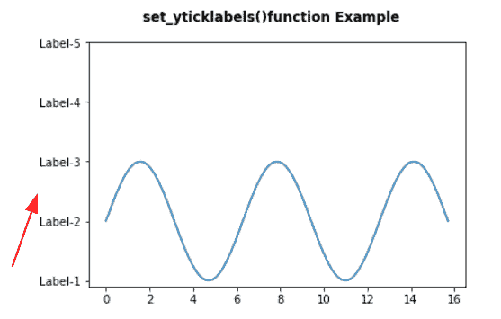

set_yticklabels()

阅读:[将图例放在绘图 matplotlib 之外](https://pythonguides.com/put-legend-outside-plot-matplotlib/)

## matplotlib set _ yticklabels fontdict

我们将学习如何使用 **set_yticklabels** 方法的 **fontdict** 参数。 **fontdict** 参数是一个字典，用于控制 ticklabels 的外观。

**以下是语法:**

```py
matplotlib.axes.Axes.set_yticklabels(labels,fontdict=None) 
```

**我们来看一个例子:**

```py
**# Import Library**

import numpy as np
import matplotlib.pyplot as plt

**# Create subplot** 
fig, ax = plt.subplots()

**# Define Data**

x = np.linspace(0, 5 * np.pi, 150)
y = np.sin(x)

**# Plot**

ax.plot(x, y)

**# font dict** 
font_dict = {'fontsize': 15, 'fontweight': 'bold', 
             'verticalalignment':'top'}

**# Set ticklabels**

ax.set_yticks([-1 , 0, 1])
ax.set_yticklabels(['Label-1', 'Label-2', 'Label-3'], fontdict=font_dict)

**# Add fig title**

fig.suptitle('set_yticklabels fontdict Example', fontweight ="bold")

**# Display** 
plt.show()
```

这里我们将 **fontdict** 参数传递给 **set_yticklabels** 方法。我们创建一个字典 **font_dict** 来用下面的键和值改变刻度标签的外观:

| **键** | **值** |
| --- | --- |
| 字体大小 | Fifteen |
| 字体粗细 | 大胆的 |
| 垂直排列 | 顶端 |

**输出:**

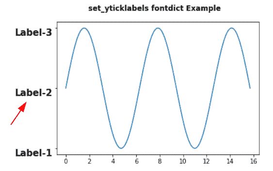

set_yticklabels(fontdict=None)

读取: [Matplotlib 反转 y 轴](https://pythonguides.com/matplotlib-invert-y-axis/)

## matplotlib set _ yticklabels fontsize

这里我们将学习如何改变 y 轴标签的字体大小。为了改变字体的大小，我们将 **fontsize** 参数传递给 **set_yticklabels** 方法。

**以下是语法:**

```py
matplotlib.axes.Axes.set_yticklabels(labels, fontsize=None)
```

**举例:**

```py
**# Import Library**

import numpy as np
import matplotlib.pyplot as plt

**# Create subplot** 
fig, ax = plt.subplots()

**# Define Data**

x = np.linspace(0, 5 * np.pi, 150)
y = np.cos(60*x)

**# Plot**

ax.plot(x, y)

**# Set ticklabels**

ax.set_yticks([-1 , 0, 1])
ax.set_yticklabels(['Label-1', 'Label-2', 'Label-3'],fontsize=20 )

**# Add fig title**

fig.suptitle('set_yticklabels fontsize Example', fontweight ="bold")

**# Display**

plt.show()
```

在上面的例子中，我们通过使用 **set_yticklabels** 方法在 y 轴上设置文本标签，并且传递 **fontsize** 参数来改变 ticklabels 的字体大小。

我们给 fontsize 参数分配一个 **20pt** 的值。

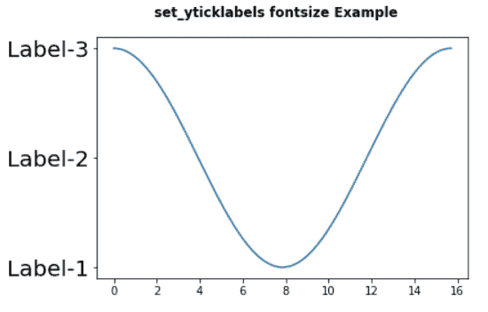

set_yticklabels(fontsize=None)

阅读: [Matplotlib 标题字体大小](https://pythonguides.com/matplotlib-title-font-size/)

## matplotlib set _ yticklabels fontstyle

我们将学习如何改变 y 轴刻度标签的字体样式。为了改变样式，我们将 **fontstyle** 参数传递给 **set_yticklabels** 方法。

**以下是语法:**

```py
matplotlib.axes.Axes.set_yticklabels(labels, fontstyle=None)
```

**我们来看一个例子:**

```py
**# Import Library**

import numpy as np
import matplotlib.pyplot as plt

**# Create subplot**

fig, ax = plt.subplots()

**# Define Data** 
x = np.linspace(0, 250, 250)
y = np.sin(x)

**# Plot**

ax.plot(x, y)

**# Set ticklabels**

ax.set_yticks([-1 , 0, 1])
ax.set_yticklabels(['Label-1', 'Label-2', 'Label-3'],fontstyle='oblique')

**# Add fig title**

fig.suptitle('set_yticklabels fontstyle Example', fontweight ="bold")

**# Display**

plt.show()
```

这里我们改变 y 轴刻度标签的字体样式，并将其设置为**倾斜**。

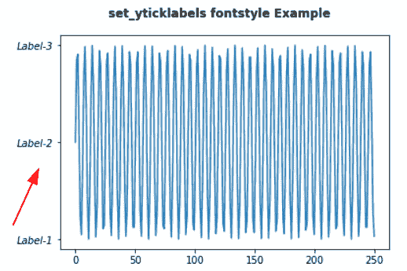

set_yticklabels(fontstyle=’oblique’)

阅读: [Matplotlib 默认图形尺寸](https://pythonguides.com/matplotlib-default-figure-size/)

## Matplotlib set _ yticklabels color

这里我们将学习改变标签的颜色。为了改变颜色，我们将**颜色**参数传递给 **set_yticklabels** 方法。

**以下是语法:**

```py
matplotlib.axes.Axes.set_yticklabels (labels, color=None)
```

**我们来看一个例子:**

```py
**# Import Library**

import numpy as np
import matplotlib.pyplot as plt

**# Create subplot**

fig, ax = plt.subplots()

**# Define Data**

x = np.linspace(0, 250, 250)
y = np.cos(x)

**# Plot**

ax.plot(x, y)

**# Set ticklabels**

ax.set_yticks([-1 , 0, 1])
ax.set_yticklabels(['Value-1', 'Value-2', 'Value-3'], color='green')

**# Add fig title** 
fig.suptitle('set_yticklabels color Example', fontweight ="bold")

**# Display**

plt.show()
```

*   在上面的例子中，我们使用 **linespace()** 和 **cos()** 方法定义数据坐标，并使用 **plot()** 方法绘制它们。
*   之后，我们使用 **set_yticks()** 方法来固定 y 轴上的刻度位置。
*   然后我们使用 **set_yticklabels()** 方法在轴上设置字符串标签。为了改变标签的颜色，我们向该方法传递了一个**颜色**参数。

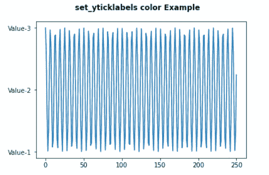

set_yticklabels(color=’green’)

默认情况下，标签的颜色是黑色的，现在我们将其更改为绿色。

读取: [Matplotlib savefig 空白图像](https://pythonguides.com/matplotlib-savefig-blank-image/)

## Matplotlib set_yticklabels 垂直对齐

在这里，我们将学习如何更改 y 轴标签的垂直对齐。为了改变对齐方式，我们将 **verticalalignment** 参数传递给 **set_yticklabels()** 方法。

我们也可以写 **va** 来代替垂直对齐。

**以下是语法:**

```py
matplotlib.axes.Axes.set_yticklabels(labels, verticalalignment = 'center' | 'top' | 'bottom' | 'baseline' | 'center_baseline')
```

**5 种可用的不同垂直校准有:**

*   中心
*   顶端
*   底部
*   基线
*   中心 _ 基线

### 垂直对齐=‘居中’

**举例:**

```py
**# Import Library**

import numpy as np
import matplotlib.pyplot as plt

**# Create subplot** 
fig, ax = plt.subplots()

**# Define Data**

x = np.arange(0, 20, 0.2)
y = np.cos(x)

**# Plot**

ax.plot(x, y)

**# Set ticklabels**

ax.set_yticks([-1 , 0, 1])
ax.set_yticklabels(['Value-1', 'Value-2', 'Value-3'], verticalalignment='center')

**# Add fig title**

fig.suptitle('set_yticklabels va=center Example', fontweight ="bold")

**# Display**

plt.show()
```

*   这里我们使用 **arange()** 和 **cos()** 方法来定义数据坐标。
*   在此之后，我们使用 **plot()** 方法绘制 x 和 y 坐标之间的图形。
*   要设置刻度线，使用 **set_yticks()** 方法。
*   为了设置字符串格式的刻度标签，我们使用了 **set_yticklabels()** 方法。
*   这里我们将刻度标签的**垂直对齐**设置为**中心**。

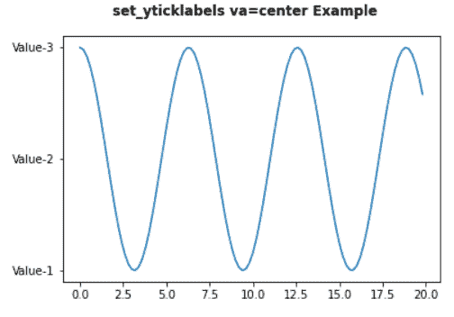

verticalalignment = ‘center’

### 垂直对齐= '顶部'

**举例:**

```py
**# Import Library** 
import numpy as np
import matplotlib.pyplot as plt

**# Create subplot** 
fig, ax = plt.subplots()

**# Define Data**

x = np.arange(0, 20, 0.2)
y = np.cos(x)

**# Plot**

ax.plot(x, y)

**# Set ticklabels** 
ax.set_yticks([-1 , 0, 1])
ax.set_yticklabels(['Value-1', 'Value-2', 'Value-3'], verticalalignment='top')

**# Add fig title**

fig.suptitle('set_yticklabels va=top Example', fontweight ="bold")

**# Display**

plt.show()
```

这里我们将 **verticalalignment** 参数传递给 **set_yticklabels** 方法，以设置 ticklabels 与 **top** 的对齐。

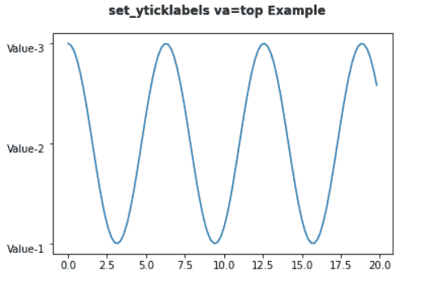

va=’top’

### 垂直对齐= '底部'

**举例:**

```py
**# Import Library**

import numpy as np
import matplotlib.pyplot as plt

**# Create subplot** 
fig, ax = plt.subplots()

**# Define Data**

x = np.arange(0, 20, 0.2)
y = np.cos(x)

**# Plot**

ax.plot(x, y)

**# Set ticklabels**

ax.set_yticks([-1 , 0, 1])
ax.set_yticklabels(['Value-1', 'Value-2', 'Value-3'], verticalalignment='bottom')

**# Add fig title**

fig.suptitle('set_yticklabels va=bottom Example', fontweight ="bold")

**# Display**

plt.show()
```

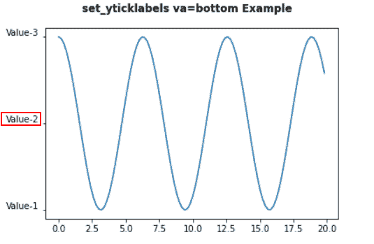

va=bottom

### 垂直对齐=‘基线’

**代码:**

```py
**# Import Library**

import numpy as np
import matplotlib.pyplot as plt

**# Create subplot**

fig, ax = plt.subplots()

**# Define Data** 
x = np.arange(0, 20, 0.2)
y = np.cos(x)

**# Plot**

ax.plot(x, y)

**# Set ticklabels**

ax.set_yticks([-1 , 0, 1])
ax.set_yticklabels(['Value-1', 'Value-2', 'Value-3'], verticalalignment='baseline')

**# Add fig title**

fig.suptitle('set_yticklabels va=baseline Example', fontweight ="bold")

**# Display**

plt.show()
```

这里我们将标签的垂直对齐设置为**基线**。

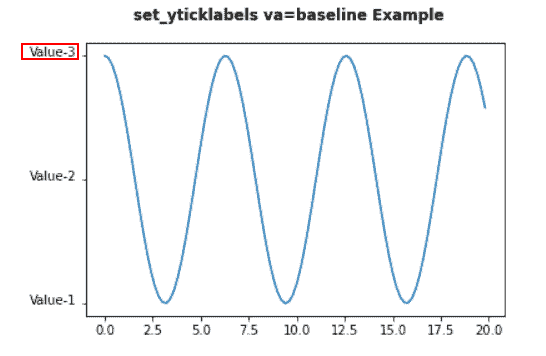

verticalalignment=’baseline’

### 垂直对齐=‘中心 _ 基线’

**代码:**

```py
**# Import Library** import numpy as np
import matplotlib.pyplot as plt

**# Create subplot** 
fig, ax = plt.subplots()

**# Define Data**

x = np.arange(0, 20, 0.2)
y = np.cos(x)

**# Plot**

ax.plot(x, y)

**# Set ticklabels**

ax.set_yticks([-1 , 0, 1])
ax.set_yticklabels(['Value-1', 'Value-2', 'Value-3'], verticalalignment='center_baseline')

**# Add fig title**

fig.suptitle('set_yticklabels va=center_baseline Example', fontweight ="bold")

**# Display**

plt.show()
```

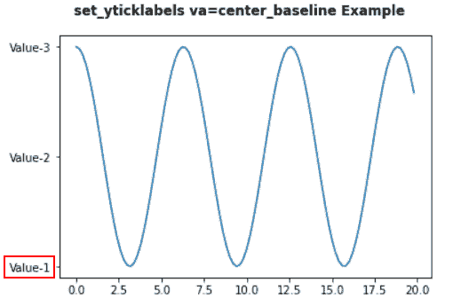

verticalalignment=’center_baseline’

阅读: [Matplotlib 条形图标签](https://pythonguides.com/matplotlib-bar-chart-labels/)

## Matplotlib set_yticklabels 水平对齐

在这里，我们将学习如何更改 y 轴标签的水平对齐。要更改对齐，请将 **horizontalalignment** 参数传递给 **set_yticklabels()** 方法。

你可以写 **ha** 来代替水平对齐。

**以下是语法:**

```py
matplotlib.axes.Axes.set_yticklabels(labels, horizontalalignment= 'center' | 'right' | 'left'
```

**3 种不同的水平校准是:**

*   中心
*   正确
*   左边的

### 水平对齐= '居中'

**代码:**

```py
**# Import Library**

import numpy as np
import matplotlib.pyplot as plt

**# Create subplot**

fig, ax = plt.subplots()

**# Define Data**

x = np.arange(10, 100, 0.25)
y = np.sin(30*x)

**# Plot**

ax.plot(x, y)

**# Set ticklabels**

ax.set_yticks([-1 , 0, 1])
ax.set_yticklabels(['Value-1', 'Value-2', 'Value-3'], horizontalalignment = 'center')

**# Add fig title**

fig.suptitle('set_yticklabels ha=center Example', fontweight ="bold")

**# Display**

plt.show()
```

*   这里我们使用 **arange()** 和 **sin()** 方法来定义数据坐标。
*   在此之后，我们使用 **plot()** 方法绘制 x 和 y 坐标之间的图形。
*   要设置刻度线，使用 **set_yticks()** 方法。
*   为了设置字符串格式的刻度标签，我们使用了 **set_yticklabels()** 方法。
*   这里我们将刻度标签的**水平对齐**设置为**中心**。

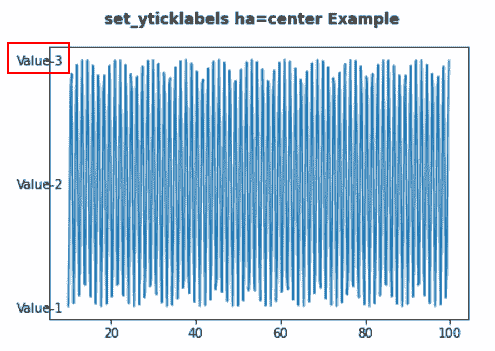

horizontalalignment=’center’

### horizontalalignment= '右'

**举例:**

```py
**# Import Library** 
import numpy as np
import matplotlib.pyplot as plt

**# Create subplot** 
fig, ax = plt.subplots()

**# Define Data** 
x = np.arange(10, 100, 0.25)
y = np.sin(30*x)

**# Plot** 
ax.plot(x, y)

**# Set ticklabels** 
ax.set_yticks([-1 , 0, 1])
ax.set_yticklabels(['Value-1', 'Value-2', 'Value-3'], horizontalalignment = 'right')

**# Add fig title** 
fig.suptitle('set_yticklabels ha=right Example', fontweight ="bold")

**# Display** 
plt.show()
```

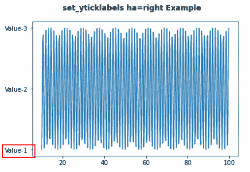

set_yticklabels(horizontalalignemnt=’right’)

### 水平对齐= '左'

这里，我们将 y 轴标签的水平对齐设置为左侧。

**举例:**

```py
**# Import Library** 
import numpy as np
import matplotlib.pyplot as plt

**# Create subplot** 
fig, ax = plt.subplots()

**# Define Data** 
x = np.arange(10, 100, 0.25)
y = np.sin(30*x)

**# Plot** 
ax.plot(x, y)

**# Set ticklabels** 
ax.set_yticks([-1 , 0, 1])
ax.set_yticklabels(['Value-1', 'Value-2', 'Value-3'], horizontalalignment = 'left', fontsize=20)

**# Add fig title** 
fig.suptitle('set_yticklabels ha=left Example', fontweight ="bold")

**# Display** 
plt.show()
```

**输出:**

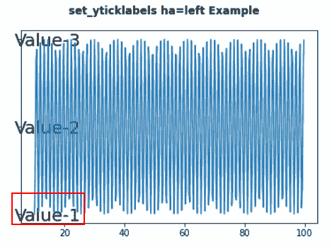

ha=’left’

读取: [Matplotlib 绘图误差线](https://pythonguides.com/matplotlib-plot-error-bars/)

## Matplotlib set_yticklabels 旋转

在这里，我们将学习旋转 y 轴标签。为了改变旋转的角度，我们将**旋转**参数传递给 **set_yticklabels()** 方法。基本上，它用于避免标签重叠。

**以下是语法:**

```py
matplotlib.axes.Axes.set_yticklabels(labels , rotation=None)
```

**我们来看一个例子:**

```py
**# Import Library** 
import numpy as np
import matplotlib.pyplot as plt

**# Create subplot** 
fig, ax = plt.subplots()

**# Define Data** 
x = np.arange(10, 100, 30)
y = np.sin(90*x)

**# Plot** 
ax.plot(x, y)

**# Set ticklabels** 
ax.set_yticks([-1 , 0, 1])
ax.set_yticklabels(['Value-1', 'Value-2', 'Value-3'],rotation=45)

**# Add fig title** 
fig.suptitle('set_yticklabels rotation Example', fontweight ="bold")

**# Display** 
plt.show()
```

*   在上面的例子中，我们使用 **plot()** 方法绘制了一个图形。为了定义数据坐标，我们使用 numpy 的 **arange()** 和 **sin()** 方法。
*   为了在这里旋转 ticklabels，我们使用带有**旋转**参数的 **set_yticklabels()** 方法。

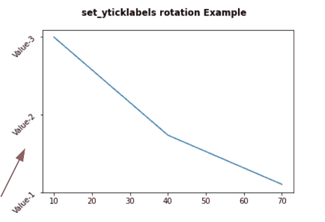

set_yticklabels(rotation=45)

阅读:[画垂直线 matplotlib](https://pythonguides.com/draw-vertical-line-matplotlib/)

## Matplotlib set_yticklabels 不可见

这里我们将学习如何隐藏 y 轴上的标签。在这里，我们将标签设置为空，以便隐藏轴文本。但是刻度仍然可见。

**以下是语法:**

```py
matplotlib.axes.Axes.set_yticklabels([])
```

**让我们来看一个与隐形标签相关的例子:**

```py
**# Import Library** 
import numpy as np
import matplotlib.pyplot as plt

**# Create subplot** 
fig, ax = plt.subplots()

**# Define Data**

x = np.linspace(0, 5 * np.pi, 150)
y = np.cos(60*x)

**# Plot**

ax.plot(x, y)

**# Set ticklabels**

ax.set_yticks([-1 , 0, 1])
ax.set_yticklabels([] )

**# Add fig title**

fig.suptitle('set_yticklabels fontsize Example', fontweight ="bold")

**# Display**

plt.show()
```

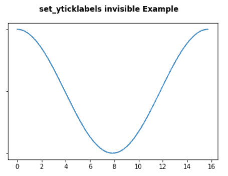

Invisible Tick Labels

在这里，您可以看到，如果我们将空白列表传递给 **set_yticklabels()** 方法，标签将变得不可见，但是刻度仍然存在。

读取:[水平线 matplotlib](https://pythonguides.com/horizontal-line-matplotlib/)

## matplotlib set _ yticklabels align mnt

在这里，我们将学习更改 y 轴标签的对齐方式。要更改对齐，请将**旋转**作为 **set_yticklabels** 方法的参数，并将其值设置为**垂直**或**水平**。

默认情况下，y 轴标签是水平对齐的。

**以下是语法:**

```py
matplotlib.axes.Axes.set_ticklabels(labels, rotation= 'vertical' | 'horizontal')
```

**举例:**

```py
**# Import Library** 
import numpy as np
import matplotlib.pyplot as plt

**# Create subplot**

fig, ax = plt.subplots()

**# Define Data**

x = np.linspace(0, 5 * np.pi, 150)
y = np.cos(90*x)

**# Plot**

ax.plot(x, y)

**# Set ticklabels** 
ax.set_yticks([-1 , 0, 1])
ax.set_yticklabels(['Lable-1', 'Label-2', 'Label-3'], rotation='vertical')

**# Add fig title** 
fig.suptitle('set_yticklabels invisible Example', fontweight ="bold")

**# Display** 
plt.show()
```

在上面的例子中，我们将**旋转**参数传递给 **set_yticklabels()** 方法，并将其值设置为 **vertical** ，以获得垂直对齐的标签。

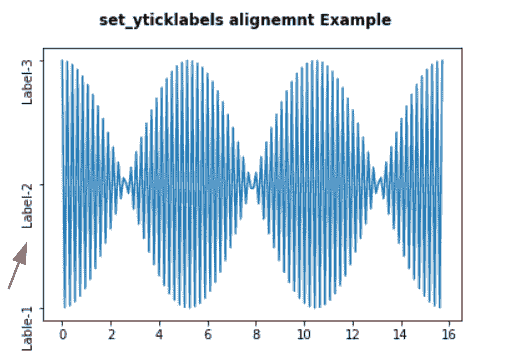

set_yticklabels(rotation=’vertical’)

阅读:[堆积条形图 Matplotlib](https://pythonguides.com/stacked-bar-chart-matplotlib/)

## Matplotlib set _ yticklabels minor

这里我们将学习如何在 y 轴上设置次要标签而不是主要标签。

**语法如下:**

```py
matplotlib.axes.Axes.set_yticklabels(labels, minor=True)
```

**代码:**

```py
**# Import Library**

import matplotlib.pyplot as plt

**# Create subplots** 
fig, ax = plt.subplots()

**# Plot graph**

ax.plot(range(12, 24), range(12))

**# Set tick marks**

ax.set_yticks((1, 3, 5, 7, 9), minor=True)

**# Set ticklabels**

ax.set_yticklabels(("Label-1", "Label-2",
                    "Label-3", "Label-4", "Label-5"), 
                     minor=True, color='Red')

**# Add fig title**

fig.suptitle('set_yticklabels minor Example', fontweight ="bold")

**# Display**

plt.show()
```

在上面的例子中，我们将 **minor** 作为参数传递给两个方法，即 **set_yticksslabels** 和 **set_yticks** ，以设置次要 ticklabels 和 tick，而不是主要 tick。

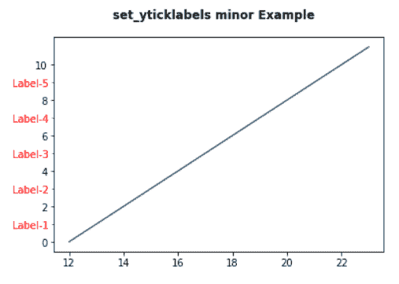

set_yticklabels(minor=True)

阅读: [Matplotlib 两个 y 轴](https://pythonguides.com/matplotlib-two-y-axes/)

## matplot lib colorable set _ yticklabels

在这里，我们将学习如何在颜色条轴上设置文本标签。

**举例:**

```py
**# Import Libraries**

import matplotlib.pyplot as plt
import numpy as np
from matplotlib import cm
from numpy.random import randn

**# Subplots**

fig, ax = plt.subplots()

**# Fix random**

np.random.seed(19680801)

**# Define Data and Plot**

data = np.clip(randn(250, 300), -1, 1)
cax = ax.imshow(data, cmap=cm.cividis)

**# Add colorbar and set ticks and ticklabel**

cbar = fig.colorbar(cax, ticks=[-1, 0, 1])
cbar.ax.set_yticklabels(['Low', 'Medium', 'High']) 

**# Add fig title**

fig.suptitle('set_yticklabels colorbar Example', fontweight ="bold")

**# Display**

plt.show()
```

*   这里我们通过 numpy 的 **random.seed()** 方法来固定随机数。
*   然后我们使用 numpy 的 **clip()** 方法定义数据。
*   为了绘制我们使用的数据， **imshow()** 方法。
*   通过使用 **colorbar()** 方法，我们将一个 colorbar 添加到一个绘图中并设置刻度。
*   然后我们使用 **set_yticklabels()** 方法用字符串标签列表设置 y 轴标签。

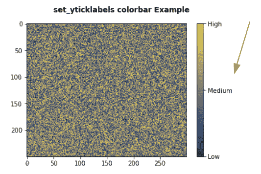

set_yticklabels()

另外，查看以下相关帖子。

*   [Matplotlib fill_between](https://pythonguides.com/matplotlib-fill_between/)
*   [Matplotlib 饼图教程](https://pythonguides.com/matplotlib-pie-chart/)
*   [Matplotlib Plot NumPy 数组](https://pythonguides.com/matplotlib-plot-numpy-array/)
*   [Matplotlib 时间序列图](https://pythonguides.com/matplotlib-time-series-plot/)
*   [Matplotlib 辅助 y 轴](https://pythonguides.com/matplotlib-secondary-y-axis/)

因此，在这个 **Python 教程**中，我们已经讨论了**“Matplotlib set _ yticklabels”**，并且我们也涵盖了一些与之相关的例子。这些是我们在本教程中讨论过的以下主题。

*   Matplotlib set_yticklabels
*   matplot lib set _ yticklabels fontdict
*   matplotlib set _ yticklabels font size
*   matplot lib set _ yticklabels font style
*   Matplotlib set_yticklabels 颜色
*   Matplotlib set_yticklabels 垂直对齐
*   Matplotlib set_yticklabels 水平对齐
*   Matplotlib set_yticklabels 旋转
*   Matplotlib set_yticklabels 不可见
*   Matplotlib set_yticklabels 对齐
*   Matplotlib set_yticklabels minor
*   matplot lib colorbar set _ yticklabels

[Bijay Kumar](https://pythonguides.com/author/fewlines4biju/)

Python 是美国最流行的语言之一。我从事 Python 工作已经有很长时间了，我在与 Tkinter、Pandas、NumPy、Turtle、Django、Matplotlib、Tensorflow、Scipy、Scikit-Learn 等各种库合作方面拥有专业知识。我有与美国、加拿大、英国、澳大利亚、新西兰等国家的各种客户合作的经验。查看我的个人资料。

[enjoysharepoint.com/](https://enjoysharepoint.com/)[](https://www.facebook.com/fewlines4biju "Facebook")[](https://www.linkedin.com/in/fewlines4biju/ "Linkedin")[](https://twitter.com/fewlines4biju "Twitter")