# Python 字典到 CSV

> 原文：<https://pythonguides.com/python-dictionary-to-csv/>

[](https://sharepointsky.teachable.com/p/python-and-machine-learning-training-course)

在本 Python 教程中，我们将讨论 **Python 字典到 CSV。**在这里，我们还将介绍以下示例:

*   Python 字典到 Csv 熊猫
*   Python 字典到 Csv 文件
*   Python 字典到带标题的 Csv
*   Python 字典到 Csv 字符串
*   Python 字典到 Csv 格式
*   Python 字典到 Csv 写
*   Python 字典到 Csv 表
*   Python 字典到 Csv 列
*   Python 字典到 Csv 追加
*   Python 将字典写入 Csv 行
*   Python json 字典到 Csv

目录

[](#)

*   [Python 字典到 CSV](#Python_Dictionary_to_CSV "Python Dictionary to CSV")
    *   [检查如何将字典转换成 CSV 的另一个例子](#Another_example_to_check_how_to_convert_a_dictionary_into_a_CSV "Another example to check how to convert a dictionary into a CSV")
*   [Python 字典到 CSV 熊猫](#Python_dictionary_to_CSV_pandas "Python dictionary to CSV pandas")
*   [Python 字典到 CSV 文件](#Python_dictionary_to_CSV_file "Python dictionary to CSV file")
*   [Python 字典到 CSV 文件，带标题](#Python_dictionary_to_CSV_with_header "Python dictionary to CSV with header")
*   [Python 字典到 CSV 字符串](#Python_dictionary_to_CSV_string "Python dictionary to CSV string")
*   [Python 字典到 CSV 格式](#Python_dictionary_to_CSV_format "Python dictionary to CSV format")
*   [Python 字典给 CSV 写](#Python_dictionary_to_CSV_write "Python dictionary to CSV write")
*   [Python 字典到 CSV 列](#Python_dictionary_to_CSV_columns "Python dictionary to CSV columns")
*   [Python 字典到 CSV 追加](#Python_dictionary_to_CSV_append "Python dictionary to CSV append")
*   [Python 将字典写入 CSV 行](#Python_write_dictionary_to_CSV_row "Python write dictionary to CSV row")
*   [Python json 字典到 CSV](#Python_json_dictionary_to_CSV "Python json dictionary to CSV ")

## Python 字典到 CSV

*   在 Python 中，使用 **dictwriter()** 方法将字典转换为 CSV。此方法用于将数据插入 CSV 文件。在 Python 中，CSV 模块存储了 **dictwriter()** 方法。它创建一个对象，工作方式类似于 dictwriter()。
*   为了执行这个特定的任务，我们首先要导入 CSV 模块。接下来我们将初始化一个字典。

让我们举一个例子，看看如何将字典转换成 CSV 文件

**源代码:**

```
import csv

employee_info = ['emp_id', 'emp_name', 'skills']

new_dict = [
{'emp_id': 456, 'emp_name': 'George', 'skills': 'Python'},
{'emp_id': 892, 'emp_name': 'Adam', 'skills': 'Java'},
{'emp_id': 178, 'emp_name': 'Gilchrist', 'skills': 'Mongo db'},
{'emp_id': 155, 'emp_name': 'Elon', 'skills': 'Sql'},
{'emp_id': 299, 'emp_name': 'Mask', 'skills': 'Ruby'},
]

with open('test4.csv', 'w') as csvfile:
    writer = csv.DictWriter(csvfile, fieldnames = employee_info)
    writer.writeheader()
    writer.writerows(new_dict)
```

这里我们可以将**‘employee _ info’**定义为列名。现在，如果我们想以写模式打开一个文件，那么我们可以使用 **open()** 函数，并使用 **writerheader()** 方法在 CSV 文件中写入第一行。在本例中， **writerow()** 函数将行参数写入编写器的 file 对象。

下面是以下给定代码的执行过程

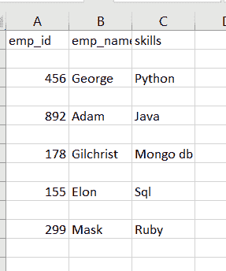

Python dictionary to CSV

### 检查如何将字典转换成 CSV 的另一个例子

**举例:**

```
import csv

my_dictionary = {'values': 678, 'values2': 167, 'values6': 998}

with open('test6.csv', 'w') as f:
    for key in my_dictionary.keys():
        f.write("%s, %s\n" % (key, my_dictionary[key]))
```

首先在上面的代码中，我们将定义一个字典并使用 **open()** 函数打开文件，而要将 CSV 数据写入文件我们可以使用 **dict.keys()的概念。**

下面是以下代码的截图

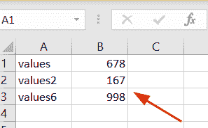

Python dictionary to CSV method

这是如何将字典转换成 CSV 文件。

阅读: [Python 将字典转换为数组](https://pythonguides.com/python-convert-dictionary-to-an-array/)

## Python 字典到 CSV 熊猫

*   让我们看看如何使用 pandas 模块将 Python 字典转换为 CSV。
*   在这个例子中，我们将首先声明一个字典，并将其转换为数据帧，然后通过使用 **to_csv()** 函数将其转换为 CSV 文件。

**源代码:**

```
import pandas as pd
new_my_dict = [
{'a': 15, 'n': 81, 'p': 177},
{'a': 18, 'n': 24, 'p': 190},
{'a': 19, 'n': 20, 'p': 156},
]
df = pd.DataFrame.from_dict(new_my_dict) 
df.to_csv (r'test8.csv', index = False, header=True) 
```

在上面的代码中，我们首先需要导入 pandas 模块，然后创建一个字典**‘new _ my _ dict’**。这里我们也将字典转换成数据帧。在这个例子中，我们可以在函数中使用方法 **to_csv()** ，我们可以将 index 和 header 作为参数传递，但是它们是可选的，我们将 index 作为**‘false’**传递，将 header 作为**‘True’**传递。

下面是以下代码的截图

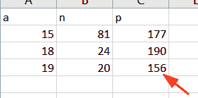

Python dictionary to CSV pandas

阅读:[从字典中获取所有值 Python](https://pythonguides.com/get-all-values-from-a-dictionary-python/)

## Python 字典到 CSV 文件

*   在 Python 中，CSV 文件是包含由换行符和逗号分隔的值的文件。
*   通过使用 **CSV.writer.writerow()** 我们可以将字典转换成 CSV 文件。要给出 CSV 文件的路径，我们可以应用 **open()** file 方法。在这个方法中，我们传递了关键字**‘w’**作为一个参数，这意味着打开一个 CSV 文件流进行写操作。
*   在 Python 中，为了迭代字典中的键-值对，我们可以结合使用 **for loop 和 dict.items()** 方法来执行这个特定的任务。

**源代码:**

```
import csv
new_path = open("mytest.csv", "w")
file_dictionary = {"oliva":199,"james":145,"potter":187}

z = csv.writer(new_path)
for new_k, new_v in file_dictionary.items():
    z.writerow([new_k, new_v])

new_path.close()
```

**注意:**在“new_path”变量中，您必须存储自己的 CSV 文件。

下面是以下给定代码的实现

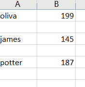

Python dictionary to CSV file

阅读: [Python 元组字典](https://pythonguides.com/python-dictionary-of-tuples/)

## Python 字典到 CSV 文件，带标题

*   这里我想写一个具体的 Python 字典到 CSV，带头。
*   在 Python 中，使用 **dictwriter()** 方法将字典转换成带头文件的 CSV 格式。此方法用于将数据插入 CSV 文件。这里我们可以定义**‘header _ key’**为字段名。
*   在本例中，我们将定义一个字典，并使用 open()函数打开文件和概念的 **dictwriterheader()** 方法来传递一个字段名关键字作为参数。

**举例:**

```
import csv

new_dictionary = { "Australia" : 456, "Germany" : 2678, "China" : 1890,"Japan":1667}
with open('maintest.csv', 'w', newline='') as csvfile:
    header_key = ['Country', 'Value']
    new_val = csv.DictWriter(csvfile, fieldnames=header_key)

    new_val.writeheader()
    for new_k in new_dictionary:
        new_val.writerow({'Country': new_k, 'Value': new_dictionary[new_k]})
```

下面是以下给定代码的输出

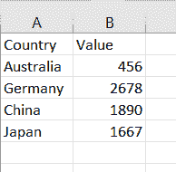

Python dictionary to Csv with header

阅读: [Python 从两个列表中创建了一个字典](https://pythonguides.com/python-creates-a-dictionary-from-two-lists/)

## Python 字典到 CSV 字符串

*   这里我们可以看到如何将字典转换成 CSV 字符串。
*   为了解决这个问题，我们首先需要导入一个**‘io’**和‘CSV’模块。现在，为了导出字典数据，我们首先打开一个名为**‘test 8 . CSV’的文件。**最重要的一点你要创建自己的 CSV 文件，把它作为一个参数放入 open()函数，用**‘w’**属性进行编写，并把换行符调整成一个字符串。
*   这里我们创建了一个 dictwriter 类的实例，并包含一个**‘l’**变量。在 Python 中， **writerrow()** 方法帮助用户编写一个值列表，列表中包含每一项。

源代码:

```
import io
import csv

new_out = io.StringIO()
new_dictionary = [{"emp_name": "OLava", "emp_id": "4567", "skills": "Python"},{"emp_2": "Suzane", "emp_id2": "1678", "skills": "Java"}]
new_path = open("test8.csv", "w")
l = csv.writer(new_path,new_out, quoting=csv.QUOTE_NONNUMERIC)
for m in new_dictionary:
        for new_k, new_val in m.items():
            l.writerow([new_k, new_val])
con_csv = new_out.getvalue()
new_path.close()
```

下面是以下给定代码的实现

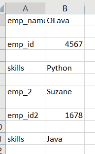

Python dictionary to CSV string

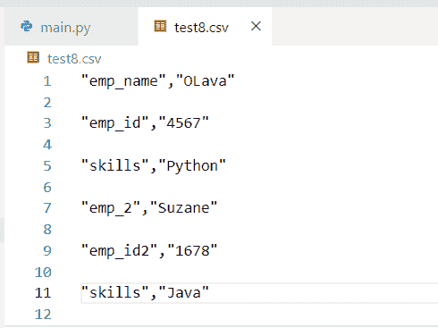

Python dictionary to CSV string method

这就是如何将字典转换成 CSV 字符串。

阅读: [Python 字典 pop](https://pythonguides.com/python-dictionary-pop/)

## Python 字典到 CSV 格式

让我们看看如何将 Python 字典转换为 CSV 格式。为了完成这个任务，我们可以应用 **open()** 函数和 CSV 文件以及**‘w’**关键字作为参数，这意味着以写模式打开 CSV 文件的流。

**举例:**

在这里，我们将以 CSV 格式编写要导出的命令

```
import csv
my_dict = [{
  "student_id": 1456,
  "stu_nam": "oliva",
  "stu_nam_las": "pollard",
  "age": "26"
}, {
  "student_id": 6789,
  "stu_nam": "john",
  "stu_nam_las": "potter",
  "age": "34"
}, {
  "student_id": 378,
  "stu_nam": "Micheal",
  "stu_nam_las": "brenda",
  "age": "29"
}]

with open("test8.csv", "w", newline="") as csv_file:
  new_val = ["student_id","stu_nam","stu_nam_las","age"] 
  j = csv.DictWriter(csv_file, fieldnames=new_val)
  j.writeheader()
  j.writerows(my_dict)
```

在上面的代码中，我们首先需要导入一个 CSV 模块，然后创建一个 Python 字典列表。现在声明一个字段名列表，并使用 dictwriter 的概念。此方法用于将一行数据写入给定文件。

**输出:**

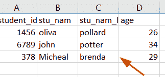

Python dictionary to CSV format

阅读: [Python 字典包含](https://pythonguides.com/python-dictionary-contains/)

## Python 字典给 CSV 写

*   来访问一个新的 CSV 文件并将字典添加到其中。在这个例子中，我们使用 CSV **writer()** 方法。在 Python 中，CSVwriter()方法帮助用户将用户数据转换为字符串。
*   在本例中，脚本将数据写入“test8”。Csv '文件和 **writerow()** 方法将一行数据写入给定文件，并将**‘new _ key’和‘new _ val’**关键字作为参数传递。

**源代码:**

```
import csv

my_new_dict = {'Country': 'Egypt', 'Value': '6789'}

with open('test8.csv', 'w') as f:  
    z = csv.writer(f)
    for new_key, new_val in my_new_dict.items():
       z.writerow([new_key, new_val])
```

下面是以下代码的截图

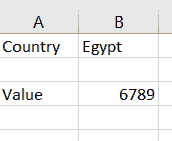

Python dictionary to CSV write

阅读: [Python 字典理解](https://pythonguides.com/python-dictionary-comprehension/)

## Python 字典到 CSV 列

*   在这个例子中，我们将看到如何为 CSV 列编写一个字典，我们还将检查如何在第一列显示关键元素，在第二列显示值。
*   为了执行这个任务，我们将定义一个字典，使用 open()函数打开文件，并使用 **dictwriter()** 方法的概念来传递一个 CSV 文件关键字作为参数。

**源代码:**

```
import csv
new_dictionary = {78:'z', 15:'y', 19:'r'}

with open('maintest.csv', 'w') as f:
    w = csv.writer(f)
    for row in new_dictionary.items():
        w.writerow(row)
```

下面是给定代码的执行

当我在 excel 表格中打开输出时，它的格式是这样的

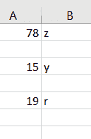

Python dictionary to CSV columns

阅读: [Python 将字典转换为列表](https://pythonguides.com/python-convert-dictionary-to-list/)

## Python 字典到 CSV 追加

*   让我们看看如何使用 CSV 模块和 dictwriter 类向 CSV 文件追加一行。
*   首先，我们将创建一个 CSV 文件并在其中插入元素。在 Python 中读写 CSV 文件，我们可以使用 **CSV()** 模块。要编写一个 CSV 文件，有两种方法:writer 和 dictwritter。
*   在本例中，首先导入 writer 类，然后以追加模式打开 CSV 文件。现在如果你想得到一个 writer 对象，那么就使用 **CSV.writer()** 方法的概念。之后使用 **writerow()** 函数，并在函数内将列表作为参数传递。

**源代码:**

```
import csv
from csv import writer

new_row=[9532,'China','Mongodb','26']

with open('maintest.csv', 'a') as f:

    w = writer(f)
    w.writerow(new_row)

    f.close()
```

下面是以下代码的截图

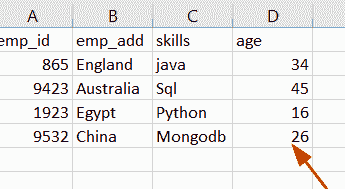

Python dictionary to CSV append

阅读: [Python 熊猫 CSV 教程](https://pythonguides.com/python-pandas-csv/)

## Python 将字典写入 CSV 行

*   在 Python 中，CSV 模块包含 **dictwriter()** 方法，该方法需要 CSV 文件在其上写入并存储字段名。在本例中， **writerow()** 函数将行参数写入编写器的文件对象。

**举例:**

```
import csv

student_info = ['stu_id', 'stu_name', 'age']

new_cs_row = [
{'stu_id': 1890, 'stu_name': 'Liam', 'age': '45'},
{'stu_id': 3456, 'stu_name': 'Noah', 'age': '21'},
{'stu_id': 1678, 'stu_name': 'William', 'age': '27'},
{'stu_id': 9081, 'stu_name': 'Elijah', 'age': '18'},
{'stu_id': 9728, 'stu_name': 'Benjamin', 'age': '17'},
]

with open('mytest.csv', 'w') as csvfile:
    i = csv.DictWriter(csvfile, fieldnames = student_info)
    i.writeheader()
    i.writerows(new_cs_row) 
```

**输出:**

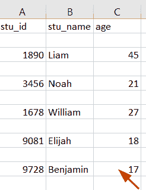

Python write a dictionary to CSV row

读取: [Python NumPy 读取 CSV](https://pythonguides.com/python-numpy-read-csv/)

## Python json 字典到 CSV

*   在这里，我们可以看到如何使用 Python 将 JSON 字典文件转换为 CSV 文件。
*   在 Python 中， **JSON** 代表 Javascript 对象符号，它用于数据操作，而 CSV 文件用于电子表格的格式化。JSON 是 Python 中的内置包。要在我们的代码中使用这个模块，首先我们必须用 Python 脚本导入 JSON 包。JSON 非常类似于 Python 字典，它将键值映射存储在花括号{}中。
*   让我们看看如何在代码中使用 JSON 文件，并将它们转换成 CSV 文件。

**源代码:**

```
import json
import csv

with open('newtest.json') as json_file:
	new_info = json.load(json_file)
student_info = new_info['country_name']
new_file_path = open('test9.csv', 'w')
m = csv.writer(new_file_path)
new_num = 0
for stu in student_info:
	if new_num == 0:

		header = stu.keys()
		m.writerow(header)
		new_num += 1

	m.writerow(stu.values())
new_file_path.close()
```

在上面的代码中，我们首先要导入 JSON 和 CSV 模块。现在，我们必须打开一个 JSON 文件，将数据加载到一个变量中，并以写模式打开 CSV 文件。之后，声明 CSV writer **对象‘m’和‘new _ num’**变量用于将标题写入 CSV 文件。在这个例子中，load 关键字帮助用户将 JSON 数据转换成一个字典。

下面是 JSON 文件截图

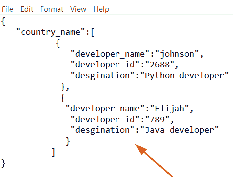

Python JSON dictionary to CSV

下面是 CSV 文件的输出

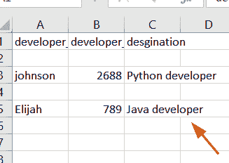

Python JSON dictionary to CSV method

另外，看看更多的 Python 教程。

*   [Python 在字典中查找最大值](https://pythonguides.com/python-find-max-value-in-a-dictionary/)
*   [Python 字典计数+例子](https://pythonguides.com/python-dictionary-count/)

在本 Python 教程中，我们讨论了将 Python 字典转换为 CSV。在这里，我们还介绍了以下示例:

*   Python 字典到 Csv 熊猫
*   Python 字典到 Csv 文件
*   Python 字典到带标题的 Csv
*   Python 字典到 Csv 字符串
*   Python 字典到 Csv 格式
*   Python 字典到 Csv 写
*   Python 字典到 Csv 表
*   Python 字典到 Csv 列
*   Python 字典到 Csv 追加
*   Python 将字典写入 Csv 行
*   Python json 字典到 Csv

[Bijay Kumar](https://pythonguides.com/author/fewlines4biju/)

Python 是美国最流行的语言之一。我从事 Python 工作已经有很长时间了，我在与 Tkinter、Pandas、NumPy、Turtle、Django、Matplotlib、Tensorflow、Scipy、Scikit-Learn 等各种库合作方面拥有专业知识。我有与美国、加拿大、英国、澳大利亚、新西兰等国家的各种客户合作的经验。查看我的个人资料。

[enjoysharepoint.com/](https://enjoysharepoint.com/)[](https://www.facebook.com/fewlines4biju "Facebook")[](https://www.linkedin.com/in/fewlines4biju/ "Linkedin")[](https://twitter.com/fewlines4biju "Twitter")