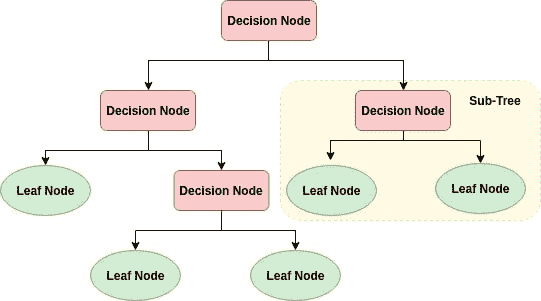
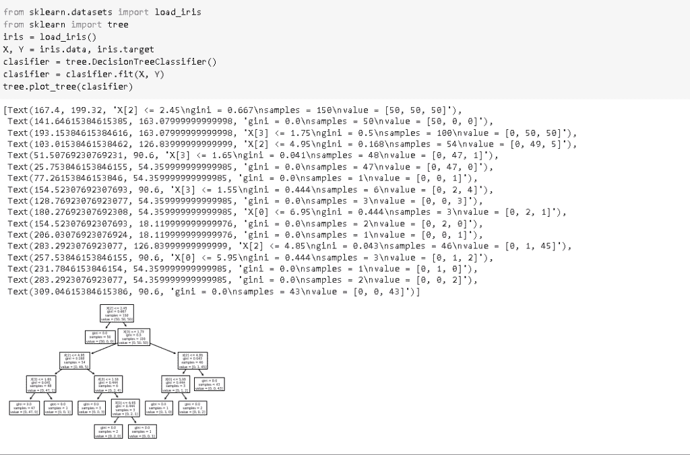
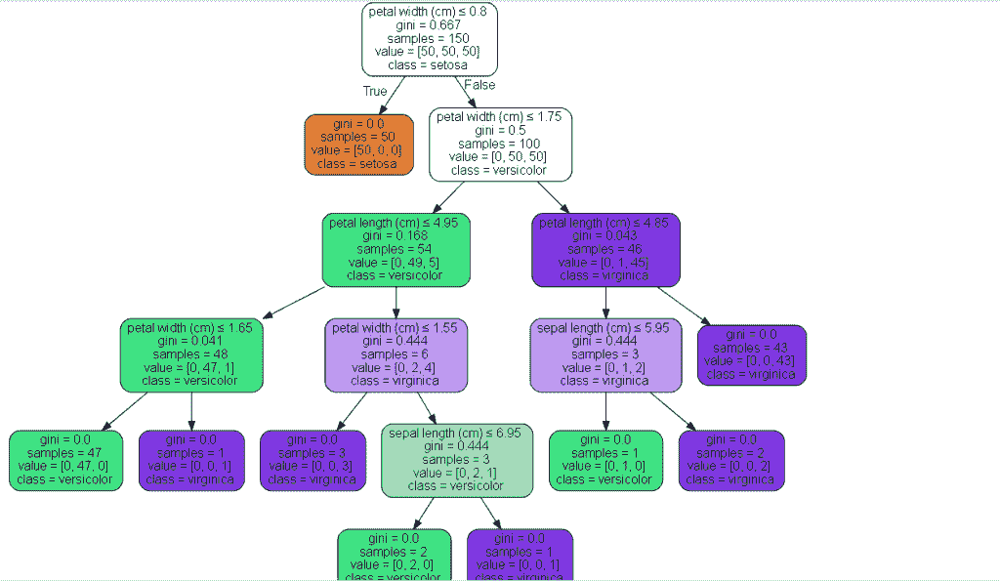
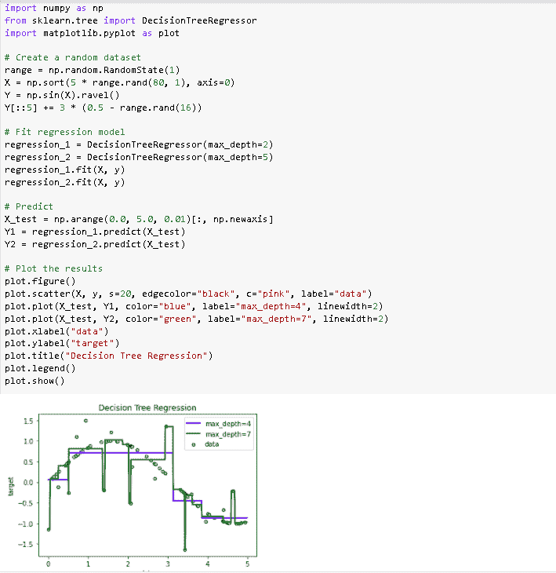
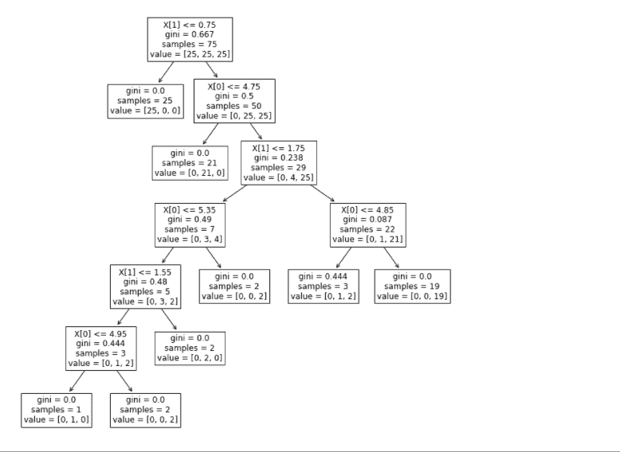
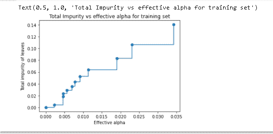
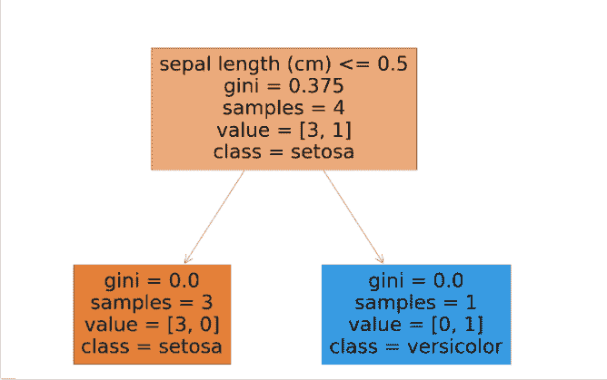

# Scikit 学习决策树

> 原文：<https://pythonguides.com/scikit-learn-decision-tree/>

[](https://sharepointsky.teachable.com/p/python-and-machine-learning-training-course)

在这个 [Python 教程](https://pythonguides.com/learn-python/)中，我们将学习**如何用 Python 创建一个 scikit learn 决策树**，我们还将涵盖与**决策树**相关的不同示例。此外，我们将涵盖这些主题。

*   Scikit 学习决策树
*   Scikit 学习决策树分类器
*   Scikit 学习决策树分类器示例
*   Scikit 学习决策树回归器
*   Scikit 学习决策树可视化
*   Scikit 学习决策树修剪
*   Scikit 学习决策树分类
*   Scikit 学习决策树准确性

目录

[](#)

*   [Scikit 学习决策树](#Scikit_learn_decision_tree "Scikit learn decision tree")
*   [Scikit 学习决策树分类器](#Scikit_learn_decision_tree_classifier "Scikit learn decision tree classifier")
*   [Scikit 学习决策树分类器示例](#Scikit_learn_decision_tree_classifier_example "Scikit learn decision tree classifier example")
*   [Scikit 学习决策树回归器](#Scikit_learn_decision_tree_regressor "Scikit learn decision tree regressor")
*   [Scikit 学习决策树可视化](#Scikit_learn_decision_tree_visualization "Scikit learn decision tree visualization")
*   [Scikit 学习决策树剪枝](#Scikit_learn_decision_tree_pruning "Scikit learn decision tree pruning")
*   [Scikit 学习决策树分类](#Scikit_learn_decision_tree_categorical "Scikit learn decision tree categorical")
*   [Scikit 学习决策树准确性](#Scikit_learn_decision_tree_accuracy "Scikit learn decision tree accuracy")

## Scikit 学习决策树

在本节中，我们将学习**如何在 **python** 中制作 [scikit-learn](https://pythonguides.com/what-is-scikit-learn-in-python/) 决策树**。

*   决策树是一个类似流程图的树结构，它由分支组成，每个分支代表一个决策规则。树的分支被称为节点。
*   我们有一个分割过程，将节点分割成子节点。决策树的最顶层节点被称为根节点。
*   有些线将节点分成子节点，子节点甚至被分成偶数个子节点，然后初始子节点称为决策节点。
*   不再分裂的节点称为叶节点或终端节点。整个树的子部分被称为分支或子树。
*   我们也可以称该节点为父节点和子节点。被分成子节点的节点被称为父节点，子节点被称为父节点的子节点。



Scikit learn decision tree

正如我们在上面的图片中看到的，节点被分割成子节点。我们还可以在决策树中选择最佳分割点。

*   决策树分割所有可用变量上的节点。
*   选择产生最相似子节点的拆分。
*   决策树的时间复杂度是给定数据中记录数和属性数的方法。
*   决策树是一种不依赖于概率分布的非参数方法。

另外，检查: [Scikit-learn 逻辑回归](https://pythonguides.com/scikit-learn-logistic-regression/)

## Scikit 学习决策树分类器

在本节中，我们将学习如何用 python 创建 scikit learn 决策树分类器。

*   决策树用于预测值，并且是用于分类和回归的非参数监督学习方法。

*   决策树分类器是可用于对数据集执行多类分类的类。
*   决策树分类器接受两个数组的输入，如数组 X 和数组 Y。数组 X 保存训练样本，数组 Y 保存训练样本。
*   决策树分类器支持二元分类以及多类分类。

**代码:**

在下面的代码中，我们将**从 sklearn 库**加载虹膜数据，并从 sklearn 导入树。

*   **load_iris()** 用于加载数据集。
*   **X，Y = iris.data，iris.target** 用于训练数据和测试数据。
*   **树。决策树分类器()**用于制作决策树分类器。
*   **树。DecisionTreeClassifier()** 用于将数据放入树中。
*   **tree . plot _ tree(clasifier)**用于在屏幕上绘制决策树。

```py
from sklearn.datasets import load_iris
from sklearn import tree
iris = load_iris()
X, Y = iris.data, iris.target
clasifier = tree.DecisionTreeClassifier()
clasifier = clasifier.fit(X, Y)
tree.plot_tree(clasifier)
```

**输出:**

运行上面的代码后，我们得到下面的输出，可以看到屏幕上绘制了决策树。



scikit learn decision tree classifier

Read: [Scikit-learn Vs Tensorflow](https://pythonguides.com/scikit-learn-vs-tensorflow/)

## Scikit 学习决策树分类器示例

在本节中，我们将学习如何用 Python 制作一个 scikit learn 决策树示例。

*   我们知道决策树是用来预测价值的，它是非参数的监督学习。
*   决策树分类器接受两个数组的输入，如数组 X 和数组 Y。数组 X 保存训练样本，数组 Y 保存训练样本。

**举例:**

在下面的例子中，我们将**导入 graphviz 库**。Graphviz 被定义为用于创建图表的开源模块。

*   **tree.export_graphviz(clf，out_file=None)** 用于在屏幕上创建树形图。
*   **tree.export_graphviz()** 用于在树形图内部添加一些变量。
*   **graphviz。**source(dot data)用于从数据源获取数据。

```py
import graphviz 
dotdata = tree.export_graphviz(clf, out_file=None) 
graphs = graphviz.Source(dotdata) 
graphs.render("iris")
dotdata = tree.export_graphviz(clf, out_file=None, 
                     feature_names=iris.feature_names,  
                     class_names=iris.target_names,  
                     filled=True, rounded=True,  
                     special_characters=True)  
graphs = graphviz.Source(dotdata)  
graphs 
```

**输出:**

运行上面的代码后，我们得到了下面的输出，从中我们可以看到在 Graphviz 的帮助下绘制了一个决策树图。



Scikit learn decision tree classifier example

读取 [Scikit 学习准确度 _ 分数](https://pythonguides.com/scikit-learn-accuracy-score/)

## Scikit 学习决策树回归器

在继续之前，我们应该了解一些关于回归变量的知识。

*   在 Regressor 中，我们只是预测值，或者我们可以说它是一种研究自变量和因变量之间关系的建模技术。
*   在回归分析中，我们有因变量和自变量。这里，因变量作为响应，自变量作为特征。
*   回归变量有助于我们理解因变量的值相对于自变量是如何变化的。

**代码:**

在下面的代码中，我们将导入一些库 **import numy 作为 np** ，从 sklearn.tree 中导入**来自 import DecisionTreeRegressor** ，从**中导入 matplotlib.pyplot 作为 plot。**

*   **np.random.RandomState(1)** 用于创建随机数据集。
*   **regression_1.fit(X，y)** 用于填充回归模型。
*   **regression _ 1 . predict(X _ test)**用于预测数据。
*   **plot.figure()** 用于绘制图形。
*   **plot.xlabel("data")** 用于绘制图形上的 x 标签。
*   **plot.ylabel("target")** 用于在图形上绘制 y 标签。
*   **plot.title("决策树回归")**用来给图加标题。

```py
import numpy as np
from sklearn.tree import DecisionTreeRegressor
import matplotlib.pyplot as plot

range = np.random.RandomState(1)
X = np.sort(5 * range.rand(80, 1), axis=0)
Y = np.sin(X).ravel()
Y[::5] += 3 * (0.5 - range.rand(16))

regression_1 = DecisionTreeRegressor(max_depth=2)
regression_2 = DecisionTreeRegressor(max_depth=5)
regression_1.fit(X, y)
regression_2.fit(X, y)

X_test = np.arange(0.0, 5.0, 0.01)[:, np.newaxis]
Y1 = regression_1.predict(X_test)
Y2 = regression_2.predict(X_test)

plot.figure()
plot.scatter(X, y, s=20, edgecolor="black", c="pink", label="data")
plot.plot(X_test, Y1, color="blue", label="max_depth=4", linewidth=2)
plot.plot(X_test, Y2, color="green", label="max_depth=7", linewidth=2)
plot.xlabel("data")
plot.ylabel("target")
plot.title("Decision Tree Regression")
plot.legend()
plot.show()
```

**输出:**

运行上面的代码后，我们得到了下面的输出，从中我们可以看到绘制了决策树回归器。绿色的线是实际数据，虚线是我们的预测数据。



scikit learn decision tree regressor

阅读 [Scikit 了解层次聚类](https://pythonguides.com/scikit-learn-hierarchical-clustering/)

## Scikit 学习决策树可视化

在本节中，我们将了解**如何让 scikit 学习 python 中的决策树可视化**。

在前进之前，我们应该有一些关于视觉化的知识。

*   可视化被定义为将大型数据集转换为图形、图表或树的形式的过程。
*   决策树可视化还将大量数据转换成用户可以更好地理解的树形格式。
*   决策树可视化使用 sklearn 树方法 Plot_tree.sklearn IRIS 数据集完成。

**代码:**

在下面的代码中，我们将导入一些库 **import matplotlib.pyplot 作为 plot** ，sklearn 导入数据集中的**，sklearn.model_selection 导入 train_test_split** ，sklearn.tree 导入决策树分类器中的**。**

*   **iris = datasets . load _ iris()**用于加载 iris 数据集。
*   **X_train，X_test，Y_train，Y_test = train_test_split(X，Y，test_size=0.5，random_state=1，strategy = Y)**用于创建训练或测试数据集。
*   **classifier _ tree = DecisionTreeClassifier(criteria = ' Gini '，max_depth=6，random_state=1)** 用于使用 decision tree classifier 训练模型。
*   **tree . plot _ tree(classifier _ tree，fontsize=12)** 用于绘制决策树。

```py
import matplotlib.pyplot as plot
from sklearn import datasets
from sklearn.model_selection import train_test_split
from sklearn.tree import DecisionTreeClassifier
from sklearn import tree

iris = datasets.load_iris()
X = iris.data[:, 2:]
Y = iris.target

X_train, X_test, Y_train, Y_test = train_test_split(X, Y, test_size=0.5, random_state=1, stratify=Y)

classifier_tree = DecisionTreeClassifier(criterion='gini', max_depth=6, random_state=1)
classifier_tree.fit(X_train, Y_train)

figure, axis = plot.subplots(figsize=(12, 12))
tree.plot_tree(classifier_tree, fontsize=12)
plot.show()
```

**输出:**

运行上述代码后，我们得到以下输出，其中我们可以看到屏幕上绘制了 scikit learn 决策树可视化。



Scikit learn decision tree visualization

阅读: [Scikit 学习隐马尔可夫模型](https://pythonguides.com/scikit-learn-hidden-markov-model/)

## Scikit 学习决策树剪枝

在这一节中，我们将了解**如何让 scikit 学习 python 中的决策树双关语**。

剪枝被定义为一种数据压缩技术，其中数据正在收缩，并且决策树算法的大小通过仅移除树的一部分来减小。

**代码:**

在下面的代码中，我们导入一些库**导入 matplotlib.pyplot 为 plt** ，**来自 sklearn.model _ selction 导入 train_test_split** ，**来自 sklearn.tree 导入 load_breast cancer。**

*   **load _ breast _ cancer(return _ X _ y = True)**用于加载乳腺癌的数据。
*   **X_train，X_test，y_train，y_test = train_test_split(X，y，random_state=0)** 用于拆分训练和测试数据。
*   决策树分类器(random_state=0 **)** 用于绘制决策树分类器的随机状态。
*   **axis . plot(CCP _ 阿尔法斯[:-1]，杂质[:-1]，marker="o "，drawstyle="steps-post")** 用于绘制轴。
*   **axis.set_xlabel("有效 alpha")** 用于给图加 x 标签。
*   axis.set_ylabel(“叶子的总杂质”)用于为图表提供 y 标签。
*   **axis.set_title("总杂质 vs 训练集的有效α")**用于给图加标题。

```py
import matplotlib.pyplot as plt
from sklearn.model_selection import train_test_split
from sklearn.datasets import load_breast_cancer
from sklearn.tree import DecisionTreeClassifier
X, y = load_breast_cancer(return_X_y=True)
X_train, X_test, y_train, y_test = train_test_split(X, y, random_state=0)

clasifier = DecisionTreeClassifier(random_state=0)
path = clasifier.cost_complexity_pruning_path(X_train, y_train)
ccp_alphas, impurities = path.ccp_alphas, path.impurities
fig, axis = plt.subplots()
axis.plot(ccp_alphas[:-1], impurities[:-1], marker="o", drawstyle="steps-post")
axis.set_xlabel("Effective alpha")
axis.set_ylabel("Total impurity of leaves")
axis.set_title("Total Impurity vs effective alpha for training set")
```

**输出:**

运行上面的代码后，我们得到下面的输出，其中我们可以看到叶子的总杂质。



scikit learn decision tree punning

另外，检查: [Scikit 学习随机森林](https://pythonguides.com/scikit-learn-random-forest/)

## Scikit 学习决策树分类

在这一节中，我们将了解**如何让 scikit 学习 Python 中的决策树分类**。

*   分类是与分类变量等价的数据类型。它需要固定数量的可能值。
*   分类变量可以将变量分成不同的类别，例如性别、类型、类别，

**代码:**

在下面的代码中，我们将从 matplotlib 导入 pyplot 作为 plt，从 sklearn 导入数据集导入一些 librarie **s** **，从 sklearn.tree 导入决策树分类器**。****

*   我们可以从虹膜数据集中收集数据，并将数据分类。
*   **tree.plot_tree(clf，feature _ names = iris . feature _ names，class_names=iris.target_names，filled=True)** 用于在屏幕上绘制数据。

```py
from matplotlib import pyplot as plt
from sklearn import datasets
from sklearn.tree import DecisionTreeClassifier 
from sklearn import tree
iris = datasets.load_iris()
X = iris.data
y = iris.target
fig = plt.figure(figsize=(25,20))
_ = tree.plot_tree(clf, 
                   feature_names=iris.feature_names,  
                   class_names=iris.target_names,
                   filled=True)
```

**输出:**

运行上述代码后，我们得到以下输出，从中我们可以看到数据被分成了不同的类别。



scikit-learn decision tree categorical

阅读: [Scikit 学习线性回归](https://pythonguides.com/scikit-learn-linear-regression/)

## Scikit 学习决策树准确性

在这一节中，我们将学习如何在 python 中使 scikit 决策树精确化。

*   精度用于测量模型在测量真阳性和真阴性之和时的性能。
*   准确度被定义为正确分类的案例数占被评估案例总数的比例。

**代码:**

在下面的代码中，我们将导入一些库来查找决策树的准确性。

**data = PD . read _ CSV(" diabetes . CSV "，header=None，names=col_names)** 用于从数据集读取数据。

```py
import pandas as pd
from sklearn.tree import DecisionTreeClassifier 
from sklearn.model_selection import train_test_split  
from sklearn import metrics 
 col_names = ['pregnant', 'glucose', 'bp', 'skin', 'insulin', 'bmi', 'pedigree', 'age', 'label']

data = pd.read_csv("diabetes.csv", header=None, names=col_names)
```

从 **data.head()函数中，我们得到了数据集的**前五行。

```py
data.head()
```

如图所示，我们从 **data.head()** 函数的数据集中获取前五行。


在下面的代码中，我们将数据和目标变量分开以获得准确性。

**print("Accuracy:"，metrics.accuracy_score(y_train，y_pred))** 用于打印屏幕上数据的精度。

```py
 feature_cols = ['pregnant', 'insulin', 'bmi', 'age','glucose','bp','pedigree']
X = data[feature_cols] 
y = data.label 

X_train, X_test, y_train, y_test = train_test_split(X, y, test_size=0.3, random_state=1) 
clf = DecisionTreeClassifier()

clf = clf.fit(X_train,y_train)

y_pred = clf.predict(X_train)

print("Accuracy:",metrics.accuracy_score(y_train, y_pred))
```

运行上面的代码后，我们得到下面的输出，从中我们可以看到模型的准确性。


scikit learn decision tree accuracy

您可能还想阅读以下 Scikit 学习教程。

*   [Scikit 学习图像处理](https://pythonguides.com/scikit-learn-image-processing/)

因此，在本教程中，我们讨论了 **Scikit learn 决策树**，并且我们还涵盖了与其实现相关的不同示例。这是我们已经讨论过的例子列表。

*   Scikit 学习决策树
*   Scikit 学习决策树分类器
*   Scikit 学习决策树分类器示例
*   Scikit 学习决策树回归器
*   Scikit 学习决策树可视化
*   Scikit 学习决策树修剪
*   Scikit 学习决策树分类
*   Scikit 学习决策树准确性

[Bijay Kumar](https://pythonguides.com/author/fewlines4biju/)

Python 是美国最流行的语言之一。我从事 Python 工作已经有很长时间了，我在与 Tkinter、Pandas、NumPy、Turtle、Django、Matplotlib、Tensorflow、Scipy、Scikit-Learn 等各种库合作方面拥有专业知识。我有与美国、加拿大、英国、澳大利亚、新西兰等国家的各种客户合作的经验。查看我的个人资料。

[enjoysharepoint.com/](https://enjoysharepoint.com/)[](https://www.facebook.com/fewlines4biju "Facebook")[](https://www.linkedin.com/in/fewlines4biju/ "Linkedin")[](https://twitter.com/fewlines4biju "Twitter")