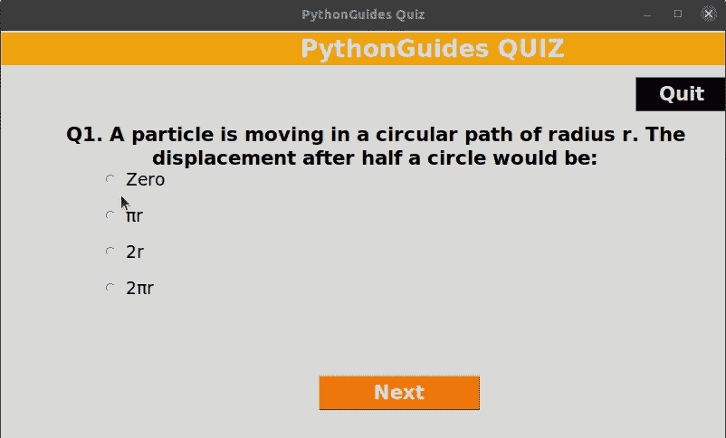

# Python Tkinter 测验–完整教程

> 原文：<https://pythonguides.com/python-tkinter-quiz/>

[](https://sharepointsky.teachable.com/p/python-and-machine-learning-training-course)

在本 Python 教程中，我们将学习如何使用 Python Tkinter 创建一个测验应用程序。测验应用程序用于输入多项选择问卷。用户需要为所提问题选择正确的选项。

目录

[](#)

*   [Python Tkinter 问答应用概述](#Overview_of_Python_Tkinter_Quiz_Application "Overview of Python Tkinter Quiz Application")
*   [Python Tkinter 问答应用代码描述](#Python_Tkinter_Quiz_Application_Code_Description "Python Tkinter Quiz Application Code Description")

## Python Tkinter 问答应用概述

*   在我们开始用 [Python Tkinter](https://pythonguides.com/python-gui-programming/) 编写代码之前，理解 quiz 中的工作原理是很重要的。
*   问题显示有四个选项，从中选择一个是正确答案。
*   用户选择答案后，单击“下一步”按钮。“下一步”按钮带来了带有新选项集的新问题。
*   一旦程序到达最后一个问题，然后显示结果。结果会弹出，显示百分比分数、正确答案和错误答案总数。
*   每个屏幕上都有一个退出按钮，以防你想退出程序。

## Python Tkinter 问答应用代码描述

代码是使用面向对象编程编写的，类名是 Quiz。

*   在下面的代码中，我们创建了一个构造函数，用来保存问题数量、窗口标题、使用单选按钮的多选项问题、函数等值。
*   每次程序运行时都会调用这个构造函数，所以我们在这里提供了所有主要函数的名称。

```
class Quiz:
	def __init__(self):
		self.qno=0
		self.disp_title()
		self.disp_ques()
		self.opt_sel=IntVar()
		self.opts=self.radio_buttons()
		self.disp_opt()
		self.buttons()
		self.total_size=len(question)
		self.correct=0
```

*   **def disp_res()** 函数用于显示测验的结果。最终结果将使用 Python Tkinter 中的消息框显示。
*   错误答案=问题总数–正确答案总数和最终分数的百分比是分数=(正确答案/问题总数)乘以 100

```
def disp_res(self):

		wrong_count = self.total_size - self.correct
		correct = f"Correct: {self.correct}"
		wrong = f"Wrong: {wrong_count}"

		score = int(self.correct / self.total_size * 100)
		result = f"Score: {score}%"

		mb.showinfo("Result", f"{result}\n{correct}\n{wrong}") 
```

*   **check_ans()** 函数在这里用来返回正确的答案。
*   该功能将用户选择的选项与正确的选项进行比较。如果两者相同，则函数返回 True。

```
def check_ans(self, qno):

		if self.opt_sel.get() == answer[qno]:
			return True
```

*   **next_btn()** 此处使用函数移动到下一个问题。点击“下一步”按钮将显示新问题。
*   如果没有问题，它将显示结果。

```
def next_btn(self):

		if self.check_ans(self.qno):
			self.correct += 1

		self.qno += 1

		if self.qno==self.total_size:
			self.disp_res()
			ws.destroy()
		else:
			self.disp_ques()
			self.disp_opt()
```

*   **buttons()** 此处使用 Python Tkinter 在屏幕或窗口上显示按钮。
*   程序中使用了两个按钮:
    *   **next_button** :显示结果或新问题
    *   **quit_button** :终止程序。

```
def buttons(self):

		next_button = Button(
            ws, 
            text="Next",
            command=self.next_btn,
            width=10,
            bg="#F2780C",
            fg="white",
            font=("ariel",16,"bold")
            )

		next_button.place(x=350,y=380)

		quit_button = Button(
            ws, 
            text="Quit", 
            command=ws.destroy,
            width=5,
            bg="black", 
            fg="white",
            font=("ariel",16," bold")
            )

		quit_button.place(x=700,y=50) 
```

*   **disp_opt()** 函数用于向用户显示每个问题的选项。
*   这些选项是从保存问卷、选项及其答案的硬编码数据库中获取的。

```
def disp_opt(self):
		val=0
		self.opt_sel.set(0)

		for option in options[self.qno]:
			self.opts[val]['text']=option
			val+=1
```

阅读[使用 pyinstaller 将 python 文件转换为 exe 文件](https://pythonguides.com/convert-python-file-to-exe-using-pyinstaller/)

**使用 Python Tkinter 的源代码测试应用**

这段源代码遵循了面向对象编程，这样我们就不用重复代码了。单击此处下载包含测验问题、选项和答案的数据文件。

```
from tkinter import *
from tkinter import messagebox as mb
import json

class Quiz:
	def __init__(self):
		self.qno=0
		self.disp_title()
		self.disp_ques()
		self.opt_sel=IntVar()
		self.opts=self.radio_buttons()
		self.disp_opt()
		self.buttons()
		self.total_size=len(question)
		self.correct=0

	def disp_res(self):

		wrong_count = self.total_size - self.correct
		correct = f"Correct: {self.correct}"
		wrong = f"Wrong: {wrong_count}"

		score = int(self.correct / self.total_size * 100)
		result = f"Score: {score}%"

		mb.showinfo("Result", f"{result}\n{correct}\n{wrong}")

	def check_ans(self, qno):

		if self.opt_sel.get() == answer[qno]:
			return True

	def next_btn(self):

		if self.check_ans(self.qno):
			self.correct += 1

		self.qno += 1

		if self.qno==self.total_size:
			self.disp_res()
			ws.destroy()
		else:
			self.disp_ques()
			self.disp_opt()

	def buttons(self):

		next_button = Button(
            ws, 
            text="Next",
            command=self.next_btn,
            width=10,
            bg="#F2780C",
            fg="white",
            font=("ariel",16,"bold")
            )

		next_button.place(x=350,y=380)

		quit_button = Button(
            ws, 
            text="Quit", 
            command=ws.destroy,
            width=5,
            bg="black", 
            fg="white",
            font=("ariel",16," bold")
            )

		quit_button.place(x=700,y=50)

	def disp_opt(self):
		val=0
		self.opt_sel.set(0)

		for option in options[self.qno]:
			self.opts[val]['text']=option
			val+=1

	def disp_ques(self):

		qno = Label(
            ws, 
            text=question[self.qno], 
            width=60,
            font=( 'ariel' ,16, 'bold' ), 
            anchor= 'w',
			wraplength=700,
			justify='center'
            )

		qno.place(x=70, y=100)

	def disp_title(self):

		title = Label(
            ws, 
            text="PythonGuides QUIZ",
            width=50, 
            bg="#F2A30F",
            fg="white", 
            font=("ariel", 20, "bold")
            )

		title.place(x=0, y=2)

	def radio_buttons(self):

		q_list = []

		y_pos = 150

		while len(q_list) < 4:

			radio_btn = Radiobutton(
                ws,
                text=" ",
                variable=self.opt_sel,
                value = len(q_list)+1,
                font = ("ariel",14)
                )
			q_list.append(radio_btn)

			radio_btn.place(x = 100, y = y_pos)

			y_pos += 40

		return q_list

ws = Tk()

ws.geometry("800x450")

ws.title("PythonGuides Quiz")

with open('data.json') as f:
	data = json.load(f)

question = (data['question'])
options = (data['options'])
answer = (data[ 'answer'])

quiz = Quiz()

ws.mainloop()
```

**使用 Python Tkinter 的问答应用** **的输出**

*   在这个输出中，您可以看到有一个使用 Python Tkinter 创建的测验应用程序。该应用程序显示标题、问题和四个单选按钮来显示选项。
*   每次用户点击下一步按钮，新的问题就会出现在屏幕上。
*   右边有一个退出按钮，点击它将终止程序。



Python Tkinter Quiz

您可能会喜欢以下 python Tkinter 教程:

*   [使用 Tkinter 的 Python 注册表](https://pythonguides.com/registration-form-in-python-using-tkinter/)
*   [从 PDF Python 中提取文本](https://pythonguides.com/extract-text-from-pdf-python/)
*   [使用 Python Tkinter 的身体质量指数计算器](https://pythonguides.com/bmi-calculator-using-python-tkinter/)
*   [如何在 Python Tkinter 中设置背景为图像](https://pythonguides.com/set-background-to-be-an-image-in-python-tkinter/)
*   [Python Tkinter 在文本框中显示数据](https://pythonguides.com/python-tkinter-to-display-data-in-textboxes/)
*   [python Django 是什么，用于](https://pythonguides.com/what-is-python-django/)
*   [Python Tkinter 表教程](https://pythonguides.com/python-tkinter-table-tutorial/)
*   [Python Tkinter 编辑器](https://pythonguides.com/python-tkinter-editor/)

在本教程中，我们学习了如何使用 Python Tkinter 创建测验应用程序。

[Bijay Kumar](https://pythonguides.com/author/fewlines4biju/)

Python 是美国最流行的语言之一。我从事 Python 工作已经有很长时间了，我在与 Tkinter、Pandas、NumPy、Turtle、Django、Matplotlib、Tensorflow、Scipy、Scikit-Learn 等各种库合作方面拥有专业知识。我有与美国、加拿大、英国、澳大利亚、新西兰等国家的各种客户合作的经验。查看我的个人资料。

[enjoysharepoint.com/](https://enjoysharepoint.com/)[](https://www.facebook.com/fewlines4biju "Facebook")[](https://www.linkedin.com/in/fewlines4biju/ "Linkedin")[](https://twitter.com/fewlines4biju "Twitter")