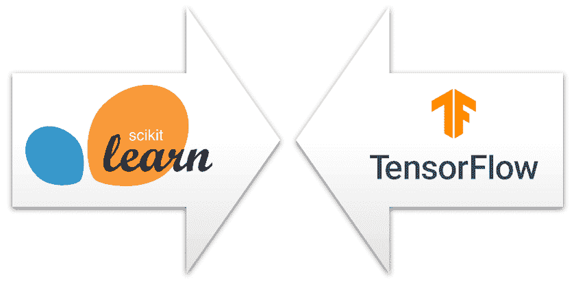
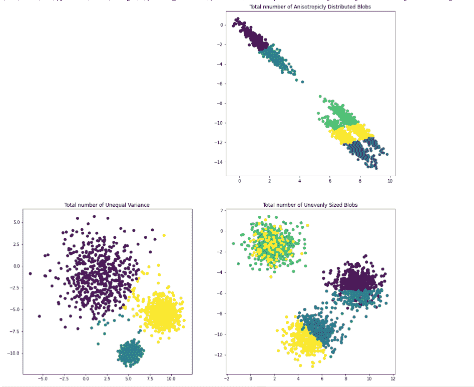
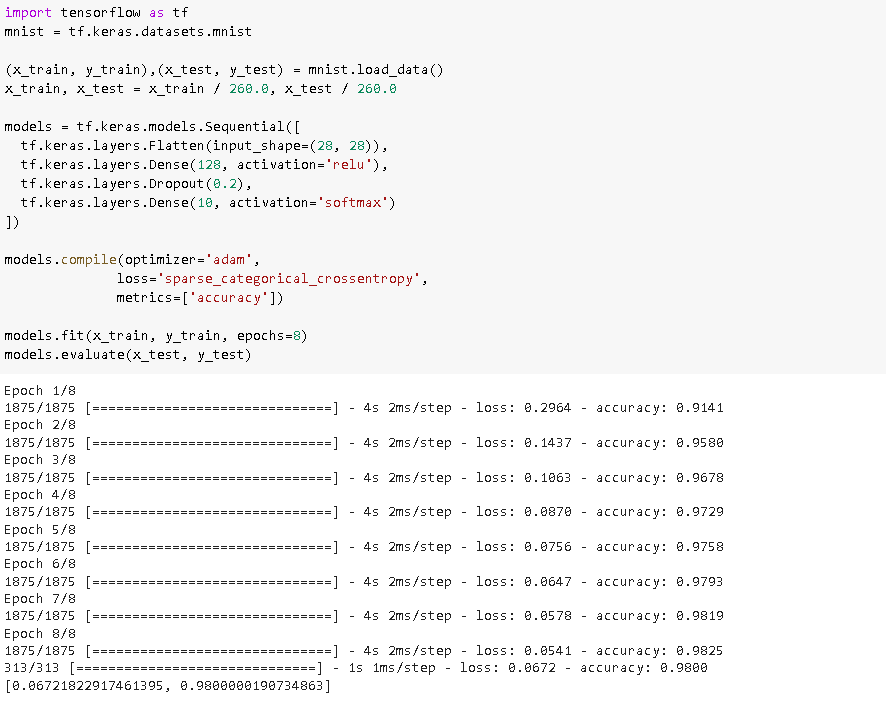

# Scikit-learn 与 tensor flow–详细对比

> 原文：<https://pythonguides.com/scikit-learn-vs-tensorflow/>

[](https://sharepointsky.teachable.com/p/python-and-machine-learning-training-course)

在本 [Python 教程](https://pythonguides.com/learn-python/)中，我们将了解 **scikit-learn vs Tensorflow** ，还将涵盖 **Python** 中与 **scikit-learn 和 TensorFlow** 相关的不同示例。我们将讨论这些话题。

*   scikit-learn 如何工作
*   张量流如何工作
*   Scikit-learn Vs Tensorflow



**Scikit-learn Vs Tensorflow**

目录

[](#)

*   [scikit-learn 的工作原理](#How_scikit-learn_works "How scikit-learn works")
*   【Tenserflow 如何工作
*   [Scikit-learn Vs Tensorflow](#Scikit-learn_Vs_Tensorflow "Scikit-learn Vs Tensorflow")

## scikit-learn 的工作原理

在本节中，我们将通过使用 python 中的 scikit-library 来了解 [scikit-learn](https://pythonguides.com/what-is-scikit-learn-in-python/) 的工作原理。

*   Scikit learn 是一个用户友好的、开源的、免费的 python 库。
*   用户可以自由地使用这个库，这可以简化在 python 中应用编码的任务。
*   scikit learn 是用 python 编写，构建在 Scipy、Numpy 和 Matplotlib 之上。它只关注数据建模，而不是加载或操作数据。

**scikit 学习的安装**

```py
pip install scikit-learn
```

**语法:**

```py
from sklearn import datasets
```

**sci kit-learn 示例:**

在本例中，我们将了解 scikit 如何学习库工作，以及它如何关注建模数据。

*   **plt.figure(figsize=(16，16))** 用于在屏幕上绘制图形。
*   **X，y = make _ blob(n _ samples = n _ samples，random_state=random_state)** 发出以生成可以存储二进制数据的 blob。
*   **y_pred = KMeans(n_clusters=4，random_state=random_state)。fit_predict(X)** 用于预测不正确的聚类数。
*   **plt.subplot(224)** 用于绘制支线剧情。
*   **X_varied，y _ varied = make _ blobs(n _ samples = n _ samples，cluster_std=[1.0，2.5，0.5]，random_state=random_state )** 用于制作不同的方差。
*   **X _ filtered = NP . v stack((X[y = = 0][:500]，X[y == 1][:100]，X[y = = 2][:10])**用于制作大小不均匀的块。

```py
import numpy as np
import matplotlib.pyplot as plt

from sklearn.cluster import KMeans
from sklearn.datasets import make_blobs

plt.figure(figsize=(16, 16))

n_samples = 1800
random_state = 200
X, y = make_blobs(n_samples=n_samples, random_state=random_state)

y_pred = KMeans(n_clusters=4, random_state=random_state).fit_predict(X)

plt.subplot(224)
plt.scatter(X[:, 0], X[:, 1], c=y_pred)
plt.title(" Total incorrect number of blobs")

transformations = [[0.60834550, -0.63667344], [-0.40887720, 0.85253230]]
X_aniso = np.dot(X, transformation)
y_pred = KMeans(n_clusters=5, random_state=random_state).fit_predict(X_aniso)

plt.subplot(222)
plt.scatter(X_aniso[:, 0], X_aniso[:, 1], c=y_pred)
plt.title("Total nnumber of Anisotropicly Distributed Blobs")

X_varied, y_varied = make_blobs(
    n_samples=n_samples, cluster_std=[1.0, 2.5, 0.5], random_state=random_state
)
y_pred = KMeans(n_clusters=3, random_state=random_state).fit_predict(X_varied)

plt.subplot(223)
plt.scatter(X_varied[:, 0], X_varied[:, 1], c=y_pred)
plt.title("Total number of Unequal Variance")

X_filtered = np.vstack((X[y == 0][:500], X[y == 1][:100], X[y == 2][:10]))
y_pred = KMeans(n_clusters=3, random_state=random_state).fit_predict(X_filtered)

plt.subplot(224)
plt.scatter(X_filtered[:, 0], X_filtered[:, 1], c=y_pred)
plt.title("Total number of Unevenly Sized Blobs")

plt.show()
```

**输出:**

运行上面的代码后，我们得到下面的输出，其中我们可以看到在 scikit-learn 库的帮助下，不同的 K 均值聚类被绘制在屏幕上。



scikit learn example

另外，检查: [Scikit-learn 逻辑回归](https://pythonguides.com/scikit-learn-logistic-regression/)

## 【Tenserflow 如何工作

在本节中，我们将通过使用 python 中的 [TensorFlow](https://pythonguides.com/tensorflow/) 库来了解 Tensorflow 的工作原理。

*   TensorFlow 是一个由 Google 团队设计的库，它使记录者的工作变得更加容易。
*   它可以简单方便地计算出数学表达式。
*   Tensorflow 涉及深度学习和机器学习技术的编程支持。
*   Tensorflow 可以训练用于手写数字分类的深度神经网络，并创建各种序列模型。
*   Tensorflow 具有增强相同内存和数据使用的独特功能。

**安装张量流:**

```py
pip install tensorflow
```

**导入张量流的语法:**

```py
import tensorflow as tf
```

**张量流示例:**

在下面的例子中，我们将通过 TensorFlow 了解模型的准确性。

*   正如我们所知，它结合了最优化技术的代数运算，使得任何数学计算都变得容易。
*   **models = TF . keras . models . sequential()**用于检查模型的准确性。
*   **models.compile()** 用于模型的编译。
*   **models.fit(x_train，y_train，epochs=8)** 用于拟合模型。
*   **models.evaluate(x_test，y_test)** 用于评估整个模型。

```py
import tensorflow as tf
mnist = tf.keras.datasets.mnist

(x_train, y_train),(x_test, y_test) = mnist.load_data()
x_train, x_test = x_train / 260.0, x_test / 260.0

models = tf.keras.models.Sequential([
  tf.keras.layers.Flatten(input_shape=(28, 28)),
  tf.keras.layers.Dense(128, activation='relu'),
  tf.keras.layers.Dropout(0.2),
  tf.keras.layers.Dense(10, activation='softmax')
])

models.compile(optimizer='adam',
              loss='sparse_categorical_crossentropy',
              metrics=['accuracy'])

models.fit(x_train, y_train, epochs=8)
models.evaluate(x_test, y_test)
```

**输出:**

运行上述代码后，我们得到以下输出，从中我们可以看到，通过 TensorFlow，我们可以更轻松地进行数学计算，并获得准确的数据。



Example of Tensorflow

另外，请阅读: [Scikit 学习决策树](https://pythonguides.com/scikit-learn-decision-tree/)

## Scikit-learn Vs Tensorflow

| **Scikit** -learn | **Tensorflow** |
| 1.scikit-learn 用于帮助开发人员进行设计，也用于创建新模型并对其进行基准测试。 | 1.Tensorflow 还用于帮助开发人员进行设计，并用于创建新模型的基准。 |
| 2.scikit-learn 在实践中用于广泛的模型范围。 | 2.神经网络的张量流间接使用。 |
| 3.scikit-learn 将其所有算法用作基本估计器 | 3.Tensorflow appliance 的所有算法都在基类中。 |
| 4.scikit-learn 与 XGBoost 等其他框架相比更加灵活 | 4.张量流是用神经网络优化的。 |
| 5.scikit-learn 没有实现一个准系统神经网络模型 | 5.Tensorflow 实现了一个准系统神经网络模型。 |
| 6.scikit-learn 是一个实现机器学习算法的高级库。 | 6.Tensorflow 是一个低级库，它也实现了机器级算法。 |
| 7.scikit-learn 有助于比较完全不同类型的机器学习模型。 | 7.它使其特殊化的引擎盖下优化，这使得比较张量流和神经网络模型更容易。 |
| 8.Scikit-learn 主要用于机器学习 | 8.TensorFlow 主要用于深度学习。 |
| 9.Scikit-learn 是第三方模块，但不如 TensorFlow 受欢迎。 | 9.它也是第三方模块，但更受欢迎。 |

scikit-learn Vs Tensorflow

此外，您可能喜欢:

*   [Scikit 学习准确度 _ 分数](https://pythonguides.com/scikit-learn-accuracy-score/)
*   [Scikit 学习随机森林](https://pythonguides.com/scikit-learn-random-forest/)

因此，在本教程中，我们讨论了 **scikit-learn Vs Tensorflow** ，并且我们还讨论了与其实现相关的不同示例。这是我们已经讨论过的例子列表。

*   scikit-learn 如何工作
*   张量流如何工作
*   Scikit-learn Vs Tensorflow

[Bijay Kumar](https://pythonguides.com/author/fewlines4biju/)

Python 是美国最流行的语言之一。我从事 Python 工作已经有很长时间了，我在与 Tkinter、Pandas、NumPy、Turtle、Django、Matplotlib、Tensorflow、Scipy、Scikit-Learn 等各种库合作方面拥有专业知识。我有与美国、加拿大、英国、澳大利亚、新西兰等国家的各种客户合作的经验。查看我的个人资料。

[enjoysharepoint.com/](https://enjoysharepoint.com/)[](https://www.facebook.com/fewlines4biju "Facebook")[](https://www.linkedin.com/in/fewlines4biju/ "Linkedin")[](https://twitter.com/fewlines4biju "Twitter")