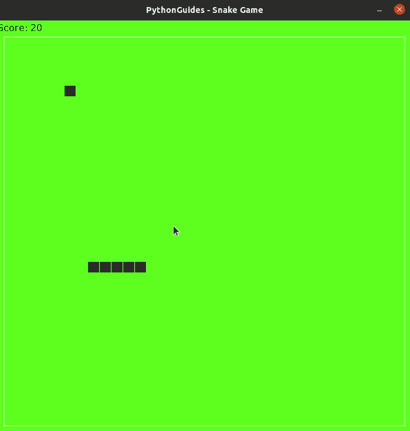

# 如何在 Python Tkinter 中创建一个贪吃蛇游戏

> 原文：<https://pythonguides.com/create-a-snake-game-in-python/>

[](https://sharepointsky.teachable.com/p/python-and-machine-learning-training-course)

在这个 Tkinter 教程中，我们将学习如何在 [Python Tkinter](https://pythonguides.com/python-gui-programming/) 中创建一个流行的贪吃蛇游戏。我们将**用 Python** 从头开始用分数创建一个贪吃蛇游戏。

## 贪吃蛇游戏概述

贪吃蛇游戏是每个千禧一代都玩的传统 2D 游戏之一。

*   在这个游戏中，有一条蛇一直在运动。
*   玩家必须确保蛇不会撞到墙壁或自身发生碰撞。玩了可以用右，左，下，上键控制蛇。
*   默认情况下，蛇以正确的方向开始运动。
*   屏幕上有一个被称为“食物”的物体。每当蛇与食物发生碰撞，食物就会消失，蛇的身体就会变大。
*   蛇与食物的每一次成功碰撞都有一个分数。

**源代码**

在这段代码中，我们创建了一个贪吃蛇游戏，设置了一个评分系统。

```
from tkinter import *
from random import randint
from PIL import Image, ImageTk

movement = 20
steps_per_sec = 10
speed = 1100 // steps_per_sec

class Snake(Canvas):
    def __init__(self):
        super().__init__(
            width=700, 
            height=700, 
            background='#53ff1a', 
            highlightthickness=0
        )

        self.snake_pos = [(100, 80), (80, 100), (80, 100)]
        self.food_pos = self.set_new_food_pos()
        self.direction = 'Right'

        self.score = 0

        self.load_img()
        self.create_objects()

        self.bind_all('<Key>', self.on_key_press)

        self.pack()

        self.after(speed, self.perform_actions)

    def load_img(self):
        try:
            self.snake_body = ImageTk.PhotoImage(Image.open('game.png'))
            self.food = ImageTk.PhotoImage(Image.open('game.png'))
        except IOError as error:
            ws.destroy()
            raise

    def create_objects(self):
        self.create_text(
            35, 
            12, 
            text=f'Score: {self.score}', 
            tag='score', 
            fill='black', 
            font=10
        )

        for x_position, y_position in self.snake_pos:
            self.create_image(
                x_position, 
                y_position, 
                image=self.snake_body, 
                tag='snake'
            )

        self.create_image(
            *self.food_pos, 
            image=self.food, 
            tag='food'
            )
        self.create_rectangle(
            7, 
            27, 
            690, 
            690, 
            outline='#d9d8d7'
            )

    def finish_game(self):
        self.delete(ALL)
        self.create_text(
            self.winfo_width() / 2,
            self.winfo_height() / 2,
            text=f'Game over! You have scored {self.score}!',
            fill='black',
            font=20
        )

    def consume_food(self):
        if self.snake_pos[0] == self.food_pos:
            self.score += 10
            self.snake_pos.append(self.snake_pos[-1])

            self.create_image(
                *self.snake_pos[-1], 
                image=self.snake_body, 
                tag='snake'
            )
            self.food_pos = self.set_new_food_pos()
            self.coords(
                self.find_withtag('food'), 
                *self.food_pos
                )

            score = self.find_withtag('score')
            self.itemconfigure(
                score, 
                text=f'Score: {self.score}', 
                tag='score'
                )

    def boundry(self):
        head_x_position, head_y_position = self.snake_pos[0]

        return (
            head_x_position in (0, 700)
            or head_y_position in (20, 700)
            or (head_x_position, head_y_position) in self.snake_pos[1:]
        )

    def snake_movement(self):
        head_x_position, head_y_position = self.snake_pos[0]

        if self.direction == 'Left':
            new_head_position = (head_x_position - movement, head_y_position)
        elif self.direction == 'Right':
            new_head_position = (head_x_position + movement, head_y_position)
        elif self.direction == 'Down':
            new_head_position = (head_x_position, head_y_position + movement)
        elif self.direction == 'Up':
            new_head_position = (head_x_position, head_y_position - movement)

        self.snake_pos = [new_head_position] + self.snake_pos[:-1]

        for segment, position in zip(self.find_withtag('snake'), self.snake_pos):
            self.coords(segment, position)

    def on_key_press(self, e):
        new_direction = e.keysym

        all_directions = (
            'Up', 
            'Down', 
            'Left', 
            'Right'
            )
        opposites = (
            {'Up', 'Down'}, 
            {'Left', 'Right'}
            )

        if (
            new_direction in all_directions
            and {new_direction, self.direction} not in opposites
        ):
            self.direction = new_direction

    def perform_actions(self):
        if self.boundry():
            self.finish_game()

        self.consume_food()
        self.snake_movement()

        self.after(speed, self.perform_actions)

    def set_new_food_pos(self):
        while True:
            x_position = randint(1, 29) * movement
            y_position = randint(3, 30) * movement
            food_pos = (x_position, y_position)

            if food_pos not in self.snake_pos:
                return food_pos

ws = Tk()
ws.title('PythonGuides - Snake Game')
ws.resizable(False, False)

board = Snake()

ws.mainloop() 
```

**输出:**

在这个输出中，蛇在屏幕上移动，每次它与食物对象碰撞时，蛇的大小都会增加。

*   在屏幕的左上角有一个分数跟踪器。每一次成功的碰撞都会在计分板上增加 10 分。
*   蛇在与自己的身体相撞后死亡，游戏结束。



Python Tkinter Snake Game

您可能会喜欢以下 Python TKinter 教程:

*   [如何使用 Python Tkinter 读取文本文件](https://pythonguides.com/python-tkinter-read-text-file/)
*   [如何使用 Python Tkinter 获取用户输入并存储在变量中](https://pythonguides.com/how-to-take-user-input-and-store-in-variable-using-python-tkinter/)
*   [Python Tkinter 退出程序](https://pythonguides.com/python-tkinter-exit-program/)
*   [Python Tkinter TreeView](https://pythonguides.com/python-tkinter-treeview/)
*   [Python Tkinter 待办事项列表](https://pythonguides.com/python-tkinter-todo-list/)
*   [用 Python Tkinter 创建 Word 文档](https://pythonguides.com/create-word-document-in-python-tkinter/)

在本教程中，我们学习了如何使用 Python Tkinter 创建一个贪吃蛇游戏。

[Bijay Kumar](https://pythonguides.com/author/fewlines4biju/)

Python 是美国最流行的语言之一。我从事 Python 工作已经有很长时间了，我在与 Tkinter、Pandas、NumPy、Turtle、Django、Matplotlib、Tensorflow、Scipy、Scikit-Learn 等各种库合作方面拥有专业知识。我有与美国、加拿大、英国、澳大利亚、新西兰等国家的各种客户合作的经验。查看我的个人资料。

[enjoysharepoint.com/](https://enjoysharepoint.com/)[](https://www.facebook.com/fewlines4biju "Facebook")[](https://www.linkedin.com/in/fewlines4biju/ "Linkedin")[](https://twitter.com/fewlines4biju "Twitter")