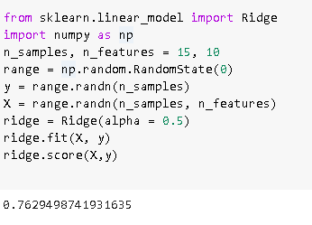
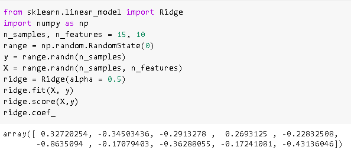
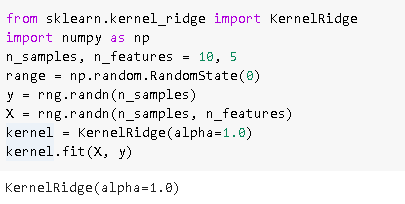
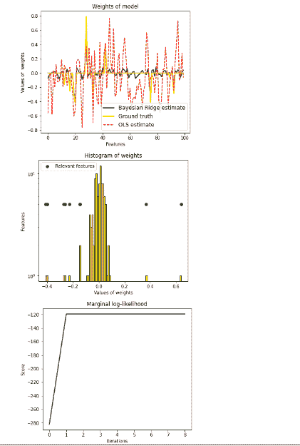

# Scikit 学习岭回归

> 原文：<https://pythonguides.com/scikit-learn-ridge-regression/>

[](https://sharepointsky.teachable.com/p/python-and-machine-learning-training-course)

在这个 [Python 教程](https://pythonguides.com/learn-python/)中，我们将学习**如何在 **Python** 中创建 scikit learn ridge regression** ，我们还将涵盖与 ridge regression 相关的不同示例。我们将讨论这些话题。

*   Scikit 学习岭回归
*   Scikit 学习岭回归系数
*   Scikit 学习核岭回归
*   Scikit 学习贝叶斯岭回归

目录

[](#)

*   [Scikit 学岭回归](#Scikit_learn_ridge_regression "Scikit learn ridge regression")
*   [Scikit 学岭回归系数](#Scikit_learn_ridge_regression_coefficient "Scikit learn ridge regression coefficient")
*   [Scikit 学习内核岭回归](#Scikit_learn_kernel_ridge_regression "Scikit learn kernel ridge regression")
*   [Scikit 学习贝叶斯岭回归](#Scikit_learn_bayesian_ridge_regression "Scikit learn bayesian ridge regression")

## Scikit 学岭回归

本节我们将学习**如何解决 python 中的 **[Scikit 学习](https://pythonguides.com/what-is-scikit-learn-in-python/)** 岭回归**。

**岭回归**用于求解该回归模型，并通过添加一些等价于系数大小平方的惩罚来修改损失函数。

**代码:**

在下面的代码中，我们将导入一些库，从中我们可以用 python 求解岭回归。

*   **n_samples，n_features = 15，10** 用于在此岭函数中添加样本和特征。
*   **RNG = NP . random . random state(0)**用于随机状态。
*   **rdg.fit(X，y)** 用于拟合数值。

```py
from sklearn.linear_model import Ridge
import numpy as np
n_samples, n_features = 15, 10
range = np.random.RandomState(0)
y = range.randn(n_samples)
X = range.randn(n_samples, n_features)
ridge = Ridge(alpha = 0.5)
ridge.fit(X, y)
ridge.score(X,y)
```

**输出:**

运行上面的代码后，我们得到下面的输出，其中我们可以看到屏幕上显示了岭回归得分。



Scikit learn Ridge Regression

另外，检查: [Scikit-learn Vs Tensorflow](https://pythonguides.com/scikit-learn-vs-tensorflow/)

## Scikit 学岭回归系数

在本节中，我们将了解如何用 python 创建 scikit learn 岭回归系数。

**代码:**

在下面的代码中，我们将**从 sklearn.learn** 中导入 ridge 库，还将**导入** **numpy 作为 np** 。

*   **n_samples，n_features = 15，10** 用于在岭函数中添加样本和特征。
*   **ridge.score(X，y)** 用于给出得到分数的岭函数。
*   **ridge.coef_** 用于获取岭函数的系数。

```py
from sklearn.linear_model import Ridge
import numpy as np
n_samples, n_features = 15, 10
range = np.random.RandomState(0)
y = range.randn(n_samples)
X = range.randn(n_samples, n_features)
ridge = Ridge(alpha = 0.5)
ridge.fit(X, y)
ridge.score(X,y)
ridge.coef_
```

**输出:**

运行上面的代码后，我们得到下面的输出，其中我们可以看到脊系数打印在屏幕上。



scikit learn ridge regression coefficient

阅读: [Scikit-learn 逻辑回归](https://pythonguides.com/scikit-learn-logistic-regression/)

## Scikit 学习内核岭回归

在这一节中，我们将学习如何用 **Python 创建一个 scikit learn 内核脊回归**。

**内核岭回归**用自己的招数合并岭回归。核包括线性函数中的空间。

**代码:**

在下面的代码中，我们将从 sklearn.kernel_ridge 导入 KernelRidge，从中我们可以得到内核脊值。

*   **n_samples，n_features = 10，5** 用于创建样本和特征的核脊。
*   **KernelRidge(alpha=1.0)** 用于获取核脊值。

```py
from sklearn.kernel_ridge import KernelRidge
import numpy as np
n_samples, n_features = 10, 5
range = np.random.RandomState(0)
y = rng.randn(n_samples)
X = rng.randn(n_samples, n_features)
kernel = KernelRidge(alpha=1.0)
kernel.fit(X, y)
```

**输出:**

运行上面的代码后，我们得到下面的输出，其中我们可以看到屏幕上显示了内核脊值。



scikit learn kernel ridge regression

阅读: [Scikit 学习决策树](https://pythonguides.com/scikit-learn-decision-tree/)

## Scikit 学习贝叶斯岭回归

在这一节中，我们将学习如何用 **Python** 创建一个 scikit 学习贝叶斯岭回归。

贝叶斯回归允许自然机制通过使用概率公式化线性回归来保持不充分的分布数据。

**代码:**

在下面的代码中，我们将导入一些库，从中我们可以创建贝叶斯岭回归。

*   **n_samples，n_features = 100，100** 用于生成数据。
*   **X = np.random.randn(n_samples，n_features)** 用于创建高斯数据。
*   **lambda_ = 4.0** 用于创建带有 lambda 值的权重。
*   **relevant _ features = NP . random . randint(0，n_features，10)** 用于保持 10 个感兴趣的权重。
*   **clf = Bayesian ridge(compute _ score = True)**用于拟合贝叶斯回归。
*   **plot.figure(figsize=(6，5))** 用于绘制图形。

```py
 import numpy as np
import matplotlib.pyplot as plot
from scipy import stats

from sklearn.linear_model import BayesianRidge, LinearRegression
np.random.seed(0)
n_samples, n_features = 100, 100
X = np.random.randn(n_samples, n_features)  # Create Gaussian data
lambda_ = 4.0
w = np.zeros(n_features)
relevant_features = np.random.randint(0, n_features, 10)
for i in relevant_features:
    w[i] = stats.norm.rvs(loc=0, scale=1.0 / np.sqrt(lambda_)).
alpha_ = 50.0
noise = stats.norm.rvs(loc=0, scale=1.0 / np.sqrt(alpha_), size=n_samples)
y = np.dot(X, w) + noise

clf = BayesianRidge(compute_score=True)
clf.fit(X, y)

ols = LinearRegression()
ols.fit(X, y)

lw = 2
plot.figure(figsize=(6, 5))
plot.title("Weights of model")
plot.plot(clf.coef_, color="green", linewidth=lw, label="Bayesian Ridge estimate")
plot.plot(w, color="yellow", linewidth=lw, label="Ground truth")
plot.plot(ols.coef_, color="red", linestyle="--", label="OLS estimate")
plot.xlabel("Features")
plot.ylabel("Values of  weights")
plot.legend(loc="best", prop=dict(size=12))

plot.figure(figsize=(6, 5))
plot.title("Histogram of weights")
plot.hist(clf.coef_, bins=n_features, color="gold", log=True, edgecolor="black")
plot.scatter(
    clf.coef_[relevant_features],
    np.full(len(relevant_features), 5.0),
    color="navy",
    label="Relevant features",
)
plot.ylabel("Features")
plot.xlabel("Values of weights")
plot.legend(loc="upper left")

plot.figure(figsize=(6, 5))
plot.title("Marginal log-likelihood")
plot.plot(clf.scores_, color="navy", linewidth=lw)
plot.ylabel("Score")
plot.xlabel("Iterations")
def f(x, noise_amount):
    y = np.sqrt(x) * np.sin(x)
    noise = np.random.normal(0, 1, len(x))
    return y + noise_amount * noise

degree = 10
X = np.linspace(0, 10, 100)
y = f(X, noise_amount=0.1)
clf_poly = BayesianRidge()
clf_poly.fit(np.vander(X, degree), y)

X_plot = np.linspace(0, 11, 25)
y_plot = f(X_plot, noise_amount=0)
y_mean, y_std = clf_poly.predict(np.vander(X_plot, degree), return_std=True)
plot.figure(figsize=(6, 5))
plot.errorbar(
    X_plot,
    y_mean,
    y_std,
    color="navy",
    label="Polynomial Bayesian Ridge Regression",
    linewidth=lw,
)
plot.plot(X_plot, y_plot, color="yellow", linewidth=lw, label="Ground Truth")
plot.ylabel("Output y")
plot.xlabel("Feature X")
plot.legend(loc="lower left")
plot.show()
```

**输出:**

运行上面的代码后，我们得到下面的输出，其中我们可以看到贝叶斯岭回归被绘制在屏幕上。



scikit learn Bayesian ridge regression

您可能还想阅读 scikit learn 上的以下教程。

*   [Scikit 学习层次聚类](https://pythonguides.com/scikit-learn-hierarchical-clustering/)
*   [Scikit 学习遗传算法](https://pythonguides.com/scikit-learn-genetic-algorithm/)
*   [Scikit 学习分类教程](https://pythonguides.com/scikit-learn-classification/)
*   [Scikit 学习隐马尔可夫模型](https://pythonguides.com/scikit-learn-hidden-markov-model/)
*   [Scikit 学习准确度 _ 分数](https://pythonguides.com/scikit-learn-accuracy-score/)

因此，在本教程中，我们讨论了**sci kit learn ridge regression**,我们还涵盖了与其实现相关的不同示例。这是我们已经讨论过的例子列表。

*   Scikit 学习岭回归
*   Scikit 学习岭回归系数
*   Scikit 学习核岭回归
*   Scikit 学习贝叶斯岭回归

[Bijay Kumar](https://pythonguides.com/author/fewlines4biju/)

Python 是美国最流行的语言之一。我从事 Python 工作已经有很长时间了，我在与 Tkinter、Pandas、NumPy、Turtle、Django、Matplotlib、Tensorflow、Scipy、Scikit-Learn 等各种库合作方面拥有专业知识。我有与美国、加拿大、英国、澳大利亚、新西兰等国家的各种客户合作的经验。查看我的个人资料。

[enjoysharepoint.com/](https://enjoysharepoint.com/)[](https://www.facebook.com/fewlines4biju "Facebook")[](https://www.linkedin.com/in/fewlines4biju/ "Linkedin")[](https://twitter.com/fewlines4biju "Twitter")