# Python 字典副本，带示例

> 原文：<https://pythonguides.com/python-dictionary-copy/>

[](https://sharepointsky.teachable.com/p/python-and-machine-learning-training-course)

在本 [Python 教程](https://pythonguides.com/python-download-and-installation/)中，我们将讨论 **Python 字典** **副本。**在这里，我们还将介绍以下例子:

*   Python 字典拷贝 vs 深度拷贝
*   Python 字典复制深度
*   Python 字典复制方法
*   Python 字典按值复制
*   Python 字典复制键
*   Python 字典复制和更新
*   Python 字典复制到列表
*   Python 无引用复制字典
*   Python 将字典复制到新变量

目录

[](#)

*   [Python 字典复制](#Python_dictionary_Copy "Python dictionary Copy")
    *   [如何从原始字典中复制元素](#How_to_copy_elements_from_the_original_dictionary "How to copy elements from the original dictionary")
*   [Python 字典拷贝 vs 深度拷贝](#Python_dictionary_Copy_vs_deep_copy "Python dictionary Copy vs deep copy")
    *   [通过使用深度复制()方法](#By_using_deep_copy_method "By using deep copy() method")
*   [Python 字典复制深度](#Python_dictionary_copy_deep "Python dictionary copy deep")
*   [Python 字典复制方法](#Python_dictionary_copy_method "Python dictionary copy method")
*   [Python 字典按值复制](#Python_dictionary_copy_by_value "Python dictionary copy by value")
*   [Python 字典复制键](#Python_dictionary_copy_keys "Python dictionary copy keys")
*   [Python 字典的复制和更新](#Python_dictionary_copy_and_update "Python dictionary copy and update")
*   [Python 字典复制到列表](#Python_dictionary_Copy_to_list "Python dictionary Copy to list")
*   [Python 无引用复制字典](#Python_Copy_dictionary_without_reference "Python Copy dictionary without reference")
*   [Python 将字典复制到新变量](#Python_copy_dictionary_to_new_variable "Python copy dictionary to new variable")

## Python 字典复制

*   在 Python 中，dictionary **copy()** 方法用于[创建一个新的 dictionary](https://pythonguides.com/how-to-create-an-empty-python-dictionary/) 并包含来自原始 dictionary 的相似元素的副本。
*   这个方法总是返回给定字典的浅层副本，它将帮助用户从原始字典中复制每一个元素，并将它们存储到一个新字典中。它不更新原始字典，只是返回字典的副本。
*   让我们看看如何使用 **copy()** 方法从原始字典中复制元素。

**语法:**

下面是**字典 copy()方法**的语法

```py
dict.copy()
```

**注意:**这个方法不带任何参数，返回字典的浅层副本。

**举例:**

```py
country_nam = {'Australia':17, 'Germany':18, 'Cananda':81, 'England':15, 'China':77 }

cpy_dict = country_nam.copy()
print("old dictionary: ",country_nam)
print("New dictionary: ",cpy_dict)
```

在上面的代码中，我们首先用一些键值对元素初始化一个字典**‘country _ Nam’**，然后对它使用 **copy()** 方法并创建一个新的浅层副本。

下面是以下给定代码的执行过程

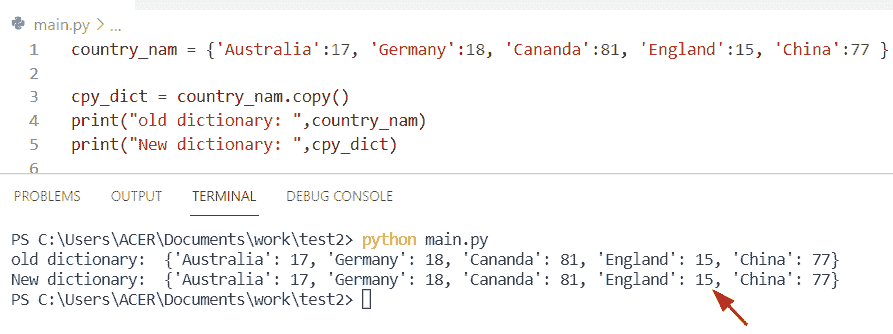

Python dictionary copy

阅读 [Python 字典方法+示例](https://pythonguides.com/python-dictionary-methods/)

### 如何从原始字典中复制元素

通过使用 **'='** 操作符方法，我们可以执行这个特定的任务。在 Python 中， **'='** 操作符用于创建一个新字典，并复制原始字典中可用的每个对象的引用。

在这个例子中，如果在复制的字典中进行了任何更新，那么它也将反映在旧字典中。

**源代码:**

```py
my_dict = {56:'n', 76:'m'}

cp_dict = my_dict 
cp_dict.clear()
print('copy dictionary: ', cp_dict)
print('old dictionary: ', my_dict) 
```

在上面的代码中，我们首先初始化一个字典**‘my _ dict’**，并将其复制到一个新的字典中，这个新的字典就是**‘CP _ dict’。**通过使用 **'cp_dict= my_dict '。**该操作符复制 my_dict 中的每个元素，并将其返回到一个新的字典中。

现在使用 cl **ear()** 方法从字典中删除所有元素，它将显示两个字典都是空的。

下面是以下代码的截图

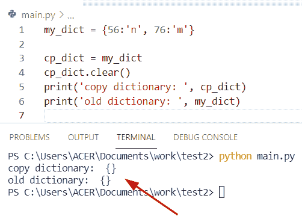

Python dictionary copy

阅读: [Python 字典多键](https://pythonguides.com/python-dictionary-multiple-keys/)

## Python 字典拷贝 vs 深度拷贝

让我们看看**什么是 Python 字典拷贝 vs 深度拷贝**？

*   在 Python 字典中，浅拷贝意味着一个新的集合对象，它包含对原始元素的引用，它创建一个新的实例，并且值被复制到新的实例中。而在浅层复制的情况下，复制过程不迭代，并且不能声明子对象的副本。
*   在 Python 中，深度复制方法将更改为原始字典，并且不会影响深度复制的字典。为了在复制字典时进行递归处理，我们可以使用深度复制方法。在这个方法中，它将一个字典作为参数传递，并返回一个新字典，递归地复制所有元素。
*   而在 deep **copy()** 方法的情况下，当我们创建一个新对象时，它递归地插入字典中可用的嵌套对象的副本。

**语法:**

下面是浅层复制的语法

```py
dict.copy()
```

**注意:**这个方法不需要任何参数。

**举例:**

让我们举一个例子，检查如何使用 shallow **copy()** 方法将元素从原始字典复制到新字典中

```py
my_dictionary={'Micheal':14,'George':18,'John':[21,34,56]}

new_you_dict=my_dictionary.copy()
print("copy dictionary",new_you_dict)
new_you_dict['John'].append(10)
print("updated dictionary",my_dictionary) 
```

在上面的代码中，我们首先初始化了一个字典**‘my _ dictionary’**，现在我们将使用 **dict.copy()** 方法来复制它。然后使用 **append()** 方法更新字典，并使用 print 语句显示结果。

下面是以下给定代码的实现

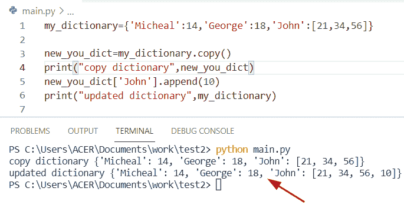

Python dictionary shallow copy vs deep copy

将 [Python 字典读成 CSV](https://pythonguides.com/python-dictionary-to-csv/)

### 通过使用深度复制()方法

在 Python 中，深度复制方法用于创建任何对象的深度副本。此方法创建新对象和所有嵌套对象的独立副本。

**语法:**

下面是深层复制()方法的语法

```py
copy.deepcopy()
```

**注意:**在 Python 中， **deep copy()** 方法将 dict 作为参数传递。

**源代码:**

```py
import copy
my_dictionary={'Potter':26,'James':49,'oliva':[15,27,119]}

new_dict=copy.deepcopy(my_dictionary)
new_dict['oliva'].append(91)
print(new_dict) 
```

在上面的程序中，我们使用 deepcopy()方法从原始字典声明一个相似的字典。为了完成这项任务，我们将首先导入一个复制模块，然后初始化一个字典。

之后，使用 **deepcopy()** 方法，并传递**‘my _ dictionary’**作为参数，返回一个复制所有对象的新字典。

下面是以下代码的截图

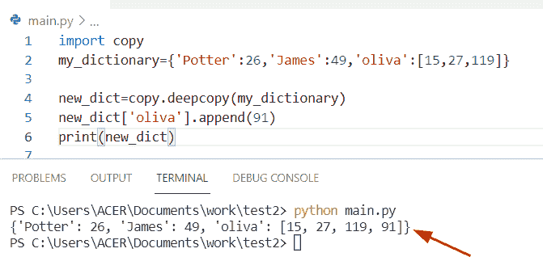

Python dictionary shallow copy vs deep copy

阅读: [Python 在字典中查找最大值](https://pythonguides.com/python-find-max-value-in-a-dictionary/)

## Python 字典复制深度

*   让我们看看如何用 Python 深度复制一个字典。
*   通过使用 **copy.deepcopy()** 方法，我们可以从原始字典中复制一个元素，并将它们存储到一个新对象中。为了实现深度复制方法，我们可以导入包含深度复制操作的'**复制'**模块。此方法返回一个新字典，其中包含所传递字典的复制值。
*   在 Python 中，deepcopy 方法构建一个新对象，然后递归地将对象的副本插入其中，并且不会影响深度复制的字典。

**语法:**

下面是深度复制()方法的语法

```py
copy.deepcopy(dict)
```

**举例:**

让我们举一个例子，检查如何使用 **deepcopy()** 方法从原始字典中复制元素。

源代码:

```py
import copy

my_new_dict = {"Germany":47, "Europe":93, 'Spain':{"France":83}}
cpy_ditionary = copy.deepcopy(my_new_dict)
print(cpy_ditionary)

my_new_dict["Spain"]["France"] = 71
print(my_new_dict)
```

在上面的程序中，我们首先声明一个字典 **'my_new_dict'** ，然后使用 copy.deepcopy()方法复制新的 **'cpy_dictionary '中的 **'my_new_dict'** 元素。**之后，我们修改新的副本，并在原始字典中加入一些更改。

注意:正如您从输出中看到的，“cpy_dictionary”中的任何更改都不会反映在**“my _ new _ dictionary”中。**

下面是以下给定代码的执行过程

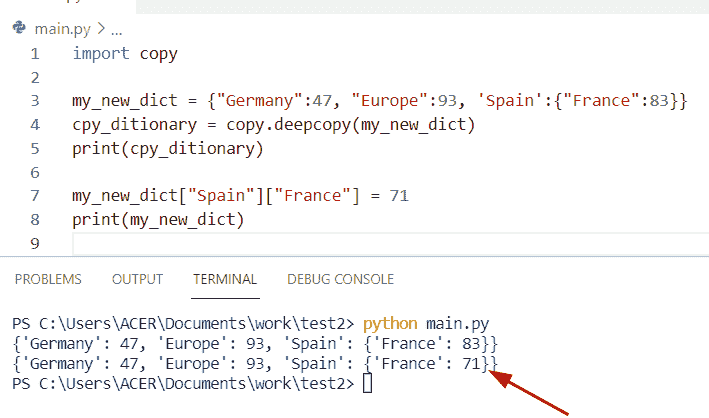

Python dictionary copy deep

阅读:[从字典中获取所有值 Python](https://pythonguides.com/get-all-values-from-a-dictionary-python/)

## Python 字典复制方法

*   在 Python 字典中，copy()是一个内置函数，它总是返回给定字典的副本。该方法返回字典的浅层副本，并且不接受任何参数。
*   这种方法将帮助用户从字典中复制每一个元素，并将它们包含到一个浅层字典中，并且它不更新原始字典，只返回字典的副本。

**语法:**

下面是字典 copy()方法的语法

```py
dictionary.copy()
```

**举例:**

请参见下面的示例

```py
Stu_dict = {'stu_name': 'Bill', 'stu_gender': 'm'}

new_dict = Stu_dict.copy()
print("copy dictionary",new_dict)
```

下面是以下给定代码的执行过程

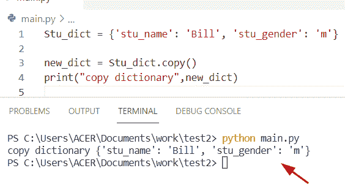

Python dictionary copy method

阅读: [Python 元组字典](https://pythonguides.com/python-dictionary-of-tuples/)

## Python 字典按值复制

*   让我们看看如何在 Python 中**通过值复制字典。**
*   在这个通过值复制字典的例子中，我们应该找到一个在内存中创建一个新对象的方法。为了执行这个特定的任务，我们可以使用传递的概念作为函数的输入，这将有助于创建对象的新实例。

**源代码:**

```py
def new_dict(m):
    m['George']=16
m={}
new_dict(m)
print("Copy dictionary",m)
```

在上面的例子中，我们首先定义一个函数**‘new _ dict’**，然后将**‘m’**作为参数传递，其中 m 是一个空字典。现在将一个值作为输入传递给函数并打印结果。

下面是以下给定代码的执行过程

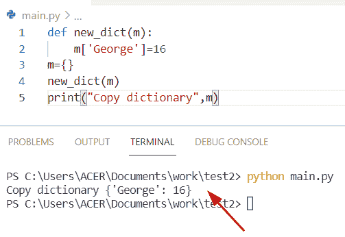

Python dictionary copy by value

阅读: [Python 从两个列表中创建了一个字典](https://pythonguides.com/python-creates-a-dictionary-from-two-lists/)

## Python 字典复制键

*   这里我们可以看到如何用 Python 从字典中复制一个键。
*   要解决这个问题我们可以使用 **dict.keys()** 的概念和 set 方法。 **dict.keys()** 方法返回一个视图对象，该对象显示字典中可用的所有键的列表，set 方法用于创建所有项目。在这个例子中，我们可以将 dict.keys()方法作为参数传递。

**举例:**

```py
my_dict = {'m': 25, 'x': 89, 'p': 14, 'l': 20} 

b = set(my_dict.keys())
print("Dictionary copy keys:",b)
```

下面是以下给定代码的输出

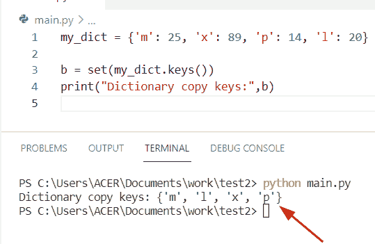

Python dictionary copy keys

阅读:[从字典中获取所有值 Python](https://pythonguides.com/get-all-values-from-a-dictionary-python/)

## Python 字典的复制和更新

*   让我们看看如何从 Python 字典中复制和更新元素。
*   通过使用 dict.copy()方法，我们可以将原始字典中的键值复制到另一个新字典中，它将返回给定字典的浅层副本，并且它还可以帮助用户复制原始字典中的每个元素。

**举例:**

```py
val_dict={ 23:'k', 178:[7,1,5], 183: 'z'}

new_dictionary=val_dict.copy() 
print("Copy dict:",new_dictionary)

new_dictionary[23]=89
new_dictionary[178][1]='91' 

print("Copy dictionary updated:",new_dictionary)
print("Original Dictionary:",val_dict)
```

在上面的程序中，我们首先用一些键值对元素初始化一个字典**‘val _ dict’**，然后对它使用 **copy()** 方法来声明一个浅拷贝。之后，更新项目列表，并在给定的字典中进行更改。

下面是以下给定代码的实现

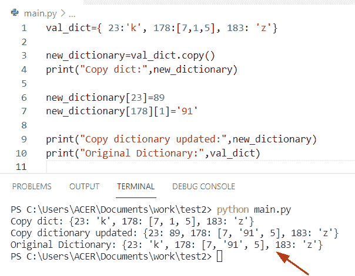

Python dictionary copy and update

阅读: [Python 字典理解](https://pythonguides.com/python-dictionary-comprehension/)

## Python 字典复制到列表

*   在这里我们可以看到如何用 Python 将复制的字典**转换成列表。**
*   在 Python 字典中， **copy()** 方法意味着一个新的集合对象，它存储原始值的引用，它声明一个新的实例，元素被复制到新的实例中。

**源代码:**

```py
student_information = {'Elite':127, 'Micheal':169, 'James':81, 'adam':43, 'joseph':189 }

cpy_dict = student_information.copy()
print("New dictionary: ",cpy_dict)
b = cpy_dict.items()
print("New list",b)
```

在上面的程序中，首先，我们将初始化一个字典，然后对它使用 copy()方法并显示结果。之后，我们将使用 dict.items()方法。该函数将帮助用户将复制的字典转换为列表。

下面是以下代码的截图

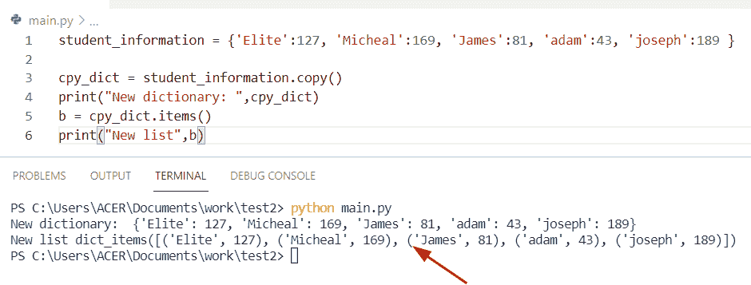

Python dictionary Copy to list

阅读: [Python 字典按值查找键](https://pythonguides.com/python-dictionary-find-a-key-by-value/)

## Python 无引用复制字典

*   这里我们可以看到如何在 Python 中不取任何参考值的情况下复制字典。
*   为了执行这个任务，我们可以应用 **copy()** 方法的概念，但是在这个例子中，我们没有在 copy()方法中传递任何变量作为参数。我们简单地创建两个变量**‘new _ dict’，‘org _ dict’，**，并将它们存储到一个**‘c’**变量中。

**举例:**

```py
org_dict = {5: [9,1,6]}

new_dict = org_dict.copy()
c= org_dict, new_dict
print(c)
org_dict[5].append(34)
d=org_dict, new_dict
print(d) 
```

下面是以下给定代码的执行过程

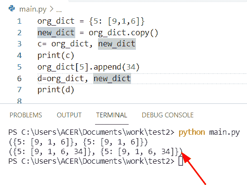

Python Copy dictionary without reference

阅读: [Python 字典 pop](https://pythonguides.com/python-dictionary-pop/)

## Python 将字典复制到新变量

*   让我们看看如何复制一个字典，并将它们存储到 Python 中的一个新变量中。
*   通过使用 **deepcopy()** 方法，我们可以解决这个任务。在 Python 中，深度复制方法将更新到原始字典，它不会影响深度复制的字典。

**源代码:**

```py
import copy

l = {'o':19}
g = copy.deepcopy(l)
print(g) 
```

在上面的代码中，我们将首先导入一个复制模块，然后用一些键值对元素创建一个字典**‘l’**。然后使用 deepcopy()方法并传递字典变量**‘l’**作为参数。

**输出:**

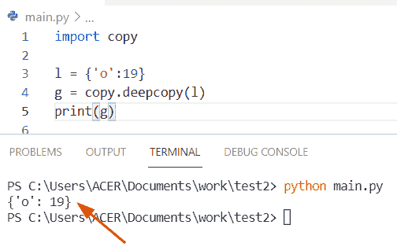

Python copy dictionary to a new variable

**相关帖子:**

*   [Python 字典删除](https://pythonguides.com/python-dictionary-remove/)
*   [Python 字典长度](https://pythonguides.com/python-dictionary-length/)
*   [Python 中的 Case 语句](https://pythonguides.com/case-statement-in-python/)
*   [Python 字典索引](https://pythonguides.com/python-dictionary-index/)
*   [Python 列表字典](https://pythonguides.com/python-dictionary-of-lists/)
*   [Python 字典初始化](https://pythonguides.com/python-dictionary-initialize/)
*   [Python 字典排序(11 个例子)](https://pythonguides.com/python-dictionary-sort/)

在本 Python 教程中，我们讨论了 **Python 字典拷贝。**在这里，我们还将讨论以下主题:

*   Python 字典拷贝 vs 深度拷贝
*   Python 字典复制深度
*   Python 字典复制方法
*   Python 字典按值复制
*   Python 字典复制键
*   Python 字典复制和更新
*   Python 字典复制到列表
*   Python 无引用复制字典
*   Python 将字典复制到新变量

[Bijay Kumar](https://pythonguides.com/author/fewlines4biju/)

Python 是美国最流行的语言之一。我从事 Python 工作已经有很长时间了，我在与 Tkinter、Pandas、NumPy、Turtle、Django、Matplotlib、Tensorflow、Scipy、Scikit-Learn 等各种库合作方面拥有专业知识。我有与美国、加拿大、英国、澳大利亚、新西兰等国家的各种客户合作的经验。查看我的个人资料。

[enjoysharepoint.com/](https://enjoysharepoint.com/)[](https://www.facebook.com/fewlines4biju "Facebook")[](https://www.linkedin.com/in/fewlines4biju/ "Linkedin")[](https://twitter.com/fewlines4biju "Twitter")