# Python NumPy Median +示例

> 原文：<https://pythonguides.com/python-numpy-median/>

[](https://sharepointsky.teachable.com/p/python-and-machine-learning-training-course)

在这个 [Python NumPy 教程](https://pythonguides.com/numpy/)中，我们将学习**如何使用 Python** 中的 NumPy 数组来获得中位数。通过 **Python NumPy 中值函数**，我们将涵盖这些主题。

*   Python numpy 中值滤波器
*   Python numpy 中值绝对偏差
*   Python numpy 中值示例
*   Python numpy 中值忽略 nan
*   Python numpy 中值 2d 数组
*   Python np .中轴
*   Python numpy 加权中位数
*   不带 numpy 的 Python 中间值
*   Python numpy 均方误差
*   Python numpy 表示绝对误差
*   空切片的 Python numpy 均值
*   Python numpy 每列的平均值
*   Python np .均值回合
*   Python numpy 均方根
*   Python numpy reduce 均值
*   Python numpy 均值和标准差
*   Python numpy 调和平均
*   Python numpy 表示忽略零
*   Python numpy 平均值与平均值

目录

[](#)

*   [Python numpy 中值](#Python_numpy_median "Python numpy median")
*   [Python numpy 中值滤波器](#Python_numpy_median_filter "Python numpy median filter")
*   [Python numpy 中值绝对偏差](#Python_numpy_median_absolute_deviation "Python numpy median absolute deviation")
*   [Python numpy 中值示例](#Python_numpy_median_example "Python numpy median example")
*   [Python numpy 中值忽略 nan](#Python_numpy_median_ignore_nan "Python numpy median ignore nan")
*   [Python numpy 中值二维数组](#Python_numpy_median_2d_array "Python numpy median 2d array")
*   [Python np.median 轴](#Python_npmedian_axis "Python np.median axis")
*   [Python numpy 加权中值](#Python_numpy_weighted_median "Python numpy weighted median")
*   [没有 numpy 的 Python 中值](#Python_median_without_numpy "Python median without numpy")
*   [Python numpy 均方误差](#Python_numpy_mean_squared_error "Python numpy mean squared error")
*   [Python numpy 平均绝对误差](#Python_numpy_mean_absolute_error "Python numpy mean absolute error")
*   [Python 空切片的 numpy 均值](#Python_numpy_mean_of_empty_slice "Python numpy mean of empty slice")
    *   [解决方案](#Solution "Solution")
*   [Python numpy 每列的平均值](#Python_numpy_mean_of_each_column "Python numpy mean of each column")
*   [Python np.mean round](#Python_npmean_round "Python np.mean round")
*   [Python numpy 均方根](#Python_numpy_root_mean_square "Python numpy root mean square")
*   [Python numpy reduce mean](#Python_numpy_reduce_mean "Python numpy reduce mean")
*   [Python numpy 均值和标准差](#Python_numpy_mean_and_standard_deviation "Python numpy mean and standard deviation")
*   [Python numpy 调和平均值](#Python_numpy_harmonic_mean "Python numpy harmonic mean")
*   [Python numpy 的意思是忽略零](#Python_numpy_mean_ignore_zero "Python numpy mean ignore zero")
*   [Python numpy 平均值 vs 均值](#Python_numpy_average_vs_mean "Python numpy average vs mean")

## Python numpy 中值

*   在这一节中，我们将讨论如何在 Python 中找到 numpy 数组的中值。
*   为了完成这项任务，我们将使用 Python **numpy.median()** 函数。在 Python 中，这是一个数学函数，用于计算数组中元素的中值。
*   该方法在 numpy 包模块中可用，并且总是返回 NumPy 数组值的中值作为输出。如果你使用的是多维数组，那么你也可以得到每一列和每一行的中间值。

**语法:**

让我们看一下语法并理解 Python **numpy.median()** 函数的工作原理

```py
numpy.median
            (
             a,
             axis=None,
             out=None,
             overwrite_input=False,
             keepdims=False
            )
```

*   该语法包含几个参数
    *   **a:** 这个参数指定了我们想要操作的输入数组。
    *   **轴:**该参数表示我们要计算的轴的中值以及展平的输入数组。如果轴是 **0** ，则是向下的行方向，如果轴是 **1** ，则是向下的列方向。
    *   **out:** 可选参数，用于存储 numpy.median()函数的结果，默认取值为 none。
    *   **keepdims:** 该参数定义了输入数组的尺寸，如果该值为**‘真’**，则减少的轴保留在输出中。

**举例:**

让我们举个例子，看看如何在 Python 中使用 **numpy.median()** 函数

**源代码:**

```py
import numpy as np

new_arr=np.array([67,89,113,145,167])
new_output= np.median(new_arr)
print("Median of an array:",new_output)
```

在上面的代码中，我们导入了 numpy 库，然后使用 **numpy.array()** 函数初始化了一个数组，现在我们必须找到输入数组的中值。为此，我们将使用 **numpy.median()** 函数。

在上面的数组中，我们有奇数个升序排列的词。它将计算数组**中值=中间**项。

下面是以下给定代码的实现

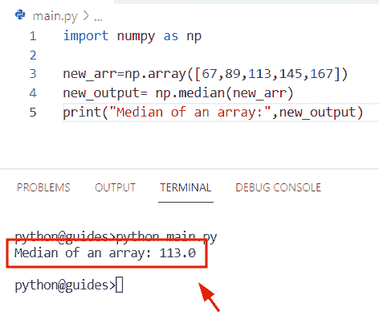

Python numpy median

此外，请查看: [Python NumPy 计数–实用指南](https://pythonguides.com/python-numpy-count/)

## Python numpy 中值滤波器

我们已经在 [Python NumPy filter](https://pythonguides.com/python-numpy-filter/) 文章中讨论过这个主题。您可以轻松获得关于 Python numpy 中值滤波器的所有信息。

## Python numpy 中值绝对偏差

*   在 Python 中，numpy 中值绝对偏差用于测量给定数组中的观察值。
*   为了计算中位数绝对偏差，我们可以很容易地使用 **mad=median(|xi-xm|)** 其中 xi 是数据，xm 是中值。

**举例:**

```py
import numpy as np

new_arr = ([17, 23, 55, 61, 63, 65,  71, 83])
new_result=np.median(np.absolute(new_arr - np.median(new_arr)))
print(new_result) 
```

下面是以下代码的截图

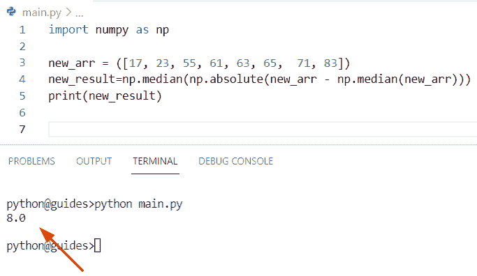

Python numpy median absolute deviation

阅读: [Python NumPy Replace +示例](https://pythonguides.com/python-numpy-replace/)

## Python numpy 中值示例

*   在本节中，我们将讨论如何在 Python 中使用 **numpy.median()** 函数。
*   在 Python 中，numpy median 用于生成 numpy 数组中的中值，该函数涉及许多参数，即轴。keepdims，它还用于指定用户需要操作的数据类型。
*   在这个例子中，我们将使用 axis 和 keepdims 参数来检查如何获得 numpy 数组的中值。

**举例:**

让我们举个例子，看看如何在 Python 中使用 **numpy.median()** 函数

**源代码:**

```py
import numpy as np

new_arr=np.array([[67,89,113,145,167],
                 [14,16,18,20,24],
                 [33,45,67,89,91]])
new_output= np.median(new_arr,axis=0)
new_output2= np.median(new_arr,axis=1,)
print("Axis row-wise median:",new_output)
print("Axis column-wise median",new_output2) 
```

在上面的程序中，我们在 **numpy.median()** 函数中使用了轴参数，它将计算行和列的中间值。

下面是以下给定代码的执行过程

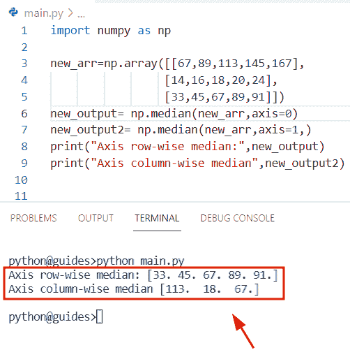

Python numpy median example

阅读: [Python NumPy 添加教程](https://pythonguides.com/python-numpy-add/)

## Python numpy 中值忽略 nan

*   在本节中，我们将学习如何在 Python 中计算 numpy 数组的中值并忽略 nan 值。
*   为了完成这项任务，我们将使用 **numpy.nanmedian()** 函数。这个函数将帮助用户返回数组值的中值，而忽略 nan 值。
*   该方法在 NumPy 包模块中可用，它涉及几个参数，并沿轴计算中值。

**语法:**

下面是 Python **numpy.nanmedian()** 函数的语法

```py
numpy.nanmedian
               (
                a,
                axis=None,
                out=None,
                overwrite_input=False,
                keepdims=<no value>
               )
```

**举例:**

让我们举个例子，看看如何在 Python 中使用 **numpy.nanmedian()** 函数

**源代码:**

```py
import numpy as np

new_arr=np.array([67,89,np.nan,145,np.nan])
new_output= np.nanmedian(new_arr)
print(new_output)
```

下面是以下给定代码的输出

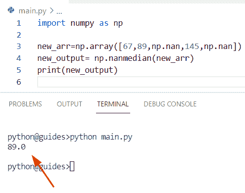

Python numpy median ignore nan

阅读: [Python 数字差异示例](https://pythonguides.com/python-numpy-diff/)

## Python numpy 中值二维数组

*   这里我们可以看到如何计算 Python 二维数组中的中值。
*   在本例中，我们将计算数组的中值，为了完成这项任务，首先我们将使用 **numpy.array()** 函数创建一个数组。现在我们将指定轴为 **1** ，它将找出输入数组的中值。

**语法:**

下面是 Python **numpy.median()** 函数的语法

```py
numpy.median
            (
             a,
             axis=None,
             out=None,
             overwrite_input=False,
             keepdims=False
            )
```

**举例:**

```py
import numpy as np

values=np.array([[10,12,14,18,26],
                [24,26,28,30,40]])
print("Creation of two-dimensional array:",values)
new_result= np.nanmedian(values,axis=1)
print(new_result)
```

下面是下面给出的代码的截图。

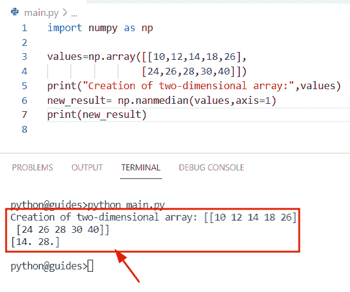

Python numpy median 2d array

另外，检查: [Python NumPy 2d 数组](https://pythonguides.com/python-numpy-2d-array/)

## Python np.median 轴

*   本节我们将讨论如何在 Python **numpy.median()** 函数中使用轴参数。
*   在本例中，我们将使用 axis 参数计算行和列的中间值。如果**轴=0** ，那么它有效地计算列的中间值，如果**轴=1** ，那么它将显示行的中间值。

**举例:**

```py
import numpy as np

new_arr=np.array([[14,24,34,44,64],
                 [9,13,17,21,25],
                 [33,45,67,89,91]])
dis_row= np.median(new_arr,axis=0)
dis_col= np.median(new_arr,axis=1,)
print("Axis row-wise median:",dis_row)
print("Axis column-wise median",dis_col)
```

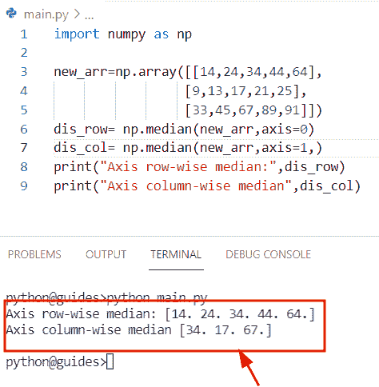

Python np median axis

阅读: [Python NumPy 数据类型](https://pythonguides.com/python-numpy-data-types/)

## Python numpy 加权中值

*   在这个程序中，我们将讨论如何计算 Python NumPy 数组的加权平均中值。
*   为了执行这个特定的任务，我们将使用 np.cumsum()方法。在 Python 中， **numpy.cumsum()** 用于生成 numpy 值的累积和。接下来，我们将使用 **np.searchsorted()** 函数，它用于查找一个值的索引，同时将它插入到一个排序的 numpy 数组中。
*   之后，我们声明了一个变量**‘weights’**，并指定了列表理解方法。一旦你将打印**‘权重’**，它将显示 numpy 数组加权中值。

**语法:**

下面是 Python **numpy.cumsum()** 函数的语法

```py
numpy.cumsum
            (
             a,
             axis=None,
             dtype=None,
             out=None
            )
```

*   它由几个参数组成
    *   **a:** 该参数表示输入数组。
    *   **轴:**默认情况下，它取 none 值，用于计算数组的总和。
    *   **dtype:** 这是一个可选参数，如果没有指定，则取整数值。

**举例:**

```py
import numpy as np

new_arr = np.array([[16, 278, 34, 41], [83, 38, 19, 10], [35,78,92,35], [104,245,943,145], [234,789,432,190]])

z = np.cumsum(new_arr, axis=1) 
new_ind = [np.searchsorted(row, row[-1]/2.0) for row in z]
weights = [m * 10 for m in new_ind] 

print("median masses is:",  weights)
print(new_arr)
print(np.hstack((z, z[:, -1, np.newaxis]/2.0)))
```

你可以参考下面的截图

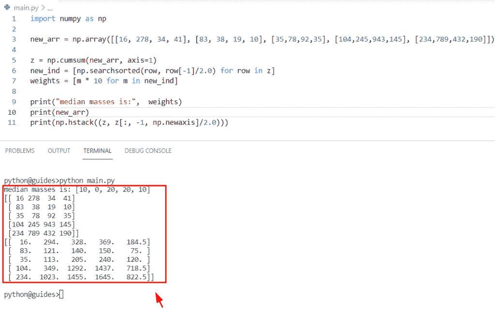

Python numpy weighted median

阅读: [Python NumPy 删除](https://pythonguides.com/python-numpy-delete/)

## 没有 numpy 的 Python 中值

*   在本节中，我们将讨论如何在不使用 numpy 的情况下在 Python 中获得中值。
*   为了完成这项任务，我们将使用 Python **median()** 函数。该函数获取一个样本值，并返回其中值，而不对列表进行排序。
*   例如，假设我们有一个包含雇员 id 号的列表。现在我们要计算一系列数字的中值。为了完成这项任务，我们将使用 **statistics.median()** 函数。中位数的数学公式是 **{(n+1)/2}** 。

**语法:**

下面是 Python**statistics . median()**的语法

```py
statistics.median(data)
```

**举例:**

让我们举个例子，检查一下如何在不使用 numpy 的情况下，在 Python 中求中值。

**源代码:**

```py
import statistics

employee_id = [16, 7, 15, 23, 89, 56, 67, 10, 24, 36, 57, 19]
new_median_value = statistics.median(employee_id)
print("Medain value of employees id:",new_median_value)
```

在下面给出的代码中，我们导入了统计模块，然后初始化了一个列表。之后，我们使用了 **statistics.median()** 函数，在这个函数中，我们分配了列表**‘雇员 id’**。一旦您将打印**‘新中值’**，那么结果将显示中值。

下面是以下给定代码的执行过程

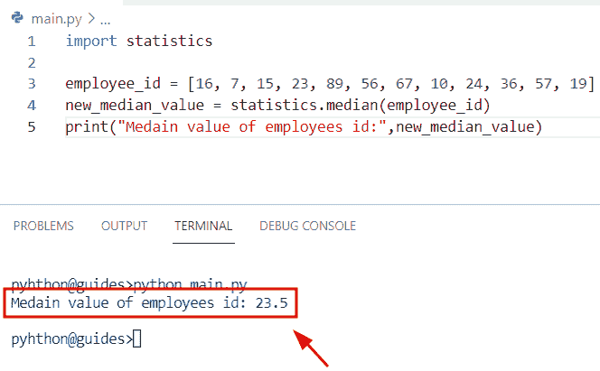

Python median without numpy

阅读: [Python Numpy 未找到–如何修复](https://pythonguides.com/python-numpy-not-found/)

## Python numpy 均方误差

*   在本节中，我们将讨论如何在 Python numpy 数组中计算均方误差。
*   在这个例子中，我们必须找到误差平方的平均值，基本上平方误差是在估计值和真实值之间。也叫回归问题。
*   在这个例子中，我们必须找到下面给定值的回归线。在 Python 中，我们可以通过使用 **y=mx+c** 很容易地找到回归线，其中 y 值将是预测值。
*   您必须在**‘x’**变量中插入随机值，以生成**‘y’**值。我们使用了**【7，8，9，4，3】**值，然后使用 **np.square()** 函数，在这个函数中，我们得到真实值和预测值之间的差异。
*   计算均方误差的数学公式为

```py
MSE = (1/n)∑i=1n
 (Xobs,i -Xmodel,i)² 
```

**源代码:**

```py
import numpy as np

new_values_true= [6,12,15,17,18]
new_values_predict= [4.4,4.8,5.2,3.2,2.8]
new_result = np.square(np.subtract(new_values_true,new_values_predict)).mean()
print("Mean squared error:",new_result)
```

在下面的代码中，我们导入了 numpy 库，然后声明了两个变量**‘new _ values _ true’**和**‘new _ values _ predict’**。它显示原始值和计算值

下面是下面给出的代码的截图。

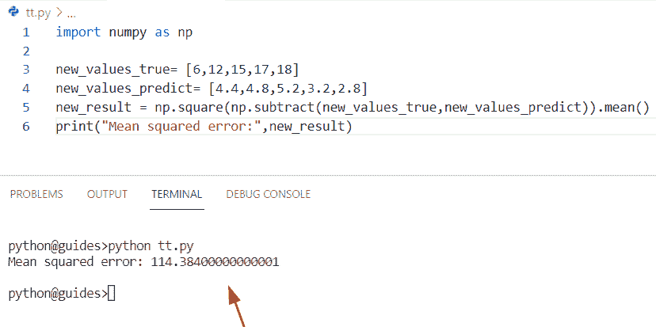

Python numpy mean squared error

阅读: [Python NumPy 最小教程](https://pythonguides.com/python-numpy-minimum/)

## Python numpy 平均绝对误差

*   在本节中，我们将讨论如何计算 Python numpy 数组中绝对误差的平均值。
*   为了执行这个特定的任务，我们将使用 **np.absolute()** 函数来获得平均绝对误差的绝对符号，这个方法将按元素计算绝对值。
*   在这个例子中，我们使用了 **np.sum()** 函数对所有元素求和。

**语法:**

下面是 Python **numpy.absolute()** 函数的语法

```py
numpy.absolute
              (
               x,
               /,
               out=None,
               *,
               where=True,
               casting='same_kind',
               order='K',
               dtype=None,
              )
```

**举例:**

```py
import numpy as np

arr1=np.array([23,34,56,78,9])
arr2= np.array([14,23,67,8,17])
result = np.sum(np.absolute((arr1 - arr2)))
print("Mean absolute error:",result.astype("int"))
```

你可以参考下面的截图

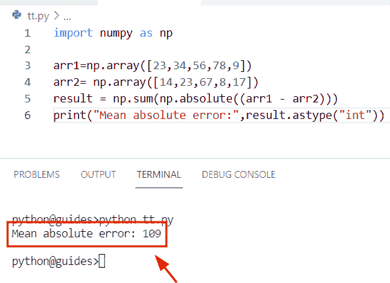

Python numpy mean absolute error

阅读: [Python NumPy 栈示例](https://pythonguides.com/python-numpy-stack/)

## Python 空切片的 numpy 均值

*   在这个程序中，我们将解决 Python 中的运行时错误警告**‘空切片的含义’**
*   在这个例子中，我们使用了 **numpy.nanmean()** 函数的概念。在 Python 中，此函数用于计算 numpy 数组的平均值，并忽略 nan 值。
*   在这个程序中，我们通过使用 **numpy.array()** 函数创建了一个简单的 numpy 数组，并为 np.nan 赋值。

**语法:**

下面是 **numpy.nanmean()** 函数的语法

```py
numpy.nanmean
             (
              a,
              axis=None,
              dtype=None,
              out=None,
              keepdims=<no value>
             )
```

**举例:**

```py
import numpy as np

new_arr = np.array([np.nan, np.nan,np.nan])
new_result = np.nanmean(new_arr)
print("Calculate mean:",new_result)
```

在下面给定的代码中，我们使用了 **np.nanmean()** 函数，在这个函数中，我们将 array 作为参数传递。

下面是以下给定代码的实现。

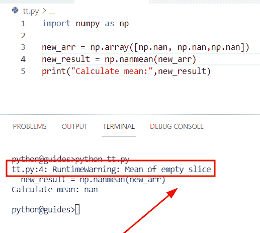

Python numpy mean of empty slice

正如您在屏幕截图中看到的，输出显示了运行时警告**，意思是空切片**。

### 解决方案

以下是运行时警告**‘空切片均值’**的解决方案

*   在这个例子中，我们将更新输入数组，就像我们将在其中插入整数一样。
*   运行时错误的原因是我们没有插入整数值。使用 **numpy.nanmean()** 函数时，必须至少使用一个非 nan 值。

**源代码:**

```py
import numpy as np

new_arr = np.array([12,13,np.nan, np.nan,np.nan])
new_result = np.nanmean(new_arr)
print("Calculate mean:",new_result)
```

下面是以下给定代码的实现。

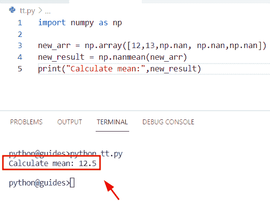

Solution of Python numpy mean of empty slice

阅读: [Python NumPy round + 13 示例](https://pythonguides.com/python-numpy-round/)

## Python numpy 每列的平均值

*   在这一节中，我们将讨论如何计算 Python numpy 数组中每一列的平均值。
*   在 Python 中，要计算 Numpy 数组中值的平均值，我们可以很容易地使用 **numpy.mean()** 函数。这个函数取一个数组中所有可用元素和轴的和，然后除以元素的个数。
*   该方法在 Numpy 包模块中可用，并返回数组元素的平均值。在本例中，我们将使用轴参数来计算列的平均值。如果轴是 **1** ，则方向水平穿过列。

**语法:**

下面是 Python **numpy.mean()** 函数的语法

```py
numpy.mean
          (
           a,
           axis=None,
           dtype=None,
           out=None,
           keepdims=<no value>,
           where=<no value>
          )
```

**举例:**

让我们举一个例子，看看如何计算 Python numpy 数组中每一列的平均值

**源代码:**

```py
import numpy as np

new_arr = np.array([[14,25,36,37],
                    [15,16,27,37]])
new_output = np.mean(new_arr,axis=1)
print("Calculate mean column-wise:",new_output)
```

下面是以下给定代码的实现

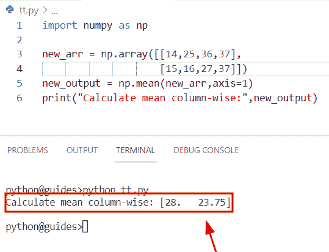

Python numpy mean of each column

正如您在屏幕截图中看到的，输出显示了数组的列平均值。

阅读: [Python NumPy 重复](https://pythonguides.com/python-numpy-repeat/)

## Python np.mean round

*   在本节中，我们将讨论如何对 Python NumPy 数组中的平均值进行舍入。
*   为了执行这个特定的任务，首先我们将创建一个数组并使用 **np.mean()** 函数。一旦你将打印**‘新输出’**，那么结果将显示数组的平均值。
*   之后，我们将使用 **numpy.round()** 函数并获取平均值的舍入值。

**举例:**

我们举个例子，检查一下如何使用 Python **numpy.round()** 函数。

**源代码:**

```py
import numpy as np

new_arr = np.array([12,34,56,78,54])
new_output = np.mean(new_arr)
print("Calculate mean of array:",new_output)
d= np.round(new_output)
print("Rounded value of mean:",d)
```

在上面的程序中，我们通过使用包含整数值的 **numpy.array()** 函数创建了一个数组。之后，我们在 **numpy.round()** 函数中赋值一个均值结果作为自变量。

下面是下面给出的代码的截图。

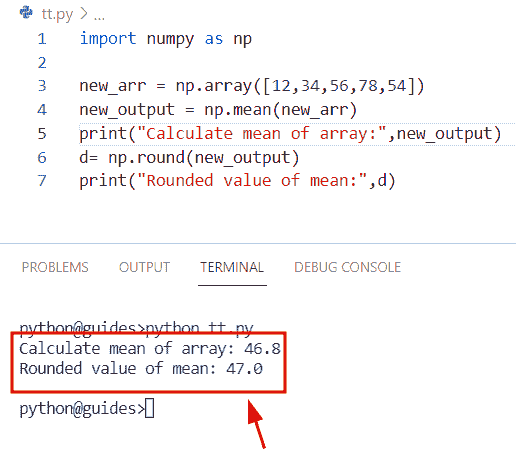

Python np mean round

阅读: [Python NumPy 3d 数组+示例](https://pythonguides.com/python-numpy-3d-array/)

## Python numpy 均方根

*   在本节中，我们将讨论如何在 Python numpy 数组中计算均方根值。
*   为了完成这个任务，我们将使用 **numpy.sqrt()** 函数。在此示例中，此函数将 numpy 数组作为参数，并计算数组中元素的平方根。

**举例:**

```py
import numpy as np

new_arr= np.array([12,14,16,18,20])
result=np.mean(new_arr**2)
print("Mean array:",result)
new_roo= np.sqrt(result)
print(new_roo)
```

你可以参考下面的截图

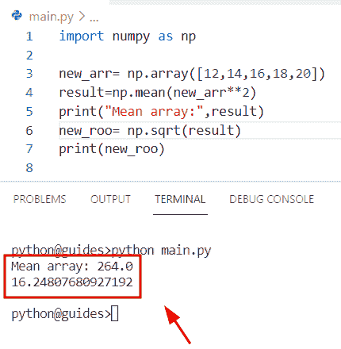

Python numpy root mean square

正如您在屏幕截图中看到的，输出显示了平均值的平方根。

阅读: [Python NumPy Split + 11 示例](https://pythonguides.com/python-numpy-split/)

## Python numpy reduce mean

*   在本期节目中，我们将学习如何使用 Python 中的 **numpy.mean()** 函数。
*   在 Python 中， **numpy.mean()** 函数用于查找 numpy 数组中值的平均值，它还将数组中所有可用的元素与轴相加，并除以元素的数量。

**语法:**

下面是 Python **numpy.mean()** 函数的语法

```py
numpy.mean
          (
           a,
           axis=None,
           dtype=None,
           out=None,
           keepdims=<no value>,
           where=<no value>
          )
```

**举例:**

```py
import numpy as np

new_values= np.array([16,23,26,29,30])
new_output =np.mean(new_values)
print("Mean value:",new_output)
```

下面是以下给定代码的输出

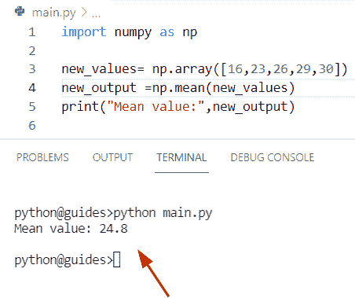

Python numpy reduce mean

阅读: [Python NumPy 规格化](https://pythonguides.com/python-numpy-normalize/)

## Python numpy 均值和标准差

*   在本节中，我们将学习如何使用 **numpy.std()** 函数计算 Python numpy 数组中的标准偏差。
*   在 Python 中，该函数将帮助用户测量数据中的方差以及均方差的平方根。
*   该方法在 Python numpy 包模块中可用，并且始终返回输入数组的标准偏差。

**语法:**

让我们看一下语法，了解一下 Python **numpy.std()** 函数的工作原理。

```py
numpy.std
         (
          a,
          axis=None,
          dtype=None,
          out=None,
          ddof=0,
          keepdims=<no value>,
          where=<no value>
         )
```

*   它由几个参数组成
    *   **a:** 该参数表示计算其值标准差的输入数组。
    *   **轴:**默认取 none 值，可选参数，用于计算标准差。它指示沿其计算标准差的轴。
    *   **dtype:** 该参数表示数据类型，默认取 float64 值。
    *   **out:** 该参数指定存储结果的输出数组。
    *   **ddof:** 表示自由度增量，除数用于 N-ddof 的计算，默认情况下，ddof 取零值。

**举例:**

让我们举一个例子，看看如何在 Python NumPy 数组中找到标准偏差

**源代码:**

```py
import numpy as np

new_values= np.array([7,18,16,14,12])
new_output =np.mean(new_values)
new_output2= np.std(new_values)
print("Mean value:",new_output)
print("Standard deviation:",new_output2) 
```

下面是以下给定代码的执行过程

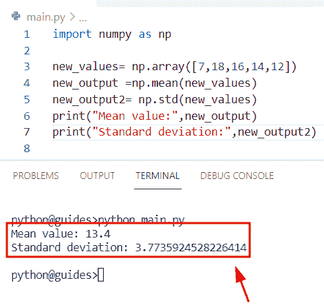

Python numpy mean and standard deviation

阅读:[Python NumPy Random【30 例】](https://pythonguides.com/python-numpy-random/)

## Python numpy 调和平均值

*   在本节中，我们将讨论如何在 Python numpy 数组中使用调和平均值。
*   为了执行这个特定的任务，我们将使用**statistics . harmonic _ mean()**函数。在 Python 中，此函数用于获取平均值的倒数之和，它也是一种数值平均值。

**举例:**

```py
import numpy as np
import statistics

arr= np.array([12,23,34,56])
new_output= statistics.harmonic_mean(arr)
print(new_output) 
```

在下面给出的代码中，我们导入了 numpy 和 statistics 库，然后使用 **numpy.array()** 函数初始化了一个数组。之后，我们使用了**统计数据。harmonic_mean()** 函数，它将计算所提供元素的调和平均值。

下面是以下代码的截图

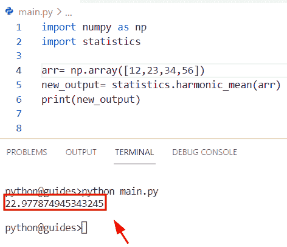

Python numpy harmonic mean

阅读: [Python NumPy 绝对值举例](https://pythonguides.com/python-numpy-absolute-value/)

## Python numpy 的意思是忽略零

*   在本节中，我们将讨论如何使用 NumPy Python 忽略均值数组中的零值。
*   为了完成这项任务，首先我们将使用 **numpy.array()** 函数创建一个数组。接下来，我们将声明一个变量**‘new _ output’**，并分配一个 **numpy.mean()** 函数。一旦你从数组中得到平均值。
*   您可以很容易地使用 **np.trim_zero()** 函数来忽略平均值结果中的零值。

**语法:**

下面是 Python numpy.trim_zeros()函数的语法

```py
numpy.trim_zeros
                (
                 filt,
                 trim='fb'
                )
```

**举例:**

```py
import numpy as np

new_arr=np.array([
    [18, 89, 12, 145, 167],
    [0, 0, 0, 0, 0]
    ])

new_output= np.mean(new_arr,axis=1)
print("Mean of an array:",new_output)
d = np.trim_zeros(new_output)

print("Ignore zero values:",d)
```

下面是以下给定代码的执行过程

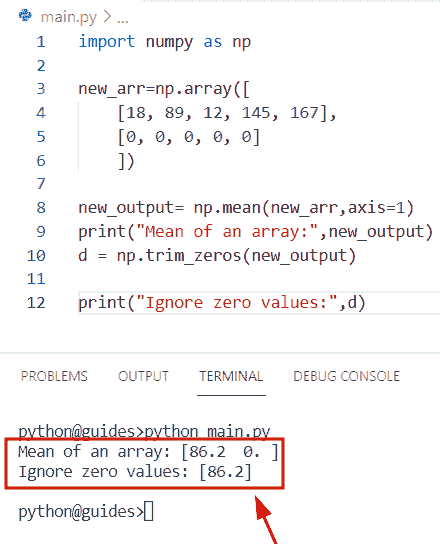

## Python numpy 平均值 vs 均值

我们已经在 [Python NumPy Average](https://pythonguides.com/python-numpy-average/) 文章中讨论过这个主题。在 Python 中，您可以获得关于 NumPy average 和 NumPy mean 之间差异的所有信息。

另外，看看更多的 Python NumPy 教程。

*   [Python NumPy 列举示例](https://pythonguides.com/python-numpy-to-list/)
*   [Python NumPy square 示例](https://pythonguides.com/python-numpy-square/)
*   [Python NumPy where with examples](https://pythonguides.com/python-numpy-where/)

在这个 Python NumPy 教程中，我们已经学习了如何使用 Python 中的 NumPy 数组来获得中位数。此外，使用 **Python NumPy 中值函数**，我们已经涵盖了这些主题。

*   Python numpy 中值滤波器
*   Python numpy 中值绝对偏差
*   Python numpy 中值示例
*   Python numpy 中值忽略 nan
*   Python numpy 中值 2d 数组
*   Python numpy 中值图像
*   Python np .中轴
*   Python numpy 加权中位数
*   不带 numpy 的 Python 中间值
*   Python numpy 均方误差
*   Python numpy 表示绝对误差
*   空切片的 Python numpy 均值
*   Python numpy 每列的平均值
*   Python np .均值回合
*   Python numpy 滚动中值
*   Python numpy 均方根
*   Python numpy reduce 均值
*   Python numpy 均值和标准差
*   Python numpy 调和平均
*   Python numpy 表示忽略零
*   Python numpy 平均值与平均值

[Bijay Kumar](https://pythonguides.com/author/fewlines4biju/)

Python 是美国最流行的语言之一。我从事 Python 工作已经有很长时间了，我在与 Tkinter、Pandas、NumPy、Turtle、Django、Matplotlib、Tensorflow、Scipy、Scikit-Learn 等各种库合作方面拥有专业知识。我有与美国、加拿大、英国、澳大利亚、新西兰等国家的各种客户合作的经验。查看我的个人资料。

[enjoysharepoint.com/](https://enjoysharepoint.com/)[](https://www.facebook.com/fewlines4biju "Facebook")[](https://www.linkedin.com/in/fewlines4biju/ "Linkedin")[](https://twitter.com/fewlines4biju "Twitter")