# Matplotlib 条形图标签

> 原文：<https://pythonguides.com/matplotlib-bar-chart-labels/>

[](https://sharepointsky.teachable.com/p/python-and-machine-learning-training-course)

在本 [Python 教程](https://pythonguides.com/python-download-and-installation/)中，我们将讨论 Python 中的 **Matplotlib 条形图标签**。在这里，我们将介绍使用 matplotlib 与条形图标签相关的不同示例。我们还将讨论以下主题:

*   Matplotlib 条形图标签
*   Matplotlib 条形图 x 轴标签
*   Matplotlib 条形图 y 轴标签
*   Matplotlib 条形图刻度标签
*   Matplotlib 条形图标签值
*   带字符串标签的 Matplotlib 条形图
*   Matplotlib 条形图标签垂直
*   Matplotlib 水平条形图标签
*   Matplotlib 条形图 x 轴标签水平
*   Matplotlib 条形图标签旋转
*   Matplotlib 条形图标签字体大小
*   Matplotlib 条形图文本标签
*   带标签的 Matplotlib 分组条形图
*   Matplotlib 条形图标签重叠
*   Matplotlib 条形图对角线刻度标签
*   带标签的 Matplotlib 堆积条形图

如果您是 Matplotlib 的新手，请查看[什么是 Matplotlib 以及如何在 Python 中使用它](https://pythonguides.com/what-is-matplotlib/)以及[如何安装 matplotlib python](https://pythonguides.com/how-to-install-matplotlib-python/)

目录

[](#)

*   [Matplotlib 条形图标签](#Matplotlib_bar_chart_labels "Matplotlib bar chart labels")
*   [Matplotlib 条形图 x 轴标签](#Matplotlib_bar_chart_x-axis_labels "Matplotlib bar chart x-axis labels")
*   [Matplotlib 条形图 y 轴标签](#Matplotlib_bar_chart_y-axis_labels "Matplotlib bar chart y-axis labels")
*   [Matplotlib 条形图刻度标签](#Matplotlib_bar_chart_tick_labels "Matplotlib bar chart tick labels")
*   [Matplotlib 条形图标签值](#Matplotlib_bar_chart_label_value "Matplotlib bar chart label value")
*   [带字符串标签的 Matplotlib 条形图](#Matplotlib_bar_chart_with_string_labels "Matplotlib bar chart with string labels")
*   [Matplotlib 条形图标签垂直](#Matplotlib_bar_chart_labels_vertical "Matplotlib bar chart labels vertical")
*   [Matplotlib 水平条形图标签](#Matplotlib_horizontal_bar_chart_labels "Matplotlib horizontal bar chart labels")
*   [Matplotlib 条形图 x 轴标签水平](#Matplotlib_bar_chart_x-axis_label_horizontal "Matplotlib bar chart x-axis label horizontal")
*   [Matplotlib 条形图标签旋转](#Matplotlib_bar_chart_label_rotation "Matplotlib bar chart label rotation")
    *   [Matplotlib 条形图标签旋转由 plt.xticks()](#Matplotlib_bar_chart_label_rotation_by_pltxticks "Matplotlib bar chart label rotation by plt.xticks()")
    *   [Matplotlib 条形图标签旋转 by ax.set_xticklabels()](#Matplotlib_bar_chart_label_rotation_by_axset_xticklabels "Matplotlib bar chart label rotation by ax.set_xticklabels()")
    *   [Matplotlib 条形图标签旋转 by ax.get_xticklabels()](#Matplotlib_bar_chart_label_rotation_by_axget_xticklabels "Matplotlib bar chart label rotation by ax.get_xticklabels()")
    *   [Matplotlib 条形图标签旋转 by ax.tick_params()](#Matplotlib_bar_chart_label_rotation_by_axtick_params "Matplotlib bar chart label rotation by ax.tick_params()")
*   [Matplotlib 条形图标签字体大小](#Matplotlib_bar_chart_label_font_size "Matplotlib bar chart label font size")
*   [Matplotlib 条形图文本标签](#Matplotlib_bar_chart_text_labels "Matplotlib bar chart text labels")
*   [带标签的 Matplotlib 分组条形图](#Matplotlib_grouped_bar_chart_with_labels "Matplotlib grouped bar chart with labels")
*   [Matplotlib 条形图标签重叠](#Matplotlib_bar_chart_labels_overlap "Matplotlib bar chart labels overlap")
*   [Matplotlib 条形图对角线刻度标签](#Matplotlib_bar_chart_diagonal_tick_labels "Matplotlib bar chart diagonal tick labels")
*   [带标签的 Matplotlib 堆积条形图](#Matplotlib_stacked_bar_chart_with_labels "Matplotlib stacked bar chart with labels")

## Matplotlib 条形图标签

在本节中，我们将了解 **matplotlib 条形图标签**。在开始这个话题之前，我们首先要了解一下**【标签】**是什么意思。

**标签**是条形图中条形的短语或名称。

**以下步骤用于向条形图添加标签，概述如下:**

*   **定义库:**导入在绘图中添加文本所需的重要库(用于数据创建和操作:Numpy，用于数据可视化:来自 matplotlib 的 pyplot)。
*   **定义 X 和 Y:** 定义用于 X 轴和 Y 轴的数据值。
*   **绘制条形图:**采用**条()**的方法绘制条形图。
*   **添加标签:**通过使用 **text()** 、 **xlabels()** 、 **ylabels()** 等函数，我们可以很容易地给条形图添加标签。
*   **显示:**为了显示图形，我们使用了 **show()** 函数。

## Matplotlib 条形图 x 轴标签

Matplotlib 为我们提供了在绘图的 x 轴上添加标签的功能。在这里，首先你知道如何绘制条形图，标签定义了 x 轴代表什么。

通过使用 **xlabels()** 方法，您可以轻松地在轴上添加标签。

**绘制条形图和定义 x 轴标签的语法如下:**

```py
**# Plot bar chart**
matplotlib.pyplot.bar(x, height)
**# Define x-axis labels**
matplotlib.pyplot.xlabels()
```

**上面定义的参数概述如下:**

*   **x:** 指定横条的 x 坐标。
*   **height:** 指定条形的 y 坐标。

**让我们看一个条形图上 x 轴标签的例子:**

```py
**# Import Library** import matplotlib.pyplot as plt

**# Define Data**

student = [3,2,0,5,9,1]
weight = [30,35,40,45,50,55]

**# Plot Graph**

plt.bar(weight,student) 

**# Define x-axis label**

plt.xlabel("Weight of the students")

**# Display Graph**

plt.show()
```

*   在上面的例子中，我们导入 **matplotlib.pyplot** 库，然后定义 x 坐标和 y 坐标。
*   **plt.bar()** 方法用于绘制条形图， **plt.xlabels()** 方法定义 x 轴代表什么。
*   最后，我们使用 **plt.show()** 来可视化条形图。

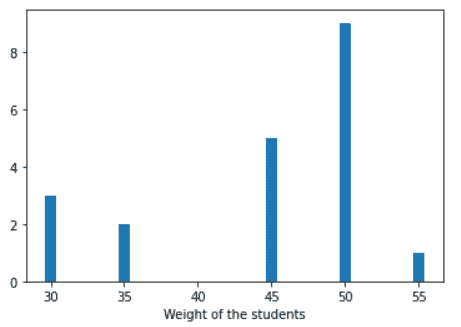

plt.xlabels() *“Labels on x-axis”*

读取: [Matplotlib 绘图误差线](https://pythonguides.com/matplotlib-plot-error-bars/)

## Matplotlib 条形图 y 轴标签

在本节中，我们将学习在绘图的 y 轴上添加标签。

通过使用 **ylabels()** 方法，我们可以很容易地在轴上添加标签。

**定义 y 轴标签的语法如下:**

```py
**# Y-axis label**
matplotlib.pyplot.ylabels()
```

**我们来看一个在 y 轴上添加标签的例子:**

```py
**# Import Library**

import matplotlib.pyplot as plt

**# Define Data**

student = [3,2,0,5,9,1]
weight = [30,35,40,45,50,55]

**# Plot Graph**

plt.bar(weight,student) 

**# Define y-axis label**

plt.ylabel("No.of students")

**# Display Graph**

plt.show()
```

这里我们使用 **bar()** 方法绘制条形图，使用 **ylabel()** 方法定义 **y 轴**标签。

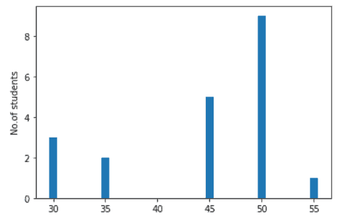

plt.ylabels() *“Labels on Y-axis”*

读取: [Matplotlib 移除刻度标签](https://pythonguides.com/matplotlib-remove-tick-labels/)

## Matplotlib 条形图刻度标签

首先，我们必须了解刻度标签是什么意思。基本上，记号是标记，标签是它们的名称。

或者我们可以说记号是代表轴上数据点的标记。

**添加刻度标签的语法如下:**

```py
# x-axis tick labels
matplotlib.axes.Axes.set_xticklabels(self,xlabel,fontdict=None,labelpad=None)
```

**上述使用的参数如下:**

*   **xlabel:** 指定标签文本。
*   **fontdict:** 指定字体样式的字典。
*   **labelpad:** 以磅为单位指定间距。

**让我们看一个设置刻度标签的例子:**

```py
**# Import Library**

import matplotlib.pyplot as plt

**# Define Data** 
x = [1, 2, 3, 4]
ax1 = plt.subplot()
ax1.set_xticks(x)
ax1.set_yticks(x)

**# plot bar chart**

plt.bar(x,[2,3,4,12])

**# Define tick labels**

ax1.set_xticklabels(["A","B","C","D"]) 
ax1.set_yticklabels([1, 2, 3, 4])

**# Display graph** 
plt.show()
```

*   在上面的例子中，我们列出了定义轴中使用的刻度的 **x** 。
*   在此之后，我们使用 **subplot()** 方法来获取图形的轴。
*   然后我们使用 **set_xticks()** 和 **set_yticks()** 方法来设置 X 轴和 Y 轴上的刻度。
*   **set_xticklabels()** 和 **set_yticklabels()** 方法用于设置你选择的刻度标签。
*   为了展示这个图，我们使用 **plt.show()** 方法。

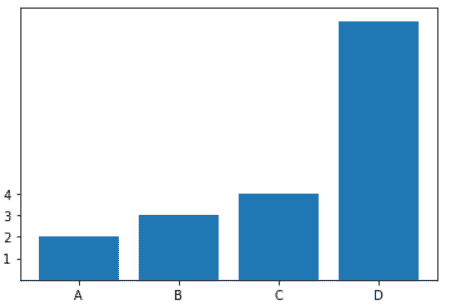

ax.set_xticklabels() and ax.set_yticklabels()

阅读: [Matplotlib 旋转刻度标签](https://pythonguides.com/matplotlib-rotate-tick-labels/)

## Matplotlib 条形图标签值

通过使用条形图，我们可以很容易地通过观察不同高度的条形来比较数据。默认情况下，条形图不会在每个条形上显示数值标签。

为了方便检查棒线的准确值，我们必须在棒线上添加值标签。通过使用 **plt.text()** 方法，我们可以很容易地添加数值标签。

Matplotlib 提供了根据您的选择定制值标签的功能。

**在条形图上添加数值标签的语法:**

```py
**# To add value labels**
matplotlib.pyplot.text(x, y, s, ha, vs, bbox)
```

**上面使用的参数定义如下:**

*   **x:**x——文本的坐标。
*   **y:**y-文本的坐标。
*   s: 指定要显示的值标签。
*   **ha:** 数值标签水平对齐。
*   **va:** 数值标签垂直对齐。
*   **bbox:** 指定标签值周围的矩形框。

为了更清楚地理解这个概念，我们来看一个例子:

```py
**# Import library**

import matplotlib.pyplot as plt

**# Function to add value labels**

def valuelabel(weight,students):
    for i in range(len(weight)):
        plt.text(i,students[i],students[i], ha = 'center',
                 bbox = dict(facecolor = 'cyan', alpha =0.8))

**# Main function**

if __name__ == '__main__':

    **# Define data**
    weight = ["35 Kg", "40 Kg", "43 Kg", "48 Kg", "65 Kg", "72    Kg"]
    students = [15, 12, 3, 5, 1, 2]

    **# Plot bar chart**
    plt.bar(weight, students, color= 'orange')

    **# Call function**
    valuelabel(weight, students)       

    **# Define labels**
    plt.xlabel("Weight of the students")
    plt.ylabel("Number of students")

    **# Display plot**
    plt.show()
```

*   在这里，我们创建了一个函数 **valuelabel()** ，用于将每个条形上的值相加。我们使用 **for 循环**来计算学生体重的长度，所以我们通过 **len()** 方法。
*   为了定制标签，我们将**水平对齐**参数设置为**居中**，并使用 **bbox** 参数来定义具有**样式的 box** 的字典。
*   **plt.text()** 方法用于添加数值标签，我们分别传递代表高度的 **i** 和代表要打印的字符串的**学生[i]** 。
*   在**主函数**中，我们定义了数据点，之后我们用 **plt.bar()** 方法来绘制条形图。
*   最后，我们在轴上定义标签，并使用 **plt.show()** 函数来可视化绘图或图表。

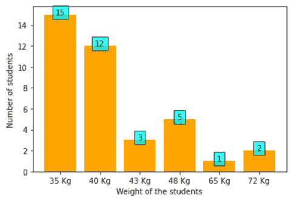

plt.text() *“Add label value”*

读取: [Matplotlib 改变背景颜色](https://pythonguides.com/matplotlib-change-background-color/)

## 带字符串标签的 Matplotlib 条形图

在这里，我们绘制了一个带有字符串数据类型标记的条形图。我们绘制了喜欢不同活动的学生人数之间的关系。

**让我们看一个带有字符串标签的条形图的例子:**

```py
**# Import Library**

import matplotlib.pyplot as plt

**# Define Data**

students = [5, 6, 2, 3]
activities= ["Joging", "Gyming", "Swimming", "Shopping"]

**# Plot bar chart**

plt.bar( activities, students, color= 'r')

**# Display chart**

plt.show()
```

*   在上面的例子中，我们简单地通过在**引号**中定义字符串数据类型的数据。
*   在这里，我们使用双引号定义了不同的活动，因此它们可以用字符串格式表示。
*   在这之后，我们使用 **plt.bar()** 方法绘制一个条形图，我们传递**颜色**参数并将其设置为红色以改变条形的颜色。

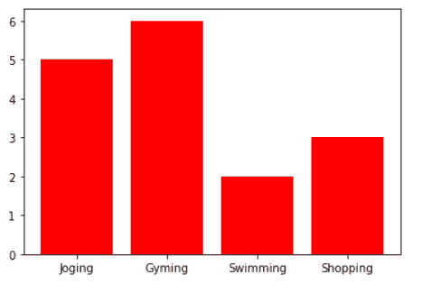

*“String labels”*

阅读: [Matplotlib 散点图标记](https://pythonguides.com/matplotlib-scatter-marker/)

## Matplotlib 条形图标签垂直

通过使用 **plt.bar()** 方法我们可以绘制条形图，通过使用 **xticks()、yticks()** 方法我们可以很容易地分别对齐 x 轴和 y 轴上的标签。

这里我们将**旋转**键设置为“**垂直”**，这样我们就可以在垂直方向上对齐条形图标签。

**让我们看一个垂直对齐标签的例子:**

```py
**# Import Library**

import matplotlib.pyplot as plt

**# Define Data** students = [5, 6, 2, 3]
subjects= ["English","Computers","Maths","Science"]

**# Plot bar chart**

plt.bar(subjects, students, color= 'm')

**# Vertical aligned**

plt.xticks(rotation='vertical')

                            **#OR**

plt.yticks(rotation='vertical')

**# Display chart**

plt.show()
```

*   在上面的例子中，我们导入了 **matplotlib.pyplot** 库，然后定义数据。
*   **plt.bar()** 方法用来绘制学生人数和他们喜欢的科目之间的条形图。
*   **plt.xticks()** 方法用于垂直对齐 xticks。
*   **plt.yticks()** 方法用于垂直对齐 yticks。

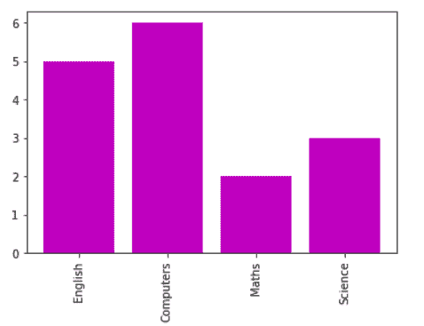

plt.xticks(rotation=’vertical’)

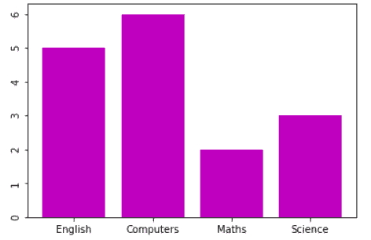

plt.yticks(rotation=’vertical’)

阅读: [Matplotlib 虚线](https://pythonguides.com/matplotlib-dashed-line/)

## Matplotlib 水平条形图标签

在本节中，我们将学习如何创建水平条形图，尤其是带有数据标签的条形图。

为了绘制一个水平条形图，我们使用 **barh()** 方法，我们得到每个条形的宽度，以便在条形图的条形上写入数据标签。

**绘制水平条形图的语法:**

```py
matplotlib.pyplot.barh(x, height)
```

*   **x:** 指定 x 坐标。
*   **高度:**指定 y 坐标。

**让我们看一个带有数据标签的水平条形图的例子:**

```py
**# Import Library** import matplotlib.pyplot as plt

**# Define Data**

grades = ["A","B","C","D","E","Fail"]
students = [15, 12, 3, 5, 1, 2]

**# Plot horizontal bar chart**

bars = plt.barh(grades,students)

**# To get data labels**

for  bar in bars:
    width = bar.get_width()
    label_y = bar.get_y() + bar.get_height() / 2
    plt.text(width, label_y, s=f'{width}')

**# Define axes labels**

plt.xlabel("No. of students")
plt.ylabel("Grades of students")

**# Display a bar chart**

plt.show() 
```

*   在上面的例子中，首先我们导入 **matplotlib.pyplot** 库，然后我们定义数据。
*   我们使用 **plt.barh()** 的方法绘制水平条形图。
*   现在，我们需要每个条形的宽度，为此我们通过使用 **bar.get_y()** 方法获得 y 轴标签的位置。
*   **plt.text()** 方法用于在每个条形上添加数据标签，我们使用宽度作为 x 位置和要显示的字符串。
*   最后，我们使用 **show()** 方法对条形图进行可视化。

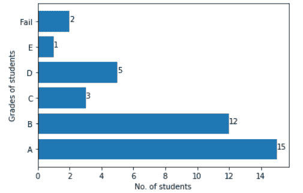

plt.barh()

阅读: [Matplotlib plot_date](https://pythonguides.com/matplotlib-plot-date/)

## Matplotlib 条形图 x 轴标签水平

通过使用 **xticks()** 方法，我们可以很容易地在 x 轴上对齐标签。这里我们必须将**旋转**键设置为“**水平”**，这样我们就可以在水平方向上对齐 x 轴上的条形图标签。

**让我们看一个水平对齐标签的例子:**

```py
**# Import Library**

import matplotlib.pyplot as plt

**# Define Data** 
students = [5, 6, 2, 3]
subjects= ["English","Computers","Maths","Science"]

**# Plot bar chart**

plt.bar(subjects, students, color= 'm')

**# Horizontal aligned**

plt.xticks(rotation='horizontal')

**# Display chart**

plt.show()
```

*   在上面的例子中，我们导入了 **matplotlib.pyplot** 库，然后定义数据。
*   **plt.bar()** 方法用来绘制学生人数和他们喜欢的科目之间的条形图。
*   **plt.xticks()** 方法用于对齐 xticks，我们传递旋转参数并将其值设置为水平。

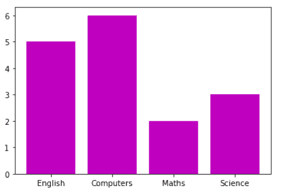

plt.xticks(rotation=’horizontal’)

> **注意:**当我们将旋转设置为水平时，x 轴标签没有变化，因为默认情况下 x 轴标签设置为水平。

阅读 [Matplotlib 另存为 pdf](https://pythonguides.com/matplotlib-save-as-pdf/)

## Matplotlib 条形图标签旋转

Matplotlib 提供了一个功能，可以根据您的选择旋转条形图的坐标轴标签。我们可以将标签设置到我们喜欢的任何角度。

**我们有不同的方法来旋转条形图标签:**

*   通过使用 plt.xticks()
*   通过使用 ax.set_xticklabels()
*   通过使用 ax.get_xticklabels()
*   通过使用 ax.tick_params()

### Matplotlib 条形图标签旋转由 plt.xticks()

这里我们使用 **plt.xticks()** 方法旋转 x 轴标签，并将**旋转**参数传递给它。我们将旋转值设置为 **30 度**。

**举例:**

```py
**# Import Library**

import matplotlib.pyplot as plt

**# Define Data**

students = [5, 6, 2, 3]
activities= ["Joging", "Gyming", "Swimming", "Shopping"]

**# Plot bar chart** 
plt.bar( activities, students, color= 'cyan')

**# Rotation of x-axis label**

plt.xticks(rotation=30)

**# display chart**

plt.show()
```


*Rotation of x-axis labels to 30 degrees*

### Matplotlib 条形图标签旋转 by ax.set_xticklabels()

这里我们使用 **ax.set_xticklabels()** 方法来旋转 x 轴标签，并传递想要旋转的**旋转**参数和**标签**。我们将旋转值设置为 **15 度**。

**举例:**

```py
**# Import Library**

import matplotlib.pyplot as plt

**# Define Data**

students = [5, 6, 2, 3]
activities= ["Joging", "Gyming", "Swimming", "Shopping"]

**# Plot bar chart**
ax = plt.subplot()

plt.bar( activities, students, color= 'cyan')

**# Rotate labels**

ax.set_xticklabels(activities, rotation=15)

**# display chart**

plt.show()
```

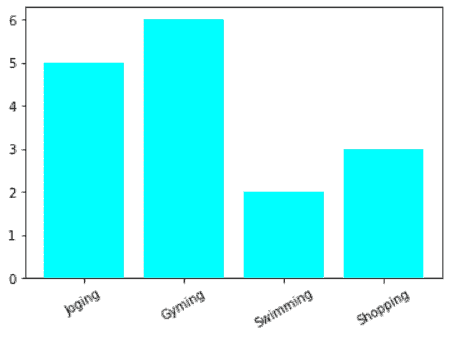

*“Rotation of x-axis labels to 15 degrees”*

### Matplotlib 条形图标签旋转 by ax.get_xticklabels()

这里我们使用 **ax.get_xticklabels()** 方法来旋转 x 轴标签。

然后我们将标签的**旋转**设置为 180 度。

这种方法的好处是我们得到了一个标签列表，我们遍历每个标签来设置它的旋转。

**举例:**

```py
**# Import Library**

import matplotlib.pyplot as plt

**# Define Data**

students = [5, 6, 2, 3]
activities= ["Joging", "Gyming", "Swimming", "Shopping"]

**# Plot bar chart**
ax = plt.subplot()

plt.bar( activities, students, color= 'cyan')

**# Rotate labels**

for label in ax.get_xticklabels(): 
    label.set_rotation(180)

**# display chart**

plt.show() 
```

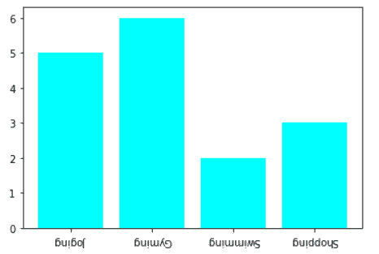

*“Rotation of bar chart label at 180 degrees”*

### Matplotlib 条形图标签旋转 by ax.tick_params()

这里我们使用 **ax.tick_params()** 方法来旋转标签。

然后我们传递**轴**和**标签旋转**参数，并将它们的值分别设置为 **x** 和 **65** 度。

**举例:**

```py
**# Import Library**

import matplotlib.pyplot as plt

**# Define Data** 
students = [5, 6, 2, 3]
activities= ["Joging", "Gyming", "Swimming", "Shopping"]

**# Plot bar chart**
ax = plt.subplot()

plt.bar( activities, students, color= 'cyan')

**# Rotate labels**

ax.tick_params(axis='x', labelrotation=65)

**# Display chart**

plt.show()
```

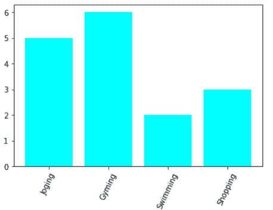

*“Labelroation at 65 degrees”*

读取: [Matplotlib 日志日志图](https://pythonguides.com/matplotlib-log-log-plot/)

## Matplotlib 条形图标签字体大小

我们可以改变被称为刻度标签的数据轴标签和告诉我们轴代表什么的 T2 轴标签的大小。

您只需传递参数 **fontsize** 并设置它们的值。

**让我们看一个改变标签字体大小的例子:**

```py
**# Import Library**

import matplotlib.pyplot as plt

**# Define Data**

students = [5, 6, 2, 3]
subjects= ["English","Computers","Maths","Science"]

**# Plot bar chart**

plt.bar(subjects, students)

**# Fontsize of tick labels** 
plt.xticks(fontsize=15,color='r')

**# Font size of axes labels**

plt.xlabel("Favourite subject", fontsize=15)
plt.ylabel("No.of.students", fontsize= 20)    

**# Display chart**

plt.show()
```

*   在上面的例子中，通过使用 **plt.bar()** 方法，我们绘制了一个条形图。
*   **plt.xticks()** 方法用于绘制条形图的刻度标签，我们给它传递一个参数 **fontsize** 和 **color** ，并分别将其值设置为 **15** 和 **red** 。
*   **plt.xlabel()** 方法绘制 x 轴标签，我们将**字体大小**设置为 **15** 。
*   **plt.ylabel()** 方法在 y 轴上绘制标签，我们传递 **fontsize** 参数并将其值设置为 **20** 。

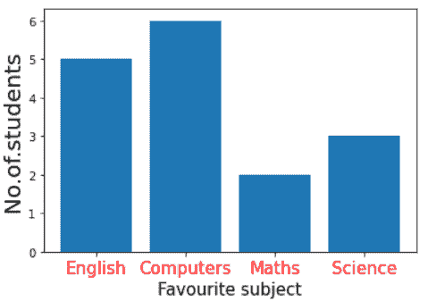

*“Font size change”*

阅读: [Matplotlib 支线剧情 _adjust](https://pythonguides.com/matplotlib-subplots_adjust/)

## Matplotlib 条形图文本标签

在这里，我们学习如何在条形图的特定条中添加文本标签。首先，您必须使用 **plt.bar()** 方法定义数据并绘制条形图。

这之后使用 **plt.text()** 方法在栏上添加文本标签。这里我们定义了位置，或者我们可以说文本标签的坐标为' **1 '，' y[1]'【T3]，这意味着我们要在条形图的 **2 条**上添加文本。**

**举例:**

```py
**# Import Library**

import matplotlib.pyplot as plt

**# Define Data**

x = ["A","B","C","D"]
y = [2, 6, 15, 10]

**# Plot bar chart**

plt.bar(x,y,color='pink')

**# Add Text Label**

plt.text(1,y[1],"Text Label",ha='center',fontsize=12)

**# Plot bar chart**

plt.show()
```

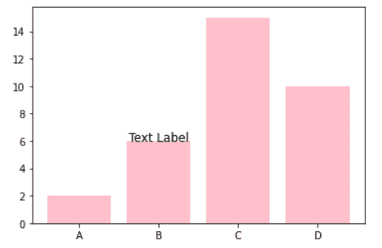

*“Text label at a specific position of the bar in bar chart”*

## 带标签的 Matplotlib 分组条形图

条形图用于比较一维或二维数据。当我们必须比较二维数据时，我们需要一个分组条形图。

**这里我们看到一个带有标签的分组条形图示例:**

```py
**# Import Library** 
import matplotlib.pyplot as plt
import numpy as np

**# Define data**

labels = ['A', 'B', 'C', 'D', 'E', 'Fail']

Term1 = [30, 14, 20, 5, 7, 15]
Term2 = [45, 12, 24, 2, 6, 5]
x = np.arange(len(labels)) 

**# Plot bar chart** 

width = 0.4
fig, ax = plt.subplots()
rect1 = ax.bar(x - width/2, Term1, label='Term1')
rect2 = ax.bar(x + width/2, Term2, label='Term2')

**# text in grouped bar chart**

for bar in ax.patches:
    value = bar.get_height()
    text = f'{value}'
    text_x = bar.get_x() + bar.get_width() / 2
    text_y = bar.get_y() + value
    ax.text(text_x, text_y, text, ha='center',color='r',size=12)

**# Add some text for labels,x-axis tick labels** 
ax.set_ylabel('No.of students')
ax.set_xlabel('Grades')
ax.set_xticks(x)
ax.set_xticklabels(labels)
ax.legend()

**# Display plot**

plt.show()
```

*   首先导入重要的库，如 **matplotlib.pyplot** 和 **numpy** 。之后，我们定义数据坐标和标签，并通过使用 **arrange()** 方法找到标签位置。
*   设置条形的**宽度**这里我们将其设置为 0.4。通过使用 **ax.bar()** 方法我们绘制了分组条形图。
*   然后我们使用 **for 循环**在条形图的每个条中添加一个文本标签。
*   **get_height()** 方法用于获取条形的高度并格式化我们使用的文本 **f'{value}** '。
*   为了得到 x 轴上每个条形的中点，我们使用了 **get_x()** 和 **get_width()** 方法。之后我们给 **get_y()** 方法加上高度，因为从 **get_y()** 开始。
*   最后，我们使用 **ax.text()** 方法在分组条形图的每个条上添加文本，并将它的**颜色**设置为红色，并将它的**大小**更改为 12。
*   **plt.show()** 方法用于可视化接地条形图。

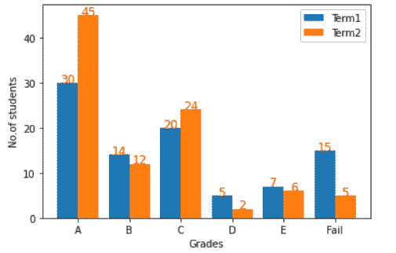

*“Grouped Bar Chart”*

阅读: [Matplotlib 最佳拟合线](https://pythonguides.com/matplotlib-best-fit-line/)

## Matplotlib 条形图标签重叠

在本节中，我们将讨论条形图标签开始相互重叠的情况。因此，我们必须对它们进行格式化，以便条形图看起来清晰。

让我们看看下面的例子:

```py
**# Import Library**

import matplotlib.pyplot as plt

**# Define Data** 

x = ['I am the Label 1', "I am the Label 2", "I am the Label 3", "I am the Label 4"]

y = [2, 4, 5, 6]

**# Plot Bar chart**

ax= plt.subplot()
plt.bar(x, y)

**# Display Chart** 
plt.show()
```

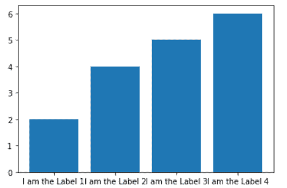

*“Overlapping Case In Bar Chart”*

在上面的输出中，您已经看到条形图的 x 轴标签相互重叠，看起来非常不整洁。

**现在，看看克服这个问题的解决方案:**

在 matplotlib 中，我们有一个函数 setp()，用于设置刻度标签旋转和对齐属性。

**setp()方法的语法如下:**

```py
matplotlib.pyplot.setp(object, **kwargs)
```

**上面使用的参数如下:**

*   **对象:**指定艺术家对象。
*   **kwargs:** 指定额外的属性来改变样式、旋转等。

**让我们借助一个例子来理解这个概念:**

```py
**# Import Library**

import matplotlib.pyplot as plt

**# Define Data** 

x = ['I am the Label 1', "I am the Label 2", "I am the Label 3", "I am the Label 4"]

y = [2, 4, 5, 6]

**# Plot Bar chart**

ax= plt.subplot()
plt.bar(x, y)

**# Function to avoid overlapping** plt.setp(ax.get_xticklabels(), rotation=30, ha='right')

**# Display Chart**

plt.show()
```

在上面的例子中，我们使用 **plt.setp()** 方法和 **get.xticklabels()** 方法来获取 ticklabels，我们通过**旋转**参数将其值设置为 **30 度**。

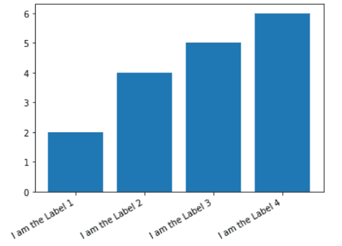

*“Bar Chart Labels without Overlapping”*

**结论！** **plt.setp()** 方法去除了重叠问题，我们得到了一个清晰的柱状图视图。

阅读: [Matplotlib 支线剧情教程](https://pythonguides.com/matplotlib-subplot-tutorial/)

## Matplotlib 条形图对角线刻度标签

要在对角线方向设置条形图刻度标签，我们必须将刻度**旋转**设置为 45 度，将**水平对齐**设置为向右。

**举例:**

```py
**# Import Library**

import matplotlib.pyplot as plt

**# Define Data** 

x = ['Label 1', "Label 2", "Label 3", "Label 4"]

y = [2, 4, 5, 6]

**# Plot Bar chart**

plt.bar(x, y)

**# Diagonal tick labels** plt.xticks(rotation=45, ha="right")

**# Display Chart**

plt.show()
```

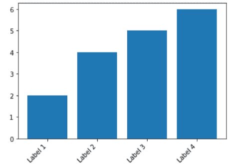

*“Diagonal Tick Labels”*

阅读: [Matplotlib 绘图条形图](https://pythonguides.com/matplotlib-plot-bar-chart/)

## 带标签的 Matplotlib 堆积条形图

堆积条形图显示数据类别之间的比较。每个条形段代表不同的部分或类别。

这里我们创建一个熊猫数据框来创建一个堆叠条形图。

**让我们看一个带标签的堆积条形图的例子:**

```py
**# Import libraries**

import matplotlib.pyplot as plt
import pandas as pd

**# Define Data**

df = pd.DataFrame({
    'Maths': [12, 15, 10, 3, 1, 5],
    'Science': [15, 10, 5, 4, 3, 6],
    'Computers':[20, 12, 5, 3, 5, 2]
})

labels = ['A','B','C','D','E','Fail']

**# Plot stacked bar chart**

ax = df.plot(stacked=True, kind='bar')

for bar in ax.patches:
    height = bar.get_height()
    width = bar.get_width()
    x = bar.get_x()
    y = bar.get_y()
    label_text = height
    label_x = x + width / 2
    label_y = y + height / 2
    ax.text(label_x, label_y, label_text, ha='center', va='center')

**# Set Tick labels**

ax.set_xticklabels(labels,rotation='horizontal')

**# Display chart**

plt.show()
```

*   在上面的例子中，我们导入了 **matplotlib.pyplot** 和 **pandas** 库。
*   之后，我们创建**数据帧**并定义标签。
*   然后通过使用 **plot()** 方法绘制堆积条形图。
*   我们将循环的**定义为小块，而**小块**包含图表中的所有内容。**
*   通过使用 **get_height()** 和 **get_width()** 方法得到高度和宽度。
*   最后，我们使用 **text()** 方法来定义每个堆叠棒线的高度。

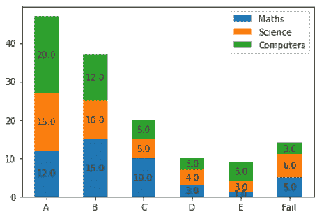

*“Stacked Bar Chart With Labels”*

另外，检查: [Matplotlib 散点图颜色](https://pythonguides.com/matplotlib-scatter-plot-color/)

在本 Python 教程中，我们已经讨论了**“Matplotlib 条形图标签”**，并且我们还介绍了一些与之相关的例子。这些是我们在本教程中讨论过的以下主题。

*   Matplotlib 条形图标签
*   Matplotlib 条形图 x 轴标签
*   Matplotlib 条形图 y 轴标签
*   Matplotlib 条形图刻度标签
*   Matplotlib 条形图标签值
*   带字符串标签的 Matplotlib 条形图
*   Matplotlib 条形图标签垂直
*   Matplotlib 水平条形图标签
*   Matplotlib 条形图 x 轴标签水平
*   Matplotlib 条形图标签旋转
*   Matplotlib 条形图标签字体大小
*   Matplotlib 条形图文本标签
*   带标签的 Matplotlib 分组条形图
*   Matplotlib 条形图标签重叠
*   Matplotlib 条形图对角线刻度标签
*   带标签的 Matplotlib 堆积条形图

[Bijay Kumar](https://pythonguides.com/author/fewlines4biju/)

Python 是美国最流行的语言之一。我从事 Python 工作已经有很长时间了，我在与 Tkinter、Pandas、NumPy、Turtle、Django、Matplotlib、Tensorflow、Scipy、Scikit-Learn 等各种库合作方面拥有专业知识。我有与美国、加拿大、英国、澳大利亚、新西兰等国家的各种客户合作的经验。查看我的个人资料。

[enjoysharepoint.com/](https://enjoysharepoint.com/)[](https://www.facebook.com/fewlines4biju "Facebook")[](https://www.linkedin.com/in/fewlines4biju/ "Linkedin")[](https://twitter.com/fewlines4biju "Twitter")