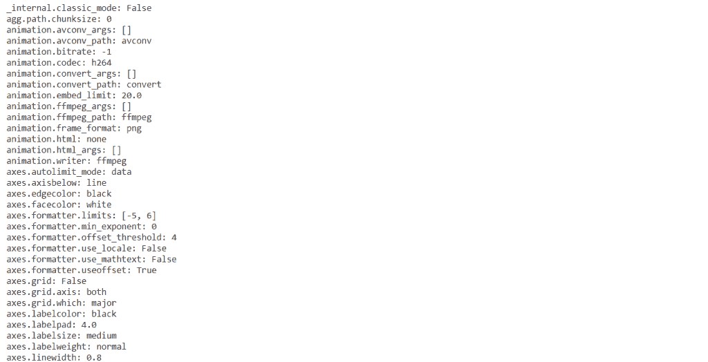
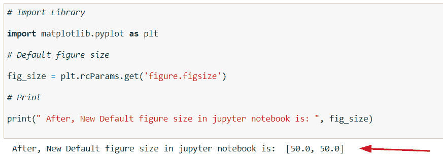
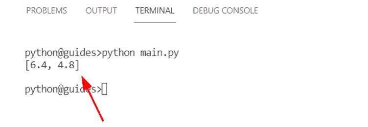
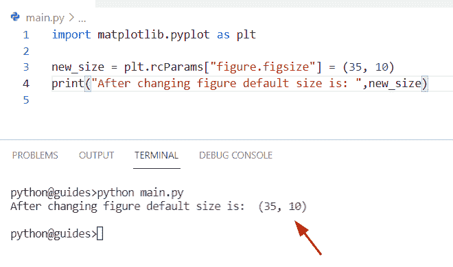

# Matplotlib 默认图形大小

> 原文：<https://pythonguides.com/matplotlib-default-figure-size/>

[](https://sharepointsky.teachable.com/p/python-and-machine-learning-training-course)

在本 [Python 教程](https://pythonguides.com/python-download-and-installation/)中，我们将讨论 Python 中的 **Matplotlib 默认图形大小**。这里我们将介绍使用 [matplotlib](https://pythonguides.com/what-is-matplotlib/) 改变默认图形大小的不同例子。我们还将讨论以下主题:

*   matplotlib 默认图形大小
*   木星笔记本 matplotlib 默认图大小
*   google colab matplotlib 默认图形大小
*   visual studio matplotlib 默认图形大小
*   spyder matplotlib 默认图形大小
*   jupiter lab matplotlib 默认图形大小

目录

[](#)

*   [matplotlib 默认图形尺寸](#matplotlib_default_figure_size "matplotlib default figure size")
*   [jupyter 笔记本 matplotlib 默认图尺寸](#jupyter_notebook_matplotlib_default_figure_size "jupyter notebook matplotlib default figure size ")
*   [Google colab matplotlib 默认图尺寸](#Google_colab_matplotlib_default_figure_size "Google colab matplotlib default figure size")
*   [Visual studio matplotlib 默认图尺寸](#Visual_studio_matplotlib_default_figure_size "Visual studio matplotlib default figure size")
*   [spyder matplotlib 默认图形尺寸](#spyder_matplotlib_default_figure_size "spyder matplotlib default figure size")
*   [jupyter lab matplotlib 默认图形大小](#jupyter_lab_matplotlib_default_figure_size "jupyter lab matplotlib default figure size")

## matplotlib 默认图形尺寸

要检查 matplotlib 中的默认图形尺寸，必须打印 matplotlib 的默认设置。

**打印默认设置的语法如下:**

```
**# Default all settings**

matplotlib.pyplot.rcParams
```

您也可以在 matplotlib 中仅检查默认图形大小。

**检查默认图形尺寸的语法:**

```
**# Default figure size**

matplotlib.pyplot.rcParams["figure.figsize"]

                        **OR**

matplotlib.pyplot.rcParams.get('figure.figsize)
```

**现在，让我们看一个在 matplotlib** 中检查默认设置的例子

```
**# Import Library**

import matplotlib.pyplot as plt

**# Check default settings**

print(plt.rcParams) 
```



*” Default settings “*

读取 [Matplotlib savefig 空白图像](https://pythonguides.com/matplotlib-savefig-blank-image/)

## jupyter 笔记本 matplotlib 默认图尺寸

在本节中，我们将检查**“jupyter notebook”**中图形的默认大小，并尝试根据需要进行更改。

**在 jupyter 笔记本中获取默认图形尺寸的语法如下:**

```
matplotlib.pyplot.rcParams.get('figure.figsize') 
```

**jupyter 笔记本示例:**

```
**# Import Library**

import matplotlib.pyplot as plt

**# Default figure size**

fig_size = plt.rcParams.get('figure.figsize')

**# Print**

print(" The Default figure size in jupyter notebook is: ", fig_size) 
```


*” Output of jupyter notebook “*

Matplotlib 提供了改变 **jupyter 笔记本**中图形默认尺寸的功能。

**举例:**

```
**# Import Library**

import matplotlib.pyplot as plt

**# New figure size** new_size = plt.rcParams["figure.figsize"] = (50,50)

**# Print**

print(" New figure size: ",new_size)
```


*” New Figure size set in jupyter notebook “*

更改默认体形大小后，现在检查默认体形大小设置发生了什么变化:

**代码:**

```
**# Import Library**

import matplotlib.pyplot as plt

**# Default figure size**

fig_size = plt.rcParams.get('figure.figsize')

**# Print**

print(" After, New Default figure size in jupyter notebook is: ", fig_size) 
```



*” Output after changing Default Figure Size “*

阅读[蟒龟圈](https://pythonguides.com/python-turtle-circle/)

## Google colab matplotlib 默认图尺寸

在本节中，我们将检查**“Google colab”**中图形的默认大小，并尝试根据需要进行更改。

**在 google colab 中获取默认图形尺寸的语法如下:**

```
matplotlib.pyplot.rcParams.get('figure.figsize') 
```

**Google colab 的例子:**

```
**# Import Library**

import matplotlib.pyplot as plt

**# Default figure size**

fig_size = plt.rcParams.get('figure.figsize')

**# Print**

print(" The Default figure size in google colab is: ", fig_size) 
```


*” Output of google colab “*

Matplotlib 提供了在 **google colab** 中改变图形默认大小的功能。

**举例:**

```
**# Import Library**

import matplotlib.pyplot as plt

**# New figure size**

new_size = plt.rcParams["figure.figsize"] = (20,15)

**# Print**

print(" New figure size: ",new_size)
```


*” New Figure size set in google colab “*

现在让我们看看更改默认体形大小后，默认体形大小设置会发生什么变化:

**代码:**

```
**# Import Library** 
import matplotlib.pyplot as plt

**# Default figure size** 
fig_size = plt.rcParams.get('figure.figsize')

**# Print**

print(" After, New Default figure size in google colab is: ", fig_size)
```


*” Output after changing Default Figure Size “*

读取 [Matplotlib 另存为 png](https://pythonguides.com/matplotlib-save-as-png/)

## Visual studio matplotlib 默认图尺寸

在本节中，我们将检查**“visual studio”**中图形的默认大小，并根据需要尝试更改它。

**在 visual studio 中获取默认图形大小的语法如下:**

```
matplotlib.pyplot.rcParams.get('figure.figsize') 
```

**visual studio 的例子:**

```
**# Import Library**

import matplotlib.pyplot as plt

**# Default figure size**

print(plt.rcParams.get('figure.figsize')) 
```



*” Output of visual studio “*

Matplotlib 提供了在 **visual studio** 中改变图形默认尺寸的功能。

**举例:**

```
**# Import Library**

import matplotlib.pyplot as plt

**# New figure size**

new_size = plt.rcParams["figure.figsize"] = (35, 10)

**# Print**

print("After changing figure default size is: ",new_size)
```



“ *Output after changing figure size “*

读取 [Matplotlib 条形图标签](https://pythonguides.com/matplotlib-bar-chart-labels/)

## spyder matplotlib 默认图尺寸

在本节中，我们将检查**“spyder”**中图形的默认大小，并根据需要尝试更改它。

**spyder 中获取默认图形尺寸的语法如下:**

```
matplotlib.pyplot.rcParams.get('figure.figsize') 
```

**spyder 笔记本示例:**

```
 # **Import Library**

import matplotlib.pyplot as plt

**# Default figure size**

fig_size = plt.rcParams.get('figure.figsize')

**# Print**

print(" The Default figure size in jupyter notebook is: ", fig_size) 
```


*” Output of spyder “*

Matplotlib 提供了改变 **spyder** 中图形默认尺寸的功能。

**举例:**

```
 **# Import Library**

import matplotlib.pyplot as plt

**# New figure size** new_size = plt.rcParams["figure.figsize"] = (15,20)

**# Print**

print(" New figure size: ",new_size) 
```


*” New Figure size set in spyder “*

另外，阅读 Python 中的[添加文本到绘图 matplotlib](https://pythonguides.com/add-text-to-plot-matplotlib/)

## jupyter lab matplotlib 默认图形大小

在这里，我们将检查**“jupyter lab”**中图形的默认大小，并根据需要尝试更改。

**在 jupyter lab 中获取默认图形尺寸的语法如下:**

```
matplotlib.pyplot.rcParams.get('figure.figsize') 
```

**jupyter 实验室示例:**

```
**# Import Library**

import matplotlib.pyplot as plt

**# Default figure size**

fig_size = plt.rcParams.get('figure.figsize')

**# Print**

print(" The Default figure size in jupyter lab is: ", fig_size) 
```


*” Output of jupyter lab “*

Matplotlib 提供了改变 **jupyter lab** 中图形默认尺寸的功能。

**举例:**

```
**# Import Library**

import matplotlib.pyplot as plt

**# New figure size**

new_size = plt.rcParams["figure.figsize"] = (45, 52)

**# Print**

print(" New figure size: ",new_size) 
```


*” New Figure size set in jupyter lab “*

现在让我们看看更改默认体形大小后，默认体形大小设置会发生什么变化:

**代码:**

```
**# Import Library** 
import matplotlib.pyplot as plt

**# Default figure size** 
fig_size = plt.rcParams.get('figure.figsize')

**# Print**

print(" After, New Default figure size in jupyter lab is: ", fig_size) 
```


*” Output after changing Default Figure Size “*

您可能会喜欢以下 Matplotlib 教程:

*   [Matplotlib 绘图误差线](https://pythonguides.com/matplotlib-plot-error-bars/)
*   [Matplotlib Plot NumPy 数组](https://pythonguides.com/matplotlib-plot-numpy-array/)
*   [水平线 matplotlib](https://pythonguides.com/horizontal-line-matplotlib/)
*   [Matplotlib 移除刻度标签](https://pythonguides.com/matplotlib-remove-tick-labels/)
*   [Matplotlib 旋转刻度标签](https://pythonguides.com/matplotlib-rotate-tick-labels/)
*   [Matplotlib 改变背景颜色](https://pythonguides.com/matplotlib-change-background-color/)
*   [Matplotlib 散点图标记](https://pythonguides.com/matplotlib-scatter-marker/)
*   [Matplotlib 标题字体大小](https://pythonguides.com/matplotlib-title-font-size/)
*   [Matplotlib tight_layout](https://pythonguides.com/matplotlib-tight-layout/)

在本 Python 教程中，我们已经讨论了**“Matplotlib 默认图形大小”**，并且我们还涵盖了一些与之相关的示例。这些是我们在本教程中讨论过的以下主题。

*   matplotlib 默认图形大小
*   木星笔记本 matplotlib 默认图大小
*   google colab matplotlib 默认图形大小
*   visual studio matplotlib 默认图形大小
*   spyder matplotlib 默认图形大小
*   jupiter lab matplotlib 默认图形大小

[Bijay Kumar](https://pythonguides.com/author/fewlines4biju/)

Python 是美国最流行的语言之一。我从事 Python 工作已经有很长时间了，我在与 Tkinter、Pandas、NumPy、Turtle、Django、Matplotlib、Tensorflow、Scipy、Scikit-Learn 等各种库合作方面拥有专业知识。我有与美国、加拿大、英国、澳大利亚、新西兰等国家的各种客户合作的经验。查看我的个人资料。

[enjoysharepoint.com/](https://enjoysharepoint.com/)[](https://www.facebook.com/fewlines4biju "Facebook")[](https://www.linkedin.com/in/fewlines4biju/ "Linkedin")[](https://twitter.com/fewlines4biju "Twitter")