# Python NumPy 3d 数组+示例

> 原文：<https://pythonguides.com/python-numpy-3d-array/>

[](https://sharepointsky.teachable.com/p/python-and-machine-learning-training-course)

在这个 [Python 教程](https://pythonguides.com/python-download-and-installation/)中，我们将学习**如何在 Python** 中使用三维 NumPy 数组。此外，我们将涵盖这些主题。

*   Python numpy 3d 数组切片
*   Python numpy 3d 数组转 2d
*   Python numpy 3d 数组轴
*   Python 绘图 3d 数字数组
*   Python 3d 列表到 numpy 数组
*   Python numpy 转置 3d 数组
*   Python numpy sum 3d 数组
*   Python numpy 定义 3d 数组
*   Python numpy rotate 3d array
*   Python numpy 3d 示例
*   Python numpy where 3d 数组
*   Python numpy 空 3d 数组
*   将 3d 数组整形为 2d python 数字
*   Python numpy 初始化 3d 数组
*   Python numpy append 3d 阵列
*   Python numpy 连接 3d 数组

目录

[](#)

*   [Python Numpy 3d 数组](#Python_Numpy_3d_array "Python Numpy 3d array")
    *   [如何在 Python 中创建 3d numpy 数组](#How_to_create_3d_numpy_array_in_Python "How to create 3d numpy array in Python")
*   [Python numpy 3d 数组切片](#Python_numpy_3d_array_slicing "Python numpy 3d array slicing")
*   [Python Numpy 3d 数组转 2d](#Python_Numpy_3d_array_to_2d "Python Numpy 3d array to 2d")
*   [Python numpy 3d 数组轴](#Python_numpy_3d_array_axis "Python numpy 3d array axis")
*   [Python 绘制 3d numpy 数组](#Python_plot_3d_numpy_array "Python plot 3d numpy array")
*   [Python 3d 列表到 numpy 数组](#Python_3d_list_to_numpy_array "Python 3d list to numpy array")
*   [Python numpy 转置 3d 数组](#Python_numpy_transpose_3d_array "Python numpy transpose 3d array")
*   [Python numpy sum 3d 数组](#Python_numpy_sum_3d_array "Python numpy sum 3d array")
*   [Python numpy 定义 3d 数组](#Python_numpy_define_3d_array "Python numpy define 3d array")
*   [Python numpy 旋转 3d 数组](#Python_numpy_rotate_3d_array "Python numpy rotate 3d array")
*   [Python numpy where 3d 数组](#Python_numpy_where_3d_array "Python numpy where 3d array")
*   [Python numpy 空 3d 数组](#Python_numpy_empty_3d_array "Python numpy empty 3d array")
*   [将 3d 数组整形为 2d python numpy](#Reshape_3d_array_to_2d_python_numpy "Reshape 3d array to 2d python numpy")
*   [Python numpy 初始化 3d 数组](#Python_numpy_initialize_3d_array "Python numpy initialize 3d array")
*   [Python numpy 追加 3d 数组](#Python_numpy_append_3d_array "Python numpy append 3d array")
*   [Python numpy 串接 3d 数组](#Python_numpy_concatenate_3d_array "Python numpy concatenate 3d array")

## Python Numpy 3d 数组

*   在这一节中，我们将讨论如何在 Python 中创建一个三维数组。
*   Numpy 提供了一个函数，允许我们操作可以访问的数据。三维意味着我们可以对每个维度使用嵌套层次的数组。
*   要创建三维 numpy 数组，我们可以使用简单的 **numpy.array()** 函数来显示三维数组。

**举例:**

我们举个例子，了解一下如何用一个特定的值创建一个三维数组。

**源代码:**

```py
import numpy as np

arr1 = np.array([[[2,17], [45, 78]], [[88, 92], [60, 76]],[[76,33],[20,18]]])
print("Create 3-d array:",arr1)
```

下面是以下给定代码的实现

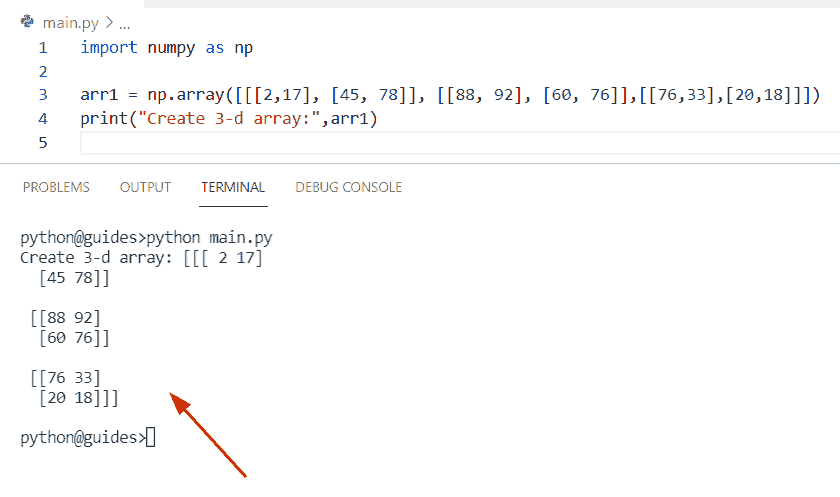

Python Numpy 3d array

另外，请阅读， [Python NumPy 最小值](https://pythonguides.com/python-numpy-minimum/)

### 如何在 Python 中创建 3d numpy 数组

通过使用 NumPy**shape()**，我们可以很容易地在 Python 中创建 3d NumPy 数组。在 Python 中，此方法用于在不修改数组元素的情况下形成 NumPy 数组。

**举例:**

```py
import numpy as np

new_arr = np.array([[ 78,  23,  41,  66],
              [ 109,  167,  41,  28],
              [ 187, 22, 76, 88]])
b = new_arr.reshape(3, 2, 2)
print(b)
```

在上面的代码中，我们首先导入 Python NumPy 库，然后使用 **np.array** 创建一个数组。现在使用 **reshape()** 方法，其中我们已经传递了数组的形状和大小。

下面是以下代码的截图

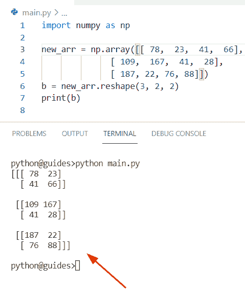

Python Numpy 3d array

阅读: [Python NumPy 数组+示例](https://pythonguides.com/python-numpy-array/)

## Python numpy 3d 数组切片

*   在本期节目中，我们将讨论如何使用 Python 中的切片技术创建一个 numpy 3d 数组。
*   在 Python 中，要分割数组，我们可以很容易地使用索引，这种方法将元素从一个索引转移到另一个索引。
*   在 Python 中，切片步骤是**开始:结束:步骤**。第一个参数是 start，如果我们在示例中没有传递这个参数，那么默认情况下它取为 **0** 。而在 end 参数的情况下，它将被认为是数组的长度。

**举例:**

让我们举一个例子，在一个 **Python NumPy 数组**中切片元素。

```py
import numpy as np

new_arr2 = np.array([[[178, 189, 567], [145, 239, 445], [197, 345, 678]],
                [[56, 78, 190], [46, 10, 11], [6, 2, 1]],
                [[45, 118, 203], [72, 119, 34], [87, 9, 5]]])

d= new_arr2[:2, 1:, :2]
print("slicing array:",d)
```

在上面的代码中，我们刚刚创建了一个简单的数组，然后对它应用切片方法。在这个例子中，我们选择了数组的长度为 **2** 。

下面是以下给定代码的输出

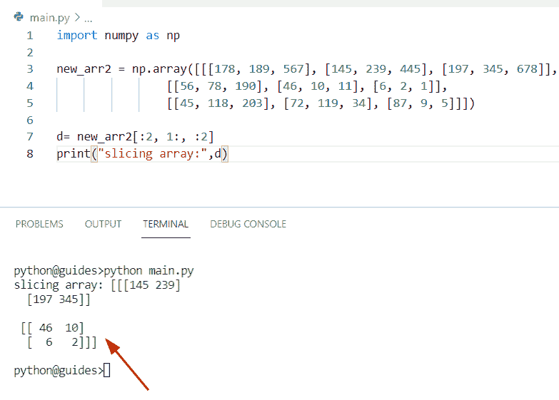

Python numpy 3d array slicing

读取:[检查 Python 中的 NumPy 数组是否为空](https://pythonguides.com/check-if-numpy-array-is-empty/)

## Python Numpy 3d 数组转 2d

*   在本节中，我们将讨论如何在 Python 中将三维 numpy 数组转换为二维数组。
*   为了执行这个特定的任务，我们可以使用 numpy reshape()方法，这个函数将帮助用户将三维数组重新整形为二维数组。在 Python 中，整形意味着我们可以在不改变元素的情况下轻松修改数组的形状。

**语法:**

下面是 numpy.reshape()方法的语法

```py
numpy.reshape
             (
              arr,
              newshape,
              order='C'
             )
```

**源代码:**

```py
import numpy as np

new_arr2 = np.array([[[13, 9],
        [161, 23]],

       [[128, 219],
        [109, 992]],

       [[42,  34],
        [ 128,  398]],

       [[236,  557],
        [645, 212]]])
b= np.reshape(new_arr2,(4,4))
print(b)
```

在上面的程序中，我们已经传递了数组**‘new _ arr’**以及数组的大小(行数和列数)。一旦你将打印**‘b’**，那么输出将显示新的数组。

下面是以下代码的截图

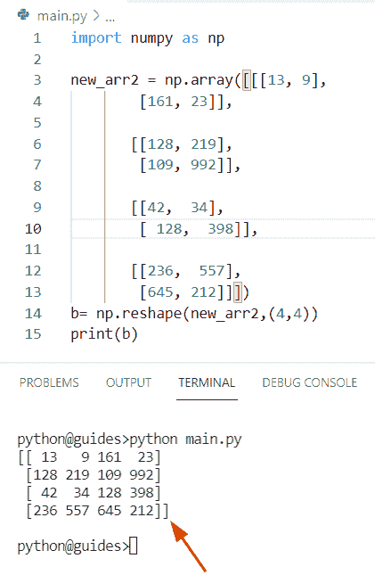

Python numpy 3d array to 2d

阅读: [Python NumPy Sum +示例](https://pythonguides.com/python-numpy-sum/)

## Python numpy 3d 数组轴

*   在这个程序中，我们将讨论如何在 Python 中创建一个带有轴的三维数组。
*   这里我们先用 **numpy.array()** 函数创建两个 numpy 数组 **'arr1'** 和 **'arr2'** 。现在使用 concatenate 函数并将它们存储到**‘result’**变量中。在 Python 中，concatenate 方法将帮助用户沿着轴连接两个或多个相同形状的 numpy 数组。
*   在本例中，我们将轴设置为 **0** ，表示水平连接的数组。

**源代码:**

```py
import numpy as np

arr1 = np.array([[2,6,7],[16,14,111]])
arr2 = np.array([[73,27,41],[77,21,19]])
result = np.concatenate([arr1, arr2], axis = 0)
print(result)
```

下面是以下给定代码的输出

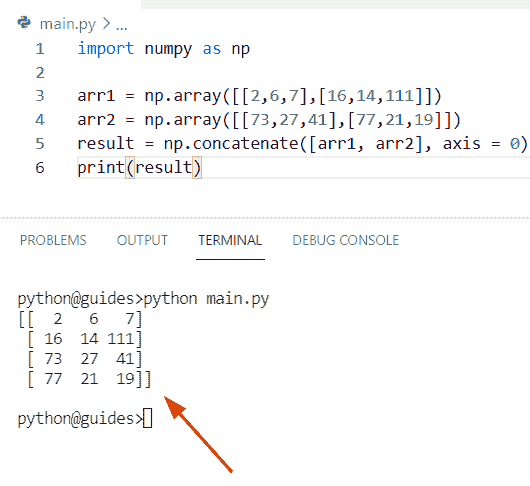

Python numpy 3d array axis

阅读: [Python NumPy zeros +示例](https://pythonguides.com/python-numpy-zeros/)

## Python 绘制 3d numpy 数组

*   这里我们可以看到**如何用 Python** 绘制一个三维 numpy 数组。
*   在本例中，我们导入了 matplotlib 库，用于绘制 **3-d** 图，同时导入了轴 3d 的 mpl_toolkits 模块，用于添加轴 3d 类型的新轴。
*   在这里，我们可以将“结果”定义为一个带有三维投影的典型子图，然后使用切片方法来创建线条对象。
*   一旦你将使用 **plt.figure()** 然后它创建一个图形对象，并且 **plt.show()** 打开一个显示我们的图形的交互窗口。

**源代码:**

```py
import matplotlib.pyplot as plt, numpy as np
from mpl_toolkits.mplot3d import Axes3D

arr1= np.array([[52,89,54], [103,423,934], [897,534,118]])
new_val = plt.figure()
result = new_val.add_subplot(122, projection='3d')
result.plot(arr1[:,0],arr1[:,1],arr1[:,2])
plt.show()
```

你可以参考下面的截图

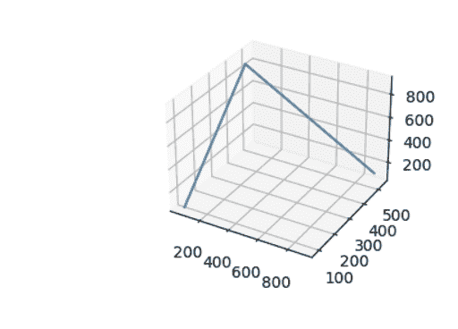

Python plot 3d numpy array

片段的屏幕截图:

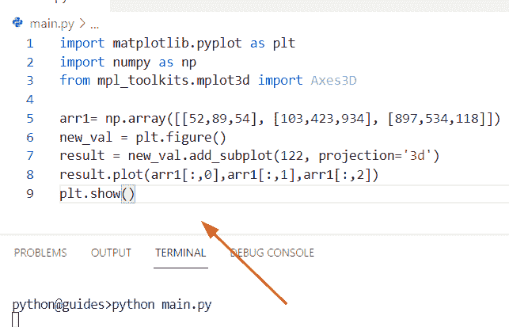

Python plot 3d numpy array

阅读: [Python NumPy arange](https://pythonguides.com/python-numpy-arange/)

## Python 3d 列表到 numpy 数组

*   让我们看看如何使用 Python 将列表转换成 3d numpy 数组。
*   在这个例子中，我们必须将列表转换成一个三维数组。为了完成这个任务，我们将创建一个名为**‘new _ lis’**的列表，然后使用 **np.asarray()** 方法将输入列表转换为 numpy 数组，这个函数在 numpy 模块中可用。

**语法:**

下面是 **numpy.asarray()** 方法的语法

```py
numpy.asarray
             (
              a,
              dtype=None,
              order=None,
              like=None
             )
```

**来源** **代号:**

```py
import numpy as np

new_lis = [[23, 45, 278],[ 189, 234, 445],[ 567, 421, 109],[ 18, 21, 188]]
new_output = np.asarray(new_lis)
print(new_output)
```

下面是以下给定代码的实现

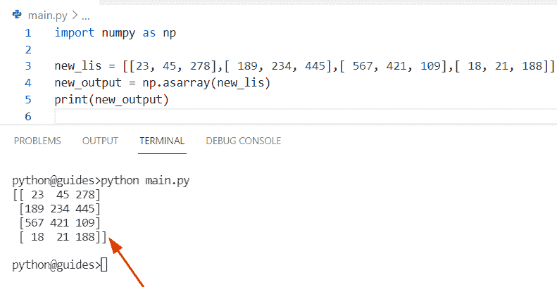

Python 3d list to numpy array

正如您在截图中看到的，输出是 Python 中的一个三维 NumPy 数组。

阅读: [Python NumPy append + 9 示例](https://pythonguides.com/python-numpy-append/)

## Python numpy 转置 3d 数组

*   在这一节中，我们将讨论如何在 Python 中转置一个三维数组。
*   在本例中，我们创建了一个简单的 numpy 数组，在其中传递一个整数值。现在声明一个变量**‘result’**并使用 **np.transpose()** 方法。在 Python 中， **np.transpose()** 方法将帮助用户将行项转换为列项，并将列元素转换为行元素。
*   该方法可以转置三维数组，并且该方法的输出是给定数组的更新数组。

**语法:**

下面是 numpy.transpose()方法的语法

```py
numpy.transpose
               (
                a,
                axes=None
               )
```

**举例:**

让我们举一个例子，了解如何在 Python 中转置一个三维数组

```py
import numpy as np

new_arr = np.array([[23,45,21,78,91],[24,19,41,22,191],[39,84,12,34,44]])
result = np.transpose(new_arr)
print(result)
```

下面是以下给定代码的执行过程

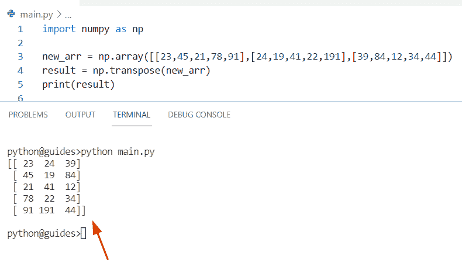

Python numpy transpose 3d array

阅读: [Python 排序 NumPy 数组](https://pythonguides.com/python-sort-numpy-array/)

## Python numpy sum 3d 数组

*   在本期节目中，我们将讨论如何用 Python 对一个三维 numpy 数组求和。
*   通过使用 **np.sum()** 方法我们可以解决这个问题。在 Python 中， **sum()** 方法对数组和数组对象中的项求和。

**语法:**

下面是 np.sum()函数的语法

```py
numpy.sum
         (
          arr,
          axis=None,
          dtype=None,
          out=None,
          keepdims=<no value>
          initial=<no value>
          where=<no value>
         )
```

**源代码:**

```py
import numpy as np

arr1 = np.array([[[ 56,  24,  16],[ 17,  18,  29],
    [64, 16, 18]],
    [[ 24,  27,  36],[ 18,  19,  26],
    [ 27,  13,  64]]])

b = np.sum(arr1,axis = 0)
print(b)
```

下面是以下代码的截图

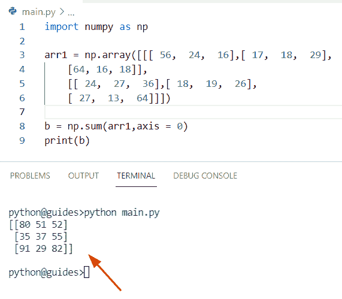

Python numpy sum 3d array

阅读: [Python NumPy 矩阵](https://pythonguides.com/python-numpy-matrix/)

## Python numpy 定义 3d 数组

*   在这一节中，我们将讨论如何使用 Python 定义一个 numpy 三维数组。
*   要定义一个三维数组，我们可以使用 **numpy.ones()** 方法。在 Python 中， **numpy.ones()** 函数用 1 填充值，并且它总是返回给定形状的新 numpy 数组。

**语法:**

下面是 numpy.ones()方法的语法

```py
numpy.ones
          (
           shape,
           dtype=None,
           order='C'
           like=None
          )
```

**源代码:**

```py
import numpy as np

arr1 = np.ones((3, 3, 3))
print(arr1)
```

在上面的代码中，我们首先要导入一个 NumPy 库，然后创建一个变量**‘arr 1’**，在这个变量中我们传递了 **np.ones()** 方法来定义一个新的三维数组。

下面是以下代码的截图

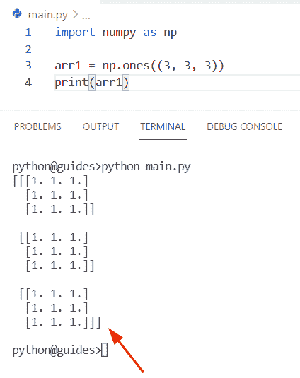

Python numpy define 3d array

阅读: [Python NumPy linspace +示例](https://pythonguides.com/python-numpy-linspace/)

## Python numpy 旋转 3d 数组

*   让我们看看**如何在 Python** 中旋转三维 numpy 数组。
*   通过使用 **np.rot90** ，我们可以轻松地将 numpy 数组旋转 90 度。在 Python 中，此方法用于将 NumPy 数组旋转 90 度。

**语法:**

下面是语法 NumPy.rot90()方法

```py
numpy.rot
         (
          m,
          k=1,
          axes=(0,1)
         )
```

**源代码:**

```py
import numpy as np

arr1 = np.array([[16,18], [24,43], [17,19]])
print(arr1)
b = np.rot90(arr1, 3)
print("After rotating arr:",b)
```

你可以参考下面的截图

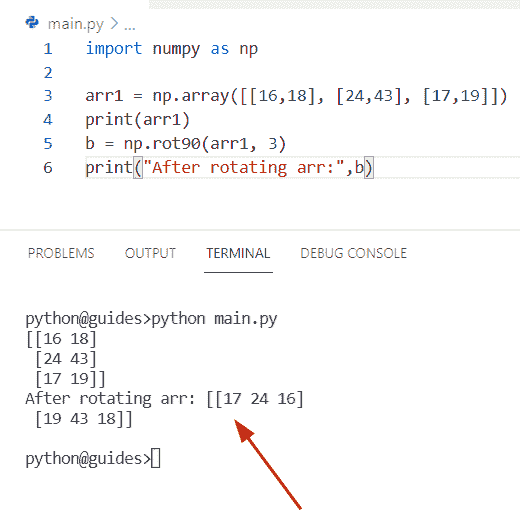

Python numpy rotate 3d array

正如您在屏幕截图中看到的，输出是数组的旋转。

阅读: [Python NumPy concatenate + 9 个例子](https://pythonguides.com/python-numpy-concatenate/)

## Python numpy where 3d 数组

*   让我们通过使用 Python 来看看**如何在三维数组中使用 where 函数。**
*   在 Python 中，该方法用于根据条件选择项目，它总是返回从 **X** 和 **Y** 中选择的项目，该函数在 Python Numpy 模块中可用。

**语法:**

下面是 numpy.where()方法的语法

```py
numpy.where
           (
            condition
            [,
            x,
            y
            ]
            )
```

**举例:**

```py
import numpy as np

arr1 = np.array([[56, 1, 12], [3, 2, 14],[3,21,5]])
result = np.where(arr1<6)
print(result)
print(arr1[result])
```

在上面的代码中，我们创建了一个数组，然后使用 np。where()方法，其中我们将条件**赋值为< 6** 。一旦你将打印“结果”，然后输出将显示一个新的三维数组。

下面是以下代码的截图

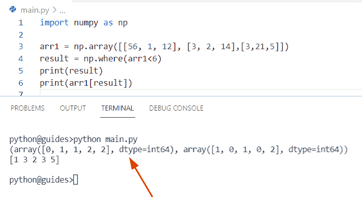

Python numpy where 3d array

阅读: [Python NumPy 日志+示例](https://pythonguides.com/python-numpy-log/)

## Python numpy 空 3d 数组

*   这里我们可以看到**如何使用 Python** 创建一个空的三维数组。
*   在这个例子中，我们将使用一个 **np.empty()** 方法来创建一个空数组。在 Python 中，此函数不会将值设置为零。它只接受随机值。

**语法:**

下面是 Python 中 np.empty()函数的语法

```py
numpy.empty
           (
            shape,
            dtype=float,
            order='C'
           ) 
```

**注意:**这些参数定义了形状、数据类型和顺序。它将总是返回未初始化数据的数组。

**源代码:**

```py
import numpy as np

arr1 = np.empty((3, 3, 3))
print(arr1) 
```

下面是以下给定代码的执行过程

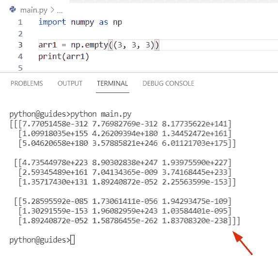

Python Numpy empty 3d array

读取: [Python NumPy 读取 CSV](https://pythonguides.com/python-numpy-read-csv/)

## 将 3d 数组整形为 2d python numpy

*   在本期节目中，我们将讨论**如何在 Python** 中将三维数组重塑为二维 numpy 数组。
*   在 Python 中，整形意味着我们可以在不改变元素的情况下轻松修改数组的形状。

**语法:**

下面是 NumPy.reshape()方法的语法。

```py
numpy.reshape
             (
              arr,
              newshape,
              order='C'
             )
```

**源代码:**

```py
import numpy as np
new_arr2 = np.array([[[42, 16],
        [567, 123]],

       [[345, 136],
        [445, 890]],

       [[567,  123],
        [789,  908]],

       [[678,  908],
        [645, 212]]])
result= np.reshape(new_arr2,(4,4))
print(result)
```

一旦您将打印**‘result’**，那么输出将显示 4*4 维的数组。

下面是以下给定代码的执行过程

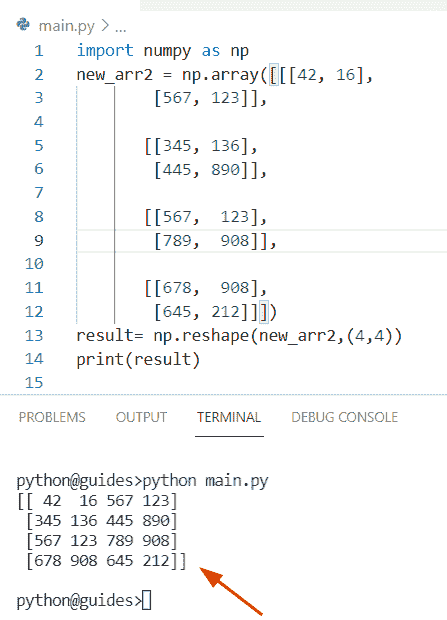

reshape 3d array to 2d python numpy

阅读: [Python NumPy to list](https://pythonguides.com/python-numpy-to-list/)

## Python numpy 初始化 3d 数组

*   在这一节中，我们将讨论如何在 Python 中初始化一个三维数组。
*   在 Python 中，为了初始化一个三维数组，我们可以很容易地使用 np.array 函数来创建一个数组，一旦你打印了 **'arr1'** ,那么输出将显示一个三维数组。

**源代码:**

```py
import numpy as np

arr1 = np.array([[[4,36], [134, 94]], [[976, 234], [189, 123]],[[56,21],[109,67]]])
print("Initialize 3-d array:",arr1)
```

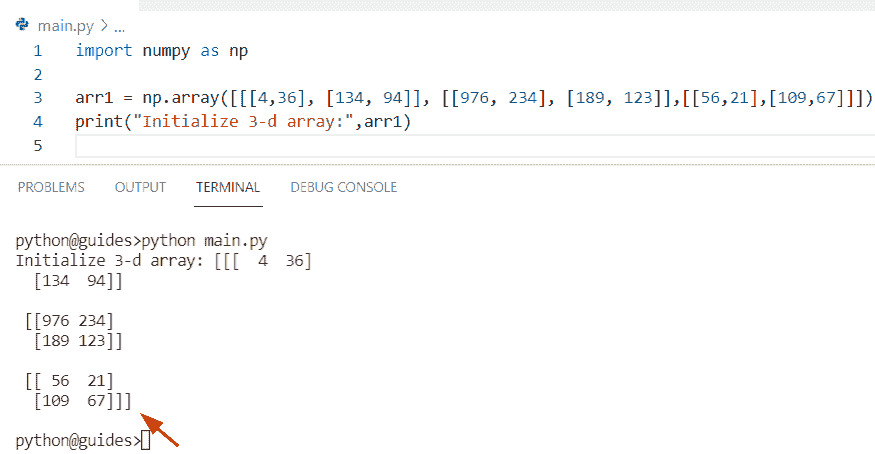

Python numpy initialize 3d array

阅读: [Python NumPy square 举例](https://pythonguides.com/python-numpy-square/)

## Python numpy 追加 3d 数组

*   在本节中，我们将讨论**如何使用 Python** 追加 numpy 3d 数组。
*   在 Python 中， **append()** 函数将在数组的末尾添加条目，该函数将合并两个 numpy 数组，并且总是返回一个新数组。

**举例:**

让我们举一个例子，并理解如何在 Python 中追加三维 numpy 数组

```py
import numpy as np

new_array1 = np.array([[23, 31], [78, 89],[356,921]])
new_array2 = np.array([[834, 567], [179, 119],[823,108]])
result = np.append(new_array1, new_array2,axis=1)

print(result)
```

在上面的代码中，我们应用了 append()函数，在该函数中，我们为两个给定的数组**‘new _ array 1’**和**‘new _ array 2’**赋值。一旦你将打印“结果”，然后输出将显示一个新的更新的三维数组。

下面是以下代码的截图

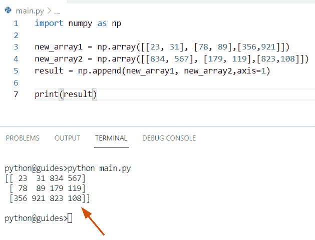

Python numpy append 3d array

阅读: [Python NumPy 绝对值举例](https://pythonguides.com/python-numpy-absolute-value/)

## Python numpy 串接 3d 数组

*   让我们看看**如何使用 Python** 连接一个三维 numpy 数组。
*   在 Python 中，concatenate 函数用于组合两个不同的 numpy 数组和一个轴。
*   在这个例子中，我们通过使用 **np.array()** 函数创建了两个 numpy 数组**‘arr 1’**和**‘arr 2’**。现在使用 concatenate 函数，在这个函数中我们传递数组并对其进行轴处理。

**源代码:**

```py
import numpy as np

arr1 = np.array([[67, 23, 89], [15, 35, 76],[114,256,345]])
arr2 = np.array([[48, 189, 234],[782, 567, 190],[543,134,567]])
print(np.concatenate((arr1, arr2), axis = -1))
```

下面是以下给定代码的输出

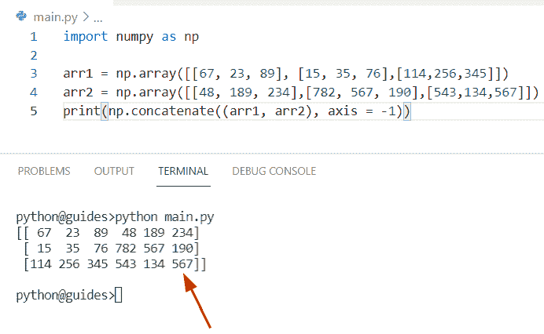

Python numpy concatenate 3d array

正如您在截图中看到的，输出将显示一个新的三维数组。

您可能也喜欢阅读下面的 Python Numpy 教程。

*   [Python NumPy 平均值与示例](https://pythonguides.com/python-numpy-average/)
*   [Python NumPy 空数组示例](https://pythonguides.com/python-numpy-empty-array/)
*   [Python NumPy 形状示例](https://pythonguides.com/python-numpy-shape/)
*   [Python NumPy 2d 数组+示例](https://pythonguides.com/python-numpy-2d-array/)
*   [Python 数字差异](https://pythonguides.com/python-numpy-diff/)

在这篇 Python 教程中，我们已经学习了如何在 Python 中使用三维 NumPy 数组。此外，我们已经讨论了这些主题。

*   Python numpy 3d 数组切片
*   Python numpy 3d 数组转 2d
*   Python numpy 3d 数组轴
*   Python 绘图 3d 数字数组
*   Python 3d 列表到 numpy 数组
*   Python numpy 转置 3d 数组
*   Python numpy sum 3d 数组
*   Python numpy 定义 3d 数组
*   Python numpy rotate 3d array
*   Python numpy 3d 示例
*   Python numpy where 3d 数组
*   Python numpy 空 3d 数组
*   将 3d 数组整形为 2d python 数字
*   Python numpy 初始化 3d 数组
*   Python numpy append 3d 阵列
*   Python numpy 连接 3d 数组

[Bijay Kumar](https://pythonguides.com/author/fewlines4biju/)

Python 是美国最流行的语言之一。我从事 Python 工作已经有很长时间了，我在与 Tkinter、Pandas、NumPy、Turtle、Django、Matplotlib、Tensorflow、Scipy、Scikit-Learn 等各种库合作方面拥有专业知识。我有与美国、加拿大、英国、澳大利亚、新西兰等国家的各种客户合作的经验。查看我的个人资料。

[enjoysharepoint.com/](https://enjoysharepoint.com/)[](https://www.facebook.com/fewlines4biju "Facebook")[](https://www.linkedin.com/in/fewlines4biju/ "Linkedin")[](https://twitter.com/fewlines4biju "Twitter")