# Matplotlib 移除刻度标签

> 原文：<https://pythonguides.com/matplotlib-remove-tick-labels/>

[](https://sharepointsky.teachable.com/p/python-and-machine-learning-training-course)

在这个 python 教程中，我们将学习如何使用 Python 中的 [matplotlib](https://pythonguides.com/what-is-matplotlib/) 来**移除刻度标签**。我们还将讨论以下主题:

*   如何移除刻度标签
*   Matplotlib 移除刻度标签
*   Matplotlib 删除刻度
*   Matplotlib 删除刻度标签和刻度线
*   Matplotlib 删除轴标签
*   Matplotlib 移除标签保留记号
*   Matplotlib 删除记号保留标签
*   Matplotlib 从子绘图中删除刻度标签
*   Matplotlib 删除次要刻度标签
*   Matplotlib 删除彩条刻度标签
*   Matplotlib 删除特定的刻度标签

目录

[](#)

*   [Matplotlib 如何移除刻度标签](#Matplotlib_how_to_remove_tick_labels "Matplotlib how to remove tick labels")
*   [Matplotlib 移除刻度标签](#Matplotlib_remove_tick_labels "Matplotlib remove tick labels")
    *   [Matplotlib 通过设置颜色移除刻度标签](#Matplotlib_remove_tick_labels_by_setting_color "Matplotlib remove tick labels by setting color ")
    *   [Matplotlib 通过将刻度标签设置为空来移除刻度标签](#Matplotlib_remove_tick_labels_by_setting_tick_labels_to_be_empty "Matplotlib remove tick labels by setting tick labels to be empty")
    *   [Matplotlib 通过将刻度标签参数设置为空来移除刻度标签](#Matplotlib_remove_tick_labels_by_setting_tick_label_argument_to_be_empty "Matplotlib remove tick labels by setting tick label argument to be empty ")
*   [Matplotlib 移除刻度线](#Matplotlib_remove_tick_marks "Matplotlib remove tick marks")
    *   [Matplotlib 移除 x 轴上的记号](#Matplotlib_remove_ticks_on_x-axis "Matplotlib remove ticks on x-axis")
    *   [Matplotlib 移除 y 轴上的刻度](#Matplotlib_remove_ticks_on_y-axis "Matplotlib remove ticks on y-axis")
    *   [Matplotlib 从两个轴上移除记号](#Matplotlib_remove_ticks_from_both_the_axes "Matplotlib remove ticks from both the axes")
*   [Matplotlib 移除刻度标签和刻度线](#Matplotlib_remove_tick_labels_and_tick_marks "Matplotlib remove tick labels and tick marks")
    *   [Matplotlib 通过使用 xaxis.set_visible()](#Matplotlib_removes_both_labels_and_ticks_by_using_xaxisset_visible "Matplotlib removes both labels and ticks by using xaxis.set_visible()") 移除标签和刻度
    *   [Matplotlib 通过使用 set_ticks([])](#Matplotlib_removes_both_labels_and_ticks_by_using_set_ticks "Matplotlib removes both labels and ticks by using set_ticks([]) ") 移除标签和记号
    *   [Matplotlib 通过使用 xticks([])和 yticks([])](#Matplotlib_removes_both_labels_and_ticks_by_using_xticks_and_yticks "Matplotlib removes both labels and ticks by using xticks([]) and yticks([])") 删除标签和刻度
    *   [Matplotlib 通过使用 NullLocator()移除刻度和刻度标签](#Matplotlib_remove_ticks_and_tick_labels_by_using_NullLocator "Matplotlib remove ticks and tick labels by using NullLocator()")
    *   [Matplotlib 通过使用 tick_params()](#Matplotlib_remove_ticks_and_labels_by_using_tick_params "Matplotlib remove ticks and labels by using tick_params() ") 移除记号和标签
*   [Matplotlib 移除轴标签](#Matplotlib_remove_axis_labels "Matplotlib remove axis labels")
*   [Matplotlib 移除标签保留记号](#Matplotlib_remove_labels_keep_ticks "Matplotlib remove labels keep ticks")
*   [Matplotlib 移除刻度保留标签](#Matplotlib_remove_ticks_keep_labels "Matplotlib remove ticks keep labels")
*   [Matplotlib 从子图中移除刻度标签](#Matplotlib_remove_tick_labels_from_subplot "Matplotlib remove tick labels from subplot")
*   [Matplotlib 移除次要刻度标签](#Matplotlib_remove_minor_tick_labels "Matplotlib remove minor tick labels")
*   [Matplotlib 移除彩条刻度标签](#Matplotlib_remove_colorbar_tick_labels "Matplotlib remove colorbar tick labels")
    *   [Matplotlib 仅移除列条记号](#Matplotlib_remove_colobar_only_ticks "Matplotlib remove colobar only ticks")
    *   [Matplotlib 删除滚动条和标签标签](#Matplotlib_remove_colobar_both_tick_and_ticklabels "Matplotlib remove colobar both tick and ticklabels")
*   [Matplotlib 移除特定的刻度标签](#Matplotlib_remove_specific_tick_labels "Matplotlib remove specific tick labels")

## Matplotlib 如何移除刻度标签

在开始这个话题之前，先了解一下 tick 和 labels 是什么意思。

*   **记号**是用来表示轴上的点的标记，或者我们可以说是小的几何刻度线。
*   **刻度标签**是刻度的名称。或者我们可以说记号标签是包含称为**文本记号**的文本的记号。
*   **轴标签**是 X 轴、Y 轴等轴的名称。

有时程序员想要隐藏或删除刻度线和刻度标签。我们在 matpolotlib 中使用了不可见的特性，利用它我们可以使标记和标签不可见。

**以下步骤用于移除 matplotlib 记号和标签，概述如下:**

*   **定义库:**导入删除记号和标签所需的重要库(对于可视化:来自 matplotlib 的 pyplot，对于数据创建和操作:Numpy 或 Pandas)。
*   **定义 X 和 Y:** 定义 X 轴和 Y 轴上的数据值。我们可以创建数组或数据框来定义值。
*   **去除或隐藏刻度/标签:**通过使用 **yticks()** 和 **xticks()** 的方法我们可以很容易地去除刻度和标签。
*   **显示:**最后使用 **show()** 的方法显示剧情。

阅读:[如何安装 matplotlib python](https://pythonguides.com/how-to-install-matplotlib-python/)

## Matplotlib 移除刻度标签

在本节中，我们将研究如何移除刻度标签。刻度标签是图中刻度的名称。

**隐藏刻度标签有不同的方法:**

*   通过将刻度标签的颜色设置为白色
*   通过将刻度标签设置为空
*   通过将标签参数设置为空

### Matplotlib 通过设置颜色移除刻度标签

如果图的背景色是**白色**。通过将刻度标签的颜色设置为**白色**，我们可以轻松隐藏刻度标签。

基本上，它使刻度标签不可见，但将标签颜色设置为白色。如果背景色不是白色，那么这个方法就不行。

使用 **xticks()** 和 **yticks()** 方法，并将颜色参数作为**‘w’**传递。

**通过设置颜色移除刻度标签的语法如下:**

```py
**# X-axis tick label**
matplotlib.pyplot.xticks(color='w')
**# Y-axis tick label**
matplotlib.pyplot.yticks(color='w')
```

**上述使用的参数定义如下:**

*   **颜色:**指定一种颜色为白色。

**让我们借助一个例子来更清楚地理解这个概念:**

```py
**# Import Library**

import matplotlib.pyplot as plt

**# Define Data**

x = [1,2,3,4]
y = [6,12,18,24]

**# Plot Graph**

plt.plot(x,y) 
plt.xlabel("X Label")
plt.ylabel("Y Label")

**# xticks color white**

plt.xticks(color='w')

                      **# OR**

**# yticks color white**

plt.yticks(color='w')

**# Display Graph**

plt.show()
```

*   在上面的例子中，我们导入了 **matplotlib.pyplot** 库。之后，我们定义 x 轴和 y 轴的数据点。
*   **plt.plot()** 方法用于图形的创建。
*   **plt.xticks()** 方法用于移除 x 轴上的刻度标签。这里我们传递颜色参数，并将颜色设置为**白色**。
*   **plt.yticks()** 方法用于移除 y 轴上的刻度标签。这里我们传递颜色参数，并将颜色设置为**白色**。
*   最后，我们使用 **show()** 方法来显示图形。

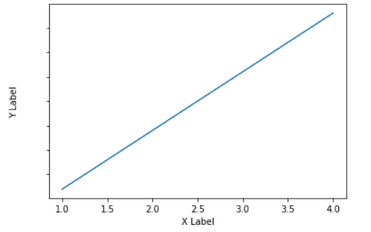

plt.xticks(color=’w’)

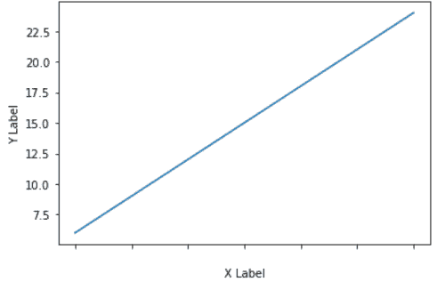

plt.yticks(color=’w’)

读取 [Matplotlib set_xticks](https://pythonguides.com/matplotlib-set-xticks/)

### Matplotlib 通过将刻度标签设置为空来移除刻度标签

通过使用 **xaxis.set_ticklabels([])** 和 **yaxis.set_ticklabels([])** 将刻度标签设置为空。

此方法通过将刻度标签设置为空来使刻度标签不可见，但保持刻度可见。

**其语法如下:**

```py
**# For X-axis**
matplotlib.axes.xaxis.set_ticklabels([])
**# For Y-axis**
matplotlib.axes.yaxis.set_ticklabels([])
```

**让我们看看例子，更清楚地理解这个概念:**

```py
**# Import Library**

import matplotlib.pyplot as plt

**# Define Data**

x = [1,2,3,4]
y = [6,12,18,24]

**# Plot Graph**

plt.plot(x,y) 
plt.xlabel("X Label")
plt.ylabel("Y Label")
ax = plt.gca()

**# xticks setting to be empty**

ax.axes.xaxis.set_ticklabels([])

            **# OR**

**# yticks setting to be empty** 
ax.axes.yaxis.set_ticklabels([])

**# Display Graph**

plt.show()
```

*   在上面的例子中，我们导入了 **matplotlib.pyplot** 库。
*   之后，我们定义 x 轴和 y 轴的数据点。
*   **plt.plot()** 方法用于图形的创建。
*   **ax . axes . xaxis . set _ tick labels([])**方法用于去除 x 轴的刻度标签。
*   **ax . axes . ya xis . set _ tick labels([])**方法用于去除 y 轴的刻度标签。
*   最后，我们使用 **show()** 方法来显示图形。

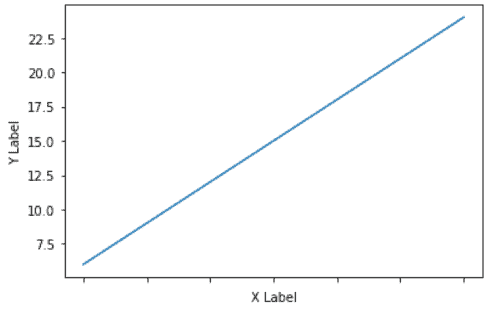

ax.axes.xaxis.set_ticklabels([])

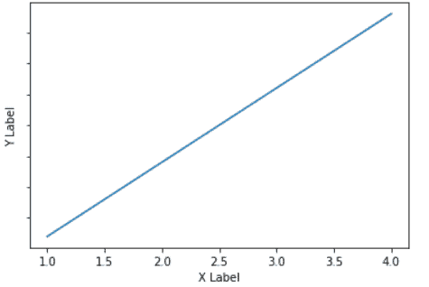

ax.axes.yaxis.set_ticklabels([])

Read [Matplotlib set_xticklabels](https://pythonguides.com/matplotlib-set_xticklabels/)

### Matplotlib 通过将刻度标签参数设置为空来移除刻度标签

通过使用 **plt.xticks()** 和 **plt.yticks()** 方法并传递带有空标签的参数。

**将分笔成交点标签设置为下注空的语法如下:**

```py
**For x-asis**
matplotlib.pyplot.xticks(x, label='')
**For y-axis**
matplotlib.pyplot.yticks(y, label='')
```

**上述使用的**参数为**，如下:**

*   **x:** 指定 x 轴
*   **y:** 指定 y 轴
*   **标签:**指定标签。设置为空。

**让我们看看将标签设置为空的例子:**

```py
**# Import Library**

import matplotlib.pyplot as plt

**# Define data**

x = [1,2,3,4]
y = [8,9,10,11]

**# plot graph**

plt.plot(x, y, color='r', linewidth=5)

**# set x label to be empty**

plt.xticks(x, labels=" ")

           **# OR**

**# set y label to be empty**

plt.yticks(y, labels=" ")

**# display the graph**  

plt.show()
```

*   在上面的例子中，我们导入了 **matplotlib.pyplot** 库。
*   之后，我们定义 x 轴和 y 轴的数据点。
*   **plt.plot()** 方法用于图形的创建。
*   **plt.xticks()** 方法用于移除 x 轴上的刻度标签。这里我们传递参数标签，并将它们设置为空。
*   **plt.yticks()** 方法用于移除 y 轴上的刻度标签。这里我们传递参数标签，并将它们设置为空。
*   最后，我们使用 **show()** 方法来显示图形。

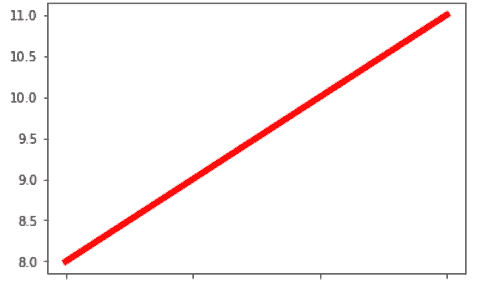

plt.xticks(x, labels=”)

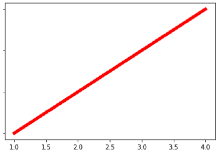

plt.yticks(y,labels=”)

阅读: [Matplotlib 绘制一条线](https://pythonguides.com/matplotlib-plot-a-line/)

## Matplotlib 移除刻度线

默认情况下，当我们在 matplotlib 中绘制图形时，我们会在 x 轴和 y 轴的两侧绘制记号。

但有时我们不想在图中显示刻度线。因此，在这种情况下，我们必须让这些蜱看不见，或者我们可以说，我们必须删除它们。

通过使用 **tick_params()** 方法，我们可以轻松地删除这些记号。

**在下面的例子中，我们去除了刻度:**

*   当我们想要删除 x 轴上的刻度时
*   当我们想要删除 y 轴上的刻度时
*   当我们想从两个轴上删除刻度时

### Matplotlib 移除 x 轴上的记号

使用 **tick_params()** 方法移除 x 轴上的。在这个方法中传递参数**底部**并设置其值**为假**。

它仅删除记号，保留记号标签不变。

**去除 x 轴上刻度的语法如下:**

```py
**For x-axis**
matplotlib.pyplot.tick_params(bottom=False)
```

**让我们借助一个例子来更清楚地理解这个概念:**

```py
**# Import Libraries**

import matplotlib.pyplot as plt

**# Define data**

x = [5, 6, 7, 8]
y = [8, 16, 20, 12]

**# Remove ticks on x-axis**

plt.tick_params(bottom = False)

**# Plot Graph**

plt.plot(x,y)

**# Display Graph**

plt.show()
```

*   在上面的例子中，我们导入了 **matplotlib.pyplot** 库。
*   之后，我们定义 x 轴和 y 轴的数据点。
*   **plt.tick_params()** 方法用于移除 x 轴上的刻度线。这里我们传递参数**底部**并设置它的值**假**。
*   **plt.plot()** 方法用于图形的创建。
*   最后，我们使用 **show()** 方法来显示图形。

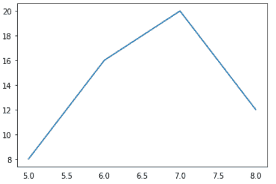

plt.tick_params(bottom=False)

读取 [Matplotlib fill_between](https://pythonguides.com/matplotlib-fill_between/)

### Matplotlib 移除 y 轴上的刻度

使用 **tick_params()** 方法移除 y 轴上的。在这个方法传递中，参数**离开**，并设置其值**为假**。

它仅删除记号，保留记号标签不变。

**删除 y 轴刻度的语法如下:**

```py
**For y-axis**
matplotlib.pyplot.tick_params(left=False)
```

**让我们借助一个例子来更清楚地理解这个概念:**

```py
**# Import Libraries**

import matplotlib.pyplot as plt

**# Define data**

x = [5, 6, 7, 8]
y = [8, 16, 20, 12]

**# Remove ticks on y-axis**

plt.tick_params(left = False)

**# Plot Graph**

plt.plot(x,y)

**# Display Graph**

plt.show()
```

*   在上面的例子中，我们导入了 **matplotlib.pyplot** 库。
*   之后，我们定义 x 轴和 y 轴的数据点。
*   **plt.tick_params()** 方法用于移除 y 轴上的刻度线。这里我们传递参数 **left** 并设置它的值 **False** 。
*   **plt.plot()** 方法用于图形的创建。
*   最后，我们使用 **show()** 方法来显示图形。

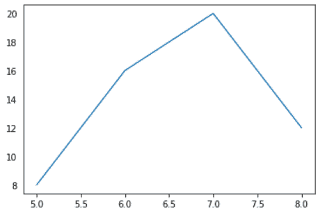

plt.tick_params(left=False)

读取[Matplotlib set _ yticklabels](https://pythonguides.com/matplotlib-set_yticklabels/)

### Matplotlib 从两个轴上移除记号

使用 **tick_params()** 方法删除两个轴上的记号。在这个方法传递中，自变量**底部**和**左侧**将其值**设为假**。

它去除了两个轴上的刻度标记，分别称为 **x 轴**和 **y 轴**。

**删除两个轴上的记号的语法如下:**

```py
**For both the axes**
matplotlib.pyplot.tick_params(left=False,bottom=False)
```

**让我们借助一个例子来更清楚地理解这个概念:**

```py
**# Import Libraries**

import matplotlib.pyplot as plt

**# Define data** 
x = [5, 6, 7, 8]
y = [8, 16, 20, 12]

**# Remove ticks on x-axis and y-axis both**

plt.tick_params(left = False, bottom = False)

**# Plot Graph** 
plt.plot(x,y)

**# Display Graph** 
plt.show()
```

*   在上面的例子中，我们导入了 **matplotlib.pyplot** 库。
*   之后，我们定义 x 轴和 y 轴的数据点。
*   **plt.tick_params()** 方法用于去除两个轴上的刻度线。这里我们通过自变量**的左**和**的底**并设置其值 **假** 。
*   **plt.plot()** 方法用于图形的创建。
*   最后，我们使用 **show()** 方法来显示图形。

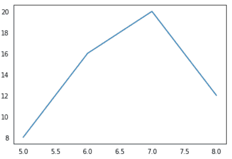

plt.tick_params(left=False, bottom=False)

阅读: [Python 使用 Matplotlib 绘制多条线](https://pythonguides.com/python-plot-multiple-lines/)

## Matplotlib 移除刻度标签和刻度线

当我们在 matplotlib 中绘制图形时，图形同时具有刻度标签和刻度线。有时候，我们需要去掉标签和标记。

**有以下几种方法可以同时去除记号和标签:**

*   通过使用 set_visible()方法
*   通过使用 set_ticks([])方法
*   通过使用 xticks([])或 yticks([])方法
*   通过使用 NullLocator()方法
*   通过使用 tick_params()方法

### Matplotlib 通过使用 xaxis.set_visible() 移除标签和刻度

**set_visible()** 方法删除坐标轴刻度、坐标轴刻度标签以及坐标轴标签。它使轴心完全不可见。

在这个方法中传递参数 **False** 来设置不可见性。

**删除记号和标签的语法如下:**

```py
**For x-axis**
ax.axes.xaxis.set_visible(False)
**For y-axis**
ax.axes.yaxis.set_visible(False)
```

**让我们看例子来理解这个概念:**

```py
**# Import Libraries**

import matplotlib.pyplot as plt

**# Define data**

x = [5, 6, 7, 8]
y = [1, 2, 3, 6]

**# Remove ticks and labels on x-axis and y-axis both**

ax = plt.gca()
ax.axes.xaxis.set_visible(False)
ax.axes.yaxis.set_visible(False)

**# Plot Graph**

plt.plot(x,y)

**# Display Graph**

plt.show()
```

*   在上面的例子中，我们使用**ax . axes . xaxis . set _ visible()**方法来隐藏 x 轴上的刻度和标签，并设置值 **False** 。
*   **ax . axes . ya xis . set _ visible()**方法隐藏 y 轴上的刻度和标签，并设置值 **False** 。
*   最后，我们使用 **show()** 方法来显示图形

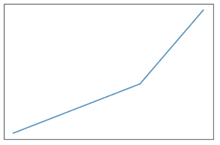

ax.axes.xaxis / yaxis.set_visible(False)

读取 [Matplotlib tight_layout](https://pythonguides.com/matplotlib-tight-layout/)

### Matplotlib 通过使用 set_ticks([]) 移除标签和记号

**set_ticks([])** 方法删除坐标轴刻度，坐标轴刻度标签。但是它不会删除轴标签。将记号设置为空并使其不可见。

**set _ ticks([])的语法如下:**

```py
**For x-axis**
ax.axes.xaxis.set_ticks([])
**For y-axis**
ax.axes.yaxis.set_ticks([]) 
```

**让我们借助下面给出的例子来理解这个概念:**

```py
**# Import Libraries**

import matplotlib.pyplot as plt

**# Define data** 
x = [5, 6, 7, 8]
y = [1, 2, 3, 6]

**# Remove ticks and labels on x-axis and y-axis both**

ax = plt.gca()
ax.axes.xaxis.set_ticks([])
ax.axes.yaxis.set_ticks([])

**# Plot Graph**

plt.plot(x,y, color= 'red', linewidth=3)

**# Display Graph**

plt.show()
```

*   在上面的例子中，我们使用了一个**ax . axes . xaxis . set _ ticks()**方法来隐藏 x 轴上的刻度和标签，并将刻度设置为空。
*   **ax . axes . ya xis . set _ ticks()**方法隐藏 y 轴上的刻度和标签，并将刻度设置为空。
*   最后，我们使用 **show()** 方法来显示图形。

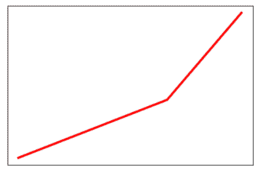

ax.axes.xaxis / yaxis .set_ticks([])

阅读[Python Matplotlib tick _ params+29 示例](https://pythonguides.com/matplotlib-tick-params/)

### Matplotlib 通过使用 xticks([])和 yticks([]) 删除标签和刻度

通过使用 xticks()和 yticks()方法，可以禁用 x 轴和 y 轴上的刻度和刻度标签。

**禁用记号和标签的语法如下:**

```py
**For x-axis**
plt.xticks([])
**For y-axis**
plt.yticks([])
```

**让我们借助一个例子来理解如何禁用记号和标签:**

```py
**# Import Libraries**

import matplotlib.pyplot as plt

**# Define data**

x = [5, 6, 7, 8]
y = [1, 2, 3, 6]

**# Plot Graph**

plt.plot(x,y, color= 'orange', linewidth=3)

**# Remove ticks and labels on x-axis and y-axis both**

plt.xticks([])
plt.yticks([])

**# Display Graph**

plt.show()
```

*   在上面的例子中，我们使用 **plt.xticks([])** 方法来隐藏 x 轴上的刻度和标签，并将刻度设置为空。
*   **plt.yticks()** 方法来隐藏 y 轴上的刻度和标签，并将刻度设置为空。
*   最后，我们使用 **show()** 方法来显示图形。

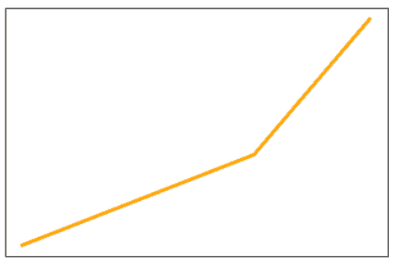

plt.xticks / yticks ([])

读取 [Matplotlib x 轴标签](https://pythonguides.com/matplotlib-x-axis-label/)

### Matplotlib 通过使用 NullLocator()移除刻度和刻度标签

为了定位蜱，我们使用零定位器。因此，通过使用 NullLocator()方法，我们隐藏了轴刻度和轴标签。

**删除记号和记号标签的语法如下:**

```py
**# For x-axis**
ax.xaxis.set_major_locator(ticker.NullLocator())
**# For y-axis**
ax.yaxis.set_major_locator(ticker.NullLocator())
```

**让我们看一个与 NullLocator()相关的例子如下:**

```py
**# Import Libraries**

import matplotlib.ticker as ticker

**# Define data** 
x = [6, 8.3, 9, 2]
y = [1, 2, 3, 6]

**# Define axes**

ax = plt.axes()

**# Plot Graph** 
ax.plot(x,y, color= 'cyan', linewidth=10)

**# Remove ticks and labels on x-axis and y-axis**

ax.xaxis.set_major_locator(ticker.NullLocator())
ax.yaxis.set_major_locator(ticker.NullLocator())

**# Display Graph**

plt.show()
```

*   在上面的例子中，首先我们必须导入库 **matplotlib.ticker** 。在此之后，我们必须以 X 轴和 y 轴的形式定义数据，以便绘图。
*   **plt.axes()** 方法用于定义轴， **ax.plt()** 方法用于绘制图形。
*   接下来，我们必须使用 **NullLocator()** 函数作为 **set_major_locator()** 方法中的参数，用于 x 轴和 y 轴。
*   最后，我们调用 **show()** 方法来显示图形。

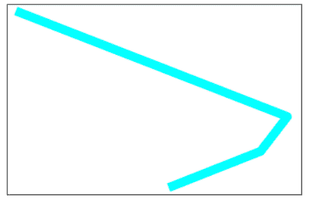

NullLocator()

读取 [Matplotlib 多条形图](https://pythonguides.com/matplotlib-multiple-bar-chart/)

### Matplotlib 通过使用 tick_params() 移除记号和标签

要隐藏或删除两个轴(x 轴和 y 轴)上的刻度线和刻度标签，我们必须使用 **tick_parmas()** 函数。

将以下内容作为参数传递( **left、bottom、labelleft** 和 **labelbottom** ，并将它们的值设置为 **False** ，以隐藏刻度和标签。

**tick _ params()方法的语法如下:**

```py
matplotlib.pyplot.tick_params(left = False,labelleft = False ,
                           labelbottom = False, bottom = False)
```

**让我们来看一个例子:**

```py
**# Import Libraries**

import matplotlib.pyplot as plt

**# Define data** 

x = [5, 6, 7, 8]
y = [8, 16, 20, 12]

**# Remove ticks and labels on x-axis and y-axis both**

plt.tick_params(left = False, labelleft = False , labelbottom = False, bottom = False)

**# Plot Graph** 

plt.plot(x,y)

**# Display Graph**

plt.show()
```

*   在上面的例子中，我们导入了 **matplotlib.pyplot** 库。
*   之后，我们定义 x 轴和 y 轴的数据点。
*   **plt.tick_params()** 方法用于清除两个轴上的刻度线和刻度标签。这里我们传递参数 **left** 、 **bottom、labelleft、labelbottom** ，并设置它们的值为 **False** 。
*   **plt.plot()** 方法用于图形的创建。
*   最后，我们使用 **show()** 方法来显示图形。


tick_params()

阅读:[什么是 matplotlib 内联](https://pythonguides.com/what-is-matplotlib-inline/)

## Matplotlib 移除轴标签

在 matplotlib 中，默认情况下，绘图显示刻度和刻度标签。我们还可以在轴(x 轴和 y 轴)的两侧显示轴标签。

**首先让我们理解轴标签是什么意思:**

*   基本上，轴标签告诉我们 x 轴和 y 轴代表什么。
*   例如:x 轴代表学生人数，y 轴代表学生的分数。

现在在这一节中，我们学习如何删除或隐藏轴标签。

通过使用 **set_visible()** 方法，我们可以隐藏轴标签。它使整个轴不可见，包括刻度线、刻度标签以及轴标签。

**删除轴标签的语法:**

```py
**For x-axis**
ax.axes.xaxis.set_visible(False)
**For y-axis**
ax.axes.yaxis.set_visible(False)
```

**让我们看一个有轴标签的图形或图表的例子:**

```py
**# Import Library**

import matplotlib.pyplot as plt

**# Define Data** 
student = [5, 10, 12, 16, 18]
marks= [99, 90, 80, 85, 75]

**# Define axes label**

plt.xlabel("No.Of students")
plt.ylabel("Marks of students")

**# Plot Graph**

plt.scatter(student,marks, color='r')

**# Display Graph**

plt.show()
```

*   在上面的例子中，首先我们导入了 **matplotlib.pyplot** 库。
*   之后，我们定义数据，即 x 轴上的学生的**号和 y 轴上的学生**的**分数。**
*   接下来，我们定义**轴标签**，它告诉我们 x 轴代表学生的编号，y 轴代表学生的分数。我们使用 **plt.xlabel()** 和 **plt.ylabel()** 的方法
*   **plt.scatter()** 方法用于绘制图形。
*   最后，我们使用 **show()** 方法来显示我们绘制的内容。

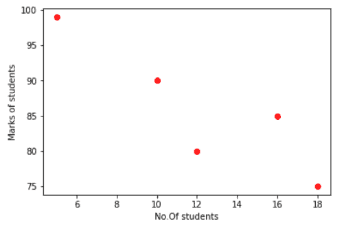

Plot having axis labels

**现在让我们借助一个例子来看看如何移除轴标签**:

```py
**# Import Library**

import matplotlib.pyplot as plt

**# Define Data**

student = [5, 10, 12, 16, 18]
marks= [99, 90, 80, 85, 75]

**# Define axes label**

plt.xlabel("No.Of students")
plt.ylabel("Marks of students")

**# Remove axis labels**

ax = plt.gca()
ax.axes.xaxis.set_visible(False)
ax.axes.yaxis.set_visible(False)

**# Plot Graph**

plt.scatter(student,marks, color='r')

**# Display Graph**

plt.show()
```

*   在上面的例子中，我们使用了一个**ax . axes . xaxis . set _ visible()**方法和**ax . axes . ya xis . set _ visible()**方法，并将它们的值 **False** 设置为不可见的轴标签。
*   此方法还隐藏轴刻度和刻度标签。

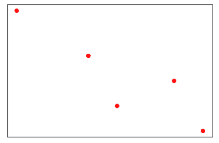

Plot without axis labels

阅读: [Matplotlib 绘图条形图](https://pythonguides.com/matplotlib-plot-bar-chart/)

## Matplotlib 移除标签保留记号

通过将记号标签设置为空来隐藏记号标签，但保持记号可见的方法。

我们使用 **xaxis.set_ticklabels([])** 和 **yaxis.set_ticklabels([])** 将 tick 标签设置为空。

**其语法如下:**

```py
**# For X-axis**
matplotlib.axes.xaxis.set_ticklabels([])
**# For Y-axis**
matplotlib.axes.yaxis.set_ticklabels([])
```

**让我们看看例子，更清楚地理解这个概念:**

```py
**# Import Library**

import matplotlib.pyplot as plt

**# Define Data**

student = [5, 10, 12, 16, 18]
marks= [99, 90, 80, 85, 75]

**# Plot Graph**

plt.plot(student,marks) 
plt.xlabel("No.Of students")
plt.ylabel("Marks of students")
ax = plt.gca()

**# xticks setting to be empty**

ax.axes.xaxis.set_ticklabels([])

            **# OR**

**# yticks setting to be empty** 
ax.axes.yaxis.set_ticklabels([])

**# Display Graph**

plt.show()
```

*   在上面的例子中，我们导入了 **matplotlib.pyplot** 库。
*   之后，我们定义 x 轴和 y 轴的数据点，即学生人数和学生分数。
*   **plt.plot()** 方法用于图形的创建。
*   **ax . axes . xaxis . set _ tick labels([])**方法用于去除 x 轴的刻度标签。
*   **ax . axes . ya xis . set _ tick labels([])**方法用于去除 y 轴的刻度标签。
*   最后，我们使用 **show()** 方法来显示图形。

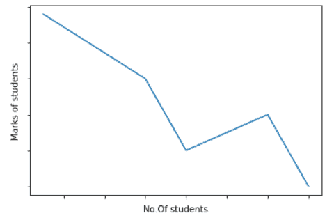

set_ticklabels([])

阅读: [Matplotlib 支线剧情教程](https://pythonguides.com/matplotlib-subplot-tutorial/)

## Matplotlib 移除刻度保留标签

**tick_params()** 方法用于删除两个轴上的刻度。

在我们传递的这个方法中，自变量**底**和**左**设置其值**假**。

它去除了两个轴上的刻度标记，这两个轴分别称为 **x 轴**和 **y 轴**。

**删除记号并保留标签的语法如下:**

```py
**For both the axes**
matplotlib.pyplot.tick_params(left=False,bottom=False)
```

**让我们借助一个例子来更清楚地理解这个概念:**

```py
**# Import Library** 
import matplotlib.pyplot as plt

**# Define Data**

student = [5, 10, 12, 16, 18]
marks= [99, 90, 80, 85, 75]

**# Define axes label**

plt.xlabel("No.Of students")
plt.ylabel("Marks of students")

**# Remove ticks keep labels**

plt.tick_params(left = False, bottom = False)

**# Plot Graph**

plt.scatter(student,marks, color='r')

**# Display Graph**

plt.show()
```

*   在上面的例子中，我们导入了 **matplotlib.pyplot** 库。
*   之后，我们定义 x 轴和 y 轴的数据点，即。学生和学生的口袋。
*   **plt.tick_params()** 方法用于去除两个轴上的刻度线。这里我们通过自变量**的左**和**的底**并设置其值 **假** 。
*   **plt.plot()** 方法用于图形的创建。
*   最后，我们使用 **show()** 方法来显示图形。

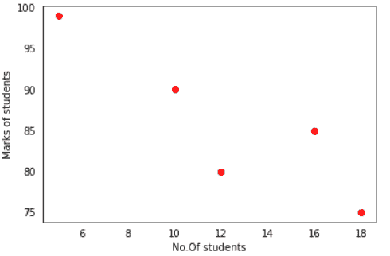

tick_params()

阅读: [Matplotlib 最佳拟合线](https://pythonguides.com/matplotlib-best-fit-line/)

## Matplotlib 从子图中移除刻度标签

这里我们将讨论如何从特定的子情节中移除记号和标签。

我们使用 **set_xticks()** 和 **set_yticks()** 函数来分别隐藏 x 轴和 y 轴上的刻度和标签。

这里我们必须将 ticks 值设置为空。

**让我们借助一个例子来理解这个概念:**

```py
**# Importing Libraries**

import numpy as np
import matplotlib.pyplot as plt

**# Define Data**

x1= [2, 6, 9, 5]
y1= [1, 3, 9, 15]

x2= [2, 6, 7, 9, 10]
y2= [3, 4, 6, 9, 12]

x3= [5, 8, 12]
y3= [3, 6, 9]

x4= [7, 8, 15]
y4= [6, 12, 18]

fig, ax = plt.subplots(2, 2)

**# Remove tick labels**

ax[0, 0].set_xticks([])
ax[0, 0].set_yticks([])

**# Plot graph**

ax[0, 0].plot(x1, y1)
ax[0, 1].plot(x2, y2)
ax[1, 0].plot(x3, y3)
ax[1, 1].plot(x4,y4)

**# Display Graph**

fig.tight_layout()
plt.show()
```

*   在上面的例子中，我们在一个图形区域中绘制了多个图。我们希望删除特定地块的记号和标签。
*   这里我们使用 **set_xticks()和 set_yticks()** 方法来改变绘图的背景。
*   我们对第一个子情节使用 **set_xticks()和 set_yticks()** 方法，并将 **tick** 值设置为**空**。

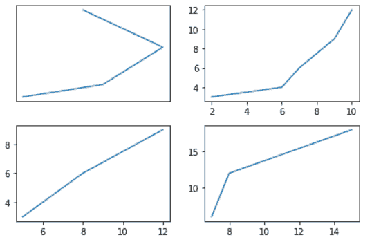

set_xticks([]) and set_yticks([])

阅读: [Matplotlib 支线剧情 _adjust](https://pythonguides.com/matplotlib-subplots_adjust/)

## Matplotlib 移除次要刻度标签

次要刻度是主要刻度之间的刻度。或者我们可以说小分笔成交点将大分笔成交点分成几个部分。

默认情况下，次要刻度标签处于关闭状态。

在本节中，我们将研究如果次要刻度打开，如何移除或关闭次要刻度。

**删除次要刻度的语法:**

```py
matplotlib.pyplot.minorticks_off()
```

**让我们看看如何关闭次要刻度的示例:**

**代码#1** (带小勾号)

默认情况下，对数刻度有较小的刻度，因此为了便于理解，我们采用这个刻度。

```py
**# Import Library**

import numpy as np
import matplotlib.pyplot as plt

**# Define Data**

x = np.random.randint(-5, 5, 10)
y = np.exp(x)

**# Plot Graph**

plt.plot(y, x)
plt.xscale('log')

**# Display Graph**

plt.show() 
```

在上面的例子中，我们用对数标度绘制了一个图表，以便我们了解次要分笔成交点的样子。

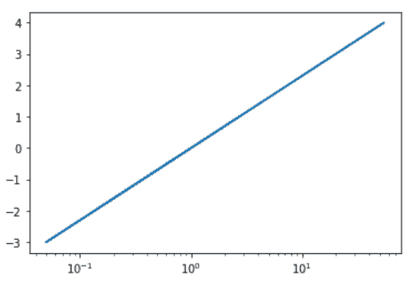

The graph with minor tick labels

**代码#2** (无小勾号)

```py
**# Import Library**

import numpy as np
import matplotlib.pyplot as plt

**# Define Data** 

x = np.random.randint(-5, 5, 10)
y = np.exp(x)

**# Plot Graph**

plt.plot(y, x)
plt.xscale('log')

**# Remove minor ticks**

plt.minorticks_off()

**# Display Graph**

plt.show()
```

在上面的例子中，现在我们使用 **minorticks_off()** 方法关闭次要刻度。

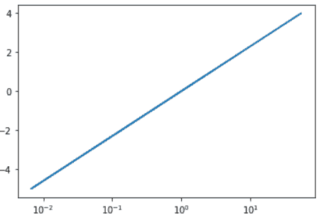

The graph without minor tick labels

读取: [Matplotlib 日志日志图](https://pythonguides.com/matplotlib-log-log-plot/)

## Matplotlib 移除彩条刻度标签

彩条是颜色数据值的映射。 **colorbar()** 方法用于向图表添加一个颜色条。

**我们可以从颜色栏中删除以下内容:**

*   仅勾选
*   刻度和刻度标签

让我们逐一讨论每个案例:

### Matplotlib 仅移除列条记号

如果我们想从列栏中删除刻度，我们必须将刻度的大小设置为 0。

**其语法如下:**

```py
cbar.ax.tick_params(size=0)
```

**上面使用的参数是:**

*   **大小:**色带条中刻度线的大小

**我们举个例子来了解一下如何去除蜱虫:**

```py
**# Import libraries**

import matplotlib.pyplot as plt
import numpy as np

**# Plot image** 
a = np.random.random((5, 5))
plt.imshow(a, cmap='summer')

**# Plot colorbar**

cbar = plt.colorbar()

**# Set ticklabels**

labels = [0, 0.1, 0.2, 0.3, 0.4, 0.5, 0.6,
          0.7, 0.8, 0.9, 1]
cbar.set_ticks(labels)

**# Remove ticks**

cbar.ax.tick_params(size=0)

**# Plot graph** 

plt.show()
```

在上面的例子中，我们使用 tick_params()方法，传递参数 size，并将值设置为 0。

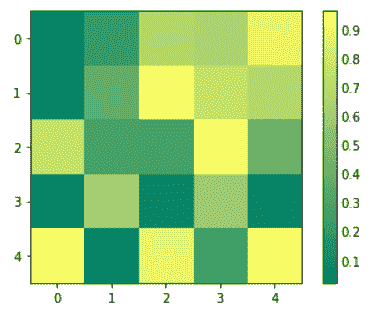

Colorbar without ticks

阅读 [Matplotlib 散点图图例](https://pythonguides.com/matplotlib-scatter-plot-legend/)

### Matplotlib 删除滚动条和标签标签

如果我们想删除彩条的 tick 和 ticklabels，我们必须使用函数 set_ticks([])并传递空列表。

**其语法如下:**

```py
cbar.set_ticks([])
```

**让我们举一个例子来理解** **如何删除勾选和勾选标签**

```py
 **# Import libraries**

import matplotlib.pyplot as plt
import numpy as np

**# Plot image** 
a = np.random.random((5, 5))
plt.imshow(a, cmap='summer')

**# Plot colorbar**

cbar = plt.colorbar()

**# Set ticklabels**

labels = [0, 0.1, 0.2, 0.3, 0.4, 0.5, 0.6,
          0.7, 0.8, 0.9, 1]

**# Remove both ticks and ticklabels**

cbar.set_ticks(labels)

**# Plot graph** 

plt.show() 
```

在上面的例子中，我们在 **set_ticks()** 方法中传递空列表。

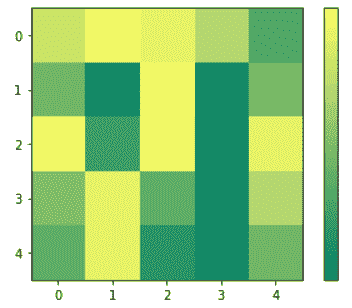

Colorbar with tick and ticklabels

阅读: [Matplotlib plot_date](https://pythonguides.com/matplotlib-plot-date/)

## Matplotlib 移除特定的刻度标签

在这里，我们将学习如何从图中隐藏一些特定的刻度标签。

使用方法 **set_visible(False)** 处理一些特定的记号。

**其语法为:**

```py
xticks = ax.xaxis.get_major_ticks()
xticks[0].label1.set_visible(False)

**# Here 0 is axis position which we want to hide** 
yticks = ax.yaxis.get_major_ticks()
yticks[4].label1.set_visible(False)

**# Here 4 is axis position which we want to hide from y-axis** 
```

**为了更好地理解，我们来看一个例子:**

```py
**# Import Library**

import matplotlib.pyplot as plt

**# Define Data** 

student = [5, 10, 12, 16, 18]
marks= [99, 90, 80, 85, 75]

**# Plot Graph**

plt.plot(student,marks) 
plt.xlabel("No.Of students")
plt.ylabel("Marks of students")
ax = plt.gca()

**# remove specfic ticks**

xticks = ax.xaxis.get_major_ticks()
xticks[0].label1.set_visible(False)
yticks = ax.yaxis.get_major_ticks()
yticks[4].label1.set_visible(False)

**# Display Graph** 

plt.show()
```

*   在上面的例子中，我们隐藏了 x 轴和 y 轴上的特定刻度。
*   使用 **set_visible()** 方法，将您想要删除的特定记号和值设为 False。

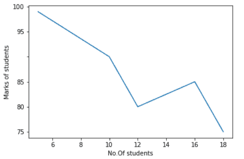

Remove some specific tick labels

你可能也喜欢阅读下面的 Matplotlib 教程。

*   [Matplotlib 虚线](https://pythonguides.com/matplotlib-dashed-line/)
*   [Matplotlib 散点图标记](https://pythonguides.com/matplotlib-scatter-marker/)
*   [Matplotlib 绘图误差线](https://pythonguides.com/matplotlib-plot-error-bars/)
*   [Matplotlib 改变背景颜色](https://pythonguides.com/matplotlib-change-background-color/)
*   [Matplotlib 旋转刻度标签](https://pythonguides.com/matplotlib-rotate-tick-labels/)

在本 Python 教程中，我们已经讨论了“ **Matplotlib 移除记号标签**”，并且我们还介绍了一些与之相关的例子。我们在本教程中讨论了以下主题。

*   如何移除刻度标签
*   Matplotlib 移除刻度标签
*   Matplotlib 删除刻度
*   Matplotlib 删除刻度标签和刻度线
*   Matplotlib 删除轴标签
*   Matplotlib 移除标签保留记号
*   Matplotlib 删除记号保留标签
*   Matplotlib 从子绘图中删除刻度标签
*   Matplotlib 删除次要刻度标签
*   Matplotlib 删除彩条刻度标签
*   Matplotlib 删除特定的刻度标签

[Bijay Kumar](https://pythonguides.com/author/fewlines4biju/)

Python 是美国最流行的语言之一。我从事 Python 工作已经有很长时间了，我在与 Tkinter、Pandas、NumPy、Turtle、Django、Matplotlib、Tensorflow、Scipy、Scikit-Learn 等各种库合作方面拥有专业知识。我有与美国、加拿大、英国、澳大利亚、新西兰等国家的各种客户合作的经验。查看我的个人资料。

[enjoysharepoint.com/](https://enjoysharepoint.com/)[](https://www.facebook.com/fewlines4biju "Facebook")[](https://www.linkedin.com/in/fewlines4biju/ "Linkedin")[](https://twitter.com/fewlines4biju "Twitter")