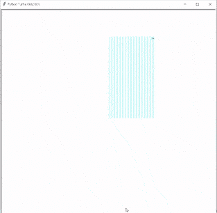

# Python 海龟网格–实用指南

> 原文：<https://pythonguides.com/python-turtle-grid/>

[](https://sharepointsky.teachable.com/p/python-and-machine-learning-training-course)

在这个 Python 教程中，我们将学习**如何在 [Python Turtle](https://pythonguides.com/turtle-programming-in-python/) 中创建一个网格**，我们还将介绍与 Turtle 网格相关的不同例子。我们将讨论这些话题。

*   蟒蛇龟网格
*   Python 海龟坐标网格

目录

[](#)

*   [蟒龟网格](#Python_Turtle_Grid "Python Turtle Grid")
*   [蟒龟坐标网格](#Python_Turtle_coordinate_grid "Python Turtle coordinate grid")

## 蟒龟网格

在本节中，我们将学习如何在 python turtle 中创建网格。

在继续之前，我们应该了解一下**什么是网格？**

网格被定义为水平线或垂直线的网络。这些线条相互之间建立了一种联系，或者我们可以说是相互支撑。网格用于在图表上给出点的位置。

**龟网格**也用于提及图形中正确的点。而这几点都是借助龟公提到的。

**代码:**

在下面的代码中，我们将从海龟导入* 、**导入海龟**中导入海龟库**。 **turtle()** 模块是用来制作物体的。**

*   **tur.forward(300)** 用于向前移动乌龟。
*   **tur.up()** 用于停止绘图。
*   **tur.setpos(val，300)** 用于设置 y 轴的位置。
*   **tur.down()** 用于开始绘图。
*   **tur.backward(300)** 用于向后移动乌龟，以绘制另一条线。
*   **tur.write(0，font=("Verdana "，18，" bold))**用于在网格中写入 0。
*   **ws.setup(800，800)** 用于设置屏幕。
*   **tur.speed(100)** 用来给乌龟速度。
*   **tur.left(90)** 用于向左移动乌龟。
*   **tur . hideturt()**被使用的乌龟不在屏幕上显示。

```
from turtle import *

import turtle

ws=turtle.Screen()
tur=turtle.Turtle()

def draw_yaxs(val):

    tur.forward(300)

    tur.up()
    tur.setpos(val,300)
    tur.down()

    tur.backward(300)

    tur.up()
    tur.setpos(val+10,0)
    tur.down()

def draw_xaxs(val):

    tur.forward(300)

    tur.up()
    tur.setpos(300,val)
    tur.down()

    tur.backward(300)

    tur.up()
    tur.setpos(0,val+10)
    tur.down()

def label():

    tur.penup()
    tur.setpos(155,155)
    tur.pendown()

    tur.write(0,font=("Verdana", 18, "bold"))

    tur.penup()
    tur.setpos(290,155)
    tur.pendown()

    tur.write("x",font=("Verdana", 18, "bold"))

    tur.penup()
    tur.setpos(155,290)
    tur.pendown()

    tur.write("y",font=("Verdana", 18, "bold"))

ws.setup(800,800)   

tur.speed(100)
tur.left(90) 
tur.color('blue')

for i in range(30):
    draw_yaxs(10*(i+1))

tur.right(90)
tur.up()
tur.setpos(0,0)
tur.down()

for i in range(30):
    draw_xaxs(10*(i+1))

tur.hideturtle()

turtle.done()
```

**输出:**

运行上面的代码后，我们得到了下面的输出，其中我们可以看到相互连接的水平线和垂直线，形成了一个漂亮的彩色网格。


Python turtle grid

还有，检查:[分形蟒龟](https://pythonguides.com/fractal-python-turtle/)

## 蟒龟坐标网格

在本节中，我们将学习如何在 python turtle 中**创建坐标网格。**

正如我们所知，网格是由水平线和垂直线组成的网络。横线和竖线相互连接，形成一个美丽的网格。在网格内部，我们创建一个坐标，在这个坐标上，点被放置在适当的位置。

坐标平面有一个 x 轴和 y 轴，用于检测点，或者我们可以说它决定了点的位置。

**代码:**

在下面的代码中，我们将从海龟导入* 、**导入海龟**中导入海龟库**。**龟()**法是用来做物件的。**

*   **tur.forward(300)** 用于在乌龟的帮助下向前移动线。

*   **tur.up()** 用于停止绘图。
*   **tur.setpos(val，300)** 用于设置 X 轴或 y 轴的位置
*   **tur.down()** 用于开始绘图。
*   **tur.backward(300)** 用于在龟的帮助下向后移动线条。
*   **tur.write(0，font=("Verdana "，18，" bold))**用来写坐标原点的 0。
*   **tur.write("x "，font=("Verdana "，18，" bold))**用来写 x 轴所在的地方的 x。
*   **tur.write("y "，font=("Verdana "，18，" bold))**用来写 Y 轴所在的 Y。
*   **ws.setup(800，800)** 用于设置屏幕的 a 尺寸。
*   **tur.speed(100)** 用来给乌龟画一些图形的速度。
*   **tur.color('青色')**用来给笔上色。
*   **label()** 用来给坐标加标签。
*   **tur . hideturt()**用于将乌龟隐藏在屏幕之外。

```
from turtle import *

import turtle

ws=turtle.Screen()
tur=turtle.Turtle()

def draw_yaxs(val):

    tur.forward(300)

    tur.up()
    tur.setpos(val,300)
    tur.down()

    tur.backward(300)

    tur.up()
    tur.setpos(val+10,0)
    tur.down()

def draw_xaxs(val):

    tur.forward(300)

    tur.up()
    tur.setpos(300,val)
    tur.down()

    tur.backward(300)

    tur.up()
    tur.setpos(0,val+10)
    tur.down()

def label():

    tur.penup()
    tur.setpos(155,155)
    tur.pendown()

    tur.write(0,font=("Verdana", 18, "bold"))

    tur.penup()
    tur.setpos(290,155)
    tur.pendown()

    tur.write("x",font=("Verdana", 18, "bold"))

    tur.penup()
    tur.setpos(155,290)
    tur.pendown()

    tur.write("y",font=("Verdana", 18, "bold"))

ws.setup(800,800)   

tur.speed(100)
tur.left(90) 
tur.color('cyan')

for i in range(30):
    draw_yaxs(10*(i+1))

tur.right(90)
tur.up()
tur.setpos(0,0)
tur.down()

for i in range(30):
    draw_xaxs(10*(i+1))

tur.color('black')

tur.up()
tur.setpos(0,150)
tur.down()
tur.forward(300)
tur.left(90)
tur.up()
tur.setpos(150,0)
tur.down()

tur.forward(300)

label()

tur.hideturtle()
turtle.done()
```

**输出:**

运行上面的代码后，我们得到了下面的输出，我们可以看到在网格内创建了一个网格坐标。

正如我们所知，坐标平面有两个轴 x 轴和 y 轴，用于检测点，我们看到 x 轴和 y 轴代表坐标平面。



Python turtle coordinate grid

另外，看看更多关于 Python Turtle 的教程。

*   [Python 清龟配实例](https://pythonguides.com/python-clear-turtle/)
*   [蟒龟获得位置](https://pythonguides.com/python-turtle-get-position/)
*   [巨蟒龟 3d 造型](https://pythonguides.com/python-turtle-3d-shapes/)
*   [蟒龟画线](https://pythonguides.com/python-turtle-draw-line/)
*   [蟒龟星](https://pythonguides.com/python-turtle-star/)
*   [蟒蛇龟椭圆形](https://pythonguides.com/python-turtle-oval/)
*   [蟒龟嵌套循环](https://pythonguides.com/python-turtle-nested-loop/)
*   [蟒龟画字母](https://pythonguides.com/python-turtle-draw-letters/)
*   [巨蟒龟 Setworldcoordinates](https://pythonguides.com/python-turtle-setworldcoordinates/)

因此，在本教程中，我们讨论了 **Python Turtle Grid** ,我们也涵盖了这些与其实现相关的例子。这是我们已经讨论过的例子列表。

*   蟒蛇龟网格
*   Python 海龟坐标网格

[Bijay Kumar](https://pythonguides.com/author/fewlines4biju/)

Python 是美国最流行的语言之一。我从事 Python 工作已经有很长时间了，我在与 Tkinter、Pandas、NumPy、Turtle、Django、Matplotlib、Tensorflow、Scipy、Scikit-Learn 等各种库合作方面拥有专业知识。我有与美国、加拿大、英国、澳大利亚、新西兰等国家的各种客户合作的经验。查看我的个人资料。

[enjoysharepoint.com/](https://enjoysharepoint.com/)[](https://www.facebook.com/fewlines4biju "Facebook")[](https://www.linkedin.com/in/fewlines4biju/ "Linkedin")[](https://twitter.com/fewlines4biju "Twitter")