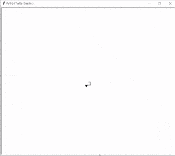

# 蟒蛇龟 Setworldcoordinates

> 原文：<https://pythonguides.com/python-turtle-setworldcoordinates/>

[](https://sharepointsky.teachable.com/p/python-and-machine-learning-training-course)

在本 [Python 教程](https://pythonguides.com/python-hello-world-program/)中，我们将学习**Python Turtle setworld coordinates**的用法。为了演示本教程，我们将构建一个小项目。

我们正在构建一个项目，在这个项目中，我们将在 **[Python turtle](https://pythonguides.com/turtle-programming-in-python/) 库**的帮助下学习**如何设置 setworldcoordinate** 。在这里，我们分解代码，并解释如何使用函数和方法来设置坐标。

## 蟒蛇龟 Setworldcoordinates

**setworldcoordinates()** 函数用作复位。它重置用户定义的坐标。如果**设置世界坐标**的**模式**被激活，那么所有的图形可以根据屏幕上给出的新坐标重新绘制。

**语法**

```py
turtle.setworldcoordinates(llx,lly,urx,ury)
```

*   **ly:**一个数字，画布左下角的 y 坐标。
*   **llx:** 一个数字，画布左下角的 x 坐标。
*   **ury:** 一个数字，画布右上角的 y 坐标。
*   **urx:** 一个数字，画布左上角的 x 坐标。

现在，我们正在向前推进，开始这个**蟒蛇龟**项目。这里我们只是导入库。

```py
from turtle import *
import turtle as tur
```

现在我们正在为这只乌龟创建一个对象。

```py
tur = tur.Turtle()
```

现在我们使用 **screen()** 函数来创建一个屏幕对象，并且使用**ws . mode(‘world’)**来设置这个单词的模式。

```py
ws = tur.Screen()
ws.mode('world')
```

现在我们使用 **setworldcoordinate()** 函数来重置用户定义的坐标。如果**设置字坐标**的**模式**被激活，那么所有的图形都可以根据新的坐标重新绘制。

```py
tur.setworldcoordinates(-50, -50, 50, 50)
```

现在我们给海龟一些运动,从这里我们设置坐标。

*   **tur.forward(1+1*i)** 用于向前移动乌龟。
*   **tur.right(90)** 用于向右移动乌龟。

```py
for i in range(16):
    tur.forward(1+1*i)
    tur.right(90)
```

现在我们再次使用 **setworldcoordinates()** 函数来重置用户定义的坐标。在这种情况下，如果 **setworldcoordinates** 的**模式**已经激活，那么所有的图形都可以根据新的坐标重新绘制。

```py
tur.setworldcoordinates(-40, -40, 40, 40)
```

设置好坐标后，我们给乌龟一些动作，让它加入坐标来画出一个形状。

*   **tur.forward(1+1*(i+16))** 用于将乌龟正向移动到新坐标。
*   **tur.right(90)** 用于向右移动乌龟。

```py
for i in range(16):
    tur.forward(1+1*(i+16))
    tur.right(90)
```

现在我们再次使用 **setworldcoordinates()** 函数来重置用户定义的坐标。在这种情况下，如果 **setworldcoordinates** 的**模式**已经激活，那么所有的图形都可以根据新的坐标重新绘制。重绘新坐标后，海龟可以在新坐标上移动。

```py
tur.setworldcoordinates(-30, -30, 30, 30)
```

设置好新的坐标后，我们给乌龟一些动作，让它加入坐标来画出一个形状。

*   **tur.forward(1+1*(i+32))** 用于向前移动乌龟。
*   **tur.right(90)** 用于向右移动乌龟。

```py
for i in range(16):
    tur.forward(1+1*(i+32))
    tur.right(90)
tur.done()
```

下文分解代码，解释我们如何使用 python turtle 设置坐标。现在我们将会看到运行完整个代码后的输出是什么样的，如果 **setworldcoordinates** 的**模式**已经激活，我们也将会看到所有的绘图是如何由 turtle 根据新的坐标重新绘制的。

```py
from turtle import *
import turtle as tur

tur = tur.Turtle()

**# make screen object and
# set mode to world**
ws = tur.Screen()
ws.mode('world')

 **
# set world coordinates**
tur.setworldcoordinates(-50, -50, 50, 50)

**# do some motion**
for i in range(16):
    tur.forward(1+1*i)
    tur.right(90)
 **# set world coordinates**
tur.setworldcoordinates(-40, -40, 40, 40)

**# do some motion**
for i in range(16):
    tur.forward(1+1*(i+16))
    tur.right(90)

**# set world coordinates**
tur.setworldcoordinates(-30, -30, 30, 30)

**# do some motion**
for i in range(16):
    tur.forward(1+1*(i+32))
    tur.right(90)
tur.done()
```

运行上述代码后，我们得到以下输出，其中我们可以看到 **setworldcoordinate** 的**模式**处于活动状态，所有的图形都可以根据新的坐标重新绘制。



Python turtle setworldcoordinates

因此，在这个项目中，我们展示了如何在 python turtle 中绘制 setworldcoordinates。此外，我们还讨论了本教程中使用的全部代码，包括 Python Turtle setworldcoordinates 的使用。

另外，看看更多关于 Python Turtle 的教程。

*   [蟒龟多边形](https://pythonguides.com/python-turtle-polygon/)
*   [巨蟒龟 3d 造型](https://pythonguides.com/python-turtle-3d-shapes/)
*   [蟒龟之窗](https://pythonguides.com/python-turtle-window/)
*   [蟒龟随机](https://pythonguides.com/python-turtle-random/)
*   [蟒龟背景](https://pythonguides.com/python-turtle-background/)
*   [蟒龟鼠](https://pythonguides.com/python-turtle-mouse/)

[Bijay Kumar](https://pythonguides.com/author/fewlines4biju/)

Python 是美国最流行的语言之一。我从事 Python 工作已经有很长时间了，我在与 Tkinter、Pandas、NumPy、Turtle、Django、Matplotlib、Tensorflow、Scipy、Scikit-Learn 等各种库合作方面拥有专业知识。我有与美国、加拿大、英国、澳大利亚、新西兰等国家的各种客户合作的经验。查看我的个人资料。

[enjoysharepoint.com/](https://enjoysharepoint.com/)[](https://www.facebook.com/fewlines4biju "Facebook")[](https://www.linkedin.com/in/fewlines4biju/ "Linkedin")[](https://twitter.com/fewlines4biju "Twitter")