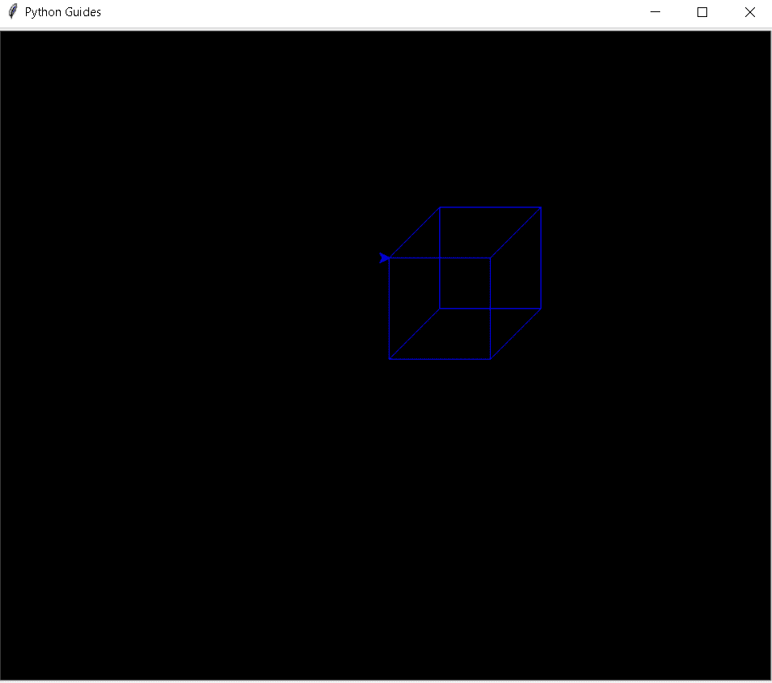
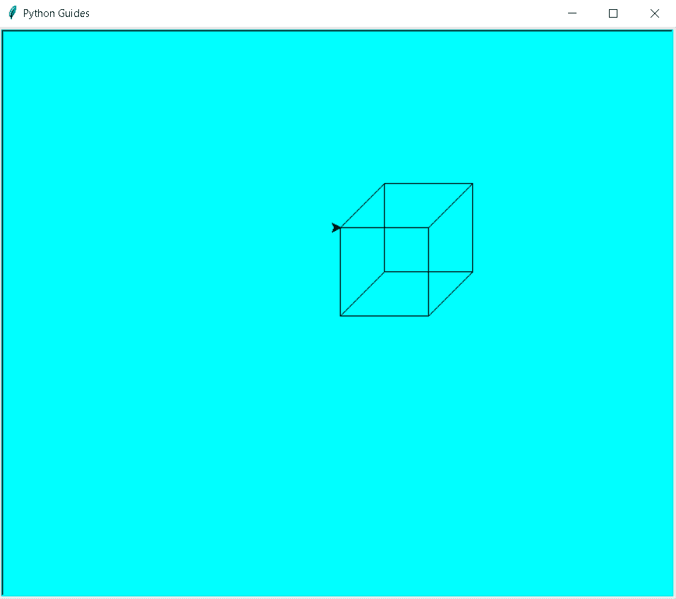
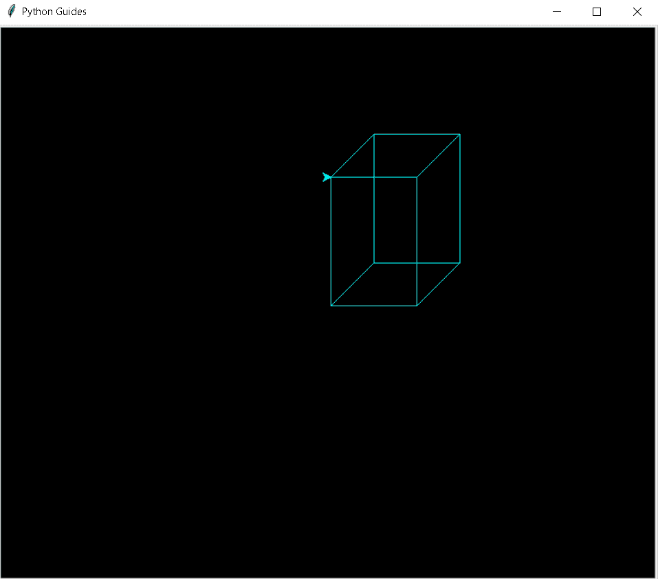
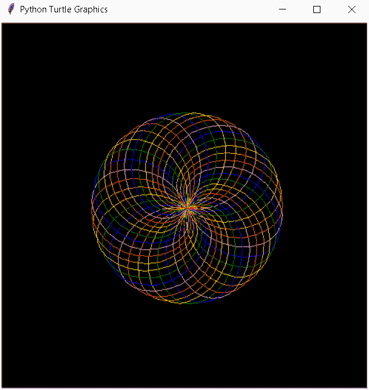
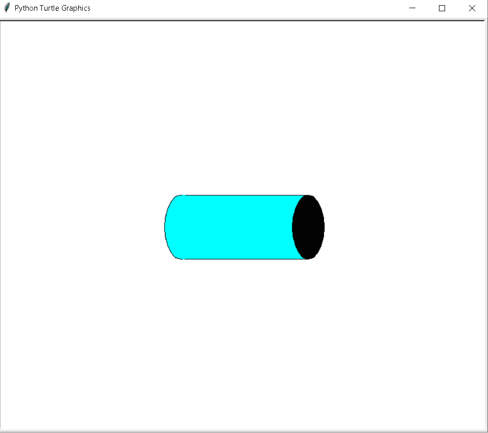

# Python 海龟 3d 形状

> 原文：<https://pythonguides.com/python-turtle-3d-shapes/>

[](https://sharepointsky.teachable.com/p/python-and-machine-learning-training-course)

在本 [Python 教程](https://pythonguides.com/python-hello-world-program/)中，我们将学习 **Python 海龟 3d 形状**。在这里，我们将学习在**巨蟒龟**中绘制 3d 形状，并涵盖与**龟 3d 形状**相关的不同示例。此外，我们将涵盖这些主题。

*   蟒蛇龟 3d 形状
*   蟒蛇龟 3d 立方体
*   蟒蛇龟 3d 长方体
*   蟒蛇龟 3d 球体
*   蟒蛇龟 3d 圆柱体

目录

[](#)

*   [蟒龟 3d 造型](#Python_turtle_3d_shape "Python turtle 3d shape")
*   [巨蟒龟 3d 魔方](#Python_turtle_3d_cube "Python turtle 3d cube")
*   [蟒蛇龟 3d 长方体](#Python_turtle_3d_cuboid "Python turtle 3d cuboid")
*   [巨蟒龟 3d 球体](#Python_turtle_3d_sphere "Python turtle 3d sphere")
*   [蟒龟 3d 圆筒](#Python_turtle_3d_cylinder "Python turtle 3d cylinder")

## 蟒龟 3d 造型

在这一节中，我们将学习**如何在 python turtle 中的乌龟的帮助下绘制 3d 形状**。

3d 是三维的意思。形状的高度**、宽度**等三个维度。我们可以绘制不同的三维(3d)形状。3d 形状有**立方体、长方体、球体和圆柱体**。这些 3d 形状本质上是实心的，并且占据空间。

**代码:**

在下面的代码中，我们将从乌龟导入* 、**导入**、**乌龟**中导入乌龟库**。使用 **turtle()** 方法来制作对象。**

*   **tur.bgcolor("black")** 用于给屏幕背景上色。
*   **tur . title(" Python Guides ")**用于给屏幕加标题。
*   **turt.color("蓝色")**用来给乌龟上色。
*   **turt.goto(50，50)** 用于在绝对位置移动乌龟。
*   **turt.forward(100)** 用于向前移动乌龟。
*   **turt.left(90)** 用于向左移动乌龟。

```
from turtle import *

import turtle 

tur = turtle.Screen()

tur.bgcolor("black")

tur.title("Python Guides")
turt = turtle.Turtle()

turt.color("blue")
tut = turtle.Screen()           

for i in range(4):
    turt.forward(100)
    turt.left(90)

turt.goto(50,50)

for i in range(4):
    turt.forward(100)
    turt.left(90)

turt.goto(150,50)
turt.goto(100,0)

turt.goto(100,100)
turt.goto(150,150)

turt.goto(50,150)
turt.goto(0,100)
turtle.done()
```

**输出:**

运行上面的代码后，我们得到下面的输出，我们可以看到屏幕上绘制了一个三维(3d)形状。



Python turtle 3d shape

另外，检查:[蟒蛇龟网格](https://pythonguides.com/python-turtle-grid/)

## 巨蟒龟 3d 魔方

在这一节中，我们将学习**如何在 python turtle 中的乌龟的帮助下绘制 3d 立方体**。

立方体是立体的三维(3d)图形。三维立方体被称为正六面体。它有六个正方形面，十二条边和八个顶点。三维立方体的所有面都是正方形。这里我们在屏幕上一只乌龟的帮助下绘制 3d 立方体。

**代码:**

在下面的代码中，我们将从 turtle import * 、**导入 turtle 库**。**用**龟()**的方法制作物品。**

*   **tur.bgcolor("青色")**用于给屏幕赋予背景色。
*   **tur . title(" Python Guides ")**用于给窗口赋予标题。
*   **turt.color("黑色")**用来给乌龟上色。
*   **turt.forward(100)** 用于向前移动乌龟。
*   **turt.left(90)** 用于向左移动乌龟。
*   **turt.goto(50，50)** 用于将乌龟移动到其绝对位置。

```
from turtle import * 
import turtle 

tur = turtle.Screen()

tur.bgcolor("cyan")

tur.title("Python Guides")
turt = turtle.Turtle()

turt.color("black")
tut = turtle.Screen()           

for i in range(4):
    turt.forward(100)
    turt.left(90)

turt.goto(50,50)

for i in range(4):
    turt.forward(100)
    turt.left(90)

turt.goto(150,50)
turt.goto(100,0)

turt.goto(100,100)
turt.goto(150,150)

turt.goto(50,150)
turt.goto(0,100)
turtle.done()
```

**输出:**

运行上面的代码后，我们得到下面的输出，我们可以看到屏幕上绘制了一个 3d 立方体



Python turtle 3d cube

阅读:[蟒龟星](https://pythonguides.com/python-turtle-star/)

## 蟒蛇龟 3d 长方体

在本节中，我们将学习**如何在 Python turtle 中的乌龟的帮助下绘制 3d 长方体**。

正如我们所知，长方体是一个立体的三维图形，它有六个矩形面，每个矩形面都是直角。它有 12 条边，8 个角和顶点。

**代码:**

在下面的代码中，我们将从 turtle import *导入 turtle 库，导入 turtle。使用 **turtle()** 方法制作对象。

*   **tur.bgcolor("black")** 用于将黑色赋予背景。
*   **tur . title(" Python Guides ")**用于给窗口赋予标题。
*   **turt.color("青色")**用于给笔赋予颜色。
*   **turt.forward(100)** 用于向前移动乌龟。
*   **turt.left(90)** 用于向左移动乌龟。
*   t **urt.goto(50，50)** 用于将乌龟移动到其准确位置。

```
from turtle import *

import turtle 

tur = turtle.Screen()

tur.bgcolor("black")

tur.title("Python Guides")
turt = turtle.Turtle()

turt.color("cyan")
tut=turtle.Screen()           

for i in range(2):
    turt.forward(100)
    turt.left(90)
    turt.forward(150)
    turt.left(90)

turt.goto(50,50)

for i in range(2):
    turt.forward(100)
    turt.left(90)
    turt.forward(150)
    turt.left(90)

turt.goto(150,50)
turt.goto(100,0)

turt.goto(100,150)
turt.goto(150,200)

turt.goto(50,200)
turt.goto(0,150)
turtle.done()
```

**输出:**

运行上面的代码后，我们得到了下面的输出，其中我们可以看到在一只乌龟的帮助下，3d 长方体被绘制在屏幕上。



Python turtle cuboid

阅读:[蟒龟背景](https://pythonguides.com/python-turtle-background/)

## 巨蟒龟 3d 球体

在这一节中，我们将学习**如何在 python turtle 中的乌龟的帮助下绘制 3d 球体**。

球体是圆形的。它看起来像一个球的表面。球面上的每一点离其中心都是等距的。球面的表面积是 **4×3.14xr^3.**

**代码:**

在下面的代码中，我们将从乌龟导入* 、**导入**、**乌龟中导入乌龟库**。**用**龟()**的方法做对象。**

*   tur.circle(rad，90)用于绘制圆。
*   **screen.setup(500，500)** 用于给出屏幕的尺寸。
*   **screen.bgcolor('black')** 用于给背景上色。
*   **tur.speed(100)** 把速度给乌龟。
*   **tur.seth(-val)** 用于以角度= -val 定向球体。
*   **tur.color(col[ind])** 用于给球体上色。
*   **tur . hideturt()**用于隐藏乌龟。

```
from turtle import *
import turtle as tur

screen = tur.Screen()

def draw(rad):

    for i in range(2):
        tur.circle(rad,90)
        tur.circle(rad//2,90)

screen.setup(500,500)

screen.bgcolor('black')

col=['violet','blue','green','yellow',
     'orange','red']

val=10
ind=0

tur.speed(100)

for i in range(36):

    tur.seth(-val)
    tur.color(col[ind])

    if ind==5:
        ind=0
    else:
        ind+=1

    draw(80)

    val+=10

tur.hideturtle()
tur.done()
```

**输出:**

运行上面的代码后，我们得到下面的输出，可以看到屏幕上绘制了一个漂亮的 3d 球体。



Python turtle 3d sphere

阅读:[蟒龟随机](https://pythonguides.com/python-turtle-random/)

## 蟒龟 3d 圆筒

在这一节中，我们将学习**如何在 python turtle 中乌龟的帮助下绘制 3d 圆柱体**。

三维圆柱体是一个立体的几何图形。它有直的平行边和弯曲的或椭圆形的底部。底座的中心由一条线段连接。

**代码:**

在下面的代码中，我们将从海龟导入* 、**导入海龟**中导入海龟库**。**

*   **rad，heigh = [50，200]** 用于以像素为单位给出圆的半径和高度。
*   **形状(‘正方形’)**用来给出正方形的形状。
*   **fillcolor('青色')**用于填充形状内部的颜色。
*   **形状(‘圆’)**用来给出圆的形状。
*   **向后(heigh/2)** 用于向后移动乌龟。
*   **pencolor('青色')**用来给笔上色。

```
from turtle import *
import turtle

cursor_size = 20

rad, heigh = [50, 200] 

shape('square')
shapesize(rad*2 / cursor_size, heigh / cursor_size)
fillcolor('cyan')
stamp()

shape('circle')
shapesize(stretch_len=rad / cursor_size)
backward(heigh/2)
stamp()

forward(5)
pencolor('cyan')
stamp()

forward(heigh - 5)
color('black')
stamp()

done()
```

**输出:**

运行上面的代码后，我们得到了下面的输出，其中我们可以看到一个漂亮的 3d 圆柱体，带有曲线和椭圆形的底部连接，带有线段，绘制在屏幕上。



Python turtle 3d cylinder

您可能也喜欢阅读以下关于 Python Turtle 的文章。

*   [蟒蛇龟笔+例题](https://pythonguides.com/python-turtle-pen/)
*   [蟒龟嵌套循环](https://pythonguides.com/python-turtle-nested-loop/)
*   [蟒龟画线](https://pythonguides.com/python-turtle-draw-line/)
*   [蟒龟获得位置](https://pythonguides.com/python-turtle-get-position/)

因此，在本教程中，我们讨论了 **Python Turtle 3d shapes** ，并且我们还介绍了与其实现相关的不同示例。这是我们已经讨论过的例子列表。

*   蟒蛇龟 3d 形状
*   蟒蛇龟 3d 立方体
*   蟒蛇龟 3d 长方体
*   蟒蛇龟 3d 球体
*   蟒蛇龟 3d 圆柱体

[Bijay Kumar](https://pythonguides.com/author/fewlines4biju/)

Python 是美国最流行的语言之一。我从事 Python 工作已经有很长时间了，我在与 Tkinter、Pandas、NumPy、Turtle、Django、Matplotlib、Tensorflow、Scipy、Scikit-Learn 等各种库合作方面拥有专业知识。我有与美国、加拿大、英国、澳大利亚、新西兰等国家的各种客户合作的经验。查看我的个人资料。

[enjoysharepoint.com/](https://enjoysharepoint.com/)[](https://www.facebook.com/fewlines4biju "Facebook")[](https://www.linkedin.com/in/fewlines4biju/ "Linkedin")[](https://twitter.com/fewlines4biju "Twitter")