# Python NumPy 过滤器+ 10 个示例

> 原文：<https://pythonguides.com/python-numpy-filter/>

[](https://sharepointsky.teachable.com/p/python-and-machine-learning-training-course)

在本 [Python 教程](https://pythonguides.com/python-hello-world-program/)中，我们将学习**如何在 Python 中过滤 NumPy 数组**。此外，我们将涵盖这些主题。

*   Python NumPy 按条件过滤二维数组
*   Python NumPy 过滤器 2d 数组
*   Python NumPy 过滤器值
*   Python NumPy 过滤器列
*   Python 数字过滤器 nan
*   Python NumPy 中值滤波器
*   Python 数字高斯滤波器
*   Python NumPy 低通滤波器
*   Python NumPy 平均过滤器
*   Python NumPy 巴特沃兹滤波器

目录

[](#)

*   [Python NumPy 过滤器](#Python_NumPy_filter "Python NumPy filter")
*   [Python NumPy 按条件过滤二维数组](#Python_NumPy_filter_two-dimensional_array_by_condition "Python NumPy filter two-dimensional array by condition")
*   [Python NumPy 过滤器 2d 数组](#Python_NumPy_filter_2d_array "Python NumPy filter 2d array")
*   [Python NumPy 过滤器值](#Python_NumPy_filter_values "Python NumPy filter values")
*   [Python NumPy 过滤器列](#Python_NumPy_filter_columns "Python NumPy filter columns")
*   [Python NumPy 过滤器 nan](#Python_NumPy_filter_nan "Python NumPy filter nan")
*   [Python NumPy 中值滤波器](#Python_NumPy_median_filter "Python NumPy median filter")
*   [Python NumPy 高斯滤波器](#Python_NumPy_gaussian_filter "Python NumPy gaussian filter")
*   [Python NumPy 低通滤波器](#Python_NumPy_low_pass_filter "Python NumPy low pass filter")
*   [Python NumPy 平均过滤器](#Python_NumPy_average_filter "Python NumPy average filter")
*   [Python NumPy butterworth 滤镜](#Python_NumPy_butterworth_filter "Python NumPy butterworth filter")

## Python NumPy 过滤器

*   在这一节中，我们将讨论如何使用 Python 过滤 [NumPy 数组](https://pythonguides.com/python-numpy-array/)中的元素。
*   在 Python 中，过滤器用于从给定数组中获取一些值，然后返回一个新数组。为了执行这个特定的任务，我们将使用 from.iter()方法。
*   在 Python 中，fromiter()方法用于通过获取 iterable 对象来创建数组。

**语法:**

下面是 numpy.fromiter()方法的语法

```
numpy.fromiter
              (
               iterable,
               dtype,
               count=-1
              )
```

*   它由几个参数组成
    *   **可迭代:**该参数表示可迭代的对象。
    *   **dtype:** 指定输入数组的数据类型。
    *   **count:** 默认为-1，表示从缓冲区读取的次数。

**举例:**

让我们举一个例子，看看如何在 NumPy Python 中过滤数组

```
import numpy as np

new_arr = np.array([16, 20, 12, 10, 8, 22, 97, 75, 43])
print("Creation of array:",new_arr)
final_output = np.fromiter((i for i in new_arr if i < 25), dtype = new_arr.dtype)

print("Filtering array:",final_output)
```

在上面的程序中，我们使用 np.array()初始化了一个数组，然后迭代数组并过滤掉值。

在这种方法中，我们将条件“I”设置为小于 25。如果给定数组的值少于 25 个，那么它会过滤这些值并将它们存储到一个新的列表中。

下面是以下给定代码的实现

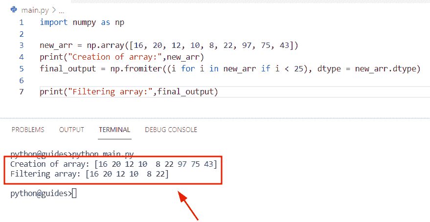

Python NumPy filter

阅读 [Python NumPy Delete](https://pythonguides.com/python-numpy-delete/)

## Python NumPy 按条件过滤二维数组

*   在这个程序中，我们将讨论如何在 Python 中过滤二维 Numpy 数组。
*   在这个例子中，我们将使用 np.1d()函数。在 Python 中，np.in1d()函数接受两个 numpy 数组，它将检查第一个数组是否包含第二个数组元素。
*   在 Python 中，np.1d()函数总是返回一个布尔数组。
*   现在让我们看看语法，理解 np.in1d()函数的工作原理。

```
import numpy as np

new_arr = np.array([[14,'m'],[16,'n'],[17,'o'],[21,'p']])
new_val = np.array(['n','o'])
result = np.in1d(new_arr[:, 1], new_val)
z=new_arr[result]
print("Filter 2-dimensional array:",z)
```

在上面的代码中，我们导入了 numpy 库，然后使用 **np.array()** 函数来创建一个数组。

之后，我们声明了变量**‘result’**，并存储了 **np.in1d()** 函数，用于两个数组相交。一旦你将打印**‘z’**，那么输出将显示来自给定数组的过滤器值。

下面是以下代码的截图

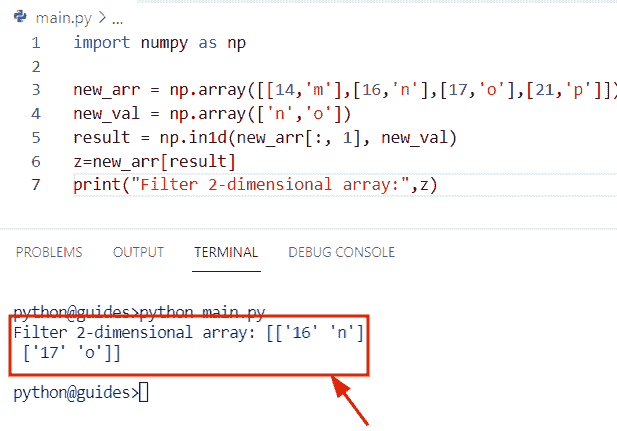

Python NumPy filter two-dimensional array by condition

读取[未找到 Python 编号](https://pythonguides.com/python-numpy-not-found/)

## Python NumPy 过滤器 2d 数组

*   在这一节中，我们将讨论如何在 Python 中过滤二维 NumPy 数组。
*   通过使用 np.any()函数，我们可以解决这个问题。在 Python 中，np.any()函数用于数组，如果输入值为真，它将检查条件。

**语法:**

下面是 np.any()方法的语法

```
numpy.any
         (
          a,
          axis=None,
          out=None,
          keepdims=<no value>,
          *,
          where=<no value>
         )
```

**举例:**

让我们举一个例子，看看如何在 Python 中过滤一个二维数组

```
import numpy as np

new_arr = np.array([[14,'m'],[16,'n'],[17,'o'],[21,'p']])
new_val = np.array(['n','o'])
d= new_arr[(new_arr[:,1,None] == new_val[None,:]).any(axis=1)]
print(d)
```

下面是以下给定代码的实现

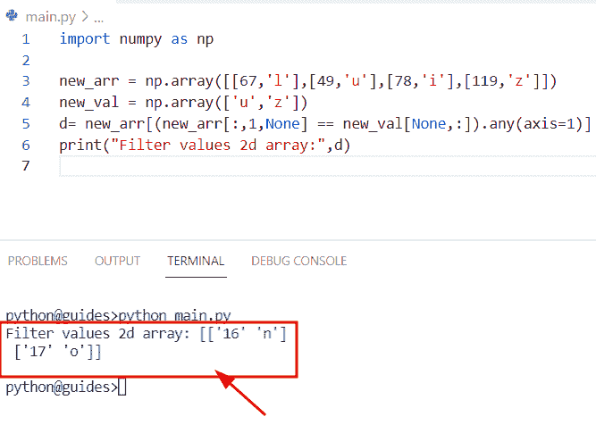

Python NumPy filter 2d array

阅读 [Python NumPy 最小教程](https://pythonguides.com/python-numpy-minimum/)

## Python NumPy 过滤器值

*   这里我们可以看到如何使用 Python 过滤 NumPy 数组中的值。
*   为了执行这个特定的任务，我们将应用数组条件方法，它将帮助用户从给定的数组中获取过滤器值。
*   在这个例子中，我们使用 np.arange()函数创建了一个 NumPy 数组。之后，我们声明了一个变量“result ”,并将数组条件存储到其中。打印“结果”后，输出将显示大于 5 的值。

**源代码:**

```
import numpy as np

new_arr= np.arange(12).reshape(3,4)
result = new_arr[new_arr > 5]
print("Filter values from array:",result)
```

你可以参考下面的截图

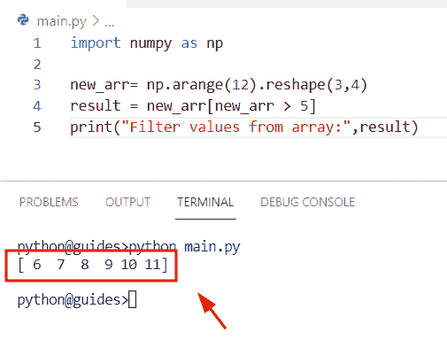

Python NumPy filter values

阅读 [Python Numpy 阶乘](https://pythonguides.com/python-numpy-factorial/)

## Python NumPy 过滤器列

*   在本节中，我们将讨论如何在 NumPy 数组 Python 中过滤列。
*   通过使用 slicing()方法，我们可以解决这个问题。在本例中，我们创建了两个数组' new_arr '和 new_val '。在第一个数组中，我们只添加了表示列值的布尔值。
*   它将检查条件，如果为真，则列值将被过滤，否则将从数组中删除。

**举例:**

让我们举一个例子，了解如何只过滤 NumPy 数组中的列值

**源代码:**

```
import numpy as np

new_arr = np.array([True, False, False])
new_val = np.array([[ 14, 26, 87 ],
        [ 87, 65, 46 ]])

result=new_val[:, new_arr]
print(result)
```

下面是以下给定代码的执行过程

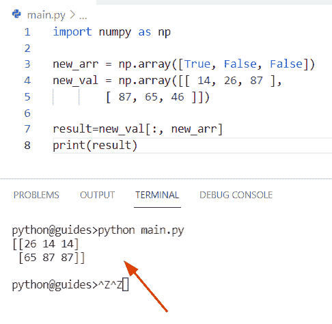

Python NumPy filter columns

正如您在屏幕截图中看到的，输出显示了更新后的数组

阅读 [Python NumPy 栈示例](https://pythonguides.com/python-numpy-stack/)

## Python NumPy 过滤器 nan

*   在本节中，我们将讨论如何在 NumPy Python 中过滤 nan 值。
*   为了执行这个特定的任务，我们将使用 isnan()函数。在 Python 中，isnan()函数用于移除给定数组中的 nan 值。此方法将检查数组中的条件，无论它是否包含 n an 值。
*   在 Python 中，nan 是一个浮点值，它被定义为非数字(Nan)。该方法将始终返回一个 NumPy 数组，结果只存储布尔值。

让我们来看看**的语法**并理解 **isnan()** 函数的工作原理

```
numpy.isnan
           (
            x,
            /,
            out=None,
            *,
            where=True,
            casting='same_kind',
            orders='K',
            dtype=None,
            subok=True
            [,
            signature,
            extobj
            ]
           )
```

**举例:**

```
import numpy as np

new_arr = np.array([67, 124, np.nan, 654,np.nan,np.nan])

result = new_arr[np.logical_not(np.isnan(new_arr))]
print("Filter nan values:",result)
```

在上面的代码中，我们导入了 numpy 库，然后使用包含三个 nan 和三个整数值的 np.array()函数初始化了一个数组。之后，我们声明了一个变量‘result’并赋予了 np.logical_not()函数。

该函数将帮助用户将假值转换为真值。因此，对于 nan 值，该值将为“False”，在此函数中，我们应用了 np.isnan()函数作为参数，它将只返回整数值。

下面是以下给定代码的实现

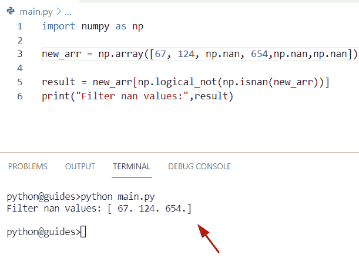

Python NumPy filter nan

阅读 [Python NumPy round + 13 示例](https://pythonguides.com/python-numpy-round/)

## Python NumPy 中值滤波器

*   在 Python 中，中值滤波器用于图像处理，它将移除中心像素部分的像素强度。
*   在 Python 中，中值滤波器不处理斑点噪声，它只处理图像的指定边缘，它还测量给定图像的像素值。
*   为了执行这个特定的任务，我们将使用 scipy.ndimage 的概念，它是一个存储图像处理和函数数量的包。在 Python 中，图像处理就像对特定图像执行某种操作。
*   在这个程序中，我们导入了两个模块‘NumPy’和‘scipy . ndimage’来过滤数组。之后，我们通过使用 np.arange()函数和 shape()来初始化一个数组。现在使用 scipy . n image . median _ filter()函数并传递 size 关键字作为转换到新数组的参数。

**语法:**

下面是 scipy . n image . median _ filter()方法的语法

```
scipy.ndimage.median_filter
                           (
                            input,
                            size=None,
                            footprint=None,
                            output=None,
                            mode='reflect',
                            cval=0.0,
                            origin=0
                           )
```

**举例:**

```
import numpy as np
import scipy.ndimage

new_arr= np.ones((7, 7))
new_arr[1:6, 1:6] = np.arange(5*5).reshape((5, 5))
cent_out_val = scipy.ndimage.median_filter(new_arr, size=(5, 5))
right_out_val = scipy.ndimage.median_filter(new_arr, size=(5, 5), origin=(0, 1))
left_out_val = scipy.ndimage.median_filter(new_arr, size=(5, 5), origin=(0, -1))
print("Creation one-dimensional array:",new_arr)
print("Centered output for array:",cent_out_val)
print("Right output for array:",right_out_val)
print("Left output for array:", left_out_val)
```

下面是以下代码的截图

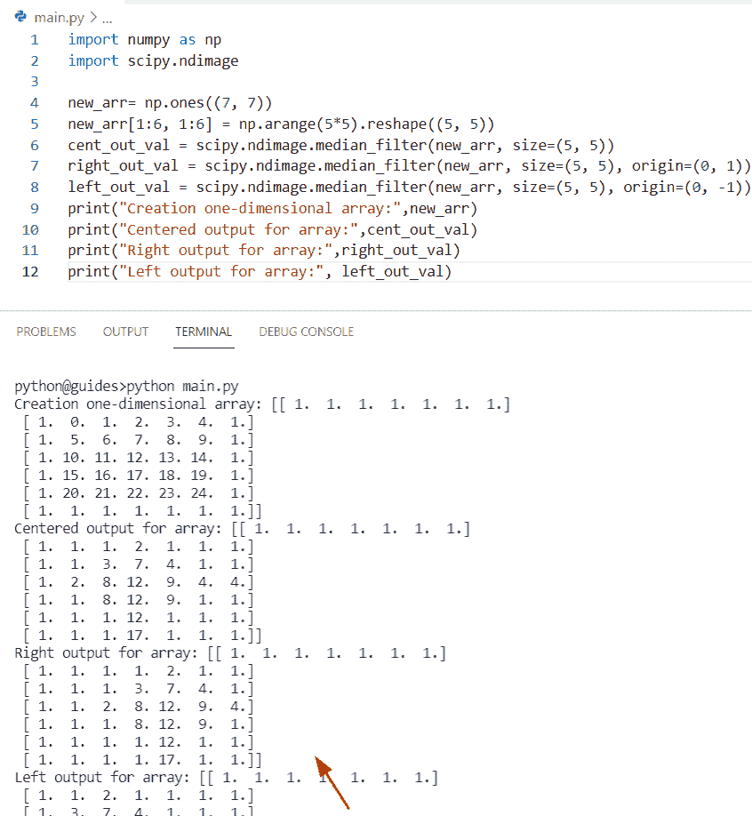

Python NumPy median filter

正如您在屏幕截图中看到的，输出显示了过滤后的数组

阅读 [Python Numpy unique](https://pythonguides.com/python-numpy-unique/)

## Python NumPy 高斯滤波器

*   在本节中，我们将讨论如何在 NumPy 数组 Python 中使用高斯滤波器()。
*   为了完成这项任务，我们将使用高斯滤波器()的概念。在 Python 中，gaussian_filter()用于模糊图像区域并去除噪声。

**语法:**

下面是 scipy.ndimage.gaussian_filter()方法的语法

```
Scipy.ndimage.gaussian_filter
                            (
                             input,
                             sigma,
                             order=0,
                             output=None,
                             mode='reflect',
                             cval=0.0,
                             truncate=4.0
                            )
```

*   它由几个参数组成
    *   **input:** 该参数表示我们要过滤掉的输入数组。
    *   **sigma:** 它指定高斯核的标准偏差，默认情况下，它只取一个整数。
    *   **顺序:**该参数沿各轴对过滤器进行排序。
    *   **输出:**默认情况下，它采用“无”值，并被视为输入。

**举例:**

```
from scipy.ndimage import gaussian_filter
import numpy as np

new_arr = np.array([[ 12,  14,  16,  18,  20],
       [22, 24, 26, 28, 30],
       [32, 34, 36, 38, 40],
       [42, 44, 46, 48, 50],
       [52, 54, 56, 58, 60]])
print("Creation of array:",new_arr)
z= gaussian_filter(new_arr, sigma=1)
print("Gaussian filter:",z) 
```

在上面的代码中，我们导入了两个模块 gaussian_filter()和 numpy。之后，我们通过使用 np.array()方法初始化一个数组，并分配整数值。现在使用 gaussian_filter()函数并传递“sigma=1”作为参数。

你可以参考下面的截图

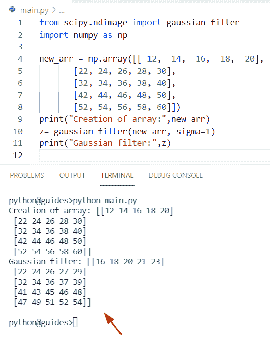

Python NumPy gaussian filter

阅读 [Python NumPy 重复](https://pythonguides.com/python-numpy-repeat/)

## Python NumPy 低通滤波器

*   在 Python 中，要删除数据信号中的频率，我们可以很容易地使用低通滤波器的概念。
*   在这个程序中，我们导入了 matplotlib 库来绘制滤波后的信号。为了完成这项任务，我们首先声明一个表示采样速率频率和滤波器截止频率的多重变量。
*   现在使用 scipy.signal.lfilter()方法，它沿着一个维度过滤数据。

**语法:**

现在让我们看看语法并理解 scipy.signal.filter()方法的工作原理

```
scipy.signal.lfilter
                    (
                     b,
                     a,
                     x,
                     axis=-1,
                     zi=None
                    )
```

**举例:**

让我们举一个例子，看看如何使用 NumPy Python 在数组中设置低通滤波器

```
import numpy as np
from scipy import signal
import scipy 
import matplotlib.pyplot as plt

i = 6
#frequency of sample rate
z = 35
#filter frequency cutoff
u = 2
#filter time second
m = 5
#total number of samples
new_val = z * m
time = np.linspace(0, m, new_val, endpoint=False)
signal = np.sin(2*np.pi*time) + 0.5*np.cos(6*2*np.pi*time) + 1.5*np.sin(9*2*np.pi*time)
p = 2 * u / z

q, r = scipy.signal.butter(i, p)

y_sig = scipy.signal.lfilter(q, r, signal)

plt.plot(time, signal, 'b-', label='signal')
plt.plot(time, y_sig, 'g-', linewidth=2, label='filtered signal')
plt.legend()
plt.show()
```

下面是以下给定代码的执行过程

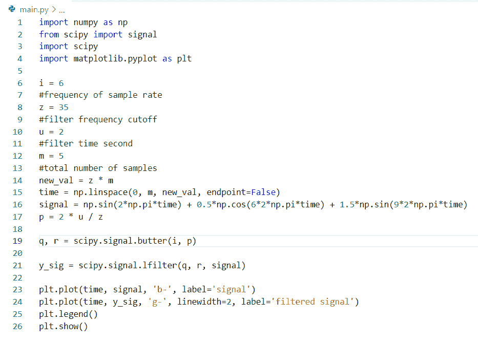

Python NumPy low as a filter

你可以参考下面的截图

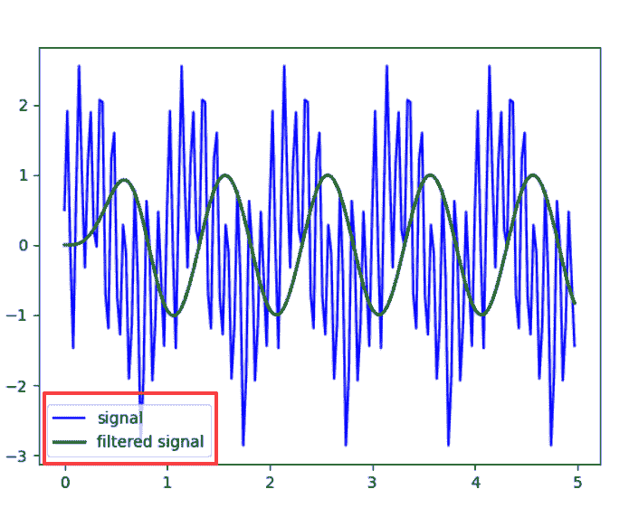

Python NumPy low as a filter graph

读取 [Python NumPy 数据类型](https://pythonguides.com/python-numpy-data-types/)

## Python NumPy 平均过滤器

*   在本次会议中，我们将讨论如何在 NumPy Python 中过滤平均值。
*   在本例中，我们将定义函数“moving_average ”,然后使用 numpy.convolve()函数计算 numpy 数组的移动平均值，这在信号处理中也很常见。
*   这个方法有三个参数，并且总是返回数组的离散线性卷积。

**语法:**

下面是 numpy.convolve()方法的语法

```
numpy.convolve
              (
               a,
               v,
               mode='full'
              )
```

**举例:**

```
import numpy as np

def moving_average(y, v):
    return np.convolve(y, np.ones(v), 'valid') / v

new_val = np.array([14,23,65,25,94,73,8,11,14,17,9,7])

print("Average filter:",moving_average(new_val,4))
```

下面是以下代码的截图

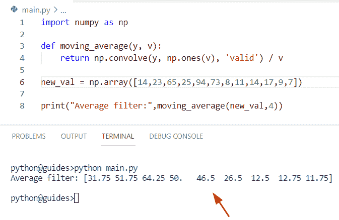

Python NumPy average filter

读取 [Python NumPy 2d 数组](https://pythonguides.com/python-numpy-2d-array/)

## Python NumPy butterworth 滤镜

*   在本期节目中，我们将讨论如何在 NumPy Python 中获取 Butterworth 滤镜。
*   在 Python 中，butterworth 用于信号处理滤波器，它设计滤波器并观察幅度。
*   在这个例子中，我们将使用 np.linspace()函数的概念，它用于创建数值。之后，我们应用 np.sin()方法来获取频率范围。

**源代码:**

```
import numpy as np
import matplotlib.pyplot as plt
from scipy import signal

new_arr = np.linspace(0,1,2000)
new_freq = np.sin(3*np.pi*200*new_arr) 
plt.plot(new_freq)
new_freq2 = np.sin(4*np.pi*40*new_arr)
plt.plot(new_freq2)
result = new_freq + new_freq2
plt.plot(result)
plt.show()
```

你可以参考下面的截图

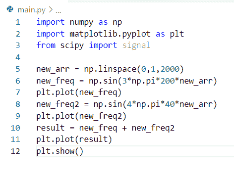

Python NumPy Butterworth filter

这是巴特沃兹图的截图

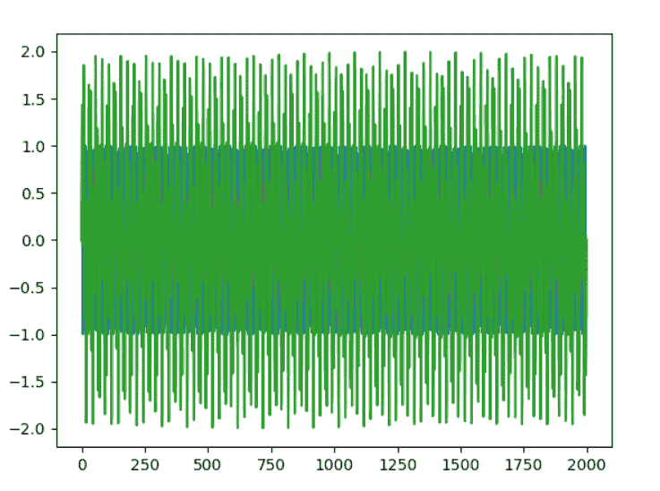

Python NumPy Butterworth filter

相关 Python NumPy 教程:

*   [Python NumPy Split + 11 示例](https://pythonguides.com/python-numpy-split/)
*   [Python NumPy 规格化](https://pythonguides.com/python-numpy-normalize/)
*   [Python NumPy Random【30 例】](https://pythonguides.com/python-numpy-random/)
*   [Python NumPy max](https://pythonguides.com/python-numpy-max-with-examples/)
*   [Python NumPy 形状示例](https://pythonguides.com/python-numpy-shape/)

在这个 Python 教程中，我们将学习如何在 Python 中过滤 NumPy 数组。此外，我们将涵盖这些主题。

*   Python NumPy 按条件过滤二维数组
*   Python NumPy 过滤器 2d 数组
*   Python NumPy 过滤器值
*   Python NumPy 过滤器列
*   Python 数字过滤器 nan
*   Python NumPy 中值滤波器
*   Python 数字高斯滤波器
*   Python NumPy 低通滤波器
*   Python NumPy 平均过滤器
*   Python NumPy 巴特沃兹滤波器

[Bijay Kumar](https://pythonguides.com/author/fewlines4biju/)

Python 是美国最流行的语言之一。我从事 Python 工作已经有很长时间了，我在与 Tkinter、Pandas、NumPy、Turtle、Django、Matplotlib、Tensorflow、Scipy、Scikit-Learn 等各种库合作方面拥有专业知识。我有与美国、加拿大、英国、澳大利亚、新西兰等国家的各种客户合作的经验。查看我的个人资料。

[enjoysharepoint.com/](https://enjoysharepoint.com/)[](https://www.facebook.com/fewlines4biju "Facebook")[](https://www.linkedin.com/in/fewlines4biju/ "Linkedin")[](https://twitter.com/fewlines4biju "Twitter")