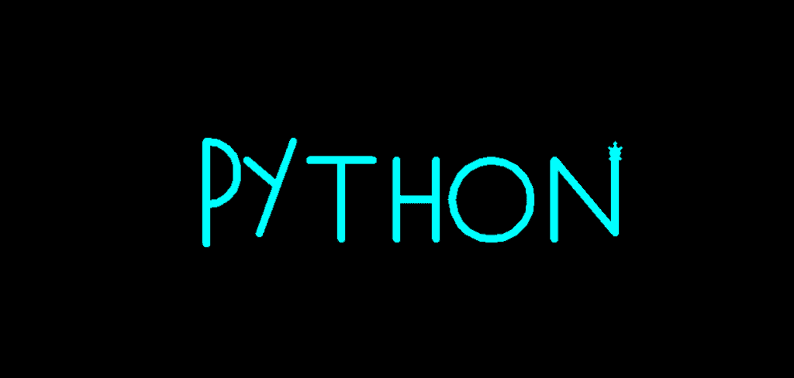

# 蟒蛇龟画字母

> 原文：<https://pythonguides.com/python-turtle-draw-letters/>

[](https://sharepointsky.teachable.com/p/python-and-machine-learning-training-course)

在本[蟒龟](https://pythonguides.com/turtle-programming-in-python/)教程中，我们将举例说明**蟒龟画字母**的概念。我们还将讨论本教程的全部代码。

## 蟒蛇龟画字母

我们正在构建一个项目，在这个项目中，我们将在 **Python Turtle** 库的帮助下学习**如何绘制不同的字母**。在这里，我们将拆分代码，解释如何使用 [Python turtle](https://pythonguides.com/python-turtle-cheat-sheet/) 中的函数和方法绘制不同的字母。

现在我们正在向前推进，开始这个项目。这里我们只是导入库。

```py
from turtle import *
import turtle
```

现在我们正在为这只乌龟创建一个对象。

```py
turt=turtle.Turtle()
```

现在我们使用函数创建一个字母。为了创建一封信，我们必须使用以下函数。

*   **tur.bgcolor("black")** 用于给屏幕背景颜色。
*   **turt.color("青色")**用于给笔上色。
*   **turt.shape("turtle")** 用于给笔赋予乌龟形状。
*   **turt.pensize(10)** 用于设置笔的大小。
*   **turt.right(90)** 用于向右移动乌龟。
*   **turt.fd(130)** 用于向前移动乌龟。
*   **turt.bk(100)** 用于向后移动乌龟。
*   **turt.left(90)** 用于向左移动乌龟。
*   **turt.circle(40，180)** 用于绘制圆形。
*   **turt.right(180)** 用于向右移动乌龟。

通过使用所有这些函数，我们可以看到在屏幕上创建了 **P** 字母。

```py
tur.bgcolor("black")
turt.color("cyan")
turt.shape("turtle")
turt.pensize(10)
turt.right(90)
turt.fd(130)
turt.bk(100)
turt.fd(50)
turt.left(90)
turt.circle(40,180)
turt.right(180)
```

现在我们使用另一个函数来创建另一个字母。为了创建另一个字母，我们使用下面的函数。

*   **turt.pensize(10)** 用于给笔指定尺寸。
*   **turt.penup()** 用于停止绘图。
*   **turt.fd(110)** 用于向前移动乌龟。
*   **turt.pendown()** 用于开始绘图。
*   **turt.right(110)** 用于向右移动乌龟。
*   **turt.bk(65)** 用于向后移动乌龟。

通过使用所有这些功能，我们可以看到屏幕上创建了 **Y** 字母。

```py
turt.pensize(10)
turt.penup()
turt.fd(110)
turt.pendown()
turt.right(110)
turt.fd(125)
turt.bk(65)
turt.right(110)
turt.fd(50)
turt.right(140)
```

现在我们使用另一个函数来创建另一个字母。为了创建另一封信，我们使用了以下函数。

*   **turt . penzize(10)**用于给出钢笔的大小。
*   **turt.penup()** 用于停止绘图。
*   **turt.fd(120)** 用于向前移动乌龟。
*   **turt.right(90)** 用于向右移动乌龟。
*   **turt.pendown()** 用于开始绘图。
*   **turt.bk(100)** 用于向后移动乌龟。
*   **turt.left(90)** 用于向左移动乌龟。

通过使用所有这些函数，我们可以看到屏幕上创建了 **T** 字母。

```py
turt.pensize(10)
turt.penup()
turt.fd(120)
turt.right(90)
turt.pendown()
turt.fd(100)
turt.bk(100)
turt.left(90)
turt.fd(40)
turt.bk(80)
```

现在我们使用另一个函数来创建另一个字母。为了创建另一封信，我们使用了以下函数。

*   **turt.pensize(10)** 用于给笔一个尺寸。
*   **turt.penup()** 是停止绘图。
*   **turt.fd(110)** 用于向前移动乌龟。
*   **turt.pendown()** 用于开始绘图。
*   **turt.right(90)** 用于向右移动乌龟。
*   **turt.bk(50)** 用于向后移动乌龟。
*   **turt.left(90)** 用于向左移动乌龟。

通过使用这些函数，我们可以看到字母 **H** 在屏幕上被创建。

```py
turt.pensize(10)
turt.penup()
turt.fd(110)
turt.pendown()
turt.right(90)
turt.fd(100)
turt.bk(50)
turt.left(90)
turt.fd(50)
turt.left(90)
turt.fd(50)
turt.bk(100)
```

现在我们使用另一个函数来创建另一个字母。为了创建另一封信，我们使用了以下函数。

*   **turt.pensize(10)** 用于给笔一个尺寸。
*   **turt.penup()** 用于停止绘图。
*   **turt.right(90)** 用于向右移动乌龟。
*   **turt.fd(70)** 用于向前移动乌龟。
*   **turt.pendown()** 用于开始绘图。
*   **圆(50)** 用于在屏幕上画一个圆。

通过使用这些功能，我们可以看到字母 **O** 在屏幕上被创建。

```py
turt.pensize(10)
turt.penup()
turt.right(90)
turt.fd(70)
turt.pendown()
turt.circle(50)
```

现在我们使用另一个函数来创建另一个字母。为了创建另一封信，我们使用了以下函数。

*   **turt.pensize(10)** 用于给笔指定尺寸。
*   **turt.penup()** 用于停止绘图。
*   **turt.fd(80)** 用于向前移动乌龟。
*   **turt.left(90)** 用于向左移动乌龟。
*   **turt.pendown()** 用于开始绘图。
*   **turt.right(140)** 用于向右移动乌龟。

通过使用这些函数，我们可以看到字母 **N** 在屏幕上被创建。

```py
turt.pensize(10)
turt.penup()
turt.fd(80)
turt.left(90)
turt.pendown()
turt.fd(100)
turt.right(140)
turt.fd(120)
turt.left(140)
turt.fd(100)
turtle.done()
```

此后分解代码并解释**我们如何使用**蟒蛇龟**绘制字母**。现在，我们将看到运行整个代码后的输出。

```py
from turtle import *
import turtle

tur=turtle.Screen()
turt=turtle.Turtle()
tur.bgcolor("black")
turt.color("cyan")
turt.shape("turtle")
turt.pensize(10)
turt.right(90)
turt.fd(130)
turt.bk(100)
turt.fd(50)
turt.left(90)
turt.circle(40,180)
turt.right(180)

turt.pensize(10)
turt.penup()
turt.fd(110)
turt.pendown()
turt.right(110)
turt.fd(125)
turt.bk(65)
turt.right(110)
turt.fd(50)
turt.right(140)

turt.pensize(10)
turt.penup()
turt.fd(120)
turt.right(90)
turt.pendown()
turt.fd(100)
turt.bk(100)
turt.left(90)
turt.fd(40)
turt.bk(80)

turt.pensize(10)
turt.penup()
turt.fd(110)
turt.pendown()
turt.right(90)
turt.fd(100)
turt.bk(50)
turt.left(90)
turt.fd(50)
turt.left(90)
turt.fd(50)
turt.bk(100)

turt.pensize(10)
turt.penup()
turt.right(90)
turt.fd(70)
turt.pendown()
turt.circle(50)

turt.pensize(10)
turt.penup()
turt.fd(80)
turt.left(90)
turt.pendown()
turt.fd(100)
turt.right(140)
turt.fd(120)
turt.left(140)
turt.fd(100)
turtle.done()
```

运行上面的代码后，我们得到下面的输出，我们可以看到屏幕上绘制了不同的字母。



Python turtle draw letters Output

所以，在这个项目中，我们举例说明了 **Python 乌龟画字母**的例子。此外，我们还讨论了本项目中使用的全部代码。

另外，看看更多关于 Python turtle 的教程。

*   [蟒龟画线](https://pythonguides.com/python-turtle-draw-line/)
*   [蟒龟之窗](https://pythonguides.com/python-turtle-window/)
*   [蟒龟鼠](https://pythonguides.com/python-turtle-mouse/)
*   [蟒龟兽皮](https://pythonguides.com/python-turtle-hide/)
*   [蟒龟获得位置](https://pythonguides.com/python-turtle-get-position/)
*   [分形蟒龟](https://pythonguides.com/fractal-python-turtle/)
*   [蟒清龟](https://pythonguides.com/python-clear-turtle/)
*   [蟒龟钟](https://pythonguides.com/python-turtle-clock/)
*   [蟒蛇龟图形](https://pythonguides.com/python-turtle-graphics/)
*   [蟒龟圆点](https://pythonguides.com/python-turtle-dot/)

[Bijay Kumar](https://pythonguides.com/author/fewlines4biju/)

Python 是美国最流行的语言之一。我从事 Python 工作已经有很长时间了，我在与 Tkinter、Pandas、NumPy、Turtle、Django、Matplotlib、Tensorflow、Scipy、Scikit-Learn 等各种库合作方面拥有专业知识。我有与美国、加拿大、英国、澳大利亚、新西兰等国家的各种客户合作的经验。查看我的个人资料。

[enjoysharepoint.com/](https://enjoysharepoint.com/)[](https://www.facebook.com/fewlines4biju "Facebook")[](https://www.linkedin.com/in/fewlines4biju/ "Linkedin")[](https://twitter.com/fewlines4biju "Twitter")