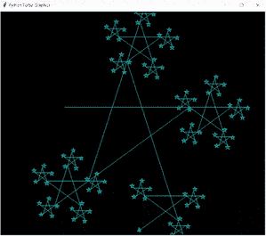
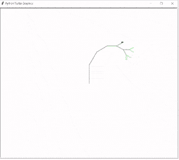
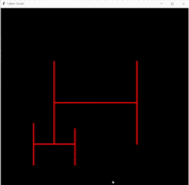
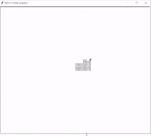

# 分形蟒蛇龟+例子

> 原文：<https://pythonguides.com/fractal-python-turtle/>

[](https://sharepointsky.teachable.com/p/python-and-machine-learning-training-course)

在本 Python 教程中，我们将学习**分形 Python 龟**，我们还将涵盖与分形龟相关的不同例子。我们将讨论这些话题。

*   分形蟒蛇龟
*   分形树巨蟒龟
*   分形递归 python 海龟
*   分形绘图龟

目录

[](#)

*   [分形蟒龟](#Fractal_python_turtle "Fractal python turtle")
*   [分形树蟒龟](#Fractal_tree_python_turtle "Fractal tree python turtle")
*   [分形递归蟒龟](#Fractal_recursion_python_turtle "Fractal recursion python turtle")
*   [分形画龟](#Fractal_drawing_turtle "Fractal drawing turtle")

## 分形蟒龟

在这一节，我们将学习[巨蟒龟](https://pythonguides.com/turtle-programming-in-python/)中关于分形龟的**。**

**分形蟒蛇龟**用于制作不同比例和大小的几何形状。在这种情况下，它使重复的几何形状在不同的规模和大小下工作，而不是相同的形状。

**代码:**

在下面的代码中，我们使用了分形的 python 乌龟来表示几何形状。为了创建它，我们导入了 turtle 库。

我们使用 **speed()、penup()、pendown()、forward()、left() goto()** 、 **getscreen()和 bgcolor()** 函数来制作这个几何图形。

*   **speed()** 用于给出我们创建几何图形的速度。
*   **penup()** 用于停止绘图。
*   **pendown()** 用于开始绘图。
*   **goto()** 用于移动乌龟。
*   **前进()**用于将乌龟向前移动。
*   **left()** 用于向左移动乌龟。

```
from turtle import *

import turtle

tur = turtle.Turtle()

tur.speed(6)

tur.getscreen().bgcolor("black")
tur.color("cyan")

tur.penup()

tur.goto((-200, 50))

tur.pendown()

def star(turtle, size):
    if size <= 10:
        return
    else:
        for i in range(5):

            turtle.forward(size)
            star(turtle, size/3)

            turtle.left(216)

star(tur, 360)
turtle.done()
```

**输出:**

在下面的输出中，我们可以看到不同的几何形状和不同的比例，我们使用 **speed()、penup()、pendown()、forward()、left()和 goto()** 函数来制作这个几何形状。



fractal turtle python

还有，检查:[蟒龟圆点](https://pythonguides.com/python-turtle-dot/)

## 分形树蟒龟

在这一节中，我们将学习如何在 python turtle 中创建分形树龟。

在这里，我们使用 python fractal 创建了一棵树，我们创建了子分支(左和右),我们缩短了新的子分支，直到我们到达最小末端来创建一棵树。

**代码:**

在下面的代码中，我们从 turtle import * 、 **import turtle** 中导入 turtle 模块**来创建这个分形树。**

为了创建一棵树，我们指定 x 轴和 y 轴来定义 y 分支之间的锐角。

我们指定了 **speed()** 函数来帮助绘制用户指定速度下的形状。

*   **speed()** 用来定义笔绘制形状的速度。
*   **y 轴()**用于绘制 Y 轴
*   **pencolor()** 用于根据色阶设置颜色。

```
from turtle import *
import turtle

speed('fastest')

right(-90)

angle = 30

def yaxis(size, lvl):   

    if lvl > 0:
        colormode(255)

        pencolor(0, 255//lvl, 0)

        forward(size)

        right(angle)

        yaxis(0.8 * size, lvl-1)

        pencolor(0, 255//lvl, 0)

        lt( 2 * angle )

        yaxis(0.8 * size, lvl-1)

        pencolor(0, 255//lvl, 0)

        right(angle)
        forward(-size)

yaxis(80, 7)
turtle.done()
```

**输出:**

运行上面的代码后，我们得到了下面的输出，我们可以看到分形树的大小是 80，级别是 7。



fractal tree python turtle Output

阅读:[蟒龟 onclick](https://pythonguides.com/python-turtle-onclick/)

## 分形递归蟒龟

在这一节，我们将学习 python turtle 中关于分形递归的**。**

递归是重复单元的过程，与分形用于生成无限数量的图片副本以形成分形图案的方式类似。

**代码:**

在下面的代码中，我们导入了一个 turtle 库，我们定义了一个名为**“Python Guides”**的窗口的标题，指定了 **bg_color** 并给出了屏幕的高度和宽度。

我们定义了从 pos1 绘制到 pos2 的 **drawline()** (位置是 pos 的一个短语)，然后我们分配了 **recursive()** 用于生成同一张图片的多个副本。

```
from turtle import *
import turtle

speed = 5
bg_color = "black"
pen_color = "red"
screen_width = 800
screen_height = 800
drawing_width= 700
drawing_height = 700
pen_width = 5
title = "Python Guides"
fractal_depth = 3

def drawline(tur, pos1, pos2):
    tracing the algorithm.
    tur.penup()
    tur.goto(pos1[0], pos1[1])
    tur.pendown()
    tur.goto(pos2[0], pos2[1])

def recursivedraw(tur, x, y, width, height, count):
    drawline(
        tur,
        [x + width * 0.25, height // 2 + y],
        [x + width * 0.75, height // 2 + y],
    )
    drawline(
        tur,
        [x + width * 0.25, (height * 0.5) // 2 + y],
        [x + width * 0.25, (height * 1.5) // 2 + y],
    )
    drawline(
        tur,
        [x + width * 0.75, (height * 0.5) // 2 + y],
        [x + width * 0.75, (height * 1.5) // 2 + y],
    )

    if count <= 0:  # The base case
        return
    else:  # The recursive step
        count -= 1

        recursivedraw(tur, x, y, width // 2, height // 2, count)

        recursivedraw(tur, x + width // 2, y, width // 2, height // 2, count)

        recursivedraw(tur, x, y + width // 2, width // 2, height // 2, count)

        recursivedraw(tur, x + width // 2, y + width // 2, width // 2, height // 2, count)

if __name__ == "__main__":

    screenset = turtle.Screen()
    screenset.setup(screen_width, screen_height)
    screenset.title(title)
    screenset.bgcolor(bg_color)

    artistpen = turtle.Turtle()
    artistpen.hideturtle()
    artistpen.pensize(pen_width)
    artistpen.color(pen_color)
    artistpen.speed(speed)

    recursivedraw(artistpen, - drawing_width / 2, - drawing_height / 2, drawing_width, drawing_height, fractal_depth)

    turtle.done()
```

**输出:**

在下面的输出中，我们可以看到递归是如何工作的，以及如何制作一张图片的相同副本。



Fractal recursion python turtle Output

阅读:[蟒龟赛跑](https://pythonguides.com/python-turtle-race/)

## 分形画龟

本节我们将学习**如何在 python turtle 中绘制分形图**。

分形用于生成无限数量的图片副本，形成分形图案。这幅分形图是在一只乌龟的帮助下绘制的。

**代码:**

在下面的代码中，我们已经导入了 turtle 库，之后，我们定义了 **fractdraw()** 之后，我们使用 **left() right() forward()** 来给出模式的方向。

```
from turtle import *
import turtle

def fractdraw(stp, rule, ang, dept, t):
   if dept > 0:
      x = lambda: fractdraw(stp, "a", ang, dept - 1, t)
      y = lambda: fractdraw(stp, "b", ang, dept - 1, t)
      left = lambda: t.left(ang)
      right = lambda: t.right(ang)
      forward = lambda: t.forward(stp)
      if rule == "a":
        left(); y(); forward(); right(); x(); forward(); x(); right(); forward(); y(); left();
      if rule == "b":
        right(); x(); forward(); left(); y(); forward(); y(); left(); forward(); x(); right();

turtle = turtle.Turtle()
turtle.speed(0)
fractdraw(5, "a", 90, 5, turtle)
```

**输出:**

在下面的输出中，我们可以看到我们如何绘制分形海龟，以及它如何使用分形图案多次创建相同的图片。



Fractal drawing turtle Output

你可能也喜欢阅读下面的教程。

*   [蟒龟示踪器](https://pythonguides.com/python-turtle-tracer/)
*   [蟒龟之窗](https://pythonguides.com/python-turtle-window/)
*   [蟒龟三角](https://pythonguides.com/python-turtle-triangle/)
*   [Replit 蟒蛇龟](https://pythonguides.com/replit-python-turtle/)
*   [蟒蛇龟椭圆形](https://pythonguides.com/python-turtle-oval/)
*   [巨蟒龟大小](https://pythonguides.com/python-turtle-size/)
*   [蟒龟鼠](https://pythonguides.com/python-turtle-mouse/)
*   [蟒龟字体](https://pythonguides.com/python-turtle-font/)
*   [蟒龟获得位置](https://pythonguides.com/python-turtle-get-position/)

在这里，我们将讨论**分形 Python Turtle** ，我们也已经涵盖了与其实现相关的不同示例。这是我们已经讨论过的例子列表。

*   分形蟒蛇龟
*   分形树巨蟒龟
*   分形递归 python 海龟
*   分形绘图龟

[Bijay Kumar](https://pythonguides.com/author/fewlines4biju/)

Python 是美国最流行的语言之一。我从事 Python 工作已经有很长时间了，我在与 Tkinter、Pandas、NumPy、Turtle、Django、Matplotlib、Tensorflow、Scipy、Scikit-Learn 等各种库合作方面拥有专业知识。我有与美国、加拿大、英国、澳大利亚、新西兰等国家的各种客户合作的经验。查看我的个人资料。

[enjoysharepoint.com/](https://enjoysharepoint.com/)[](https://www.facebook.com/fewlines4biju "Facebook")[](https://www.linkedin.com/in/fewlines4biju/ "Linkedin")[](https://twitter.com/fewlines4biju "Twitter")