# python NumPy nan–完整教程

> 原文：<https://pythonguides.com/python-numpy-nan/>

[](https://sharepointsky.teachable.com/p/python-and-machine-learning-training-course)

在本 Python 教程中，我们将通过如下几个例子来讨论 **Python NumPy nan** :

*   Python numpy Nan 到零
*   Python numpy 创建 Nan 数组
*   Python numpy Nan 到 none
*   Python numpy Nan 的意思是
*   Python numpy Nan 最大值
*   Python numpy Nan min
*   Python 数字南索引
*   Python numpy 从数组中移除 Nan
*   Python numpy 用空字符串替换 Nan
*   Python numpy Nan 平均值
*   Python numpy Nan 等于
*   Python numpy Nan 比较

目录

[](#)

*   [Python numpy nan](#Python_numpy_nan "Python numpy nan")
*   [如何检查 numpy 数组中的 nan 值(另一种方法)](#How_to_check_the_nan_values_in_numpy_array_another_method "How to check the nan values in numpy array (another method)")
*   [Python numpy nan 到零](#Python_numpy_nan_to_zero "Python numpy nan to zero")
*   [在 numpy 数组中用零转换 nan 值的另一种方法](#Another_method_to_convert_nan_values_with_zeros_in_numpy_array "Another method to convert  nan values with zero’s in numpy array")
*   [Python numpy 创建 nan 数组](#Python_numpy_create_nan_array "Python numpy create nan array")
*   [检查如何创建 numpy nan 数组的另一种方法](#Another_method_to_check_how_to_create_numpy_nan_array "Another method to check how to create numpy nan array")
*   [Python numpy nan to none](#Python_numpy_nan_to_none "Python numpy nan to none")
*   [Python numpy nanmean](#Python_numpy_nanmean "Python numpy nanmean")
*   [Python numpy nanmax](#Python_numpy_nanmax "Python numpy nanmax")
*   [Python numpy nanmin](#Python_numpy_nanmin "Python numpy nanmin")
*   [Python numpy nan 索引](#Python_numpy_nan_index "Python numpy nan index")
*   [Python numpy 从数组中移除 nan](#Python_numpy_remove_nan_from_array "Python numpy remove nan from array")
*   [从数组中移除 nan 值的另一种方法](#Another_method_to_remove_nan_values_from_array "Another method to remove nan values from array")
*   [从数组中移除 nan 值的运算符方法](#Operator_method_to_remove_nan_values_from_array "Operator method to remove nan values from array")
*   [Python numpy 用空字符串替换 nan](#Python_numpy_replace_nan_with_empty_string "Python numpy replace nan with empty string")
*   [Python numpy nan 平均值](#Python_numpy_nan_average "Python numpy nan average")
*   [Python numpy nan 等于](#Python_numpy_nan_equal "Python numpy nan equal")
*   [Python numpy nan 比较](#Python_numpy_nan_compare "Python numpy nan compare")

## Python numpy nan

*   在本节中，我们将讨论 **Python numpy nan**
*   要检查一个 [Python Numpy 数组](https://pythonguides.com/python-numpy-array/)中的 NaN 值，可以使用 **np.isnan()方法**。
*   NaN 代表的不是一个数字。NaN 用于表示未定义的条目。它还用于表示给定数组中缺失的 NAN 值。
*   此方法是一个特殊的浮点值，不能转换为除 float 以外的任何其他类型。
*   我想让你记住的重要一点是，我们所有的整数值都被转换成了浮点数，这是因为 NumPy 模块定义了 NaN float 数据类型
*   它是在一个 numpy 数组中用 nan，inf 这样的特殊值定义的。
*   Numpy 使用 IEEE 浮点标准进行运算。这意味着 nan 不等同于无穷大值。

**语法:**

下面是 **numpy.isnan** 的语法

```py
numpy.isnan
           (
            x,
            out=None,
            where=True,
            casting='same_kind',
            order='k',
            dtype=None
           ) 
```

*   它由几个参数组成
    *   **X:** 输入数组
    *   **Out:** 存储结果的位置。如果提供的话，它应该具有输入所提供的形状。如果未提供或没有值，则返回新分配的数组。
    *   **其中:**可选参数。这种情况通过输入广播。在所有条件都为真的位置，out 参数将显示在将被设置为函数结果的数组中。在其他地方，out numpy 数组将获得其原始值。
    *   **返回:**它总是返回一个布尔表达式，其大小为原始数组的大小。

**举例:**

```py
import numpy as np
arr = np.array([2, np.nan, 6, 8, 9, 10, np.nan])
b = np.isnan(arr) 
print(b) 
```

*   在上面的代码中，我们将导入一个 numpy 库，并使用函数 np 创建一个数组。数组。现在我们将创建一个变量并将值存储在 isnan 方法中。
*   输出数组有一个布尔掩码，对于原始数组中不是数字的索引为 true，对于其余的索引为 false。

下面是以下代码的截图

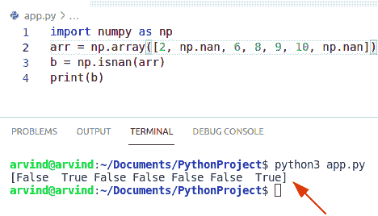

Python numpy nan

阅读: [Python NumPy concatenate](https://pythonguides.com/python-numpy-concatenate/)

## 如何检查 numpy 数组中的 nan 值(另一种方法)

*   不是一个数字(nan)实现的标准键是唯一的值，对于该值，不等式与自身的比较应该返回 True，否则返回 false。
*   在这个方法中，我们使用函数 is_nan 和 for 循环。
*   如果是一个数字，比较应该成功，并以布尔掩码的形式返回结果。

**举例:**

```py
def is_nan(x):
    return (x != x)
import numpy as np
values = [float('nan'), np.nan, 55, "string", lambda x : x]
for value in values:
    print(f"{repr(value):<8} : {is_nan(value)}")
```

下面是以下代码的截图

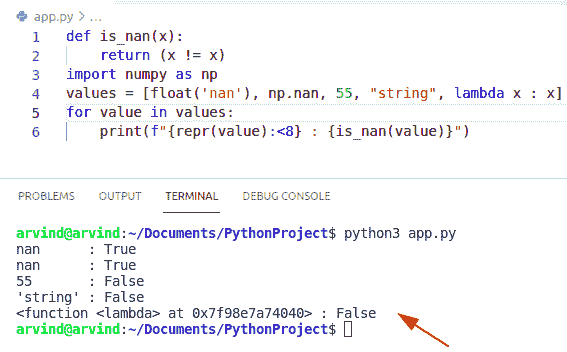

Python numpy nan isnan method

阅读 [Python Numpy 阶乘](https://pythonguides.com/python-numpy-factorial/)

## Python numpy nan 到零

*   在这个方法中，我们可以很容易地使用函数 numpy.nan_to_num。
*   **用零替换数组中的 n an 值会将每个 NaN 值转换为零。**
*   我们可以很容易地使用 np.nan_to_num 方法将 numpy nan 转换为零。
*   如果我们想将 nan 值转换为零，就要使用 nan_to_num()函数。它总是返回最大的正无穷大和最小的负无穷大。

**语法:**

```py
numpy.nan_to_num
                (
                 x,
                 copy=True,
                 nan=0.0,
                 posinf=None,
                 neginf=None
                )
```

*   它由几个参数组成
    *   **X:** 输入数据
    *   **Copy:** 可选参数。是创建 x 的副本还是就地交换值。就地函数仅在转换为不需要相同数组的数组时发生。默认参数为 True。
    *   **Nan** :用于填充非数字值的值。如果没有值通过数组传递，则 NaN 值将被替换为 0.0。
    *   **posinfo:**用于填充正无穷大值。如果没有值被传递，那么正值将与一个大的数交换。

**举例:**

```py
import numpy as np
arr = np.array([2, np.nan, np.nan, np.nan, np.nan, 10, np.nan])
b = np.nan_to_num(arr) 
print(b) 
```

*   在上面的代码中，我们将导入一个 numpy 库，并使用函数 numpy.array 创建一个数组。
*   输出数组将以零值和 posinf 值的形式显示。

下面是以下代码的截图

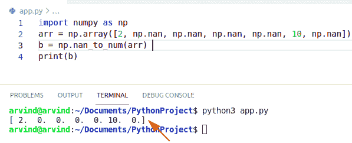

Python numpy nan to zero

阅读 [Python NumPy linspace](https://pythonguides.com/python-numpy-linspace/)

## 在 numpy 数组中用零转换 nan 值的另一种方法

*   在这个方法中，函数 isnan 产生一个布尔数组，它指示 nan 值的位置。布尔数组总是可以用于索引。
*   我们可以使用 np.where 找到一个有 Nan 值的索引值。
*   我们可以很容易地使用函数 np.where 和 np.nan 来转换带有零的 nan 值。

**举例:**

```py
import numpy as np
arr = np.array([[2, np.nan, np.nan, np.nan, np.nan, 10, np.nan],
                [3, np.nan, np.nan, np.nan, np.nan, 7, np.nan ],
                [4, np.nan, np.nan, np.nan, np.nan, 6, np.nan]])
b = np.where(np.isnan(arr),0,arr) 
print(b) 
```

下面是以下代码的截图

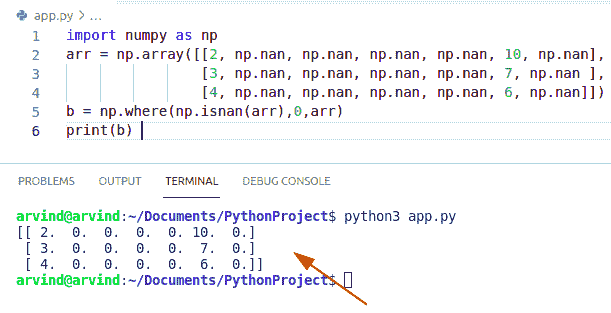

Python numpy nan to zero np. where the method

## Python numpy 创建 nan 数组

*   在本节中，我们将讨论 **Python numpy 创建 nan 数组**。
*   要创建一个具有 nan 值的数组，我们必须使用 numpy.empty()和 fill()函数。
*   它返回一个与给定数组具有相同形状和类型的数组。
*   用 np。empty((x，y))创建一个具有 x 行 y 列的未初始化的 numpy 数组。然后，我们必须在数组中给 NaN 赋值。

**举例:**

```py
import numpy as np

arr = np.empty((5,5))
arr[:] = np.NaN
print(arr)
```

*   在上面的代码中，我们将导入一个 numpy 库，我们可以创建一个未初始化的数组，并一次性将其分配给所有条目。
*   在这个例子中，我们可以很容易地使用函数 numpy.empty 和 np.nan 来创建数组中的 nan 值。

下面是以下代码的截图

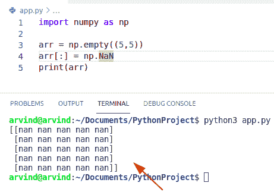

Python numpy create nan array

阅读 [Python NumPy where 示例](https://pythonguides.com/python-numpy-where/)

## 检查如何创建 numpy nan 数组的另一种方法

*   在这个例子中，我们可以很容易地使用函数 numpy.nan 和 numpy.ones .来声明一个具有 x 行和 y 列的初始化的 numpy 数组。
*   我们使用乘法方法来获得数组中的 nan 值。

**举例:**

让我们举一个例子来检查**如何创建一个 NumPy nan 数组**

```py
import numpy as np

b= np.nan * np.ones(shape=(3,2))
print(b)
```

下面是以下代码的截图

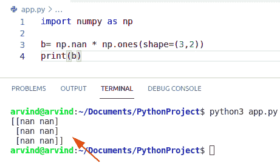

Python numpy creates nan array np. one’s method

## Python numpy nan to none

*   在本节中，我们将讨论 **Python numpy nan to none** 。
*   没有一个数(Nan)可以作为数理统计运算上的数值，而 None 值则不能至少包含不该包含的值。NaN 是一个数字浮点值，如 IEEE 754 浮点标准中所定义。None 是内部 Python 类型，更像是不存在，而不是数值无效。
*   在这个例子中，我们可以使用函数 numpy.fill()和 numpy.nan()。如果我们将一个整数数组中的值设置为 np.nan，它将自动转换为 none 值。

**举例:**

让我们举一个例子来检查 **numpy nan 到 none**

```py
import numpy as np

A = np.array([2,3,np.nan,np.nan,np.nan])
b = A.fill(np.nan)
print(b)
```

下面是以下代码的截图

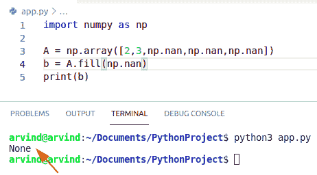

Python numpy nan to none

阅读 [Python NumPy 日志](https://pythonguides.com/python-numpy-log/)

## Python numpy nanmean

*   在本节中，我们将讨论 **Python numpy nanmean** 。
*   在这个例子中，我们可以使用函数 numpy.nanmean()
*   这个函数可以用来计算数组的平均值。如果数组有一个 NaN 值，我们可以在不受 NaN 值影响的情况下求出平均值。
*   它将返回数组元素的平均值。

**语法:**

下面是 numpy 可以表示的语法

```py
numpy.nanmean
             (
              arr,
              axis=None,
              dtype=None,
              out=None,
              )
```

**举例:**

```py
import numpy as np

A = np.array([2,3,4,np.nan,np.nan])
b = np.nanmean(A)
print(b)
```

下面是以下代码的截图

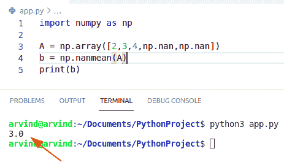

Python numpy can mean

## Python numpy nanmax

*   在本节中，我们将讨论 **Python numpy nanmax** 。
*   在这个例子中，我们可以使用函数 numpy。nanmax()。
*   这个函数用来返回一个数组的最大值，或者沿着数组中任何一个特别提到的轴。
*   移除与 arr 形状相同、具有特定轴的数组。如果是 0 维 numpy 数组，或者如果轴为 None，则返回 numpy 维数组标量。
*   沿给定轴的 numpy 数组的最大值。

**语法:**

下面是 np 的语法。南麦克斯()

```py
numpy.nanmax
            (
             arr,
             axis=None,
             out=None
            )
```

**举例:**

```py
import numpy as np

A = np.array([8,4,6,np.nan,np.nan])
b = np.nanmax(A)
print("max of arr : ", np.amax(A))
print(b)
```

下面是以下代码的截图

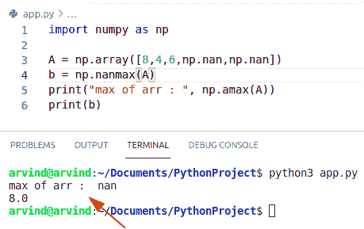

Python numpy nanmax

读取[值错误:用序列](https://pythonguides.com/valueerror-setting-an-array-element-with-a-sequence/)设置数组元素

## Python numpy nanmin

*   在本节中，我们将讨论 **Python numpy 闵楠**。
*   在这个例子中，我们可以很容易地使用函数 np.nanmin()。
*   这个函数用于返回一个数组的最小值，或者沿着数组中任何一个特别提到的轴。
*   沿给定轴的数组的最小值，提供任何 NaNs 值。

**语法:**

下面是 numpy.nanmin()的语法

```py
numpy.nanmin
            (
             arr,
             axis=None,
             out=None
            )
```

**举例:**

```py
import numpy as np

A = np.array([7,2,6,np.nan,np.nan])
b = np.nanmin(A)
print("min of arr : ", np.amin(A))
print(b)
```

*   首先在上面的代码中，我们将创建一个 numpy 库并使用 np.array 函数创建一个函数，并在参数中分配 nan 和非 nan 值。
*   现在，我们可以很容易地使用函数闵楠()返回一个数组的最小值或沿轴的最小值。

下面是以下代码的截图

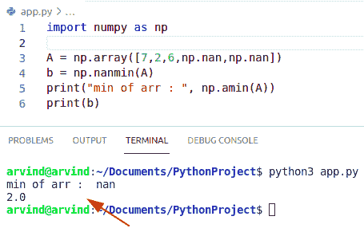

Python numpy nanmin

## Python numpy nan 索引

*   在本节中，我们将讨论 **Python numpy nan 索引**。
*   在这个例子中，我们可以很容易地使用函数 np.argmin 来获得 nan 值的索引。
*   它将总是返回指定轴上最小值的索引，忽略 NaN 值

**语法:**

下面是 numpy.argmin 的语法

```py
numpy.nanargmin
               (
                arr,
                axis=None
               )
```

*   它由几个参数组成
    *   **数组:**输入数据
    *   **轴:**可选参数。操作所沿的轴。默认情况下，使用扁平输入。
    *   **返回:**单个索引值的数组。

**举例:**

```py
import numpy as np

A = np.array([7,2,6,np.nan])
b = np.argmin(A)

print(b)
```

下面是以下代码的截图

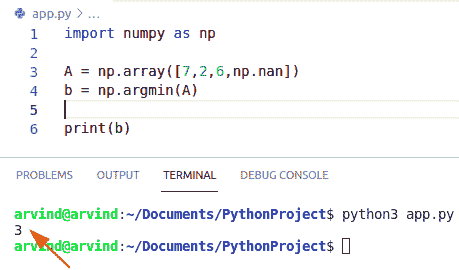

Python numpy nan index

阅读 [Python NumPy 平均值及示例](https://pythonguides.com/python-numpy-average/)

## Python numpy 从数组中移除 nan

*   在这一节中，我们将讨论 Python numpy 从数组中移除 nan。
*   在这个方法中，我们可以使用 logical_not()和 isnan()函数从给定的数组中删除 nan 值。
*   Logical_not()用于对 numpy 数组的元素执行逻辑 not。isnan()方法是一个布尔函数，它检查一个元素是否为 nan 值。
*   所以，最后，我们得到所有非 nan 元素的索引值。

**举例:**

```py
import numpy as np

arr = np.array([4,2,6,np.nan,np.nan,8,np.nan])
b = arr[np.logical_not(np.isnan(arr))]

print(b)
```

下面是以下代码的截图

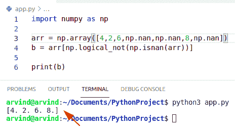

Python numpy remove nan from an array

## 从数组中移除 nan 值的另一种方法

*   要在 Python 中从 numpy 数组中删除 nan 值，我们可以很容易地使用 isfinite()函数。
*   isfinite()方法是一个布尔函数，它检查一个值是否是有限的。

**举例:**

```py
import numpy as np

arr = np.array([3,4,6,np.nan,np.nan,9,np.nan])
b = arr[np.isfinite(arr)]

print(b)
```

下面是以下代码的截图

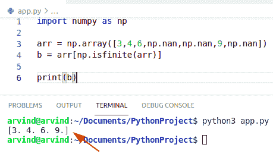

Python numpy remove nan from array isfinite method

读取 [Python NumPy 绝对值](https://pythonguides.com/python-numpy-absolute-value/)

## 从数组中删除 nan 值的运算符方法

*   在这个例子中，我们可以用 np.isnan()函数连接~运算符。
*   如果 numpy 数组的维数是 2 维，它将转换为 1 维数组。

**举例:**

```py
import numpy as np

arr = np.array([[3,4,6,np.nan,np.nan,9,np.nan],
               [2,5,6,np.nan,np.nan,3,np.nan]])
b = arr[~(np.isnan(arr))]

print(b)
```

下面是以下代码的截图

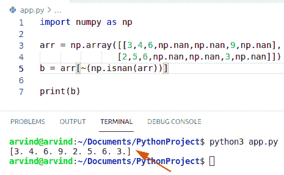

Python numpy remove nan from array operator method

## Python numpy 用空字符串替换 nan

*   在本节中，我们将讨论用空字符串替换 Nan 的 **Python numpy。**
*   在这个例子中，我们可以使用函数 replace()将 Nan 值转换为空字符串。
*   在这个方法中，我们还可以使用 panda 的模块用空字符串交换 Nan 值

**举例:**

```py
import numpy as np
import pandas as pd
df = pd.DataFrame({
    'A': ['a', 'b', 'c'],
    'B': [np.nan, 1, np.nan]})
df1 = df.replace(np.nan, '', regex=True)
print(df1)
```

下面是以下代码的截图

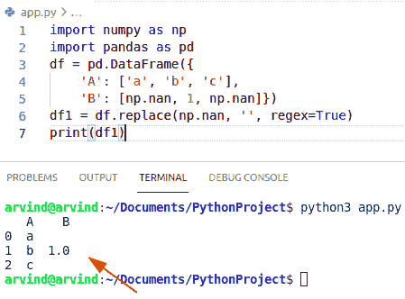

Python numpy replace nan with an empty string

## Python numpy nan 平均值

*   在本节中，我们将讨论 **Python numpy nan average** 。
*   在本例中，它将沿给定轴计算算术平均值，忽略 NaNs 值。它将返回数组元素的平均值。
*   默认情况下，对输入数组取平均值，否则对给定的轴取平均值。
*   在本例中，为了检查 numpy nan 平均值，我们可以使用函数 np.nanmean()。
*   它将返回数组值的平均值

**语法:**

```py
numpy.nanmean
             (
              arr,
              axis=None,
              dtype=None,
              out=None,
              )
```

**举例:**

```py
import numpy as np

C = np.array([4,5,6,np.nan,np.nan,8,9,5])
b = np.nanmean(C)
print(b)
```

下面是以下代码的截图

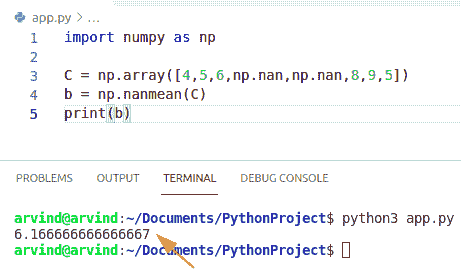

Python numpy nan average

阅读 [Python NumPy square 示例](https://pythonguides.com/python-numpy-square/)

## Python numpy nan 等于

*   用这种方法，我们将讨论 numpy nan 等式。
*   在这个方法中，我们可以使用 numpy。测试。用 try-except 块断言 equal。
*   这个方法 equal()表示它认为 Nan 值是否相等。
*   它将以布尔掩码的形式返回结果。
*   如果 nan 值不相同，它将始终返回 false，否则返回 true。

**举例:**

```py
import numpy as np

def nan_equal(a,b):
     try:
         np.testing.assert_equal(a,b)
     except AssertionError:
        return False 
     return True

a=np.array([3, 2, np.NaN])
b=np.array([3, 2, np.NaN])
c= nan_equal(a,b)
print(c)
```

下面是以下代码的截图

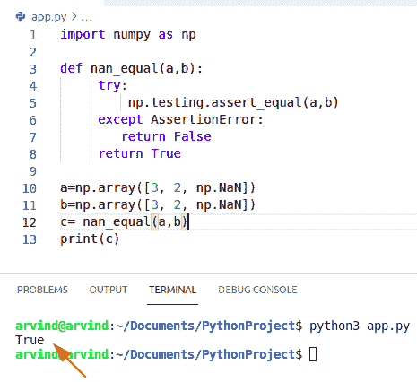

Python numpy nan equal

## Python numpy nan 比较

*   在本节中，我们将讨论 **Python numpy nan compare** 。
*   要检查数组中的 NaN 值，可以使用 numpy。isnan()方法。这个结果将显示一个布尔掩码，其大小与原始数组的大小相同。
*   对于原始给定数组中为 NaNs 的索引值，输出给定数组为 true，而对于其余的值，输出给定数组为 false。

**举例:**

```py
def isNaN(num):
    return num!= num
x=float("nan")
b =isNaN(x)
print(b)
```

下面是以下代码的截图

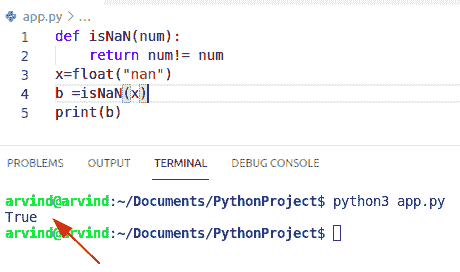

Python numpy nan compare

您可能会喜欢以下 Python 教程:

*   [如何使用 Turtle 在 python 中绘制形状](https://pythonguides.com/turtle-programming-in-python/)
*   [Python 要求用户输入](https://pythonguides.com/python-ask-for-user-input/)
*   [Python 通过引用或值传递示例](https://pythonguides.com/python-pass-by-reference-or-value/)
*   [如何将 Python 字符串转换成字节数组并举例](https://pythonguides.com/python-string-to-byte-array/)
*   [Python Tkinter Listbox–如何使用](https://pythonguides.com/python-tkinter-listbox/)

在本 Python 教程中，我们将通过如下几个例子来讨论 **Python NumPy nan** :

*   Python numpy Nan 到零
*   Python numpy 创建 Nan 数组
*   Python numpy Nan 到 none
*   Python numpy Nan 的意思是
*   Python numpy Nan 最大值
*   Python numpy Nan min
*   Python 数字南索引
*   Python numpy 从数组中移除 Nan
*   Python numpy 用空字符串替换 Nan
*   Python numpy Nan 平均值
*   Python numpy Nan 等于
*   Python numpy Nan 比较

[Bijay Kumar](https://pythonguides.com/author/fewlines4biju/)

Python 是美国最流行的语言之一。我从事 Python 工作已经有很长时间了，我在与 Tkinter、Pandas、NumPy、Turtle、Django、Matplotlib、Tensorflow、Scipy、Scikit-Learn 等各种库合作方面拥有专业知识。我有与美国、加拿大、英国、澳大利亚、新西兰等国家的各种客户合作的经验。查看我的个人资料。

[enjoysharepoint.com/](https://enjoysharepoint.com/)[](https://www.facebook.com/fewlines4biju "Facebook")[](https://www.linkedin.com/in/fewlines4biju/ "Linkedin")[](https://twitter.com/fewlines4biju "Twitter")