# Python NumPy square 示例

> 原文：<https://pythonguides.com/python-numpy-square/>

[](https://sharepointsky.teachable.com/p/python-and-machine-learning-training-course)

在这个 [Python 教程](https://pythonguides.com/python-hello-world-program/)中，我们将讨论 **Python NumPy square** ，我们还将涵盖以下示例:

*   Python numpy 平方根
*   Python numpy 平方和
*   Python numpy 平方范数
*   Python numpy 方形数组
*   Python numpy 方波
*   Python numpy 平方差
*   Python numpy 方形矢量
*   Python numpy square vs **

目录

[](#)

*   [Python numpy square](#Python_numpy_square "Python numpy square")
*   [Python numpy 平方根](#Python_numpy_square_root "Python numpy square root")
*   [Python numpy 平方和](#Python_numpy_square_sum "Python numpy square sum")
*   [Python numpy 平方范数](#Python_numpy_squared_norm "Python numpy squared norm")
*   [Python numpy 方阵](#Python_numpy_square_array "Python numpy square array")
*   [Python numpy 方波](#Python_numpy_square_wave "Python numpy square wave")
*   [Python numpy 平方差](#Python_numpy_square_difference "Python numpy square difference")
*   [Python numpy 平方矢量](#Python_numpy_square_vector "Python numpy square vector")
*   [Python 数字广场 vs **](#Python_numpy_square_vs "Python numpy square vs **")

## Python numpy square

*   在本节中，我们将了解到 **Python numpy square** 。
*   这是一个统计函数，帮助用户计算数组中每个值的平方值。
*   它总是返回一个数组，每个数组的平方值。
*   源数组保持不变。
*   在这种方法中，我们可以很容易地使用函数 np。正方形()。
*   numpy square()函数计算数字输入的平方。

**语法:**

下面是 numpy square()的语法

```py
numpy.square
            (
             x,
             out=None,
             *,
             Where=True,
             casting='same_kind'
             dtype=None
            )
```

*   它由几个参数组成
    *   **X**:X 参数使您能够指定函数的输入(即自变量)。
    *   **OUT:** 存储结果的位置。如果提供的话，它应该具有输入所提供的形状。如果未提供或无，则返回新分配的数组。
    *   **其中:**该条件通过输入提供。在条件为真的位置，out numpy 数组将被设置为 ufunc 结果。
    *   **返回:**按元素 x*x，与 x 具有相同的形状和数据类型。

**举例:**

下面举个例子来检查一下**如何使用 NumPy square** 。

**示例 1:** 计算一维数组中数值的平方

*   首先，我们必须导入一个 numpy 库，然后使用 numpy array 函数创建一个 numpy 数组。
*   现在我们有了一个数组，我们可以通过使用 numpy square 函数来运行 numpy square。

```py
import numpy as np

arr1 = np.array([4, 5, 6, 7])
res = np.square(arr1)
print(res)
```

下面是以下代码的截图

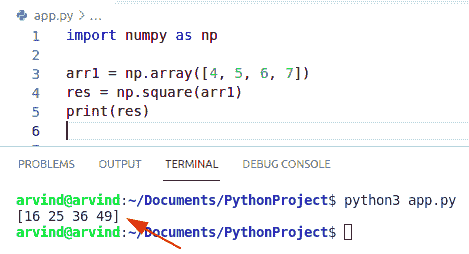

Python numpy square

**示例 2:** 计算复数数组中数值的平方

```py
import numpy as np

arr1 = np.array([1+2j, 2+3j, 6+5j, 7+8j])
res = np.square(arr1)
print(res)
```

下面是以下代码的截图

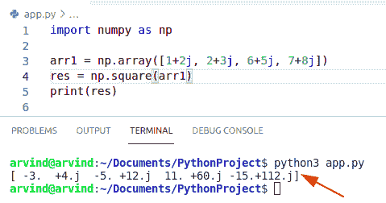

Python numpy square complex no

阅读: [Python NumPy 列表](https://pythonguides.com/python-numpy-to-list/)和 [Python NumPy max](https://pythonguides.com/python-numpy-max-with-examples/)

## Python numpy 平方根

*   在本节中，我们将了解到 **Python numpy 平方根**。
*   在这个方法中我们可以很容易地使用函数 **numpy sqrt()** 。
*   这个函数用于确定一个数组元素的正平方根。
*   numpy 平方根函数帮助用户计算输入值的平方根。
*   所以如果你给一个输入 x，numpy square 函数会计算并给出 x 的平方根下的形式的结果。

**语法:**

下面是 numpy 平方根的语法

```py
numpy.sqrt
          (
           x,
           out=None,
           *,
           Where=True,
           casting='same_kind'
           dtype=None
           )
```

*   它由几个参数组成。
    *   **X:**X 参数使您能够指定 np 的输入。sqrt 函数。
    *   **OUT:**OUT 参数使您能够指定一个存储输出的数组。
    *   **返回:**与 x 形状相同的数组，包含 x 中每个元素的正平方根。

**例子:**

让我们举一个例子来检查如何使用 numpy 平方根。

**例 1:** 计算一维数组中数值的平方根

*   首先，我们必须导入一个 numpy 库，然后使用 numpy array 函数创建一个 numpy 数组。
*   现在我们有了一个数组，我们可以通过使用 numpy sqrt()函数来运行 numpy 平方根。

```py
import numpy as np

arr1 = np.array([36,25,49,4,9,121])
res = np.sqrt(arr1)
print(res)
```

下面是以下代码的截图

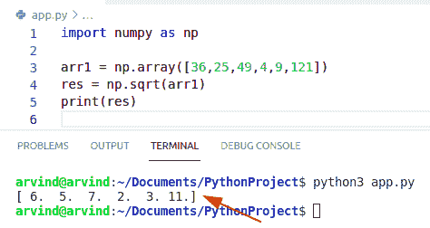

Python numpy square root

**例 2:** 计算二维数组中数值的平方根

*   首先，我们使用函数 numpy.array 创建一个二维数组，然后使用这个数组作为 sqrt 函数的输入。
*   当我们使用一个二维数组作为输入时，np.sqrt 函数很容易计算出数组中每个值的平方根。

```py
import numpy as np

arr1 = np.array([[36,25,49],[16,64,81]])
res = np.sqrt(arr1)
print(res)
```

下面是以下代码的截图

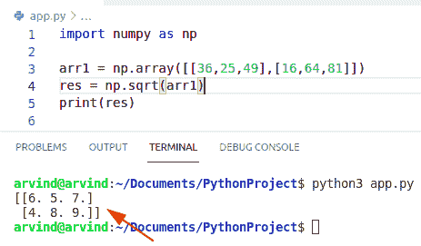

Python numpy square root 2d array

读取: [Python NumPy 读取 CSV](https://pythonguides.com/python-numpy-read-csv/)

## Python numpy 平方和

*   在本节中，我们将了解 **Python numpy 平方和**。
*   在这个方法中，我们首先使用函数 np.array 创建一个数组，现在我们有了一个数组，我们必须使用 np.square 函数对每个数组的值求平方。
*   之后，np.sum()函数计算数组中给定的平方元素。

**举例:**

让我们举一个例子来检查如何使用 NumPy 平方和。

```py
import numpy as np

arr1 = np.array([[36,25,49],[16,64,81]])
res= np.square(arr1)
print(res)
new_res = np.sum(res)
print(new_res)
```

下面是以下代码的截图

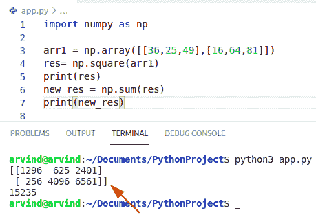

Python numpy square sum

阅读 [Python NumPy 删除](https://pythonguides.com/python-numpy-delete/)

## Python numpy 平方范数

*   在本节中，我们将学习 **numpy 平方范数**。
*   简而言之，范数是一个定义向量大小的量。
*   向量意味着一组整数。
*   在这个方法中，我们可以很容易地使用函数 numpy.linalg.norm。
*   根据 ord 参数的值，该函数能够返回不同矩阵范数中的一个或无限数量的向量范数中的一个。

**语法:**

下面是 numpy 范数的语法

```py
numpy.linalg.norm
                 (
                  x,
                  ord=None,
                  axis=None
                 )
```

*   它由几个参数组成。
    *   **X:** 是一个输入数组。如果轴为 None，则 x 必须是一维或二维的，除非 ord 为 None。如果 axis 和 ord 都为 None，将返回第二个范数。
    *   **order:**可选参数。默认值为无。
    *   **轴:**如果轴是一个整数，它指定 x 的轴，沿着这个轴计算向量范数。如果轴是一个 2 元组，它指定保存 2-D 矩阵的轴，并计算这些矩阵的矩阵范数。
    *   **返回:**向量的范数。

**举例:**

下面举个例子来检查一下如何使用 **NumPy 平方范数**。

```py
import numpy as np

arr = np.array([[ 2, 4, 6],
              [ 2, 2, 3]])
e = np.square(arr)
print(e)
d = np.linalg.norm(e, ord=1, axis=1)
print(d)
```

在上面给出的例子中，我们使用函数 np 创建了一个 NumPy 数组。数组并对给定数组的值求平方，然后使用 lin。alg。范数函数来计算向量的大小。

下面是以下代码的截图

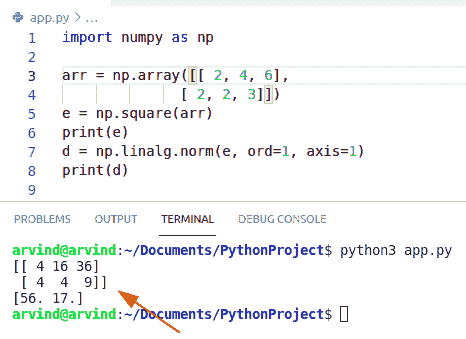

Python numpy square norm

阅读: [Python NumPy 日志+示例](https://pythonguides.com/python-numpy-log/)

## Python numpy 方阵

*   在本节中，我们将了解到 **Python numpy 方形数组**。
*   在这个方法中，我们将计算 numpy 数组中值的平方。
*   首先，我们必须使用函数 np.array 创建一个 numpy 数组，并在参数中传递值。
*   取一个变量，在这个变量中，您必须以数组的形式存储一个结果，还要取一个 numpy square()函数来计算数值输入的平方。

**语法:**

下面是 NumPy square 的语法

```py
numpy.square
            (
             x,
             out=None,
             *,
             Where=True,
             casting='same_kind'
             dtype=None
            )
```

**例子:**

让我们举一个例子来检查如何使用 numpy 正方形数组。

**示例 1** :计算 2d numpy 数组中数值的平方

```py
import numpy as np

arr = np.array([[ 4, 5, 6],
              [ 2, 2, 3]])
res = np.square(arr)
print(res)
```

下面是以下代码的截图

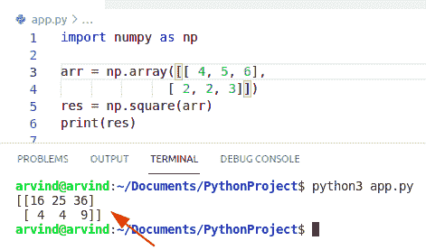

Python numpy square array

**示例 2:** 计算 3d NumPy 数组中值的平方

*   首先，我们将创建一个值从 1 到 9 的 3d numpy 数组，并以 3 乘 3 的形状排列。
*   我们将使用 numpy arange 函数和 reshape 函数的组合。
*   现在，np.sqrt 函数简单地计算数组中每个元素的平方根。

```py
import numpy as np

arr = np.arange(1,10).reshape((3,3))
res = np.square(arr)
print(res)
```

下面是以下代码的截图

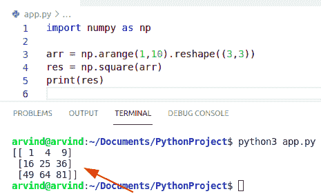

Python numpy square array 3d

阅读:[Python NumPy where with examples](https://pythonguides.com/python-numpy-where/)

## Python numpy 方波

*   在本节中，我们将了解 **Python numpy 方波**。
*   方波是周期波形。
*   在这个方法中，我们可以很容易地使用函数 scipy.signal.square。
*   它将返回一个周期性方波波形的结果。
*   方波是一种周期性波形，其振幅在固定的最小值和最大值之间以稳定的频率交替变化，最小值和最大值的持续时间相同。

**语法:**

下面是 numpy 方波的语法

```py
scipy.signal.square
                   (
                    t,
                    duty=0.5
                   )
```

*   它由几个参数组成。
    *   **T:** 输入时间数组。
    *   **duty:** 默认值为 0.5。
    *   **返回:**输出包含方波波形的数组。

**举例:**

```py
import numpy as np
from scipy import signal
import matplotlib.pyplot as plt
t = np.linspace(0, 1, 500, endpoint=False)
plt.plot(t, signal.square(2 * np.pi * 5 * t),'b')
plt.ylim(-2, 2)
plt.grid()
plt.show()
```

下面是以下代码的截图

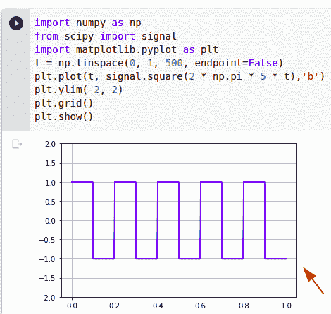

Python numpy square wave

读取 [Python 反向 NumPy 数组](https://pythonguides.com/python-reverse-numpy-array/)

## Python numpy 平方差

*   在本节中，我们将了解 **Python numpy 平方差**。
*   在这个方法中，我们首先使用函数 np.array 创建一个数组，现在我们有了一个数组，我们必须使用 np.square 函数对每个数组的值求平方。
*   之后，numpy diff()函数计算数组中给定的平方值。

**举例:**

让我们举个例子来检查如何使用 NumPy square diff

```py
import numpy as np

arr1 = np.array([[4,5,6],[2,3,4]])
res= np.square(arr1)
print(res)
new_res = np.diff(res)
print(new_res)
```

下面是以下代码的截图

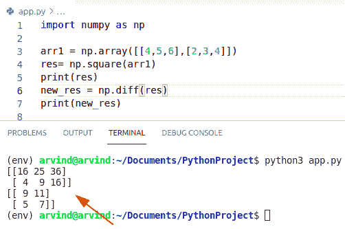

Python numpy square diff

阅读: [Python NumPy linspace](https://pythonguides.com/python-numpy-linspace/)

## Python numpy 平方矢量

*   在本节中，我们将学习 Python numpy 平方矢量。
*   向量是一维的 numpy 数组(行向量和列向量没有区别)，而矩阵是指二维的数组。
*   我们可以把向量想象成一个数字列表，向量代数就是在列表中执行的操作。
*   在这种方法中，我们可以很容易地使用函数 numpy square 函数来显示矢量 ndarray 形状。

**语法:**

```py
numpy.square
            (
             x,
             out=None,
             *,
             Where=True,
             casting='same_kind'
             dtype=None
            )
```

**举例:**

```py
import numpy as np

vect = np.array([[4, 5, 6, 7],
                 [3,4,5,6 ],
                 [5,6,7,8]])
res_vect = np.square(vect)
print(res_vect)
```

下面是以下代码的截图

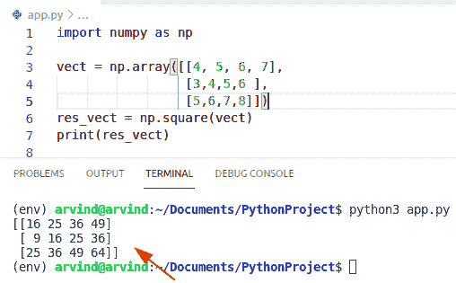

Python numpy square vector

## Python 数字广场 vs **

*   在本节中，我们将了解 **Python numpy square vs **** 。
*   标准的 python * *比 numpy 更容易也更快。正方形()。
*   numpy 函数通常更加灵活。

**举例:**

```py
import numpy as np 

Arr1 = np.array([[3, 3],[3, 3]]) 
res=np.square(Arr1)
b = Arr1 ** 2 
print(res)
print(b)
```

下面是以下代码的截图

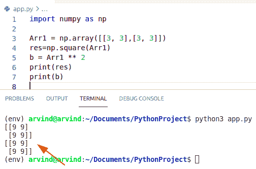

Python numpy square vs **

您可能会喜欢以下 Python 教程:

*   [Python NumPy 串接](https://pythonguides.com/python-numpy-concatenate/)
*   [Python sort NumPy 数组+示例](https://pythonguides.com/python-sort-numpy-array/)
*   [Python NumPy 矩阵](https://pythonguides.com/python-numpy-matrix/)
*   [Python NumPy append + 9 示例](https://pythonguides.com/python-numpy-append/)
*   [python num py arang](https://pythonguides.com/python-numpy-arange/)
*   [值错误:用序列](https://pythonguides.com/valueerror-setting-an-array-element-with-a-sequence/)设置数组元素

在本 Python 教程中，我们将讨论 **Python NumPy square** ，还将涵盖以下示例:

*   Python numpy 平方根
*   Python numpy 平方和
*   Python numpy 平方范数
*   Python numpy 方形数组
*   Python numpy 方波
*   Python numpy 平方差
*   Python numpy 方形矢量
*   Python numpy square vs **

[Bijay Kumar](https://pythonguides.com/author/fewlines4biju/)

Python 是美国最流行的语言之一。我从事 Python 工作已经有很长时间了，我在与 Tkinter、Pandas、NumPy、Turtle、Django、Matplotlib、Tensorflow、Scipy、Scikit-Learn 等各种库合作方面拥有专业知识。我有与美国、加拿大、英国、澳大利亚、新西兰等国家的各种客户合作的经验。查看我的个人资料。

[enjoysharepoint.com/](https://enjoysharepoint.com/)[](https://www.facebook.com/fewlines4biju "Facebook")[](https://www.linkedin.com/in/fewlines4biju/ "Linkedin")[](https://twitter.com/fewlines4biju "Twitter")