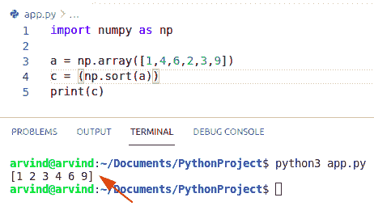
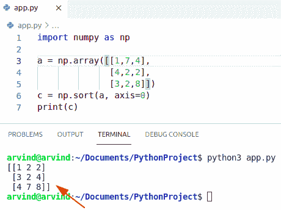
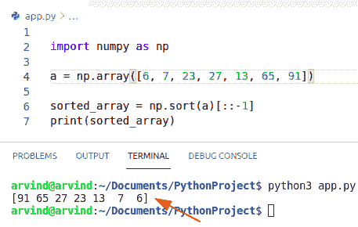
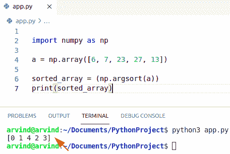
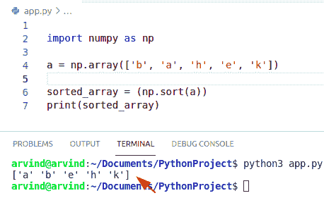
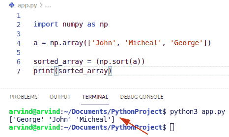
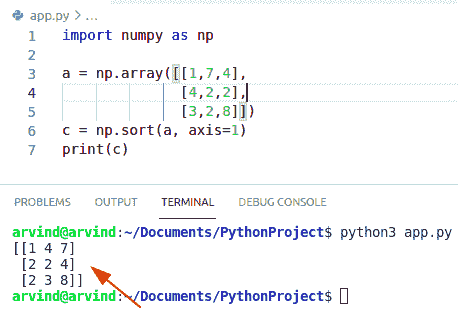
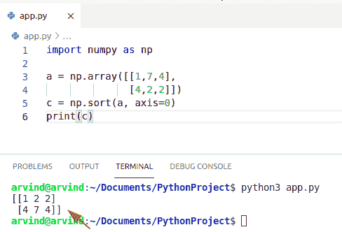
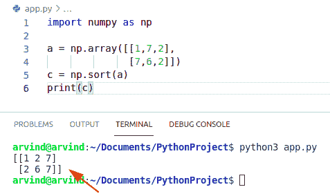

# Python 排序 NumPy 数组+示例

> 原文：<https://pythonguides.com/python-sort-numpy-array/>

[](https://sharepointsky.teachable.com/p/python-and-machine-learning-training-course)

在本 [Python NumPy 教程](https://pythonguides.com/numpy/)中，我们将讨论 **Python sort NumPy** **数组**并涵盖以下示例:

*   NumPy sort()函数
*   Python 排序 NumPy 数组
*   Python 按列排序 NumPy 数组
*   Python 排序 NumPy 数组降序
*   Python 排序 NumPy 数组获取索引
*   Python 按字母顺序对 NumPy 数组排序
*   Python sort NumPy 字符串数组
*   Python 按行排序 NumPy 数组
*   Python 按列排序 2d NumPy 数组
*   Python 对两个 NumPy 数组进行排序

目录

[](#)

*   [NumPy sort()函数](#NumPy_sort_function "NumPy sort() function")
*   [Python 排序 NumPy 数组](#Python_sort_NumPy_array "Python sort NumPy array")
*   [Python 按列排序 NumPy 数组](#Python_sort_NumPy_array_by_column "Python sort NumPy array by column")
*   [Python 排序 numpy 数组降序](#Python_sort_numpy_array_descending "Python sort numpy array descending")
*   [Python sort NumPy 数组获取索引](#Python_sort_NumPy_array_get_index "Python sort NumPy array get index")
*   [Python 按字母顺序排序 numpy 数组](#Python_sort_numpy_array_by_alphabetically "Python sort numpy array by alphabetically")
*   [Python sort numpy 字符串数组](#Python_sort_numpy_array_of_strings "Python sort numpy array of strings")
*   [Python 按行排序 numpy 数组](#Python_sort_numpy_array_by_row "Python sort numpy array by row")
*   [Python 按列排序 2d numpy 数组](#Python_sort_2d_numpy_array_by_column "Python sort 2d numpy array by column")
*   [Python 排序两个 NumPy 数组](#Python_sort_two_NumPy_arrays "Python sort two NumPy arrays")

## NumPy sort()函数

*   NumPy sort()方法可以从低值到高值对 NumPy 数组进行排序。
*   为了使用 NumPy 排序函数，我们将使用作为 np 导入的 NumPy 库创建一个新脚本。
*   为了对 NumPy 数组进行排序，我们可以使用函数 numpy.sort()。
*   排序意味着将值放入有序的可迭代序列中。
*   这个函数总是返回源 numpy 数组的一个排序副本，它与源 NumPy 数组具有相同的形状和数据类型。

阅读: [Python NumPy 矩阵](https://pythonguides.com/python-numpy-matrix/)

## Python 排序 NumPy 数组

*   在这一节中，我们将学习 python 对 NumPy 数组进行排序。
*   首先，我们将学习和讨论 numpy 数组和矩阵，因为这属于 NumPy 库。
*   Numpy 是一个允许我们创建多维数组的库。

**语法:**

下面是 sort numpy 数组的语法

```py
numpy.sort(
           a,
           axis=-1
           order=None
          )
```

1.  **答:** array_like 数组要排序
2.  **轴:**对 numpy 数组进行排序的轴。如果没有，则 numpy 数组在排序前被展平。默认值为-1，表示沿着最后一个给定的轴对元素进行排序。
3.  **顺序:**当定义了一个 numpy 数组时，该参数指定首先比较哪些字段，其次比较哪些字段。单个字段可以以字符串的形式给出，并且不是所有的字段都需要是特定的，但是如果未指定的字段出现在数据类型中，则仍然会使用它们。

**举例:**

```py
import numpy as np

a = np.array([1,4,6,2,3,9])
c = (np.sort(a))
print(c)
```

以下是给定代码的截图



Python sort numpy array

这就是如何使用 Python NumPy 对一个数组进行排序。

阅读: [Python NumPy 追加](https://pythonguides.com/python-numpy-append/)

## Python 按列排序 NumPy 数组

*   在本节中，我们将了解到**python sort NumPy array by column**。要对数组中的列元素进行排序，我们可以使用方法 **np。sort()** 。
*   输出显示第一列中的最小值位于位置 0。

**语法:**

下面是按列对 numpy 数组排序的语法

```py
numpy.sort(
           a,
           axis=0
           order=None
          )
```

**举例:**

```py
import numpy as np

a = np.array([[1,7,4],
              [4,2,2],
              [3,2,8]])
c = np.sort(a, axis=0)
print(c)
```

下面是以下代码的截图。



Python sort numpy array by column

这就是如何在 Python 中**按列对 NumPy 数组进行排序。**

阅读: [Python NumPy arange](https://pythonguides.com/python-numpy-arange/)

## Python 排序 numpy 数组降序

*   在本节中，我们将了解到**python sort NumPy array descending**。
*   为了对数组元素进行降序排序，我们可以使用方法 **NumPy np.sort()** 。

**语法:**

```py
numpy.sort(
           a,
           axis=0
           order=None
          )
```

**举例:**

```py
 import numpy as np

a = np.array([6, 7, 23, 27, 13, 65, 91])

sorted_array = np.sort(a)[::-1]
print(sorted_array)
```

以下是给定代码的截图



Python sort numpy array descending

这就是如何在 Python 中**对 numpy 数组进行降序排序。**

阅读: [Python NumPy Sum](https://pythonguides.com/python-numpy-sum/)

## Python sort NumPy 数组获取索引

*   在本节中，我们将了解到**python sort NumPy array get index**。
*   为了获得索引，我们可以很容易地使用函数 **numpy.argsort()** 。
*   numpy argsort()函数用于返回可用于对数组排序的索引。
*   返回的数组包含给定轴上按排序顺序排列的索引。
*   此函数返回两个索引，这两个索引将启动一个数组，使用算法沿给定轴执行间接排序。

**语法:**

下面是 numpy.argsort()的语法

```py
numpy.argsort
             (
              a,
              axis=-1,
              order=None
             )
```

**举例:**

```py
 import numpy as np

a = np.array([6, 7, 23, 27, 13])

sorted_array = (np.argsort(a))
print(sorted_array)
```

以下是给定代码的截图



Python sort numpy array get index

这是一个**Python sort NumPy array get index**的例子。

阅读: [Python NumPy zeros](https://pythonguides.com/python-numpy-zeros/)

## Python 按字母顺序排序 numpy 数组

*   在这一节中，我们将学习 **python 按字母顺序排序 NumPy 数组**。
*   我们所说的字母顺序是指字符串中的字符应该从 A 到 z 开始。
*   所以我们用来实现它的逻辑是 np。sort()函数。

**语法:**

下面是按字母顺序排序 numpy 数组的语法。

```py
numpy.sort(
           a,
           axis=0
           order=None
          )
```

**举例:**

```py
 import numpy as np

a = np.array(['b', 'a', 'h', 'e', 'k'])

sorted_array = (np.sort(a))
print(sorted_array)
```

下面是下面给出的代码的截图。



Python sort numpy array by alphabetically

这就是如何在 Python 中**按字母顺序对 numpy 数组进行排序。**

阅读 [Python NumPy shape 示例](https://pythonguides.com/python-numpy-shape/)

## Python sort numpy 字符串数组

*   在这一节中，我们将学习 Python sort 字符串的 NumPy 数组。返回的数组以排序元素的形式存储给定轴上的索引。
*   所以我们用来实现它的逻辑是 Python np.sort()函数。

**语法:**

下面是按字母顺序排序 numpy 数组的语法。

```py
numpy.sort(
           a,
           axis=0
           order=None
          )
```

**举例:**

```py
 import numpy as np

a = np.array(['John', 'Micheal', 'George'])

sorted_array = (np.sort(a))
print(sorted_array)
```

下面是以下代码的截图。



Python sort numpy array of strings

这就是如何在 Python 中对 numpy 字符串数组进行**排序。**

读取:[检查 Python 中的 NumPy 数组是否为空](https://pythonguides.com/check-if-numpy-array-is-empty/)

## Python 按行排序 numpy 数组

*   在本节中，我们将了解到 **python 按行排序 NumPy 数组**。
*   假设我们有一个 NumPy 数组，我们希望根据元素的顺序对行进行排序。
*   我们可以用 **Python numpy.sort()函数**来实现。
*   这个函数总是返回源 numpy 数组的一个排序副本，它与源 numpy 数组具有相同的形状和数据类型。要对数组中的行值进行排序，我们可以使用函数 np.sort()。

**语法:**

下面是按行排序 numpy 数组的语法

```py
numpy.sort(
           a,
           axis=1
           order=None
          )
```

**举例:**

```py
import numpy as np

a = np.array([[1,7,4],
              [4,2,2],
              [3,2,8]])
c = np.sort(a, axis=1)
print(c)
```

下面是下面给出的代码的截图。



Python sort numpy array by row

这是**如何在 Python** 中按行排序 numpy 数组。

读取 [Python 数字堆栈](https://pythonguides.com/python-numpy-stack/)

## Python 按列排序 2d numpy 数组

*   在本节中，我们将了解到 **python 通过列**对 2d NumPy 数组进行排序。
*   二维数组是指一个列表的列表中同质数据或数字的集合。它也被称为 2d 矩阵。在 2D 矩阵中，你必须使用两个方括号，这就是为什么它表示列表的列表。
*   假设我们有一个 NumPy 数组，我们希望根据元素的顺序对列进行排序。
*   我们可以用 **numpy.sort()函数**来实现。要对 numpy 数组中的列值进行排序，我们可以很容易地使用函数 np.sort()。

**语法:**

下面是按列对 numpy 数组排序的语法

```py
numpy.sort(
           a,
           axis=0
           order=None
          )
```

**举例:**

```py
import numpy as np

a = np.array([[1,7,4],
              [4,2,2]])
c = np.sort(a, axis=0)
print(c)
```

以下是给定代码的截图



Python sort 2d numpy array by column

这就是如何在 Python 中**按列排序 2d numpy 数组。**

阅读: [Python NumPy Random](https://pythonguides.com/python-numpy-random/)

## Python 排序两个 NumPy 数组

*   在这一节中，我们将了解到 **python sort two NumPy 数组**。
*   为了使用 NumPy 排序函数，我们将使用作为 np 导入的 NumPy 库创建一个新脚本。
*   为了对 NumPy 数组进行排序，我们可以很容易地使用函数 np。排序()。排序意味着在有序的可迭代序列中插入值。

**语法:**

下面是 sort 2 numpy 数组的语法

```py
numpy.sort(
           a,
           axis=-1
           order=None
          )
```

**举例:**

```py
import numpy as np

a = np.array([[1,7,2],
              [7,6,2]])
c = np.sort(a)
print(c)
```

以下是给定代码的截图



Python sort two numpy arrays

这是**如何在 Python** 中对两个 NumPy 数组进行排序。

您可以学习 Python 教程:

*   [Python Tkinter 选项菜单](https://pythonguides.com/python-tkinter-optionmenu/)
*   [从 PDF Python 中提取文本](https://pythonguides.com/extract-text-from-pdf-python/)
*   [使用 Tkinter 的 Python 注册表](https://pythonguides.com/registration-form-in-python-using-tkinter/)
*   [将 float 转换为 int Python](https://pythonguides.com/convert-float-to-int-python/)
*   [Python NumPy where](https://pythonguides.com/python-numpy-where/)
*   [在 Python 中把字符串转换成浮点数](https://pythonguides.com/convert-string-to-float-in-python/)

在本 Python 教程中，我们将讨论 **Python sort numpy array** ，并涵盖以下示例:

*   Python sort()函数
*   Python 排序 NumPy 数组
*   Python 按列排序 NumPy 数组
*   Python 排序 NumPy 数组降序
*   Python 排序 NumPy 数组获取索引
*   Python 按字母顺序对 NumPy 数组排序
*   Python sort NumPy 字符串数组
*   Python 按行排序 NumPy 数组
*   Python 按列排序 2d NumPy 数组
*   Python 对两个 NumPy 数组进行排序

[Bijay Kumar](https://pythonguides.com/author/fewlines4biju/)

Python 是美国最流行的语言之一。我从事 Python 工作已经有很长时间了，我在与 Tkinter、Pandas、NumPy、Turtle、Django、Matplotlib、Tensorflow、Scipy、Scikit-Learn 等各种库合作方面拥有专业知识。我有与美国、加拿大、英国、澳大利亚、新西兰等国家的各种客户合作的经验。查看我的个人资料。

[enjoysharepoint.com/](https://enjoysharepoint.com/)[](https://www.facebook.com/fewlines4biju "Facebook")[](https://www.linkedin.com/in/fewlines4biju/ "Linkedin")[](https://twitter.com/fewlines4biju "Twitter")