# Python NumPy 堆栈及示例

> 原文：<https://pythonguides.com/python-numpy-stack/>

[](https://sharepointsky.teachable.com/p/python-and-machine-learning-training-course)

在本 [Python 教程](https://pythonguides.com/python-hello-world-program/)中，我们将学习**如何使用 Python 堆栈 Numpy 数组**。此外，我们将在 **Python NumPy 栈**中讨论这些主题。

*   Python Numpy 堆栈 2d 数组
*   Python NumPy 保存图像
*   Python NumPy 堆栈轴
*   Python NumPy 堆栈行
*   Python NumPy 堆栈矩阵
*   Python NumPy 堆栈列
*   Python NumPy 水平堆栈
*   Python 堆栈列表到 numpy 数组中
*   Python numpy vstack hstack
*   Python numpy 列 _ 栈

目录

[](#)

*   [Python NumPy 栈](#Python_NumPy_stack "Python NumPy stack")
*   [Python Numpy 栈 2d 数组](#Python_Numpy_stack_2d_array "Python Numpy stack 2d array")
*   [如何在 NumPy Python 中连接 2d 数组](#How_to_join_2d_arrays_in_NumPy_Python "How to join 2d arrays in NumPy Python")
*   [在 Python NumPy 中组合 2d 数组](#Combine_2d_array_in_Python_NumPy "Combine 2d array in Python NumPy")
*   [Python NumPy 保存图片](#Python_NumPy_save_images "Python NumPy save images")
*   [Python NumPy 栈轴](#Python_NumPy_stack_axis "Python NumPy stack axis")
*   [Python NumPy 堆栈行](#Python_NumPy_stack_rows "Python NumPy stack rows")
*   [在 NumPy Python 中组合行元素](#Combine_row-wise_elements_in_NumPy_Python "Combine row-wise elements in NumPy Python")
*   [Python NumPy 堆栈矩阵](#Python_NumPy_stack_matrix "Python NumPy stack matrix")
*   [Python NumPy 堆栈列](#Python_NumPy_stack_columns "Python NumPy stack columns")
*   [使用 NumPy Python 水平堆叠数组](#Stack_array_horizontally_by_using_NumPy_Python "Stack array horizontally by using NumPy Python")
*   [Python NumPy 水平堆栈](#Python_NumPy_horizontal_stack "Python NumPy horizontal stack")
*   [Python 堆栈列表进入 numpy 数组](#Python_stack_list_into_numpy_array "Python stack list into numpy array")
*   [Python numpy vstack hstack](#Python_numpy_vstack_hstack "Python numpy vstack hstack")
*   [Python numpy column_stack](#Python_numpy_column_stack "Python numpy column_stack")

## Python NumPy 栈

*   本节我们将讨论如何在 [NumPy Python](https://pythonguides.com/numpy/) 中使用 **stack()** 函数。
*   为了执行这个特定的任务，我们将使用 **stack()** 方法。在 Python 中， **stack()** 方法用于将一系列 numpy 数组与给定的轴组合在一起。

**语法:**

下面是 numpy.stack( **)** 方法的语法

```
numpy.stack
           (
            arrays,
            axis=0,
            out=None
           )
```

*   它由几个参数组成
    *   **数组:**这是一个输入数组，数组的序列必须是相同的形状。
    *   **轴:**该参数表示轴在结果维度中的索引。

**举例:**

让我们举个例子，看看如何在 Python 中使用 **stack()** 函数

**源代码:**

```
import numpy as np 

new_arr = np.array([[45,67],[98,23]]) 
new_arr2 = np.array([[890,123],[45,95]]) 
result= np.stack((new_arr,new_arr2),0)
print(result)
```

下面是以下代码的截图

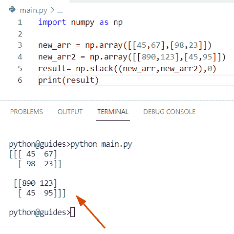

Python NumPy stack

阅读 [Python NumPy round](https://pythonguides.com/python-numpy-round/)

## Python Numpy 栈 2d 数组

*   在本期节目中，我们将讨论如何在 Python 中使用 **stack()** 方法组合 2d 数组。
*   为了执行这个特定的任务，我们将使用 **np.stack()** 方法。在 Python 中，该函数用于将一系列 [NumPy 数组](https://pythonguides.com/python-numpy-array/)与指定的轴组合在一起。

让我们举个例子，了解一下如何在 Python 中使用 **stack()** 函数

**源代码:**

```
import numpy as np 
9
res1 = np.array([34, 16, 98])
res2 = np.array([23, 98, 156])
b= np.stack((res1, res2))
print(b)
```

在上面的代码中，我们首先导入一个 numpy 库，然后使用 **np.array()** 方法创建一个 numpy 数组。

现在声明一个变量**‘b’**，并给它分配 **np.stack()** 函数。一旦你将打印**‘b’**，那么输出将显示给定数组的相同形状的连接。

下面是以下给定代码的输出

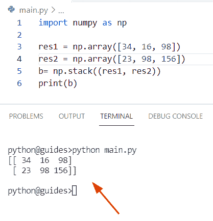

Python Numpy stack 2d array

阅读 [Python Numpy unique](https://pythonguides.com/python-numpy-unique/)

## 如何在 NumPy Python 中连接 2d 数组

在 Python 中，append()函数用于在数组末尾添加一个元素，或者我们可以说合并两个现有的数组，它将返回一个新的数组。

**语法:**

下面是 np.append()函数的语法

```
numpy.append
            (
             arr,
             values,
             axis=None
            )
```

**举例:**

```
import numpy as np 

new_val1 = np.array([45, 89, 135])
new_val2 = np.array([189, 234, 578])
b= np.append(new_val1, new_val2)
print("Combinning arrays:",b)
```

下面是以下给定代码的实现

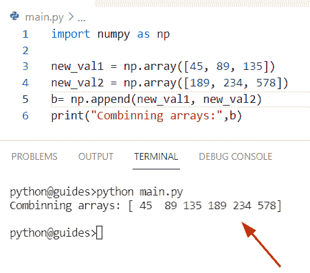

Python Numpy stack 2d array

正如您在屏幕截图中看到的，输出显示了新的阵列

阅读 [Python NumPy 重复](https://pythonguides.com/python-numpy-repeat/)

## 在 Python NumPy 中组合 2d 数组

通过使用 **np.tile()** 方法，我们可以完成这项任务。在 Python 中， **np.tile()** 方法用于重复数组中可用的项数。

例如，我们有一个包含 **3** 个元素**【7，8，9】**的数组，然后使用 **np.tile()** 方法，传递要操作的输入数组以及表示数组重复次数的数字。

**语法:**

下面是 np.tile()方法的语法

```
numpy.tile
          (
           A,
           reps
          )
```

**举例:**

```
import numpy as np 

new_val1 = np.array([7, 8, 9])
result=np.tile(new_val1,(2,1))
print(result)
```

下面是以下给定代码的输出

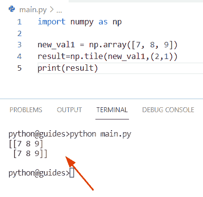

Python Numpy stack 2d array

读取 [Python NumPy 数据类型](https://pythonguides.com/python-numpy-data-types/)

## Python NumPy 保存图片

*   这里我们可以看到**如何在 NumPy Python** 中保存图像。
*   为了完成这个任务，我们将使用 [matplotlib 库](https://pythonguides.com/how-to-install-matplotlib-python/)，这个模块提供了一个函数 **imsave()** ，这个方法用于将 numpy 数组保存为一个图像文件。

**语法:**

下面是**matplotlib . py plot . im save()**的语法

```
matplotlib.pyplot.imsave
                        (
                         fname,
                         arr,
                         **kwargs
                        )
```

下面是以下代码的截图

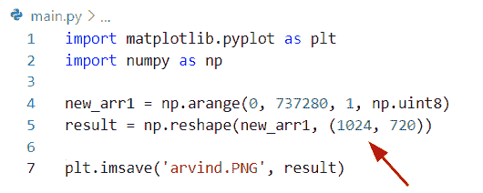

Python NumPy stack images

图片截图

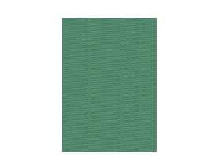

image size

阅读 [Python NumPy 2d 数组+示例](https://pythonguides.com/python-numpy-2d-array/)

## Python NumPy 栈轴

*   在本节中，我们将讨论如何通过使用 Python 来使用 axis in stack NumPy stack()函数。
*   在本例中，axis 参数表示新轴的索引。在 **np.stack()** 函数中，如果**轴=0** ，那么它将表示第一维度，如果我们想要检查最后一维度，那么我们将设置轴参数= **-1** 。
*   默认情况下，它是一个可选参数，指示结果数组中的轴。

**源代码:**

```
import numpy as np 

arr1 = np.array([[23,45],[189,456]]) 
arr2 = np.array([[96,57],[145,856]]) 
new_output= np.stack((arr1,arr2),0) 
new_result= np.stack((arr1,arr2),1)
print("Axis with 0:",new_output)
print("Axis with 1:",new_result)
```

在上面的代码中，我们首先导入了一个 numpy 库，然后使用 **np.array()** 方法创建了一个数组。

现在在 **np.stack()** 方法中设置 axis= **0，1** 加入数组。一旦你打印了**‘新输出’**和**‘新结果’**，那么输出将显示新的二维数组。

你可以参考下面的截图

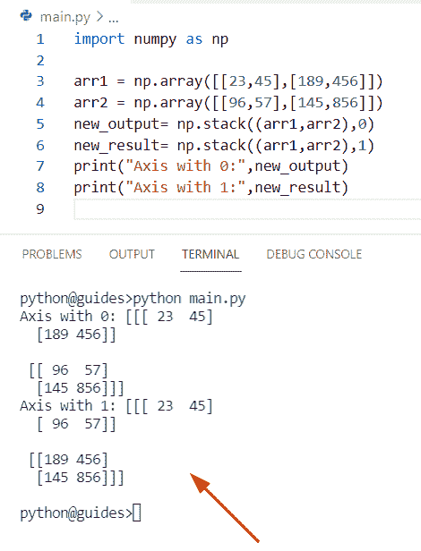

Python NumPy stack axis

阅读 [Python NumPy 3d 数组+示例](https://pythonguides.com/python-numpy-3d-array/)

## Python NumPy 堆栈行

*   在这个程序中，我们将讨论**如何在 NumPy Python** 中堆栈行。
*   在 Python 中， **vstack()** 函数用于连接数组序列**(按行)**。在这个方法中，它将数组作为输入参数，输入参数的形式是一个垂直轴上的元组。

**语法:**

下面是 vstack()方法的语法

```
numpy.vstack
            (
             tup
            )
```

让我们举一个例子，检查 NumPy vstack()方法的实现

**源代码:**

```
import numpy as np

array1 = np.array([78, 34, 97])
array2 = np.array([11, 23, 67])
output = np.vstack((array1,array2))
print ("Row-wise combined array:", output) 
```

在上面的代码中，我们按行堆叠了两个数组。为了完成这个任务，我们首先导入 numpy 库，然后在变量**‘array 1’**和**‘array 2’**中初始化两个 numpy 数组。之后，我们应用了 **np.vstack()** 方法，它将创建一个新的 numpy 数组。

下面是以下代码的截图

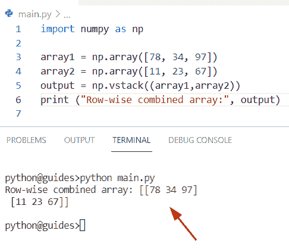

Python NumPy stack rows

阅读 [Python NumPy Split + 11 示例](https://pythonguides.com/python-numpy-split/)

## 在 NumPy Python 中组合行元素

通过使用 **np.row_stack()** 方法，我们可以执行这个特定的任务，这个函数用于通过 Python 按行堆叠数组。

**语法:**

下面是 numpy.row_stack()方法的语法

```
numpy.rowstack
              (
               tup
              )
```

**举例:**

```
import numpy as np

new_arr1 = np.array([167, 945, 109])
new_arr2 = np.array([456, 897, 123])
output = np.row_stack((new_arr1,new_arr2))
print ("Row-wise combined array:", output) 
```

你可以参考下面的截图

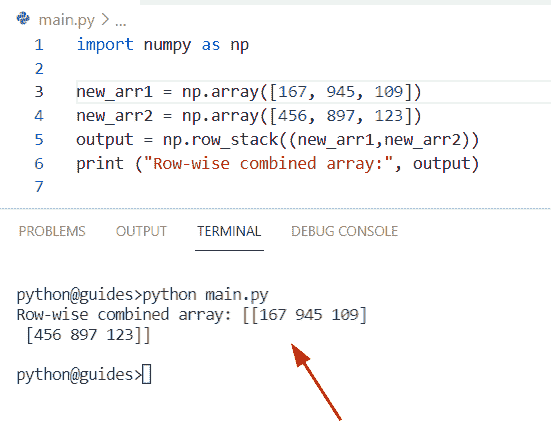

Python NumPy stack rows

阅读 [Python NumPy Normalize +示例](https://pythonguides.com/python-numpy-normalize/)

## Python NumPy 堆栈矩阵

*   让我们看看**如何在 NumPy Python** 中组合一个矩阵元素。
*   在这个例子中，我们将使用 **np.array()** 方法创建一个数组，然后在其中应用 **np.stack()** 方法。一旦你将打印**‘z’**，那么输出将显示一个新的 numpy 矩阵。

**举例:**

```
import numpy as np 

val1 = np.array([[89,578],[356,785]]) 
val2 = np.array([[324,178],[210,867]]) 
z= np.stack((val1,val2),0)
print(z)
```

下面是以下给定代码的执行过程

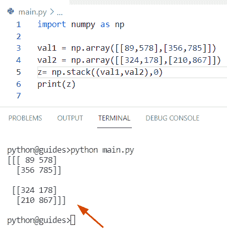

Python NumPy stack matrix

阅读[Python NumPy Random【30 个例子】](https://pythonguides.com/python-numpy-random/)

## Python NumPy 堆栈列

*   在这一节中，我们将讨论如何使用 NumPy Python 按列堆叠数组。
*   为了执行这个特定的任务，我们将使用**NP . hs stack()**方法，这个函数用于按列连接数组序列，或者我们可以说是水平连接。
*   在括号内的这个方法中，我们可以很容易地提供我们想要组合在一起的数组。例如，假设你有两个数组**‘新数组’**和**‘新数组 2’**。现在你想水平合并，那么你可以很容易地使用**NP . hs stack()**函数。

**语法:**

下面是 hstack()函数的语法

```
numpy.hstack
            (
             tup
            )
```

*   它只包含一个参数
    *   **tup:** 此参数表示 numpy 数组的集合，它作为输入提供。

**举例:**

让我们举个例子来理解一下 **hstack()** 函数的工作原理

**源代码:**

```
import numpy as np

new_arr1 = np.array([34, 98, 345])
new_arr2 = np.array([87, 69, 123])
new_arr3 = np.array([42,75,378])
output = np.hstack((new_arr1,new_arr2,new_arr3))
print(output) 
```

在上面的代码中，我们按列堆叠了三个输入数组。为了完成这个任务，我们首先导入 numpy 库，然后初始化三个 numpy 数组**‘new _ arr 1’，‘new _ arr 2’**和**‘new _ arr 3’**。之后，我们将使用 **np.hstack()** 函数，得到形状相同的结果。

下面是以下代码的截图

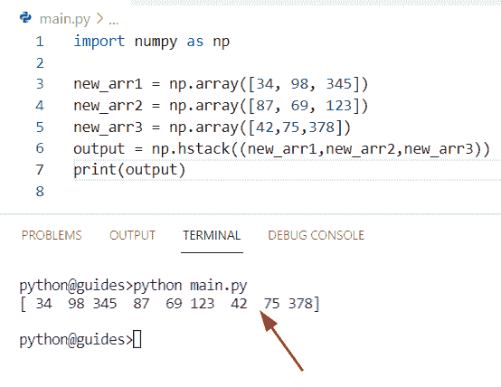

Python NumPy stack columns

阅读 [Python NumPy max 示例](https://pythonguides.com/python-numpy-max-with-examples/)

## 使用 NumPy Python 水平堆叠数组

通过使用 **numpy.column_stack()** 函数我们可以解决这个问题。在 Python 中，这个函数用于水平堆叠数组。

**举例:**

```
import numpy as np

array1 = np.array([34, 98, 345])
array2 = np.array([87, 69, 123])

new_result = np.column_stack((array1,array2))
print(new_result) 
```

下面是以下给定代码的输出

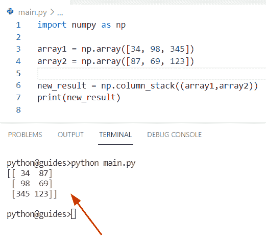

Python NumPy stack columns

读取[检查 Python 中的 NumPy 数组是否为空](https://pythonguides.com/check-if-numpy-array-is-empty/)

## Python NumPy 水平堆栈

*   在本期节目中，我们将讨论如何在 Python 中使用 **np.hstack()** 函数。
*   在 Python 中， **hstack()** 函数用于按列或水平连接 numpy 数组的序列，它将返回一个包含给定输入数组中所有元素的一维数组。

**语法:**

下面是 **np.hstack()** 方法的语法

```
numpy.hstack
            (
             tup
            )
```

**举例:**

让我们举一个例子来理解水平堆栈 numpy 数组的工作原理

**源代码:**

```
import numpy as np

val1 = np.array([845, 876, 190])
val2 = np.array([999, 147, 853])

new_output = np.column_stack((val1,val2))
print(new_output)
```

在上面的代码中，我们首先导入一个 numpy 数组，然后使用 **np.array()** 函数初始化一个数组。

现在声明一个变量**‘new _ output’**并赋值 **np.column_stack()** 函数。一旦你将打印**‘新输出’**，那么结果将显示一个新的数组。

你可以参考下面的截图

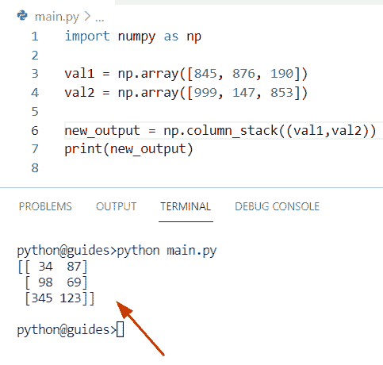

Python NumPy horizontal stack

阅读 [Python NumPy 日志+示例](https://pythonguides.com/python-numpy-log/)

## Python 堆栈列表进入 numpy 数组

*   让我们看看如何使用 Python 将列表转换成 numpy 数组。
*   为了执行这个特定的任务，我们将应用 **np.asarray()** 函数。在 Python 中，这个函数用于将数据转换成 numpy 数组，数据可以是列表的形式。
*   这个函数在 NumPy 模块包中可用，并且总是返回一个 ndarray。

**语法:**

下面是 numpy.asarray()方法的语法

```
numpy.asarray
             (
              a,
              dtype=None,
              order=None,
              *,
              like=None
              )
```

*   它由几个参数组成
    *   **a:** 这个参数表示我们想要转换成 numpy 数组的输入数据。
    *   **dtype:** 默认取 none 值，表示数组每个元素的数据类型。
    *   **order:** 这也是一个可选参数，表示默认为**‘C’**的内存表示。

**举例:**

我们举个例子，了解一下 **np.asarray()** 函数的工作原理。

```
import numpy as np

new_list = [24, 89, 156, 892, 665, 916, 754]
new_list2 = [167, 345, 987, 145, 945, 108, 345]
result = np.asarray(new_list)
output = np.asarray(new_list2)
print("Converted list with array:",result)
print(new_list2)
stac= np.stack((result,output))
print("stacked array:",stac)
```

在上面的代码中，我们导入了一个 numpy 库，然后初始化了一个 list []。现在，我们通过使用 **np.asarray()** 方法，用 numpy 数组转换列表。

一旦打印出**‘result’和‘output’**，输出将显示 numpy 数组。之后，我们使用了 **np.stack()** 方法，并将“结果”和“输出”作为参数传递。

下面是以下代码的截图

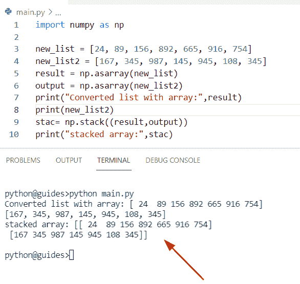

Python stack list into numpy array

正如您在屏幕截图中看到的，输出显示了新的 numpy 数组

阅读 [Python NumPy where 示例](https://pythonguides.com/python-numpy-where/)

## Python numpy vstack hstack

*   在本节中，我们将通过使用 NumPy Python 来讨论 vstack 和 hstack 函数的组合。
*   这些功能在 numpy 模块包中提供，它将帮助用户沿轴水平和垂直组合 numpy 阵列。

**举例:**

```
import numpy as np

array1 = np.array([784, 992, 456])
array2 = np.array([134, 678, 345])

stac_col = np.hstack((array1,array2))
print("Horzontally stacked array:",stac_col)

array3 = np.array([156, 934, 789])
array4 = np.array([388, 456, 908])
stac_row = np.vstack((array3,array4))
print("Vertically stacked array:", stac_row) 
```

在上面的代码中，我们导入了一个 numpy 库，然后使用 **np.array()** 方法初始化了一个数组。

现在使用**‘NP . h stack’和‘NP . v stack’**方法在 NumPy 数组中垂直和水平组合元素。

你可以参考下面的截图

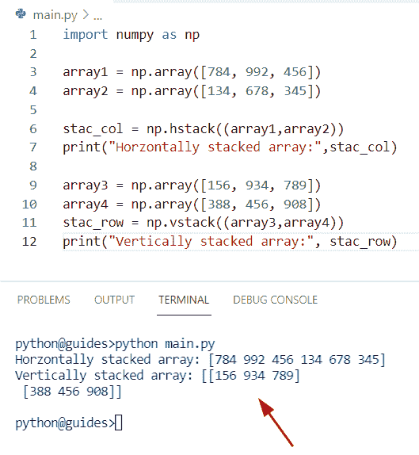

Python numpy vstack hstack

读取 [Python 反向 NumPy 数组](https://pythonguides.com/python-reverse-numpy-array/)

## Python numpy column_stack

*   在本期节目中，我们将讨论如何在 NumPy Python 中使用 **np.column_stack()** 函数。
*   在 Python 中，该函数用于合并 NumPy 数组中的列元素或水平元素。它总是接受一维数组的序列，并将它们作为列连接起来，以创建一个二维数组。

**语法:**

下面是 np.column_stack()函数的语法

```
numpy.column_stack
                  (
                   tup
                  )
```

**举例:**

让我们举个例子来理解 numpy.column_stack()函数的工作原理

**源代码:**

```
import numpy as np

val1 = np.array([845, 876, 190])
val2 = np.array([999, 147, 853])

result = np.column_stack((val1,val2))
print(result)
```

下面是以下给定代码的执行过程

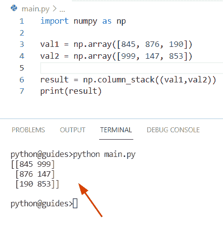

Python numpy column stack

您可能还会喜欢以下 Python NumPy 教程:

*   [Python NumPy 空数组示例](https://pythonguides.com/python-numpy-empty-array/)
*   [Python NumPy nan](https://pythonguides.com/python-numpy-nan/)
*   [Python NumPy linspace](https://pythonguides.com/python-numpy-linspace/)

在这个 Python 教程中，我们将学习**如何使用 Python 来堆栈 Numpy 数组**。此外，我们将涵盖这些主题。

*   Python Numpy 堆栈 2d 数组
*   Python NumPy 保存图像
*   Python NumPy 堆栈轴
*   Python NumPy 堆栈行
*   Python NumPy 堆栈矩阵
*   Python NumPy 堆栈列
*   Python NumPy 水平堆栈
*   Python 堆栈列表到 numpy 数组中
*   Python numpy vstack hstack
*   Python numpy 列 _ 栈

[Bijay Kumar](https://pythonguides.com/author/fewlines4biju/)

Python 是美国最流行的语言之一。我从事 Python 工作已经有很长时间了，我在与 Tkinter、Pandas、NumPy、Turtle、Django、Matplotlib、Tensorflow、Scipy、Scikit-Learn 等各种库合作方面拥有专业知识。我有与美国、加拿大、英国、澳大利亚、新西兰等国家的各种客户合作的经验。查看我的个人资料。

[enjoysharepoint.com/](https://enjoysharepoint.com/)[](https://www.facebook.com/fewlines4biju "Facebook")[](https://www.linkedin.com/in/fewlines4biju/ "Linkedin")[](https://twitter.com/fewlines4biju "Twitter")