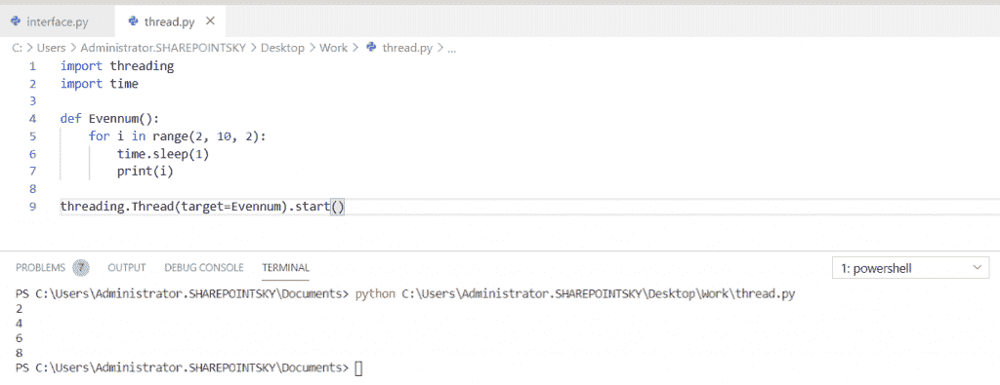
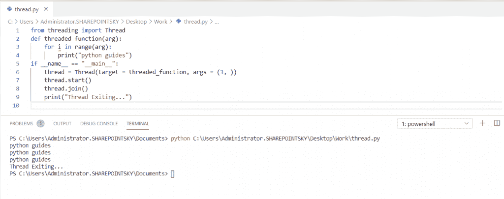
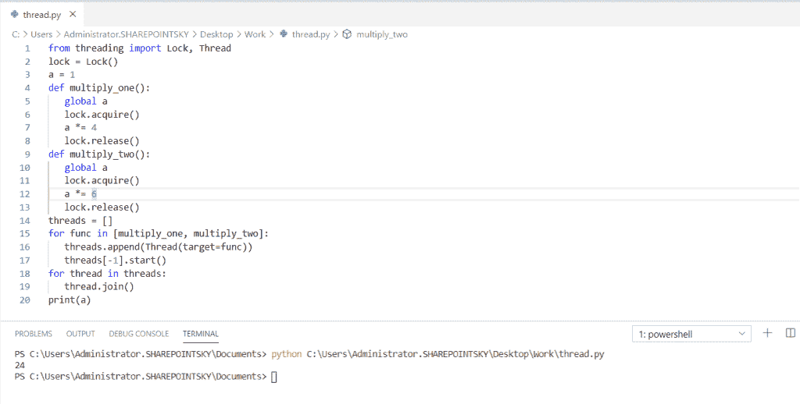
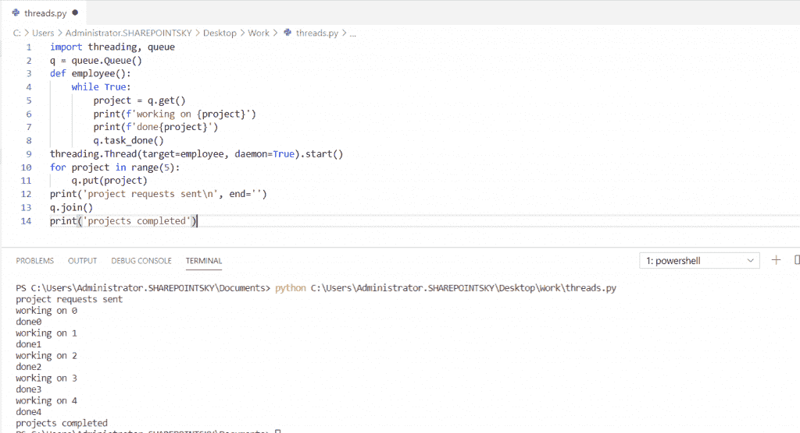
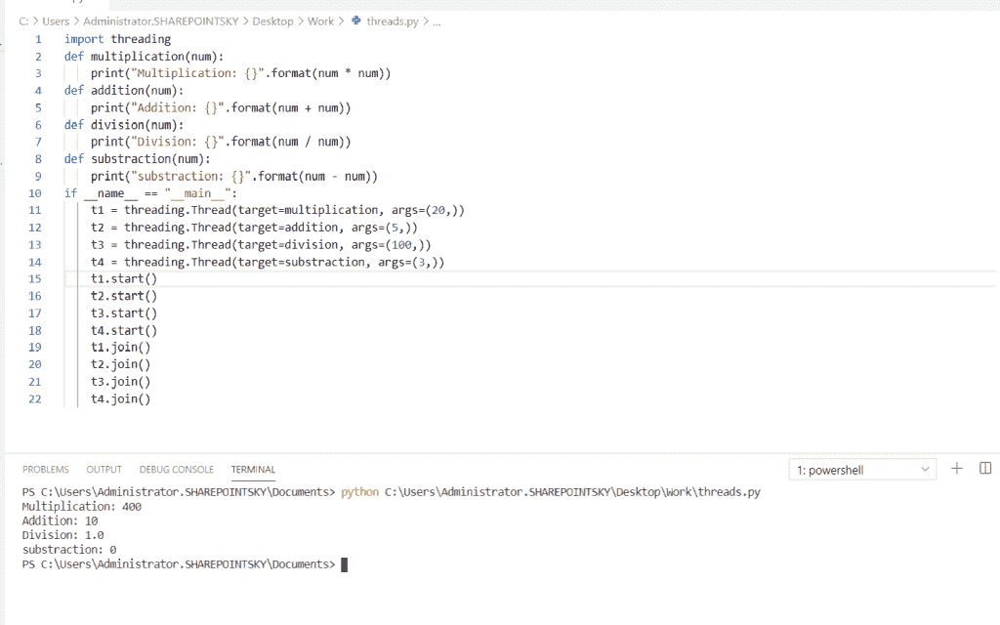
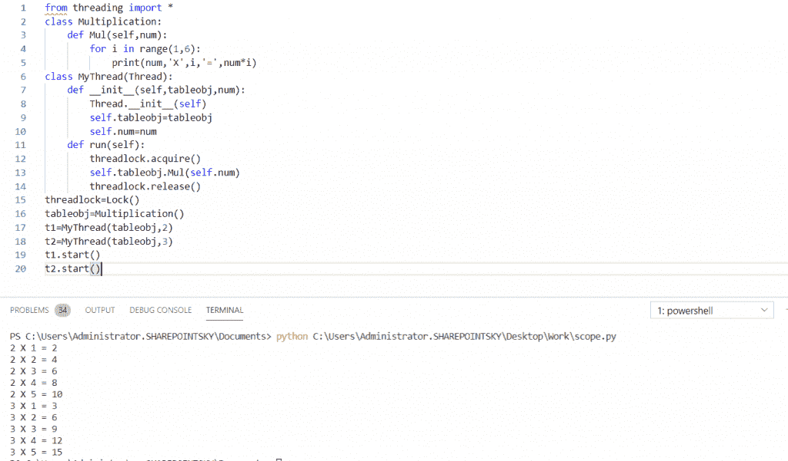
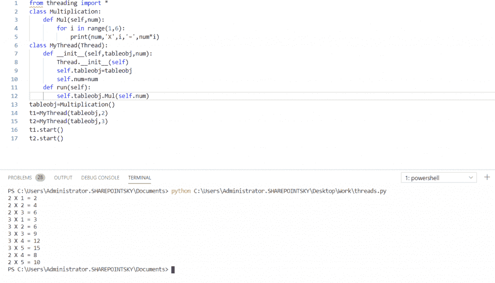
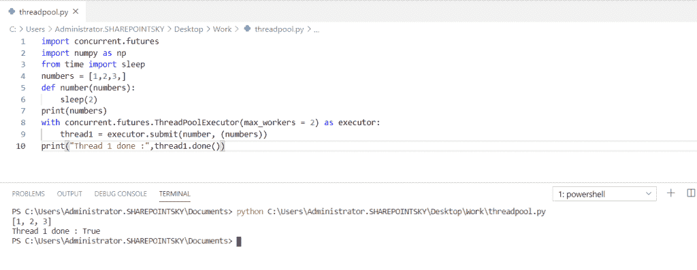

# Python 线程和多线程

> 原文：<https://pythonguides.com/python-threading-and-multithreading/>

[](https://sharepointsky.teachable.com/p/python-and-machine-learning-training-course)

在本 [python 教程](https://pythonguides.com/python-hello-world-program/)中，我们将讨论 **python 线程和多线程。**我们还将检查:

*   什么是线程？
*   什么是线程？
*   使用类创建 Python 线程
*   Python 线程锁
*   使用队列的线程
*   Python 多线程使用函数创建
*   多线程中的同步
*   Python 线程池
*   多线程与多处理
*   线程与多线程

目录

[](#)

*   [什么是线程？](#What_is_a_thread "What is a thread?   ")
*   [Python 线程介绍](#Introduction_to_Python_threading "Introduction to Python threading")
*   [使用类](#Python_thread_creating_using_class "Python thread creating using class")创建 Python 线程
*   [Python 线程锁](#Python_threading_lock "Python threading lock")
*   [使用队列的线程](#Threads_using_queue "Threads using queue")
*   [Python 中什么是多线程？](#What_is_Multithreading_in_Python "What is Multithreading in Python?                             ")
*   [使用函数创建 Python 多线程](#Python_Multithread_creating_using_functions "Python Multithread creating using functions")
*   [多线程中的同步](#Synchronization_in_Multithreading "Synchronization in Multithreading")
*   什么是竞态条件？
*   [Python 线程池](#Python_thread_pool "Python thread pool")
*   [多线程 vs 多重处理](#Multithreading_vs_Multiprocessing "Multithreading vs Multiprocessing")
*   [线程 vs 多线程](#Thread_vs_Multithread "Thread vs Multithread")

## 什么是线程？

线程是操作系统中调度的最小单元，它可以同时执行多任务。当任务需要一些时间来执行时，在这种情况下使用 python 线程。

## Python 线程介绍

*   线程化是同时运行多个线程的过程。
*   线程模块包括一种简单的方法来实现用于同步线程的锁定机制。

在这个例子中，我导入了一个名为线程和时间的模块。同样，我们将定义一个函数 Evennum 为**def**even num()。我们使用了 for 循环和 range()函数，还使用了 sleep()来等待执行当前线程给定的秒数。

示例:

```
import threading
import time

def Evennum():
    for i in range(2, 10, 2):
        time.sleep(1)
        print(i)

threading.Thread(target=Evennum).start()
```

下面的截图显示了从 2 到 10 的偶数。



Python Threading

阅读[如何在 Python Pygame 中把屏幕放在特定位置](https://pythonguides.com/how-to-put-screen-in-specific-spot-in-python-pygame/)

## 使用类创建 Python 线程

在这里，我们可以看到**如何使用 python 中的类**创建线程。

创建线程类的语法:

```
Thread(group=None, target=None, name=None, args=(), kwargs={})
```

要使用 python 中的类创建线程，有一些类方法:

*   **run()**–这个方法调用传递给对象构造函数的目标函数。
*   **start()**–线程活动通过调用 start()方法启动，当我们调用 start()时，它在内部调用 run 方法并执行目标对象。
*   **join([time out])—**该方法阻塞调用线程，直到被调用 join()的线程正常终止或通过句柄异常终止。
*   **getName()**–该方法返回线程的名称。
*   **set name(name)**–该方法用于设置线程名称，该名称以字符串的形式出现，用于识别。
*   **is alive()**–该方法返回线程是否活动。在调用 start()时，线程是活动的，并且一直持续到 run()终止。
*   **set daemon(Daemonic)**–该方法用于将守护进程标志设置为布尔值 Daemonic。这应该在开始()之前调用。
*   **isDaemon()**–该方法返回线程守护标志的值。

*   在这个例子中，我从线程中导入了一个名为 **thread 的模块，并将一个函数定义为一个**线程函数**，并传递了一个参数。**
*   __name__ 属性的值被设置为**“_ _ main _ _”**。当模块作为程序运行时。__name__ 是决定当前模块名称的内置变量。
*   如果模块直接从命令行运行，那么 **"__name__"** 被设置为 **"__main__"** 。

示例:

```
from threading import Thread 
def threaded_function(arg): 
    for i in range(arg): 
        print("python guides")
if __name__ == "__main__": 
    thread = Thread(target = threaded_function, args = (3, )) 
    thread.start() 
    thread.join() 
    print("Thread Exiting...") 
```

你可以在下面的截图中看到，在**范围()中提到的 **python 指南打印了三次**。**



Python thread creating using class

## Python 线程锁

线程模块有一个叫做 lock 的同步工具。锁类有两种方法:

*   **acquire()** :这个方法锁定锁并阻塞执行，直到它被释放。
*   **release()** :该方法用于释放锁。此方法仅在锁定状态下调用。
*   在这个例子中，我从线程中导入了名为 Lock 的**， **lock = Lock()** 用于声明一个锁，并定义了函数来将值乘为 **def multiply_one()。****
*   **lock.acquire()** 用于在状态解锁时锁定，并立即返回。
*   **lock.release()** 用于解锁状态，仅在状态锁定时调用。
*   **threads . append(Thread(target = func))**用于用目标函数实例化它。
*   **线程[-1]。start()** 用于调用 start，**【打印(a)】**给出最终值。

示例:

```
from threading import Lock, Thread
lock = Lock()
a = 1

def multiply_one():

   global a
   lock.acquire()
   a *= 4
   lock.release()

def multiply_two():
   global a
   lock.acquire()
   a *= 6
   lock.release()

threads = []
for func in [multiply_one, multiply_two]:
   threads.append(Thread(target=func))
   threads[-1].start()

for thread in threads:

   thread.join()

print(a)
```

你可以参考下面的截图来看看倍增的价值。



Python threading lock

## 使用队列的线程

*   在这个例子中，我导入了名为队列和线程的模块。函数 employee 被用作 **def employee()** 。
*   调用无限循环(如果为真)以使线程准备好接受所有任务。
*   然后将 queue 定义为 **project = q.get()。**
*   **task_done()** 告知队列任务处理完成。当项目被放入队列时**任务完成**被调用。
*   **穿线**。**线程(target=employee，daemon=True)。start()** 用于启动员工线程。
*   **在范围(5)内的时间表示**向员工发送 5 个任务。
*   加入块，直到所有任务完成。

示例:

```
import threading, queue
q = queue.Queue()
def employee():
    while True:
        project = q.get()
        print(f'working on {project}')
        print(f'done{project}')
        q.task_done()
threading.Thread(target=employee, daemon=True).start()
for project in range(5):
    q.put(project)
print('project requests sent\n', end='')
q.join()
print('projects completed')
```

你可以参考下面的截图来查看所有 5 个任务的输出。



Threads using queue

## Python 中什么是多线程？

并行执行多个线程的过程。多线程通过多任务最大限度地利用 CPU 的**。Web 浏览器和 Web 服务器都是多线程的应用。**

## 使用函数创建 Python 多线程

*   在这个例子中，我导入了线程，定义了一个函数，并执行了算术运算。
*   **format()** 返回格式化的字符串。 **t1.start()** 启动线程。 **t1.join()** 执行主线程，直到另一个线程完成。
*   __name__ 属性的值被设置为**“_ _ main _ _”**。当模块作为程序运行时。__name__ 是决定当前模块名称的内置变量。
*   如果模块直接从命令行运行，那么 **"__name__"** 被设置为 **"__main__"** 。

示例:

```
import threading 
def multiplication(num): 
    print("Multiplication: {}".format(num * num)) 
def addition(num): 
    print("Addition: {}".format(num + num)) 
def division(num):
    print("Division: {}".format(num / num))
def substraction(num):
    print("substraction: {}".format(num - num))
if __name__ == "__main__":  
    t1 = threading.Thread(target=multiplication, args=(20,)) 
    t2 = threading.Thread(target=addition, args=(5,))  
    t3 = threading.Thread(target=division, args=(100,))
    t4 = threading.Thread(target=substraction, args=(3,))
    t1.start()  
    t2.start() 
    t3.start()
    t4.start()
    t1.join() 
    t2.join()
    t3.join()
    t4.join()
```

你可以参考下面的截图来检查算术运算。



Python thread creating using functions

## 多线程中的同步

线程同步通过确保一次访问一个线程来保护共享资源。它还保护免受竞争条件的影响。

## 什么是竞态条件？

多个线程同时访问共享资源。所有线程竞相完成任务，最后，它将以不一致的数据结束。为了结束这种竞争状态，使用了同步方法。

*   这里，我们必须创建一个共享资源。共享资源为任何给定的数字生成乘法表。
*   在这个例子中，我导入了一个名为**线程**的模块，定义了**类乘法**，并定义了一个函数 Mul 为 **def Mul** 。
*   然后我使用了范围(1，6)中的循环，然后使用了 **print(num，' X '，I，' = '，num*i)** 。这里 num 是你给的数字，**‘X’**是乘法符号，I 是给定的范围。
*   然后定义了另一个**类为 MyThread** ，定义了一个构造函数为 **def__init__(self，tableobj，num)。**在构造函数中，我定义了一个超类构造函数。
*   为了在这个线程中包含共享资源，我们需要一个对象，并使用 **tableobj 作为参数**，使用另一个**参数作为 num** 。
*   再次使用 **def run(self)** 定义运行功能。
*   使用 **threadlock=Lock()** 创建线程锁。
*   这个锁应该在访问共享资源之前创建，在访问共享资源之后，我们必须使用 **threadlock.release()** 来释放。
*   为了得到输出**，使用了 self.tableobj.Mul(self.num)** 。
*   使用**table obj = Multiplication()**创建共享资源对象。
*   使用 **t1=MyThread(tableobj，2)** 创建两个线程，然后传递参数 tableobj 和一个数字。
*   之后，我们必须使用 **t1.start()** 来启动线程。

示例:

```
from threading import *
class Multiplication:
    def Mul(self,num):
        for i in range(1,6):
            print(num,'X',i,'=',num*i)
class MyThread(Thread):
    def __init__(self,tableobj,num):
        Thread.__init__(self)
        self.tableobj=tableobj
        self.num=num
    def run(self):
        threadlock.acquire()
        self.tableobj.Mul(self.num)
        threadlock.release()
threadlock=Lock()
tableobj=Multiplication()
t1=MyThread(tableobj,2)
t2=MyThread(tableobj,3)
t1.start()
t2.start()
```

在这里，在下面的截图中，我们可以看到乘法表的数字 2 和 3。



Synchronization in Multithreading

你可以参考下面的截图，查看数据的不正确排列。

*   在这个输出中，我们可以看到数据排列不当。这是由于竞态条件。为了克服竞争情况，使用同步。
*   有时我们可能得到正确的数据，但很多时候我们会得到不正确的数据排列。
*   所以，最好使用同步方法(锁类)。



Synchronization in Multithreading

## Python 线程池

*   线程池是一组等待作业的工作线程。
*   在线程池中，创建一组固定大小的线程。
*   服务提供者从线程池中拉出线程，并将任务分配给线程。
*   完成任务后，一个线程被返回到线程池。
*   线程池的优点是线程池重用线程来执行任务，任务完成后线程不会被破坏。它被返回到线程池中。
*   Threadpool 具有更好的性能，因为不需要创建线程。
*   在这个例子中，我导入了一个名为 **concurrent.futures** 的模块。这个模块提供了一个使用线程池处理任务的接口。
*   还导入了用于处理阵列的 **NumPy** 模块。
*   **时间模块**处理与时间相关的各种功能。
*   ThreadPoolExecutor 是一个 Executor 子类，它使用线程池来执行调用。通过使用 ThreadPoolExecutor，已经创建了 2 个线程。
*   然后任务由函数以一个参数的形式作为一个数字给出，等待 2 秒来执行函数并显示结果。
*   当任务完成时， **done()** 返回一个**真值**。
*   **submit()** 方法是 executor 的子接口。submit()接受可运行和可调用的任务。

示例:

```
import concurrent.futures
import numpy as np
from time import sleep
numbers = [1,2,3,]
def number(numbers):
    sleep(2)
print(numbers)
with concurrent.futures.ThreadPoolExecutor(max_workers = 2) as executor:
    thread1 = executor.submit(number, (numbers))
print("Thread 1 executed ? :",thread1.done())
```

在下面的截图中，我们可以看到 **done()** 在完成任务后返回 **true** 值。



Python thread pool

## 多线程 vs 多重处理

| **多线程** | **多重处理** |
| 多线程允许一个进程包含许多线程。 | 多重处理是包含两个或更多处理器的系统。 |
| 它用于在单个进程中创建线程。 | 它是用来增加计算能力的。 |
| 作业处理在更短的时间内完成。 | 工作流程在中等时间内完成 |
| 过程的创建是缓慢的。 | 线程的创建速度更快。 |

Multithreading vs Multiprocessing

## 线程 vs 多线程

| **线程** | **多线程** |
| 线程是可以同时执行多任务的最小单位。 | 并行执行多个线程的过程。 |
| 线程在进程中执行。 | 多线程有许多线程在共享地址空间中执行。 |
| 使用单个线程来执行任务。 | 使用多个线程来执行任务。 |

Thread vs Multithread

您可能会喜欢以下 Python 教程:

*   [如何将 Python 角度转换为弧度](https://pythonguides.com/python-degrees-to-radians/)
*   [Python 比较运算符](https://pythonguides.com/python-comparison-operators/)
*   [Python Tkinter 帧](https://pythonguides.com/python-tkinter-frame/)
*   [如何用 Python 制作矩阵](https://pythonguides.com/make-a-matrix-in-python/)
*   [Python 中的链表](https://pythonguides.com/linked-lists-in-python/)
*   [如何用 Python 显示日历](https://pythonguides.com/display-calendar-in-python/)
*   [如何用 Python 制作计算器](https://pythonguides.com/make-a-calculator-in-python/)
*   [Python 中的转义序列](https://pythonguides.com/escape-sequence-in-python/)
*   [Python 接口介绍](https://pythonguides.com/python-interface/)

在本 Python 教程中，我们学习了 **Python 线程和多线程**。此外，我们还讨论了以下主题:

*   什么是线程？
*   什么是多线程？
*   使用类创建 Python 线程
*   Python 线程锁
*   使用队列的线程
*   Python 多线程使用函数创建
*   多线程中的同步
*   Python 线程池
*   多线程与多处理
*   线程与多线程

[Bijay Kumar](https://pythonguides.com/author/fewlines4biju/)

Python 是美国最流行的语言之一。我从事 Python 工作已经有很长时间了，我在与 Tkinter、Pandas、NumPy、Turtle、Django、Matplotlib、Tensorflow、Scipy、Scikit-Learn 等各种库合作方面拥有专业知识。我有与美国、加拿大、英国、澳大利亚、新西兰等国家的各种客户合作的经验。查看我的个人资料。

[enjoysharepoint.com/](https://enjoysharepoint.com/)[](https://www.facebook.com/fewlines4biju "Facebook")[](https://www.linkedin.com/in/fewlines4biju/ "Linkedin")[](https://twitter.com/fewlines4biju "Twitter")