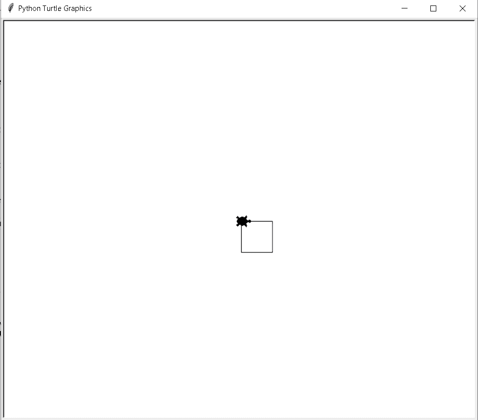
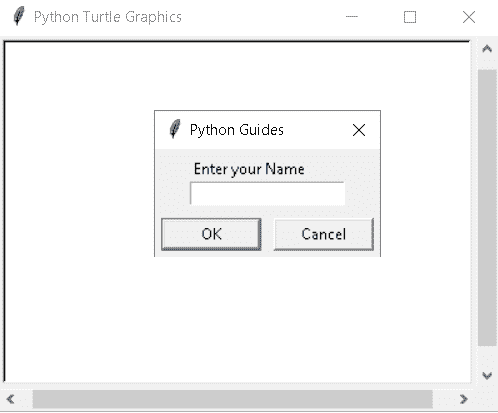
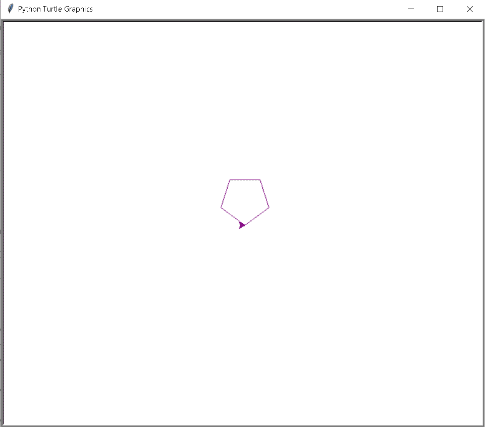
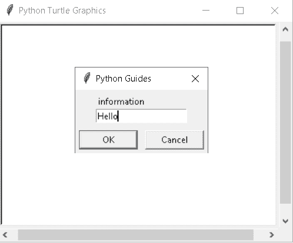
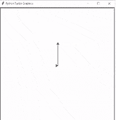
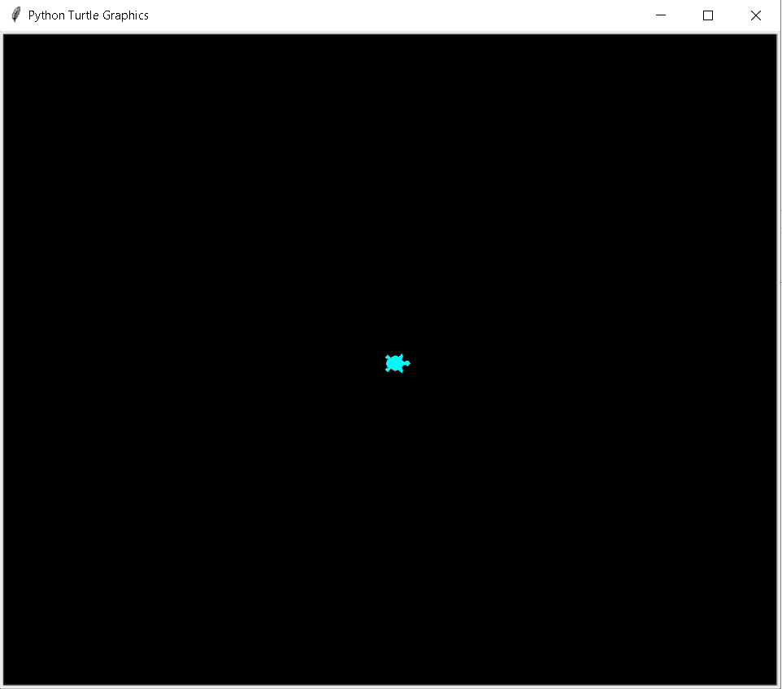

# Python turtle 输入示例

> 原文：<https://pythonguides.com/python-turtle-input/>

[](https://sharepointsky.teachable.com/p/python-and-machine-learning-training-course)

在这个 [Python 教程](https://pythonguides.com/python-hello-world-program/)中，我们将学习**如何在 Python Turtle** 中从用户那里获得输入，我们还将涵盖与 Turtle 输入相关的不同示例。我们将讨论这些话题。

*   Python turtle 输入
*   Python turtle 输入框
*   Python 海龟输入颜色
*   Python turtle 输入函数
*   Python turtle 用户输入
*   Python turtle 键盘输入
*   Python 海龟屏幕输入
*   Python turtle raw_input

目录

[](#)

*   [蟒龟输入](#Python_turtle_input "Python turtle input")
*   [蟒龟输入框](#Python_turtle_input_box "Python turtle input box")
*   [蟒龟输入颜色](#Python_turtle_input_color "Python turtle input color")
*   [巨蟒龟输入功能](#Python_turtle_input_function "Python turtle input function")
*   [蟒龟用户输入](#Python_turtle_user_input "Python turtle user input")
*   [巨蟒龟键盘输入](#Python_turtle_keyboard_input "Python turtle keyboard input")
*   [巨蟒龟屏幕输入](#Python_turtle_screen_input "Python turtle screen input")
*   [蟒龟 raw_input](#Python_turtle_raw_input "Python turtle raw_input")

## 蟒龟输入

在这一节中，我们将学习如何在 Python turtle 中从用户那里获得输入。

在前进之前，我们应该了解一些关于输入的知识。

输入被定义为信息被输入的地方，这些信息被存储或以输出的形式返回。

在这里，我们可以从用户那里获得输入，在获得输入后，我们可以在屏幕上看到输出。

**代码:**

在下面的代码中，我们将**从 turtle import *中导入 turtle 模块**，将 turtle 作为 tur 导入。

*   **tur.shape('turtle')** 用于给笔赋予乌龟形状。
*   **tur.forward(50)** 用于向前移动乌龟。
*   **tur.right(360/3)** 用于向右移动乌龟。
*   **answer = input(‘选择三角形、正方形或五边形’)**用于获取用户的输入。

```py
from turtle import *
import turtle as tur
tur.shape('turtle')

def triangle():
    for i in range(3):
        tur.forward(50)
        tur.right(360/3)

def square():
    for i in range(4):
        tur.forward(50)
        tur.right(360/4)

def pentagon():
    for i in range(5):
        tur.forward(50)
        tur.right(360/5)

answer = input(' choose the shape triangle, square or pentagon')
if answer ==('triangle'):
    triangle()

elif answer == ('square'):
    square()

elif answer == ('pentagon'):
    pentagon()

else:
    print ('Input is wrong')
tur.done()
```

**输出:**

运行上面的代码后，我们得到了下面的输出，其中我们可以看到一个命令提示符，用户在这里输入他们的输入并看到结果。


Python turtle input

在得到用户的输入后，我们可以看到在一只乌龟的帮助下，屏幕上画出了一个正方形。



Python turtle input Output

阅读[蟒龟画的字母](https://pythonguides.com/python-turtle-draw-letters/)

## 蟒龟输入框

在本节中，我们将了解[巨蟒龟](https://pythonguides.com/python-turtle-cheat-sheet/)中的**龟输入框**。

输入框类似于一个要求用户输入值的对话框，必要时在输入框中输入使用信息的文本。一个输入还显示消息，显示用户完成的请求。

**代码:**

在下面的代码中，我们将从 turtle import * 、 **import turtle** 中导入 turtle 模块**。**

*   **ws =乌龟。Screen()** 用于显示收件箱。
*   **turtle . textinput(" Python Guides "，"输入你的名字")**用于在输入框中输入输入。

```py
from turtle import *

import turtle

ws = turtle.Screen()
ws.setup(400, 300)
turtle.textinput("Python Guides", "Enter your Name")
```

**输出:**

运行上面的代码后，我们得到下面的输出，其中我们可以看到用户可以输入值或文本的输入框。输入文本后，点击确定值或文本保存，并在屏幕上显示为一条消息。



Python turtle input box Output

阅读[蟒龟鼠](https://pythonguides.com/python-turtle-mouse/)

## 蟒龟输入颜色

在本节中，我们将了解 python turtle 中的 **turtle 输入 colo** r。

众所周知，颜色是用来给吸引用户眼球的物体以吸引人的外观。

在 turtle 中，输入颜色用户可以选择颜色，并在输入框中输入选择的颜色，然后查看输出。

**代码:**

在下面的代码中，我们将从海龟导入* 、**导入海龟库**。

*   **currentshape = "pentagon"** 用于显示用户已经输入的当前形状，该形状将显示在屏幕上。
*   **step = { "三角形":3，"正方形":** **4，"五边形":5，"六边形":6}** 用于用户选择的形状。
*   **tur . text input(" Shape Selection "，" Enter a shape:")** 用于在输入框中输入文本。
*   **setcolor(currentcolor)** 用于设置形状的颜色。
*   **tur.circle(40，None，step[shape])** 用于给出圆的形状。
*   **currentcolor = "purple"** 用于给当前形状赋予颜色。
*   **tur.textinput("颜色选择"，"输入颜色:")**用于给当前形状赋予颜色。

```py
from turtle import *
import turtle as tur

currentshape = "pentagon"

step = {"triangle": 3, "square": 4, "pentagon": 5, "hexagon": 6}

def onkeyshape():
    shape = tur.textinput("Shape Selection", "Enter a shape:")
    if shape.lower() in step:
        tur.reset()
        setcolor(currentcolor)
        setshape(shape.lower())
    tur.listen()  

def setshape(shape):
    global currentshape
    tur.circle(40, None, step[shape])
    currentshape = shape

currentcolor = "purple"

colors = {"pink", "cyan", "light blue", "red", "purple"}

def onkeycolor():
    color = tur.textinput("Color Selection", "Enter a color:")
    if color.lower() in colors:
        tur.reset()
        setcolor(color.lower())
        setshape(currentshape)
    tur.listen()  

def setcolor(color):
    global currentcolor
    tur.color(color)
    currentcolor = color

setcolor(currentcolor)
setshape(currentshape)

tur.onkey(onkeycolor, "c")
tur.onkey(onkeyshape, "s")

tur.listen()

tur.mainloop()
```

**输出:**

运行上面的代码后，我们得到下面的输出，其中我们可以看到屏幕上显示了带有**紫色**的**五边形**形状。



Python turtle input color output

阅读[蟒龟画线](https://pythonguides.com/python-turtle-draw-line/)

## 巨蟒龟输入功能

在这一节中，我们将学习**如何在 python turtle 中创建 turtle 输入函数**。

这里我们使用 **turtle.textinput()** 函数，该函数用于弹出一个对话框窗口，用户可以在其中输入文本或值，点击确定按钮后返回值。

如果取消了输入框而没有输入任何值或文本，则返回 None。

**代码:**

在下面的代码中，我们将从 turtle import * 、 **import turtle** 中导入 turtle 模块**。**龟()**法是用来做物件的。**

*   **乌龟。Screen()** 用于创建一个屏幕，我们可以在上面创建我们的输入框。
*   **turtle . textinput(" Python Guides "，" information")** 用于弹出对话框，在输入框内输入文本或数值。
*   **print(tur)** 用于打印用户在输入框中输入的屏幕文本。

```py
from turtle import *

import turtle

turt = turtle.Screen()
turt.setup(400, 300)
tur=turtle.textinput("Python Guides", "information")
print(tur)
```

**输出:**

运行上面的代码后，我们得到下面的输出，其中我们可以看到输入框，用户可以在输入框中输入文本。



Python turtle input function Output

阅读[巨蟒龟屏幕尺寸](https://pythonguides.com/python-turtle-screen-size/)

## 蟒龟用户输入

在这一节中，我们将学习如何在 python turtle 中从用户那里获得输入。

这里是****turtle . input()**函数，用于获取输入框，该输入框获取用户的输入。**

 **用户可以在输入框中输入文本或值，并以字符串的形式返回该值。如果输入框被取消，它将返回 None。

**代码:**

在下面的代码中，我们将从 turtle import * 、 **import turtle** 中导入 turtle 模块**。**龟()**法是用来做物件的。**

*   **tur****= turtle . textinput(" Enter your info "，" Name")** 用于接受用户的输入。
*   **print(tur)** 用于打印用户输入的数值或文本。

```py
from turtle import *

import turtle

tur = turtle.textinput("Enter your info", "Name")

print(tur)
```

**输出:**

运行上面的代码后，我们得到下面的输出，其中我们可以看到用户可以输入文本或值的对话框。


Python turtle user input

在输入框中输入值后，它返回文本或值，正如我们在这张图片中看到的。


Python turtle user input output

又念，[蟒龟圆点](https://pythonguides.com/python-turtle-dot/)

## 巨蟒龟键盘输入

在这一节中，我们将学习如何在 python turtle 中获得 turtle 键盘输入。

**input()** 函数用于在输入框中输入数值。在 turtle 键盘输入中，用户可以在键盘的帮助下进行输入。这里我们使用上、下、左、右键进行输入。

**代码:**

在下面的代码中，我们将从 turtle import * 、 **import turtle** 中导入 turtle 模块**。**龟()**法是用来做物件的。**

*   **turtle.speed(0)** 用来给乌龟最快的速度。
*   **turtle.forward(100)** 用于向前移动乌龟。
*   当我们按下向上键时，乌龟向上移动。
*   当我们按下向下键时，乌龟向下移动。
*   **onkey(left，' Left')** 当我们按下左键时乌龟向左移动。
*   **onkey(right，' Right')** 当我们按下右键时，乌龟向正确的方向移动。

```py
import turtle
from turtle import *

setup(500, 500)
Screen()
turtle = turtle.Turtle()
turtle.speed(0)
showturtle()

def up():
    turtle.setheading(90)
    turtle.forward(100)

def down():
    turtle.setheading(270)
    turtle.forward(100)

def left():
    turtle.setheading(180)
    turtle.forward(100)

def right():
    turtle.setheading(0)
    turtle.forward(100)

listen()
onkey(up, 'Up')
onkey(down, 'Down')
onkey(left, 'Left')
onkey(right, 'Right')

mainloop()
```

**输出:**

运行上面的代码后，我们得到下面的输出，当我们从键盘输入时，我们可以看到乌龟在移动。



python turtle keyboard input

阅读[蟒龟 onclick](https://pythonguides.com/python-turtle-onclick/)

## 巨蟒龟屏幕输入

在本节中，我们将了解 python turtle 中的 tu **rtle 屏幕输入**。

我们在 **input()** 函数的帮助下获得用户的输入。用户可以在屏幕上显示的输入框中输入文本，它返回以消息形式显示的字符串。

如果取消输入框而不输入任何值，则返回 None。

**代码:**

在下面的代码中，我们将从 turtle import *导入 turtle 模块，导入 turtle。使用 **turtle()** 方法制作对象。

*   **tur.color("青色")**用来给乌龟上色。
*   **tur.shape("turtle")** 用于给笔赋予乌龟形状。
*   **tur.penup()** 用于开始绘图。
*   **int(ws . textinput(" Python guides "，"以像素为单位输入值"))**用于在输入框内输入值。
*   **tur.forward(ans)** 用于将乌龟向前移动。
*   **tur.backward(5)** 用于向后移动乌龟。

```py
from turtle import *
import turtle as turt

ws = turt.Screen()

tur = turt.Turtle()
tur.color("cyan")
tur.shape("turtle")
tur.penup()

def goForward():
    ans = int(ws.textinput("Python guides", "Enter the values in pixels"))
    tur.forward(ans)

def goBackward():
    tur.backward(5)

turt.listen()
turt.onkey(goForward,"Up")
turt.onkey(goBackward, "Down")
turt.done()
```

**输出:**

运行上面的代码后，我们得到下面的输出，我们可以看到按下 up 键时，对话框出现在屏幕上。用户在对话框中输入值，然后单击 ok。

点击 Ok 按钮后，我们可以看到屏幕上的乌龟向前移动了 50 个像素。


Python turtle screen input

阅读[蟒龟艺术](https://pythonguides.com/python-turtle-art/)

## 蟒龟 raw_input

在本节中，我们将了解 python turtle 中的 **turtle raw_input。**

我们知道 **input()** 函数用于输入用户的输入，并以字符串的形式返回输入。

**raw_input()** 函数类似于 **input()** 函数。它读取输入并读取字符串。

**raw_input()** 函数是在 Python 2.0 中构建的。但是在 python 3 中我们没有。

当我们在 python 3 中运行 **raw_input()** 函数时，我们得到一个错误“raw_input”未定义。要修复这个错误，请在您的程序中将所有提到的 **raw_input()** 替换为 **input()** 函数，因为 **raw_input()** 类似于 **input()** 函数。

**代码:**

在下面的代码中，我们将从 turtle import * 、 **import turtle** 中导入 turtle 模块**。**龟()**法是用来做物件的。**

*   **tur.shape("龟")**用来给龟取形。
*   **输入("你应该给乌龟什么颜色？")**用于获取用户的输入。
*   **turt。Screen()** 用来制作屏幕，我们可以在上面创建我们的输入框。
*   **ws . bgcolor(background color)**用于赋予背景颜色。

```py
from turtle import *
import turtle as turt

tur = turt.Turtle()
tur.shape("turtle")

turtlecolor = input("What color should you give the turtle be?")
tur.color(turtlecolor)

ws = turt.Screen()
backgroundcolor = input("What the background color should be?")
ws.bgcolor(backgroundcolor)
turt.exitonclick()
```

**输出:**

运行上面的代码后，我们得到下面的输出，其中我们可以看到命令提示符上提到了问题，用户以输入的形式给出了下面问题的答案。


Python turtle raw_input

在得到用户输入后，我们可以看到美丽的黑色背景的屏幕，一只青色的乌龟也放在屏幕上。



Python turtle raw_input output

您可能还会喜欢以下 Python turtle 教程:

*   [Python 龟写函数](https://pythonguides.com/python-turtle-write-function/)
*   [蟒龟圈](https://pythonguides.com/python-turtle-circle/)
*   [蟒龟速度举例](https://pythonguides.com/python-turtle-speed/)
*   [蟒蛇龟的颜色](https://pythonguides.com/python-turtle-colors/)
*   [如何在 Turtle Python 中附加图像](https://pythonguides.com/attach-image-to-turtle-python/)
*   [巨蟒龟命令](https://pythonguides.com/python-turtle-commands/)

因此，在本教程中，我们讨论了 **Python Turtle Input** ,我们还讨论了与其实现相关的不同示例。这是我们已经讨论过的例子列表。

*   Python turtle 输入
*   Python turtle 输入框
*   Python 海龟输入颜色
*   Python turtle 输入函数
*   Python turtle 用户输入
*   Python turtle 键盘输入
*   Python 海龟屏幕输入
*   Python turtle raw_input

[Bijay Kumar](https://pythonguides.com/author/fewlines4biju/)

Python 是美国最流行的语言之一。我从事 Python 工作已经有很长时间了，我在与 Tkinter、Pandas、NumPy、Turtle、Django、Matplotlib、Tensorflow、Scipy、Scikit-Learn 等各种库合作方面拥有专业知识。我有与美国、加拿大、英国、澳大利亚、新西兰等国家的各种客户合作的经验。查看我的个人资料。

[enjoysharepoint.com/](https://enjoysharepoint.com/)[](https://www.facebook.com/fewlines4biju "Facebook")[](https://www.linkedin.com/in/fewlines4biju/ "Linkedin")[](https://twitter.com/fewlines4biju "Twitter")**