# Python NumPy 零+示例

> 原文：<https://pythonguides.com/python-numpy-zeros/>

[](https://sharepointsky.teachable.com/p/python-and-machine-learning-training-course)

在本 [Python 教程](https://pythonguides.com/python-hello-world-program/)中，我们将通过几个例子来讨论 **Python NumPy zeros** ，我们还将涵盖以下几点:

*   Python NumPy 零
*   Python NumPy zeros_like
*   Python NumPy zeros int
*   Python NumPy 零点复数
*   Python NumPy 零示例
*   Python NumPy 类零数组
*   Python NumPy 零浮点数
*   Python 数字零 3d
*   Python NumPy 零列
*   Python Numpy 从数组中删除零
*   Python 在 numpy 数组中计数零
*   Python numpy 删除零行
*   Python 向 numpy 数组添加零

如果您是 Python NumPy 的新手，请查看 [Python NumPy 教程](https://pythonguides.com/numpy/)。

目录

[](#)

*   [Python NumPy 零](#Python_NumPy_zeros "Python NumPy zeros")
*   [Python numpy zeros_like](#Python_numpy_zeros_like "Python numpy zeros_like")
*   [Python numpy zeros int](#Python_numpy_zeros_int "Python numpy zeros int")
*   [Python numpy 零点复数](#Python_numpy_zeros_complex "Python numpy zeros complex")
*   [Python numpy 零示例](#Python_numpy_zeros_example "Python numpy zeros example")
*   [Python numpy zeros_like 数组](#Python_numpy_zeros_like_array "Python numpy zeros_like array")
*   [Python numpy 零浮点数](#Python_numpy_zeros_float "Python numpy zeros float")
*   [Python numpy zeros 3d](#Python_numpy_zeros_3d "Python numpy zeros 3d")
*   [Python numpy 零列](#Python_numpy_zeros_column "Python numpy zeros column")
*   [Python Numpy 从数组中移除零](#Python_Numpy_remove_zeros_from_an_array "Python Numpy remove zeros from an array")
*   [Python 在 NumPy 数组中计数零](#Python_count_zeros_in_NumPy_array "Python count zeros in NumPy array")
*   [Python NumPy 删除零行](#Python_NumPy_delete_zero_rows "Python NumPy delete zero rows")
*   [Python 给 NumPy 数组加零](#Python_add_zeros_to_the_NumPy_array "Python add zeros to the NumPy array")

## Python NumPy 零

*   在本节中，我们将学习 Python numpy zeros。
*   我们可以使用 zeros()函数创建全零数组。
*   为了使用这个 zeros()函数，我们需要导入 numpy 库。
*   我们可以创建一个所需形状和类型的数组，并用零填充。
*   现在我们将讨论参数。
    *   形状
    *   类型
    *   命令

1.  **形状** :-你要提到数组的形状。
2.  **dtype** :- dtype 代表数据类型，默认值为 float。
3.  **order** :-可选参数，是否将多维数据存储在 row-major 中。

**语法:**

下面是 Python 中 numpy 零的语法

```
Zeros(
    shape,
    dtype=int,
    order='C'
    )
```

**例子**

让我们举个例子来检查**如何创建一个 numpy zeros()函数**。

```
import numpy as np

b = np.zeros((7,),dtype=int)
print(b)
```

下面是以下代码的截图。

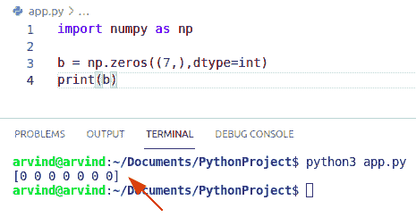

Python numpy zeros

阅读: [Python NumPy 数组+示例](https://pythonguides.com/python-numpy-array/)

## Python numpy zeros_like

*   在这一节中，我们将学习 Python 中的 **NumPy zeros_like 函数。**
*   Numpy zeros_like()函数以数组、顺序、类型、形状作为参数，并返回值为零的数组。
*   在这个方法中，我们将看到一个新的顺序，它尽可能地与一个数组的布局相匹配。
*   现在我们将讨论参数。
    *   形状
    *   类型
    *   命令

1.  数组:-你应该提到数组的形状。
2.  dtype:- dtype 代表数据类型，默认值是 float。
3.  order:-这是是否在 row-major 中存储多维数据的可选参数。

**语法:**

下面是 numpy zeros_like 的语法

```
Zeros_like(
          arry,
          dtype=None,
          order='K'
         )
```

**例子**

让我们举一个例子来检查如何创建一个 numpy zeros_like()函数。

```
import numpy as np

y = np.arange(4)
y = y.reshape((2, 2))
b = np.zeros_like(y)
print(b)
```

下面是下面给出的代码的截图。

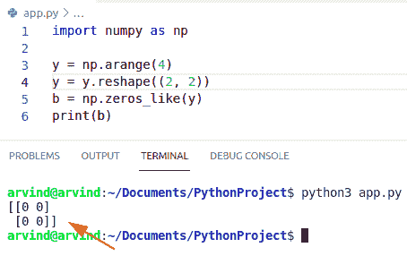

Python numpy zeros_like

阅读:[Python NumPy Random+Examples](https://pythonguides.com/python-numpy-random/)

## Python numpy zeros int

*   在本节中，我们将学习 **Python NumPy zeros int** 。
*   Numpy zeros 函数将数组、顺序、类型、形状作为参数，并返回值为零的数组。
*   在这个方法中，我们将看到一个新的顺序，它尽可能地与一个数组的布局相匹配。
*   新数组的形状可以是表示某些元素的 int，也可以是 int 的元组。
*   它返回 ndarray，这意味着具有给定形状、数据类型和顺序的零数组。
*   现在我们将讨论参数。
    *   形状
    *   类型
    *   命令

1.  形状:-你应该提到数组的形状。
2.  dtype:- dtype 代表数据类型，默认值是 float。
3.  order:-这是是否在 row-major 中存储多维数据的可选参数。

**语法:**

下面是 numpy zeros int 的语法

```
Zeros(
    shape,
    dtype=int,
    order='C'
    )
```

**举例:**

让我们举一个例子来检查如何创建一个 numpy zeros int。

```
import numpy as np

c = np.zeros((5,),dtype=int)
print(c)
```

下面是下面给出的代码的截图。

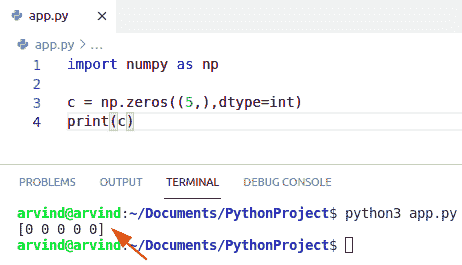

Python numpy zeros int

Read: [检查 Python + Examples 中的 NumPy 数组是否为空](https://pythonguides.com/check-if-numpy-array-is-empty/)

## Python numpy 零点复数

*   在本节中，我们将学习 **Python NumPy zeros complex** 。
*   Python 中的复数用 x+yi 表示，其中 x 和 y 是实数，我们可以使用 Complex 函数将实数转换成复数。
*   Numpy zeros 函数将数组、顺序、类型、形状作为参数，并返回值为零的数组。
*   在这个方法中，我们将看到一个新的顺序，它尽可能地与一个数组的布局相匹配。
*   它返回 ndarray，这意味着具有给定形状、数据类型和顺序的零数组。
*   首先，我们创建一个随机数组，然后，我们使用函数 np。它接受一个数据类型为 shape 的参数，并以复杂的形式返回值为零的数组。

**语法:**

下面是 numpy 零复数的语法

```
Zeros(
    shape,
    dtype=complex,
    order='C'
    )
```

**例子**

让我们举一个例子来检查如何创建一个 numpy 零复数。

```
import numpy as np

b= np.array([[1+2j,3+4j],[6+7j,9+2j]])
b= np.zeros((2,2),dtype=complex)
print(b)
```

下面是下面给出的代码的截图。

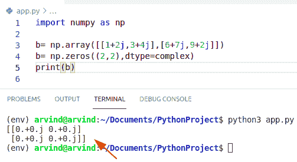

Python numpy zeros complex

阅读 [Python NumPy 重复](https://pythonguides.com/python-numpy-repeat/)

## Python numpy 零示例

*   在本节中，我们将学习 **Python numpy zeros 示例**。
*   我们可以使用 zeros()函数创建全零数组。
*   为了使用这个 zeros()函数，我们需要导入 numpy 库。
*   我们可以创建一个所需形状和类型的数组，并用零填充。

**语法:**

下面是 numpy 零的语法

```
Zeros(
    shape,
    dtype=int,
    order='C'
    )
```

**例子**

```
import numpy as np

b = np.zeros((5),dtype=float)
print(b)#zeros in decimal form

c = np.zeros((2,2),dtype=int)
print(c)#zeros 2d matrix form

d = np.zeros((3,3),dtype=float)
print(d)#zeros 3d matrix form 
```

下面是以下代码的截图

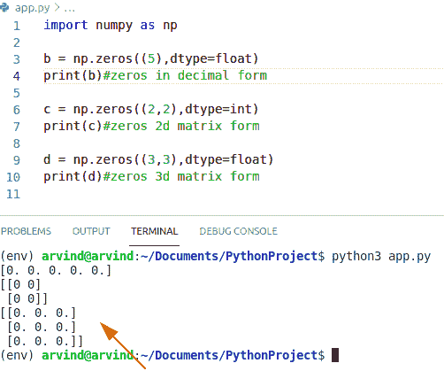

Python numpy zeros example

## Python numpy zeros_like 数组

*   在这一节中，我们将学习 Python NumPy zeros_like 数组。
*   Numpy zeros_like()函数以数组、顺序、类型、形状作为参数，并返回值为零的数组。
*   在这个方法中，我们将看到一个新的顺序，它尽可能地与一个数组的布局相匹配。
*   现在我们将讨论参数。
    *   形状
    *   类型
    *   命令

1.  形状:-你应该提到数组的形状。
2.  dtype:- dtype 代表数据类型，默认值是 float。
3.  order:-这是是否在 row-major 中存储多维数据的可选参数。

**语法:**

下面是 numpy zeros_like 的语法

```
Zeros_like(
          shape=None,
          dtype=None,
          order='K'
         )
```

**例子**

让我们举一个例子来检查如何创建一个 numpy zeros_like()函数。

```
import numpy as np

y = np.arange((10))
y = y.reshape((5, 2))
b = np.zeros_like(y)
print(b)
```

下面是以下代码的截图。

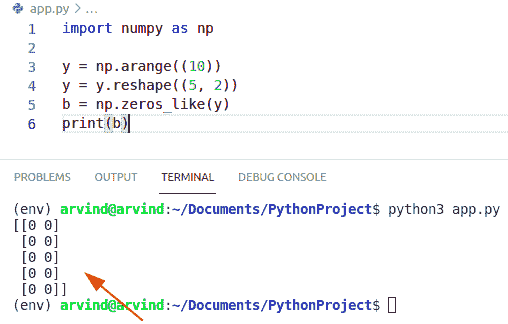

Python numpy zeros_like array

## Python numpy 零浮点数

*   在这一节中，我们将学习 Python 中的 **NumPy 零浮点。**
*   从给定的输入中返回一个浮点值，它返回一个十进制值。
*   Numpy zeros 函数将数组、顺序、类型、形状作为参数，并返回值为零的数组。
*   Numpy zeros float 返回十进制零值。
*   在这个方法中，我们将看到一个新的顺序，它尽可能地与一个数组的布局相匹配。

**语法:**

下面是 numpy 零浮点的语法

```
Zeros(
    shape,
    dtype=float,
    order='C'
    )
```

**例子**

让我们举一个例子来检查 numpy 零浮点

```
import numpy as np

c = np.zeros((4),dtype=float)
print(c)
```

以下是给定代码的截图

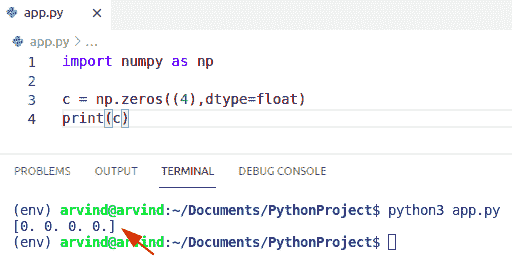

Python numpy zeros float

## Python numpy zeros 3d

*   在本节中，我们将学习 Python 中的 **NumPy zeros 3d。**
*   当我们使用我们的整形，并给它三个整数，所以三维是用来它只是整形。
*   Numpy zeros 函数将数组、顺序、类型、形状作为参数，并返回值为零的数组。
*   在这个方法中，我们将看到一个新的顺序，它尽可能地与一个数组的布局相匹配。

**例子**

让我们举个例子来检查一下 **Python numpy zeros 3d**

```
import numpy as np

y = np.arange(10)

a = np.zeros(shape=(3,2,1))
print(a)
```

以下是给定代码的截图

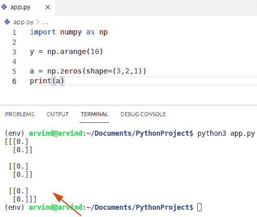

Python numpy zeros 3d

## Python numpy 零列

*   在这一节中，我们将学习 Python 中的 **NumPy 零列**。
*   Numpy zeros 函数将数组、顺序、类型、形状作为参数，并返回值为零的数组。

**语法:**

下面是 numpy 零列的语法

```
Zeros(
    shape,
    dtype=int,
    order='C'
    )
```

**例子**

```
import numpy as np

y = np.arange(10)
a = np.zeros(shape=(3,1),dtype = int)
print(a)
```

下面是以下代码的截图

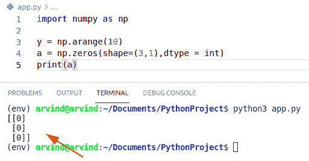

Python numpy zeros column

这是一个 **Python numpy 零列**的例子。

## Python Numpy 从数组中移除零

*   在这一节中，我们将学习如何从数组中删除零。
*   为了使用这个 zeros()函数，我们需要导入 numpy 库。
*   numpy.trim_zeros 函数用于从给定的数组中删除零。

**语法:**

下面是 numpy trim_zeros 函数的语法

```
numpy.trim_zeros(arr,trim)
```

**例子**

让我们举一个例子来检查如何从给定的数组中删除零

```
import numpy as np

arr = np.array([0,0,0,1,2,3,4,9,0,0])
new_arr = np.trim_zeros(arr)
print(new_arr)
```

下面是以下代码的截图

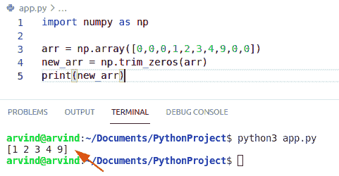

Python numpy remove zeros from an array

这是如何在 NumPy Python 中从数组中删除零。

## Python 在 NumPy 数组中计数零

*   在这一节中，我们将学习如何在 numpy 数组中计算零。
*   为了使用这个 zeros()函数，我们需要导入 numpy 库。
*   为了在 numpy 数组中计算零，我们可以很容易地使用 count_zeros 函数。
*   它返回给定数组中存在的零的计数。

**例子**

让我们举一个例子来检查 numpy 数组中的零计数。

```
import numpy as np
arr = [0,1,0,2,0,6,0,4,0,0,0]
def count_zeros(num):
    return str(num).count('0')
b = count_zeros(arr)
print(b)
```

以下是给定代码的截图

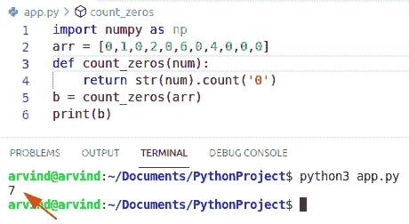

Python count zeros in numpy array

上面的代码我们可以用来**在 Python** 中对 numpy 数组中的零进行计数。

## Python NumPy 删除零行

*   在本节中，我们将学习如何删除零行。
*   要从给定的数组中删除零行，我们可以很容易地使用 delete()函数。
*   Numpy 库提供了从 NumPy 数组中删除元素的方法。

**语法:**

以下是删除零行的语法

```
numpy.delete
            (
            array,
            object,
            axis
           )
```

**例子**

让我们举一个例子来检查如何删除零行

```
import numpy as np

arr = np.array ([[5,6,7,8],[0,0,0,0],[9,2,5,6]])
new_arr = np.delete(arr, 1, axis=0)
print(new_arr)
```

以下是给定代码的截图

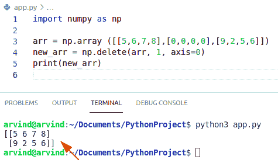

Python numpy delete zero rows

这就是如何在 Python NumPy 中删除零行。

## Python 给 NumPy 数组加零

*   在本节中，我们将了解如何向 numpy 数组添加零。
*   要向 numpy 数组添加零，我们可以很容易地使用函数 np.shape()和 np.zeros()。
*   Numpy zeros 函数将数组、顺序、类型、形状作为参数，并返回值为零的数组。

**例子**

让我们举一个例子来检查如何向 numpy 数组添加零

```
import numpy as np

arr = np.array([[3, 6], [9, 2]])
b = np.shape(arr)
add_array = np.zeros((3, 3))
add_array[:b[0],:b[1]] = arr # b is a shape variable name
print(add_array)
```

以下是给定代码的截图

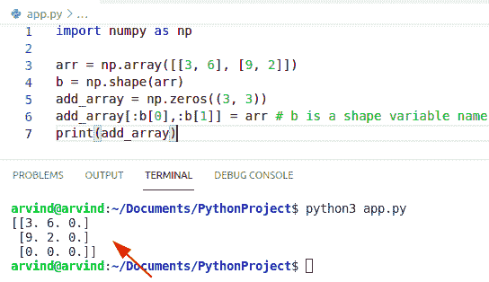

Python add zeros to the numpy array

上面的 Python 代码我们可以用来在 Python 中给 numpy 数组加零。

您可能会喜欢以下 Python 教程:

*   [Python Tkinter 滚动条](https://pythonguides.com/python-tkinter-scrollbar/)
*   [Python 检查变量是否为数字](https://pythonguides.com/python-check-if-a-variable-is-a-number/)
*   [Python 从字符串中移除子串](https://pythonguides.com/python-remove-substring-from-a-string/)
*   [Python Tkinter 文本框小工具](https://pythonguides.com/python-tkinter-text-box/)
*   [Python 3 的 string replace()方法](https://pythonguides.com/python-3-string-replace/)
*   [Python NumPy 矩阵](https://pythonguides.com/python-numpy-matrix/)

在本 Python 教程中，我们将讨论 **Python numpy zeros** ，还将涵盖以下示例:

*   Python numpy 零
*   Python numpy zeros_like
*   Python numpy zeros int
*   Python numpy 零点复数
*   Python numpy 零示例
*   Python numpy 类零数组
*   Python numpy 零浮点数
*   Python 数字零 3d
*   Python numpy 零列
*   Python Numpy 从数组中删除零
*   Python 在 numpy 数组中计数零
*   Python numpy 删除零行
*   Python 向 numpy 数组添加零

[Bijay Kumar](https://pythonguides.com/author/fewlines4biju/)

Python 是美国最流行的语言之一。我从事 Python 工作已经有很长时间了，我在与 Tkinter、Pandas、NumPy、Turtle、Django、Matplotlib、Tensorflow、Scipy、Scikit-Learn 等各种库合作方面拥有专业知识。我有与美国、加拿大、英国、澳大利亚、新西兰等国家的各种客户合作的经验。查看我的个人资料。

[enjoysharepoint.com/](https://enjoysharepoint.com/)[](https://www.facebook.com/fewlines4biju "Facebook")[](https://www.linkedin.com/in/fewlines4biju/ "Linkedin")[](https://twitter.com/fewlines4biju "Twitter")