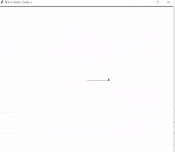
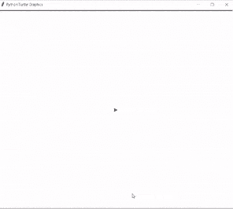
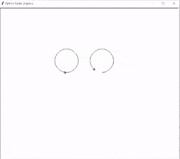

# Python Clear 龟配实例

> 原文：<https://pythonguides.com/python-clear-turtle/>

[](https://sharepointsky.teachable.com/p/python-and-machine-learning-training-course)

在这个 Python turtle 教程中，我们将学习如何使用 [Python Turtle](https://pythonguides.com/turtle-programming-in-python/) 创建 **Python clear turtle** ，我们还将介绍与 turtle clear 相关的不同示例。我们将讨论这些话题。

*   蟒蛇清龟
*   蟒蛇龟清晰屏幕
*   蟒龟清除法

目录

[](#)

*   [蟒清龟](#Python_clear_turtle "Python clear turtle")
*   [蟒龟清屏](#Python_turtle_clear_screen "Python turtle clear screen")
*   [蟒龟清法](#Python_turtle_clear_method "Python turtle clear method ")

## 蟒清龟

在这一节中，我们将学习如何在 Python turtle 中创建 turtle clear 函数。

我们知道 **clear** 用于删除用户不需要的不需要的项目。

海龟清除功能还用于删除用户在屏幕上绘制的图形，并保持海龟的原样。

**代码:**

在下面的代码中，我们将从 turtle import * 、**导入 turtle 模块**作为 tur** 。**龟()**法是用来做物件的。**

*   **tur.forward(100)** 用于向前移动乌龟。
*   **tur.right(90)** 用于向右移动乌龟。
*   **tur.clear()** 用于删除用户画的图，按原样删除剩余的乌龟。

```py
from turtle import *
import turtle as tur

tur.forward(100)
tur.right(90)
tur.forward(100)
tur.right(90)
tur.forward(100)

tur.clear()
tur.done()
```

**输出:**

运行上面的代码后，我们得到了下面的输出，我们可以看到用户在屏幕上画了一个形状。过了一段时间，这个就被移除了。该形状在 **clear()** 功能的帮助下被移除。



Python turtle clear Output

阅读:[蟒龟时钟](https://pythonguides.com/python-turtle-clock/)

## 蟒龟清屏

在本节中，我们将学习如何在 Python turtle 中清除屏幕。

在前进之前，我们应该对 clear 有一些了解。当我们使用 **clear()** 时，它不返回任何内容，而是删除所有元素，并在屏幕上提供空值。

**代码:**

在下面的代码中，我们将从 turtle import * 、 **import turtle** 中导入 turtle modul **e。**龟()**法是用来做物件的。**

*   **tur.forward(100)** 用于使乌龟向前移动。
*   **左转(120)** 用于向左移动乌龟。
*   **tur.clear()** 用于从屏幕上移除图形，以及屏幕上显示的剩余海龟。

```py
from turtle import *
import turtle

tur = turtle.Turtle()

tur.forward(100) 

tur.left(120)
tur.forward(100)

tur.left(120)
tur.forward(100)
tur.clear()
turtle.done()
```

**输出:**

运行上面的代码后，我们得到下面的输出，我们可以看到一个三角形是在一只乌龟的帮助下画出来的。

在我们的绘图被移除的时候，只有海龟显示在屏幕上，这是通过 **clear()** 函数完成的。



Python turtle clear screen Output

阅读:[蟒龟图形](https://pythonguides.com/python-turtle-graphics/)

## 蟒龟清法

在本节中，我们将学习如何在 python turtle 中使用 turtle clear 方法。

正如我们所知，在使用了 **clear()** 方法之后，它什么也没有返回，只显示了一个空白屏幕。

在这里，我们应用了 clear 方法，不是在全屏幕上，而是只在那些我们想要删除的图形上，在删除它们的乌龟后，它们会显示出来，而剩下的图形也会显示出来。

**代码:**

在下面的代码中，我们将从 turtle import * 、 **import turtle** 中导入 turtle 模块**。**龟()**法是在乌龟的帮助下制作物品和画画。**

*   **tur1.setpos(-100，50)** 用于帮助乌龟移动到绝对位置。
*   **tur1.circle(50)** 用来在乌龟的帮助下画圆。
*   **tur1.clear()** 用于从屏幕上删除第一个圆圈，只显示海龟的本来面目。
*   **tur3.clear()** 用于从屏幕上删除第三个圆圈，只显示海龟的本来面目。

```py
from turtle import *

import turtle

tur1 = turtle.Turtle()
tur1.up()
tur1.setpos(-100, 50)
tur1.down()
tur1.circle(50)

tur2 = turtle.Turtle()
tur2.up()
tur2.setpos(50, 50)
tur2.down()
tur2.circle(50)

tur3 = turtle.Turtle()
tur3.up()
tur3.setpos(50, -100)
tur3.down()
tur3.circle(50)

tur4 = turtle.Turtle()
tur4.up()
tur4.setpos(-100, -100)
tur4.down()
tur4.circle(50)

tur1.clear()
tur3.clear()
turtle.done()
```

**输出:**

运行上面的代码后，我们得到下面的输出，我们可以看到屏幕上画了四个圆圈。

在 **clear()** 方法的帮助下，从四个圆中移除两个圆，只有乌龟按原样显示，其余两个圆也显示在屏幕上。



Python turtle clear method Output

还有，多看看一些和 Python Turtle 相关的教程。

*   [巨蟒龟屏幕尺寸](https://pythonguides.com/python-turtle-screen-size/)
*   [蟒蛇龟点–实用指南](https://pythonguides.com/python-turtle-dot/)
*   [蟒龟嵌套循环](https://pythonguides.com/python-turtle-nested-loop/)
*   [蟒龟画线](https://pythonguides.com/python-turtle-draw-line/)
*   [Python turtle onclick 举例](https://pythonguides.com/python-turtle-onclick/)
*   [蟒蛇龟追踪仪——如何使用](https://pythonguides.com/python-turtle-tracer/)
*   [蟒龟三角+例题](https://pythonguides.com/python-turtle-triangle/)
*   [分形蟒龟+例子](https://pythonguides.com/fractal-python-turtle/)

在这里，我们学习了 **Python clear turtle** ，并且我们还介绍了与其实现相关的不同示例。这是我们已经讨论过的例子列表。

*   蟒蛇清龟
*   蟒蛇龟清晰屏幕
*   蟒龟清除法

[Bijay Kumar](https://pythonguides.com/author/fewlines4biju/)

Python 是美国最流行的语言之一。我从事 Python 工作已经有很长时间了，我在与 Tkinter、Pandas、NumPy、Turtle、Django、Matplotlib、Tensorflow、Scipy、Scikit-Learn 等各种库合作方面拥有专业知识。我有与美国、加拿大、英国、澳大利亚、新西兰等国家的各种客户合作的经验。查看我的个人资料。

[enjoysharepoint.com/](https://enjoysharepoint.com/)[](https://www.facebook.com/fewlines4biju "Facebook")[](https://www.linkedin.com/in/fewlines4biju/ "Linkedin")[](https://twitter.com/fewlines4biju "Twitter")