# Matplotlib 子图教程

> 原文：<https://pythonguides.com/matplotlib-subplot-tutorial/>

[](https://sharepointsky.teachable.com/p/python-and-machine-learning-training-course)

在本 [Python 教程](https://pythonguides.com/)中，我们将讨论 Python 中的 **matplotlib 子图**，它允许我们在一个图形中处理多个图，我们还将涵盖以下主题:

*   Matplotlib 子出图
*   Matplotlib 子图图形大小
*   Matplotlib 子图标题总体
*   每个情节的 Matplotlib 子情节标题
*   Matplotlib 子图标题字体大小
*   Matplotlib 子图标题粗体
*   Matplotlib 子图标题位置
*   Matplotlib 子图标题填充
*   Matplotlib 子图图例
*   Matplotlib 子图共享轴
*   Matplotlib 子图共享轴标签
*   绘图之间的 Matplotlib 子绘图间距
*   Matplotlib 子图间距自动
*   不同大小的 Matplotlib 子情节
*   Matplotlib 子图 gridspec
*   Matplotlib 子图网格线
*   Matplotlib 子图网格间距
*   Matplotlib 子图网格颜色
*   Matplotlib 子图图像
*   Matplotlib 子图图像大小
*   matplotlib im how colorbar 子打印
*   matplotlib 子出图

目录

[](#)

*   [Matplotlib subplot](#Matplotlib_subplot "Matplotlib subplot")
*   [Matplotlib 子图图形尺寸](#Matplotlib_subplot_figure_size "Matplotlib subplot figure size")
*   [Matplotlib 子情节标题总体](#Matplotlib_subplot_title_overall "Matplotlib subplot title overall")
*   [每个情节的 Matplotlib 子情节标题](#Matplotlib_subplot_title_for_each_plot "Matplotlib subplot title for each plot")
*   [Matplotlib 子图标题字体大小](#Matplotlib_subplot_title_font_size "Matplotlib subplot title font size")
*   [Matplotlib 子情节标题加粗](#Matplotlib_subplot_title_bold "Matplotlib subplot title bold")
*   [Matplotlib 子情节标题位置](#Matplotlib_subplot_title_position "Matplotlib subplot title position")
*   [Matplotlib 子情节标题填充](#Matplotlib_subplot_title_padding "Matplotlib subplot title padding")
*   [Matplotlib 子情节图例](#Matplotlib_subplot_legend "Matplotlib subplot legend")
*   [Matplotlib 子图共享轴](#Matplotlib_subplot_share_axis "Matplotlib subplot share axis")
*   [Matplotlib 子图共享轴标签](#Matplotlib_subplot_share_axis_labels "Matplotlib subplot share axis labels")
*   [Matplotlib 图之间的子图间距](#Matplotlib_subplot_spacing_between_plots "Matplotlib subplot spacing between plots")
*   [Matplotlib 子图间距自动](#Matplotlib_subplot_spacing_automatic "Matplotlib subplot spacing automatic")
*   [不同大小的 Matplotlib 支线剧情](#Matplotlib_subplots_different_sizes "Matplotlib subplots different sizes")
*   [matplot lib subplot grid spec](#Matplotlib_subplot_gridspec "Matplotlib subplot gridspec")
*   [Matplotlib 子图网格线](#Matplotlib_subplot_grid_lines "Matplotlib subplot grid lines")
*   [Matplotlib 子图网格间距](#Matplotlib_subplot_grid_spacing "Matplotlib subplot grid spacing")
*   [Matplotlib 子图网格颜色](#Matplotlib_subplot_grid_color "Matplotlib subplot grid color")
*   [Matplotlib 子图图像](#Matplotlib_subplot_images "Matplotlib subplot images")
*   [Matplotlib 子图图像尺寸](#Matplotlib_subplot_image_size "Matplotlib subplot image size")
*   [Matplotlib 子图在如何着色](#Matplotlib_subplot_imshow_colorbar "Matplotlib subplot imshow colorbar")
*   [matplotlib 3d 子情节](#Matplotlib_subplot_3D "Matplotlib subplot 3D")

## Matplotlib subplot

Matplotlib 提供了在单个调用中创建具有多个图的图形的功能，并对图形中的每个图进行单独的适当控制。

我们可以使用 python 中的**matplotlib . py plot . subplot()**函数创建一个具有多个子情节的图形。语法如下:

```
matplotlib.pyplot.subplot(nrows, ncols, idx [, label, projection, ...])
```

在上面的语法中，

*   指定网格中的行数，绘制在支线剧情图上。
*   指定网格中的列数，绘制在支线剧情图上。
*   *idx* 指定图形在网格上的索引位置。索引从左上角的 1 开始，向右递增。
*   idx 也可以被指定为两个整数的元组，指定第一个和最后一个索引，包括网格中的最后一个索引。比如*支线剧情(6，2，(1，4))* 会填充图的上 1/3(即 4/6)部分。
*   还有其他一些可选参数，如*标签*、*投影*、 *sharex* 、 *sharey* 、*极轴*等。
*   该命令将子情节的轴作为**轴返回。SubplotBase** (基类)或轴的另一个子类。如果指定的投影是**直线投影**(默认投影)，则返回的轴是子图形基类，如果指定的投影是**极坐标投影**，则返回的轴是基类的子图形子类。

**注意:**matplotlib . py plot . subplot()函数中可以传递 3 位整数，其中 3 位数字代表函数的 3 个参数。例如，matplotlib.pyplot.subplot(437)与 python 中的 matplotlib.pyplot.subplot(4，3，7)相同，其中在具有 4 行和 3 列的图形中添加绘图，并且将绘图添加到第 3 行的第 1 列(在第 7 个索引处)。

让我们做一些例子来练习这些概念:

```
# Import necessary libraries
import matplotlib.pyplot as plt
import numpy as np

# Preparing the data to subplots
x = np.linspace(0, 10, 10)
y1 = x
y2 = x ** 2
y3 = x ** 3
y4 = x ** 4

# Plot the subplots
# Plot 1
plt.subplot(2, 2, 1)
plt.plot(x, y1, 'g')

# Plot 2
plt.subplot(2, 2, 2)
plt.plot(x, y2, '-.r')

# Plot 3
plt.subplot(2, 2, 3)
plt.plot(x, y3, ':y')

# Plot 4
plt.subplot(2, 2, 4)
plt.plot(x, y4, '--c')

plt.show()
```

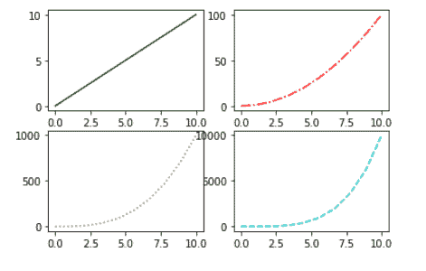

Matplotlib subplot

阅读: [Matplotlib 绘图条形图](https://pythonguides.com/matplotlib-plot-bar-chart/)

## Matplotlib 子图图形尺寸

我们可以通过针对**matplotlib . py plot . figure()**函数中的 **figsize** 参数指定两个值的列表来调整 matplotlib 中包含子情节的图形的大小，其中第一个值指定图形的宽度，第二个值指定图形的高度。

现在，让我们实践这个概念:

```
# Import necessary libraries
import matplotlib.pyplot as plt
import numpy as np

#Change the figure size
plt.figure(figsize=[9, 7])

# Preparing the data to subplots
x = np.linspace(0, 10, 10)
y1 = x
y2 = x ** 2
y3 = x ** 3
y4 = x ** 4

# Plot the subplots
# Plot 1
plt.subplot(2, 2, 1)
plt.plot(x, y1, 'g', linewidth=2)

# Plot 2
plt.subplot(2, 2, 2)
plt.scatter(x, y2, color='k')

# Plot 3
plt.subplot(2, 2, 3)
plt.plot(x, y3, '-.y', linewidth=3)

# Plot 4
plt.subplot(2, 2, 4)
plt.plot(x, y4, '--b', linewidth=3)

plt.show()
```

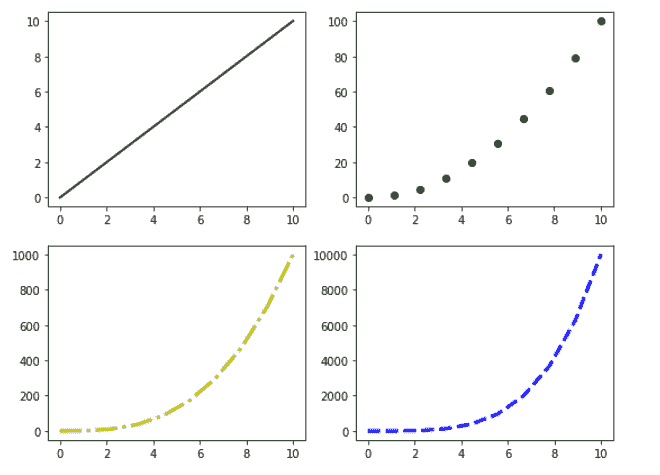

Matplotlib subplot figure size

我们调整了人物的大小，因此支线剧情的布局变得更好。

阅读:[什么是 matplotlib 内联](https://pythonguides.com/what-is-matplotlib-inline/)

## Matplotlib 子情节标题总体

我们可以通过在**matplotlib . py plot . sup title()**函数中指定标题文本，为 matplotlib 中包含子情节的图形指定一个标题。

让我们通过一个例子来看看这是怎么做到的:

```
# Import necessary libraries
import matplotlib.pyplot as plt
import numpy as np

#Change the figure size
plt.figure(figsize=[11, 9])

# Preparing the data to subplots
x = np.linspace(0, 10, 10)
y1 = x
y2 = x ** 2
y3 = x ** 3
y4 = x ** 4

plt.suptitle('Different degree curves')

# Plot the subplots
# Plot 1
plt.subplot(2, 2, 1)
plt.plot(x, y1, 'g', linewidth=2)

# Plot 2
plt.subplot(2, 2, 2)
plt.scatter(x, y2, color='k')

# Plot 3
plt.subplot(2, 2, 3)
plt.plot(x, y3, '-.y', linewidth=3)

# Plot 4
plt.subplot(2, 2, 4)
plt.plot(x, y4, '--b', linewidth=3)

plt.show()
```

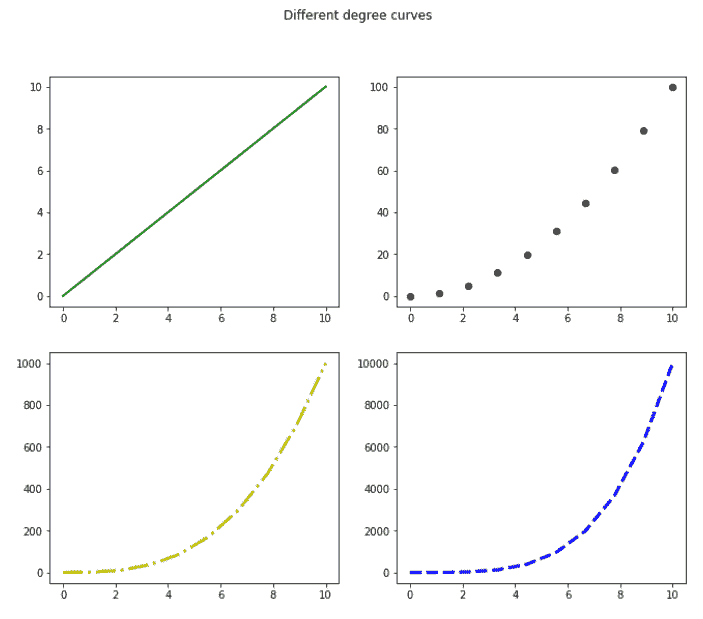

Matplotlib subplot title overall

## 每个情节的 Matplotlib 子情节标题

我们还可以通过在**matplotlib . py plot . title()**函数中用每个子情节命令单独指定标题文本，为 matplotlib 中的每个子情节指定标题。

让我们通过一个例子来练习一下:

```
# Import necessary libraries
import matplotlib.pyplot as plt
import numpy as np

#Change the figure size
plt.figure(figsize=[11, 9])

# Preparing the data to subplots
x = np.linspace(0, 10, 10)
y1 = x
y2 = x ** 2
y3 = x ** 3
y4 = x ** 4

plt.suptitle('Different degree curves')

# Plot the subplots
# Plot 1
plt.subplot(2, 2, 1)
plt.plot(x, y1, 'g', linewidth=2)
plt.title('Plot 1: 1st Degree curve')

# Plot 2
plt.subplot(2, 2, 2)
plt.scatter(x, y2, color='k')
plt.title('Plot 2: 2nd Degree curve')

# Plot 3
plt.subplot(2, 2, 3)
plt.plot(x, y3, '-.y', linewidth=3)
plt.title('Plot 3: 3rd Degree curve')

# Plot 4
plt.subplot(2, 2, 4)
plt.plot(x, y4, '--b', linewidth=3)
plt.title('Plot 4: 4th Degree curve')

plt.show()
```

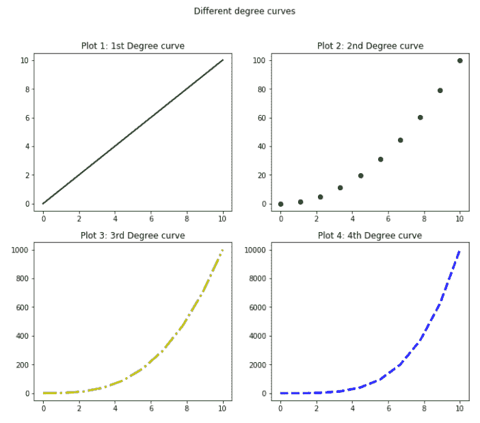

Matplotlib subplot title for each plot

阅读: [Python 使用 Matplotlib 绘制多条线](https://pythonguides.com/python-plot-multiple-lines/)

## Matplotlib 子图标题字体大小

我们可以通过在**matplotlib . py plot . sup title()**或/和**matplotlib . py plot . title()**函数中添加一个参数 **fontsize** 来指定 matplotlib 中标题文本(图标题和子图标题)的字体大小。

让我们来练习一个例子:

```
# Import necessary libraries
import matplotlib.pyplot as plt
import numpy as np

#Change the figure size
plt.figure(figsize=[11, 9])

# Preparing the data to subplots
x = np.linspace(0, 10, 10)
y1 = x
y2 = x ** 2
y3 = x ** 3
y4 = x ** 4

plt.suptitle('Different degree curves', fontsize=19)

# Plot the subplots
# Plot 1
plt.subplot(2, 2, 1)
plt.plot(x, y1, 'g', linewidth=2)
plt.title('Plot 1: 1st Degree curve', fontsize=15)

# Plot 2
plt.subplot(2, 2, 2)
plt.scatter(x, y2, color='k')
plt.title('Plot 2: 2nd Degree curve', fontsize=15)

# Plot 3
plt.subplot(2, 2, 3)
plt.plot(x, y3, '-.y', linewidth=3)
plt.title('Plot 3: 3rd Degree curve', fontsize=15)

# Plot 4
plt.subplot(2, 2, 4)
plt.plot(x, y4, '--b', linewidth=3)
plt.title('Plot 4: 4th Degree curve', fontsize=15)

plt.show()
```

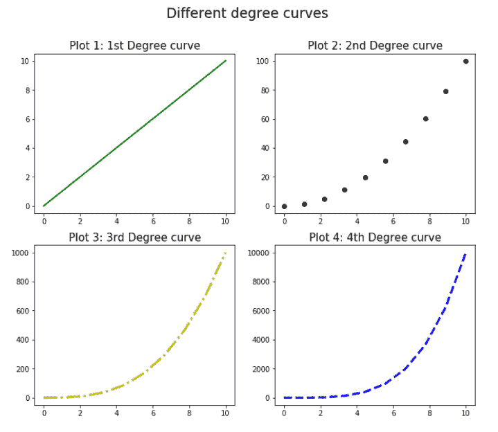

Matplotlib subplot title font size

我们调整了人物标题和支线剧情的字体大小。

阅读: [Matplotlib 绘制一条线](https://pythonguides.com/matplotlib-plot-a-line/)

## Matplotlib 子情节标题加粗

我们可以通过在**matplotlib . py plot . sup title()**或/和**matplotlib . py plot . title()**函数中添加一个参数 **fontweight** 和必要的整数值(粗体字体为 600+)或字符串‘bold ’,使标题文本在 matplotlib 中的字体为粗体(对于图标题和子图标题)。

**举例:**

```
# Import necessary libraries
import matplotlib.pyplot as plt
import numpy as np

#Change the figure size
plt.figure(figsize=[11, 9])

# Preparing the data to subplots
x = np.linspace(0, 10, 10)
y1 = x
y2 = x ** 2
y3 = x ** 3
y4 = x ** 4

plt.suptitle('Different degree curves', fontsize=19, fontweight='bold')

# Plot the subplots
# Plot 1
plt.subplot(2, 2, 1)
plt.plot(x, y1, 'g', linewidth=2)
plt.title('Plot 1: 1st Degree curve', fontsize=15)

# Plot 2
plt.subplot(2, 2, 2)
plt.scatter(x, y2, color='k')
plt.title('Plot 2: 2nd Degree curve', fontsize=15)

# Plot 3
plt.subplot(2, 2, 3)
plt.plot(x, y3, '-.y', linewidth=3)
plt.title('Plot 3: 3rd Degree curve', fontsize=15)

# Plot 4
plt.subplot(2, 2, 4)
plt.plot(x, y4, '--b', linewidth=3)
plt.title('Plot 4: 4th Degree curve', fontsize=15)

plt.show()
```

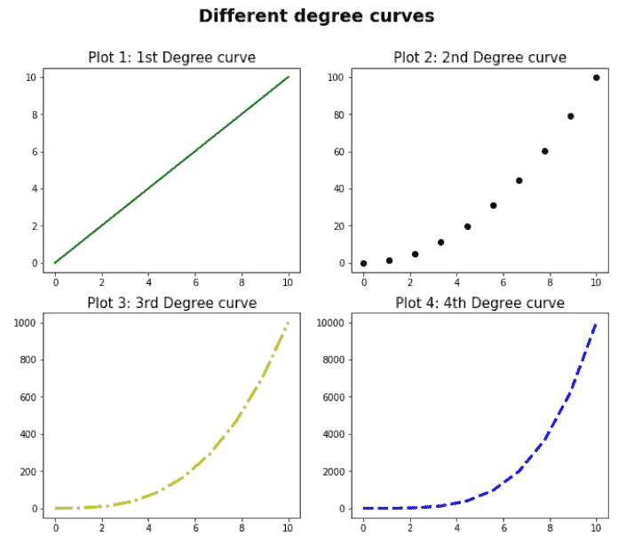

Matplotlib subplot title bold

我们已经改变了字体的粗细，使标题文本为粗体。

Read: [modulenotfounderror:没有名为“matplotlib”的模块](https://pythonguides.com/no-module-named-matplotlib/)

## Matplotlib 子情节标题位置

我们可以通过在**matplotlib . py plot . sup title()**函数中再增加两个参数 x 和 y 来指定图的标题文本的位置。x 和 y 参数的值分别表示图形坐标中的 x 和 y 坐标。

让我们看看如何实现这个概念:

```
# Import necessary libraries
import matplotlib.pyplot as plt
import numpy as np

#Change the figure size
plt.figure(figsize=[11, 9])

# Preparing the data to subplots
x = np.linspace(0, 10, 10)
y1 = x
y2 = x ** 2
y3 = x ** 3
y4 = x ** 4

plt.suptitle('Different degree curves', x=0.5, y=0, fontsize=17, fontweight='700')

## Plot the subplots
# Plot 1
plt.subplot(2, 2, 1)
plt.plot(x, y1, 'g', linewidth=2)
plt.title('Plot 1: 1st Degree curve', loc='left', fontsize=15)

# Plot 2
plt.subplot(2, 2, 2)
plt.scatter(x, y2, color='k')
plt.title('Plot 2: 2nd Degree curve', loc='right', fontsize=15)

# Plot 3
plt.subplot(2, 2, 3)
plt.plot(x, y3, '-.y', linewidth=3)
plt.title('Plot 3: 3rd Degree curve', loc='left', fontsize=15)

# Plot 4
plt.subplot(2, 2, 4)
plt.plot(x, y4, '--b', linewidth=3)
plt.title('Plot 4: 4th Degree curve', loc='right', fontsize=15)

plt.show()
```

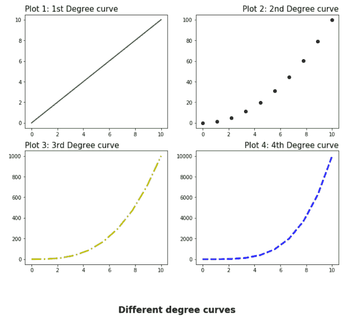

Matplotlib subplot title position

我们在图中设置了各种标题文本的不同位置。

阅读:[如何安装 matplotlib python](https://pythonguides.com/how-to-install-matplotlib-python/)

## Matplotlib 子情节标题填充

我们可以通过在**matplotlib . py plot . sup title()**函数中添加参数 y 来调整图的标题文本的填充，并且可以在**matplotlib . py plot . title()**函数中添加 y 或填充参数。y 参数的值表示图形坐标中的 y 坐标，填充的值表示图/子图中标题文本的间隙/填充。y 的值范围从 0 到 1。

让我们看一个例子来更好地理解这些概念:

```
# Import necessary libraries
import matplotlib.pyplot as plt
import numpy as np

#Change the figure size
plt.figure(figsize=[11, 9])

# Preparing the data to subplots
x = np.linspace(0, 10, 10)
y1 = x
y2 = x ** 2
y3 = x ** 3
y4 = x ** 4

plt.suptitle('Different degree curves', y=1.1, fontsize=19, fontweight='bold')

# Plot the subplots
# Plot 1
plt.subplot(2, 2, 1)
plt.plot(x, y1, 'g', linewidth=2)
plt.title('Plot 1: 1st Degree curve', fontsize=15, y=1.1)

# Plot 2
plt.subplot(2, 2, 2)
plt.scatter(x, y2, color='k')
plt.title('Plot 2: 2nd Degree curve', fontsize=15, y=1.1)

# Plot 3
plt.subplot(2, 2, 3)
plt.plot(x, y3, '-.y', linewidth=3)
plt.title('Plot 3: 3rd Degree curve', fontsize=15, pad=17)

# Plot 4
plt.subplot(2, 2, 4)
plt.plot(x, y4, '--b', linewidth=3)
plt.title('Plot 4: 4th Degree curve', fontsize=15, pad=17)

plt.show()
```

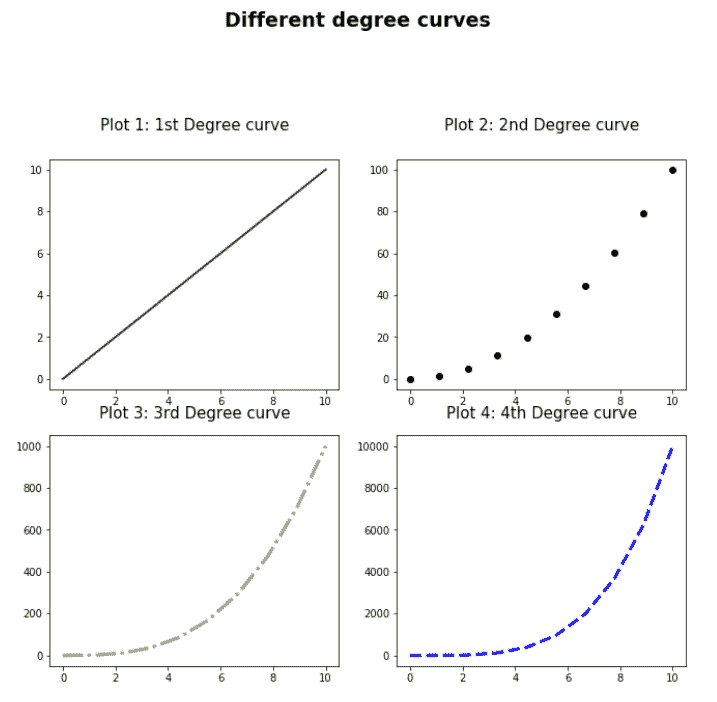

Matplotlib subplot title padding

我们调整了人物和支线剧情标题文字的填充。

## Matplotlib 子情节图例

我们可以通过为每个子情节添加**matplotlib . py plot . legend()**函数来为 matplotlib 中的每个子情节添加图例。

让我们通过一个例子来看看实现:

```
# Import necessary libraries
import matplotlib.pyplot as plt
import numpy as np

#Change the figure size
plt.figure(figsize=[11, 9])

# Preparing the data to subplots
x = np.linspace(0, 10, 10)
y1 = x
y2 = x ** 2
y3 = x ** 3
y4 = x ** 4

plt.suptitle('Different degree curves', fontsize=19, fontweight='bold')

# Plot the subplots
# Plot 1
plt.subplot(2, 2, 1)
plt.plot(x, y1, 'g', linewidth=2, label='1st degree curve')
plt.title('Plot 1', fontsize=15)
plt.legend(loc='upper left')

# Plot 2
plt.subplot(2, 2, 2)
plt.scatter(x, y2, color='k', label='2nd degree curve')
plt.title('Plot 2', fontsize=15)
plt.legend(loc='upper left')

# Plot 3
plt.subplot(2, 2, 3)
plt.plot(x, y3, '-.y', linewidth=3, label='3rd degree curve')
plt.title('Plot 3', fontsize=15)
plt.legend(loc='upper left')

# Plot 4
plt.subplot(2, 2, 4)
plt.plot(x, y4, '--b', linewidth=3, label='4th degree curve')
plt.title('Plot 4', fontsize=15)
plt.legend(loc='upper left')

plt.show()
```

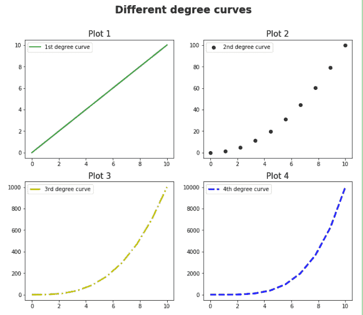

Matplotlib subplot legend

我们还可以在 matplotlib 中添加一个与图中所有支线剧情共享的图例。我们必须通过使用**matplotlib . py plot . subplots()**函数定义轴和图形来绘制图形，并使用具有以下参数的 **figure.legend()** 为图形定义全局图例:

*   我们要添加到图例中的所有 plot (line2D)对象(此处为曲线)的列表。
*   标签:每个地块(曲线)对象的标签列表。
*   loc:图例的位置(可选)
*   标题:图例的标题(可选)

让我们通过一个例子来练习:

```
# Import necessary libraries
import matplotlib.pyplot as plt
import numpy as np

# Defining figure and axes objects using matplotlib.pyplot.subplots()
fig, ax = plt.subplots(2, 2, figsize=[11, 9])

# Preparing the data to subplots
x = np.linspace(0, 10, 10)
y1 = x
y2 = x ** 2
y3 = x ** 3
y4 = x ** 4

fig.suptitle('Different degree curves', fontsize=19, fontweight='bold')

# Plot the subplots
# Plot 1
c1 = ax[0,0].plot(x, y1, 'g', linewidth=2)
ax[0,0].set_title('Plot 1', fontsize=15)

# Plot 2
c2 = ax[0,1].scatter(x, y2, color='k')
ax[0,1].set_title('Plot 2', fontsize=15)

# Plot 3
c3 = ax[1,0].plot(x, y3, '-.y', linewidth=3)
ax[1,0].set_title('Plot 3', fontsize=15)

# Plot 4
c4 = ax[1,1].plot(x, y4, '--b', linewidth=3)
ax[1,1].set_title('Plot 4', fontsize=15)

label_list = ['1st degree curve', '2nd degree curve', '3rd degree curve', '4th degree curve']

fig.legend([c1, c2, c3, c4],
           labels=label_list,
           loc='upper left',
           borderaxespad=0.1)

plt.show()
```

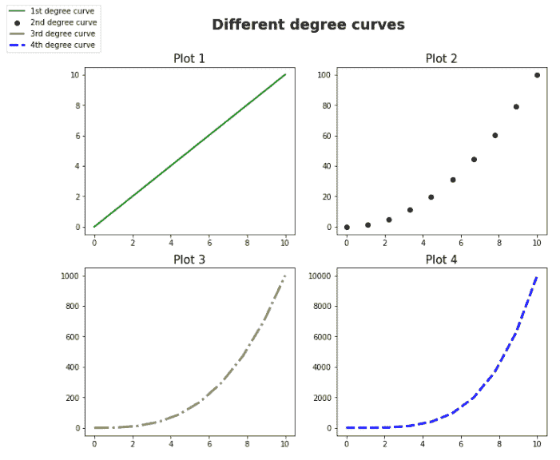

Matplotlib subplot shared legend

我们创造了一个由这个人物的所有支线剧情共享的普通传说。

## Matplotlib 子图共享轴

我们可以创建一个图形，其中一个或两个轴在 matplotlib 中的子情节之间共享。我们必须在**matplotlib . py plot . subplots()**函数中将 **sharex** 和 **sharey** 参数指定为 True。对于子情节，y 轴不能垂直共享，x 轴不能水平共享。共享坐标轴导致子情节的共同 xticks 和 yticks。

让我们来看看这个概念的实现:

```
# Import necessary libraries
import matplotlib.pyplot as plt
import numpy as np

# Preparing the data to subplots
x = np.linspace(0, 10, 10)
y1 = x + 3
y2 = x + 9
y3 = x + 13
y4 = x + 17

# Defining figure and axes objects using matplotlib.pyplot.subplots()
fig, ax = plt.subplots(2, 2, figsize=[11, 9])

fig.suptitle('Different degree curves', fontsize=19, fontweight='bold')

# Plot the subplots
# Plot 1
ax[0,0].plot(x, y1, 'g', linewidth=2)
ax[0,0].set_title('Plot 1: 1st degree curve', fontsize=15)

# Plot 2
ax[0,1].scatter(x, y2, color='k')
ax[0,1].set_title('Plot 2: 2nd degree curve', fontsize=15)

# Plot 3
ax[1,0].plot(x, y3, '-.y', linewidth=3)
ax[1,0].set_title('Plot 3: 3rd degree curve', fontsize=15)

# Plot 4
ax[1,1].plot(x, y4, '--b', linewidth=3)
ax[1,1].set_title('Plot 4: 4th degree curve', fontsize=15)

plt.show()

# ---------------------------------------------------------------------

# Defining figure and axes objects using matplotlib.pyplot.subplots()
fig, ax = plt.subplots(2, 2, sharex=True, sharey=True, figsize=[11, 9])

fig.suptitle('Different degree curves', fontsize=19, fontweight='bold')

# Plot the subplots
# Plot 1
ax[0,0].plot(x, y1, 'g', linewidth=2)
ax[0,0].set_title('Plot 1: 1st degree curve', fontsize=15)

# Plot 2
ax[0,1].scatter(x, y2, color='k')
ax[0,1].set_title('Plot 2: 2nd degree curve', fontsize=15)

# Plot 3
ax[1,0].plot(x, y3, '-.y', linewidth=3)
ax[1,0].set_title('Plot 3: 3rd degree curve', fontsize=15)

# Plot 4
ax[1,1].plot(x, y4, '--b', linewidth=3)
ax[1,1].set_title('Plot 4: 4th degree curve', fontsize=15)

plt.show()
```

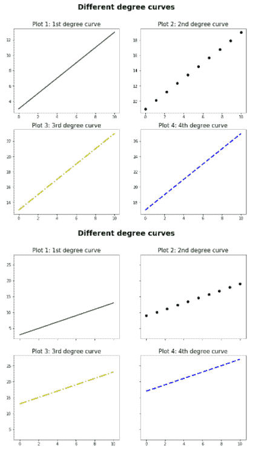

Matplotlib subplot share axis

我们已经创建了两个图形，一个具有不共享的轴，另一个具有共享的 x 轴和 y 轴。

## Matplotlib 子图共享轴标签

在 matplotlib 中，没有直接的方法将公共轴标签添加到图形中，但我们可以通过一个技巧来实现。

*   首先，我们将创建一个有支线剧情的人物。
*   然后，我们将使用 **figure.add_subplot()** 函数添加一个图形大小的轴来封装所有的支线剧情。
*   然后我们将禁用这个新图的刻度和刻度标签，只显示轴标签。我们可以通过在**matplotlib . py plot . tick _ param()**函数中指定参数 labelcolor="none "，bottom=False，left=False 来实现。
*   现在，我们可以将 x 轴和 y 轴标签添加到这个更大的图中。

让我们实现上面的技巧来更好地理解它:

```
# Import necessary libraries
import matplotlib.pyplot as plt
import numpy as np

# Preparing the data to subplots
x = np.linspace(0, 10, 10)
y1 = x + 3
y2 = x + 9
y3 = x + 13
y4 = x + 17

# Defining figure and axes objects using matplotlib.pyplot.subplots()
fig, ax = plt.subplots(2, 2, figsize=[11, 9])

fig.suptitle('Different degree curves', fontsize=19, fontweight='bold')

# Plot the subplots
# Plot 1
ax[0,0].plot(x, y1, 'g', linewidth=2)
ax[0,0].set_title('Plot 1: 1st degree curve', fontsize=15)

# Plot 2
ax[0,1].scatter(x, y2, color='k')
ax[0,1].set_title('Plot 2: 2nd degree curve', fontsize=15)

# Plot 3
ax[1,0].plot(x, y3, '-.y', linewidth=3)
ax[1,0].set_title('Plot 3: 3rd degree curve', fontsize=15)

# Plot 4
ax[1,1].plot(x, y4, '--b', linewidth=3)
ax[1,1].set_title('Plot 4: 4th degree curve', fontsize=15)

# Adding a plot in the figure which will encapsulate all the subplots with axis showing only
fig.add_subplot(1, 1, 1, frame_on=False)

# Hiding the axis ticks and tick labels of the bigger plot
plt.tick_params(labelcolor="none", bottom=False, left=False)

# Adding the x-axis and y-axis labels for the bigger plot
plt.xlabel('Common X-Axis', fontsize=15, fontweight='bold')
plt.ylabel('Common Y-Axis', fontsize=15, fontweight='bold')

plt.show()
```

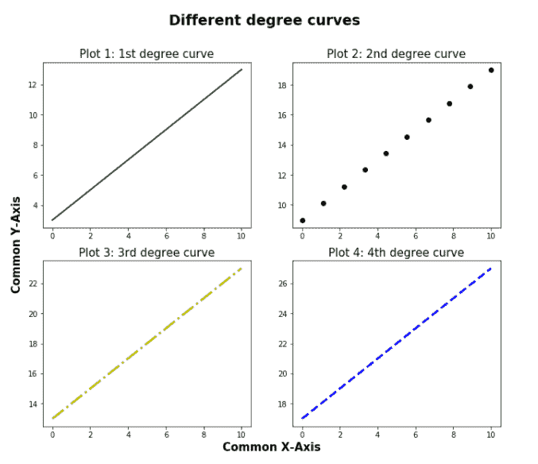

Matplotlib subplot share axis labels

我们还可以创建一个图形，在 matplotlib 子绘图的共享轴上有共享轴标签。

```
# Preparing the data to subplots
x = np.linspace(0, 10, 10)
y1 = x + 3
y2 = x + 9
y3 = x + 13
y4 = x + 17

# Defining figure and axes objects using matplotlib.pyplot.subplots(),
# specifying the sharing of x-axis and y-axis to the subplots
fig, ax = plt.subplots(2, 2, sharex=True, sharey=True, figsize=[11, 9])

fig.suptitle('Different degree curves', fontsize=19, fontweight='bold')

# Plot the subplots
# Plot 1
ax[0,0].plot(x, y1, 'g', linewidth=2)
ax[0,0].set_title('Plot 1: 1st degree curve', fontsize=15)

# Plot 2
ax[0,1].scatter(x, y2, color='k')
ax[0,1].set_title('Plot 2: 2nd degree curve', fontsize=15)

# Plot 3
ax[1,0].plot(x, y3, '-.y', linewidth=3)
ax[1,0].set_title('Plot 3: 3rd degree curve', fontsize=15)

# Plot 4
ax[1,1].plot(x, y4, '--b', linewidth=3)
ax[1,1].set_title('Plot 4: 4th degree curve', fontsize=15)

# Adding a plot in the figure which will encapsulate all the subplots with axis showing only
fig.add_subplot(1, 1, 1, frame_on=False)

# Hiding the axis ticks and tick labels of the bigger plot
plt.tick_params(labelcolor="none", bottom=False, left=False)

# Adding the x-axis and y-axis labels for the bigger plot
plt.xlabel('X-Axis', fontsize=15, fontweight='bold')
plt.ylabel('Y-Axis', fontsize=15, fontweight='bold')

plt.show()
```

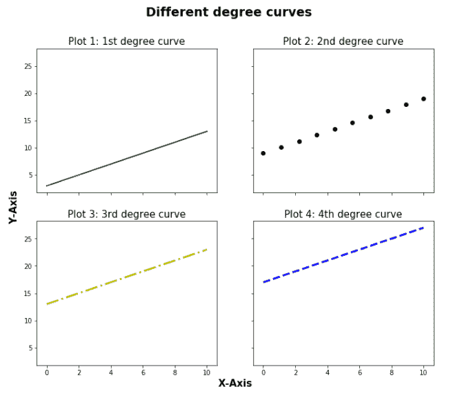

Matplotlib subplot axis labels to shared axis

我们已经创建了一个图形，其中包含四个具有共享轴和轴标签的子图形。

## Matplotlib 图之间的子图间距

我们可以通过添加一个带有相关参数值的函数**matplotlib . py plot . subplots _ adjust()**来调整 matplotlib 中一个图形的子图间距。以下参数可以根据需要指定:

*   **top** :指定人物支线剧情的顶部(上部)。
*   **底部**:指定人物支线剧情的底部(下部)。
*   **左侧**:指定人物支线剧情的左侧。
*   **右侧**:指定人物支线剧情的右侧。
*   **wspace** :指定子情节之间要预留的空白空间的宽度。
*   **hspace** :指定子情节之间留白的高度。

让我们试试上面方法的实现:

```
# Change the figure size
plt.figure(figsize=[11, 9])

# Preparing the data to subplots
x = np.linspace(0, 10, 10)
y1 = x
y2 = x ** 2
y3 = x ** 3
y4 = x ** 4

plt.suptitle('Different degree curves', y=1.13, fontsize=19, fontweight='bold')

plt.subplots_adjust(left=0.13, right=0.93, top=1.0, bottom= 0.27, wspace= 0.3, hspace=0.3)

# Plot the subplots
# Plot 1
plt.subplot(2, 2, 1)
plt.plot(x, y1, 'g', linewidth=2)
plt.title('Plot 1: 1st Degree curve', fontsize=15, y=1.1)
plt.xlabel('X-Axis')
plt.ylabel('Y-Axis')

# Plot 2
plt.subplot(2, 2, 2)
plt.scatter(x, y2, color='k')
plt.title('Plot 2: 2nd Degree curve', fontsize=15, y=1.1)
plt.xlabel('X-Axis')
plt.ylabel('Y-Axis')

# Plot 3
plt.subplot(2, 2, 3)
plt.plot(x, y3, '-.y', linewidth=3)
plt.title('Plot 3: 3rd Degree curve', fontsize=15, pad=17)
plt.xlabel('X-Axis')
plt.ylabel('Y-Axis')

# Plot 4
plt.subplot(2, 2, 4)
plt.plot(x, y4, '--b', linewidth=3)
plt.title('Plot 4: 4th Degree curve', fontsize=15, pad=17)
plt.xlabel('X-Axis')
plt.ylabel('Y-Axis')

plt.show()
```

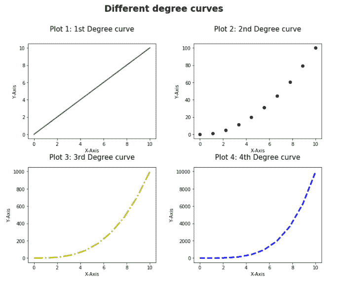

Matplotlib subplot spacing between plots

我们在一个人物的支线剧情之间增加了空间。

## Matplotlib 子图间距自动

matplotlib 中有一种方法可以根据图形自动调整一个图形的支线剧情间距。我们只需要添加一个函数**matplotlib . py plot . tight _ layout()**。

我们还可以通过在**matplotlib . py plot . tight _ layout()**函数中指定参数 **pad** 、 **w_pad** 、 **h_pad** 来给予额外的填充。这些参数控制人物边界周围和支线剧情之间的额外填充。它们的参数值是根据字体大小的分数来指定的。

让我们通过一个例子来实现这个功能:

```
# Import necessary libraries
import matplotlib.pyplot as plt
import numpy as np

# Preparing the data to subplots
x = np.linspace(0, 10, 10)
y1 = x
y2 = x ** 2
y3 = x ** 3
y4 = x ** 4

plt.suptitle('Different degree curves', y=1.13, fontsize=19, fontweight='bold')

# Plot the subplots
# Plot 1
plt.subplot(2, 2, 1)
plt.plot(x, y1, 'g', linewidth=2)
plt.title('Plot 1: 1st Degree curve', fontsize=15, y=1.1)

# Plot 2
plt.subplot(2, 2, 2)
plt.scatter(x, y2, color='k')
plt.title('Plot 2: 2nd Degree curve', fontsize=15, y=1.1)

# Plot 3
plt.subplot(2, 2, 3)
plt.plot(x, y3, '-.y', linewidth=3)
plt.title('Plot 3: 3rd Degree curve', fontsize=15, pad=17)

# Plot 4
plt.subplot(2, 2, 4)
plt.plot(x, y4, '--b', linewidth=3)
plt.title('Plot 4: 4th Degree curve', fontsize=15, pad=17)

plt.show()

# ---------------------------------------------------------------------

# Plotting the subplots with auto adjust layout using matplotlib.pyplot.tight_layout()

plt.suptitle('Different degree curves', y=1.13, fontsize=19, fontweight='bold')

# Plot the subplots
# Plot 1
plt.subplot(2, 2, 1)
plt.plot(x, y1, 'g', linewidth=2)
plt.title('Plot 1: 1st Degree curve', fontsize=15, y=1.1)

# Plot 2
plt.subplot(2, 2, 2)
plt.scatter(x, y2, color='k')
plt.title('Plot 2: 2nd Degree curve', fontsize=15, y=1.1)

# Plot 3
plt.subplot(2, 2, 3)
plt.plot(x, y3, '-.y', linewidth=3)
plt.title('Plot 3: 3rd Degree curve', fontsize=15, pad=17)

# Plot 4
plt.subplot(2, 2, 4)
plt.plot(x, y4, '--b', linewidth=3)
plt.title('Plot 4: 4th Degree curve', fontsize=15, pad=17)

plt.tight_layout()
plt.show()
```

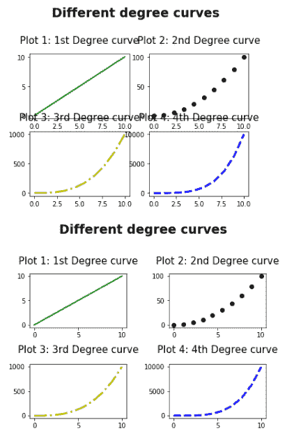

Matplotlib subplot spacing automatic

我们已经创建了两个图形，一个不包含 tight_layout()函数，另一个包含它。

读取 [Matplotlib 两个 y 轴](https://pythonguides.com/matplotlib-two-y-axes/)

## 不同大小的 Matplotlib 支线剧情

我们可以在 matplotlib 中用兼容的网格规范创建一个不同大小的子图形。我们可以这样做，把人物分成支线剧情和这些支线剧情的支线剧情等等。然后，只指定需要的支线剧情。

为了更好地理解，让我们看一下这个例子:

```
# Import necessary libraries
import matplotlib.pyplot as plt
import numpy as np

# Preparing the data to subplots
x = np.linspace(0, 10, 10)
y1 = x
y2 = x ** 2
y3 = x ** 3

# Change the figure size
plt.figure(figsize=[11, 9])

plt.suptitle('Different degree curves', y=1.05, fontsize=19, fontweight='bold')

# Plot the subplots
# Plot 1
plt.subplot(2, 2, 1)
plt.plot(x, y1, 'g', linewidth=2)
plt.title('Plot 1: 1st Degree curve', fontsize=15, pad=12)
plt.xlabel('X-Axis')
plt.ylabel('Y-Axis')

# Plot 2
plt.subplot(2, 2, 3)
plt.scatter(x, y2, color='k')
plt.title('Plot 2: 2nd Degree curve', fontsize=15, pad=12)
plt.xlabel('X-Axis')
plt.ylabel('Y-Axis')

# Plot 3
plt.subplot(1, 2, 2)
plt.plot(x, y3, '-.y', linewidth=3)
plt.title('Plot 3: 3rd Degree curve', fontsize=15, pad=12)
plt.xlabel('X-Axis')
plt.ylabel('Y-Axis')

plt.tight_layout()
plt.show()
```

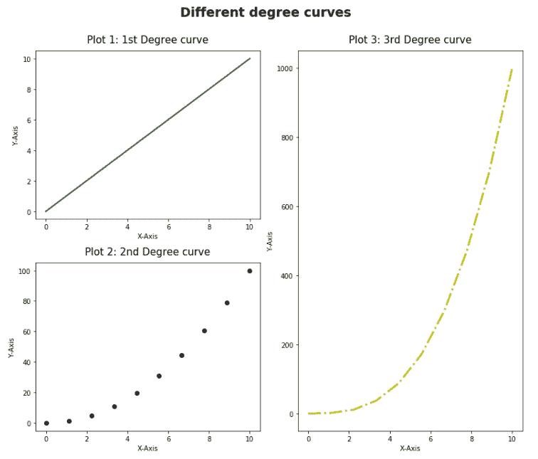

Matplotlib subplots different sizes

我们在一个图形中创建了 3 个不同大小的支线剧情。

```
# Import necessary libraries
import matplotlib.pyplot as plt
import numpy as np

# Preparing the data to subplots
x = np.linspace(0, 10, 10)
y1 = x
y2 = x ** 2
y3 = x ** 3
y4 = x ** 4

# Change the figure size
plt.figure(figsize=[11, 9])

plt.suptitle('Different degree curves', y=1.05, fontsize=19, fontweight='bold')

# Plot the subplots
# Plot 1
plt.subplot(3, 1, 1)
plt.plot(x, y1, 'g', linewidth=2)
plt.title('Plot 1: 1st Degree curve', fontsize=15, pad=12)
plt.xlabel('X-Axis')
plt.ylabel('Y-Axis')

# Plot 2
plt.subplot(3, 2, 3)
plt.scatter(x, y2, color='k')
plt.title('Plot 2: 2nd Degree curve', fontsize=15, pad=12)
plt.xlabel('X-Axis')
plt.ylabel('Y-Axis')

# Plot 3
plt.subplot(3, 2, 4)
plt.plot(x, y3, '-.y', linewidth=3)
plt.title('Plot 3: 3rd Degree curve', fontsize=15, pad=12)
plt.xlabel('X-Axis')
plt.ylabel('Y-Axis')

# Plot 4
plt.subplot(3, 1, 3)
plt.plot(x, y4, ':r', linewidth=2)
plt.title('Plot 4: 4th Degree curve', fontsize=15, pad=12)
plt.xlabel('X-Axis')
plt.ylabel('Y-Axis')

plt.tight_layout()
plt.show()
```

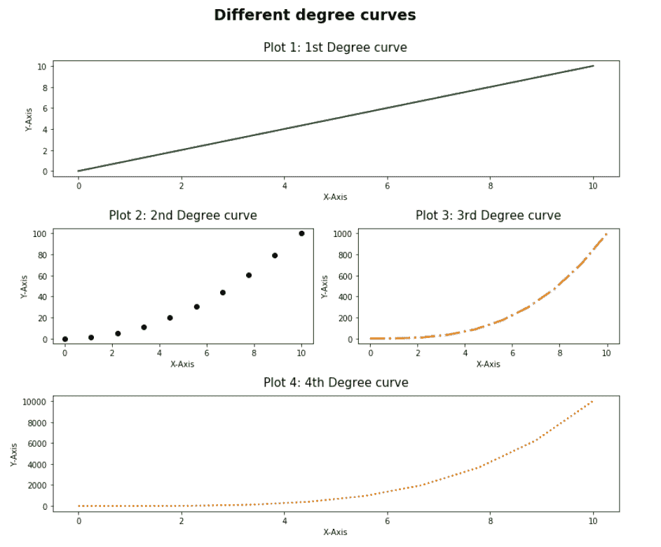

Matplotlib subplots different sized grids

读取[堆积条形图 Matplotlib](https://pythonguides.com/stacked-bar-chart-matplotlib/)

## matplot lib subplot grid spec

我们可以使用 matplotlib 中的 **gridspec** 函数定制图形布局。我们可以通过使用 **gridspec** 函数来指定放置支线剧情的图形网格的几何形状。

我们必须指定图形网格的行数和列数。我们也可以调整支线剧情的布局参数，如左，右，底部等。

使用 gridspec 函数的语法如下:

```
from matplotlib import pyplot as plt
from matplotlib import gridspec

fig = plt.figure()

grid_obj = gridspec.GridSpec(nrows, ncols[, figure, left, bottom, right, top, wspace, hspace, ...])

ax1 = fig.add_subplot(grid_obj[0, 0])
ax2 = fig.add_subplot(grid_obj[0, 1])
...
...
...
axN = fig.add_subplot(grid_obj[nrows-1, ncols-1])
```

在上面的语法中，

*   gridspec。GridSpec() 是用于创建图中的 *nrows* 行和 *ncols* 列的网格的函数。以下参数提供对不同布局参数的控制:
    *   *nrows* 指定网格中的行数。
    *   *ncols* 指定网格中 rcolumns 的数量。
    *   *图*指定要放置网格的图形。它是可选的，默认情况下没有。
    *   *左*、*下*、*右*和*上*是可选参数，将支线剧情的范围定义为图形宽度和高度的分数。注意- *左侧*不能大于*右侧*且*底部*不能大于*顶部*。
    *   *wspace* 和 *hspace* 是可选参数，定义为子情节之间的空间保留的宽度和高度，分别表示为平均轴宽度和高度的分数。
*   ***grid_obj*** 是 **gridspec 返回的网格对象。GridSpec()** 函数。
*   在创建了 *grid_obj* 网格对象后，将支线剧情添加到用 grid_obj 指定的支线剧情网格中。

让我们做一些实践例子，使用 **gridspec()** 函数创建网格:

```
# Import necessary libraries
import matplotlib.pyplot as plt
import numpy as np

# Preparing the data to subplots
x = np.linspace(0, 10, 10)
y1 = x + 3
y2 = x ** 2
y3 = x ** 3
y4 = x ** 4

fig = plt.figure(constrained_layout=True)
spec = gridspec.GridSpec(ncols=2, nrows=2, figure=fig)

# Plot 1
ax1 = fig.add_subplot(spec[0, 0])
ax1.plot(x, y1, 'g', linewidth=2)
ax1.set_title('Plot 1: 1st degree curve', fontsize=15)

# Plot 2
ax2 = fig.add_subplot(spec[0, 1])
ax2.scatter(x, y2, color='k')
ax2.set_title('Plot 2: 2nd degree curve', fontsize=15)

# Plot 3
ax3 = fig.add_subplot(spec[1, 0])
ax3.plot(x, y3, '-.y', linewidth=3)
ax3.set_title('Plot 3: 3rd degree curve', fontsize=15)

# Plot 4
ax4 = fig.add_subplot(spec[1, 1])
ax4.plot(x, y4, '--b', linewidth=3)
ax4.set_title('Plot 4: 4th degree curve', fontsize=15)

plt.show()
```

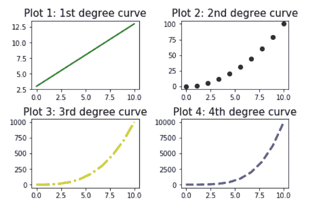

Matplotlib subplot gridspec

让我们用 gridspec()函数创建一个不同大小的子情节的例子:

```
# Preparing the data to subplots
x = np.linspace(0, 10, 10)
y = []
y.append(x + 3)
y.append(x ** 2)
y.append(x ** 3)
y.append(x ** 4)

l_style = ['-', ':', '-.', '--']
l_color = ['g', 'k', 'y', 'b']
k = 0

fig2 = plt.figure(figsize=[7, 5], constrained_layout=True)
widths = [1.5, 3]
heights = [2, 3]
spec2 = fig2.add_gridspec(ncols=2, nrows=2, width_ratios=widths,
                          height_ratios=heights)
for row in range(2):
    for col in range(2):
        ax = fig2.add_subplot(spec2[row, col])
        ax.plot(x, y[k], color=l_color[k], linestyle=l_style[k],
                linewidth=3)
        ax.set_title('Plot'+str(k+1)+' : '+str(k+1)+' degree curve',
                     fontsize=15)
        k += 1

plt.show()
```

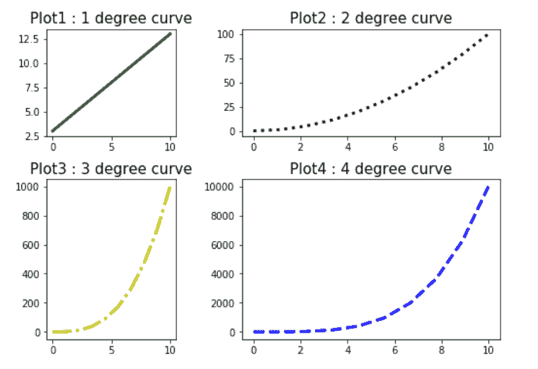

Matplotlib subplot gridspec different size subplots

## Matplotlib 子图网格线

我们可以通过为每个子情节添加 **matplotlib.pyplot.grid()** 函数，在 matplotlib 中的图形子情节中添加网格线。

让我们做一些练习示例:

```
# Import necessary libraries
import matplotlib.pyplot as plt
import numpy as np

 Preparing the data to subplots
x = np.linspace(0, 10, 10)
y1 = x
y2 = x ** 2
y3 = x ** 3

# Change the figure size
plt.figure(figsize=[11, 5])

plt.suptitle('Different degree curves', y=1.13, fontsize=19, fontweight='bold')

# Plot the subplots
# Plot 1
plt.subplot(1, 3, 1)
plt.plot(x, y1, 'g', linewidth=2)
plt.title('Plot 1: 1st Degree curve', fontsize=15, pad=17)
plt.xlabel('X-Axis')
plt.ylabel('Y-Axis')
plt.grid()

# Plot 2
plt.subplot(1, 3, 2)
plt.scatter(x, y2, color='k')
plt.title('Plot 2: 2nd Degree curve', fontsize=15, pad=17)
plt.xlabel('X-Axis')
plt.ylabel('Y-Axis')
plt.grid()

# Plot 3
plt.subplot(1, 3, 3)
plt.plot(x, y3, '-.y', linewidth=3)
plt.title('Plot 3: 3rd Degree curve', fontsize=15, pad=17)
plt.xlabel('X-Axis')
plt.ylabel('Y-Axis')
plt.grid()

plt.tight_layout()
plt.show()

# ---------------------------------------------------------------------

# Change the figure size
plt.figure(figsize=[11, 11])

plt.suptitle('Different degree curves', y=1.13, fontsize=19, fontweight='bold')

# Plot the subplots
# Plot 1
plt.subplot(3, 1, 1)
plt.plot(x, y1, 'g', linewidth=2)
plt.title('Plot 1: 1st Degree curve', fontsize=15, pad=17)
plt.xlabel('X-Axis')
plt.ylabel('Y-Axis')
plt.grid()

# Plot 2
plt.subplot(3, 1, 2)
plt.scatter(x, y2, color='k')
plt.title('Plot 2: 2nd Degree curve', fontsize=15, pad=17)
plt.xlabel('X-Axis')
plt.ylabel('Y-Axis')
plt.grid()

# Plot 3
plt.subplot(3, 1, 3)
plt.plot(x, y3, '-.y', linewidth=3)
plt.title('Plot 3: 3rd Degree curve', fontsize=15, pad=17)
plt.xlabel('X-Axis')
plt.ylabel('Y-Axis')
plt.grid()

plt.tight_layout()
plt.show()
```

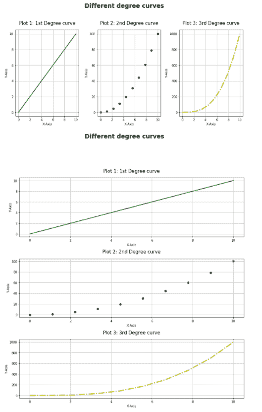

Matplotlib subplot grid lines

## Matplotlib 子图网格间距

我们可以通过增加图中子情节的 **xticks** 和 **yticks** 值来调整 matplotlib 中网格线之间的间距。我们可以分别使用 **xlim()** 和 **ylim()** 来改变一个剧情/子剧情的 **xticks** 和 **yticks** 范围。

让我们做一些例子来说明调整网格线间距的方法:

```
# Import necessary libraries
import matplotlib.pyplot as plt
import numpy as np

# Preparing the data to subplots
x = np.linspace(0, 10, 10)
y1 = x
y2 = x ** 2
y3 = x ** 3

# Changing the Matplotlib plot grid spacing by changing the spacing of
# the ticks

# Change the figure size
plt.figure(figsize=[11, 9])

plt.suptitle('Different degree curves', y=1.05, fontsize=19, fontweight='bold')

# Plot the subplots
# Plot 1
plt.subplot(2, 2, 1)
plt.plot(x, y1, 'g', linewidth=2)
plt.title('Plot 1: 1st Degree curve', fontsize=15, pad=12)
plt.xlabel('X-Axis')
plt.ylabel('Y-Axis')
plt.xlim(0, 12)
plt.ylim(0, 12)
plt.grid()

# Plot 2
plt.subplot(2, 2, 3)
plt.scatter(x, y2, color='k')
plt.title('Plot 2: 2nd Degree curve', fontsize=15, pad=12)
plt.xlabel('X-Axis')
plt.ylabel('Y-Axis')
plt.xlim(0, 15)
plt.ylim(0, 150)
plt.grid(alpha=0.8)

# Plot 3
plt.subplot(1, 2, 2)
plt.plot(x, y3, '-.y', linewidth=3)
plt.title('Plot 3: 3rd Degree curve', fontsize=15, pad=12)
plt.xlabel('X-Axis')
plt.ylabel('Y-Axis')
plt.xlim(0, 15)
plt.ylim(0, 1500)
plt.grid(alpha=0.6)

plt.tight_layout()
plt.show()
```

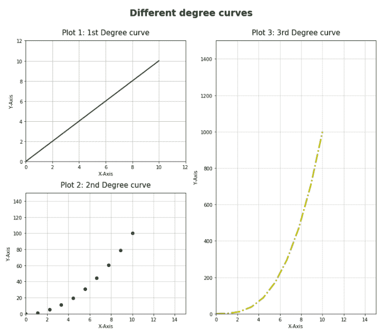

Matplotlib subplot grid spacing

## Matplotlib 子图网格颜色

我们可以通过在 **matplotlib.pyplot.grid()** 函数中添加参数 color，并将其值作为颜色名称、颜色代码或颜色十六进制代码，来更改和指定 matplotlib 中图形子图形的网格线颜色。

我们还可以根据需要在 **matplotlib.pyplot.grid()** 函数中添加生活方式、线宽等参数。

让我们做一个例子来练习:

```
# Import necessary libraries
import matplotlib.pyplot as plt
import numpy as np

# Preparing the data to subplots
x = np.linspace(0, 10, 10)
y1 = x
y2 = x ** 2
y3 = x ** 3

# Change the figure size
plt.figure(figsize=[11, 9])

plt.suptitle('Different degree curves', y=1.05, fontsize=19, fontweight='bold')

# Plot the subplots
# Plot 1
plt.subplot(2, 2, 1)
plt.plot(x, y1, 'g', linewidth=2)
plt.title('Plot 1: 1st Degree curve', fontsize=15, pad=12)
plt.xlabel('X-Axis', fontsize=13)
plt.ylabel('Y-Axis', fontsize=13)
plt.xlim(0, 12)
plt.ylim(0, 12)
plt.grid(color='red', linestyle='-.', linewidth=1)

# Plot 2
plt.subplot(2, 2, 3)
plt.scatter(x, y2, color='k')
plt.title('Plot 2: 2nd Degree curve', fontsize=15, pad=12)
plt.xlabel('X-Axis', fontsize=13)
plt.ylabel('Y-Axis', fontsize=13)
plt.xlim(0, 15)
plt.ylim(0, 150)
plt.grid(alpha=0.8, color='blue', linestyle=':', linewidth=1.2)

# Plot 3
plt.subplot(1, 2, 2)
plt.plot(x, y3, '-.y', linewidth=3)
plt.title('Plot 3: 3rd Degree curve', fontsize=15, pad=12)
plt.xlabel('X-Axis', fontsize=13)
plt.ylabel('Y-Axis', fontsize=13)
plt.xlim(0, 15)
plt.ylim(0, 1500)
plt.grid(alpha=0.6, color='green', linestyle='--', linewidth=1.4)

plt.tight_layout()
plt.show()
```

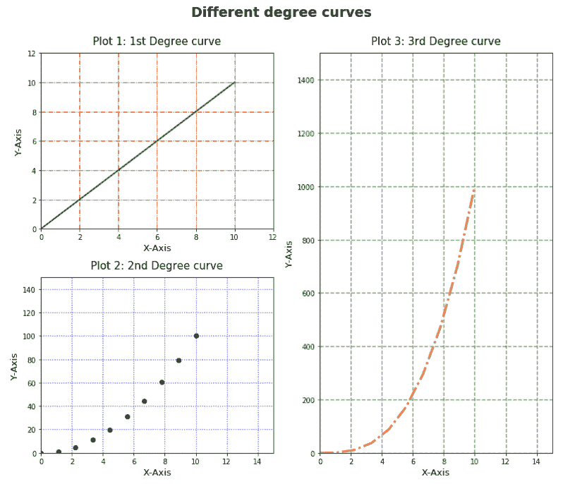

Matplotlib subplot grid color

## Matplotlib 子图图像

我们可以从本地系统导入并绘制图像，就像在 matplotlib 中绘制图形的子图一样。我们可以使用 **matplotlib.image** 子模块来导入、读取和显示 matplotlib 图形中的图像格式。

我们可以使用**matplotlib . image . im read()**函数导入和读取图像格式文件。必须指定一个参数，该参数指定包含图像文件在系统中的路径的字符串，后跟其名称。它将返回一个图像对象。

我们可以使用 **axes.imshow()** 函数在指定的轴上绘制图像对象。

为了更好地理解这一概念，我们来做一些动手实践示例:

```
# Import necessary libraries
import matplotlib.pyplot as plt

import matplotlib.image as img
import random
import os

cwd = os.getcwd()
source_path = cwd + '\\image_data\\'

fig, ax = plt.subplots(2,2)
plt.suptitle('Random Images', y=1.05, fontsize=19, fontweight='bold')

for i in range(2):
    for j in range(2):
        image_file = random.choice(os.listdir(source_path))
        image_path = os.path.join(source_path, image_file)
        image = img.imread(image_path)

        ax[i,j].set_title(image_file, fontsize=15, pad=12)
        ax[i,j].imshow(image)
        ax[i,j].grid()

plt.tight_layout()
plt.show()

# ------------------------------------------------------------------

plt.figure()
plt.suptitle('Random Images', y=1.05, fontsize=19, fontweight='bold')

for i in range(4):
    image_file = random.choice(os.listdir(source_path))
    image_path = os.path.join(source_path, image_file)
    image = img.imread(image_path)

    plt.subplot(2, 2, i+1)
    plt.title(image_file, fontsize=15, pad=12)
    plt.imshow(image)

plt.tight_layout()
plt.show()
```


Matplotlib subplot images

阅读: [Matplotlib 支线剧情 _adjust](https://pythonguides.com/matplotlib-subplots_adjust/)

## Matplotlib 子图图像尺寸

我们可以通过改变图形的大小来改变 matplotlib 中一个图形的子图中图像的大小。

我们可以使用带有参数 **figsize** 的函数**matplotlib . py plot . figure()**来更改图形的大小，该函数根据表示图形宽度和高度的两个值的列表来指定图形的大小。

**举例:**

```
# Import necessary libraries
import matplotlib.pyplot as plt

import matplotlib.image as img
import random
import os

cwd = os.getcwd()
source_path = cwd + '\\image_data\\'

plt.figure(figsize=[7, 7])
plt.suptitle('Random Images', y=1.05, fontsize=19, fontweight='bold')

for i in range(4):
    image_file = random.choice(os.listdir(source_path))
    image_path = os.path.join(source_path, image_file)
    image = img.imread(image_path)

    plt.subplot(2, 2, i+1)
    plt.title(image_file, fontsize=15, pad=12)
    plt.imshow(image)
    plt.grid()

plt.tight_layout()
plt.show()
```

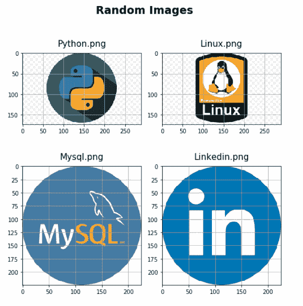

Matplotlib subplot image size

我们已经调整了图形的大小来调整支线剧情的大小。

阅读: [Matplotlib 最佳拟合线](https://pythonguides.com/matplotlib-best-fit-line/)

## Matplotlib 子图在如何着色

我们可以在 matplotlib 中为图中的所有子图图像创建一个公共的颜色条。

我们可以通过使用**matplotlib . figure . figure . add _ axes()**函数为颜色条添加单独的轴，该函数带有一个参数，将尺寸表示为 4 个值的列表[left、bottom、width、height]，并在该轴上绘制颜色条。

我们可以使用**matplotlib . figure . figure . colorbar()**函数来创建一个颜色条，并指定参数**mapable**和 **cax** ，前者表示要在颜色条中映射其颜色的绘图对象，后者表示要在其上绘制颜色条的轴。

让我们创建彩色的图像情节，并为图中的所有支线情节添加一个通用的颜色条:

```
# Import necessary libraries
import matplotlib.pyplot as plt
import numpy as np

fig, ax = plt.subplots(2, 2, figsize=[7, 7])

for x in ax.flat:
    image = x.imshow(np.random.random((15,15)), vmin=0, vmax=1)

fig.subplots_adjust(right=0.8)
color_bar_ax = fig.add_axes([0.85, 0.15, 0.05, 0.7])
fig.colorbar(image, cax=color_bar_ax)

plt.show()
```

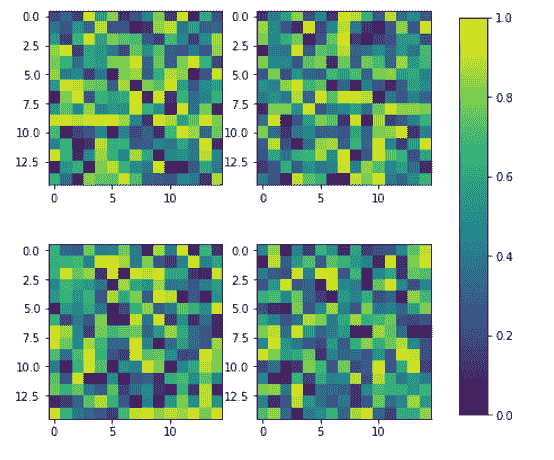

Matplotlib subplot imshow colorbar

阅读:[什么是 Matplotlib](https://pythonguides.com/what-is-matplotlib/)

## matplotlib 3d 子情节

我们可以在 matplotlib 中创建一个带有 3D 支线剧情的图形。我们可以使用**mpl _ toolkits . mplot 3d . axes 3d**子模块在 matplotlib 中创建 3D 轴并绘制 3D 形状。

我们可以通过使用 **figure.add_subplot()** 函数加上一个附加参数**投影**值为“3d”来添加轴。然后创建一个 3d 绘图，并将其添加到先前定义的具有 3D 投影的轴中。

我们可以分别执行上述方法，通过向图形添加更多具有 3D 形状的轴来创建多个子情节。

让我们创建一些 3D 图(这里是曲面图和线框)并将它们添加到图形中:

```
# Import necessary libraries
import matplotlib.pyplot as plt
import numpy as np

from matplotlib import cm                # for using the colormap
from mpl_toolkits.mplot3d.axes3d import get_test_data

fig = plt.figure(figsize=[9, 4])

plt.suptitle('3D plots', y=1.05, fontsize=19, fontweight='bold')

# Subplot 1
# set up the axes for the first plot
ax = fig.add_subplot(1, 2, 1, projection='3d')

# Plotting a 3D surface in first subplot
X = np.arange(-5, 5, 0.25)
Y = np.arange(-5, 5, 0.25)
X, Y = np.meshgrid(X, Y)

R = np.sqrt(X**2 + Y**2)
Z = np.sin(R)

surface_pl = ax.plot_surface(X, Y, Z, rstride=1, cstride=1,
                             cmap=cm.coolwarm, linewidth=0)
ax.set_zlim(-1.01, 1.01)

fig.colorbar(surface_plt, shrink=0.5, aspect=10)
ax.set_title('A 3D Surface')
ax.set_xlabel('X-Axis')
ax.set_ylabel('Y-Axis')
ax.set_zlabel('Z-Axis')

# Subplot 2
# set up the axes for the second plot
ax = fig.add_subplot(1, 2, 2, projection='3d')

# Plotting a 3D wireframe in second subplot
X, Y, Z = get_test_data(0.05)
ax.plot_wireframe(X, Y, Z, rstride=10, cstride=10)

ax.set_title('A 3D Wireframe')
ax.set_xlabel('X-Axis')
ax.set_ylabel('Y-Axis')
ax.set_zlabel('Z-Axis')

plt.tight_layout()
plt.show()
```

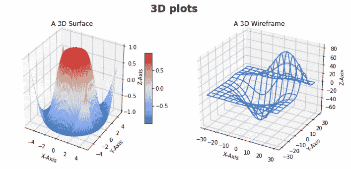

Matplotlib subplot 3D

我们已经创建了一个带有颜色条的曲面图和一个线框图，并将它们添加到一个图形中。

你可能也喜欢阅读下面的教程。

*   [Matplotlib 移除刻度标签](https://pythonguides.com/matplotlib-remove-tick-labels/)
*   [Matplotlib 旋转刻度标签](https://pythonguides.com/matplotlib-rotate-tick-labels/)
*   [Matplotlib 改变背景颜色](https://pythonguides.com/matplotlib-change-background-color/)

在本 python 教程中，我们讨论了 Python 中的 **matplotlib 子图**，它允许我们在一个图形中处理多个图，我们还讨论了以下主题:

*   Matplotlib 子图图形大小
*   Matplotlib 子图标题总体
*   每个情节的 Matplotlib 子情节标题
*   Matplotlib 子图标题字体大小
*   Matplotlib 子图标题粗体
*   Matplotlib 子图标题位置
*   Matplotlib 子图标题填充
*   Matplotlib 子图图例
*   Matplotlib 子图共享轴
*   Matplotlib 子图共享轴标签
*   绘图之间的 Matplotlib 子绘图间距
*   Matplotlib 子图间距自动
*   不同大小的 Matplotlib 子情节
*   Matplotlib 子图 gridspec
*   Matplotlib 子图网格线
*   Matplotlib 子图网格间距
*   Matplotlib 子图网格颜色
*   Matplotlib 子图图像
*   Matplotlib 子图图像大小
*   matplotlib im how colorbar 子打印
*   matplotlib 子出图

[Bijay Kumar](https://pythonguides.com/author/fewlines4biju/)

Python 是美国最流行的语言之一。我从事 Python 工作已经有很长时间了，我在与 Tkinter、Pandas、NumPy、Turtle、Django、Matplotlib、Tensorflow、Scipy、Scikit-Learn 等各种库合作方面拥有专业知识。我有与美国、加拿大、英国、澳大利亚、新西兰等国家的各种客户合作的经验。查看我的个人资料。

[enjoysharepoint.com/](https://enjoysharepoint.com/)[](https://www.facebook.com/fewlines4biju "Facebook")[](https://www.linkedin.com/in/fewlines4biju/ "Linkedin")[](https://twitter.com/fewlines4biju "Twitter")