# Matplotlib 虚线–完整教程

> 原文：<https://pythonguides.com/matplotlib-dashed-line/>

[](https://sharepointsky.teachable.com/p/python-and-machine-learning-training-course)

在本 python 教程中，我们将讨论 Python 中的 **Matplotlib 虚线**以虚线样式绘制图形，我们还将涵盖以下主题:

*   Matplotlib 虚线
*   Matplotlib 虚线如何绘图
*   Matplotlib 虚线示例
*   Matplotlib 虚线样式
*   Matplotlib 虚线颜色
*   带标记的 Matplotlib 虚线
*   Matplotlib 虚线水平线
*   Matplotlib 虚线垂直线
*   Matplotlib 虚线间距
*   Matplotlib 虚线图例
*   Matplotlib 虚线轮廓
*   Matplotlib 虚线宽度
*   Matplotlib 虚线误差线

目录

[](#)

*   [Matplotlib 虚线](#Matplotlib_dashed_line "Matplotlib dashed line")
*   [Matplotlib 虚线如何绘图](#Matplotlib_dashed_line_how_to_plot "Matplotlib dashed line how to plot")
*   [Matplotlib 虚线示例](#Matplotlib_dashed_line_example "Matplotlib dashed line example")
*   [Matplotlib 虚线样式](#Matplotlib_dashed_line_styles "Matplotlib dashed line styles")
    *   [Matplotlib 虚线–样式“松散虚线”](#Matplotlib_dashed_line_-_style_loosely_dashed "Matplotlib dashed line – style “loosely dashed “")
    *   [Matplotlib 虚线–样式“虚线”](#Matplotlib_dashed_line_-_style_dashed "Matplotlib dashed line – style ” dashed “")
    *   [Matplotlib 虚线–样式“密集虚线”](#Matplotlib_dashed_line_-_style_densely_dashed "Matplotlib dashed line – style ” densely dashed “")
*   [Matplotlib 虚线颜色](#Matplotlib_dashed_line_colors "Matplotlib dashed line colors")
*   [带标记的 Matplotlib 虚线](#Matplotlib_dashed_line_with_markers "Matplotlib dashed line with markers")
*   [Matplotlib 虚线水平线](#Matplotlib_dashed_line_horizontal_line "Matplotlib dashed line horizontal line")
*   [Matplotlib 虚线垂直线](#Matplotlib_dashed_line_vertical_line "Matplotlib dashed line vertical line ")
*   [Matplotlib 虚线间距](#Matplotlib_dashed_line_spacing "Matplotlib dashed line spacing")
*   [Matplotlib 虚线图例](#Matplotlib_dashed_line_legend "Matplotlib dashed line legend")
*   [Matplotlib 虚线轮廓](#Matplotlib_dashed_line_contour "Matplotlib dashed line contour")
*   [Matplotlib 虚线宽度](#Matplotlib_dashed_line_width "Matplotlib dashed line width")
*   [Matplotlib 虚线误差条](#Matplotlib_dashed_line_errorbar "Matplotlib dashed line errorbar")

## Matplotlib 虚线

*   在 Python 中， [Matplotlib](https://pythonguides.com/what-is-matplotlib/) 是广泛用于数据可视化的库。
*   通过使用这个库，我们可以使用 **pyplot** 子模块或方法在 python 中创建一个**线图**。
*   折线图将 X-Y 平面或坐标平面上的 X 轴和 Y 轴上的两个量之间的关系可视化。

Matplotlib 虚线是一个**特殊样式的折线图**，用**线型虚线**表示 X 轴和 Y 轴之间的关系。

另外，请阅读: [Matplotlib 子情节](https://pythonguides.com/matplotlib-subplot-tutorial/)

## Matplotlib 虚线如何绘图

以下步骤用于创建 matplotlib 虚线图，概述如下:

*   **定义库:**导入创建虚线图所需的重要库(可视化:来自 matplotlib 的 pyplot，数据创建和操作:numpy)
*   **定义 X 和 Y:** 定义 X 轴和 Y 轴上的数据值。
*   **绘制一条线:**使用 **pyplot()** 方法，特殊参数线样式为虚线。
*   **显示:**最后显示剧情。

**创建 matplotlib 虚线图的语法如下**:

```
matplotlib.pyplt.plot(x, y, linestyle='dashed')
```

**上述使用的参数概述如下:**

*   **x:** 线上点的 X 轴坐标。
*   **y:** 线上点的 Y 轴坐标。
*   **线条样式:**用于改变线条样式的特殊功能。我们称之为虚线是因为我们的主要目标是创建一个虚线图。

阅读: [Matplotlib 绘图条形图](https://pythonguides.com/matplotlib-plot-bar-chart/)

## Matplotlib 虚线示例

在上面几节中，我们讨论了虚线图的确切含义以及创建或绘制 matplotlib 虚线图的各个步骤。

**下面我们通过一个例子来理解这个概念:**

```
**# Import libraries**

import matplotlib.pyplot as plt

**# Define Ax**es

x_points = [1.5, 2.6, 3.5, 4, 9]
y_points = [3.25, 6.3, 4.23, 1.35, 3]

**# Plot a graph**

plt.plot(x_points, y_points, linestyle = 'dashed')

**# Display graph**

plt.show()
```

*   在上面的例子中，我们导入了 **matplotlib.pyplot** 库。
*   然后我们定义笛卡尔平面的 X 轴**和 Y 轴**。
*   **plt.plot()** 方法与参数 linestyle "dashed "一起使用，用虚线绘制图形。
*   然后我们最后使用方法 **plt.show()** 来显示绘制的图形。

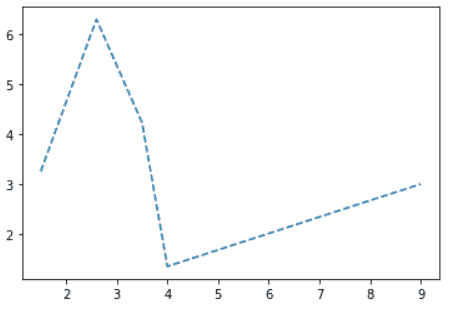

plt.plot(linestyle=’dashed’)

阅读:[什么是 matplotlib 内联](https://pythonguides.com/what-is-matplotlib-inline/)

## Matplotlib 虚线样式

为了给图形或图表添加一些额外的特征或样式，我们使用不同的样式。基本上，样式用于改变绘图或图表的整体外观。

为了实现对样式的更多控制，我们必须提供一个破折号元组。

```
**# Create dash tuple as:** dash tuple (offset, (on_off_seq)) 
```

**举例:**('松散虚线'，(0，(5，20)))其中 5 表示 5pt 线，20 表示 20pt 空格。

**在 matplotlib 虚线中，可使用下列样式:**

*   松散虚线
*   虚线
*   密集虚线

为了便于理解，让我们借助示例逐一讨论不同的风格:

### Matplotlib 虚线样式*"松散虚线* "

现在，我们将向虚线添加更多功能。

**让我们借助一个例子来理解这个概念:**

```
**# Import libraries**

import matplotlib.pyplot as plt
from collections import OrderedDict

**# Define dash tuple**

linestyles = OrderedDict(
    [ 

     ('loosely dashed',      (0, (5, 20))),
     ('dashed',              (0, (10, 4))),
     ('densely dashed',      (0, (1, 3))),

    ])

**# Plot the graph**

plt.plot([0,100], [0,1], linestyle=linestyles['loosely dashed'])

**# Display the plot**

plt.show()
```

*   在上面的例子中，首先我们导入 **matplotlib.pyplot** 库，然后我们**从集合**中导入 OrderedDict。
*   接下来，我们用所有可用的样式定义**破折号元组**。
*   然后我们使用 **plt.plot()** 方法绘制具有松散虚线特征的图，具有 1pt 线和 3pt 空间。
*   最后，我们使用方法 **plt.show()** 来显示这个图。

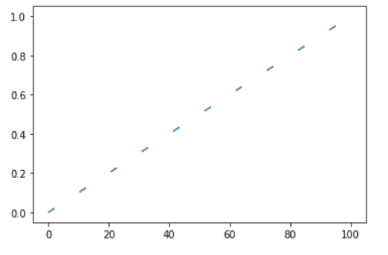

plt.plot() *linestyle “loosely dashed”*

读取 [Matplotlib 默认图形尺寸](https://pythonguides.com/matplotlib-default-figure-size/)

### Matplotlib 虚线样式*【虚线】*

给虚线添加一些额外的功能。

**让我们借助一个例子来理解这个概念:**

```
**# Import libraries**

import matplotlib.pyplot as plt
from collections import OrderedDict

**# Define dash tuple**

linestyles = OrderedDict(
    [ 

     ('loosely dashed',      (0, (5, 20))),
     ('dashed',              (0, (10, 4))),
     ('densely dashed',      (0, (1, 3))),

    ])

**# Plot the graph**

plt.plot([0,100], [0,1], linestyle=linestyles['dashed'])

**# Display the plot**

plt.show()
```

*   在上面的例子中，首先我们导入 **matplotlib.pyplot** 库，然后我们**从集合**中导入 OrderedDict。
*   接下来，我们用所有可用的样式定义破折号元组。
*   然后我们用 **plt.plot()** 的方法，用 10pt 的线和 4pt 的间距画出带有虚线特征的图。
*   最后，我们使用方法 **plt.show()** 来显示这个图。

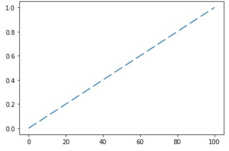

plt.plot() *linestyle* *“dashed”*

### Matplotlib 虚线样式*“密集虚线”*

给虚线添加一些额外的功能。

**让我们借助一个例子来理解这个概念:**

```
**# Import libraries**

import matplotlib.pyplot as plt
from collections import OrderedDict

**# Define dash tuple**

linestyles = OrderedDict(
    [ 

     ('loosely dashed',      (0, (5, 20))),
     ('dashed',              (0, (10, 4))),
     ('densely dashed',      (0, (1, 3))),

    ])

**# Plot the graph**

plt.plot([0,100], [0,1], linestyle=linestyles['densely dashed'])

**# Display the plot**

plt.show()
```

*   在上面的例子中，首先我们导入**matplotlib . py plot**库，然后我们 **从集合** 中导入 OrderedDict。
*   接下来，我们用所有可用的样式定义破折号元组。
*   然后我们用 **plt.plot()** 的方法，用 1 点的线和 3 点的空间，画出带有虚线特征的图形。
*   最后，我们用 **plt.show()** 的方法展示这个图。

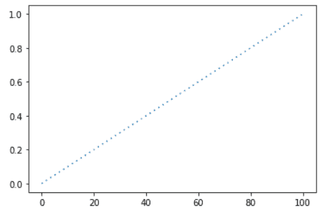

*plt.plot() linestyle “densely dashed “*

阅读: [Python 使用 Matplotlib 绘制多条线](https://pythonguides.com/python-plot-multiple-lines/)

## Matplotlib 虚线颜色

**plt.plot()** 方法主要用于绘制 X 轴和 Y 轴上的数据之间的关系，参数 **color** 指定了不同的颜色，我们用这些颜色来突出不同的绘制线。

**其语法如下:**

```
matplotlib.pyplot.plot(x, y, linestyle='dashed', color=None)
```

**matplotlib 中可用的颜色如下:**

*   **蓝色:**写为‘蓝色’或‘b’。
*   **红色:**写为‘红色’或‘r’。
*   **绿色:**写为‘绿色’或‘g’。
*   **青色:**写为‘青色’或‘c’。
*   **洋红色:**写为‘洋红色’或‘m’。
*   **黄色:**写为‘黄色’或‘y’。
*   **黑色:**写为‘黑色’或‘k’。
*   **白色:**写为‘白色’或‘w’。

**让我们借助下面的例子来理解改变地块线颜色的概念:**

```
**# Import libraries**

import matplotlib.pyplot as plt

**# Define Ax**es

x_points = [1.5, 2.6, 3.5, 4, 9]
y1_points = [1, 2, 3, 4, 5]
y2_points = [6, 7, 8, 9, 10]
y3_points = [3, 4.3, 4.23, 6, 3]

**# Plot a graph**

plt.plot(x_points, y1_points, linestyle = 'dashed', color = 'cyan')
plt.plot(x_points, y2_points, linestyle = 'dashed',color = 'm')
plt.plot(x_points, y3_points, linestyle = 'dashed', color = 'green')

**# Display graph**

plt.show()
```

*   在上面的例子中，我们使用了 **plt.plot()** 方法，通过使用线条样式虚线来绘制数据。
*   为了容易区分绘制的线，我们使用颜色参数。
*   这里我们绘制了三个不同的虚线图，我们使用三种不同的颜色作为青色、品红色和绿色。

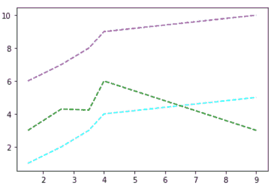

*plt.plot(linestyle=’dashed’,color=’None’)*

阅读: [Matplotlib 绘制一条线](https://pythonguides.com/matplotlib-plot-a-line/)

## 带标记的 Matplotlib 虚线

标记向我们展示数据点。基本上，它们用于突出显示最高和最低的数据点。

我们可以设置不同的图案、颜色、大小等标记。

甚至，我们还可以设置 **markeredgecolor** 、 **facecolor** 等。

**其语法如下:**

```
matplotlib.pyplot.plot(x, y, linestyle='dashed', marker=None, markersize=None,markeredgecolor=None ... )
```

**让我们借助一个例子来理解这个概念:**

```
**# Import libraries**

import matplotlib.pyplot as plt

**# Define Ax**es

x_points = [1.5, 2.6, 3.5, 4, 9]
y_points = [1, 2, 3, 4, 5]

**# Plot a graph**

plt.plot(x_points, y1_points, linestyle = 'dashed', marker = '*' )

                          **# OR** 
plt.plot(x_points, y1_points, linestyle = 'dashed', marker = 'd', ms= '20')
                          **# OR**
plt.plot(x_points, y1_points, linestyle = 'dashed', marker = '>', ms= '20', mec= 'r')
                          **# OR**

plt.plot(x_points, y1_points, linestyle = 'dashed', marker = '>', ms= '20', mec= 'r', mfc='y')

**# Display graph**

plt.show()
```

*   在上面的例子中，我们通过使用标记作为参数来使用虚线图中的标记，并且我们还根据您的需要来调整标记。
*   第一种情况:我们使用**标记** **星号“*”**。
*   第二种情况:我们使用**标记** **菱形‘d’**并设置**标记大小 20** 。
*   第三种情况:我们使用**标记** **圈“o”**并设置**标记大小为 10** 并设置**标记为红色**。
*   第四种情况:我们使用**标记** **三角形右'> '** ，设置**标记大小 20** ，设置**标记颜色红色**和**标记颜色黄色**。

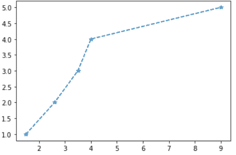

First Case Output

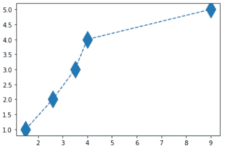

Second Case Output

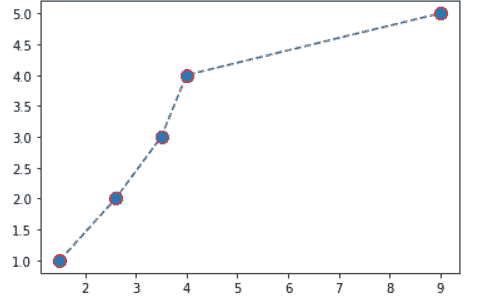

Third Case Output

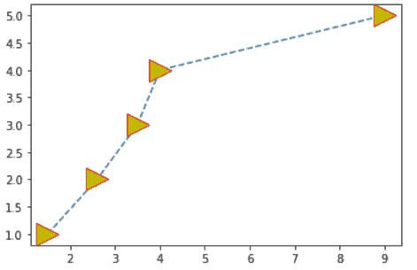

Fourth Case Output

阅读:[如何安装 matplotlib python](https://pythonguides.com/how-to-install-matplotlib-python/)

## Matplotlib 虚线水平线

在某些情况下，我们需要在图表或绘图中画一条水平线。

对于绘制水平线**使用 axhline()** 方法。

**在指定日期绘制水平线的语法:**

```
matplotlib.pyplot,axhline(x=0, ymin=0, ymax=1, **kwargs)
```

**在上面的语法中，使用了下面概述的参数:**

*   **x:** 在数据坐标中放置水平线。
*   **ymin:**y 轴上的水平线起始位置。它取 0 到 1 之间的值。0 代表轴的底部，1 代表轴的顶部。
*   **ymax**:y 轴上的水平线结束位置。它取 0 到 1 之间的值。0 代表轴的底部，1 代表轴的顶部。
*   **kwargs:** 指定属性来改变线条的样式、颜色、线宽。

**让我们借助一个例子来理解这个概念:**

```
**# Import libraries**

import matplotlib.pyplot as plt

**# Plot the graph**

plt.plot([0,10], [0,6])

**# Plot horizontal line**

plt.axhline(y=1.5, linestyle='dashed', color='black')

**# Display the plot**

plt.show()
```

*   在上面的例子中，首先我们导入**matplotlib . py plot**库，然后我们 **从集合** 中导入 OrderedDict。
*   然后我们用 **plt.plot()** 的方法画出带有虚线自变量的图形。
*   然后我们用 **axhline()** 的方法画一条水平线。
*   最后，我们用 **plt.show()** 的方法展示这个图。

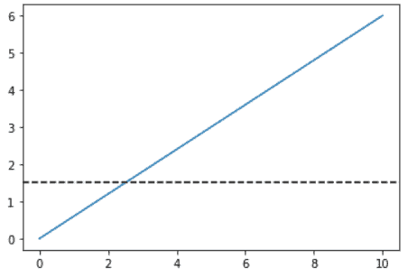

plt.axhline()

阅读: [Matplotlib plot_date](https://pythonguides.com/matplotlib-plot-date/)

## Matplotlib 虚线垂直线

在某些情况下，我们需要在图表或绘图中画一条垂直线。

对于绘制水平线**使用 axvline()** 方法。

**在指定日期绘制水平线的语法:**

```
matplotlib.pyplot,axvline(x=0, ymin=0, ymax=1, **kwargs)
```

**在上面的语法中，使用了下面概述的参数:**

*   **x:** 在数据坐标中放置垂直线。
*   **ymin:**y 轴上的垂直线起始位置。它取 0 到 1 之间的值。0 代表轴的底部，1 代表轴的顶部。
*   **ymax**:y 轴上的垂直线结束位置。它取 0 到 1 之间的值。0 代表轴的底部，1 代表轴的顶部。
*   **kwargs:** 指定属性来改变线条的样式、颜色、线宽。

**让我们借助一个例子来理解这个概念:**

```
**# Import libraries**

import matplotlib.pyplot as plt

**# Plot the graph**

plt.plot([0,10], [0,6])

**# Plot vertical line**

plt.axvline(x=1.5, linestyle='dashed', color='black')

**# Display the plot**

plt.show()
```

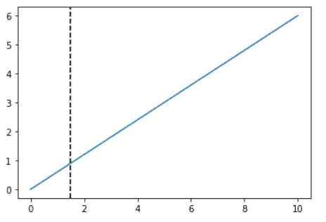

plt.axvline()

读取: [Matplotlib 日志日志图](https://pythonguides.com/matplotlib-log-log-plot/)

## Matplotlib 虚线间距

间距指定破折号之间的空间长度。您可以根据需要增加或减少空间。

**改变空间的语法描述如下:**

```
matplotlib.plt.plot(x,y,linestyle='dashed',dashes= ( length of line , space of line ) )
```

**让我们借助一个例子来理解这个概念:**

```
**# Import libraries**

import matplotlib.pyplot as plt

**# Plot the graph**

plt.plot([0,10],  [0,1], linestyle='dashed', dashes=(1,3))
plt.plot([0,10],  [0,2], linestyle='dashed', dashes=(3,2))
plt.plot([0,10],  [0,3], linestyle='dashed', dashes=(5,10))

**# Display the plot**

plt.show()
```

*   在上面的例子中，我们使用 **plt.plot()** 方法绘制了一个图形
*   我们在 **plt.plot()** 方法中通过**破折号**作为参数来改变虚线之间的间距。
*   从输出中，您观察到在所有三种情况下，破折号之间的间距是不同的。

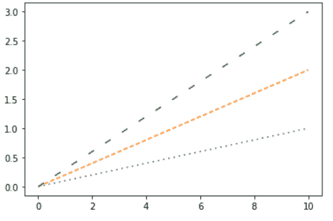

plt.plot()

阅读: [Matplotlib 支线剧情 _adjust](https://pythonguides.com/matplotlib-subplots_adjust/)

## Matplotlib 虚线图例

*   图例用于表示图形的坐标。
*   在 matplotlib 中，我们有一个方法 **legend()** 。
*   **legend()** 用于在轴上放置一个图例。

**上述内容的语法如下:**

```
matplotlib.pyplot.legend()
```

**图例函数具有以下参数，概述如下:**

*   **loc:** 指定图例的位置。默认情况下，loc 的值是“最佳”或左上角。其他位置被定义为“右上”、“右下”、“左下”。
*   **bbox_to_anchor((x，y)，ncol) :** x 和 y 指定坐标，ncol 表示列数。默认情况下，ncol 的值为 1。
*   **标记刻度:**指定图例标记的大小。
*   **facecolor:** 指定图例的背景颜色。
*   **边缘颜色:**指定图例的边缘颜色。

**让我们借助一个例子来理解这个概念:**

```
**#Import Libraries**

import numpy as np
import matplotlib.pyplot as plt

**# Data to be plotted**

x = np.arange(5) 
y1 = [1, 2, 3, 4, 5] 
y2 = [1, 8, 27, 64, 125]

**# Function to plot**  

plt.plot(x, y1, '--', label ='Numbers')
plt.plot(x, y2, label ='Cube of numbers')

**# Function add a legend**

plt.legend(bbox_to_anchor =(0.85, 1.12), ncol = 3)

                       **#OR**

plt.legend( loc='upper center')

**# Function to show the plot**

plt.show()
```

*   在上面的例子中，首先我们导入库 **matplotlib.pylot** 和 **NumPy** 。
*   接下来，通过使用 NumPy **arrange()** 方法我们定义数据。
*   然后我们使用 **plt.plot()** 方法绘制数据，并设置它们的标签。
*   **plt.legend ()** 方法用于定义图例
*   案例 1:我们使用 **bbox_to_anchor()** 方法
*   情况 2:我们用 **loc** 来指定位置。
*   最后，我们使用 **show()** 来显示图形。

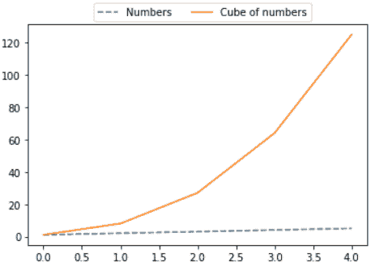

plt.legend() *“Output of Case 1”*

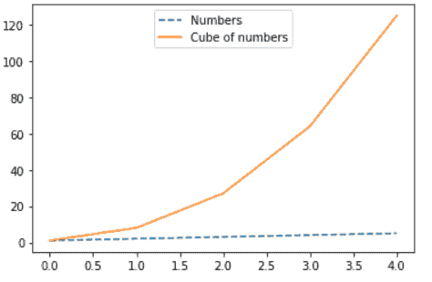

plt.legend() *“Output of Case 2”*

阅读: [Matplotlib 最佳拟合线](https://pythonguides.com/matplotlib-best-fit-line/)

## Matplotlib 虚线轮廓

等高线用于绘制二维的三维数据。

**plt.contour()** 和**PLT . contour()**方法用于创建 3D 数据图。

**上述内容的语法如下:**

```
matplotlib.pyplot.contour([X,Y]Z,[levels],**kwargs)
```

**以下是对上述论点的如下描述:**

*   **X:** 指定 2 D 数组，其中 len(X)是 z 的行数。
*   **Y:** 指定 2 D 数组，其中 len(Y)是 z 的列。
*   **Z:** 绘制(X，Y)的形状，并指定高度值。
*   **级别:**指定轮廓线的数量和位置。

**让我们借助一个例子来理解** **的概念:**

```
**# Import Libraries**

import numpy as np
import matplotlib.cm as cm
import matplotlib.pyplot as plt

**# Define data**

delta = 0.035
x = np.arange(-3.0, 3.0, delta)
y = np.arange(-2.0, 2.0, delta)
X, Y = np.meshgrid(x, y)
Z = np.exp(-X**2 - Y**2)

**# contour() method**

fig,axis = plt.subplots()
Counter_plot = axis.contour(X, Y, Z, 6, colors='k', linestyles='dashed')  

**# Plot the graph** 
plt.show()
```

*   导入必要的库，如 **matplotlib.pyplot** 、 **matplotlib.cm** 、 **numpy** 。
*   使用 **arrange()** 方法定义数据或二维数据。
*   使用 **meshgrid()** 方法创建一个网格，并传递 x 和 y 的值。
*   定义 Z 为 X 和 y 的**函数**。
*   然后使用 **contour()** 方法绘制 3D 图，并将不同的参数 x、y 和 metion 传递给虚线所示的线条样式。
*   最后，使用 **show()** 方法显示图形。

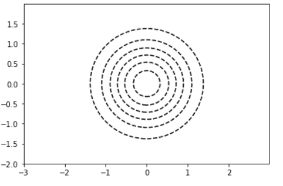

counter()

阅读: [Matplotlib 散点图标记](https://pythonguides.com/matplotlib-scatter-marker/)

## Matplotlib 虚线宽度

我们可以很容易地在 matplotlib 中自定义 linestyle dashed。通过定义线条宽度，我们可以修改线条的粗细。或者我们可以说，我们可以增加或减少线的宽度。默认情况下，我们以像素为单位指定线宽大小。

**上述内容的语法如下:**

```
**#Import Libraries**

import numpy as np
import matplotlib.pyplot as plt

**# Data to be plotted**

x = np.arange(5) 
y1 = [1, 2, 3, 4, 5] 
y2 = [1, 8, 27, 64, 125]

**# Function to plot**  

plt.plot(x, y1, '--', linewidth = 8, label ='Numbers')
plt.plot(x, y2, '--', linewidth = 4, label ='Cube of numbers')

**# Function add a legend ** 

plt.legend(loc='upper center')

**# Function to show the plot**

plt.show()
```

在上面的例子中，通过使用 **plt.plot()** 方法，我们绘制了图形。并且通过添加额外的参数**线宽**，我们可以改变虚线的粗细。

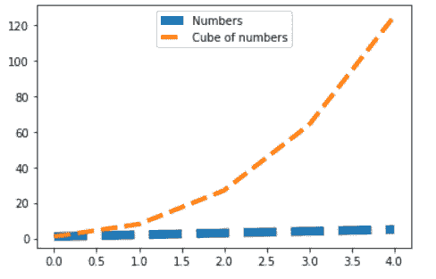

*plt.plot() “Change dashed line thickness”*

另外，请阅读: [Matplotlib 移除刻度标签](https://pythonguides.com/matplotlib-remove-tick-labels/)

## Matplotlib 虚线误差条

Matplotlib 虚线有误差线，用于绘制计算值的置信度或精度，我们使用误差线。

**errorbar()** 方法用于绘制图形中的误差线。

**绘制误差线的语法如下:**

```
matplotlib.pyplot.errorbar(x, y, xerr=None, yeer=None, ...)
```

**下面描述上面使用的下列参数:**

*   **x:** 指定水平坐标
*   **y:** 指定垂直坐标
*   **xeer:** 数组状结构，指定水平方向的误差线大小。
*   **叶儿:**阵列状结构，指定垂直方向的误差线大小。

**我们用一个例子来理解这个概念:**

```
**#Import Libraries**

import numpy as np
import matplotlib.pyplot as plt

**# Data to be plotted** 
x = np.arange(5) 
y = [1, 2, 3, 4, 5] 

**# Function to plot errorbars**  

plt.errorbar(x, y, xerr = 0.3, linestyle='dashed') 

**# Function to show the plot**

plt.show()
```

在上面的例子中，我们使用 **plt.errorbar()** 方法，在水平方向绘制误差线，尺寸为 0.3，线条样式为虚线。

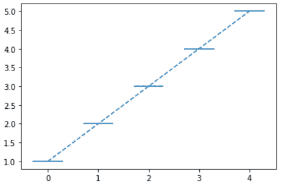

plt.errorbar()

另外，检查:[画垂直线 matplotlib](https://pythonguides.com/draw-vertical-line-matplotlib/)

在本 Python 教程中，我们已经讨论了" **Matplotlib 虚线**"并且我们还涵盖了一些与之相关的例子。我们在本教程中讨论了以下主题。

*   Matplotlib 虚线
*   Matplotlib 虚线如何绘图
*   Matplotlib 虚线示例
*   Matplotlib 虚线样式
*   Matplotlib 虚线颜色
*   带标记的 Matplotlib 虚线
*   Matplotlib 虚线水平线
*   Matplotlib 虚线垂直线
*   Matplotlib 虚线间距
*   Matplotlib 虚线图例
*   Matplotlib 虚线轮廓
*   Matplotlib 虚线宽度
*   Matplotlib 虚线误差线

[Bijay Kumar](https://pythonguides.com/author/fewlines4biju/)

Python 是美国最流行的语言之一。我从事 Python 工作已经有很长时间了，我在与 Tkinter、Pandas、NumPy、Turtle、Django、Matplotlib、Tensorflow、Scipy、Scikit-Learn 等各种库合作方面拥有专业知识。我有与美国、加拿大、英国、澳大利亚、新西兰等国家的各种客户合作的经验。查看我的个人资料。

[enjoysharepoint.com/](https://enjoysharepoint.com/)[](https://www.facebook.com/fewlines4biju "Facebook")[](https://www.linkedin.com/in/fewlines4biju/ "Linkedin")[](https://twitter.com/fewlines4biju "Twitter")