# Python 熊猫替换多个值–15 个示例

> 原文：<https://pythonguides.com/pandas-replace-multiple-values/>

[](https://sharepointsky.teachable.com/p/python-and-machine-learning-training-course)

在这个 [Python 熊猫](https://pythonguides.com/pandas-in-python/)教程中，我们将学习如何使用 Python 来**替换熊猫数据帧**中的多个值。此外，我们将涵盖这些主题。

*   熊猫根据条件替换一列中的多个值
*   熊猫替换列中的多个值
*   熊猫用一个值代替多个值
*   熊猫取代多值正则表达式
*   熊猫用 nan 替代多个值
*   熊猫替换一列中的多个值
*   熊猫替换多个行值
*   熊猫替换多个列中的特定值
*   熊猫根据条件替换多列中的多个值
*   熊猫一次替换多个值
*   熊猫一次替换多个角色
*   熊猫替换多个字符串值
*   熊猫替换字符串中的多个字符
*   熊猫字符串替换多个值
*   熊猫从列表中删除多个值
*   熊猫发现并取代多重价值

目录

[](#)

*   [熊猫取代多值](#Pandas_replace_mutiple_values "Pandas replace mutiple values")
*   [熊猫根据条件](#Pandas_replace_multiple_values_in_a_column_based_on_condition "Pandas replace multiple values in a column based on condition")替换一列中的多个值
    *   [通过使用 NumPy.where 函数](#By_using_NumPywhere_function "By using NumPy.where function")
*   [熊猫替换列](#Pandas_replace_multiple_values_in_column "Pandas replace multiple values in column")中的多个值
*   [熊猫用一个值代替多个值](#Pandas_replace_multiple_values_with_one_value "Pandas replace multiple values with one value")
*   [熊猫替换多值 regex](#Pandas_replace_multiple_values_regex "Pandas replace multiple values regex")
*   [熊猫用 nan 替换多个值](#Pandas_replace_multiple_values_with_nan "Pandas replace multiple values with nan")
*   [熊猫替换一列中的多个值](#Pandas_replace_multiple_values_in_one_column "Pandas replace multiple values in one column")
*   [熊猫替换多行值](#Pandas_replace_multiple_row_values "Pandas replace multiple row values")
*   [熊猫替换多列中的特定值](#Pandas_replace_specific_values_in_multiple_columns "Pandas replace specific values in multiple columns")
*   [熊猫根据条件](#Pandas_replace_multiple_values_in_multiple_columns_based_on_condition "Pandas replace multiple values in multiple columns based on condition")替换多列中的多个值
*   [熊猫一次替换多个值](#Pandas_replace_multiple_values_at_once "Pandas replace multiple values at once")
*   [熊猫替换多个字符串值](#Pandas_replace_multiple_string_values "Pandas replace multiple string values")
*   [熊猫替换字符串中的多个字符](#Pandas_replace_multiple_characters_in_string "Pandas replace multiple characters in string")
*   [熊猫字符串替换多个值](#Pandas_strreplace_multiple_values "Pandas str.replace multiple values")
*   [熊猫替换列表中的多个值](#Pandas_replace_multiple_values_from_list "Pandas replace multiple values from list")
*   [熊猫发现并替换多个值](#Pandas_find_and_replace_multiple_values "Pandas find and replace multiple values")

## 熊猫取代多值

*   在本期节目中，我们将讨论如何在熊猫 Python 中替换多个值。
*   要替换数据帧中的多个值，我们可以应用方法 **DataFrame.replace()** 。在 Pandas 中，DataFrame replace 方法用于替换 DataFrame 对象中的值。
*   在 Python 中，我们可以使用这种技术来替换多个列，这种方法也用于替换 Pandas 数据帧中的正则表达式、字典和序列。

**语法:**

下面是 **DataFrame.replace()** 方法的语法

```
DataFrame.replace
                 (
                  to_replace=None,
                  value=None,
                  inplace=False,
                  limit=None,
                  regex=False,
                  method='pad'
                 )
```

*   它由几个参数组成
    *   **to_replace:** 该参数指定我们想要替换的值。
    *   **Value:** 默认情况下其值为 none，指定新的替换值。
    *   **inplace:** 如果条件为真，则替换并将返回 None。默认情况下，其值为 False。
    *   **limit:** 指定最大尺寸间隙，默认为无。
    *   **regex:** 该参数检查条件如果为真则 to_replace 必须为字符串。
    *   **方法:**用于替换值的方法。

**举例:**

让我们举个例子，看看如何替换 DataFrame 中的多个值

```
import pandas as pd

new_data = pd.DataFrame([
	[18,-78, 47],
	[19, 84, -92],
    [94, 73, 668],
    [809, 719, -356],
	[113,115,119]],
	columns=['m', 'o', 'p'])

new_result = new_data.replace({'m':{94:19, 809:123}, 'p':{-92:63, -356:189}})
print(new_result)
```

在上面的程序中，我们将使用 **replace()** 方法来替换 Dataframe 中的值。在本例中，我们将用 **19** 替换 **94** ，并用【T10’m’列中的 **123** 替换 **809** 。同样，我们将替换列**‘p’**中的值。

下面是以下给定代码的执行过程

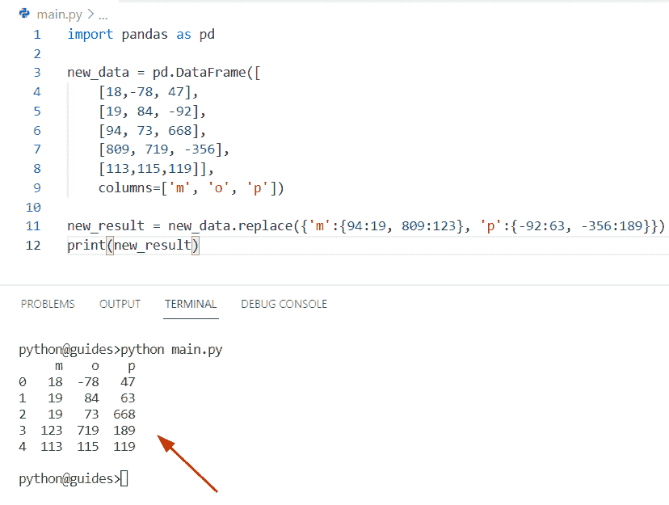

Pandas replace multiple values

阅读: [Python 熊猫掉行](https://pythonguides.com/python-pandas-drop-rows-example/)

## 熊猫根据条件替换一列中的多个值

*   让我们看看如何根据条件替换一列中的多个值。
*   通过使用 DataFrame.loc 方法，我们可以执行这个特定的任务。在 Pandas DataFrame 中， **loc()** 方法用于指定我们需要过滤掉的列和行的名称。所以我们也可以使用 **loc()** 方法过滤数据。
*   这是一个独特的方法，从 Pandas DataFramem 中检索行，并且这个方法只接受索引标签。当在 Pandas 数据帧上使用 loc 方法时，我们已经指定了要在格式中调整哪些行和列。

**语法:**

```
DataFrame.loc()
```

**举例:**

```
import pandas as pd

new_val = pd.DataFrame([
	[89, 17, 15],
	[115, 178, -5],
	[114, 190, 824]],
	columns=['val1', 'val2', 'val3'])

new_val.loc[(new_val.val1 < 100), 'val1'] = 0
print(new_val)
```

在上面的代码中，我们替换了满足条件的列'**val 1 '**中的值。在这个例子中，我们声明了一个条件，如果列值小于 **100** ，那么它将被 DataFrame 替换。

下面是以下给定代码的实现

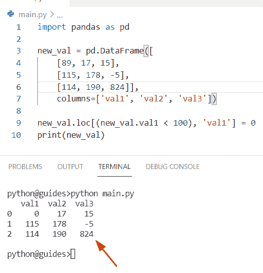

Pandas replace multiple values in a column based on condition

### 通过使用 NumPy.where 函数

在 Python 中基于条件替换列中的值，我们可以使用方法 **numpy。其中()**。在 Python 中，该方法将帮助用户在基于给定条件进行过滤后从 numpy 数组中返回元素的索引。

**语法:**

下面是 numpy.where()方法的语法

```
numpy.where(condition[,x,y])
```

**注意:** x 和 y 参数指定从中选择的值，并总是返回包含元素的数组

**举例:**

```
import pandas as pd
import numpy as np

new_data = pd.DataFrame([
	[18, 278, 897],
	[55, 77, 91],
	[678, 456, 118]],
	columns=['z', 'u', 't'])

new_data['u'] = np.where((new_data.u < 200), 44, new_data.u)
print(new_data)
```

在上面的代码中，我们使用了 **numpy.where()** 方法，并替换了满足条件的列**‘u’**中的值。在这个例子中，我们已经声明了一个条件，如果列值小于 **200** ，那么它将被 **44** 替换。

下面是以下给定代码的实现

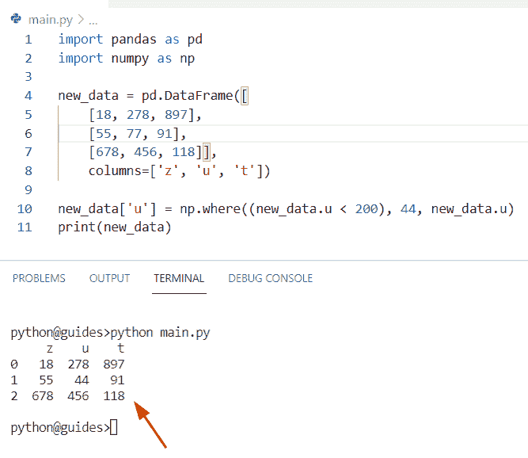

Pandas replace multiple values in a column based on condition

使用 **DataFrame.where()** 函数根据条件替换一列中多个值的另一种方法。

在这个方法中，我们将指定必须替换哪些值的列名，并且我们还将根据条件替换给定列中的现有值。

**语法:**

```
DataFrame.where
               (
                cond,
                other=nan,
                inplace=False,
                axis=None,
                Level=None,
                error='raise',
                try_cast=Nodefault.no_default
               )
```

**源代码:**

```
import pandas as pd

data = pd.DataFrame([
	[76, 119,168],
	[346, 345, 156],
	[99, 145, 908]],
	columns=['Col1', 'Col2', 'Col3'])

data['Col3'].where(~(data.Col3 < 200), other=76, inplace=True)
print(data)
```

下面是以下给定代码的输出

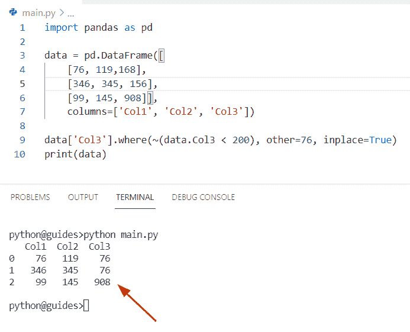

Pandas replace multiple values in a column based on condition

阅读:[如何将熊猫数据帧转换成字典](https://pythonguides.com/how-to-convert-pandas-dataframe-to-a-dictionary/)

## 熊猫替换列中的多个值

*   让我们看看如何使用 Python Pandas 替换特定列中的多个值。
*   在这个例子中，我们将看到如何替换列中的多个值。为此，我们将使用 Python 内置函数 DataFrame.replace。
*   通过使用 **DataFrame.replace()** 方法，我们将用多个新字符串或文本替换单个 DataFrame 列的多个值。这个方法搜索整个 Pandas 数据帧并替换每个指定的值。

**源代码:**

```
import pandas as pd                                                                                                                                

Country_name = pd.DataFrame({'Country_name':['Germany', 'England', 'France', 'England', 'Germany']})                                                                    
b= Country_name.replace({'Country_name':{'England' : 'China', 'Germany' : 'japan' }})                                                                                         

print(b)
```

在这个程序中，我们将指定需要替换的列名**‘Country _ name’**，在上面的代码中，我们已经声明了需要用新值替换的特定值。

下面是以下代码的截图

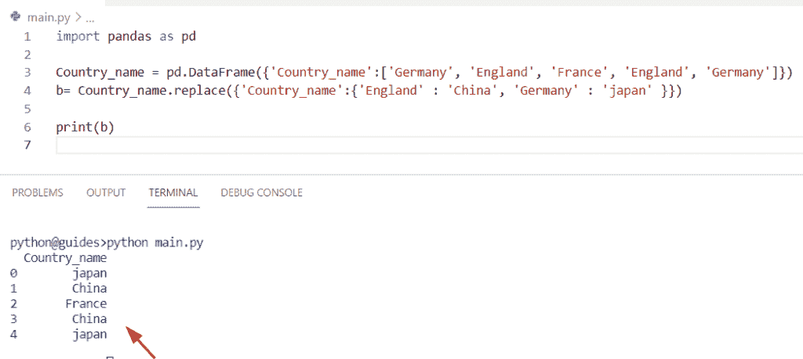

Pandas replace multiple values in column

阅读:[熊猫删除栏目](https://pythonguides.com/pandas-delete-column/)

## 熊猫用一个值代替多个值

*   这里我们可以看到如何用一个值替换多个值。
*   在这个程序中，我们将用一个特定的字符串替换多个字符串。为了执行这个特定的任务，我们可以应用替换和 **dict.fromkeys()** 方法的组合。
*   在 Python 中，字典。fromkeys()是一个内置函数，它用来自给定序列和值的键声明一个新字典。

**语法:**

下面是 fromkeys()方法的语法

```
dict.fromkeys(seq[,value])
```

*   它由几个参数组成
    *   **序列:**该参数指定了所有值的列表。
    *   **Value:** 这是一个可选参数，默认情况下其值为 none。

**举例:**

```
import pandas as pd                                                                                                                                

Employee_name = pd.DataFrame({'Employee_name':['john','george','Micheal','oliva']})                                                                    
print(Employee_name)
b= Employee_name.replace(dict.fromkeys(['john','george','Micheal','oliva'], 'Micheal'))
print("After replacing the values:")
print(b)
```

在上面的程序中，我们用**‘Micheal’**字符串替换了所有的字符串。一旦你将打印**‘b’**输出将只显示数据帧中的‘迈克尔’值。

你可以参考下面的截图

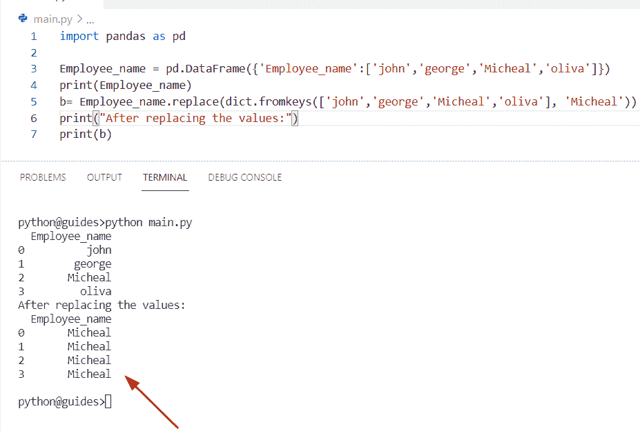

Pandas replace multiple values with one value

阅读: [Python 将数据帧转换为列表](https://pythonguides.com/python-convert-dataframe-to-list/)

## 熊猫替换多值 regex

*   在这个程序中，我们将讨论如何使用 regex 方法替换 Pandas DataFrame 中的多个值。
*   这里我们可以看到如何替换匹配正则表达式的字符串。在 Python 中使用正则表达式使用 **replace()** 方法替换字符串。
*   在 Python 中，正则表达式用于匹配给定字符串中的字符组合，它还定义了搜索模式。Python 模块 **'re'** 提供了正则表达式。

**语法:**

```
DataFrame.replace
                 (
                  to_replace=None,
                  value=None,
                  inplace=False,
                  limit=None,
                  regex=False,
                  method='pad'
                 )
```

**源代码:**

```
import pandas as pd                                                                                                                                

df = pd.DataFrame({'City':['Ger-many', 'Eng-land', 'Fr-ance', 'Eng-land', 'Ger-many']})  
new_value = {
   'CITY': {
      r'(G.*Ge|Germany.*)': 'Ger-many',
      r'E[ng]*[oo]*.*': 'Fraan ce'}
}

b= df.replace(new_value, regex=True, inplace=True)
print(b)
```

下面是以下代码的截图

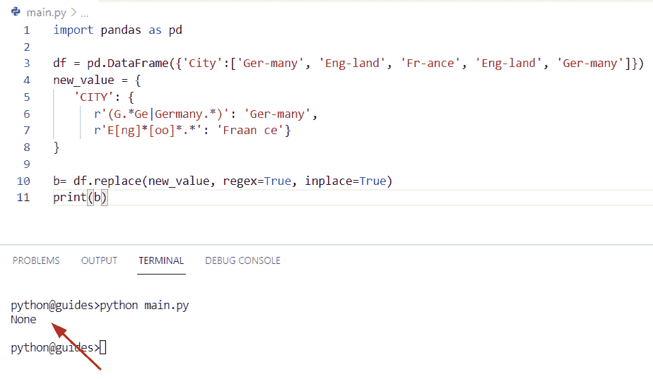

Pandas replace multiple values regex

阅读: [Python 熊猫数据帧 Iterrows](https://pythonguides.com/pandas-dataframe-iterrows/)

## 熊猫用 nan 替换多个值

*   这里我们可以看到如何用 nan 替换多个值。
*   在这个程序中，我们将了解如何用 nan 值替换值。为了完成这项任务，我们将应用 **DataFrame.replace()** 方法的概念。
*   在 Python 中，nan 代表的不是数字，而是数据帧中缺失的值，这些是 Python 中的特殊值。

**源代码:**

```
import pandas as pd
import numpy as np

new_data = pd.DataFrame([
	[76,889, 156],
	[19, 84, 467],
    [94, 73, 321],
    [116, 609,557],
	[156,864,467]],
	columns=['u', 'o', 'z'])

new_result = new_data.replace({'o':{84:np.nan, 609:np.nan}, 'u':{94:np.nan, 156:np.nan}})
print(new_result)
```

在上面的程序中，我们将使用 **replace()** 方法来替换 Dataframe 中的值。在本例中，我们将在列**‘o’**中用 nan 替换 **84** ，用 nan 替换 **809** 。同样，我们将替换列**‘u’**中的值。

下面是以下给定代码的执行过程

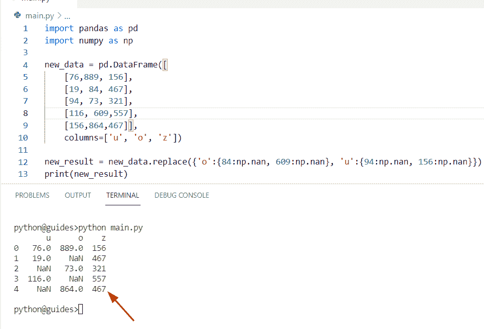

Pandas replace multiple values with nan

阅读:[计算熊猫数据帧中的行数](https://pythonguides.com/count-rows-in-pandas-dataframe/)

## 熊猫替换一列中的多个值

*   在这个程序中，我们将讨论如何替换一个特定列中的多个值。
*   为了执行这个任务，我们将使用方法 **DataFrame.replace()** 和 check to replace()方法来解决这个问题。在本例中，我们将在**‘国家名称’**列下用新的整数值替换【T2’‘国家名称’值。
*   在 Pandas 中，DataFrame replace 方法用于替换 DataFrame 对象中的值。

**源代码:**

```
import pandas as pd                                                                                                                                

Country_name = pd.DataFrame({'Country_name':['China', 'Malaysia', 'Newzealand', 'Paris', 'Bangladesh']})                                                                    
m= Country_name.replace({'Country_name':{'Malaysia' : 56, 'Paris' : 778 }})                                                                                         

print(m)
```

在上面的程序中，我们希望用多个新值替换单个或特定 Pandas DataFrame 列的多个值。

下面是以下给定代码的输出。

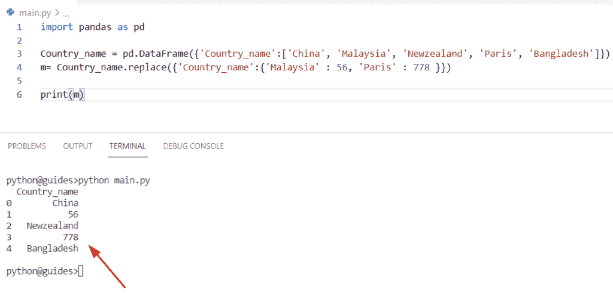

Pandas replace multiple values in one column

阅读: [Python 熊猫写数据帧到 Excel](https://pythonguides.com/python-pandas-write-dataframe-to-excel/)

## 熊猫替换多行值

*   让我们看看如何替换 Pandas 数据帧中的多个行值。
*   通过使用 DataFrame.loc 方法，我们可以执行这个特定的任务。在 Pandas DataFrame 中， **loc()** 方法用于指定我们需要过滤掉的列和行的名称。所以我们也可以使用 **loc()** 方法过滤数据。
*   在 Python 中，这个方法从 Pandas 数据帧中检索行，它也用于布尔数组。

**举例:**

```
import pandas as pd

new_data = pd.DataFrame([
	[187, 634, 138],
	[779, 908, 346],
	[459, 709, 116]],
	columns=['new_val1', 'new_val2', 'new_val3'])

new_data.loc[(new_data.new_val2 < 800), 'new_val2'] = 92
print(new_data)
```

在上面的代码中，我们替换了满足条件的列' ne**w _ val 2′**中的值。在这个例子中，我们声明了一个条件，如果列值小于 **800** ，那么它将被 DataFrame 替换。

你可以参考下面的截图

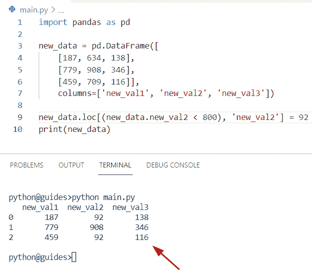

Pandas replace multiple row values

阅读:[获取索引熊猫 Python](https://pythonguides.com/get-index-pandas-python/)

## 熊猫替换多列中的特定值

*   在本节目中，我们将讨论如何替换多个列中的特定值。
*   在本例中，键指定了列值，我们希望替换 DataFrame 中可用的特定值。
*   这里我们可以使用 Pandas**data frame . replace()**函数来更改或修改多个列值。要完成这项任务，首先使用随机模块中的 sample 函数创建数据，然后创建两个存储数据的列表。

**源代码:**

```
import pandas as pd 
from random import sample

new_val = ["Rose", "Lilly","Jasmine","Lotus"]
my_val1 = sample(new_val,4)
my_val2 = sample(new_val,4)
my_val3 = sample(new_val,4)
df = pd.DataFrame({"col1":my_val1,
              "col2":my_val2,
              "col3":my_val3,
             })
print(df)
b= df.replace({"Rose":"Banana",
            "Lilly":"Apple",
            "Jasmine":"Oranges",
            "Lotus":"Grapes"})
print(b)
```

在上面的例子中，我们创建了一个 DataFrame 对象，并在其中插入了三列。现在我们想替换所有给定的特定列的值。

下面是以下给定代码的实现

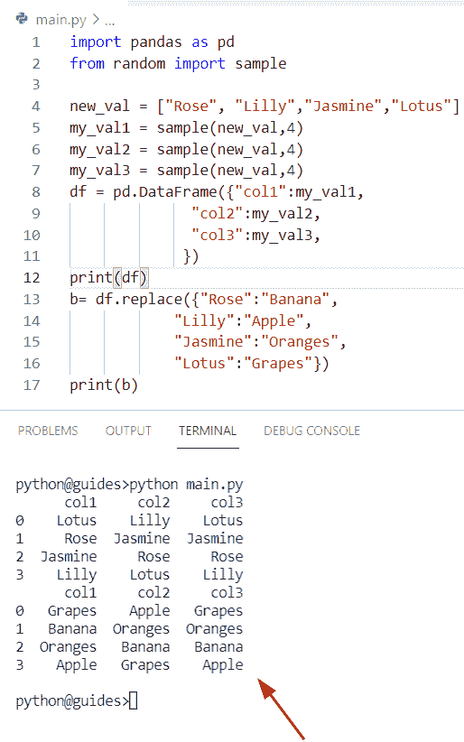

Pandas replace specific values in multiple columns

阅读: [Python 数据帧到 CSV](https://pythonguides.com/python-dataframe-to-csv/)

## 熊猫根据条件替换多列中的多个值

*   在这个程序中，我们将讨论如何替换基于条件的多个列中的多个值。
*   通过使用熊猫。Series.map() 方法我们可以解决这个任务。此方法用于映射两个给定序列中的值，这两个序列具有特定的列，并且序列的结束列应该与索引列相同。

**语法:**

下面是熊猫的句法。Series.map()方法

```
Series.map(arg, na_action=None)
```

**举例:**

```
import pandas as pd 

new_df = pd.DataFrame(dict(
    new_val=['values {}'.format(m) for m in [8, 9, 6, 9, 8]],
    Other=range(5)
))
print(new_df)
dct = {'value 1': 6789,
       'value 2': 95678,
       'value 3': 399456}
b= new_df.assign(new_val=new_df.new_val.map(dct))
print(b)
```

下面是以下代码的截图

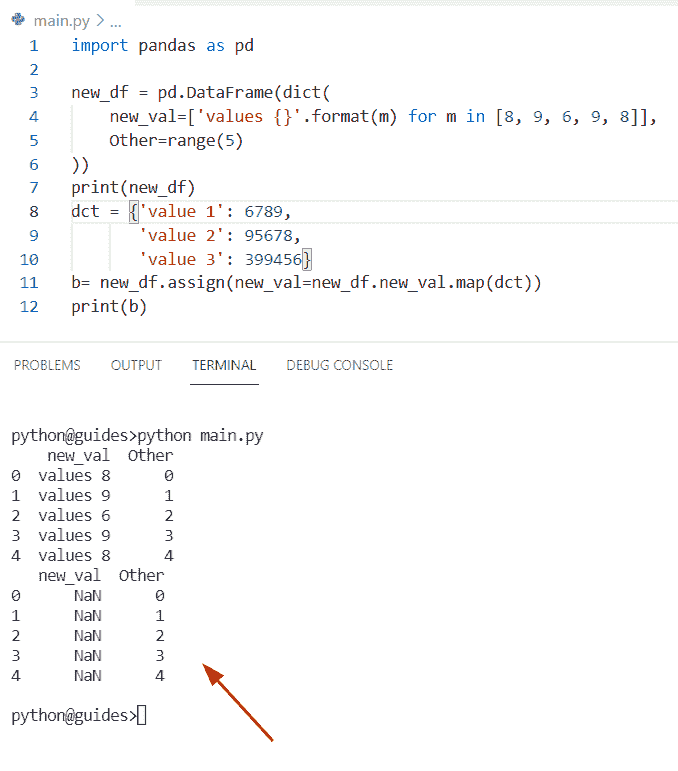

Pandas replace multiple values in multiple columns based on condition

阅读:[如何在 Python Pandas 中设置列为索引](https://pythonguides.com/set-column-as-index-in-python-pandas/)

## 熊猫一次替换多个值

*   让我们看看如何在 Pandas 数据帧中一次替换多个值。
*   为了执行这个任务，我们可以使用 **DataFrame.replace()** 方法一次替换多个值。
*   在这个例子中，我们已经创建了多个列**‘val 1’**和**‘val 2’**，我们在其中传递了字符串值，然后创建了一个 DataFrame 对象并在列表中分配了列名。

**源代码:**

```
import pandas as pd

new_val = {'Val1':  ['Rose','Rose','Lilly','Jasmine','Jasmine','Rose','Lilly','Lilly'],
          'Val2': ['Australia','Germany','Germany','Australia','Germany','Germany','Australia','Australia']
         }

df = pd.DataFrame(new_val, columns= ['Val1','Val2'])
df['Val1'] = df['Val1'].replace(['Lilly'],'Lotus')
df['Val2'] = df['Val2'].replace(['Germany'],'China')

print (df)
```

在上面的程序中，一旦你要打印' df '，那么输出将显示**‘Lotus’**值，而不是**‘Lilly’**。同样，在第二列中，**‘德国’**的值已经被替换为**‘中国’**。

下面是以下代码的截图

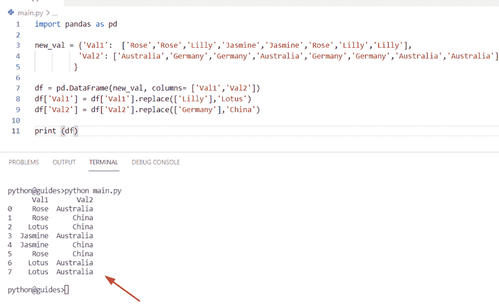

Pandas replace multiple values at once

阅读:[Python 熊猫中的 group by](https://pythonguides.com/groupby-in-python-pandas/)

## 熊猫替换多个字符串值

*   这里我们可以看到如何替换 Pandas 数据帧中的多个字符串值。
*   在 Python 中，字符串是字符的集合，字符只是一个符号，字符串可以用单引号或双引号表示。现在我们想替换熊猫数据帧中的多个字符串值。
*   为了完成这个任务，我们将使用 **replace()** 方法的概念。此方法用新字符串替换字符串的所有匹配项。

**举例:**

```
import pandas as pd                                                                                                                                

Fruit_name = pd.DataFrame({'Fruit_name':['Mangoes', 'Apple', 'Grapes', 'Litchi', 'Cherry']})                                                                    
m =Fruit_name.replace({'Fruit_name':{'Apple' : 'Banana', 'Grapes' : 'Pears' }})                                                                                         

print("Replace string values:",m)
```

在上面的代码中，我们希望将单个 DataFrame 列的多个字符串值替换为多个新的字符串值。在这个例子中，我们将用**‘香蕉’**替换**‘苹果’**字符串值。

你可以参考下面的截图

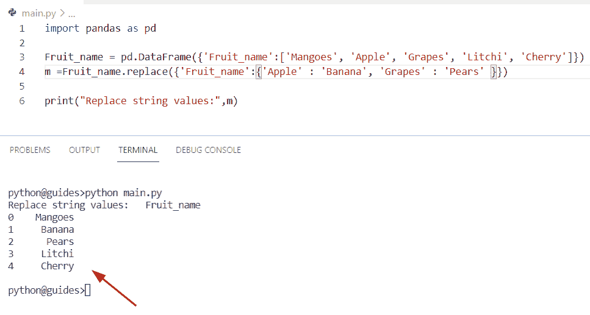

Pandas replace multiple string values

阅读:[Python 熊猫中的交叉表](https://pythonguides.com/crosstab-in-python-pandas/)

## 熊猫替换字符串中的多个字符

*   这里我们可以看到如何使用 DataFrame 替换字符串中的多个字符。
*   在这个例子中，我们将应用 Python 内置的函数，即 **replace()** 和 **join()** 。在 Python 中， **join()** 方法用于将一个字符串附加到 iterable 对象，并通过附加列表中所有可用的元素来返回一个新字符串。

**举例:**

```
import pandas as pd

df = pd.DataFrame({'High_level': ['Python language', 'Java language', 'Ruby language', 'C++ language']})

new_val = '|'.join(['Java', 'Ruby'])

df['High_level'] = df['High_level'].str.replace(new_val, 'Programming')
print(df)
```

在上面的例子中，我们创建了一个 dataframe 对象**‘df’**，在这个对象中，我们传递了一个键值对元素。在 Pandas 数据帧中，关键元素被认为是列名。在这个程序中，我们想要替换给定字符串中的多个字符。为了完成这项任务，首先我们将创建一个列表，并通过使用 **join()** 方法分配替换元素。

下面是以下给定代码的实现

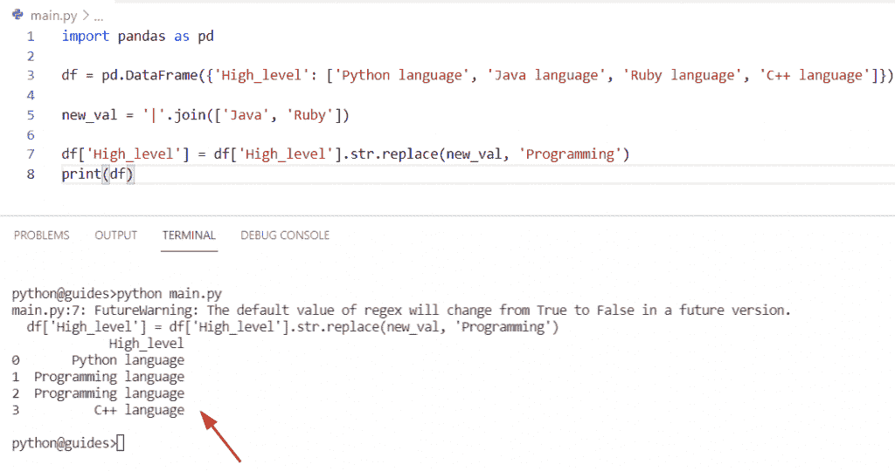

Pandas replace multiple characters in a string

阅读: [Python 熊猫 CSV 教程](https://pythonguides.com/python-pandas-csv/)

## 熊猫字符串替换多个值

*   在这个程序中，我们将讨论如何使用 **str.replace()** 方法替换一个字符串中的多个值。
*   这里我们可以使用字符串数据类型的 **replace()** 方法将值替换为不同的值。
*   在 Python 中 **str.replace()** 方法将帮助用户用新值替换给定字符串中旧文本的匹配元素。

**语法:**

```
str.replace(old,new [,count])
```

*   它由几个参数组成
    *   **old:** 该参数指定应从数据帧中替换的字符或文本。
    *   **new:** 将替换旧文本的新字符串或文本。
    *   **计数:**这是一个可选参数

**源代码:**

```
import pandas as pd                                                                                                                                

Employee_name = pd.DataFrame({'Employee_name':['Chris', 'Hayden', 'Potter', 'William', 'George']})                                                                    
c= Employee_name.replace({'Employee_name':{'Chris' : 'Hemsworth', 'Potter' : 'Adam' }})                                                                                         

print(c)
```

在上面的代码中，我们首先导入了 Pandas 模块，然后创建了 dataframe 对象**‘Employee _ name’**。现在我们必须使用 replace()方法返回一个新的字符串。一旦你打印了**‘c’**，那么输出将在熊猫数据帧中显示新的字符串。

你可以参考下面的截图

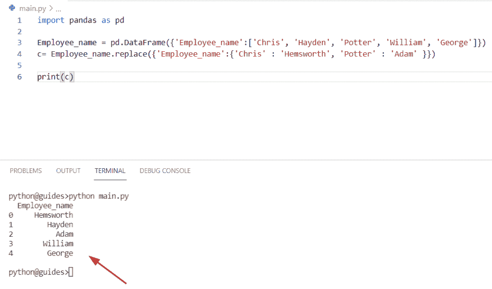

Pandas str replace multiple values

阅读:[Python 中熊猫缺失数据](https://pythonguides.com/missing-data-in-pandas/)

## 熊猫替换列表中的多个值

*   让我们看看如何替换 Pandas DataFrame 中给定列表中的多值。
*   这里我们可以应用 **DataFrame.replace()** 方法的概念，它将帮助用户替换列表中的多个值。

**源代码:**

```
import pandas as pd
import numpy as np

new_data = pd.DataFrame([
	[168,489, 136],
	[134, 378, 996],
    [152, 73, 321],
    [116, 609,557],
	[156,864,467]],
	columns=['l', 'm', 'n'])

new_result = new_data.replace({'m':{378:960, 609:11}, 'n':{996:109, 557:338}})
print(new_result)
```

在上面的代码中，我们必须使用 **replace()** 方法来替换 Dataframe 中的值。在本例中，我们将用 **960** 替换 **378** ，并用【T10’m’列中的 **11** 替换 **609** 。同样，我们将替换列**‘n’**中的值。

下面是以下给定代码的输出

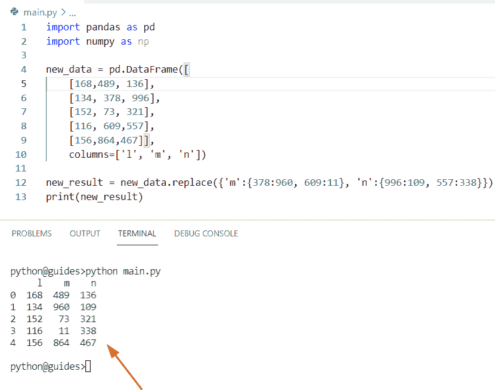

Pandas replace multiple values from a list

另外，请阅读:[检查 Python Pandas 中的 DataFrame 是否为空](https://pythonguides.com/check-if-dataframe-is-empty-in-python-pandas/)

## 熊猫发现并替换多个值

*   在这里，我们可以看到如何在 Pandas 数据帧中查找和替换多个值。
*   通过使用 **np.where()** 函数，我们可以执行这个任务，这个方法将帮助用户在根据给定的条件过滤后返回 numpy 数组中元素的索引。

**举例:**

```
import pandas as pd
import numpy as np

new_val = pd.DataFrame([
	[18, 278, 897],
	[55, 77, 91],
	[678, 456, 118]],
	columns=['l', 'o', 'p'])

new_val['o'] = np.where((new_val.o < 200), 56, new_val.o)
print(new_val)
```

下面是以下代码的截图

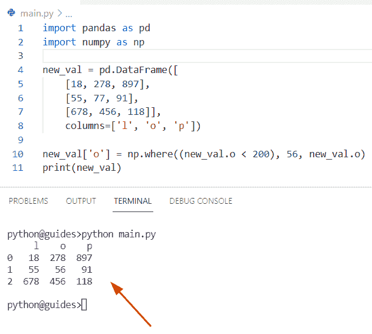

Pandas find and replace multiple values

在这篇 Pandas 教程中，我们学习了如何使用 Python 来替换 Pandas 数据帧中的多个值。此外，我们已经讨论了这些主题。

*   熊猫根据条件替换一列中的多个值
*   熊猫替换列中的多个值
*   熊猫用一个值代替多个值
*   熊猫取代多值正则表达式
*   熊猫用 nan 替代多个值
*   熊猫替换一列中的多个值
*   熊猫替换多个行值
*   熊猫替换多个列中的特定值
*   熊猫根据条件替换多列中的多个值
*   熊猫一次替换多个值
*   熊猫一次替换多个角色
*   熊猫替换多个字符串值
*   熊猫替换字符串中的多个字符
*   熊猫字符串替换多个值
*   熊猫从列表中删除多个值
*   熊猫发现并取代多重价值

[Bijay Kumar](https://pythonguides.com/author/fewlines4biju/)

Python 是美国最流行的语言之一。我从事 Python 工作已经有很长时间了，我在与 Tkinter、Pandas、NumPy、Turtle、Django、Matplotlib、Tensorflow、Scipy、Scikit-Learn 等各种库合作方面拥有专业知识。我有与美国、加拿大、英国、澳大利亚、新西兰等国家的各种客户合作的经验。查看我的个人资料。

[enjoysharepoint.com/](https://enjoysharepoint.com/)[](https://www.facebook.com/fewlines4biju "Facebook")[](https://www.linkedin.com/in/fewlines4biju/ "Linkedin")[](https://twitter.com/fewlines4biju "Twitter")