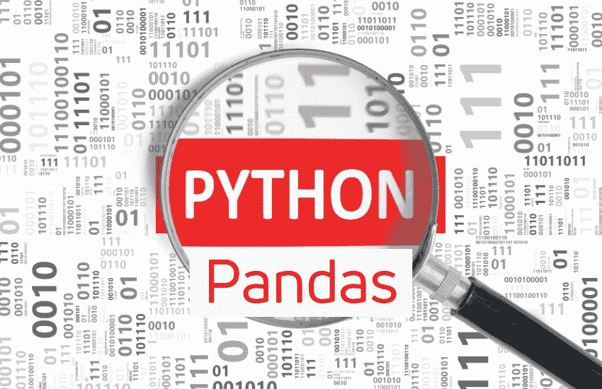

# 蟒蛇皮熊猫

> 原文：<https://pythonguides.com/pandas-in-python/>

[](https://sharepointsky.teachable.com/p/python-and-machine-learning-training-course)

在这个 [Python 机器学习教程](https://pythonguides.com/machine-learning-using-python/)中，我们将学习 Python 中的**熊猫**我们也将涉及这些话题。

*   Python 文档中的熊猫库
*   通过康达安装熊猫
*   通过 Pip 安装 Pandas
*   熊猫版本检查
*   Python 中的熊猫类型
*   熊猫的头部功能
*   熊猫的尾巴功能

目录

[](#)

*   [Python 文档中的熊猫库](#Pandas_Library_in_Python_Documentation "Pandas Library in Python Documentation")
*   [通过康达安装熊猫](#Installing_Pandas_via_conda "Installing Pandas via conda")
*   [通过 pip 安装熊猫](#Installing_Pandas_via_pip "Installing Pandas via pip")
*   [熊猫版本检查](#Pandas_Version_Check "Pandas Version Check")
*   [Python 中熊猫的类型(基于用法)](#Types_of_Pandas_in_Python_Based_on_Usage "Types of Pandas in Python (Based on Usage)")
    *   [熊猫系列](#Pandas_Series "Pandas Series")
    *   [熊猫数据帧](#Pandas_DataFrame "Pandas DataFrame")
*   [熊猫的头部功能](#Head_Function_in_Pandas "Head Function in Pandas")
*   [熊猫的尾巴功能](#Tail_function_in_pandas "Tail function in pandas")

## Python 文档中的熊猫库

*   **Python Pandas** 是机器学习&数据科学中广泛使用的库，用于数据分析。它允许创建、读取、操作&删除数据。
*   您可能认为结构化查询语言也提供了类似的特性。所以主要的区别是文件类型。Pandas 几乎可以使用任何文件类型，而结构化查询语言仅限于数据库文件。
*   Pandas 易于使用，集成了许多数据科学和机器学习工具，有助于为机器学习准备数据。
*   熊猫有两种物体
    *   系列图像 #将链接添加到系列图像部分
    *   DataFrame #向 DataFrame 部分添加一个链接
*   [点击这里](https://pandas.pydata.org/docs/user_guide/index.html#user-guide)看熊猫官方文档。



Pandas in Python

## 通过康达安装熊猫

*   Conda 是一个包管理器，用来安装机器学习所必需的库。
*   在这一节中，我们将学习如何使用 conda 包管理器安装 pandas。
*   首先是创造一个环境。[点击此处](https://pythonguides.com/machine-learning-using-python/#Create_Environment)学习如何创建环境。
*   创建环境后，激活环境。
*   现在，一旦创建并激活了环境，只需输入下面的代码来安装 Pandas。

```
conda install pandas -y
```

*   这里`**-y**`表示对 **y/n** 提示的是。根据带宽速度，安装可能需要几分钟时间。
*   **注意:**我们希望传播正确的编程方式，否则同样的事情可以在不创建虚拟环境的情况下完成。

## 通过 pip 安装熊猫

*   pip 是为 python 安装的一个包。它有各种各样的 python 库，可以安装用于多种目的。
*   如果您想了解更多关于 pip 的信息，或者您想知道如何在您的系统上安装 pip[，请点击此处](https://pip.pypa.io/en/stable/installing/)。
*   我们假设您的系统上安装了 pip。
*   现在我们要在全球安装 **virtualenv** ，这样我们就可以创建一个虚拟环境。

**语法:**

下面是在系统上全局安装 virtualenv 的语法。

```
pip install virtualenv
```

*   要安装 pandas，首先我们必须创建并激活一个虚拟环境，我们将在其中安装所有必要的库。

```
# creating virtual environment with the name env
virtualenv env

# activating environment for windows
env/Scripts/activate    

# activating environmnt for mac & linux
Source env/bin/activate 
```

*   现在要安装熊猫，只需输入`**pip install pandas**`
*   ****注:**** 我们希望传播正确的编程方式，否则同样的事情不用创建虚拟环境也能完成。

## 熊猫版本检查

找到在任何系统上运行的 Pandas 的给定版本的依赖项的版本。我们可以使用 **`pd.show_versions()`** 的效用函数来检查版本的依赖关系。此处提供的信息用于解决问题。