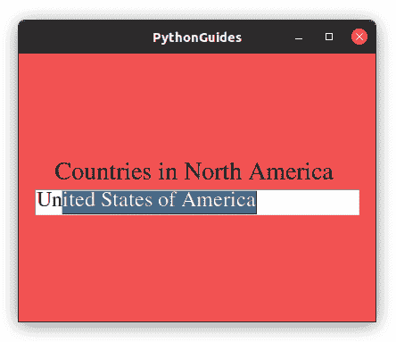
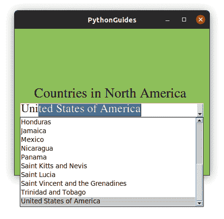
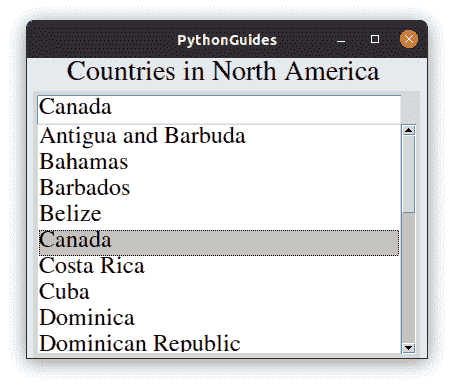

# Python Tkinter 自动完成

> 原文：<https://pythonguides.com/python-tkinter-autocomplete/>

[](https://sharepointsky.teachable.com/p/python-and-machine-learning-training-course)

在这个 Python 教程中，我们将看到如何实现 **Python Tkinter 自动完成**功能。自动完成是指根据用户键入的关键字显示相关单词。最简单的例子可能是你在浏览时看到的自动建议点。我们将讨论这些话题。

*   tkinter 自动完成
*   自动完成条目 Tkinter Python
*   Python Tkinter 自动完成 Combobox
*   Python Tkinter 自动完成列表框

目录

[](#)

*   [自动完成 Python Tkinter](#Autocomplete_Python_Tkinter "Autocomplete Python Tkinter")
*   [自动完成条目 Tkinter Python](#Autocomplete_Entry_Tkinter_Python "Autocomplete Entry Tkinter Python")
*   [Python Tkinter 自动完成组合框](#Python_Tkinter_Autocomplete_Combobox "Python Tkinter Autocomplete Combobox")
*   [python tkinter autocompute listbox](#Python_Tkinter_Autocomplete_Listbox "Python Tkinter Autocomplete Listbox")

## 自动完成 Python Tkinter

Python Tkinter 提供了一个模块 **ttkwidgets** ，使用它我们可以在 Python Tkinter 的应用程序中添加自动完成特性。

*   ttkwidgets 拥有方法自动完成功能，允许开发者在他们各自的应用程序中轻松实现自动完成功能。
*   该过程的第一步是在系统上安装自动完成功能。Windows 和 Mac 用户可以简单地使用 pip 来安装 autocomplete，而 Linux 用户必须安装完整的软件包才能使用它。
*   ttkwidgets 依赖于 **pillow** ，所以我们需要在系统上安装它来使这个 ttkwidgets 库工作。

**Windows 和 Mac** 用户:

```py
pip install ttkwidgets
pip install pillow

or

pip3 install ttkwidgets
pip3 install pillow
```

对于 Linux，我们将使用拥有一个 *apt* 的 **Ubuntu** 作为包管理器。您可以将 apt 更改为您各自的包管理器。Arch Linux 用户[点击这里](https://aur.archlinux.org/packages/python-ttkwidgets/)。

```py
sudo add-apt-repository ppa:j-4321-i/ttkwidgets

sudo apt-get update

sudo apt-get install python3-ttkwidgets

sudo apt-get install python-imaging-tk
```

一旦您成功执行了所有这些命令，您就可以按照下面几节中的步骤在 Python Tkinter 中实现自动完成特性。

使用 Tkinter 阅读 Python 中的[注册表](https://pythonguides.com/registration-form-in-python-using-tkinter/)

## 自动完成条目 Tkinter Python

在本节中，我们将学习如何在 Python Tkinter 中自动完成**条目小部件。此外，我们将看到它的一个例子。**

*   该过程的第一步是从 **ttkwidgets.autocomplete** 导入 **AutocompleteEntry** 方法
*   现在，我们将使用 AutocompleteEntry 创建一个入口小部件，而不是直接从 Tkinter 创建，在它内部，我们将为 **completevalues** 传递一个参数。
*   在 **completevalues** 参数中传递的值将成为选项，当用户传递类似的关键字时，这些选项将被完成。
*   比如`completevalues=['hello', 'PythonGuides']`，现在每次用户都会键入‘h；他/她会将自动完成建议视为“你好”，类似地，在“p”的情况下，他/她会将“pythonguides”视为一个选项。

**Tkinter Python 中自动完成条目的源代码**

```py
from ttkwidgets.autocomplete import AutocompleteEntry
from tkinter import *

countries = [
        'Antigua and Barbuda', 'Bahamas','Barbados','Belize', 'Canada',
        'Costa Rica ', 'Cuba', 'Dominica', 'Dominican Republic', 'El Salvador ',
        'Grenada', 'Guatemala ', 'Haiti', 'Honduras ', 'Jamaica', 'Mexico',
        'Nicaragua', 'Saint Kitts and Nevis', 'Panama ', 'Saint Lucia', 
        'Saint Vincent and the Grenadines', 'Trinidad and Tobago', 'United States of America'
        ]

ws = Tk()
ws.title('PythonGuides')
ws.geometry('400x300')
ws.config(bg='#f25252')

frame = Frame(ws, bg='#f25252')
frame.pack(expand=True)

Label(
    frame, 
    bg='#f25252',
    font = ('Times',21),
    text='Countries in North America '
    ).pack()

entry = AutocompleteEntry(
    frame, 
    width=30, 
    font=('Times', 18),
    completevalues=countries
    )
entry.pack()

ws.mainloop()
```

**输出 Python Tkinter** 中自动完成条目的

 **下面是 Python Tkinter 中自动完成条目的上述代码的输出。你可以注意到，当用户键入' **Un** 时，它会自动将国家名称改为'美利坚合众国'。



Autocomplete Entry in Python Tkinter

阅读: [Python NumPy 矩阵](https://pythonguides.com/python-numpy-matrix/)

## Python Tkinter 自动完成组合框

在这一节中，我们将学习如何在 Python Tkinter 中自动完成 Combobox 小部件。

*   该过程的第一步是从 **ttkwidgets.autocomplete** 导入 **AutocompleteEntry** 方法
*   现在，我们将使用 **AutocompleteCombobox** 创建 Combobox，而不是直接从 Tkinter 创建 Combobutton 或 Combobox 小部件，在其中，我们将为 **completevalues** 传递一个参数。
*   在 **completevalues** 参数中传递的值将成为选项，当用户传递类似的关键字时，这些选项将被完成。

**Tkinter Python 中自动完成组合框的源代码**

```py
from ttkwidgets.autocomplete import AutocompleteCombobox
from tkinter import *

countries = [
        'Antigua and Barbuda', 'Bahamas','Barbados','Belize', 'Canada',
        'Costa Rica ', 'Cuba', 'Dominica', 'Dominican Republic', 'El Salvador ',
        'Grenada', 'Guatemala ', 'Haiti', 'Honduras ', 'Jamaica', 'Mexico',
        'Nicaragua', 'Saint Kitts and Nevis', 'Panama ', 'Saint Lucia', 
        'Saint Vincent and the Grenadines', 'Trinidad and Tobago', 'United States of America'
        ]

ws = Tk()
ws.title('PythonGuides')
ws.geometry('400x300')
ws.config(bg='#8DBF5A')

frame = Frame(ws, bg='#8DBF5A')
frame.pack(expand=True)

Label(
    frame, 
    bg='#8DBF5A',
    font = ('Times',21),
    text='Countries in North America '
    ).pack()

entry = AutocompleteCombobox(
    frame, 
    width=30, 
    font=('Times', 18),
    completevalues=countries
    )
entry.pack()

ws.mainloop() 
```

**Tkinter Python 中自动完成组合框的源代码**

下面是 Python Tkinter 中 **Autocomplete Combobox 的上述代码的输出。你可以注意到，当用户输入“ **Un** 时，它会自动完成输入框中的文本，并在下拉菜单中突出显示相同的国家名称“美利坚合众国”。**



Autocomplete combobox in Python Tkinter

阅读:[从 PDF Python 中提取文本](https://pythonguides.com/extract-text-from-pdf-python/)

## python tkinter autocompute listbox

*   该过程的第一步是从 **ttkwidgets.autocomplete** 导入**autocompleteentryllistbox**方法。
*   现在，我们将使用**autocompleteentryblistbox**来创建一个列表框小部件，而不是直接从 Tkinter 创建，在列表框内部，我们将为 **completevalues** 传递一个参数。
*   在 **completevalues** 参数中传递的值将成为选项，当用户传递类似的关键字时，这些选项将被完成。

**Tkinter Python 中自动完成列表框的源代码**

```py
from ttkwidgets.autocomplete import AutocompleteEntryListbox
from tkinter import *

countries = [
        'Antigua and Barbuda', 'Bahamas','Barbados','Belize', 'Canada',
        'Costa Rica ', 'Cuba', 'Dominica', 'Dominican Republic', 'El Salvador ',
        'Grenada', 'Guatemala ', 'Haiti', 'Honduras ', 'Jamaica', 'Mexico',
        'Nicaragua', 'Saint Kitts and Nevis', 'Panama ', 'Saint Lucia', 
        'Saint Vincent and the Grenadines', 'Trinidad and Tobago', 'United States of America'
        ]

ws = Tk()
ws.title('PythonGuides')
ws.geometry('400x300')
ws.config(bg='#DFE7F2')

frame = Frame(ws, bg='#DFE7F2')
frame.pack(expand=True)

Label(
    frame, 
    bg='#DFE7F2',
    font = ('Times',21),
    text='Countries in North America '
    ).pack()

entry = AutocompleteEntryListbox(
    frame, 
    width=30, 
    font=('Times', 18),
    completevalues=countries
    )
entry.pack()

ws.mainloop() 
```

****Tkinter Python 中自动完成列表框的源代码** :**

下面是 Python Tkinter 中**自动完成列表框的上述代码的输出。您可以注意到，当用户选择加拿大时，它会在输入框中自动更新。**



Autocomplete Listbox in Python Tkinter

您可能会喜欢以下 Python Tkinter 教程:

*   [Python Tkinter 主循环示例](https://pythonguides.com/python-tkinter-mainloop/)
*   [Python Tkinter 滚动条](https://pythonguides.com/python-tkinter-scrollbar/)
*   [Python Tkinter 文本框小工具](https://pythonguides.com/python-tkinter-text-box/)
*   [Python Tkinter Grid](https://pythonguides.com/python-tkinter-grid/)
*   [Python Tkinter Spinbox](https://pythonguides.com/python-tkinter-spinbox/)
*   [Python Tkinter 选项菜单](https://pythonguides.com/python-tkinter-optionmenu/)

在本教程中，我们学习了如何在 Python Tkinter 中创建**自动完成。此外，我们已经讨论了这些主题。**

*   tkinter 自动完成
*   自动完成条目 Tkinter Python
*   Python Tkinter 自动完成 Combobox
*   Python Tkinter 自动完成列表框

[Bijay Kumar](https://pythonguides.com/author/fewlines4biju/)

Python 是美国最流行的语言之一。我从事 Python 工作已经有很长时间了，我在与 Tkinter、Pandas、NumPy、Turtle、Django、Matplotlib、Tensorflow、Scipy、Scikit-Learn 等各种库合作方面拥有专业知识。我有与美国、加拿大、英国、澳大利亚、新西兰等国家的各种客户合作的经验。查看我的个人资料。

[enjoysharepoint.com/](https://enjoysharepoint.com/)[](https://www.facebook.com/fewlines4biju "Facebook")[](https://www.linkedin.com/in/fewlines4biju/ "Linkedin")[](https://twitter.com/fewlines4biju "Twitter")**