# matplotlib plot _ date–完整教程

> 原文：<https://pythonguides.com/matplotlib-plot-date/>

[](https://sharepointsky.teachable.com/p/python-and-machine-learning-training-course)

在本 Python 教程中，我们将讨论如何在 python 中的 [matplotlib 中绘制由日期组成的**数据，我们还将涵盖以下主题:**](https://pythonguides.com/what-is-matplotlib/)

*   Matplotlib plot_date
*   Matplotlib plot_date line
*   Matplotlib plot_date 散点图
*   Matplotlib plot_date 多行
*   Matplotlib plot_date linestyle
*   Matplotlib plot_date color
*   Matplotlib plot_date 日期格式
*   Matplotlib plot_date 日期转换
*   Matplotlib plot _ date 轴上的日期
*   Matplotlib plot_date 指定日期的垂直线
*   Matplotlib plot_date xticks

目录

[](#)

*   [Matplotlib plot_date](#Matplotlib_plot_date "Matplotlib plot_date")
*   [Matplotlib plot_date line](#Matplotlib_plot_date_line "Matplotlib plot_date line")
*   [Matplotlib plot_date 散点图](#Matplotlib_plot_date_scatter "Matplotlib plot_date scatter")
*   [Matplotlib plot_date 多行](#Matplotlib_plot_date_multiple_line "Matplotlib plot_date multiple line")
*   [Matplotlib plot_date linestyle](#Matplotlib_plot_date_linestyle "Matplotlib plot_date linestyle")
    *   [绘图 _ 日期线型–实线](#plot_date_linestyle_-_solid "plot_date linestyle – solid")
    *   [plot_date 线条样式–虚线点](#plot_date_linestyle_-_dashdot "plot_date linestyle – dashdot")
    *   [plot_date 线条样式–虚线](#plot_date_linestyle_-_dotted "plot_date linestyle – dotted ")
    *   [plot_date 线条样式–虚线](#plot_date_linestyle_-_dashed "plot_date linestyle – dashed")
*   [Matplotlib 绘图 _ 日期颜色](#Matplotlib_plot_date_color "Matplotlib plot_date color")
*   [Matplotlib plot_date 日期格式](#Matplotlib_plot_date_date_format "Matplotlib plot_date date format")
    *   [日期格式库](#Date_Format_library "Date Format library")
    *   [数据格式化模块](#DateFormatter_module "DateFormatter module")
*   [Matplotlib plot_date()日期转换](#Matplotlib_plot_date_date_conversion "Matplotlib plot_date() date conversion")
*   [Matplotlib plot _ date x 轴上的日期](#Matplotlib_plot_date_date_on_x-axis "Matplotlib plot_date date on x-axis")
*   [Matplotlib plot_date 指定日期的垂直线](#Matplotlib_plot_date_vertical_line_at_specified_date "Matplotlib plot_date vertical line at specified date")
*   [matplotlib plot _ date xts](#Matplotlib_plot_date_xticks "Matplotlib plot_date xticks")

## Matplotlib plot_date

matplotlib 库**的 **pyplot 模块**中的 plot_date()** 是一个函数。 **plot_date()** 方法基本用于绘制由日期组成的数据。

**语法如下:**

```py
matplotlib.pyplot.plot_date(x ,y, fmt='o', tz=None, xdate=True, ydate=False, data=None, **kwargs)
```

**在上面的语法中，使用了下面概述的参数:**

*   **x:** 数据点的**横坐标**。一个类似数组的结构被用来表示这个坐标。如果 xdate 为 True，x 坐标的值将转换为 matplotlib 日期。
*   **y:** 数据点的**纵坐标**。一个类似数组的结构被用来表示这个坐标。如果 ydate 为 True，x 坐标值将转换为 matplotlib 日期。
*   **fmt:** fmt 是一个最优参数。它有一个字符串结构，即包含字符串值。基本上，它用于定义颜色、线型、标记大小等。
*   **tz:** tz 代表时区。它包含一个时区字符串。基本上是用来标注日期的。默认情况下:“UTC”。
*   **xdate:** xdate 包含布尔值，可选参数。如果 xdate 为 True，x 轴将被描述为 Matplotlib 日期。默认情况下:是。
*   **ydate:** ydate 包含一个布尔值，也是一个可选参数。如果 ydate 为 True，y 轴将显示为 Matplotlib 日期。默认情况下:是。
*   **kwargs:** kwargs 代表关键字参数。它基本上控制了回流线的性质。例如，animated、clip_bx、color 等都是属性的例子。

**Return: plot_date()** 方法返回一条 2D 线。

**让我们做一个例子来理解这个概念:**

```py
# Import Libraries

import datetime
import matplotlib.pyplot as plt
from matplotlib.dates import drange
import numpy as np

d1 = datetime.datetime(2021, 7, 2)
d2 = datetime.datetime(2021, 7, 12)
delta = datetime.timedelta(hours = 48)
dates = drange(d1, d2, delta)

y = np.arange(len(dates))

plt.plot_date(dates, y**3)

plt.tick_params(axis='x', which='major', labelsize=6)

plt.tight_layout()
plt.show()
```

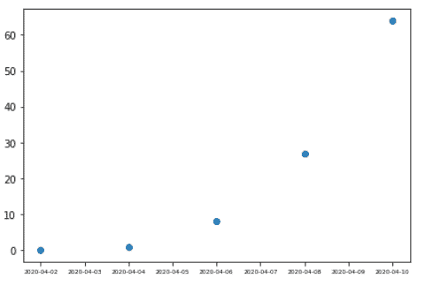

plot_date()

在上面的例子中，首先我们导入了一些重要的库，比如用于日期和时间模块的 **datetime** 、用于生成图形的 **matplotlib** 、用于调整初始和最终日期之间的范围的 **drange** 以及用于数组的 **NumPy** 。

我们使用 **datetime.datetime()** 模块设置日期，使用 **datetime.timedelta()** 模块设置小时，最后使用 **drange()** 模块设置等距日期。

**plot_date()** 函数用来绘制包含日期的图形， **tick_params()** 用来设置 x 轴间距， **tight_layout()** 模块用来调整绘图。最后。我们使用最后一个方法 **show()** 来显示绘制的图形。

阅读[如何安装 matplotlib python](https://pythonguides.com/how-to-install-matplotlib-python/)

## Matplotlib plot_date line

我们将**通过使用 matplotlib** 库 pyplot 模块创建一个日期折线图，该模块具有 **plot_date()** 函数。

**其语法如下:**

```py
matplotlib.pyplot.plot_date(x, y, linestyle='None')
```

**让我们借助下面的例子来理解创建日期折线图的概念:**

```py
# Import Libraries

import matplotlib.pyplot as plt
from datetime import datetime, timedelta

dates = [
    datetime(2021, 10, 21),
    datetime(2021, 10, 22),
    datetime(2021, 7, 24),
    datetime(2021, 10, 25),
    datetime(2021, 10, 26),
]

y = [2, 4, 4.5, 6, 5]

plt.plot_date(dates, y, linestyle = 'dotted')
plt.tight_layout()
plt.show()
```

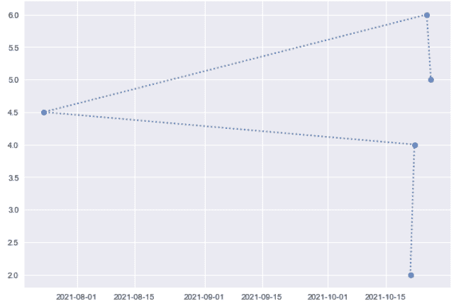

plot_date()

在上面的例子中，我们将使用**虚线样式**来创建一个绘制日期的线图。

然后我们使用 **datetime()** 模块来输入日期。最后，我们将 y 的日期和值传递给 **plot_date()** 。

在最后一步中，我们调用一个 **show()** 方法来显示绘制的日期折线图。

读取 [Matplotlib 绘制一条线](https://pythonguides.com/matplotlib-plot-a-line/)

## Matplotlib plot_date 散点图

我们将**使用 matplotlib 库 pyplot** 模块创建一个日期散点图，该模块具有 **plot_date()** 函数。

**其语法如下:**

```py
matplotlib.pyplot.plot_date(x, y)
```

**注意:**如果你没有提到线条样式，默认情况下它总是给出一个散点图。

**让我们借助下面的例子来理解创建日期散点图的概念:**

```py
# Import Libraries

import matplotlib.pyplot as plt
from datetime import datetime, timedelta
plt.style.use('dark_background')

dates = [
    datetime(2021, 10, 21),
    datetime(2021, 7, 24),
    datetime(2021, 8, 25),
    datetime(2021, 10, 26),
]

y = [2, 4, 4.5, 6]

plt.plot_date(dates, y)
plt.tight_layout()
plt.show()
```

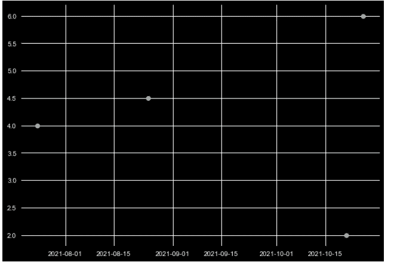

plot_date()

在上面的例子中，我们将绘制一个散点图来绘制日期。

然后我们使用 **datetime()** 模块来输入日期。最后，我们将 y 的日期和值传递给 **plot_date()** 。

在最后一步中，我们调用一个 **show()** 方法来显示绘制的日期折线图。

阅读 [Python 使用 Matplotlib 绘制多行](https://pythonguides.com/python-plot-multiple-lines/)

## Matplotlib plot_date 多行

我们将使用 matplotlib 库 pyplot 模块**在同一个图中创建多条线**来绘制日期，该模块具有 **plot_date()** 函数。

**其语法如下:**

```py
matplotlib.pyplot.plot_date(x, y)
```

**让我们借助下面的例子来理解创建日期散点图的概念:**

```py
# Import Libraries
import datetime
import matplotlib.pyplot as plt
from matplotlib.dates import drange
import numpy as np

plt.style.use('seaborn')

d1 = datetime.datetime(2021, 7, 2)
d2 = datetime.datetime(2021, 7, 12)
delta = datetime.timedelta(hours = 48)
dates = drange(d1, d2, delta)

y = np.arange(len(dates))

plt.plot_date(dates, y**3, linestyle='dashed')
plt.plot_date(dates, y**5, linestyle='dashed')

plt.tight_layout()
plt.show()
```

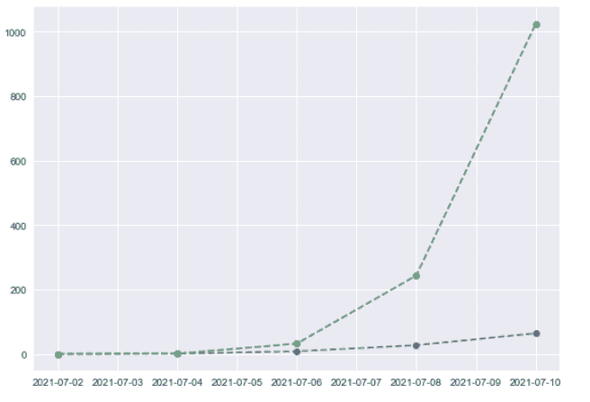

plot_date()

在上面的例子中，我们使用 **datetime.datetime()** 模块设置日期，使用 **datetime.timedelta()** 模块设置小时，最后使用 **drange()** 模块设置等距离日期。

最后，我们将 y 的日期和值传递给 **plot_date()** 和 **show()** 方法来显示绘制的日期折线图。

阅读[什么是 matplotlib 内联](https://pythonguides.com/what-is-matplotlib-inline/)

## Matplotlib plot_date linestyle

**plot_date()** 方法基本上是用来绘制由日期和线条组成的数据，样式指定了所有你可以用来绘制的各种线条。

以下是线型:

*   固体
*   虚线圆点
*   有点的
*   虚线

**我们来讨论一些常见的线条样式:**

### 绘图 _ 日期线型–实线

**我们来看一个例子，试着理解这个概念:**

```py
# Import Libraries

import matplotlib.pyplot as plt
from datetime import datetime, timedelta

dates = [ 
          datetime(2021, 8, 21),
          datetime(2022, 8, 22),
          datetime(2023, 8, 23), 
        ]

y = [0, 1, 2]

plt.plot_date(dates, y, linestyle='solid')

plt.tick_params(axis='x', which='major', labelsize=8)
plt.tight_layout()
plt.show()
```

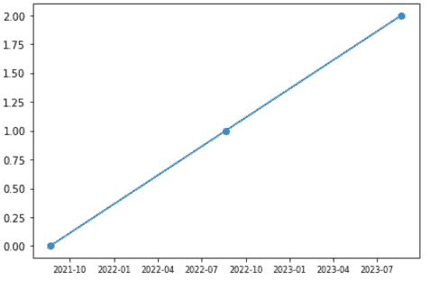

plot_date()

在上面的例子中，在 **plot_date()** 方法中，我们添加了一个参数 linestyle，并将它们的值设置为 **solid 或'-'** 。

阅读 [Matplotlib 绘图条形图](https://pythonguides.com/matplotlib-plot-bar-chart/)

### plot_date 线条样式–虚线点

**我们来看一个例子，试着理解这个概念:**

```py
# Import Libraries

import datetime
import matplotlib.pyplot as plt
from matplotlib.dates import drange
import numpy as np

plt.style.use('seaborn')

d1 = datetime.datetime(2021, 7, 2)
d2 = datetime.datetime(2021, 7, 12)
delta = datetime.timedelta(hours = 48)
dates = drange(d1, d2, delta)

y = np.arange(len(dates))

plt.plot_date(dates, y**3, linestyle='dashdot')

plt.tight_layout()
plt.show()
```

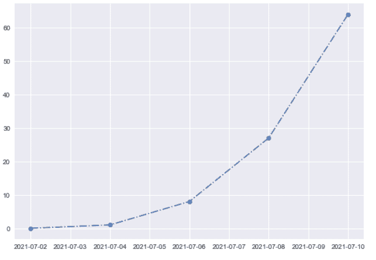

plot_date()

在上面的例子中，在 **plot_date()** 方法中，我们添加了一个参数 linestyle，并将它们的值设置为 **dashdot 或'-. '**。

### plot_date 线条样式–虚线

**我们来看一个例子，试着理解这个概念:**

```py
# Import Libraries
import datetime
import matplotlib.pyplot as plt
from matplotlib.dates import drange
import numpy as np

plt.style.use('seaborn')

d1 = datetime.datetime(2021, 7, 2)
d2 = datetime.datetime(2021, 7, 12)
delta = datetime.timedelta(hours = 48)
dates = drange(d1, d2, delta)

y = np.arange(len(dates))

plt.plot_date(dates, y**3, linestyle=':')

plt.tight_layout()
plt.show()
```

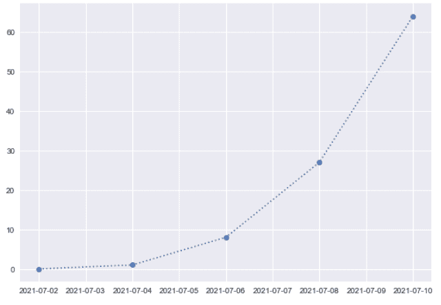

plot_date()

在上面的例子中，在 **plot_date()** 方法中，我们添加了一个参数 linestyle，并将它们的值设置为 **dotted 或':'**。

### plot_date 线条样式–虚线

**我们来看一个例子，试着理解这个概念:**

```py
# Import Libraries

# Import Libraries

import matplotlib.pyplot as plt
from datetime import datetime, timedelta
plt.style.use('dark_background')

dates = [
    datetime(2021, 10, 21),
    datetime(2021, 7, 24),
    datetime(2021, 8, 25),
    datetime(2021, 10, 26),
]

y = [2, 4, 4.5, 6]

plt.plot_date(dates, y, linestyle= 'dashed')
plt.tight_layout()
plt.show()
```

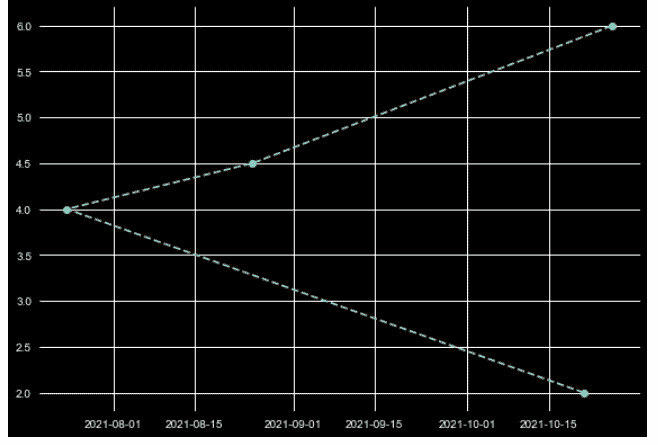

plot_date()

在上面的例子中，在 **plot_date()** 方法中，我们添加了一个参数 linestyle，并将其值设置为**虚线或'–'**。

阅读 [Matplotlib 支线剧情教程](https://pythonguides.com/matplotlib-subplot-tutorial/)

## Matplotlib 绘图 _ 日期颜色

**plot_date()** 方法主要用于绘制由日期和参数 **color** 组成的数据，该参数指定了不同的颜色，我们使用这些颜色来突出显示不同的日期绘制线。

**其语法如下:**

```py
matplotlib.pyplot.plot_date(x, y, color=None)
```

**matplotlib 中可用的不同颜色如下所示，通过使用这些颜色，您可以轻松区分线条:**

*   **蓝色:**写为‘蓝色’或‘b’。
*   **红色:**写为‘红色’或‘r’。
*   **绿色:**写为‘绿色’或‘g’。
*   **青色:**写为‘青色’或‘c’。
*   **洋红色:**写为‘洋红色’或‘m’。
*   **黄色:**写为‘黄色’或‘y’。
*   **黑色:**写为‘黑色’或‘k’。
*   **白色:**写为‘白色’或‘w’。

**让我们借助下面的例子来理解改变地块线颜色的概念:**

```py
# Import Libraries

import matplotlib.pyplot as plt
from datetime import datetime, timedelta
plt.style.use('dark_background')

dates = [
    datetime(2021, 10, 21),
    datetime(2021, 7, 24),
    datetime(2021, 8, 25),
    datetime(2021, 10, 26),
]

y = [0, 1, 2, 3]
y1= [2.5, 3.6, 2.8, 6.4]
y2= [3.6, 5.5, 9.7, 9.6]

plt.plot_date(dates, y, linestyle='dotted', color='red')
plt.plot_date(dates, y1, linestyle='solid', color='green')
plt.plot_date(dates, y2, linestyle='dashed', color='blue')

plt.tick_params(axis='x', which='major', labelsize=8)
plt.tight_layout()
plt.show()
```

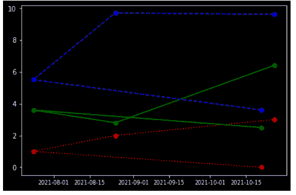

plot_date()

在上面的例子中，我们使用 **plot_date()** 方法来绘制由日期组成的数据。为了容易区分绘制的线，我们使用颜色参数。

这里我们用三条不同的数据线来绘制日期，我们用三种不同的颜色来代表它们。

读取 [Matplotlib 最佳拟合线](https://pythonguides.com/matplotlib-best-fit-line/)

## Matplotlib plot_date 日期格式

**plot_date()** 方法用于绘制日期。有时程序员想要定制刻度线的外观，我们称之为标签。因此，matplotlib 提供了更改日期格式的功能。

### 日期格式库

为了格式化 **plot_date()** 中的日期，您必须从 **matplotlib 导入库**日期**。**

**导入库的语法:**

```py
from matplotlib import dates as mpl_dates
```

### 数据格式化模块

Matplotlib 提供了一个 **DateFormatter** 模块，通过该模块，您可以根据自己的选择自定义日期的格式。

**其语法如下:**

```py
DateFormatter('%x %x')
```

在上面的语法中，每个%x 表示日期的各个部分，如**月、日、年**。

**日期的部分或%x 代表的内容:**

*   **%Y:** 大写 **Y** 代表 **4 位数**中的年份。
*   **%y:** 小写 **y** 代表 **2 位数**中的年份。
*   **%m:** 小写 **m** 表示月份为**数字**。
*   **%b:** 小写 **b** 表示月份作为**名称**。
*   **%d:** 小写 **d** 用**数字**表示日子。

**如何在日期:**中分离日、月、年

 **通常，我们使用分隔符来分隔日期的各个部分，以避免混淆。所以，我们也可以在日期之间添加一个字符作为分隔符。

我们通常使用两种分离器，如下所示:

*   **连字符**:-
*   **斜线** : \

**使用分隔符的语法如下:**

```py
DateFormatter('%x-%x')
```

**让我们借助一个例子来理解这个概念:**

```py
# Import Libraries

import pandas as pd
from datetime import datetime, timedelta
from matplotlib import pyplot as plt
from matplotlib import dates as mpl_dates

dates = [
          datetime(2021, 10, 21),
          datetime(2021, 7, 24),
          datetime(2021, 8, 25),
          datetime(2021, 10, 26),
]

y = [ 0, 1, 2, 3]

plt.plot_date(dates, y,)

date_format = mpl_dates.DateFormatter('%m/%d/%Y')
plt.gca().xaxis.set_major_formatter(date_format)

plt.tick_params(axis='x', which='major', labelsize = 7)
plt.show()
```

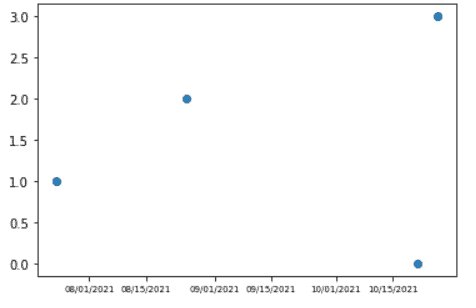

plot_date()

在上面的例子中，我们改变了日期的格式:**月为一个数字，日为一个数字，年为 4 个数字**，并使用斜线分隔符将它们分开。

**plt.gca()** 方法用于获取当前轴参考。

**xaxis . set _ major _ formatter()**方法用于设置主要跑马灯格式。

然后我们最终将 date_format 传递给**PLT . GCA(). xa six . set _ major _ formatter()**方法来对日期进行自定义格式化。

**让我们再举一个例子来更清楚地理解这一点:**

```py
# Import Libraries

import pandas as pd
from datetime import datetime, timedelta
from matplotlib import pyplot as plt
from matplotlib import dates as mpl_dates

dates = [
          datetime(2021, 10, 21),
          datetime(2021, 7, 24),
          datetime(2021, 8, 25),
          datetime(2021, 10, 26),
]

y = [ 0, 1, 2, 3]

plt.plot_date(dates, y,)

date_format = mpl_dates.DateFormatter('%b - %d - %y')
plt.gca().xaxis.set_major_formatter(date_format)

plt.tick_params(axis='x', which='major', labelsize = 6)
plt.show()
```

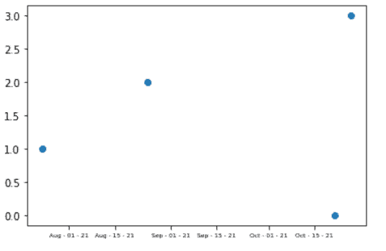

plot_date()

在上面的例子中，我们改变了日期的格式:**月作为名称，日作为数字，年作为两位数**，并使用连字符分隔符将它们分开。

**plt.gca()** 方法用于获取当前轴参考。

**xaxis . set _ major _ formatter()**方法用于设置主要跑马灯格式。

然后我们最终将 date_format 传递给**PLT . GCA(). xa six . set _ major _ formatter()**方法来对日期进行自定义格式化。

读取 [Python 字符串以列出](https://pythonguides.com/python-string-to-list/)

## Matplotlib plot_date()日期转换

由于 Matplotlib 将日期表示为浮点值，因此需要进行日期转换。

在 Python 中，日期通常表示为 datetime 对象。所以我们需要将数据转换成日期时间对象

**创建日期时间对象的语法如下:**

```py
import datetime
date = datetime.datetime(year, month, date, hour, minute, seconds, microseconds)
```

在上面的语法中，我们首先导入库 **datetime** ，然后使用方法 **datetime.datetime()** 并传递参数。

现在您有了一个 datetime 对象，所以是时候将该对象转换成格式为 **0001-01-01- 00:00:00 UTC** 的浮点数了。

**转换功能:**

下面列出的函数用于转换，我们在 **matplotlib.date()** 模块中有这些函数。

*   **date2num():** date2num()函数将 datetime 对象转换为表示天数的浮点值。此方法使用的格式是小时、分钟和秒。
*   **num2date():** num2date()函数将表示天数的浮点值转换为 datetime 对象。
*   **drange(dstart，dend，delta):** drange()函数以日期格式返回浮点值的日期范围。其中 start 表示开始日期，send 表示结束日期，delt 表示开始日期和结束日期之间的间隔或时间间隔。

**让我们借助一个例子来理解这个概念:**

```py
# Import Libraries

import datetime
import matplotlib.pyplot as plt
from matplotlib.dates import drange
import numpy as np

d1 = datetime.datetime(2021, 7, 2)
d2 = datetime.datetime(2021, 7, 12)
delta = datetime.timedelta(hours = 48)
dates = drange(d1, d2, delta)

y = np.arange(len(dates))

plt.plot_date(dates, y**3)

plt.tick_params(axis='x', which='major', labelsize=6)

plt.tight_layout()
plt.show()
```

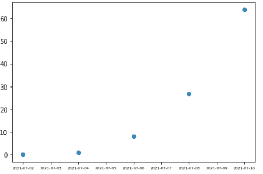

plot_date()

在上面的示例中，我们使用 **datetime.datetime()** 方法创建对象，然后使用 **drange()** 方法以日期格式获取时间间隔为 48 小时的日期范围。

读取[Matplotlib subplots _ adjust](https://pythonguides.com/matplotlib-subplots_adjust/)

## Matplotlib plot _ date x 轴上的日期

在这一节中，我们将讨论如何在 x 轴上绘制日期，以及如何设置它们的格式，以便绘图看起来清晰。

让我们看看下面的例子:

```py
# Import Libraries

import pandas as pd
from datetime import datetime, timedelta
from matplotlib import pyplot as plt
from matplotlib import dates as mpl_dates

dates = [
          datetime(2021, 10, 21),
          datetime(2021, 7, 24),
          datetime(2021, 8, 25),
          datetime(2021, 10, 26),
]

y = [ 0, 1, 2, 3]

plt.plot_date(dates, y, linestyle='solid')
plt.show()
```

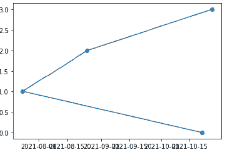

plot_date()

在上面的输出中，x 轴代表日期，但是它们看起来很乱，而且相互重叠。

**现在，看看克服这个问题的解决方案:**

在 matplotlib 中，我们有一个函数 autofmt_xdate()，用于自动格式化 x 轴上的日期。基本上，这种方法是用来旋转日期，并对齐他们的权利。

**auto fmt _ xdate()方法的语法如下:**

```py
autofmt_xdate(self, bottom=0.2, rotation=30, ha=right, which=None)
```

**在上面的语法中，使用了下面概述的参数:**

*   **底部:**底部调整支线剧情的底部。
*   **旋转:**旋转旋转 xtick 标签。
*   **ha:** 指定 xtick 标签的水平对齐方式。
*   **which:** 指定要旋转的标签。

**让我们借助一个例子来理解这个概念:**

```py
# Import Libraries

import pandas as pd
from datetime import datetime, timedelta
from matplotlib import pyplot as plt
from matplotlib import dates as mpl_dates

dates = [
          datetime(2021, 10, 21),
          datetime(2021, 7, 24),
          datetime(2021, 8, 25),
          datetime(2021, 10, 26),
]

y = [ 0, 1, 2, 3]

plt.plot_date(dates, y, linestyle='solid')
plt.gcf().autofmt_xdate()
plt.show()
```

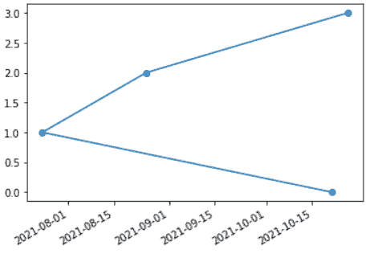

autofmt_xdate()

在上面的例子中，我们在 x 轴上绘制日期，并使用自动格式化日期的方法。

**plt.gcf()** 方法代表**获取当前图形**，用于获取当前图形的引用。

**autofmt_xdate()** 方法用于 x 轴刻度的对齐。

**结论！autofmt_xdate()** 清晰显示标注日期的图，没有重叠问题，日期清晰可见。

读取 [Matplotlib 日志日志图](https://pythonguides.com/matplotlib-log-log-plot/)

## Matplotlib plot_date 指定日期的垂直线

程序员一生中有一次需要绘制一些由日期组成的数据。绘制天气图、特定时期的出生或死亡人数、年或月的资产负债表等。在所有这些情况下，我们都需要绘制日期。

这些类型的数据大多以 CSV 文件或简单格式存储在 pandas 数据框中。

**在指定日期绘制垂直线的语法:**

```py
matplotlib.pyplot,axvline(x=0, ymin=0, ymax=1, **kwargs)
```

**在上面的语法中，使用了下面概述的参数:**

*   **x:** 在数据坐标中放置垂直线。
*   **ymin:**y 轴上的垂直线起始位置。它取 0 到 1 之间的值。0 代表轴的底部，1 代表轴的顶部。
*   **ymax**:y 轴上的垂直线结束位置。它取 0 到 1 之间的值。0 代表轴的底部，1 代表轴的顶部。
*   **kwargs:** 指定属性来改变线条的样式、颜色、线宽。

**让我们借助一个例子来理解这个概念:**

```py
# Import Libraries

import pandas as pd
from datetime import datetime, timedelta
from matplotlib import pyplot as plt
from matplotlib import dates as mpl_dates

dates = [
          datetime(2021, 10, 21),
          datetime(2021, 7, 24),
          datetime(2021, 8, 25),
          datetime(2021, 10, 26),
]

y = [ 0, 1, 2, 3]

plt.plot_date(dates, y, linestyle='solid')
plt.axvline(x='2019-09-21',color='m', linestyle="--")
plt.gcf().autofmt_xdate()
plt.show()
```

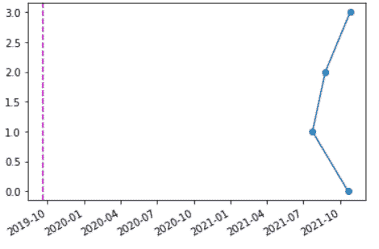

plot_date()

在上面的例子中，我们使用 **axvline()** 方法在特定日期画垂直线。

## matplotlib plot _ date xts

在本节中，我们将讨论 xticks()函数。首先理解刻度是什么意思，刻度只是用来表示坐标轴上特定点的标记。

基本上，我们有两种分笔成交点主要分笔成交点和次要分笔成交点。

每当我们绘制图形时，plot 采用默认的刻度位置和刻度标签，刻度位置是我们想要放置刻度的位置，标签是给予该刻度的名称。

默认情况下，次要刻度处于关闭状态，因此我们在图中看不到次要刻度。但是我们可以看到主要的记号，它可以采用位置和标签的默认值。

**什么是 xticks()方法:**

xticks()方法有助于更改 x 轴的刻度位置和刻度标签。

**其语法如下:**

```py
matplotlib.pyplot.xticks(ticks=None,labels=None, **kwargs)
```

**在上面的语法中，使用了下面概述的参数:**

*   **ticks:** 指定 xtick 位置的数组列表。
*   **标签:**指定放置在给定刻度位置的标签的数组列表。
*   **kwargs:** 指定额外的属性来控制 x 轴上标签的外观。

**返回:**

*   **地点:**地点列表
*   **标签:**列表中的文本对象

**让我们借助一个例子来理解这个概念:**

```py
# Import Libraries

import pandas as pd
from datetime import datetime, timedelta
from matplotlib import pyplot as plt
from matplotlib import dates as mpl_dates

dates = [
          datetime(2021, 10, 21),
          datetime(2021, 7, 24),
          datetime(2021, 8, 25),
          datetime(2021, 10, 26),
          datetime(2021, 10, 21),
          datetime(2021, 7, 24),
          datetime(2021, 8, 25),
          datetime(2021, 10, 26),
]

y = [ 0, 1, 2, 3, 5, 4, 3, 6]

plt.plot_date(dates, y, linestyle='solid')
plt.gcf().autofmt_xdate()
plt.xticks(x=['2021-08-15','2021-10-26'], color='r') 
```

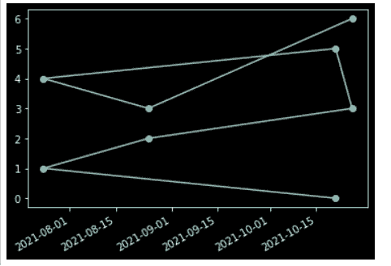

plot_date() without xticks()

上面的输出没有 xticks()方法。

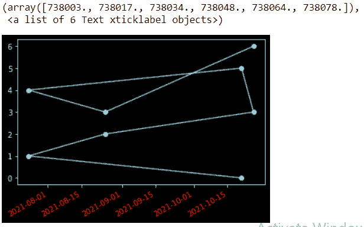

plot_date()

**上面的输出是用 xticks()方法得到的。**

在上面的示例中，我们使用 **xticks()** 方法来更改 x 轴的刻度位置和刻度标签，并将其颜色更改为红色。

**相关帖子:**

*   [Python Tkinter 事件](https://pythonguides.com/python-tkinter-events/)
*   [Django for loop](https://pythonguides.com/django-for-loop/)
*   [Matplotlib 散点图标记](https://pythonguides.com/matplotlib-scatter-marker/)
*   [Matplotlib 虚线](https://pythonguides.com/matplotlib-dashed-line/)
*   [Python 字典复制示例](https://pythonguides.com/python-dictionary-copy/)
*   [Python Tkinter 动画](https://pythonguides.com/python-tkinter-animation/)
*   [Python Django group by](https://pythonguides.com/python-django-group-by/)

在本 Python 教程中，我们已经讨论了 **"Matplotlib plot_date"** ，并且我们还介绍了一些与之相关的例子。我们在本教程中讨论了以下主题。

*   Matplotlib plot_date
*   Matplotlib plot_date line
*   Matplotlib plot_date 散点图
*   Matplotlib plot_date 多行
*   Matplotlib plot_date linestyle
*   Matplotlib plot_date color
*   Matplotlib plot_date 日期格式
*   Matplotlib plot_date 日期转换
*   Matplotlib plot _ date 轴上的日期
*   Matplotlib plot_date 指定日期的垂直线
*   Matplotlib plot_date xticks

[Bijay Kumar](https://pythonguides.com/author/fewlines4biju/)

Python 是美国最流行的语言之一。我从事 Python 工作已经有很长时间了，我在与 Tkinter、Pandas、NumPy、Turtle、Django、Matplotlib、Tensorflow、Scipy、Scikit-Learn 等各种库合作方面拥有专业知识。我有与美国、加拿大、英国、澳大利亚、新西兰等国家的各种客户合作的经验。查看我的个人资料。

[enjoysharepoint.com/](https://enjoysharepoint.com/)[](https://www.facebook.com/fewlines4biju "Facebook")[](https://www.linkedin.com/in/fewlines4biju/ "Linkedin")[](https://twitter.com/fewlines4biju "Twitter")**