# Python Tkinter 表教程

> 原文：<https://pythonguides.com/python-tkinter-table-tutorial/>

[](https://sharepointsky.teachable.com/p/python-and-machine-learning-training-course)

在本 [Python Tkinter 教程](https://pythonguides.com/python-gui-programming/)中，我们将学习**如何在 Python Tkinter** 中创建表格，我们还将涵盖与 **Tkinter 表格**相关的不同示例。我们将讨论这些话题。

*   Python Tkinter Table
*   带滚动条的 Python Tkinter 表
*   Python Tkinter Table Widget
*   Python Tkinter 表输入
*   Python Tkinter 表列表
*   Python Tkinter 表刷新
*   Python Tkinter 表格画布
*   Python Tkinter 表排序
*   Python Tkinter 可编辑表

目录

[](#)

*   [Python Tkinter Table](#Python_Tkinter_Table "Python Tkinter Table")
*   [带滚动条的 Python Tkinter 表](#Python_Tkinter_Table_with_Scrollbar "Python Tkinter Table with Scrollbar")
*   [Python Tkinter Table Widget](#Python_Tkinter_Table_Widget "Python Tkinter Table Widget")
*   [Python Tkinter 表输入](#Python_Tkinter_Table_Input "Python Tkinter Table Input")
*   [Python Tkinter 表列表](#Python_Tkinter_Table_List "Python Tkinter Table List")
*   [Python Tkinter 表刷新](#Python_Tkinter_Table_Refresh "Python Tkinter Table Refresh")
*   [Python Tkinter 表格画布](#Python_Tkinter_Table_Canvas "Python Tkinter Table Canvas")
*   [Python Tkinter 表排序](#Python_Tkinter_Table_Sort "Python Tkinter Table Sort")
*   [Python Tkinter 可编辑表格](#Python_Tkinter_Editable_Table "Python Tkinter Editable Table")

## Python Tkinter Table

在本节中，我们将了解到 **Python Tkinter 表**，并在 **Treeview** 的帮助下创建一个 Tkinter 表。 **Treeview** 指的是分层表示。

Tkinter.ttk 模块用来驱动一个树形视图，我们用这个树形视图来制作一个表格。表格对于以行和列的形式显示数据或信息很有用。

**代码:**

*   在这段代码中，我们将 **mygame。column()** 表示 Python Tkinter 表中的列。
*   **mygame.heading()** 用于显示 Python Tkinter 表中的标题。
*   **mygame.insert()** 用于在 Python Tkinter 表中插入值。
*   **ttk。Treeview()** 帮助我们创建表格。
*   **'bg** '正在用 **'#AC99F2'** 定义背景色。

```py
from tkinter import *
from  tkinter import ttk

ws  = Tk()
ws.title('PythonGuides')
ws.geometry('500x500')
ws['bg'] = '#AC99F2'

game_frame = Frame(ws)
game_frame.pack()

my_game = ttk.Treeview(game_frame)

my_game['columns'] = ('player_id', 'player_name', 'player_Rank', 'player_states', 'player_city')

my_game.column("#0", width=0,  stretch=NO)
my_game.column("player_id",anchor=CENTER, width=80)
my_game.column("player_name",anchor=CENTER,width=80)
my_game.column("player_Rank",anchor=CENTER,width=80)
my_game.column("player_states",anchor=CENTER,width=80)
my_game.column("player_city",anchor=CENTER,width=80)

my_game.heading("#0",text="",anchor=CENTER)
my_game.heading("player_id",text="Id",anchor=CENTER)
my_game.heading("player_name",text="Name",anchor=CENTER)
my_game.heading("player_Rank",text="Rank",anchor=CENTER)
my_game.heading("player_states",text="States",anchor=CENTER)
my_game.heading("player_city",text="States",anchor=CENTER)

my_game.insert(parent='',index='end',iid=0,text='',
values=('1','Ninja','101','Oklahoma', 'Moore'))
my_game.insert(parent='',index='end',iid=1,text='',
values=('2','Ranger','102','Wisconsin', 'Green Bay'))
my_game.insert(parent='',index='end',iid=2,text='',
values=('3','Deamon','103', 'California', 'Placentia'))
my_game.insert(parent='',index='end',iid=3,text='',
values=('4','Dragon','104','New York' , 'White Plains'))
my_game.insert(parent='',index='end',iid=4,text='',
values=('5','CrissCross','105','California', 'San Diego'))
my_game.insert(parent='',index='end',iid=5,text='',
values=('6','ZaqueriBlack','106','Wisconsin' , 'TONY'))

my_game.pack()

ws.mainloop()
```

**输出:**

运行这个示例后，我们得到以下输出，它以表格中的行和列的形式显示数据。

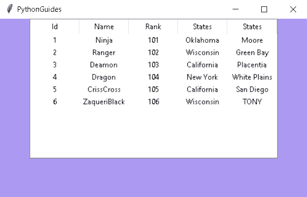

Python Tkinter Table

阅读: [Python Tkinter 测验–完整教程](https://pythonguides.com/python-tkinter-quiz/)

## 带滚动条的 Python Tkinter 表

在这一节中，我们将介绍如何创建一个带有滚动条的 python Tkinter 表。

*   有时，屏幕大小不足以显示全部数据。所以使用滚动条来浏览数据。
*   滚动条有两种类型:
    *   水平滚动条
    *   垂直滚动条

1.  **水平滚动条**允许你左右导航。
2.  **垂直滚动条**允许您上下导航。

有两种方法来实现滚动条。第一种方法是直接在主窗口上实现，第二种方法是创建一个框架，将其他小部件放在左边的**和右边的**和滚动条上。****

**源代码:**

在这个例子中，我们展示了 Python Tkinter 中的水平和垂直滚动条。

```py
from tkinter import *
from  tkinter import ttk

ws  = Tk()
ws.title('PythonGuides')
ws.geometry('500x500')
ws['bg'] = '#AC99F2'

game_frame = Frame(ws)
game_frame.pack()

**#scrollbar**
game_scroll = Scrollbar(game_frame)
game_scroll.pack(side=RIGHT, fill=Y)

game_scroll = Scrollbar(game_frame,orient='horizontal')
game_scroll.pack(side= BOTTOM,fill=X)

my_game = ttk.Treeview(game_frame,yscrollcommand=game_scroll.set, xscrollcommand =game_scroll.set)

my_game.pack()

game_scroll.config(command=my_game.yview)
game_scroll.config(command=my_game.xview)

**#define our column**

my_game['columns'] = ('player_id', 'player_name', 'player_Rank', 'player_states', 'player_city')

# format our column
my_game.column("#0", width=0,  stretch=NO)
my_game.column("player_id",anchor=CENTER, width=80)
my_game.column("player_name",anchor=CENTER,width=80)
my_game.column("player_Rank",anchor=CENTER,width=80)
my_game.column("player_states",anchor=CENTER,width=80)
my_game.column("player_city",anchor=CENTER,width=80)

**#Create Headings** 
my_game.heading("#0",text="",anchor=CENTER)
my_game.heading("player_id",text="Id",anchor=CENTER)
my_game.heading("player_name",text="Name",anchor=CENTER)
my_game.heading("player_Rank",text="Rank",anchor=CENTER)
my_game.heading("player_states",text="States",anchor=CENTER)
my_game.heading("player_city",text="States",anchor=CENTER)

**#add data** 
my_game.insert(parent='',index='end',iid=0,text='',
values=('1','Ninja','101','Oklahoma', 'Moore'))
my_game.insert(parent='',index='end',iid=1,text='',
values=('2','Ranger','102','Wisconsin', 'Green Bay'))
my_game.insert(parent='',index='end',iid=2,text='',
values=('3','Deamon','103', 'California', 'Placentia'))
my_game.insert(parent='',index='end',iid=3,text='',
values=('4','Dragon','104','New York' , 'White Plains'))
my_game.insert(parent='',index='end',iid=4,text='',
values=('5','CrissCross','105','California', 'San Diego'))
my_game.insert(parent='',index='end',iid=5,text='',
values=('6','ZaqueriBlack','106','Wisconsin' , 'TONY'))
my_game.insert(parent='',index='end',iid=6,text='',
values=('7','RayRizzo','107','Colorado' , 'Denver'))
my_game.insert(parent='',index='end',iid=7,text='',
values=('8','Byun','108','Pennsylvania' , 'ORVISTON'))
my_game.insert(parent='',index='end',iid=8,text='',
values=('9','Trink','109','Ohio' , 'Cleveland'))
my_game.insert(parent='',index='end',iid=9,text='',
values=('10','Twitch','110','Georgia' , 'Duluth'))
my_game.insert(parent='',index='end',iid=10,text='',
values=('11','Animus','111', 'Connecticut' , 'Hartford'))
my_game.pack()

ws.mainloop()
```

在上面的例子中，我们使用 **`game_scroll.pack(side=RIGHT,fill=Y)`** 作为水平滚动条，使用 **`game_scroll.pack(side= BOTTOM,fill=X)`** 作为垂直滚动条。

**输出:**

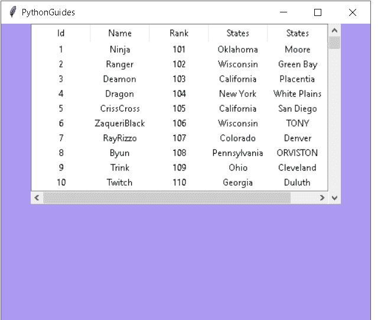

Python Tkinter Table with Scrollbar

阅读:[使用 Tkinter 中 pyqrcode 的 Python QR 码生成器](https://pythonguides.com/python-qr-code-generator/)

## Python Tkinter Table Widget

该表是行和列格式的数据的表格表示。Python Tkinter 没有一个特定的表格小部件来创建表格。

**Python Tkinter Table**widget 或 **Python Tk Table** widget 可以使用 **ttk** 包中的 **List** 、 **Pandas** 或 **Treeview** 创建。

让我们借助一个例子来理解。

```py
from tkinter import *
from  tkinter import ttk

ws  = Tk()
ws.title('PythonGuides')
ws.geometry('300x400')

set = ttk.Treeview(ws)
set.pack()

set['columns']= ('id', 'full_Name','award')
set.column("#0", width=0,  stretch=NO)
set.column("id",anchor=CENTER, width=80)
set.column("full_Name",anchor=CENTER, width=80)
set.column("award",anchor=CENTER, width=80)

set.heading("#0",text="",anchor=CENTER)
set.heading("id",text="ID",anchor=CENTER)
set.heading("full_Name",text="Full_Name",anchor=CENTER)
set.heading("award",text="Award",anchor=CENTER)

set.insert(parent='',index='end',iid=0,text='',
values=('101','john','Gold'))
set.insert(parent='',index='end',iid=1,text='',
values=('102','jack',"Silver"))
set.insert(parent='',index='end',iid=2,text='',
values=('103','joy','Bronze'))

ws.mainloop() 
```

下面是上述示例的输出。

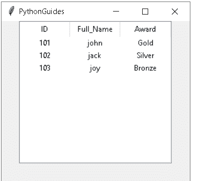

Python Tkinter Table with Scrollbar

阅读:[如何用 Python Tkinter 创建贪吃蛇游戏](https://pythonguides.com/create-a-snake-game-in-python/)

## Python Tkinter 表输入

在本节中，我们将学习如何用 Python Tkinter 创建一个包含输入字段的表。

*   首先，我们将创建一个输入字段，我们将在其中给出输入，我们给出的输入将显示在表格中。
*   它还将包含以下字段
    *   **标签:**描述单词或术语的标签。
    *   **条目:**条目，在这里我们可以给出输入。

**代码**:

因此，在这个例子中，我们使用输入框来获取输入。而当我们在输入框中输入数据作为输入时，数据就会显示在表格中。

```py
from tkinter import *
from tkinter import ttk

ws=Tk()

ws.title('PythonGuides')
ws.geometry('500x500')

set = ttk.Treeview(ws)
set.pack()

set['columns']= ('id', 'full_Name','award')
set.column("#0", width=0,  stretch=NO)
set.column("id",anchor=CENTER, width=80)
set.column("full_Name",anchor=CENTER, width=80)
set.column("award",anchor=CENTER, width=80)

set.heading("#0",text="",anchor=CENTER)
set.heading("id",text="ID",anchor=CENTER)
set.heading("full_Name",text="Full_Name",anchor=CENTER)
set.heading("award",text="Award",anchor=CENTER)

#data
data  = [
    [1,"Jack","gold"],
    [2,"Tom","Bronze"]

]

global count
count=0

for record in data:

    set.insert(parent='',index='end',iid = count,text='',values=(record[0],record[1],record[2]))

    count += 1

Input_frame = Frame(ws)
Input_frame.pack()

id = Label(Input_frame,text="ID")
id.grid(row=0,column=0)

full_Name= Label(Input_frame,text="Full_Name")
full_Name.grid(row=0,column=1)

award = Label(Input_frame,text="Award")
award.grid(row=0,column=2)

id_entry = Entry(Input_frame)
id_entry.grid(row=1,column=0)

fullname_entry = Entry(Input_frame)
fullname_entry.grid(row=1,column=1)

award_entry = Entry(Input_frame)
award_entry.grid(row=1,column=2)

def input_record():

    global count

    set.insert(parent='',index='end',iid = count,text='',values=(id_entry.get(),fullname_entry.get(),award_entry.get()))
    count += 1

    id_entry.delete(0,END)
    fullname_entry.delete(0,END)
    award_entry.delete(0,END)

#button
Input_button = Button(ws,text = "Input Record",command= input_record)

Input_button.pack()

ws.mainloop()
```

**输出:**

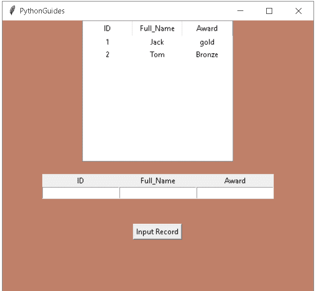

Python Tkinter Table Input

在这个表中，我们已经有了一些数据，现在要向列表中添加更多的数据，我们可以在输入框中输入。我们通过单击输入记录按钮在条目中输入的数据将显示在表格上。


Python Tkinter Table Input

点击输入记录后，我们在输入框中输入的内容将显示在表格上。

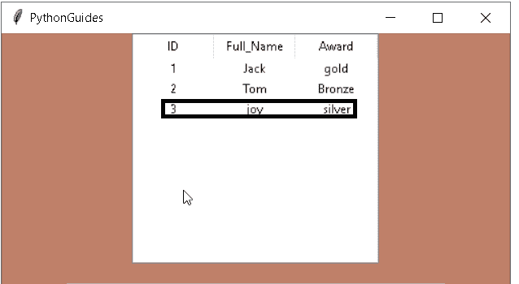

Python Tkinter Table Input example

阅读: [Python Tkinter 图片](https://pythonguides.com/python-tkinter-image/)

## Python Tkinter 表列表

在本节中，我们将学习如何使用 Python Tkinter 中的列表创建一个表。

*   我们使用 treeview 创建列表，在 treeview 中我们插入数据制作一个列表 **insert(parent= "，index，iid= None，text=")** 。
*   **Parent:**Parent 是项目，或者空字符串来创建顶层项目。
*   索引是整数或值尾。
*   这里， **iid** 是一个标识符，iid 不在表中，总是生成一个新的不同的标识符。

**代码**:

```py
from tkinter import *
from  tkinter import ttk
ws = Tk()

ws.title('PythonGuides')
ws.geometry('500x500')

list = ttk.Treeview(ws)
list.pack()

list['columns']= ('Name','Gender','Title')

list.column("#0", width=0,  stretch=NO)
list.column("Name",anchor=CENTER, width=80)
list.column("Gender",anchor=CENTER, width=80)
list.column("Title",anchor=CENTER, width=80)

list.heading("#0",text="",anchor=CENTER)
list.heading("Name",text="P_Name",anchor=CENTER)
list.heading("Gender",text="P_Gender",anchor=CENTER)
list.heading("Title",text="P_Title",anchor=CENTER)

list.insert(parent='',index='end',iid=0,text='',
values=('Todd S Core','Male','Mr'))
list.insert(parent='',index='end',iid=1,text='',
values=('Thomas C Wood','Male','Mr'))
list.insert(parent='',index='end',iid=2,text='',
values=('Misha J McKinney','Female','Mrs'))
list.insert(parent='',index='end',iid=3,text='',
values=('Teresa B Haight','Female','Ms'))
list.insert(parent='',index='end',iid=4,text='',
values=('Michael L McLaurin','Male','Mr'))
list.insert(parent='',index='end',iid=5,text='',
values=('David S Ward','Male','Mr'))
list.insert(parent='',index='end',iid=6,text='',
values=('Carolyn G Price','Feale','Mrs'))
list.insert(parent='',index='end',iid=7,text='',
values=('Diana D Lai','Female','Ms'))
list.insert(parent='',index='end',iid=8,text='',
values=('Bonnie E Duran','Female','Ms'))
list.insert(parent='',index='end',iid=9,text='',
values=('Joseph M Munger','Male','Mr'))

ws.mainloop() 
```

在这个输出中，数据以表格列表的形式显示。我们可以用数字或字符串的形式存储数据。这个表格列表只显示字符串，我们也可以在表格列表中输入数字。

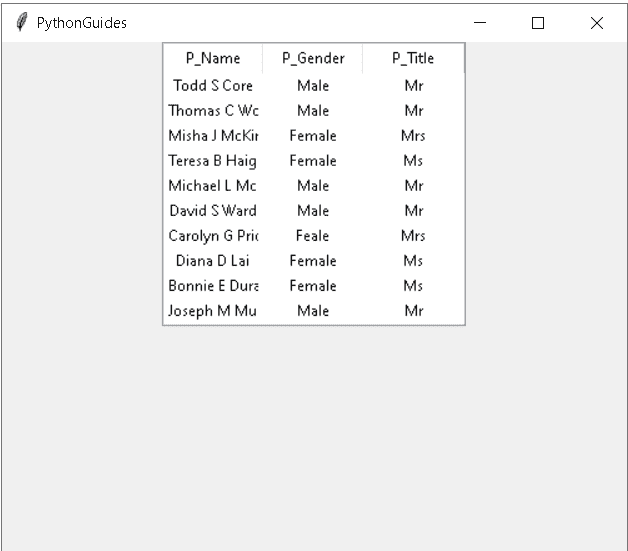

Python Tkinter Table List

阅读: [Python Tkinter Colors](https://pythonguides.com/python-tkinter-colors/)

## Python Tkinter 表刷新

在本节中，我们将学习如何在 Python Tkinter 中刷新表数据。

当我们更新表数据中的任何内容时，就会用到刷新函数。并且一旦表被刷新，更新的数据将在表中可见。

*   在下面的代码中，我们使用了类似于**名字**、 **ID** 和**等级**的标签。我们还增加了两个按钮。
*   一个按钮用于选择用户填写的记录，另一个按钮用于更新记录并刷新表中的更新结果。

**代码**:

让我们用一个例子来理解这个代码，例子的代码如下。

```py
from tkinter import *
from  tkinter import ttk

ws  = Tk()
ws.title('PythonGuides')
ws.geometry('500x500')
ws['bg'] = '#AC99F2'

game_frame = Frame(ws)
game_frame.pack()

#scrollbar
game_scroll = Scrollbar(game_frame)
game_scroll.pack(side=RIGHT, fill=Y)

game_scroll = Scrollbar(game_frame,orient='horizontal')
game_scroll.pack(side= BOTTOM,fill=X)

my_game = ttk.Treeview(game_frame,yscrollcommand=game_scroll.set, xscrollcommand =game_scroll.set)

my_game.pack()

game_scroll.config(command=my_game.yview)
game_scroll.config(command=my_game.xview)

#define our column

my_game['columns'] = ('player_id', 'player_name', 'player_Rank')

# format our column
my_game.column("#0", width=0,  stretch=NO)
my_game.column("player_id",anchor=CENTER, width=80)
my_game.column("player_name",anchor=CENTER,width=80)
my_game.column("player_Rank",anchor=CENTER,width=80)

#Create Headings 
my_game.heading("#0",text="",anchor=CENTER)
my_game.heading("player_id",text="Id",anchor=CENTER)
my_game.heading("player_name",text="Name",anchor=CENTER)
my_game.heading("player_Rank",text="Rank",anchor=CENTER)

#add data 
my_game.insert(parent='',index='end',iid=0,text='',
values=('1','Ninja','101'))
my_game.insert(parent='',index='end',iid=1,text='',
values=('2','Ranger','102'))
my_game.insert(parent='',index='end',iid=2,text='',
values=('3','Deamon','103'))
my_game.insert(parent='',index='end',iid=3,text='',
values=('4','Dragon','104'))
my_game.insert(parent='',index='end',iid=4,text='',
values=('5','CrissCross','105'))
my_game.insert(parent='',index='end',iid=5,text='',
values=('6','ZaqueriBlack','106'))
my_game.insert(parent='',index='end',iid=6,text='',
values=('7','RayRizzo','107'))
my_game.insert(parent='',index='end',iid=7,text='',
values=('8','Byun','108'))
my_game.insert(parent='',index='end',iid=8,text='',
values=('9','Trink','109'))
my_game.insert(parent='',index='end',iid=9,text='',
values=('10','Twitch','110'))
my_game.insert(parent='',index='end',iid=10,text='',
values=('11','Animus','111'))
my_game.pack()

frame = Frame(ws)
frame.pack(pady=20)

#labels
playerid= Label(frame,text = "player_id")
playerid.grid(row=0,column=0 )

playername = Label(frame,text="player_name")
playername.grid(row=0,column=1)

playerrank = Label(frame,text="Player_rank")
playerrank.grid(row=0,column=2)

#Entry boxes
playerid_entry= Entry(frame)
playerid_entry.grid(row= 1, column=0)

playername_entry = Entry(frame)
playername_entry.grid(row=1,column=1)

playerrank_entry = Entry(frame)
playerrank_entry.grid(row=1,column=2)

#Select Record
def select_record():
    #clear entry boxes
    playerid_entry.delete(0,END)
    playername_entry.delete(0,END)
    playerrank_entry.delete(0,END)

    #grab record
    selected=my_game.focus()
    #grab record values
    values = my_game.item(selected,'values')
    #temp_label.config(text=selected)

    #output to entry boxes
    playerid_entry.insert(0,values[0])
    playername_entry.insert(0,values[1])
    playerrank_entry.insert(0,values[2])

#save Record
def update_record():
    selected=my_game.focus()
    #save new data 
    my_game.item(selected,text="",values=(playerid_entry.get(),playername_entry.get(),playerrank_entry.get()))

   #clear entry boxes
    playerid_entry.delete(0,END)
    playername_entry.delete(0,END)
    playerrank_entry.delete(0,END)

#Buttons
select_button = Button(ws,text="Select Record", command=select_record)
select_button.pack(pady =10)

refresh_button = Button(ws,text="Refresh Record",command=update_record)
refresh_button.pack(pady = 10)

temp_label =Label(ws,text="")
temp_label.pack()

ws.mainloop()
```

在上面的代码中， **my_game.focus()** 用于抓取记录， **my_game.item()** 用于抓取记录值。

**输出:**

运行上面的代码后，我们将得到这样的输出，其中有一些记录条目的标签为 **player_id** 、 **Player_name** 、 **Player_record** 。我们还可以看到选择和刷新记录的按钮。

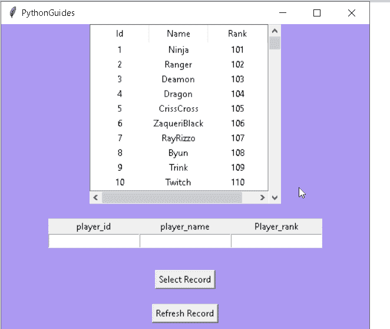

Python Tkinter Table Refresh

在这里，我们选择记录并更新**玩家名**和**玩家等级**。

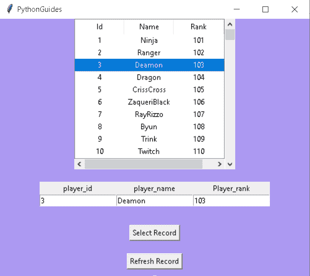

Python Tkinter Table Refresh example

在这里，我们已经更新了记录，在点击**刷新**按钮后，记录将被更新。


Refreshing Results

阅读: [Python Tkinter 自动完成](https://pythonguides.com/python-tkinter-autocomplete/)

## Python Tkinter 表格画布

在本节中，我们将学习在 Python Tkinter 中使用 canvas 创建一个表。画布用于绘制图片、图形文本或框架。

在这个例子中，我们使用 canvas 演示了一个表格。为此，我们创建了一个 3 行的表格，每行包含 3 个方块。

**代码:**

```py
from tkinter import *

list = [[0,0,0,0], [0, 0, 0, 0], [0, 0, 0, 0]]
a = len(list)     
length = 300//a 
ws = Tk()
ws.geometry("500x500")

canvas = Canvas(ws, width=500, height=500, bg="#7698A6")
canvas.pack(side=RIGHT)

for i in range(a):
    y = i * length
    for j in range(a):
        x = j * length
        canvas.create_rectangle(x, y, x+length, y+length, fill="#D97E4A")

f = Frame(ws, width=200, height=500, bg="#F23E2E")
f.pack(side=RIGHT)

ws.mainloop()
```

在上面的例子中，**canvas . create _ rectangle()**用于在画布上创建矩形块。

**输出:**

通过使用上面的代码，我们将得到一个画布输出，它有一个 3 行 3 列的表格。它还在表格中有一个网格视图，有助于分离行和列。

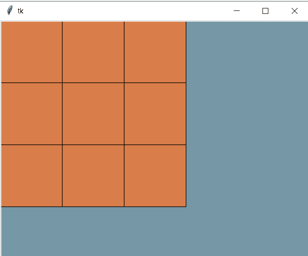

Python Tkinter Table Canvas

阅读: [Python Tkinter 滚动条](https://pythonguides.com/python-tkinter-scrollbar/)

## Python Tkinter 表排序

在这一节中，我们将学习如何在 Python Tkinter 中的表上添加一个排序过滤器。

我们正在学习表格排序，首先，我们需要了解什么是排序？
在 Python 中， **sort** 是一个用于以升序或降序的形式重新排列值的函数。但是在这里，我们讨论的是对表数据进行排序，我们将解释 Tkinter 表中的列排序是如何工作的。

**举例:**

因此，这里我们给出了一个例子，在这个例子中，我们将能够使用拖放来排列表格的列。

```py
import tkinter as tk
from tkinter import Tk, ttk

def down(event):
    global cols_from, dx, cols_from_id
    db= event.widget
    if db.identify_region(event.x, event.y) != 'separator':
        cols = db.identify_column(event.x)
        cols_from_id =db.column(cols, 'id')
        cols_from = int(cols[1:]) - 1  

        bbox = db.bbox(db.get_children("")[0], cols_from_id)
        dx = bbox[0] - event.x  
        db.heading(cols_from_id, text='')
        visual_drag.configure(displaycolumns=[cols_from_id])
        visual_drag.place(in_=db, x=bbox[0], y=0, anchor='nw', width=bbox[2], relheight=1)
    else:
        cols_from = None

def BUP(event):
    db = event.widget
    cols_to = int(db.identify_column(event.x)[1:]) - 1  
    visual_drag.place_forget()
    if cols_from is not None:
        db.heading(cols_from_id, text=visual_drag.heading('#1', 'text'))
        if cols_from != cols_to:
            Tcols = list(db["displaycolumns"])
            if Tcols[0] == "#all":
                Tcols = list(db["columns"])

            if cols_from > cols_to:
                Tcols.insert(cols_to, Tcols[col_from])
                Tcols.pop(cols_from + 1)
            else:
                Tcols.insert(cols_to + 1, Tcols[cols_from])
                Tcols.pop(cols_from)
            db.config(displaycolumns=Tcols)

def BMotion(event):

    if visual_drag.winfo_ismapped():
        visual_drag.place_configure(x=dx + event.x)

col_from = 0

ws= Tk()

columns = ["D", "C", "B", "A"]

sort = ttk.Treeview(ws, columns=columns, show='headings') 

visual_drag = ttk.Treeview(ws, columns=columns, show='headings')

for cols in columns:
    sort.heading(cols, text=cols)
    visual_drag.heading(cols, text=cols)

for i in range(10):
    sort.insert('', 'end', iid='line%i' % i,
                values=(i+50, i+40, i+30, i+20, i+10))
    visual_drag.insert('', 'end', iid='line%i' % i,
                       values=(i+50, i+40, i+30, i+20, i+10))

sort.grid()
sort.bind("<ButtonPress>", down)
sort.bind("<ButtonRelease>",BUP)
sort.bind("<Motion>",BMotion)

ws.mainloop()
```

在本例中，我们已经生成了 4 个标签，分别带有字母' **A** '、 **B** '、 **C** '和' **D** '以及一些值。但是列的排列不合适。因此，通过使用拖动方法，我们将能够根据需要对列进行排序。

**输出:**

运行下面的代码后，我们得到了这个输出，我们可以看到这些列没有按顺序排列。因为列 **C** 的值应该在列 **D** 之后。因此，这里我们只需通过鼠标悬停拖动该列，并按升序重新排列以下内容。


Unsorted Table

我们可以在这个图中看到，标签' **C** '与标签' **D** '交换，现在列已经排序。


One Sorted Column

正如我们在这个图中看到的，所有的列都按顺序排序并正确排列。


Sorted Table

阅读: [Python Tkinter 文本框小工具](https://pythonguides.com/python-tkinter-text-box/)

## Python Tkinter 可编辑表格

在本节中，我们将学习如何在 Python Tkinter 中**编辑表内的数据。**

*   在下面的代码中，我们使用了标签和按钮，其中按钮的功能是选择和编辑表中的记录。
*   通过编辑，我们指的是用户没有正确填写的任何数据，并希望在编辑功能的帮助下再次更新记录中的数据。我们可以使用编辑选项来更改记录，使我们的信息正确无误。

下面是帮助解释表内数据编辑的代码。

**代码:**

```py
from tkinter import *
from  tkinter import ttk

ws  = Tk()
ws.title('PythonGuides')
ws.geometry('500x500')
ws['bg'] = '#AC99F2'

game_frame = Frame(ws)
game_frame.pack()

**#scrollbar**
game_scroll = Scrollbar(game_frame)
game_scroll.pack(side=RIGHT, fill=Y)

game_scroll = Scrollbar(game_frame,orient='horizontal')
game_scroll.pack(side= BOTTOM,fill=X)

my_game = ttk.Treeview(game_frame,yscrollcommand=game_scroll.set, xscrollcommand =game_scroll.set)

my_game.pack()

game_scroll.config(command=my_game.yview)
game_scroll.config(command=my_game.xview)

**#define our column**

my_game['columns'] = ('player_Name', 'player_Country', 'player_Medal')

# format our column
my_game.column("#0", width=0,  stretch=NO)
my_game.column("player_Name",anchor=CENTER, width=80)
my_game.column("player_Country",anchor=CENTER,width=80)
my_game.column("player_Medal",anchor=CENTER,width=80)

**#Create Headings** 
my_game.heading("#0",text="",anchor=CENTER)
my_game.heading("player_Name",text="Id",anchor=CENTER)
my_game.heading("player_Country",text="Name",anchor=CENTER)
my_game.heading("player_Medal",text="Rank",anchor=CENTER)

 **#add data** 
my_game.insert(parent='',index='end',iid=0,text='',
values=('Tom','US','Gold'))
my_game.insert(parent='',index='end',iid=1,text='',
values=('Aandrew','Australia','NA'))
my_game.insert(parent='',index='end',iid=2,text='',
values=('Anglina','Argentina','Silver'))
my_game.insert(parent='',index='end',iid=3,text='',
values=('Shang-Chi','China','Bronze'))

my_game.pack()

frame = Frame(ws)
frame.pack(pady=20)

**#labels**
playerid= Label(frame,text = "player_id")
playerid.grid(row=0,column=0 )

playername = Label(frame,text="player_name")
playername.grid(row=0,column=1)

playerrank = Label(frame,text="Player_rank")
playerrank.grid(row=0,column=2)

**#Entry boxes**
playerid_entry= Entry(frame)
playerid_entry.grid(row= 1, column=0)

playername_entry = Entry(frame)
playername_entry.grid(row=1,column=1)

playerrank_entry = Entry(frame)
playerrank_entry.grid(row=1,column=2)

**#Select Record**
def select_record():
    #clear entry boxes
    playerid_entry.delete(0,END)
    playername_entry.delete(0,END)
    playerrank_entry.delete(0,END)

    #grab record
    selected=my_game.focus()
    #grab record values
    values = my_game.item(selected,'values')
    #temp_label.config(text=selected)

    #output to entry boxes
    playerid_entry.insert(0,values[0])
    playername_entry.insert(0,values[1])
    playerrank_entry.insert(0,values[2])

**#save Record**
def update_record():
    selected=my_game.focus()
    #save new data 
    my_game.item(selected,text="",values=(playerid_entry.get(),playername_entry.get(),playerrank_entry.get()))

   #clear entry boxes
    playerid_entry.delete(0,END)
    playername_entry.delete(0,END)
    playerrank_entry.delete(0,END)

**#Buttons**
select_button = Button(ws,text="Select Record", command=select_record)
select_button.pack(pady =10)

edit_button = Button(ws,text="Edit ",command=update_record)
edit_button.pack(pady = 10)

temp_label =Label(ws,text="")
temp_label.pack()

ws.mainloop()
```

运行上面的代码后，我们得到了下面的输出，其中显示了一些数据记录。此外，它还有两个按钮，用于选择和编辑未正确填写的记录。

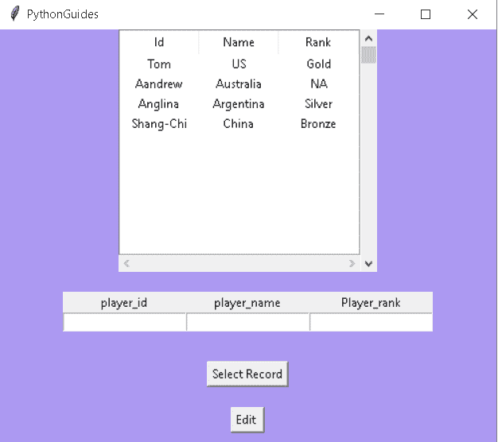

**Python Tkinter Editable Table**

在给定的图像中，它向我们展示了用户如何选择或编辑表内记录中的数据。

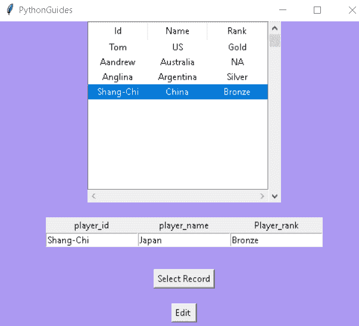

**Select record**

下图向我们展示了一个表数据中被编辑和更新的记录。

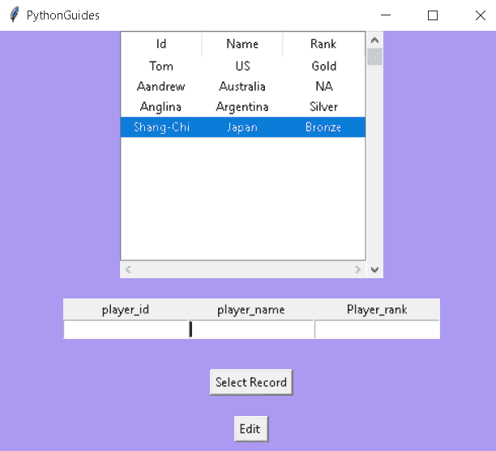

**Edited Record**

你可能也喜欢读下面的文章。

*   [Python Tkinter Grid](https://pythonguides.com/python-tkinter-grid/)
*   [Python Tkinter 选项菜单](https://pythonguides.com/python-tkinter-optionmenu/)
*   [使用 Python Tkinter 的身体质量指数计算器](https://pythonguides.com/bmi-calculator-using-python-tkinter/)
*   [Python Tkinter 编辑器](https://pythonguides.com/python-tkinter-editor/)
*   [Python Tkinter 动画](https://pythonguides.com/python-tkinter-animation/)
*   [Python Tkinter 事件](https://pythonguides.com/python-tkinter-events/)
*   [Python Tkinter 多窗口教程](https://pythonguides.com/python-tkinter-multiple-windows-tutorial/)
*   [Python Tkinter 验证示例](https://pythonguides.com/python-tkinter-validation/)

因此，在本教程中，我们讨论了 **Python 表 Tkinter** ，并且我们还涵盖了与其实现相关的不同示例。这是我们已经讨论过的例子列表。

*   带滚动条的 Python Tkinter 表
*   Python Tkinter Table Widget
*   Python Tkinter 表输入
*   Python Tkinter 表列表
*   Python Tkinter 表刷新
*   Python Tkinter 表格画布
*   Python Tkinter 表排序
*   Python Tkinter 可编辑表
*   Python Tkinter Table

[Bijay Kumar](https://pythonguides.com/author/fewlines4biju/)

Python 是美国最流行的语言之一。我从事 Python 工作已经有很长时间了，我在与 Tkinter、Pandas、NumPy、Turtle、Django、Matplotlib、Tensorflow、Scipy、Scikit-Learn 等各种库合作方面拥有专业知识。我有与美国、加拿大、英国、澳大利亚、新西兰等国家的各种客户合作的经验。查看我的个人资料。

[enjoysharepoint.com/](https://enjoysharepoint.com/)[](https://www.facebook.com/fewlines4biju "Facebook")[](https://www.linkedin.com/in/fewlines4biju/ "Linkedin")[](https://twitter.com/fewlines4biju "Twitter")